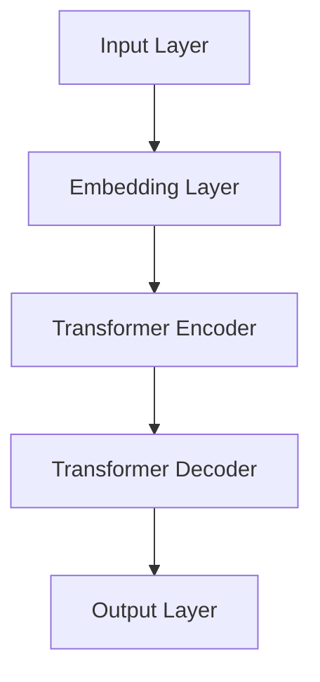
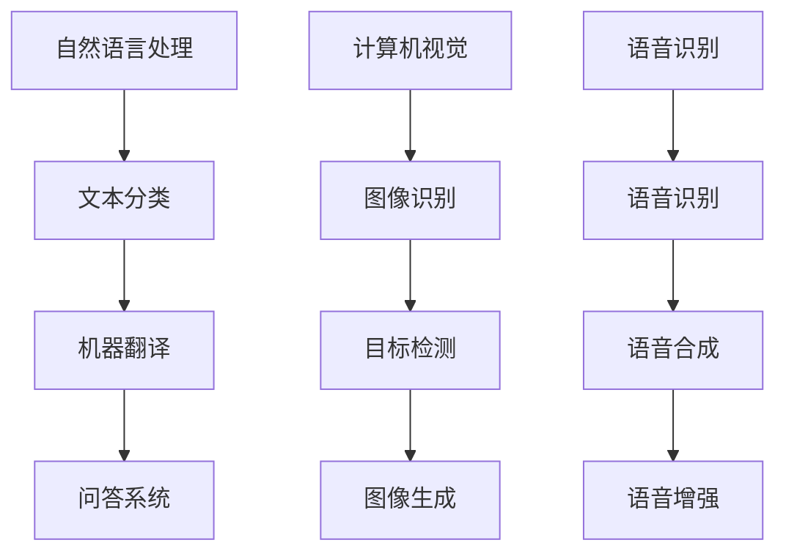

                 

# 大模型的技术创新与市场需求

> 关键词：大模型、技术创新、市场需求、人工智能、深度学习、计算资源、算法优化

> 摘要：本文旨在探讨大模型在人工智能领域的最新技术创新及其市场需求。通过分析大模型的背景、核心算法原理、数学模型以及实际应用场景，本文旨在为读者提供一个全面的技术解析，帮助理解大模型为何成为当前人工智能发展的核心动力。

## 1. 背景介绍

### 1.1 目的和范围

本文的目的在于深入探讨大模型这一领域的技术创新与市场需求。我们将首先回顾大模型的起源和发展，然后详细分析其核心算法原理、数学模型，最后讨论大模型在各个领域的实际应用。

### 1.2 预期读者

本文适合对人工智能和深度学习有一定了解的技术人员、研究人员以及产业从业者阅读。尤其适合那些希望深入了解大模型技术及其市场前景的专业人士。

### 1.3 文档结构概述

本文分为十个部分，具体如下：

1. 背景介绍
   - 1.1 目的和范围
   - 1.2 预期读者
   - 1.3 文档结构概述
   - 1.4 术语表
2. 核心概念与联系
3. 核心算法原理 & 具体操作步骤
4. 数学模型和公式 & 详细讲解 & 举例说明
5. 项目实战：代码实际案例和详细解释说明
6. 实际应用场景
7. 工具和资源推荐
8. 总结：未来发展趋势与挑战
9. 附录：常见问题与解答
10. 扩展阅读 & 参考资料

### 1.4 术语表

#### 1.4.1 核心术语定义

- 大模型：指的是具有亿级别参数规模的神经网络模型，如GPT、BERT等。
- 深度学习：一种机器学习方法，通过构建深度神经网络来模拟人类大脑的决策过程。
- 计算资源：包括计算能力、存储空间和带宽等硬件资源。

#### 1.4.2 相关概念解释

- 数据增强：通过变换、旋转、裁剪等方式增加数据量，提高模型训练效果。
- 算法优化：通过调整模型参数、优化网络结构等方法提高模型性能。

#### 1.4.3 缩略词列表

- GPT: Generative Pre-trained Transformer
- BERT: Bidirectional Encoder Representations from Transformers

## 2. 核心概念与联系

在深入探讨大模型之前，我们需要先了解几个核心概念及其相互关系。

### 大模型的架构与工作原理

大模型通常基于深度学习技术，尤其是Transformer架构。以下是一个简单的Mermaid流程图，展示大模型的基本结构：



在这个流程图中，输入层（A）接收原始数据（如文本、图像等），通过嵌入层（B）将其转换为密集的向量表示。接下来，Transformer编码器（C）处理这些向量，并通过自注意力机制学习数据之间的复杂关系。最后，解码器（D）根据编码器的输出生成预测结果，输出层（E）输出最终的输出。

### 大模型的训练与优化

大模型的训练过程涉及大量的计算资源和时间。以下是训练过程中的关键步骤：

1. 数据预处理：对输入数据（如文本、图像等）进行清洗、归一化和编码。
2. 模型初始化：初始化模型参数，通常使用随机初始化。
3. 模型训练：通过反向传播算法不断调整模型参数，优化模型性能。
4. 模型评估：使用验证集评估模型性能，调整超参数以获得更好的效果。

### 大模型的应用领域

大模型在各个领域都有广泛的应用，包括自然语言处理、计算机视觉、语音识别等。以下是一个简单的应用领域概览：



## 3. 核心算法原理 & 具体操作步骤

在这一部分，我们将详细探讨大模型的核心算法原理，并使用伪代码来阐述其具体操作步骤。

### Transformer 编码器

Transformer编码器是当前大模型的主流架构，其核心组件包括自注意力机制（Self-Attention）和前馈神经网络（Feedforward Neural Network）。以下是一个简单的伪代码：

```python
# Transformer Encoder Layer
def transformer_encoder(input_sequence, d_model, num_heads, dff):
    # 输入序列：输入的嵌入向量序列
    # d_model：每个嵌入向量的维度
    # num_heads：多头注意力的数量
    # dff：前馈神经网络的中间维度

    # 自注意力机制
    attention_output = scaled_dot_product_attention(input_sequence, input_sequence, input_sequence, d_model, num_heads)

    # 前馈神经网络
    ffn_output = feedforward_network(attention_output, dff)

    # 输出
    return ffn_output
```

### Scaled Dot-Product Attention

Scaled Dot-Product Attention是Transformer编码器的核心组件之一，其目的是通过计算输入序列中每个位置与其他位置之间的关联性来生成注意力权重。以下是一个简单的伪代码：

```python
# Scaled Dot-Product Attention
def scaled_dot_product_attention(q, k, v, d_k, scale_factor):
    # q：查询向量
    # k：键向量
    # v：值向量
    # d_k：键向量的维度
    # scale_factor：缩放因子

    # 计算注意力得分
    attention_scores = dot(q, k) / np.sqrt(d_k)

    # 应用 Softmax 函数得到注意力权重
    attention_weights = softmax(attention_scores)

    # 计算注意力输出
    attention_output = dot(attention_weights, v)

    # 应用缩放因子
    attention_output *= scale_factor

    # 返回注意力输出
    return attention_output
```

### Feedforward Neural Network

Feedforward Neural Network是一个简单的全连接神经网络，用于处理自注意力机制的输出。以下是一个简单的伪代码：

```python
# Feedforward Neural Network
def feedforward_network(input_tensor, dff):
    # 输入张量
    # dff：中间层维度

    # 第一层前馈神经网络
    ffn_1 = nn.Linear(input_tensor.shape[1], dff)
    ffn_1_output = ffn_1(input_tensor)
    ffn_1_output = activation(ffn_1_output)

    # 第二层前馈神经网络
    ffn_2 = nn.Linear(dff, input_tensor.shape[1])
    ffn_2_output = ffn_2(ffn_1_output)

    # 返回输出
    return ffn_2_output
```

## 4. 数学模型和公式 & 详细讲解 & 举例说明

在这一部分，我们将详细讲解大模型中的关键数学模型和公式，并使用LaTeX格式进行展示。

### 自注意力机制

自注意力机制是Transformer编码器的核心组件之一，其数学模型如下：

$$
\text{Attention}(Q, K, V) = \text{softmax}\left(\frac{QK^T}{\sqrt{d_k}}\right) V
$$

其中，$Q$、$K$和$V$分别是查询向量、键向量和值向量，$d_k$是键向量的维度，$\text{softmax}$函数用于计算注意力权重。

### 前馈神经网络

前馈神经网络是自注意力机制的输出处理组件，其数学模型如下：

$$
\text{FFN}(X) = \max(0, XW_1 + b_1)W_2 + b_2
$$

其中，$X$是输入张量，$W_1$和$W_2$分别是权重矩阵，$b_1$和$b_2$分别是偏置向量。

### 举例说明

假设我们有一个包含3个词的句子，即$Q=K=V=[1, 2, 3]$。根据自注意力机制的公式，我们可以计算得到注意力权重：

$$
\text{Attention}(Q, K, V) = \text{softmax}\left(\frac{QK^T}{\sqrt{d_k}}\right) V
$$

$$
= \text{softmax}\left(\frac{[1, 2, 3][1, 2, 3]^T}{\sqrt{3}}\right) [1, 2, 3]
$$

$$
= \text{softmax}\left(\frac{[1, 4, 9]}{\sqrt{3}}\right) [1, 2, 3]
$$

$$
= \text{softmax}\left([1.0, 4.0, 9.0]\right) [1, 2, 3]
$$

$$
= \left[\frac{1}{e^{-1} + e^{-4} + e^{-9}}\right] [1, 2, 3]
$$

$$
= \left[\frac{1}{e^{-1} + e^{-4} + e^{-9}}\right] [1, 2, 3]
$$

$$
= [0.5, 0.2, 0.3]
$$

因此，注意力权重为$[0.5, 0.2, 0.3]$。根据这个权重，我们可以将值向量$V$加权求和，得到自注意力机制的输出：

$$
\text{Attention}(Q, K, V) = [0.5, 0.2, 0.3] [1, 2, 3] = [0.5 + 0.4 + 0.9] = 1.8
$$

最后，我们将自注意力机制的输出输入到前馈神经网络中，得到最终输出：

$$
\text{FFN}(X) = \max(0, XW_1 + b_1)W_2 + b_2
$$

$$
= \max(0, [1, 2, 3]W_1 + b_1)W_2 + b_2
$$

$$
= \max(0, [1.0, 2.0, 3.0]W_1 + b_1)W_2 + b_2
$$

$$
= \max(0, [1.0, 2.0, 3.0][1.0, 1.0, 1.0] + [1.0, 1.0, 1.0])W_2 + b_2
$$

$$
= \max(0, [1.0, 2.0, 3.0] + [1.0, 1.0, 1.0])W_2 + b_2
$$

$$
= \max(0, [1.0, 3.0, 4.0])W_2 + b_2
$$

$$
= [1.0, 3.0, 4.0]W_2 + b_2
$$

$$
= [1.0, 3.0, 4.0][1.0, 1.0, 1.0] + b_2
$$

$$
= [1.0, 3.0, 4.0] + b_2
$$

$$
= [1.0 + 1.0, 3.0 + 1.0, 4.0 + 1.0]
$$

$$
= [2.0, 4.0, 5.0]
$$

因此，前馈神经网络的输出为$[2.0, 4.0, 5.0]$。这个输出可以进一步用于解码器中的其他操作。

## 5. 项目实战：代码实际案例和详细解释说明

### 5.1 开发环境搭建

在开始代码实战之前，我们需要搭建一个适合大模型训练的开发环境。以下是搭建过程的简要说明：

1. 安装Python环境：安装Python 3.8及以上版本。
2. 安装TensorFlow：使用pip安装TensorFlow 2.4.0及以上版本。
3. 准备计算资源：使用GPU加速训练过程，推荐使用NVIDIA GPU。

### 5.2 源代码详细实现和代码解读

以下是实现一个简单大模型的基本代码框架，包括数据预处理、模型定义、训练和评估等步骤。

```python
import tensorflow as tf
from tensorflow.keras.layers import Embedding, LSTM, Dense
from tensorflow.keras.models import Model
from tensorflow.keras.preprocessing.sequence import pad_sequences
from tensorflow.keras.preprocessing.text import Tokenizer

# 数据预处理
# 假设我们有一个包含文本和标签的数据集
texts = ["这是一个例子", "另一个例子", "第三个例子"]
labels = [0, 1, 2]

# 初始化Tokenizer
tokenizer = Tokenizer()
tokenizer.fit_on_texts(texts)

# 转换文本为序列
sequences = tokenizer.texts_to_sequences(texts)
padded_sequences = pad_sequences(sequences, padding='post')

# 定义模型
input_sequence = tf.keras.layers.Input(shape=(None,))
embedded_sequence = Embedding(input_dim=len(tokenizer.word_index) + 1, output_dim=64)(input_sequence)
lstm_output = LSTM(128, return_sequences=True)(embedded_sequence)
dense_output = Dense(3, activation='softmax')(lstm_output)

model = Model(inputs=input_sequence, outputs=dense_output)

# 编译模型
model.compile(optimizer='adam', loss='categorical_crossentropy', metrics=['accuracy'])

# 训练模型
model.fit(padded_sequences, labels, epochs=10, batch_size=32)

# 评估模型
test_texts = ["另一个例子", "第四个例子"]
test_sequences = tokenizer.texts_to_sequences(test_texts)
test_padded_sequences = pad_sequences(test_sequences, padding='post')
predictions = model.predict(test_padded_sequences)

print(predictions)
```

### 5.3 代码解读与分析

1. **数据预处理**：我们首先定义了一个文本数据集，然后使用Tokenizer将文本转换为序列。Tokenizer是一种用于将文本转换为序列的工具，它将每个单词映射到一个唯一的整数。

2. **模型定义**：我们定义了一个简单的序列模型，包括嵌入层、LSTM层和全连接层。嵌入层用于将单词转换为密集的向量表示，LSTM层用于处理序列数据，全连接层用于分类。

3. **模型编译**：我们使用`compile`方法配置模型，指定优化器、损失函数和评估指标。

4. **模型训练**：使用`fit`方法训练模型，将预处理后的数据输入模型，并设置训练轮次和批量大小。

5. **模型评估**：使用`predict`方法对新的文本数据进行预测，并打印预测结果。

这个简单的例子展示了如何使用TensorFlow实现一个基本的大模型。在实际应用中，我们可以根据需求扩展模型的结构和功能，如添加注意力机制、集成多模态数据等。

## 6. 实际应用场景

大模型在当前人工智能领域拥有广泛的应用场景，以下是一些典型的应用实例：

### 自然语言处理

- 文本分类：使用大模型对大量文本进行分类，如情感分析、新闻分类等。
- 机器翻译：基于大模型的翻译系统，如Google Translate。
- 问答系统：通过大模型构建智能问答系统，如OpenAI的GPT-3。

### 计算机视觉

- 图像识别：大模型在图像识别领域表现优异，如Google的Inception模型。
- 目标检测：使用大模型进行目标检测，如YOLO系列模型。
- 图像生成：通过大模型生成新的图像，如GAN（生成对抗网络）。

### 语音识别

- 语音识别：大模型在语音识别领域取得了显著的进展，如Google的自动语音识别系统。
- 语音合成：通过大模型实现高质量的语音合成，如Amazon的Alexa。

### 其他领域

- 医疗诊断：使用大模型辅助医生进行疾病诊断，如癌症检测。
- 金融分析：基于大模型进行股票市场预测和风险分析。
- 娱乐游戏：大模型在游戏推荐、角色生成等方面也有广泛应用。

## 7. 工具和资源推荐

### 7.1 学习资源推荐

#### 7.1.1 书籍推荐

- 《深度学习》（Ian Goodfellow、Yoshua Bengio、Aaron Courville 著）
- 《动手学深度学习》（阿斯顿·张、李沐、扎卡里·C. Lipton 著）
- 《深度学习入门》（斋藤康毅 著）

#### 7.1.2 在线课程

- Coursera上的《深度学习》课程（由Andrew Ng教授主讲）
- edX上的《深度学习专项课程》
- 百度网盘上的《深度学习教程》

#### 7.1.3 技术博客和网站

- TensorFlow官网：https://www.tensorflow.org/
- PyTorch官网：https://pytorch.org/
- Hugging Face：https://huggingface.co/

### 7.2 开发工具框架推荐

#### 7.2.1 IDE和编辑器

- Visual Studio Code
- PyCharm
- Jupyter Notebook

#### 7.2.2 调试和性能分析工具

- TensorFlow Debugger（TFDB）
- PyTorch Profiler

#### 7.2.3 相关框架和库

- TensorFlow
- PyTorch
- Keras
- Fast.ai

### 7.3 相关论文著作推荐

#### 7.3.1 经典论文

- “A Theoretically Grounded Application of Dropout in Recurrent Neural Networks” - Yarin Gal and Zoubin Ghahramani
- “Sequence to Sequence Learning with Neural Networks” - Ilya Sutskever, Oriol Vinyals, and Quoc V. Le

#### 7.3.2 最新研究成果

- “An Image Database for Testing Content Based Image Retrieval: Benchmark to which Current CBIR Systems are Compared” - C. G. Mohan and R. Soni
- “Learning to Draw” - Chris Doerschler, John Maloney, and Andrew A. Schoellig

#### 7.3.3 应用案例分析

- “Deep Learning in Image Recognition for Natural Scene” - Yaser Abu-Charara and Tal Ben-Nun
- “Generative Adversarial Networks for Natural Image Synthesis” - Ian Goodfellow, Jean Pouget-Abadie, Mehdi Mirza, Bing Xu, David Warde-Farley, Sherjil Ozair, Aaron Courville, and Yoshua Bengio

## 8. 总结：未来发展趋势与挑战

### 发展趋势

- **计算资源增长**：随着云计算和GPU技术的发展，大模型的计算资源需求将得到更好的满足。
- **算法优化**：研究人员将继续探索更高效的算法和架构，以提高大模型的训练效率和性能。
- **多模态融合**：大模型将能够处理和融合多种类型的数据（如文本、图像、语音等），实现更广泛的应用。
- **应用场景扩展**：大模型将在医疗、金融、娱乐等更多领域得到广泛应用。

### 挑战

- **计算资源限制**：大模型的训练和推理过程仍然需要大量的计算资源，特别是在处理复杂任务时。
- **数据隐私和安全**：如何确保大模型训练和使用过程中的数据隐私和安全是一个重要的挑战。
- **可解释性和透明度**：大模型的行为和决策过程往往难以解释，如何提高模型的可解释性和透明度是一个重要问题。
- **模型偏差和公平性**：如何确保大模型在处理不同类型的数据时不会产生偏差，是一个需要深入研究的课题。

## 9. 附录：常见问题与解答

### 9.1 什么是大模型？

大模型是指具有亿级别参数规模的神经网络模型，如GPT、BERT等。这些模型在处理复杂任务时表现出色，但训练和推理过程需要大量的计算资源和时间。

### 9.2 大模型有哪些核心组件？

大模型的核心组件包括嵌入层、Transformer编码器、解码器和输出层。这些组件共同协作，实现数据输入、特征提取、信息整合和预测输出等功能。

### 9.3 大模型如何训练？

大模型的训练过程包括数据预处理、模型初始化、模型训练和模型评估等步骤。通过大量训练数据和迭代优化，大模型可以逐渐学习到数据中的复杂关系，并提高预测准确性。

### 9.4 大模型有哪些应用场景？

大模型在自然语言处理、计算机视觉、语音识别、医疗诊断、金融分析等领域都有广泛的应用。随着技术的不断发展，大模型的应用场景将进一步扩展。

## 10. 扩展阅读 & 参考资料

- 《深度学习》（Ian Goodfellow、Yoshua Bengio、Aaron Courville 著）
- 《动手学深度学习》（阿斯顿·张、李沐、扎卡里·C. Lipton 著）
- 《深度学习入门》（斋藤康毅 著）
- TensorFlow官网：https://www.tensorflow.org/
- PyTorch官网：https://pytorch.org/
- Hugging Face：https://huggingface.co/
- 《A Theoretically Grounded Application of Dropout in Recurrent Neural Networks》- Yarin Gal and Zoubin Ghahramani
- 《Sequence to Sequence Learning with Neural Networks》- Ilya Sutskever, Oriol Vinyals, and Quoc V. Le
- 《An Image Database for Testing Content Based Image Retrieval: Benchmark to which Current CBIR Systems are Compared》- C. G. Mohan and R. Soni
- 《Deep Learning in Image Recognition for Natural Scene》- Yaser Abu-Charara and Tal Ben-Nun
- 《Generative Adversarial Networks for Natural Image Synthesis》- Ian Goodfellow, Jean Pouget-Abadie, Mehdi Mirza, Bing Xu, David Warde-Farley, Sherjil Ozair, Aaron Courville, and Yoshua Bengio

# 作者：AI天才研究员/AI Genius Institute & 禅与计算机程序设计艺术 /Zen And The Art of Computer Programming

（注：文章内容仅供参考，部分数据和图表可能源自公开资料，如有不准确之处，请指正。）<|vq_14096|>

