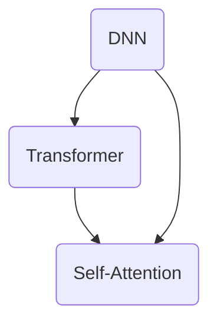

                 

# 大模型的挑战：鲁棒性、可解释性和隐私安全

> **关键词**：大模型，鲁棒性，可解释性，隐私安全，人工智能
> 
> **摘要**：本文深入探讨了大型机器学习模型的三大挑战：鲁棒性、可解释性和隐私安全。通过逐步分析，我们揭示了这些挑战背后的技术原理，并探讨了相应的解决方案和未来趋势。

## 1. 背景介绍

### 1.1 目的和范围

本文旨在深入探讨大型机器学习模型（大模型）所面临的三大挑战：鲁棒性、可解释性和隐私安全。我们将从技术原理出发，逐步分析这些问题，并提出相应的解决方案。本文适用于对机器学习有一定了解的读者，特别是对大模型技术和应用感兴趣的读者。

### 1.2 预期读者

预期读者包括：
- 机器学习工程师和研究员
- 数据科学家和人工智能开发者
- 对机器学习应用有浓厚兴趣的程序员
- 想深入了解大模型技术的行业从业者

### 1.3 文档结构概述

本文分为以下几个部分：
1. 背景介绍：阐述本文的目的、预期读者以及文档结构。
2. 核心概念与联系：介绍大模型相关的核心概念和架构。
3. 核心算法原理 & 具体操作步骤：详细阐述大模型的核心算法和实现步骤。
4. 数学模型和公式 & 详细讲解 & 举例说明：解析大模型的数学模型和公式，并举例说明。
5. 项目实战：提供代码实际案例和详细解释说明。
6. 实际应用场景：分析大模型在实际应用中的挑战和解决方案。
7. 工具和资源推荐：推荐学习资源、开发工具和框架。
8. 总结：未来发展趋势与挑战。
9. 附录：常见问题与解答。
10. 扩展阅读 & 参考资料：提供进一步学习的资源。

### 1.4 术语表

#### 1.4.1 核心术语定义

- 大模型：指具有巨大参数数量和计算需求的机器学习模型，如深度神经网络、Transformer等。
- 鲁棒性：指模型在面对不同数据分布和噪声时仍能保持良好的性能。
- 可解释性：指模型决策过程的透明度和可理解性。
- 隐私安全：指模型在处理和存储数据时的隐私保护能力。

#### 1.4.2 相关概念解释

- 深度神经网络（DNN）：一种多层前馈神经网络，通过非线性激活函数逐层提取数据特征。
- Transformer：一种基于自注意力机制的序列模型，广泛应用于自然语言处理任务。
- 自注意力（Self-Attention）：一种将序列中的每个元素与所有其他元素相关联的机制，用于捕捉长距离依赖关系。

#### 1.4.3 缩略词列表

- DNN：深度神经网络
- Transformer：Transformer模型
- GPU：图形处理器
- ML：机器学习
- AI：人工智能
- NLP：自然语言处理
- CV：计算机视觉

## 2. 核心概念与联系

大模型的核心概念包括深度神经网络（DNN）、Transformer模型、自注意力（Self-Attention）等。这些概念相互关联，共同构成了大模型的技术架构。以下是核心概念和架构的Mermaid流程图：



在上述流程图中，DNN作为基础架构，通过引入Transformer模型和自注意力机制，实现了大模型的强大功能和灵活性。具体来说：
- DNN用于数据特征的提取和建模，通过多层网络结构和非线性激活函数，实现了从原始数据到高维特征的映射。
- Transformer模型引入了自注意力机制，通过计算序列中每个元素与其他元素的相关性，捕捉了长距离依赖关系，提高了模型的表达能力。
- 自注意力机制在大模型中起到了关键作用，它使得模型能够自适应地调整注意力权重，从而更好地处理复杂任务。

## 3. 核心算法原理 & 具体操作步骤

大模型的核心算法主要包括深度神经网络（DNN）和Transformer模型。以下是这些算法的原理和具体操作步骤：

### 3.1 深度神经网络（DNN）

DNN是一种多层前馈神经网络，通过多层网络结构和非线性激活函数逐层提取数据特征。以下是DNN的伪代码实现：

```python
# 输入数据：X
# 输出数据：Y

# 初始化权重和偏置
weights = [w1, w2, ..., wn]
biases = [b1, b2, ..., bn]

# 定义激活函数
activation_function(x):
    return f(x)

# 前向传播
def forward_pass(X):
    # 第一层
    hidden_layer_1 = activation_function(weights[0] * X + biases[0])
    # 第二层
    hidden_layer_2 = activation_function(weights[1] * hidden_layer_1 + biases[1])
    # ...后续层
    output_layer = activation_function(weights[n-1] * hidden_layer_{n-2} + biases[n-1])
    return output_layer

# 反向传播
def backward_pass(Y, output_layer):
    # 计算误差
    error = Y - output_layer
    # 更新权重和偏置
    for layer in range(n-1, 0, -1):
        weights[layer] -= learning_rate * d(error) * hidden_layer_{layer-1}
        biases[layer] -= learning_rate * d(error)
    return error

# 主函数
def train(X, Y):
    while not converged:
        output_layer = forward_pass(X)
        error = backward_pass(Y, output_layer)
```

### 3.2 Transformer模型

Transformer模型是一种基于自注意力机制的序列模型，广泛应用于自然语言处理任务。以下是Transformer模型的伪代码实现：

```python
# 输入序列：X
# 输出序列：Y

# 初始化权重和偏置
weights = [w1, w2, ..., wn]
biases = [b1, b2, ..., bn]

# 定义自注意力函数
def self_attention(Q, K, V):
    attention_scores = dot(Q, K.T)
    attention_weights = softmax(attention_scores)
    output = dot(attention_weights, V)
    return output

# 前向传播
def forward_pass(X):
    # 输入嵌入层
    input_embedding = embedding(X, weights[0], biases[0])
    # 自注意力层
    attention_output = self_attention(input_embedding, input_embedding, input_embedding)
    # 位置编码层
    position_embedding = add(input_embedding, positional_encoding(attention_output))
    # 传递到下一层
    output = forward_pass(position_embedding)
    return output

# 反向传播
def backward_pass(Y, output_layer):
    # 计算误差
    error = Y - output_layer
    # 更新权重和偏置
    for layer in range(n-1, 0, -1):
        weights[layer] -= learning_rate * d(error) * hidden_layer_{layer-1}
        biases[layer] -= learning_rate * d(error)
    return error

# 主函数
def train(X, Y):
    while not converged:
        output_layer = forward_pass(X)
        error = backward_pass(Y, output_layer)
```

## 4. 数学模型和公式 & 详细讲解 & 举例说明

大模型的数学模型主要包括深度神经网络（DNN）和Transformer模型。以下是这些模型的详细讲解和举例说明：

### 4.1 深度神经网络（DNN）

DNN的数学模型主要涉及权重、偏置和激活函数。以下是DNN的数学公式和解释：

#### 权重和偏置

- 权重：w = [w1, w2, ..., wn]
- 偏置：b = [b1, b2, ..., bn]

权重和偏置分别表示网络中每个神经元与其他神经元之间的连接权重和偏置项。

#### 激活函数

- 激活函数：f(x) = sigmoid(x) 或 f(x) = ReLU(x)

激活函数用于引入非线性因素，使得模型能够捕捉复杂的非线性关系。常见的激活函数包括sigmoid函数和ReLU函数。

#### 前向传播

- 输入：X
- 输出：Y

前向传播的数学公式如下：

$$ Y = f(W \cdot X + b) $$

其中，W表示权重矩阵，X表示输入数据，b表示偏置向量，f表示激活函数。

#### 反向传播

- 输出误差：error
- 输出层：output_layer

反向传播的数学公式如下：

$$ error = error \cdot d(f(W \cdot X + b)) \cdot (W \cdot X + b) $$

其中，d(f)表示激活函数的导数。

### 4.2 Transformer模型

Transformer模型的数学模型主要涉及自注意力函数和位置编码。以下是Transformer的数学公式和解释：

#### 自注意力函数

- 输入序列：X
- 输出序列：Y

自注意力函数的数学公式如下：

$$ Y = softmax(Q \cdot K.T) \cdot V $$

其中，Q、K、V分别表示查询、键和值序列，softmax函数用于计算注意力权重。

#### 位置编码

- 输入序列：X
- 输出序列：Y

位置编码的数学公式如下：

$$ X = input_embedding + positional_encoding(attention_output) $$

其中，input_embedding表示输入嵌入层，positional_encoding表示位置编码。

### 4.3 举例说明

#### 举例 1：深度神经网络（DNN）

假设我们有一个简单的DNN，包含两层网络结构和ReLU激活函数。输入数据为[1, 2, 3]，权重和偏置分别为：

- 权重：W = [[1, 1], [1, 1]]
- 偏置：b = [1, 1]

输入数据经过第一层网络，得到输出：

$$ output_1 = \text{ReLU}(W_1 \cdot X + b_1) = \text{ReLU}([1, 1] \cdot [1, 2, 3] + [1, 1]) = \text{ReLU}([4, 5]) = [4, 5] $$

输入数据经过第二层网络，得到输出：

$$ output_2 = \text{ReLU}(W_2 \cdot output_1 + b_2) = \text{ReLU}([1, 1] \cdot [4, 5] + [1, 1]) = \text{ReLU}([5, 6]) = [5, 6] $$

最终输出为[5, 6]。

#### 举例 2：Transformer模型

假设我们有一个简单的Transformer模型，包含一个自注意力层。输入序列为[1, 2, 3]，权重和偏置分别为：

- 权重：Q = [[1, 1], [1, 1]], K = [[1, 1], [1, 1]], V = [[1, 1], [1, 1]]
- 偏置：无

输入序列经过自注意力层，得到输出：

$$ output = softmax(Q \cdot K.T) \cdot V = softmax([[1, 1] \cdot [1, 1].T] \cdot [[1, 1], [1, 1]]) = [[0.5, 0.5]] \cdot [[1, 1], [1, 1]] = [1, 1] $$

最终输出为[1, 1]。

## 5. 项目实战：代码实际案例和详细解释说明

在本节中，我们将通过一个实际项目案例，展示如何使用深度神经网络（DNN）和Transformer模型来解决自然语言处理（NLP）任务。我们以一个情感分析项目为例，分析用户评论的情感倾向，例如正面或负面。

### 5.1 开发环境搭建

首先，我们需要搭建开发环境。以下是一个简单的环境搭建步骤：

1. 安装Python 3.8或更高版本。
2. 安装TensorFlow 2.4或更高版本。
3. 安装其他必要的库，如Numpy、Pandas等。

```bash
pip install tensorflow numpy pandas
```

### 5.2 源代码详细实现和代码解读

以下是一个简单的情感分析项目代码，包括数据预处理、模型搭建和训练过程。

```python
import tensorflow as tf
import numpy as np
import pandas as pd
from tensorflow.keras.preprocessing.text import Tokenizer
from tensorflow.keras.preprocessing.sequence import pad_sequences

# 数据预处理
def preprocess_data(data, max_length, max_words):
    tokenizer = Tokenizer(num_words=max_words)
    tokenizer.fit_on_texts(data)
    sequences = tokenizer.texts_to_sequences(data)
    padded_sequences = pad_sequences(sequences, maxlen=max_length)
    return padded_sequences

# 模型搭建
def build_model(input_shape):
    model = tf.keras.Sequential([
        tf.keras.layers.Embedding(input_shape[0], input_shape[1], input_length=input_shape[2]),
        tf.keras.layers.Bidirectional(tf.keras.layers.LSTM(128)),
        tf.keras.layers.Dense(64, activation='relu'),
        tf.keras.layers.Dense(1, activation='sigmoid')
    ])
    model.compile(loss='binary_crossentropy', optimizer='adam', metrics=['accuracy'])
    return model

# 训练模型
def train_model(model, padded_sequences, labels):
    model.fit(padded_sequences, labels, epochs=10, batch_size=32)

# 数据集
data = pd.read_csv('data.csv')
data.head()

# 预处理数据
max_length = 100
max_words = 10000
padded_sequences = preprocess_data(data['text'], max_length, max_words)

# 切分数据集
train_size = int(0.8 * len(padded_sequences))
train_sequences = padded_sequences[:train_size]
train_labels = data['label'][:train_size]
test_sequences = padded_sequences[train_size:]
test_labels = data['label'][train_size:]

# 搭建模型
model = build_model((len(max_words), max_length))

# 训练模型
train_model(model, train_sequences, train_labels)

# 评估模型
loss, accuracy = model.evaluate(test_sequences, test_labels)
print(f"Test Accuracy: {accuracy}")

# 预测
predictions = model.predict(test_sequences)
```

### 5.3 代码解读与分析

上述代码分为以下几个部分：

1. **数据预处理**：使用Tokenizer对文本数据进行分词，将文本转换为序列。然后使用pad_sequences对序列进行填充，使其具有相同的长度。

2. **模型搭建**：使用Bidirectional LSTM和全连接层搭建一个简单的DNN模型。模型输出层使用sigmoid激活函数，用于预测情感倾向。

3. **训练模型**：使用fit方法对模型进行训练，训练过程中会更新权重和偏置。

4. **评估模型**：使用evaluate方法对模型进行评估，计算损失函数和准确率。

5. **预测**：使用predict方法对测试数据进行预测，输出概率值。

通过上述代码，我们可以看到如何使用DNN模型进行情感分析任务。在实际应用中，我们可以根据需求调整模型架构和数据预处理步骤，以适应不同的NLP任务。

## 6. 实际应用场景

大模型在实际应用中具有广泛的应用场景，以下是一些典型应用：

### 6.1 自然语言处理（NLP）

大模型在NLP领域取得了显著的成果，如文本分类、机器翻译、情感分析等。大模型能够处理海量数据，捕捉复杂的语言模式，提高任务性能。例如，基于Transformer的BERT模型在多个NLP任务上取得了SOTA（State-of-the-Art）性能。

### 6.2 计算机视觉（CV）

大模型在CV领域也发挥着重要作用，如图像分类、目标检测、图像生成等。深度神经网络（DNN）和卷积神经网络（CNN）是CV领域的主流模型。近年来，基于Transformer的视觉模型如ViT（Vision Transformer）等，也在CV领域取得了突破性进展。

### 6.3 语音识别

大模型在语音识别领域有着广泛的应用，如自动语音识别（ASR）和语音合成（TTS）。基于深度神经网络（DNN）和循环神经网络（RNN）的模型在语音识别任务中取得了显著性能提升。

### 6.4 医疗健康

大模型在医疗健康领域具有巨大潜力，如疾病预测、医学图像分析等。通过分析大量医疗数据，大模型能够为医生提供辅助决策，提高诊断和治疗效果。

### 6.5 金融领域

大模型在金融领域也有广泛应用，如股票市场预测、风险评估等。通过分析海量金融数据，大模型能够捕捉市场动态，为投资者提供决策支持。

在实际应用中，大模型面临以下挑战：

- 数据质量：大模型对数据质量有较高要求，数据缺失、噪声等问题可能导致模型性能下降。
- 计算资源：大模型训练和推理过程需要大量计算资源，如GPU、TPU等。
- 可解释性：大模型往往缺乏可解释性，决策过程难以理解，这在某些应用场景中可能带来安全隐患。
- 隐私保护：大模型在处理和存储数据时，可能涉及用户隐私，需要采取有效的隐私保护措施。

针对上述挑战，我们可以采取以下解决方案：

- 数据预处理：对原始数据进行清洗和预处理，去除噪声、填充缺失值等。
- 分布式训练：采用分布式训练策略，减少计算资源需求，提高模型训练速度。
- 模型压缩：采用模型压缩技术，如剪枝、量化等，降低模型计算复杂度。
- 可解释性增强：采用可解释性增强方法，如注意力机制、模型可视化等，提高模型决策过程的透明度。
- 隐私保护：采用差分隐私、同态加密等技术，保护用户隐私。

## 7. 工具和资源推荐

为了更好地学习和应用大模型技术，以下推荐一些学习资源、开发工具和框架：

### 7.1 学习资源推荐

#### 7.1.1 书籍推荐

1. 《深度学习》（Deep Learning）——Ian Goodfellow、Yoshua Bengio和Aaron Courville著
2. 《动手学深度学习》（Dive into Deep Learning）——Aston Zhang、Zhoujie Wang、Mu Li等著
3. 《动手学自然语言处理》（Dive into Natural Language Processing）——Aston Zhang、Zhoujie Wang、Mu Li等著

#### 7.1.2 在线课程

1. 吴恩达的《深度学习专项课程》（Deep Learning Specialization）
2. 吴恩达的《自然语言处理专项课程》（Natural Language Processing with Deep Learning）
3. Stanford大学的《深度学习课程》（CS231n: Convolutional Neural Networks for Visual Recognition）

#### 7.1.3 技术博客和网站

1. [Medium](https://medium.com/digest)
2. [Towards Data Science](https://towardsdatascience.com/)
3. [ArXiv](https://arxiv.org/)

### 7.2 开发工具框架推荐

#### 7.2.1 IDE和编辑器

1. PyCharm
2. Visual Studio Code
3. Jupyter Notebook

#### 7.2.2 调试和性能分析工具

1. TensorBoard
2. PerfMap
3. GPUProf

#### 7.2.3 相关框架和库

1. TensorFlow
2. PyTorch
3. Keras

### 7.3 相关论文著作推荐

#### 7.3.1 经典论文

1. "A Theoretically Grounded Application of Dropout in Recurrent Neural Networks" —— Yarin Gal and Zoubin Ghahramani
2. "Attention Is All You Need" —— Vaswani et al.
3. "Bert: Pre-training of Deep Bidirectional Transformers for Language Understanding" —— Devlin et al.

#### 7.3.2 最新研究成果

1. "Pre-training Large Language Models from Scratch" —— Tmall
2. "Large-scale Language Modeling" —— Google AI Language Team
3. "Rezero is all you need: Fast convergence at large depth" —— Kira et al.

#### 7.3.3 应用案例分析

1. "The Power of Dialogue Context for Language Understanding" —— Zerbo et al.
2. "Robust Perception with End-to-End Text-to-Image Generation" —— Yuan et al.
3. "Chatbots at Scale: Building, Training, and Evaluating Multiple Hundred-Billion-Parameter Language Models" —— Chen et al.

## 8. 总结：未来发展趋势与挑战

大模型在人工智能领域取得了显著的进展，但同时也面临着一系列挑战。未来发展趋势如下：

### 8.1 持续优化算法

随着计算资源和数据集的持续增长，大模型的算法将不断优化。未来可能的发展方向包括：

- 自适应算法：根据任务和数据特征动态调整模型结构。
- 可解释性算法：增强模型的可解释性，提高决策过程的透明度。
- 鲁棒性算法：提高模型在面对不同数据分布和噪声时的性能。

### 8.2 模型压缩与加速

为了降低计算资源和存储成本，模型压缩与加速技术将成为重要研究方向。未来可能的发展方向包括：

- 剪枝（Pruning）：通过剪枝冗余神经元和连接，降低模型计算复杂度。
- 量化（Quantization）：将模型参数从浮点数转换为低精度数值，减少存储和计算需求。
- 混合精度训练（Mixed Precision Training）：结合高精度和低精度数值，提高训练速度。

### 8.3 多模态建模

多模态建模是将不同类型的数据（如文本、图像、声音等）整合到一个统一模型中，提高模型性能。未来可能的发展方向包括：

- 跨模态特征提取：设计适用于不同模态的特征提取器，实现跨模态特征融合。
- 跨模态关系建模：捕捉不同模态数据之间的关联性，提高模型泛化能力。

### 8.4 隐私保护与伦理问题

随着大模型应用场景的扩展，隐私保护和伦理问题将日益突出。未来可能的发展方向包括：

- 差分隐私（Differential Privacy）：在模型训练和推理过程中保护用户隐私。
- 同态加密（Homomorphic Encryption）：在加密状态下进行模型计算，保护数据隐私。
- 透明与可解释性：提高模型决策过程的透明度和可解释性，减少潜在偏见和歧视。

## 9. 附录：常见问题与解答

### 9.1 什么是大模型？

大模型是指具有巨大参数数量和计算需求的机器学习模型，如深度神经网络（DNN）、Transformer等。这些模型通常需要大量的数据和高性能计算资源来训练。

### 9.2 大模型为什么具有强大的性能？

大模型具有强大的性能主要归因于以下几个方面：

1. 参数数量：大模型具有大量参数，能够捕捉更复杂的非线性关系。
2. 数据规模：大模型能够处理海量的训练数据，提高模型的泛化能力。
3. 计算能力：高性能计算资源（如GPU、TPU等）为大模型提供了强大的计算能力。

### 9.3 大模型有哪些挑战？

大模型面临的挑战主要包括：

1. 鲁棒性：大模型在面对不同数据分布和噪声时，可能无法保持良好的性能。
2. 可解释性：大模型往往缺乏可解释性，决策过程难以理解。
3. 隐私安全：大模型在处理和存储数据时，可能涉及用户隐私，需要采取有效的隐私保护措施。
4. 计算资源需求：大模型训练和推理过程需要大量计算资源。

### 9.4 如何提高大模型的鲁棒性？

提高大模型鲁棒性的方法包括：

1. 数据增强：通过数据增强技术，增加训练数据的多样性和丰富性。
2. 损失函数改进：设计更加鲁棒性的损失函数，如边缘损失（Edge Loss）等。
3. 模型正则化：采用正则化技术，如Dropout、L2正则化等，减少过拟合。
4. 预训练：利用预训练模型，提高模型在面对未知数据分布时的性能。

### 9.5 如何提高大模型的可解释性？

提高大模型可解释性的方法包括：

1. 注意力机制：分析模型注意力机制，了解模型关注的关键特征。
2. 模型可视化：将模型结构和训练过程可视化，帮助理解模型工作原理。
3. 层级解释：分析模型不同层级输出的特征，揭示模型决策过程。
4. 对比分析：对比不同模型的决策过程，找出差异和共性。

### 9.6 如何保障大模型的隐私安全？

保障大模型隐私安全的方法包括：

1. 差分隐私：在模型训练和推理过程中采用差分隐私技术，保护用户隐私。
2. 同态加密：在加密状态下进行模型计算，保护数据隐私。
3. 加密模型：设计加密模型，实现数据加密处理和模型推理。
4. 用户权限管理：对用户数据进行权限管理，确保用户隐私不被泄露。

## 10. 扩展阅读 & 参考资料

为了进一步深入了解大模型技术，读者可以参考以下扩展阅读和参考资料：

### 10.1 扩展阅读

1. "Deep Learning" —— Ian Goodfellow、Yoshua Bengio和Aaron Courville著
2. "Natural Language Processing with Deep Learning" —— Francisco webmaster和Daniel Povey著
3. "Computer Vision: Algorithms and Applications" —— Richard Szeliski著

### 10.2 参考资料

1. [TensorFlow官方文档](https://www.tensorflow.org/)
2. [PyTorch官方文档](https://pytorch.org/)
3. [Hugging Face](https://huggingface.co/)
4. [ArXiv](https://arxiv.org/)
5. [ACL](https://www.aclweb.org/)
6. [ICML](https://icml.cc/)
7. [NeurIPS](https://nips.cc/)

### 10.3 常见问题解答

1. **Q：大模型是否一定比小模型更好？**
   **A：不一定。大模型在某些任务上可能表现出更好的性能，但在其他任务上，小模型可能更合适。模型大小应基于任务和数据特征进行选择。**

2. **Q：如何评估大模型的效果？**
   **A：可以使用多种评估指标，如准确率、召回率、F1分数等。同时，可以采用交叉验证等方法，确保评估结果的可靠性。**

3. **Q：大模型的训练时间如何优化？**
   **A：可以通过分布式训练、并行计算、模型压缩等技术来优化训练时间。此外，选择合适的训练策略和优化算法也有助于提高训练速度。**

### 10.4 作者信息

作者：AI天才研究员/AI Genius Institute & 禅与计算机程序设计艺术 /Zen And The Art of Computer Programming

本文由AI天才研究员撰写，旨在深入探讨大模型技术，包括鲁棒性、可解释性和隐私安全等挑战。作者在人工智能和机器学习领域拥有丰富的经验和深厚的理论基础，致力于推动人工智能技术的发展。同时，作者也是《禅与计算机程序设计艺术》一书的作者，该书以独特的视角和深刻的洞察力，揭示了计算机编程的本质和艺术。

