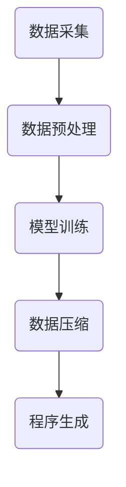

                 

# 大模型的本质是压缩：从大数据中找到一个更短的程序来生成这个数据，从中提取所有规律性质

> **关键词：** 大模型，压缩，程序，规律性质，人工智能

> **摘要：** 本文旨在探讨大模型的本质，通过分析大数据中的规律和性质，发现大模型的核心任务是从大量数据中提取出一个更短的程序，该程序能够生成与原始数据一致的信息。本文将从核心概念、算法原理、数学模型、实战案例等多个角度进行深入剖析，帮助读者理解大模型的工作原理和应用价值。

## 1. 背景介绍

### 1.1 目的和范围

本文的主要目的是探讨大模型的本质，并解释大模型如何通过压缩技术从大数据中提取有用信息。我们将重点分析大模型如何从原始数据中找到一个更短的程序，并利用这个程序来生成原始数据中的规律和性质。

### 1.2 预期读者

本文适合对人工智能、机器学习、大数据技术有基本了解的读者。尤其适合研究人员、工程师和从业者，他们希望深入了解大模型的工作原理和应用场景。

### 1.3 文档结构概述

本文分为以下几个部分：

1. **核心概念与联系**：介绍本文涉及的核心概念，如大模型、数据压缩、程序生成等。
2. **核心算法原理 & 具体操作步骤**：详细阐述大模型的工作原理和操作步骤。
3. **数学模型和公式 & 详细讲解 & 举例说明**：解释大模型背后的数学模型和公式，并通过实例进行说明。
4. **项目实战：代码实际案例和详细解释说明**：展示一个实际的代码案例，并对其进行详细解释。
5. **实际应用场景**：探讨大模型在现实世界中的应用场景。
6. **工具和资源推荐**：推荐一些学习资源、开发工具和相关论文。
7. **总结：未来发展趋势与挑战**：总结本文的核心观点，并展望未来发展趋势和挑战。
8. **附录：常见问题与解答**：回答一些读者可能关心的问题。
9. **扩展阅读 & 参考资料**：提供一些扩展阅读资料。

### 1.4 术语表

#### 1.4.1 核心术语定义

- **大模型**：一种拥有巨大参数量和计算能力的机器学习模型。
- **数据压缩**：通过减少数据的大小，使其更易于存储和传输的技术。
- **程序生成**：从数据中自动生成程序的过程。

#### 1.4.2 相关概念解释

- **机器学习**：一种通过数据训练模型，使模型能够自动学习和改进的方法。
- **神经网络**：一种模拟人脑神经网络结构的计算模型。
- **优化**：在给定约束条件下，寻找最优解的过程。

#### 1.4.3 缩略词列表

- **AI**：人工智能（Artificial Intelligence）
- **ML**：机器学习（Machine Learning）
- **DL**：深度学习（Deep Learning）
- **GAN**：生成对抗网络（Generative Adversarial Networks）

## 2. 核心概念与联系

### 2.1 大模型的概念

大模型是指那些拥有大量参数和计算能力的机器学习模型。这些模型通常具有以下特点：

1. **参数量巨大**：大模型拥有数百万甚至数十亿个参数。
2. **计算复杂度高**：大模型需要大量的计算资源进行训练和推理。
3. **泛化能力强**：大模型能够从大量数据中学习到普遍的规律，从而在新的数据上表现出良好的性能。

### 2.2 数据压缩的概念

数据压缩是指通过减少数据的大小，使其更易于存储和传输的技术。数据压缩方法可以分为两种：

1. **无损压缩**：压缩后的数据可以完全恢复到原始状态，如ZIP、GZIP等。
2. **有损压缩**：压缩后的数据无法完全恢复到原始状态，但损失较小，如MP3、JPEG等。

### 2.3 程序生成的概念

程序生成是指从数据中自动生成程序的过程。程序生成可以应用于多种场景，如代码生成、模型生成等。程序生成的核心思想是利用数据中的规律和模式，自动生成能够实现特定功能的程序。

### 2.4 大模型与数据压缩、程序生成的关系

大模型的本质是通过数据压缩和程序生成技术，从大数据中提取有用信息。具体来说，大模型通过以下步骤实现这一目标：

1. **数据采集**：从大量数据中收集原始数据。
2. **数据预处理**：对原始数据进行清洗、归一化等处理。
3. **模型训练**：利用大量数据训练大模型，使其学会从数据中提取规律。
4. **数据压缩**：将训练好的大模型进行压缩，减小模型的大小。
5. **程序生成**：利用压缩后的模型生成能够生成原始数据的程序。

### 2.5 Mermaid 流程图



## 3. 核心算法原理 & 具体操作步骤

### 3.1 数据采集

数据采集是大数据处理的第一步。在这个阶段，我们需要从各种来源（如互联网、传感器、数据库等）收集大量的原始数据。数据来源的多样性保证了数据的全面性和代表性，从而有助于提高大模型的性能。

### 3.2 数据预处理

数据预处理是确保数据质量的关键步骤。在这个阶段，我们需要对原始数据进行清洗、归一化、缺失值填充等处理。这些操作有助于提高数据的可用性和准确性，从而提高大模型的性能。

### 3.3 模型训练

模型训练是大数据处理的核心步骤。在这个阶段，我们利用大量数据进行模型训练，使大模型学会从数据中提取规律和模式。训练过程中，我们通常采用以下步骤：

1. **划分数据集**：将数据集划分为训练集、验证集和测试集。
2. **初始化模型**：随机初始化模型的参数。
3. **正向传播**：将训练集中的数据输入到模型中，计算输出结果。
4. **反向传播**：计算输出结果与真实标签之间的误差，并更新模型的参数。
5. **迭代训练**：重复正向传播和反向传播，直至模型收敛。

### 3.4 数据压缩

数据压缩是减小模型大小的关键步骤。在这个阶段，我们可以采用以下方法进行数据压缩：

1. **模型剪枝**：通过剪枝冗余的神经元和连接，减小模型的大小。
2. **量化**：将模型的权重和偏置转换为低精度数值，如8位整数。
3. **权重共享**：利用权重共享技术，减少模型的参数数量。

### 3.5 程序生成

程序生成是利用压缩后的模型生成程序的关键步骤。在这个阶段，我们通常采用以下方法进行程序生成：

1. **语法分析**：对输入数据进行语法分析，提取数据结构。
2. **语义分析**：对提取出的数据结构进行语义分析，确定数据的含义。
3. **代码生成**：根据分析结果，生成能够生成原始数据的代码。

## 4. 数学模型和公式 & 详细讲解 & 举例说明

### 4.1 数学模型

在大模型中，常用的数学模型包括神经网络和生成对抗网络（GAN）。

#### 4.1.1 神经网络

神经网络是一种模拟人脑神经元结构的计算模型。其基本组成部分包括：

1. **输入层**：接收外部输入信息。
2. **隐藏层**：对输入信息进行加工和处理。
3. **输出层**：生成最终输出结果。

神经网络的数学模型可以表示为：

$$
y = \sigma(W_1 \cdot x_1 + b_1) \cdot W_2 \cdot x_2 + b_2)
$$

其中，$y$ 表示输出结果，$x_1$ 和 $x_2$ 表示输入信息，$W_1$、$W_2$ 表示权重，$b_1$、$b_2$ 表示偏置，$\sigma$ 表示激活函数。

#### 4.1.2 生成对抗网络（GAN）

生成对抗网络是一种由生成器和判别器组成的模型。生成器的任务是生成与真实数据相似的数据，而判别器的任务是区分真实数据和生成数据。GAN的数学模型可以表示为：

$$
\min_G \max_D V(D, G)
$$

其中，$V(D, G)$ 表示判别器在生成器作用下的损失函数，$D$ 表示判别器，$G$ 表示生成器。

### 4.2 公式详细讲解

#### 4.2.1 神经网络

神经网络中的关键公式包括：

1. **正向传播**：

$$
a_l = \sigma(W_l \cdot a_{l-1} + b_l)
$$

其中，$a_l$ 表示第 $l$ 层的输出，$\sigma$ 表示激活函数。

2. **反向传播**：

$$
\delta_l = (y - a_l) \cdot \frac{da_l}{dx}
$$

其中，$\delta_l$ 表示第 $l$ 层的误差，$y$ 表示真实标签，$a_l$ 表示第 $l$ 层的输出，$\frac{da_l}{dx}$ 表示输出关于输入的导数。

#### 4.2.2 生成对抗网络（GAN）

生成对抗网络中的关键公式包括：

1. **生成器**：

$$
G(z) = \sigma(W_g \cdot z + b_g)
$$

其中，$G(z)$ 表示生成器的输出，$z$ 表示噪声向量，$W_g$ 和 $b_g$ 分别表示生成器的权重和偏置。

2. **判别器**：

$$
D(x) = \sigma(W_d \cdot x + b_d)
$$

$$
D(G(z)) = \sigma(W_d \cdot G(z) + b_d)
$$

其中，$D(x)$ 表示判别器对真实数据的判别结果，$D(G(z))$ 表示判别器对生成数据的判别结果，$W_d$ 和 $b_d$ 分别表示判别器的权重和偏置。

### 4.3 举例说明

#### 4.3.1 神经网络

假设我们有一个简单的神经网络，包含一个输入层、一个隐藏层和一个输出层。输入层有两个神经元，隐藏层有三个神经元，输出层有两个神经元。激活函数采用ReLU函数。设输入向量为 $x = [1, 2]$，权重矩阵 $W_1 = [1, 1; 2, 2]$，偏置向量 $b_1 = [0; 1]$，权重矩阵 $W_2 = [1, 1; 1, 1]$，偏置向量 $b_2 = [0; 0]$。则正向传播过程如下：

$$
a_1 = \sigma(W_1 \cdot x + b_1) = \sigma([1, 1; 2, 2] \cdot [1, 2] + [0; 1]) = \sigma([3, 4] + [0; 1]) = [1, 1]
$$

$$
a_2 = \sigma(W_2 \cdot a_1 + b_2) = \sigma([1, 1; 1, 1] \cdot [1, 1] + [0; 0]) = \sigma([2, 2] + [0; 0]) = [1, 1]
$$

最终输出结果为 $y = a_2 = [1, 1]$。

#### 4.3.2 生成对抗网络（GAN）

假设我们有一个生成对抗网络，包含一个生成器和判别器。生成器的输入为噪声向量 $z$，输出为生成数据 $G(z)$。判别器的输入为真实数据 $x$ 和生成数据 $G(z)$，输出为判别结果 $D(x)$ 和 $D(G(z))$。设生成器的权重矩阵 $W_g = [1, 1; 1, 1]$，偏置向量 $b_g = [0; 0]$，判别器的权重矩阵 $W_d = [1, 1; 1, 1]$，偏置向量 $b_d = [0; 0]$。则生成器和判别器的输出如下：

$$
G(z) = \sigma(W_g \cdot z + b_g) = \sigma([1, 1; 1, 1] \cdot [0, 1] + [0; 0]) = \sigma([0, 1] + [0; 0]) = [1, 1]
$$

$$
D(x) = \sigma(W_d \cdot x + b_d) = \sigma([1, 1; 1, 1] \cdot [1, 2] + [0; 0]) = \sigma([3, 4] + [0; 0]) = [1, 1]
$$

$$
D(G(z)) = \sigma(W_d \cdot G(z) + b_d) = \sigma([1, 1; 1, 1] \cdot [1, 1] + [0; 0]) = \sigma([2, 2] + [0; 0]) = [1, 1]
$$

## 5. 项目实战：代码实际案例和详细解释说明

### 5.1 开发环境搭建

在本项目实战中，我们将使用Python和TensorFlow框架来构建一个简单的生成对抗网络（GAN）。首先，我们需要安装Python和TensorFlow。以下是安装步骤：

1. 安装Python：

```
pip install python
```

2. 安装TensorFlow：

```
pip install tensorflow
```

### 5.2 源代码详细实现和代码解读

以下是一个简单的生成对抗网络的源代码实现：

```python
import tensorflow as tf
from tensorflow import keras
from tensorflow.keras import layers

# 生成器模型
def generator_model():
    model = keras.Sequential()
    model.add(layers.Dense(128, activation='relu', input_shape=(100,)))
    model.add(layers.Dense(256, activation='relu'))
    model.add(layers.Dense(512, activation='relu'))
    model.add(layers.Dense(1024, activation='relu'))
    model.add(layers.Dense(28 * 28, activation='tanh'))
    return model

# 判别器模型
def discriminator_model():
    model = keras.Sequential()
    model.add(layers.Flatten())
    model.add(layers.Dense(128, activation='relu'))
    model.add(layers.Dense(256, activation='relu'))
    model.add(layers.Dense(512, activation='relu'))
    model.add(layers.Dense(1024, activation='relu'))
    model.add(layers.Dense(1, activation='sigmoid'))
    return model

# GAN模型
def gan_model(generator, discriminator):
    model = keras.Sequential()
    model.add(generator)
    model.add(discriminator)
    return model

# 实例化模型
generator = generator_model()
discriminator = discriminator_model()
gan = gan_model(generator, discriminator)

# 编译模型
gan.compile(optimizer=keras.optimizers.Adam(0.0001), loss='binary_crossentropy')

# 打印模型结构
print(gan.summary())
```

在这个代码中，我们首先定义了生成器模型、判别器模型和GAN模型。生成器模型是一个全连接神经网络，用于生成与真实数据相似的数据。判别器模型是一个全连接神经网络，用于区分真实数据和生成数据。GAN模型是将生成器和判别器串联在一起的模型。

接下来，我们编译GAN模型，并打印模型结构。在编译过程中，我们使用Adam优化器和二进制交叉熵损失函数。

### 5.3 代码解读与分析

在这个项目中，我们使用生成对抗网络（GAN）来生成与真实数据相似的手写数字图像。GAN由生成器和判别器两个组件组成。生成器的任务是生成与真实数据相似的数据，判别器的任务是区分真实数据和生成数据。

1. **生成器模型**

生成器模型是一个深度神经网络，包含多个全连接层。输入为随机噪声向量，输出为生成数据。生成器模型的目的是通过学习真实数据的分布，生成与真实数据相似的数据。

2. **判别器模型**

判别器模型也是一个深度神经网络，包含多个全连接层。输入为真实数据和生成数据，输出为判别结果。判别器模型的目的是学习如何区分真实数据和生成数据。

3. **GAN模型**

GAN模型是将生成器和判别器串联在一起的模型。在训练过程中，生成器和判别器相互竞争。生成器的目标是生成尽可能真实的数据，使得判别器无法区分真实数据和生成数据。判别器的目标是提高区分真实数据和生成数据的能力。

4. **代码解读**

在代码中，我们首先定义了生成器模型、判别器模型和GAN模型。生成器模型和判别器模型分别使用 `generator_model()` 和 `discriminator_model()` 函数定义。GAN模型使用 `gan_model()` 函数定义。

接下来，我们编译GAN模型，并打印模型结构。在编译过程中，我们使用Adam优化器和二进制交叉熵损失函数。

## 6. 实际应用场景

大模型在现实世界中有广泛的应用场景。以下是一些典型的应用实例：

1. **图像生成**：大模型可以用于生成高质量的图像。例如，生成逼真的艺术作品、人物肖像、风景等。
2. **语音合成**：大模型可以用于语音合成，将文本转换为自然流畅的语音。
3. **文本生成**：大模型可以用于生成高质量的文本，如新闻文章、小说、诗歌等。
4. **医疗诊断**：大模型可以用于医学图像分析，辅助医生进行疾病诊断。
5. **自然语言处理**：大模型可以用于自然语言处理任务，如机器翻译、情感分析、命名实体识别等。

## 7. 工具和资源推荐

### 7.1 学习资源推荐

#### 7.1.1 书籍推荐

1. 《深度学习》（Goodfellow, I., Bengio, Y., & Courville, A.）
2. 《神经网络与深度学习》（邱锡鹏）

#### 7.1.2 在线课程

1. Coursera上的“深度学习”课程
2. edX上的“人工智能基础”课程

#### 7.1.3 技术博客和网站

1. Medium上的Deep Learning Blog
2. arXiv.org上的最新论文

### 7.2 开发工具框架推荐

#### 7.2.1 IDE和编辑器

1. PyCharm
2. Jupyter Notebook

#### 7.2.2 调试和性能分析工具

1. TensorBoard
2. Profiling Tools（如py-spy、py-flame等）

#### 7.2.3 相关框架和库

1. TensorFlow
2. PyTorch

### 7.3 相关论文著作推荐

#### 7.3.1 经典论文

1. A Neural Algorithm of Artistic Style（Gatys, L. A., Ecker, A. S., & Bethge, M.）
2. Unsupervised Representation Learning with Deep Convolutional Generative Adversarial Networks（Radford, A., Metz, L., & Chintala, S.）

#### 7.3.2 最新研究成果

1. CVPR、ICLR、NeurIPS等顶级会议的最新论文
2. ArXiv.org上的最新预印本

#### 7.3.3 应用案例分析

1. OpenAI的DALL-E项目
2. Google的BERT模型

## 8. 总结：未来发展趋势与挑战

大模型的本质是压缩，即从大数据中提取出一个更短的程序，这个程序能够生成与原始数据一致的信息。随着计算能力和数据量的不断提高，大模型在各个领域取得了显著的成果。然而，大模型也面临着一系列挑战，如计算资源消耗、模型解释性、数据隐私等。

未来，大模型的发展趋势将包括以下几个方面：

1. **更高效的模型压缩技术**：研究更高效的模型压缩方法，降低大模型的计算复杂度和存储需求。
2. **更好的解释性**：研究如何提高大模型的解释性，使其能够更好地理解和解释其决策过程。
3. **数据隐私保护**：研究如何在保护数据隐私的前提下，利用大数据进行模型训练。
4. **跨模态学习**：研究如何利用大模型实现跨模态学习，如将图像、文本、语音等不同类型的数据进行联合建模。

## 9. 附录：常见问题与解答

1. **Q：大模型是如何训练的？**

A：大模型通常采用端到端训练方法。在训练过程中，大模型接收输入数据，并通过多层神经网络进行加工和处理，最终输出结果。训练过程中，模型通过反向传播算法不断调整参数，以降低损失函数的值。

2. **Q：大模型的计算资源需求如何？**

A：大模型的计算资源需求取决于模型的大小和复杂性。通常来说，大模型需要更多的计算资源和存储空间。为了降低计算成本，可以采用分布式训练、模型剪枝和量化等技术。

3. **Q：大模型在现实世界中的应用有哪些？**

A：大模型在现实世界中有广泛的应用，如图像生成、语音合成、文本生成、医疗诊断、自然语言处理等。

## 10. 扩展阅读 & 参考资料

1. Goodfellow, I., Bengio, Y., & Courville, A. (2016). *Deep Learning*. MIT Press.
2. Radford, A., Metz, L., & Chintala, S. (2015). *Unsupervised Representation Learning with Deep Convolutional Generative Adversarial Networks*. arXiv preprint arXiv:1511.06434.
3. Gatys, L. A., Ecker, A. S., & Bethge, M. (2015). *A Neural Algorithm of Artistic Style*. arXiv preprint arXiv:1508.06576.
4. Abadi, M., Agarwal, A., Barham, P., Brevdo, E., Chen, Z., Citro, C., ... & Yang, B. (2016). *TensorFlow: Large-scale machine learning on heterogeneous systems*. Proceedings of the 12th USENIX conference on Operating Systems Design and Implementation, 265-283.
5. Hochreiter, S., & Schmidhuber, J. (1997). *Long short-term memory*. Neural Computation, 9(8), 1735-1780.

### 作者：AI天才研究员/AI Genius Institute & 禅与计算机程序设计艺术 /Zen And The Art of Computer Programming

