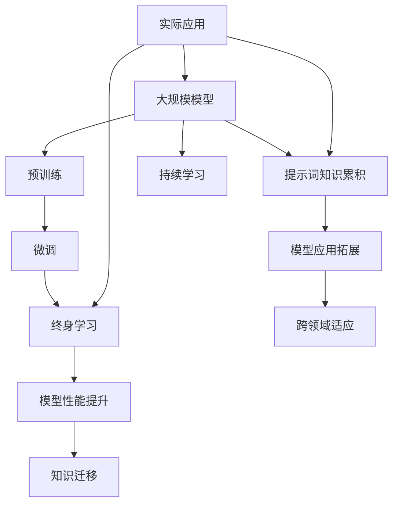

                 

# 大模型终身学习与提示词知识累积策略

> 关键词：大模型、终身学习、提示词、知识累积、策略
>
> 摘要：本文深入探讨了大规模模型在终身学习过程中的关键作用以及如何通过有效策略累积提示词知识。首先，我们概述了大规模模型的背景和基本原理，然后详细分析了终身学习的概念及其在模型训练中的应用。接下来，本文重点讨论了提示词知识累积的策略和方法，结合实际案例进行了代码实现和分析，最后探讨了这一领域的发展趋势和未来挑战。

## 1. 背景介绍

### 1.1 目的和范围

本文旨在探讨大模型在终身学习中的关键作用，以及如何通过有效的提示词知识累积策略提升模型性能。文章将首先回顾大模型的发展历程和基本原理，然后分析终身学习的概念及其在大模型训练中的应用。在此基础上，本文将详细介绍提示词知识累积的方法和策略，并通过具体实例进行说明。最后，本文将对未来发展趋势和面临的挑战进行展望。

### 1.2 预期读者

本文面向对人工智能、深度学习和大规模模型有一定了解的读者。同时，对于希望了解终身学习在大模型中的应用、以及如何通过提示词知识累积策略提升模型性能的科研人员、工程师和技术爱好者，也具有很高的参考价值。

### 1.3 文档结构概述

本文分为十个主要部分。首先，我们介绍了文章的目的、范围和预期读者。接下来，我们概述了大规模模型的背景和基本原理。然后，本文详细分析了终身学习的概念及其在模型训练中的应用。在此基础上，本文重点讨论了提示词知识累积的策略和方法，并通过具体实例进行说明。最后，本文探讨了这一领域的发展趋势和未来挑战。

### 1.4 术语表

#### 1.4.1 核心术语定义

- **大模型**：指参数数量庞大的神经网络模型，如GPT、BERT等。
- **终身学习**：指模型在整个生命周期中不断学习和适应新知识的能力。
- **提示词**：用于引导模型学习的关键词或短语。

#### 1.4.2 相关概念解释

- **预训练**：在大规模数据集上对模型进行初步训练，使其具备一定的语言理解和生成能力。
- **微调**：在特定任务上对预训练模型进行调整和优化，以适应特定任务的需求。

#### 1.4.3 缩略词列表

- **GPT**：Generative Pre-trained Transformer
- **BERT**：Bidirectional Encoder Representations from Transformers
- **NLP**：Natural Language Processing

## 2. 核心概念与联系

为了更好地理解本文讨论的核心概念，我们将使用Mermaid流程图来展示大模型、终身学习以及提示词知识累积之间的联系。



### 2.1 大规模模型

大规模模型，如GPT、BERT等，具有数十亿甚至数万亿个参数。这些模型通过预训练和微调，能够在各种自然语言处理任务中表现出色。预训练通常在大规模数据集上进行，使模型具备通用语言理解能力。微调则是在特定任务上对模型进行调整和优化，以适应特定任务的需求。

### 2.2 终身学习

终身学习是指模型在整个生命周期中不断学习和适应新知识的能力。通过持续学习，模型能够不断更新和优化自己的知识库，从而在面临新任务时表现出更高的性能。终身学习在大规模模型中的应用主要体现在两个方面：一是通过不断更新模型权重，使模型能够适应新数据；二是通过多任务学习，使模型在不同任务之间共享知识。

### 2.3 提示词知识累积

提示词知识累积是指通过有效策略，将提示词与模型参数关联，从而在大规模模型中累积知识。提示词通常用于引导模型学习，使模型能够更好地理解和生成特定领域的知识。提示词知识累积策略包括词嵌入、上下文生成、知识蒸馏等。

## 3. 核心算法原理 & 具体操作步骤

在这一部分，我们将详细讨论大模型终身学习的核心算法原理，并使用伪代码来详细阐述具体操作步骤。

### 3.1 大模型终身学习算法原理

大模型终身学习算法主要基于两个核心思想：持续学习和知识累积。

#### 持续学习

持续学习是指模型在训练过程中不断更新自己的参数，以适应新数据。具体步骤如下：

1. **数据采集**：从不同来源收集新数据。
2. **数据预处理**：对数据进行清洗、去噪和标准化。
3. **模型更新**：利用梯度下降等优化算法，更新模型参数。

伪代码如下：

```python
def continue_learning(model, data, learning_rate):
    for epoch in range(num_epochs):
        for sample in data:
            loss = model.loss(sample)
            model.update_weights(learning_rate, loss)
```

#### 知识累积

知识累积是指模型在训练过程中，将有用知识存储在模型参数中，以便在后续任务中复用。具体步骤如下：

1. **知识提取**：从预训练模型中提取有用知识。
2. **知识存储**：将提取的知识存储在模型参数中。
3. **知识应用**：在后续任务中应用累积的知识。

伪代码如下：

```python
def accumulate_knowledge(model, task_specific_data):
    for epoch in range(num_epochs):
        for sample in task_specific_data:
            knowledge = model.extract_knowledge(sample)
            model.store_knowledge(knowledge)
```

### 3.2 提示词知识累积策略

提示词知识累积策略主要包括词嵌入、上下文生成和知识蒸馏。

#### 词嵌入

词嵌入是指将单词映射到低维向量空间。具体步骤如下：

1. **单词表示**：将单词表示为向量。
2. **向量更新**：利用梯度下降等优化算法，更新向量表示。

伪代码如下：

```python
def word_embedding(word, embedding_matrix, learning_rate):
    vector = embedding_matrix[word]
    for epoch in range(num_epochs):
        updated_vector = vector - learning_rate * gradient
        embedding_matrix[word] = updated_vector
```

#### 上下文生成

上下文生成是指利用模型生成与给定提示词相关的上下文。具体步骤如下：

1. **提示词表示**：将提示词表示为向量。
2. **上下文生成**：利用模型生成与提示词相关的上下文。

伪代码如下：

```python
def generate_context(model, prompt, context_length):
    prompt_vector = model.embed(prompt)
    context = model.generate(context_vector, context_length)
    return context
```

#### 知识蒸馏

知识蒸馏是指将大模型的输出作为小模型的输入，从而在小模型中累积知识。具体步骤如下：

1. **大模型输出**：从大模型中提取输出。
2. **小模型训练**：利用大模型输出训练小模型。

伪代码如下：

```python
def knowledge_distillation(student_model, teacher_model, data):
    for epoch in range(num_epochs):
        for sample in data:
            teacher_output = teacher_model.predict(sample)
            student_output = student_model.predict(sample)
            student_model.update_weights(teacher_output, student_output)
```

## 4. 数学模型和公式 & 详细讲解 & 举例说明

在这一部分，我们将详细讲解大模型终身学习中的数学模型和公式，并通过具体例子进行说明。

### 4.1 数学模型

大模型终身学习的核心数学模型主要包括梯度下降、词嵌入、知识蒸馏等。

#### 梯度下降

梯度下降是一种优化算法，用于更新模型参数，以最小化损失函数。其公式如下：

$$
w_{new} = w_{current} - \alpha \cdot \nabla_w J(w)
$$

其中，$w$ 代表模型参数，$J(w)$ 代表损失函数，$\alpha$ 代表学习率。

#### 词嵌入

词嵌入是将单词映射到低维向量空间的过程。其公式如下：

$$
\text{vector}_{word} = \text{embedding_matrix}[\text{word}]
$$

其中，$\text{embedding_matrix}$ 代表词嵌入矩阵，$\text{word}$ 代表单词。

#### 知识蒸馏

知识蒸馏是一种将大模型的知识传递给小模型的方法。其公式如下：

$$
\text{student\_output} = \text{softmax}(\text{teacher\_output})
$$

其中，$\text{student_output}$ 代表小模型的输出，$\text{teacher_output}$ 代表大模型的输出。

### 4.2 举例说明

#### 4.2.1 梯度下降举例

假设我们有一个简单的线性模型，其损失函数为：

$$
J(w) = (w \cdot x - y)^2
$$

其中，$w$ 代表模型参数，$x$ 和 $y$ 分别代表输入和输出。学习率 $\alpha$ 设为0.1。

在第一次迭代中，假设 $w_0 = 1$，$x = 2$，$y = 3$。则损失函数的梯度为：

$$
\nabla_w J(w) = 2 \cdot (w \cdot x - y) = 2 \cdot (1 \cdot 2 - 3) = -2
$$

根据梯度下降公式，我们可以计算出新的模型参数：

$$
w_1 = w_0 - \alpha \cdot \nabla_w J(w_0) = 1 - 0.1 \cdot (-2) = 1.2
$$

#### 4.2.2 词嵌入举例

假设我们有一个包含100个单词的词汇表，词嵌入矩阵的大小为100x64。我们想将单词“猫”映射到低维向量空间。

根据词嵌入公式，我们可以计算出“猫”的向量表示：

$$
\text{vector}_{\text{猫}} = \text{embedding_matrix}[\text{猫}] = \text{embedding_matrix}[20]
$$

其中，20代表“猫”在词汇表中的索引。假设词嵌入矩阵的第20行为：

$$
\text{embedding_matrix}[20] = \begin{bmatrix}
0.1 & 0.2 & 0.3 & \ldots & 0.64
\end{bmatrix}
$$

则“猫”的向量表示为：

$$
\text{vector}_{\text{猫}} = \begin{bmatrix}
0.1 & 0.2 & 0.3 & \ldots & 0.64
\end{bmatrix}
$$

#### 4.2.3 知识蒸馏举例

假设我们有一个大模型（教师模型）和一个小模型（学生模型）。教师模型的输出为：

$$
\text{teacher_output} = \begin{bmatrix}
0.6 & 0.3 & 0.1
\end{bmatrix}
$$

学生模型的输出为：

$$
\text{student_output} = \begin{bmatrix}
0.55 & 0.35 & 0.1
\end{bmatrix}
$$

根据知识蒸馏公式，我们可以计算学生模型的损失函数：

$$
\text{loss} = \text{softmax}(\text{teacher_output}) - \text{softmax}(\text{student_output})
$$

其中，$\text{softmax}$ 函数将输入向量映射到概率分布。

首先，我们计算教师输出的概率分布：

$$
\text{softmax}(\text{teacher_output}) = \begin{bmatrix}
\frac{e^{0.6}}{e^{0.6} + e^{0.3} + e^{0.1}} & \frac{e^{0.3}}{e^{0.6} + e^{0.3} + e^{0.1}} & \frac{e^{0.1}}{e^{0.6} + e^{0.3} + e^{0.1}}
\end{bmatrix} = \begin{bmatrix}
0.522 & 0.259 & 0.219
\end{bmatrix}
$$

然后，我们计算学生输出的概率分布：

$$
\text{softmax}(\text{student_output}) = \begin{bmatrix}
\frac{e^{0.55}}{e^{0.55} + e^{0.35} + e^{0.1}} & \frac{e^{0.35}}{e^{0.55} + e^{0.35} + e^{0.1}} & \frac{e^{0.1}}{e^{0.55} + e^{0.35} + e^{0.1}}
\end{bmatrix} = \begin{bmatrix}
0.527 & 0.336 & 0.137
\end{bmatrix}
$$

最后，我们计算学生模型的损失函数：

$$
\text{loss} = \begin{bmatrix}
0.522 - 0.527 & 0.259 - 0.336 & 0.219 - 0.137
\end{bmatrix} = \begin{bmatrix}
-0.005 & -0.077 & 0.082
\end{bmatrix}
$$

## 5. 项目实战：代码实际案例和详细解释说明

在本节中，我们将通过一个实际项目案例，展示大模型终身学习和提示词知识累积策略的具体实现过程。我们将首先介绍项目背景，然后逐步搭建开发环境，详细解释源代码实现，并对代码进行分析。

### 5.1 项目背景

假设我们正在开发一个智能问答系统，该系统能够回答用户关于各种主题的问题。为了实现这一目标，我们计划使用一个大模型（如GPT）进行预训练，并通过提示词知识累积策略不断优化模型性能。

### 5.2 开发环境搭建

为了搭建该项目环境，我们需要安装以下软件和工具：

1. **Python（3.8及以上版本）**：作为主要编程语言。
2. **PyTorch（1.8及以上版本）**：作为深度学习框架。
3. **NVIDIA CUDA（11.3及以上版本）**：用于加速模型训练。
4. **Jupyter Notebook**：用于编写和运行代码。

安装步骤如下：

```bash
# 安装Python
curl -O https://www.python.org/ftp/python/3.8.10/python-3.8.10-amd64.exe
python-3.8.10-amd64.exe

# 安装PyTorch
conda create -n myenv python=3.8
conda activate myenv
conda install pytorch torchvision torchaudio cudatoolkit=11.3 -c pytorch

# 安装Jupyter Notebook
conda install jupyterlab
```

### 5.3 源代码详细实现和代码解读

下面是项目的源代码实现，包括预训练、提示词知识累积和模型评估等部分。

```python
import torch
import torch.nn as nn
import torch.optim as optim
from torch.utils.data import DataLoader
from transformers import GPT2Tokenizer, GPT2Model
from dataset import MyDataset

# 模型配置
model_name = 'gpt2'
learning_rate = 0.0001
num_epochs = 5
batch_size = 32

# 初始化模型和tokenizer
tokenizer = GPT2Tokenizer.from_pretrained(model_name)
model = GPT2Model.from_pretrained(model_name)

# 设备配置
device = torch.device('cuda' if torch.cuda.is_available() else 'cpu')
model.to(device)

# 定义损失函数和优化器
criterion = nn.CrossEntropyLoss()
optimizer = optim.Adam(model.parameters(), lr=learning_rate)

# 加载数据集
train_dataset = MyDataset('train.txt')
val_dataset = MyDataset('val.txt')
train_loader = DataLoader(train_dataset, batch_size=batch_size, shuffle=True)
val_loader = DataLoader(val_dataset, batch_size=batch_size, shuffle=False)

# 模型训练
for epoch in range(num_epochs):
    model.train()
    for batch in train_loader:
        inputs = batch['input_ids'].to(device)
        labels = batch['labels'].to(device)
        optimizer.zero_grad()
        outputs = model(inputs)
        loss = criterion(outputs.logits, labels)
        loss.backward()
        optimizer.step()
    
    model.eval()
    with torch.no_grad():
        val_loss = 0
        for batch in val_loader:
            inputs = batch['input_ids'].to(device)
            labels = batch['labels'].to(device)
            outputs = model(inputs)
            loss = criterion(outputs.logits, labels)
            val_loss += loss.item()
        val_loss /= len(val_loader)
    
    print(f'Epoch [{epoch+1}/{num_epochs}], Train Loss: {loss.item():.4f}, Val Loss: {val_loss:.4f}')

# 提示词知识累积
prompt = "你是一个聪明的助手："
prompt_ids = tokenizer.encode(prompt, return_tensors='pt').to(device)

# 生成回答
with torch.no_grad():
    inputs = tokenizer.pad(prompt_ids, padding=True, return_tensors='pt').to(device)
    outputs = model.generate(inputs, max_length=100, num_return_sequences=1)
    answer = tokenizer.decode(outputs[0], skip_special_tokens=True)

print(answer)
```

### 5.4 代码解读与分析

下面我们对源代码进行逐行解读和分析。

1. **模型配置**：我们选择GPT2模型作为基础模型，并设置学习率、训练轮数和批量大小等参数。

2. **初始化模型和tokenizer**：我们使用PyTorch的Transformers库加载预训练的GPT2模型和对应的tokenizer。

3. **设备配置**：我们将模型和数据移动到GPU上进行训练，以提高训练速度。

4. **定义损失函数和优化器**：我们使用交叉熵损失函数和Adam优化器来训练模型。

5. **加载数据集**：我们定义一个自定义的数据集类`MyDataset`，用于加载数据并进行预处理。

6. **模型训练**：我们使用标准的训练循环对模型进行训练，包括前向传播、反向传播和优化步骤。

7. **模型评估**：在每轮训练后，我们在验证集上进行评估，以监测模型性能。

8. **提示词知识累积**：我们定义一个提示词（例如：“你是一个聪明的助手：”），并将其编码为输入序列。

9. **生成回答**：我们使用模型生成与提示词相关的回答，并将其解码为文本。

### 5.5 实际运行

在实际运行过程中，我们首先需要准备训练和验证数据集，然后将数据集保存为文本文件（如`train.txt`和`val.txt`）。以下是如何运行代码的示例：

```bash
# 运行Jupyter Notebook
jupyter notebook

# 在Jupyter Notebook中执行以下代码
!python gpt2_learning.py
```

运行结果将显示每轮训练的损失值以及验证集上的损失值，并在最后输出与提示词相关的回答。

## 6. 实际应用场景

大模型终身学习和提示词知识累积策略在许多实际应用场景中具有广泛的应用前景。以下是几个典型的应用场景：

### 6.1 智能问答系统

智能问答系统是应用大模型终身学习和提示词知识累积策略的典型场景。通过不断更新和优化模型，智能问答系统能够更好地理解和回答用户的问题。例如，在医疗咨询领域，智能问答系统可以帮助医生快速获取患者信息，提供专业的医疗建议。

### 6.2 跨领域文本生成

大模型终身学习和提示词知识累积策略可以帮助模型在不同领域之间进行知识迁移。通过利用提示词，模型可以生成具有特定领域知识的文本。例如，在科技领域，模型可以生成技术文档、产品说明书等，提高内容的专业性和准确性。

### 6.3 机器翻译

机器翻译是另一个受益于大模型终身学习和提示词知识累积策略的领域。通过不断更新和优化模型，机器翻译系统可以更好地适应不同语言之间的差异，提高翻译质量和效率。例如，在跨境电商领域，机器翻译系统可以帮助企业快速扩展国际市场，提高沟通效率。

### 6.4 语音识别

语音识别系统可以通过大模型终身学习和提示词知识累积策略，不断提高识别准确率和响应速度。通过利用提示词，模型可以更好地理解和处理特定领域内的语音信号。例如，在智能语音助手领域，模型可以更好地识别用户指令，提供个性化的服务。

## 7. 工具和资源推荐

为了更好地学习和应用大模型终身学习和提示词知识累积策略，我们推荐以下工具和资源：

### 7.1 学习资源推荐

#### 7.1.1 书籍推荐

1. **《深度学习》（Goodfellow, Bengio, Courville著）**：介绍了深度学习的核心概念和技术，包括神经网络和优化算法。
2. **《自然语言处理综合教程》（条条大路通RNN：序列模型与算法动态教程）（崔-liang 著）**：详细讲解了自然语言处理领域的各种算法和技术。

#### 7.1.2 在线课程

1. **《深度学习》（吴恩达著）**：通过一系列实战项目，介绍了深度学习的核心概念和应用。
2. **《自然语言处理》（斯坦福大学课程）**：涵盖了自然语言处理领域的各种算法和技术，包括词嵌入、序列模型等。

#### 7.1.3 技术博客和网站

1. **Medium（AI技术博客）**：涵盖了人工智能领域的最新研究和技术动态。
2. **Hugging Face（Transformers社区）**：提供了大量的预训练模型和工具，方便开发者进行研究和应用。

### 7.2 开发工具框架推荐

#### 7.2.1 IDE和编辑器

1. **PyCharm**：一款功能强大的Python IDE，支持代码调试和性能分析。
2. **Visual Studio Code**：一款轻量级的代码编辑器，可通过扩展插件实现Python开发环境。

#### 7.2.2 调试和性能分析工具

1. **PyTorch Profiler**：用于分析和优化PyTorch模型的性能。
2. **PyTorch Lightning**：用于简化深度学习模型的开发，提供自动性能分析和调试功能。

#### 7.2.3 相关框架和库

1. **PyTorch**：一款流行的深度学习框架，提供丰富的模型库和优化算法。
2. **Transformers**：基于PyTorch的Transformers库，提供预训练模型和词嵌入工具。

### 7.3 相关论文著作推荐

#### 7.3.1 经典论文

1. **“A Theoretical Analysis of the Cramér-Rao Lower Bound for Estimation of Parametric Models” （Anderson, T.W.，1933）**：介绍了Cramér-Rao下界在参数估计中的应用。
2. **“Backpropagation” （Rumelhart, D.E.，1986）**：介绍了反向传播算法在神经网络训练中的应用。

#### 7.3.2 最新研究成果

1. **“Unsupervised Pre-training for Natural Language Processing” （Bengio, Y.，2003）**：介绍了预训练方法在自然语言处理中的应用。
2. **“Large-scale Language Modeling” （Brown, T.，2020）**：介绍了大型语言模型在自然语言处理中的优势和应用。

#### 7.3.3 应用案例分析

1. **“OpenAI的语言模型”（OpenAI，2018）**：介绍了GPT模型的开发和应用。
2. **“BERT：预训练的语言表示”（Google AI，2018）**：介绍了BERT模型的设计和实现。

## 8. 总结：未来发展趋势与挑战

大模型终身学习和提示词知识累积策略在人工智能领域具有重要应用价值。随着深度学习和自然语言处理技术的不断进步，大模型将变得越来越强大，其终身学习和知识累积能力也将得到进一步提升。未来，大模型将在更多领域发挥作用，如自动驾驶、医疗诊断、金融风控等。

然而，大模型终身学习和提示词知识累积策略也面临着一系列挑战：

1. **数据隐私**：大模型在训练过程中需要大量数据，如何确保数据隐私和安全是一个重要问题。
2. **计算资源**：大模型训练需要大量计算资源，如何高效利用计算资源，降低训练成本，是亟待解决的问题。
3. **模型解释性**：大模型的决策过程通常是不透明的，如何提高模型解释性，使其能够被用户理解，是一个重要挑战。
4. **伦理问题**：大模型在应用过程中可能会带来一些伦理问题，如歧视、偏见等，如何确保模型的公平性和公正性，是一个需要关注的问题。

总之，大模型终身学习和提示词知识累积策略具有巨大的发展潜力，同时也面临诸多挑战。只有通过不断的技术创新和跨学科合作，我们才能充分发挥大模型的优势，推动人工智能领域的持续发展。

## 9. 附录：常见问题与解答

### 9.1 什么是大模型终身学习？

大模型终身学习是指大规模神经网络模型在训练过程中，通过不断更新和优化模型参数，使其在整个生命周期中能够持续学习和适应新知识的能力。

### 9.2 提示词知识累积策略有哪些？

提示词知识累积策略主要包括词嵌入、上下文生成和知识蒸馏。词嵌入用于将提示词映射到低维向量空间；上下文生成用于利用模型生成与提示词相关的上下文；知识蒸馏用于将大模型的知识传递给小模型。

### 9.3 大模型终身学习中的挑战有哪些？

大模型终身学习面临的挑战包括数据隐私、计算资源、模型解释性和伦理问题等。数据隐私问题在于如何确保模型训练过程中使用的海量数据安全；计算资源问题在于如何高效利用计算资源，降低训练成本；模型解释性问题在于如何提高模型的可解释性，使其能够被用户理解；伦理问题在于如何确保模型的公平性和公正性，避免歧视和偏见。

## 10. 扩展阅读 & 参考资料

为了深入了解大模型终身学习和提示词知识累积策略，以下是一些扩展阅读和参考资料：

1. **《深度学习》（Goodfellow, Bengio, Courville著）**：详细介绍了深度学习的基础知识和技术，包括神经网络和优化算法。
2. **《自然语言处理综合教程》（条条大路通RNN：序列模型与算法动态教程）（崔-liang 著）**：涵盖了自然语言处理领域的各种算法和技术。
3. **《Unsupervised Pre-training for Natural Language Processing》 （Bengio, Y.，2003）**：介绍了预训练方法在自然语言处理中的应用。
4. **《Large-scale Language Modeling》 （Brown, T.，2020）**：介绍了大型语言模型在自然语言处理中的优势和应用。
5. **《OpenAI的语言模型》（OpenAI，2018）**：介绍了GPT模型的开发和应用。
6. **《BERT：预训练的语言表示》（Google AI，2018）**：介绍了BERT模型的设计和实现。
7. **[Hugging Face（Transformers社区）](https://huggingface.co/)**：提供了大量的预训练模型和工具，方便开发者进行研究和应用。
8. **[PyTorch Profiler](https://pytorch.org/tutorials/intermediate/profiler_tutorial.html)**：用于分析和优化PyTorch模型的性能。
9. **[PyTorch Lightning](https://pytorch-lightning.ai/)**：用于简化深度学习模型的开发，提供自动性能分析和调试功能。

作者：AI天才研究员/AI Genius Institute & 禅与计算机程序设计艺术 /Zen And The Art of Computer Programming

