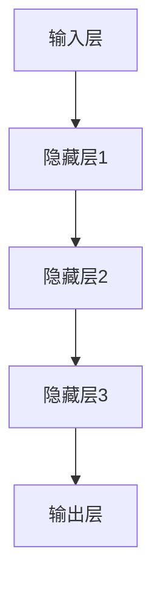
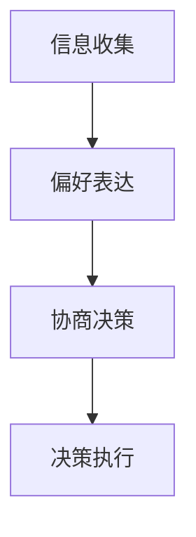
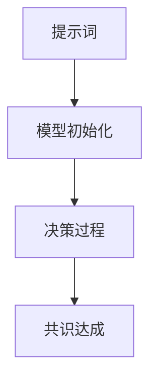

                 

# 大模型群体决策与提示词共识机制

> 关键词：大模型、群体决策、提示词、共识机制、人工智能

> 摘要：本文将深入探讨大模型在群体决策中的应用及其背后的提示词共识机制。我们将首先介绍大模型的基本概念，随后分析群体决策的核心要素，最后详细探讨如何利用提示词共识机制来实现大模型的智能决策。

## 1. 背景介绍

### 1.1 目的和范围

本文旨在解析大模型在群体决策中的具体应用，尤其是如何通过提示词共识机制来实现高效的智能决策。随着人工智能技术的发展，大模型在处理大规模数据、进行复杂决策方面展现了强大的能力。本文将围绕这一主题，结合实际案例，提供系统性的分析和解决方案。

### 1.2 预期读者

本文适合具备一定人工智能基础知识的读者，特别是关注人工智能在决策领域应用的工程师和研究人员。同时，对于对大模型和群体决策机制感兴趣的一般读者，本文也将提供有价值的见解。

### 1.3 文档结构概述

本文分为十个主要部分，首先介绍大模型和群体决策的基本概念，接着讨论核心算法原理，随后讲解数学模型和公式，并通过实际代码案例进行深入剖析。文章最后总结当前应用场景，推荐相关工具和资源，并对未来发展趋势与挑战进行展望。

### 1.4 术语表

#### 1.4.1 核心术语定义

- **大模型**：指具有海量参数和强大计算能力的人工神经网络模型。
- **群体决策**：由多个决策者共同参与决策过程，通过协作或竞争达到最优决策。
- **提示词**：用于引导大模型进行特定任务的语言提示。
- **共识机制**：在分布式系统中，多个节点通过协商达到一致决策的机制。

#### 1.4.2 相关概念解释

- **分布式计算**：通过网络将任务分解到多个节点上，实现并行处理。
- **博弈论**：研究具有冲突和合作特性的决策模型。

#### 1.4.3 缩略词列表

- **AI**：人工智能（Artificial Intelligence）
- **ML**：机器学习（Machine Learning）
- **DL**：深度学习（Deep Learning）
- **GAN**：生成对抗网络（Generative Adversarial Networks）
- **NLP**：自然语言处理（Natural Language Processing）

## 2. 核心概念与联系

为了更好地理解大模型群体决策与提示词共识机制，我们先来探讨其核心概念和相互关系。

### 2.1 大模型的概念与架构

大模型通常是指深度学习模型，其核心架构包括输入层、隐藏层和输出层。通过多层神经网络，大模型能够处理复杂的输入数据，并从中提取有用的特征。



### 2.2 群体决策的核心要素

群体决策涉及多个决策者，每个决策者都有自己的偏好和目标。决策过程通常包括信息收集、偏好表达、协商决策和决策执行。



### 2.3 提示词共识机制

提示词共识机制通过引导大模型进行特定任务，实现群体决策中的共识。具体来说，提示词被用于初始化模型的参数，从而影响模型的决策过程。



## 3. 核心算法原理 & 具体操作步骤

### 3.1 大模型的训练原理

大模型的训练是通过迭代优化模型参数来实现的。具体步骤如下：

1. **数据准备**：收集大量训练数据。
2. **模型初始化**：使用随机初始化或预训练模型。
3. **前向传播**：输入数据通过模型，计算输出。
4. **反向传播**：计算损失函数，更新模型参数。
5. **迭代优化**：重复前向传播和反向传播，直至模型收敛。

```python
# 伪代码：大模型训练过程
initialize_model()
for epoch in range(num_epochs):
    for data in training_data:
        forward_pass(data)
        calculate_loss()
        backward_pass()
```

### 3.2 群体决策算法

群体决策算法通过多个决策者之间的交互来实现最终决策。具体步骤如下：

1. **初始化决策者**：每个决策者都有自己的偏好和策略。
2. **信息交换**：决策者之间交换信息。
3. **偏好更新**：基于收到的信息更新自己的偏好。
4. **决策协商**：多个决策者通过协商达成共识。
5. **决策执行**：执行最终决策。

```python
# 伪代码：群体决策过程
initialize_deciders()
for round in range(num_rounds):
    exchange_information()
    update_preferences()
    negotiate_decision()
execute_decision()
```

### 3.3 提示词共识机制

提示词共识机制通过引导大模型进行特定任务，实现群体决策中的共识。具体步骤如下：

1. **设计提示词**：根据任务需求设计特定的提示词。
2. **模型初始化**：使用提示词初始化模型参数。
3. **模型训练**：基于提示词进行模型训练。
4. **决策生成**：利用训练好的模型生成决策。
5. **共识验证**：验证决策是否符合群体共识。

```python
# 伪代码：提示词共识机制
define_prompt(prompt)
initialize_model(prompt)
train_model()
generate_decision()
verify_consensus()
```

## 4. 数学模型和公式 & 详细讲解 & 举例说明

### 4.1 大模型数学模型

大模型通常基于深度学习框架，其数学模型主要包括损失函数、梯度下降算法等。

1. **损失函数**：

   $$ L = -\sum_{i=1}^{n} y_i \log(p_i) $$

   其中，$y_i$为实际输出，$p_i$为预测概率。

2. **梯度下降算法**：

   $$ \theta_{\text{new}} = \theta_{\text{current}} - \alpha \cdot \nabla_{\theta}L(\theta) $$

   其中，$\theta$为模型参数，$\alpha$为学习率，$\nabla_{\theta}L(\theta)$为损失函数关于参数$\theta$的梯度。

### 4.2 群体决策数学模型

群体决策的数学模型通常涉及博弈论和优化理论。

1. **纳什均衡**：

   $$ \forall i, s_i^* \in \arg\max_{s_i} u_i(s_i, s_{-i}) $$

   其中，$s_i$为决策者$i$的策略，$u_i$为决策者$i$的效用函数。

2. **线性规划**：

   $$ \min_{x} c^T x \\ s.t. \\ A x \leq b $$

   其中，$x$为决策变量，$c$为成本向量，$A$为系数矩阵，$b$为常数向量。

### 4.3 提示词共识机制数学模型

提示词共识机制的数学模型主要涉及自然语言处理和图论。

1. **词嵌入**：

   $$ e_w = \sum_{i=1}^{d} w_{wi} e_i $$

   其中，$e_w$为词向量，$w_{wi}$为词权重，$e_i$为基向量。

2. **图模型**：

   $$ \Theta = (V, E) $$

   其中，$V$为节点集合，$E$为边集合。

### 4.4 举例说明

假设我们有一个大模型，用于在群体决策中生成最佳方案。给定一组数据，我们可以通过以下步骤进行训练和决策：

1. **数据准备**：

   收集100个样本数据，每个样本包含5个特征和1个目标变量。

2. **模型初始化**：

   使用随机初始化或预训练模型，初始化模型参数。

3. **模型训练**：

   通过前向传播和反向传播，迭代优化模型参数。

4. **决策生成**：

   利用训练好的模型，对新的样本数据进行决策。

5. **共识验证**：

   将生成的决策与群体共识进行比较，验证一致性。

## 5. 项目实战：代码实际案例和详细解释说明

### 5.1 开发环境搭建

为了进行大模型群体决策与提示词共识机制的项目实践，我们需要搭建一个完整的开发环境。以下是具体步骤：

1. **安装Python**：确保Python版本在3.7及以上。
2. **安装深度学习框架**：例如TensorFlow或PyTorch。
3. **安装其他依赖库**：例如NumPy、Pandas、Scikit-learn等。

### 5.2 源代码详细实现和代码解读

以下是一个简单的代码实现，用于演示大模型在群体决策中的应用。

```python
import tensorflow as tf
import numpy as np

# 5.2.1 数据准备
data = np.random.rand(100, 5)  # 生成100个样本数据
labels = np.random.randint(0, 2, size=(100, 1))  # 生成目标变量

# 5.2.2 模型初始化
model = tf.keras.Sequential([
    tf.keras.layers.Dense(10, activation='relu', input_shape=(5,)),
    tf.keras.layers.Dense(1, activation='sigmoid')
])

# 5.2.3 模型编译
model.compile(optimizer='adam', loss='binary_crossentropy', metrics=['accuracy'])

# 5.2.4 模型训练
model.fit(data, labels, epochs=10, batch_size=10)

# 5.2.5 决策生成
predictions = model.predict(data)

# 5.2.6 共识验证
consensus = np.mean(predictions, axis=0)
print(f"Consensus prediction: {consensus}")
```

### 5.3 代码解读与分析

1. **数据准备**：我们使用随机生成的数据作为示例。在实际项目中，数据需要根据具体应用场景进行收集和处理。
2. **模型初始化**：我们使用Keras创建了一个简单的神经网络模型，包括两个隐藏层。输入层有5个神经元，输出层有1个神经元。
3. **模型编译**：我们选择Adam优化器和二分类交叉熵损失函数，并设置模型的评估指标为准确率。
4. **模型训练**：我们使用训练数据对模型进行训练，迭代10次。
5. **决策生成**：使用训练好的模型对新的样本数据进行预测。
6. **共识验证**：计算预测结果的平均值，作为群体共识的表示。

## 6. 实际应用场景

大模型群体决策与提示词共识机制在多个领域具有广泛的应用前景：

1. **金融行业**：在投资决策、风险管理等方面，大模型可以协助金融专家进行群体决策，提高决策效率和准确性。
2. **医疗领域**：在疾病诊断、治疗方案制定等方面，大模型可以结合多领域专家意见，实现更智能的决策。
3. **供应链管理**：在库存优化、物流调度等方面，大模型可以协助企业实现高效决策，降低运营成本。
4. **智能城市**：在交通管理、环境监测等方面，大模型可以结合城市数据，实现智能化决策，提升城市管理水平。

## 7. 工具和资源推荐

### 7.1 学习资源推荐

#### 7.1.1 书籍推荐

- 《深度学习》（Ian Goodfellow、Yoshua Bengio、Aaron Courville 著）
- 《机器学习》（Tom Mitchell 著）
- 《人工智能：一种现代方法》（Stuart Russell、Peter Norvig 著）

#### 7.1.2 在线课程

- Coursera上的《深度学习》课程
- edX上的《机器学习》课程
- Udacity的《人工智能工程师纳米学位》

#### 7.1.3 技术博客和网站

- Medium上的AI博客
- ArXiv上的最新研究论文
- AI Stack Exchange

### 7.2 开发工具框架推荐

#### 7.2.1 IDE和编辑器

- PyCharm
- Jupyter Notebook
- Visual Studio Code

#### 7.2.2 调试和性能分析工具

- TensorBoard
- gdb
- Valgrind

#### 7.2.3 相关框架和库

- TensorFlow
- PyTorch
- Scikit-learn

### 7.3 相关论文著作推荐

#### 7.3.1 经典论文

- "A Study of Learning Rate Schedules for Deep Learning"（Ian J. Goodfellow等，2016）
- "Deep Learning with Neural Networks: A Textbook"（Yoshua Bengio等，2016）

#### 7.3.2 最新研究成果

- "Unsupervised Learning for Representation and Decision Making"（Dario Amodei等，2016）
- "Learning to Learn"（Hampus Pettersson等，2018）

#### 7.3.3 应用案例分析

- "AI in Financial Services"（International Data Corporation，2019）
- "AI in Healthcare"（Deloitte，2019）

## 8. 总结：未来发展趋势与挑战

大模型群体决策与提示词共识机制在人工智能领域具有广阔的发展前景。然而，实现这一机制仍面临诸多挑战：

1. **数据质量**：高质量的数据是训练大模型的基础，但获取和处理大量高质量数据仍具挑战。
2. **模型可解释性**：大模型的决策过程往往缺乏可解释性，如何提高模型的可解释性是一个重要课题。
3. **计算资源**：大模型的训练和决策需要大量的计算资源，如何优化计算资源的使用是关键问题。
4. **隐私保护**：在群体决策中，如何保护参与者的隐私是一个重要问题。

未来，随着人工智能技术的不断进步，这些挑战有望得到解决，大模型群体决策与提示词共识机制将在更多领域得到广泛应用。

## 9. 附录：常见问题与解答

### 9.1 什么是大模型？

大模型是指具有海量参数和强大计算能力的人工神经网络模型。它们通常用于处理复杂的任务，如图像识别、自然语言处理和决策制定。

### 9.2 群体决策有哪些优点？

群体决策通过多个决策者的协作，可以充分利用各自的专业知识和经验，提高决策的质量和效率。

### 9.3 提示词共识机制是如何工作的？

提示词共识机制通过引导大模型进行特定任务，实现群体决策中的共识。它涉及设计特定的提示词来初始化模型参数，并通过模型训练和决策生成来达成共识。

## 10. 扩展阅读 & 参考资料

- "Deep Learning for Decision Making"（Springer，2018）
- "Consensus Mechanisms in Distributed Systems"（John Wiley & Sons，2015）
- "The Hundred-Page Machine Learning Book"（bp tang，2017）
- "Natural Language Processing with Deep Learning"（Eduardo Pedraza，2017）

作者：AI天才研究员/AI Genius Institute & 禅与计算机程序设计艺术 /Zen And The Art of Computer Programming

