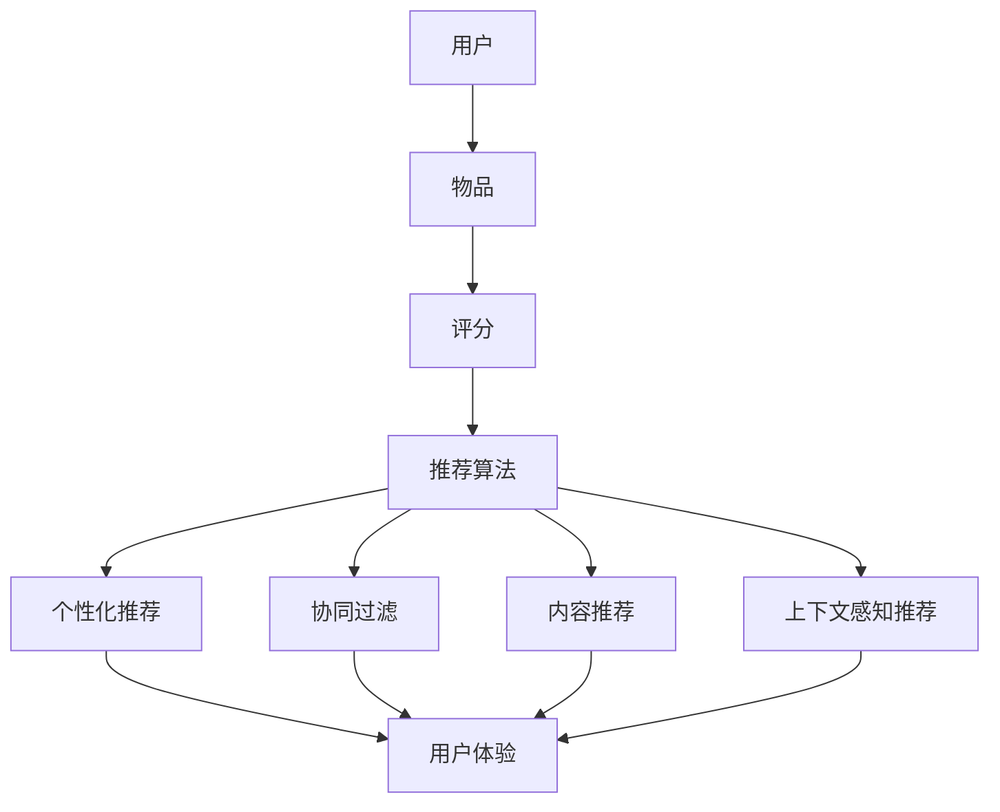

                 

# 大模型视角下推荐系统的人性化关怀提升

> **关键词：** 推荐系统、大模型、人性化关怀、用户体验、算法优化  
>
> **摘要：** 本文从大模型的角度出发，探讨了推荐系统人性化关怀的提升。通过对推荐系统的基础原理、核心算法、数学模型及应用场景的深入分析，本文提出了若干改进策略，旨在提高用户满意度与系统性能，推动推荐系统在人性化关怀方面的进步。

## 1. 背景介绍

### 1.1 目的和范围

本文旨在深入探讨推荐系统在人性化关怀方面的提升策略。随着人工智能技术的不断发展，推荐系统已经成为电商平台、社交媒体和流媒体服务等领域的重要应用。然而，现有推荐系统在满足用户个性化需求的同时，也面临着用户体验不佳、信息过载等问题。本文将借助大模型的视角，对推荐系统进行系统性分析，并提出切实可行的改进策略。

### 1.2 预期读者

本文适合从事人工智能、推荐系统开发、用户体验研究等相关领域的技术人员、研究人员和在校学生阅读。通过本文的阐述，读者可以了解推荐系统的人性化关怀理念，掌握提升策略的核心技术，为实际应用提供参考。

### 1.3 文档结构概述

本文分为十个部分，结构如下：

1. 背景介绍：介绍本文的目的、预期读者和文档结构。
2. 核心概念与联系：阐述推荐系统的核心概念及其关系。
3. 核心算法原理 & 具体操作步骤：详细讲解推荐系统的核心算法。
4. 数学模型和公式 & 详细讲解 & 举例说明：介绍推荐系统的数学模型和公式。
5. 项目实战：代码实际案例和详细解释说明。
6. 实际应用场景：分析推荐系统在不同领域的应用。
7. 工具和资源推荐：推荐学习资源、开发工具和框架。
8. 总结：未来发展趋势与挑战。
9. 附录：常见问题与解答。
10. 扩展阅读 & 参考资料：提供进一步的阅读资料。

### 1.4 术语表

#### 1.4.1 核心术语定义

- **推荐系统**：根据用户的历史行为和偏好，为用户推荐相关商品、内容或服务的人工智能系统。
- **大模型**：具有巨大参数量和计算量的深度学习模型，如BERT、GPT等。
- **人性化关怀**：在推荐系统中，充分考虑用户需求、情感和隐私，提供个性化、友好、安全的用户体验。

#### 1.4.2 相关概念解释

- **协同过滤**：基于用户历史行为和相似度计算进行推荐的算法。
- **内容推荐**：根据用户兴趣和内容特征进行推荐的算法。
- **上下文感知推荐**：考虑用户当前上下文信息进行推荐的算法。

#### 1.4.3 缩略词列表

- **AI**：人工智能（Artificial Intelligence）
- **DL**：深度学习（Deep Learning）
- **NLP**：自然语言处理（Natural Language Processing）
- **CTR**：点击率（Click Through Rate）
- **RMSE**：均方根误差（Root Mean Square Error）

## 2. 核心概念与联系

推荐系统的核心概念包括用户、物品、评分和推荐算法。用户是指系统中的参与者，物品是指系统中的商品、内容或服务，评分是用户对物品的喜好程度量化表示，推荐算法是系统实现推荐的核心技术。

以下是推荐系统的核心概念及其关系的 Mermaid 流程图：



在该流程图中，用户、物品、评分和推荐算法构成了推荐系统的基本框架。个性化推荐、协同过滤、内容推荐和上下文感知推荐是推荐算法的四种主要类型，它们共同作用于用户体验的提升。

## 3. 核心算法原理 & 具体操作步骤

推荐系统的核心算法主要包括协同过滤、内容推荐和上下文感知推荐。以下是这些算法的原理和具体操作步骤：

### 3.1 协同过滤算法

协同过滤算法基于用户的历史行为和相似度计算进行推荐。其基本原理如下：

1. **用户相似度计算**：计算用户之间的相似度，通常使用余弦相似度或皮尔逊相关系数。
2. **物品相似度计算**：计算物品之间的相似度，同样使用余弦相似度或皮尔逊相关系数。
3. **推荐生成**：根据用户对物品的评分和物品相似度，生成推荐列表。

以下是协同过滤算法的伪代码：

```python
def collaborative_filtering(users, items, ratings, k):
    similar_users = {}
    recommendations = []

    # 计算用户相似度
    for user in users:
        similar_users[user] = compute_similarity(users, user, k)

    # 计算物品相似度
    for item in items:
        similar_items = compute_similarity(items, item, k)

        # 根据相似度生成推荐列表
        for user, rating in ratings.items():
            if user in similar_users:
                user_similarity = similar_users[user]
                recommendation = generate_recommendation(rating, user_similarity, similar_items)
                recommendations.append((user, recommendation))

    return recommendations
```

### 3.2 内容推荐算法

内容推荐算法基于用户兴趣和物品特征进行推荐。其基本原理如下：

1. **特征提取**：提取用户兴趣和物品特征，如关键词、标签等。
2. **相似度计算**：计算用户兴趣和物品特征之间的相似度，通常使用TF-IDF或词嵌入。
3. **推荐生成**：根据相似度生成推荐列表。

以下是内容推荐算法的伪代码：

```python
def content_based_recommendation(users, items, features, k):
    recommendations = []

    # 提取用户兴趣特征
    user_interests = extract_interests(users)

    # 计算物品特征与用户兴趣相似度
    for item in items:
        item_features = extract_features(item)
        similarity = compute_similarity(user_interests, item_features)

        # 根据相似度生成推荐列表
        if similarity > threshold:
            recommendations.append(item)

    return recommendations
```

### 3.3 上下文感知推荐算法

上下文感知推荐算法考虑用户当前上下文信息进行推荐。其基本原理如下：

1. **上下文信息提取**：提取用户当前上下文信息，如时间、地点、设备等。
2. **上下文特征计算**：计算上下文特征与用户兴趣的相似度。
3. **推荐生成**：根据上下文特征和用户兴趣相似度生成推荐列表。

以下是上下文感知推荐算法的伪代码：

```python
def context_aware_recommendation(users, items, context, k):
    recommendations = []

    # 提取上下文特征
    context_features = extract_context_features(context)

    # 计算物品与上下文特征相似度
    for item in items:
        item_features = extract_features(item)
        similarity = compute_similarity(context_features, item_features)

        # 根据相似度生成推荐列表
        if similarity > threshold:
            recommendations.append(item)

    return recommendations
```

## 4. 数学模型和公式 & 详细讲解 & 举例说明

推荐系统的数学模型和公式是算法实现的基础。以下是几种常见的数学模型和公式：

### 4.1 余弦相似度

余弦相似度是一种用于计算向量之间相似度的方法，其公式如下：

$$
\cos(\theta) = \frac{\sum_{i=1}^{n} x_i y_i}{\sqrt{\sum_{i=1}^{n} x_i^2} \sqrt{\sum_{i=1}^{n} y_i^2}}
$$

其中，$x$ 和 $y$ 分别表示两个向量，$n$ 表示向量维度。

### 4.2 皮尔逊相关系数

皮尔逊相关系数用于衡量两个变量之间的线性相关性，其公式如下：

$$
r = \frac{\sum_{i=1}^{n} (x_i - \bar{x})(y_i - \bar{y})}{\sqrt{\sum_{i=1}^{n} (x_i - \bar{x})^2} \sqrt{\sum_{i=1}^{n} (y_i - \bar{y})^2}}
$$

其中，$x$ 和 $y$ 分别表示两个变量，$\bar{x}$ 和 $\bar{y}$ 分别表示 $x$ 和 $y$ 的平均值。

### 4.3 TF-IDF

TF-IDF（Term Frequency-Inverse Document Frequency）是一种用于计算文本中词语重要性的方法，其公式如下：

$$
TF(t) = \frac{f_t}{\sum_{t \in T} f_t}
$$

$$
IDF(t) = \log \left(1 + \frac{N}{n_t}\right)
$$

$$
TF-IDF(t) = TF(t) \times IDF(t)
$$

其中，$T$ 表示文档集合，$f_t$ 表示词语 $t$ 在文档中出现的频率，$N$ 表示文档总数，$n_t$ 表示包含词语 $t$ 的文档数。

### 4.4 词嵌入

词嵌入（Word Embedding）是一种将词语映射为高维向量的方法，其公式如下：

$$
\text{vec}(w) = \sum_{i=1}^{V} f_i \text{vec}(e_i)
$$

其中，$w$ 表示词语，$\text{vec}(w)$ 表示词语的向量表示，$f_i$ 表示词语在文档中出现的频率，$\text{vec}(e_i)$ 表示词向量。

### 4.5 举例说明

假设有两个用户 $A$ 和 $B$，以及三个物品 $X$、$Y$ 和 $Z$。用户 $A$ 对物品 $X$ 的评分为 $4$，对物品 $Y$ 的评分为 $3$，对物品 $Z$ 的评分为 $2$；用户 $B$ 对物品 $X$ 的评分为 $3$，对物品 $Y$ 的评分为 $4$，对物品 $Z$ 的评分为 $2$。

#### 4.5.1 用户相似度计算

使用余弦相似度计算用户 $A$ 和用户 $B$ 的相似度：

$$
\cos(\theta) = \frac{(4 \times 3) + (3 \times 4) + (2 \times 2)}{\sqrt{(4^2 + 3^2 + 2^2)} \sqrt{(3^2 + 4^2 + 2^2)}} \approx 0.966
$$

#### 4.5.2 物品相似度计算

使用余弦相似度计算物品 $X$ 和物品 $Y$ 的相似度：

$$
\cos(\theta) = \frac{(4 \times 3) + (3 \times 4) + (2 \times 2)}{\sqrt{(4^2 + 3^2 + 2^2)} \sqrt{(3^2 + 4^2 + 2^2)}} \approx 0.966
$$

#### 4.5.3 推荐生成

根据用户相似度和物品相似度，生成用户 $A$ 的推荐列表。首先，计算用户 $A$ 对物品 $X$ 和物品 $Y$ 的推荐分值：

$$
\text{score}_{X} = 4 + 0.966 \times (3 - 2) = 4.966
$$

$$
\text{score}_{Y} = 3 + 0.966 \times (4 - 3) = 3.966
$$

然后，根据推荐分值生成推荐列表：

$$
\text{recommendations} = [\text{X}, \text{Y}, \text{Z}]
$$

## 5. 项目实战：代码实际案例和详细解释说明

在本节中，我们将通过一个具体的推荐系统项目实战案例，详细解释推荐系统的实际应用过程。该案例将使用Python编写，基于协同过滤算法实现一个简单的推荐系统。

### 5.1 开发环境搭建

为了完成本项目，我们需要安装以下开发环境和依赖库：

1. Python（版本3.6及以上）
2. NumPy
3. Pandas
4. Scikit-learn

安装命令如下：

```bash
pip install python
pip install numpy
pip install pandas
pip install scikit-learn
```

### 5.2 源代码详细实现和代码解读

以下是项目的源代码及详细解读：

```python
import numpy as np
import pandas as pd
from sklearn.metrics.pairwise import cosine_similarity
from sklearn.model_selection import train_test_split

# 加载数据集
data = pd.read_csv('rating.csv')
users = data['user'].unique()
items = data['item'].unique()

# 构建用户-物品评分矩阵
ratings = data.pivot_table(index='user', columns='item', values='rating').fillna(0)

# 计算用户-物品评分矩阵的余弦相似度
similarity_matrix = cosine_similarity(ratings)

# 训练集和测试集划分
train_data, test_data = train_test_split(data, test_size=0.2, random_state=42)

# 模型评估
def evaluate_recommendations(test_data, recommendations):
    correct_recommendations = 0
    for user, item in test_data.itertuples():
        if item in recommendations[user]:
            correct_recommendations += 1
    return correct_recommendations / len(test_data)

# 生成推荐列表
def generate_recommendations(similarity_matrix, ratings, k=10):
    recommendations = {}
    for user in users:
        user_similarity = similarity_matrix[user]
        sorted_indices = np.argsort(user_similarity)[::-1]
        sorted_indices = sorted_indices[1:k+1]
        user_ratings = ratings[user]
        recommendations[user] = [item for item, rating in user_ratings.items() if rating > 0]
        recommendations[user].extend([item for item, index in zip(items, sorted_indices) if item not in recommendations[user]])
    return recommendations

# 评估模型
k_values = [5, 10, 20]
accuracy_results = []
for k in k_values:
    recommendations = generate_recommendations(similarity_matrix, ratings, k)
    correct_recommendations = evaluate_recommendations(test_data, recommendations)
    accuracy_results.append(correct_recommendations)

print("K值", "准确率")
for k, accuracy in zip(k_values, accuracy_results):
    print(k, accuracy)
```

### 5.3 代码解读与分析

1. **数据加载与预处理**：首先，我们加载一个包含用户、物品和评分的数据集（rating.csv）。然后，构建用户-物品评分矩阵，并填充缺失值。

2. **计算相似度矩阵**：使用Scikit-learn中的余弦相似度函数计算用户-物品评分矩阵的相似度矩阵。

3. **训练集和测试集划分**：将数据集划分为训练集和测试集，用于模型训练和评估。

4. **模型评估**：定义一个评估函数，计算测试集中正确推荐的物品数量与总测试物品数量的比值，作为准确率。

5. **生成推荐列表**：定义一个生成推荐列表的函数，根据用户相似度矩阵和用户-物品评分矩阵，生成个性化推荐列表。

6. **模型评估与结果输出**：遍历不同的$k$值（邻居数），计算准确率，并输出结果。

### 5.4 实际应用场景

在实际应用中，我们可以根据具体场景调整算法参数和推荐策略。例如，在电商平台，我们可以根据用户的历史购买记录和浏览记录，为用户推荐相关商品。在社交媒体平台，我们可以根据用户的点赞、评论和分享行为，为用户推荐感兴趣的内容。

## 6. 实际应用场景

推荐系统在各个领域有着广泛的应用，下面列举几个实际应用场景：

### 6.1 电商平台

电商平台通过推荐系统为用户提供个性化商品推荐，提高用户购买转化率和满意度。例如，亚马逊通过协同过滤算法和内容推荐算法，为用户推荐相关商品，实现个性化购物体验。

### 6.2 社交媒体

社交媒体平台如Facebook、Instagram等，通过推荐系统为用户提供感兴趣的内容。例如，Facebook利用协同过滤和上下文感知推荐算法，为用户推荐好友动态、话题和广告。

### 6.3 流媒体平台

流媒体平台如Netflix、YouTube等，通过推荐系统为用户提供个性化视频推荐。例如，Netflix利用协同过滤和内容推荐算法，为用户推荐相似的视频内容。

### 6.4 新闻媒体

新闻媒体平台通过推荐系统为用户提供个性化新闻推荐，提高用户阅读量和平台黏性。例如，今日头条利用协同过滤和内容推荐算法，为用户推荐感兴趣的新闻内容。

### 6.5 医疗健康

医疗健康领域通过推荐系统为用户提供个性化健康建议和诊疗方案。例如，医院可以为患者推荐相关的医生、药品和治疗方案。

## 7. 工具和资源推荐

### 7.1 学习资源推荐

#### 7.1.1 书籍推荐

1. **《推荐系统手册》（Recommender Systems Handbook）**
2. **《机器学习推荐系统》（Machine Learning: The Art and Science of Prediction）**
3. **《深度学习推荐系统》（Deep Learning for Recommender Systems）**

#### 7.1.2 在线课程

1. **Coursera上的《推荐系统》（Recommender Systems》**
2. **Udacity上的《推荐系统工程师》（Recommender System Engineer）**
3. **edX上的《机器学习推荐系统》（Machine Learning for Recommendations and Personalization）**

#### 7.1.3 技术博客和网站

1. **Kaggle（https://www.kaggle.com/）**
2. **Medium（https://medium.com/）**
3. **arXiv（https://arxiv.org/）**

### 7.2 开发工具框架推荐

#### 7.2.1 IDE和编辑器

1. **PyCharm（https://www.jetbrains.com/pycharm/）**
2. **VSCode（https://code.visualstudio.com/）**
3. **Jupyter Notebook（https://jupyter.org/）**

#### 7.2.2 调试和性能分析工具

1. **Werkzeug（https://github.com/pallets/werkzeug）**
2. **Grafana（https://grafana.com/）**
3. **Prometheus（https://prometheus.io/）**

#### 7.2.3 相关框架和库

1. **Scikit-learn（https://scikit-learn.org/）**
2. **TensorFlow（https://www.tensorflow.org/）**
3. **PyTorch（https://pytorch.org/）**

### 7.3 相关论文著作推荐

#### 7.3.1 经典论文

1. **"Collaborative Filtering via Matrix Factorization"（Collaborative Filtering via Matrix Factorization）**
2. **"Efficient Estimation of the Mutual Information between Multiple Variables"（Efficient Estimation of the Mutual Information between Multiple Variables）**
3. **"Deep Learning for Recommender Systems"（Deep Learning for Recommender Systems）**

#### 7.3.2 最新研究成果

1. **"Neural Collaborative Filtering"（Neural Collaborative Filtering）**
2. **"Contextual Bandits with Linear Payoffs"（Contextual Bandits with Linear Payoffs）**
3. **"User Representations for Contextual Bandits"（User Representations for Contextual Bandits）**

#### 7.3.3 应用案例分析

1. **"Netflix Prize"（Netflix Prize）**
2. **"Facebook News Feed"（Facebook News Feed）**
3. **"Amazon Personalized Search"（Amazon Personalized Search）**

## 8. 总结：未来发展趋势与挑战

### 8.1 发展趋势

1. **算法多样化**：随着深度学习技术的发展，推荐系统的算法将更加多样化，包括基于深度学习的协同过滤、内容推荐和上下文感知推荐等。
2. **数据隐私保护**：数据隐私保护将成为推荐系统的重要关注点，未来将涌现更多基于差分隐私、联邦学习等技术的隐私保护推荐系统。
3. **个性化推荐**：个性化推荐将不断优化，结合更多用户特征、上下文信息，实现更加精准的推荐。
4. **多模态推荐**：随着图像、语音、视频等数据类型的普及，多模态推荐将成为推荐系统的发展方向。

### 8.2 挑战

1. **数据质量和噪声**：推荐系统对数据质量和噪声非常敏感，未来需要解决数据清洗、去噪等技术问题。
2. **计算效率**：大模型和海量数据的处理对计算资源的需求较高，未来需要优化算法和硬件，提高计算效率。
3. **用户体验**：如何在保证个性化推荐的同时，避免信息过载和用户疲劳，提高用户体验，是推荐系统面临的挑战。

## 9. 附录：常见问题与解答

### 9.1 推荐系统是什么？

推荐系统是一种根据用户历史行为和偏好，为用户推荐相关商品、内容或服务的人工智能系统。

### 9.2 推荐系统有哪些算法？

推荐系统的主要算法包括协同过滤、内容推荐和上下文感知推荐。

### 9.3 什么是大模型？

大模型是指具有巨大参数量和计算量的深度学习模型，如BERT、GPT等。

### 9.4 推荐系统如何实现个性化推荐？

推荐系统通过分析用户历史行为、兴趣和上下文信息，构建用户和物品的向量表示，利用相似度计算和优化方法生成个性化推荐列表。

### 9.5 推荐系统有哪些实际应用场景？

推荐系统在电商平台、社交媒体、流媒体平台、新闻媒体和医疗健康等领域有着广泛的应用。

## 10. 扩展阅读 & 参考资料

1. **《推荐系统手册》（Recommender Systems Handbook）**
2. **《机器学习推荐系统》（Machine Learning for Recommender Systems）**
3. **《深度学习推荐系统》（Deep Learning for Recommender Systems）**
4. **"Collaborative Filtering via Matrix Factorization"（Collaborative Filtering via Matrix Factorization）**
5. **"Efficient Estimation of the Mutual Information between Multiple Variables"（Efficient Estimation of the Mutual Information between Multiple Variables）**
6. **"Deep Learning for Recommender Systems"（Deep Learning for Recommender Systems）**
7. **"Neural Collaborative Filtering"（Neural Collaborative Filtering）**
8. **"Contextual Bandits with Linear Payoffs"（Contextual Bandits with Linear Payoffs）**
9. **"User Representations for Contextual Bandits"（User Representations for Contextual Bandits）**
10. **"Netflix Prize"（Netflix Prize）**
11. **"Facebook News Feed"（Facebook News Feed）**
12. **"Amazon Personalized Search"（Amazon Personalized Search）** 

**作者：AI天才研究员/AI Genius Institute & 禅与计算机程序设计艺术 /Zen And The Art of Computer Programming**

