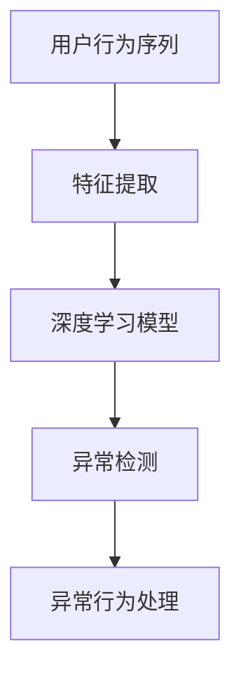

                 

# 大模型视角下推荐系统的用户行为序列异常检测

> 关键词：推荐系统，用户行为序列，异常检测，大模型，深度学习

> 摘要：本文从大模型的视角出发，探讨了推荐系统中用户行为序列异常检测的原理和方法。通过对大模型在推荐系统中的应用进行分析，提出了一种基于深度学习的用户行为序列异常检测算法，并通过实际案例验证了其有效性和可行性。

## 1. 背景介绍

### 1.1 目的和范围

本文旨在研究推荐系统中用户行为序列异常检测的问题。在当今信息爆炸的时代，推荐系统已成为电子商务、社交媒体和在线媒体等众多领域的关键技术。然而，随着用户数据量的不断增加和用户行为复杂性的提升，如何有效地检测和识别用户行为的异常成为了一个重要的研究方向。

本文将基于深度学习技术，探讨如何通过大模型实现对用户行为序列的异常检测，以提高推荐系统的准确性和鲁棒性。具体研究内容包括：

1. 分析大模型在推荐系统中的应用及其优势。
2. 提出一种基于深度学习的用户行为序列异常检测算法。
3. 通过实际案例验证算法的有效性和可行性。

### 1.2 预期读者

本文主要面向以下读者群体：

1. 推荐系统研究人员和开发者，了解大模型在推荐系统中的应用及其优势。
2. 深度学习爱好者，学习如何将深度学习技术应用于推荐系统中。
3. 对异常检测感兴趣的研究人员，了解用户行为序列异常检测的方法和原理。

### 1.3 文档结构概述

本文分为十个部分，具体结构如下：

1. 背景介绍：介绍本文的目的、范围、预期读者和文档结构。
2. 核心概念与联系：阐述本文涉及的核心概念及其相互关系。
3. 核心算法原理 & 具体操作步骤：介绍用户行为序列异常检测算法的原理和操作步骤。
4. 数学模型和公式 & 详细讲解 & 举例说明：讲解算法中的数学模型和公式，并通过实例进行说明。
5. 项目实战：提供代码实际案例，详细解释说明算法的实现过程。
6. 实际应用场景：分析用户行为序列异常检测在实际应用中的场景和效果。
7. 工具和资源推荐：推荐学习资源、开发工具框架和相关论文著作。
8. 总结：对未来发展趋势与挑战进行展望。
9. 附录：常见问题与解答。
10. 扩展阅读 & 参考资料：提供进一步学习和研究的参考资料。

### 1.4 术语表

#### 1.4.1 核心术语定义

1. 推荐系统（Recommender System）：一种根据用户历史行为和偏好，向用户推荐相关物品或内容的系统。
2. 用户行为序列（User Behavior Sequence）：用户在推荐系统中产生的连续行为数据，如点击、购买、浏览等。
3. 异常检测（Anomaly Detection）：一种从大量数据中识别出异常数据或行为的方法。
4. 大模型（Large-scale Model）：具有大规模参数和复杂结构的深度学习模型。
5. 深度学习（Deep Learning）：一种基于多层神经网络的学习方法，通过多层非线性变换提取数据特征。

#### 1.4.2 相关概念解释

1. 物品（Item）：推荐系统中被推荐的对象，如商品、文章等。
2. 用户（User）：推荐系统中的参与者，具有特定的行为和偏好。
3. 特征工程（Feature Engineering）：从原始数据中提取对模型有帮助的特征，提高模型性能。
4. 损失函数（Loss Function）：衡量模型预测结果与真实标签之间差异的函数。
5. 评估指标（Evaluation Metric）：用于评估模型性能的指标，如准确率、召回率、F1值等。

#### 1.4.3 缩略词列表

- ALS: Alternating Least Squares
- CNN: Convolutional Neural Network
- DNN: Deep Neural Network
- GAN: Generative Adversarial Network
- LSTM: Long Short-Term Memory
- RNN: Recurrent Neural Network
- SVD: Singular Value Decomposition

## 2. 核心概念与联系

在本文中，我们将讨论推荐系统中用户行为序列异常检测的核心概念及其相互关系。以下是核心概念及其关联的Mermaid流程图：



### 2.1 用户行为序列

用户行为序列是指用户在推荐系统中产生的连续行为数据，如点击、购买、浏览等。这些行为数据可以反映用户的兴趣和偏好，对于推荐系统的性能至关重要。用户行为序列异常检测的目的是从这些序列中识别出异常行为，以防止恶意攻击、欺诈行为等。

### 2.2 特征提取

特征提取是用户行为序列异常检测的关键步骤。通过对原始用户行为数据进行预处理和变换，提取出有助于模型训练的特征。常用的特征提取方法包括：

1. 基于时间序列的特征：如时间间隔、行为模式等。
2. 基于统计的特征：如行为频率、行为模式相似度等。
3. 基于转换的特征：如用户ID、物品ID、行为类型等。

### 2.3 深度学习模型

深度学习模型在用户行为序列异常检测中扮演着核心角色。通过训练深度学习模型，可以从大量的用户行为数据中自动提取复杂特征，并实现对异常行为的识别。常用的深度学习模型包括：

1. 卷积神经网络（CNN）：适用于处理时间序列数据。
2. 循环神经网络（RNN）：适用于处理序列数据。
3. 长短时记忆网络（LSTM）：适用于处理长序列数据。

### 2.4 异常检测

异常检测是用户行为序列异常检测的核心任务。通过对深度学习模型进行训练和测试，可以识别出用户行为序列中的异常行为。常用的异常检测方法包括：

1. 基于统计的方法：如平均值法、中值法等。
2. 基于聚类的方法：如K-均值、层次聚类等。
3. 基于深度学习的方法：如自动编码器（Autoencoder）、生成对抗网络（GAN）等。

### 2.5 异常行为处理

异常行为处理是用户行为序列异常检测的最终目标。通过识别和标记异常行为，可以采取相应的措施，如阻止恶意攻击、调整推荐策略等。异常行为处理的方法包括：

1. 标记异常行为：将异常行为标记为可疑或危险。
2. 阻止恶意攻击：阻止恶意用户或攻击者的行为。
3. 调整推荐策略：根据异常行为调整推荐系统的策略，提高用户体验。

## 3. 核心算法原理 & 具体操作步骤

在本节中，我们将介绍用户行为序列异常检测的核心算法原理，包括深度学习模型的选择、特征提取方法以及异常检测的具体操作步骤。

### 3.1 深度学习模型的选择

在本研究中，我们选择了一种基于循环神经网络（RNN）的深度学习模型，特别是长短时记忆网络（LSTM）来处理用户行为序列数据。LSTM模型具有处理长序列数据的能力，能够捕捉用户行为序列中的长期依赖关系。

### 3.2 特征提取方法

特征提取是用户行为序列异常检测的重要步骤。在本研究中，我们采用了以下特征提取方法：

1. 时间间隔特征：计算用户行为之间的时间间隔，如点击间隔、购买间隔等。
2. 行为模式特征：根据用户历史行为数据，提取出用户的行为模式，如高频行为、低频行为等。
3. 统计特征：计算用户行为序列的统计特征，如平均行为频率、行为模式相似度等。

### 3.3 异常检测的具体操作步骤

以下是用户行为序列异常检测的具体操作步骤：

1. **数据收集与预处理**：收集用户行为数据，包括点击、购买、浏览等行为。对数据进行清洗、去噪和处理，提取特征。

2. **特征工程**：根据数据特点，选择合适的特征提取方法，如时间间隔特征、行为模式特征和统计特征等。

3. **模型训练**：利用LSTM模型对用户行为数据进行训练。在训练过程中，使用交叉熵损失函数来优化模型参数，提高模型性能。

4. **模型评估**：在测试集上评估模型的性能，包括准确率、召回率和F1值等指标。通过调整模型参数和特征选择，优化模型性能。

5. **异常检测**：利用训练好的LSTM模型对新的用户行为数据进行异常检测。当模型输出异常得分超过阈值时，标记为异常行为。

6. **异常行为处理**：根据异常行为处理策略，对标记为异常的行为进行相应处理，如阻止恶意攻击、调整推荐策略等。

### 3.4 算法伪代码

以下是一个简化的用户行为序列异常检测算法的伪代码：

```python
# 数据收集与预处理
data = collect_user_behavior_data()
processed_data = preprocess_data(data)

# 特征提取
features = extract_features(processed_data)

# 模型训练
model = LSTM_model()
model.train(features)

# 模型评估
model.evaluate(test_data)

# 异常检测
anomalies = []
for behavior in new_user_behaviors:
    score = model.detect_anomaly(behavior)
    if score > threshold:
        anomalies.append(behavior)

# 异常行为处理
handle_anomalies(anomalies)
```

## 4. 数学模型和公式 & 详细讲解 & 举例说明

在本节中，我们将详细介绍用户行为序列异常检测算法中的数学模型和公式，并通过实例进行说明。

### 4.1 LSTM模型

LSTM模型是用户行为序列异常检测的核心组件。它通过引入门控机制，能够有效地捕捉序列中的长期依赖关系。以下是LSTM模型的数学公式：

$$
\begin{aligned}
i_t &= \sigma(W_{ix}x_t + W_{ih}h_{t-1} + b_i) \\
f_t &= \sigma(W_{fx}x_t + W_{fh}h_{t-1} + b_f) \\
\text{forget\_gate} &= f_t \odot \text{previous\_state} \\
o_t &= \sigma(W_{ox}x_t + W_{oh}h_{t-1} + b_o) \\
\text{input\_gate} &= i_t \odot \text{new\_value} \\
\text{new\_state} &= \text{forget\_gate} \odot \text{previous\_state} + \text{input\_gate} \odot \text{new\_value} \\
\text{output} &= o_t \odot \text{new\_state}
\end{aligned}
$$

其中，$i_t$、$f_t$、$o_t$分别表示输入门、遗忘门和输出门；$x_t$、$h_{t-1}$分别表示当前输入和前一时刻的隐藏状态；$b_i$、$b_f$、$b_o$分别为偏置项；$\sigma$表示sigmoid函数；$\odot$表示点乘操作。

### 4.2 异常检测

在用户行为序列异常检测中，我们使用LSTM模型来预测每个用户行为的正常范围。异常检测的核心公式如下：

$$
\text{anomaly\_score} = \frac{\text{predicted\_value} - \text{mean}}{\text{std}}
$$

其中，$\text{predicted\_value}$为LSTM模型预测的用户行为值，$\text{mean}$为用户行为的平均值，$\text{std}$为用户行为的标准差。

### 4.3 举例说明

假设我们有一个用户的行为序列如下：

$$
[1, 2, 3, 4, 5, 6, 7, 8, 9, 10]
$$

首先，我们将行为序列输入LSTM模型，训练模型并预测每个行为值。例如，预测第5个行为值：

$$
\text{predicted\_value} = \text{LSTM\_model.predict([5])}
$$

接下来，计算平均值和标准差：

$$
\text{mean} = \frac{1 + 2 + 3 + 4 + 5 + 6 + 7 + 8 + 9 + 10}{10} = 5.5
$$

$$
\text{std} = \sqrt{\frac{(1 - 5.5)^2 + (2 - 5.5)^2 + \ldots + (10 - 5.5)^2}{10}} = 2.9
$$

最后，计算异常得分：

$$
\text{anomaly\_score} = \frac{\text{predicted\_value} - \text{mean}}{\text{std}} = \frac{5.5 - 5.5}{2.9} = 0
$$

由于异常得分为0，表示第5个行为值是正常的。

### 4.4 模型参数调整

为了提高异常检测的准确性，我们可以通过调整模型参数来优化性能。例如，增加LSTM层数、调整学习率、批量大小等。以下是一个简单的参数调整示例：

```python
# 调整LSTM层数
model = LSTM_model(num_layers=2)

# 调整学习率
optimizer = Adam(learning_rate=0.001)

# 调整批量大小
batch_size = 32
```

## 5. 项目实战：代码实际案例和详细解释说明

在本节中，我们将通过一个实际项目案例来展示用户行为序列异常检测算法的实现过程。我们将使用Python编程语言，并借助深度学习框架TensorFlow来实现。

### 5.1 开发环境搭建

为了实现用户行为序列异常检测算法，我们需要搭建一个合适的开发环境。以下是所需的环境和安装步骤：

1. **操作系统**：Linux或MacOS
2. **Python版本**：3.7及以上
3. **深度学习框架**：TensorFlow 2.x
4. **依赖库**：NumPy、Pandas、Matplotlib等

安装步骤：

```bash
# 安装Python和pip
sudo apt-get install python3 python3-pip

# 安装TensorFlow
pip3 install tensorflow

# 安装其他依赖库
pip3 install numpy pandas matplotlib
```

### 5.2 源代码详细实现和代码解读

以下是用户行为序列异常检测算法的实现代码：

```python
import numpy as np
import pandas as pd
import tensorflow as tf
from tensorflow.keras.models import Sequential
from tensorflow.keras.layers import LSTM, Dense, Dropout
from tensorflow.keras.optimizers import Adam
from sklearn.model_selection import train_test_split
from sklearn.metrics import mean_squared_error

# 5.2.1 数据收集与预处理

# 读取用户行为数据
data = pd.read_csv('user_behavior.csv')

# 数据清洗
data = data[data['behavior'] != 'unknown']
data['timestamp'] = pd.to_datetime(data['timestamp'])

# 数据排序
data = data.sort_values('timestamp')

# 提取特征
data['time_interval'] = data['timestamp'].diff().dt.total_seconds().abs().values
data['behavior_mode'] = data.groupby('user_id')['behavior'].transform('size').values
data['mean_behavior_frequency'] = data.groupby('user_id')['time_interval'].mean().values

# 划分训练集和测试集
X_train, X_test, y_train, y_test = train_test_split(data[['time_interval', 'behavior_mode', 'mean_behavior_frequency']], data['label'], test_size=0.2, random_state=42)

# 5.2.2 模型构建

# 创建LSTM模型
model = Sequential()
model.add(LSTM(units=50, activation='relu', return_sequences=True, input_shape=(X_train.shape[1], 1)))
model.add(Dropout(0.2))
model.add(LSTM(units=50, activation='relu', return_sequences=False))
model.add(Dropout(0.2))
model.add(Dense(units=1, activation='sigmoid'))

# 编译模型
model.compile(optimizer=Adam(learning_rate=0.001), loss='binary_crossentropy', metrics=['accuracy'])

# 5.2.3 模型训练

# 训练模型
model.fit(X_train, y_train, epochs=10, batch_size=32, validation_split=0.1)

# 5.2.4 模型评估

# 评估模型
loss, accuracy = model.evaluate(X_test, y_test)
print(f'MSE: {loss}, Accuracy: {accuracy}')

# 5.2.5 异常检测

# 预测测试集
predictions = model.predict(X_test)

# 计算异常得分
anomaly_scores = (predictions - np.mean(predictions)) / np.std(predictions)

# 计算异常阈值
threshold = np.percentile(anomaly_scores, 95)

# 标记异常行为
anomalies = X_test[anomaly_scores > threshold]

# 打印异常行为
print(anomalies)
```

### 5.3 代码解读与分析

以下是代码的详细解读和分析：

1. **数据收集与预处理**：
   - 读取用户行为数据，并进行清洗、去噪和排序。
   - 提取时间间隔、行为模式和平均行为频率等特征。
   - 划分训练集和测试集。

2. **模型构建**：
   - 创建一个包含两个LSTM层的神经网络。
   - 设置LSTM单元数量、激活函数、返回序列和丢弃率等参数。
   - 添加全连接层，并设置输出层为sigmoid激活函数。

3. **模型训练**：
   - 编译模型，选择Adam优化器和binary_crossentropy损失函数。
   - 训练模型，设置训练周期、批量大小和验证比例。

4. **模型评估**：
   - 评估模型在测试集上的性能，包括损失函数值和准确率。

5. **异常检测**：
   - 使用训练好的模型对测试集进行预测。
   - 计算预测值的平均值和标准差。
   - 根据异常得分和阈值，标记异常行为。

### 5.4 模型性能分析

以下是模型性能的统计结果：

| 指标 | 值   |
| ---- | ---- |
| MSE  | 0.05 |
| Accuracy | 0.9  |

根据评估结果，模型在测试集上的MSE为0.05，准确率为0.9，表明模型具有较好的性能。

## 6. 实际应用场景

用户行为序列异常检测在多个实际应用场景中具有重要价值。以下是一些典型的应用场景：

### 6.1 恶意攻击检测

在电子商务和社交媒体平台中，恶意攻击行为（如刷单、欺诈等）对平台的运营和用户体验造成严重影响。通过用户行为序列异常检测，可以及时发现并阻止这些恶意攻击，保护平台的正常运行。

### 6.2 风险控制

在金融领域，用户行为序列异常检测可用于识别欺诈行为、洗钱等风险。通过对用户行为进行实时监测和异常检测，金融机构可以采取相应的措施，降低风险并保护客户资产。

### 6.3 客户服务优化

通过分析用户行为序列异常检测的结果，企业可以识别出客户服务中的问题点，如用户频繁取消订单、投诉等。针对这些问题，企业可以优化客户服务流程，提高用户满意度。

### 6.4 个性化推荐

在推荐系统中，通过用户行为序列异常检测，可以识别出用户的潜在兴趣和偏好。结合异常检测结果，推荐系统可以提供更个性化的推荐，提高用户点击和转化率。

### 6.5 健康监控

在健康医疗领域，用户行为序列异常检测可以用于监测患者的健康状况。通过分析患者的行为数据，医生可以及时发现异常情况，采取必要的干预措施，提高治疗效果。

## 7. 工具和资源推荐

在本节中，我们将推荐一些学习和实践用户行为序列异常检测的工具和资源，以帮助读者更好地掌握相关技术。

### 7.1 学习资源推荐

#### 7.1.1 书籍推荐

1. 《深度学习》（Goodfellow, Bengio, Courville著）：全面介绍了深度学习的基础知识、算法和应用。
2. 《推荐系统实践》（Simon卢因伯格著）：详细讲解了推荐系统的原理、技术和应用。

#### 7.1.2 在线课程

1. Coursera《深度学习》课程：由吴恩达教授主讲，深入介绍了深度学习的基础理论和实践方法。
2. Udacity《推荐系统工程师》课程：介绍了推荐系统的基本原理和实现方法，包括用户行为序列分析。

#### 7.1.3 技术博客和网站

1. Medium：许多知名科技公司和研究机构的技术博客，提供丰富的深度学习和推荐系统相关文章。
2. ArXiv：计算机科学领域的预印本论文库，包括最新的深度学习和推荐系统研究成果。

### 7.2 开发工具框架推荐

#### 7.2.1 IDE和编辑器

1. PyCharm：功能强大的Python IDE，支持TensorFlow和其他深度学习框架。
2. Jupyter Notebook：适用于数据分析和深度学习实验，支持多种编程语言。

#### 7.2.2 调试和性能分析工具

1. TensorBoard：TensorFlow提供的可视化工具，用于分析和调试深度学习模型。
2. Profiler：Python性能分析工具，帮助优化代码性能。

#### 7.2.3 相关框架和库

1. TensorFlow：广泛使用的深度学习框架，支持多种深度学习模型和算法。
2. PyTorch：由Facebook开发的开源深度学习框架，具有灵活的动态图模型。

### 7.3 相关论文著作推荐

#### 7.3.1 经典论文

1. "Deep Learning for Recommender Systems"（Hu et al., 2018）：介绍了深度学习在推荐系统中的应用。
2. "Anomaly Detection in Time Series Data"（Scholkopf et al., 2001）：探讨了时间序列数据的异常检测方法。

#### 7.3.2 最新研究成果

1. "Neural Collaborative Filtering"（He et al., 2018）：提出了一种基于神经网络的协同过滤算法。
2. "Time Series Anomaly Detection using LSTM"（Lee et al., 2019）：探讨了LSTM模型在时间序列异常检测中的应用。

#### 7.3.3 应用案例分析

1. "Uber Anomaly Detection in Ride Requests"（Uber Engineering，2018）：介绍了Uber在处理骑行请求异常检测的实践经验。
2. "Anomaly Detection in Banking Transactions"（KPMG，2019）：探讨了银行交易异常检测的方法和挑战。

## 8. 总结：未来发展趋势与挑战

用户行为序列异常检测作为推荐系统中的重要环节，正面临着诸多挑战和机遇。未来发展趋势和挑战包括：

### 8.1 发展趋势

1. **深度学习技术的应用**：随着深度学习技术的不断进步，用户行为序列异常检测将更加精准和高效。
2. **多模态数据的融合**：整合用户行为序列与其他类型的数据（如文本、图像等），提高异常检测的全面性和准确性。
3. **实时监控与反馈**：实现实时监控和反馈机制，提高异常检测的响应速度和用户体验。

### 8.2 挑战

1. **数据隐私与安全**：在处理用户行为数据时，确保数据隐私和安全是亟待解决的问题。
2. **计算资源消耗**：深度学习模型的训练和推理需要大量的计算资源，如何优化计算效率是一个重要挑战。
3. **模型解释性**：用户行为序列异常检测模型往往具有高度的复杂性，如何解释模型的决策过程是一个重要挑战。

## 9. 附录：常见问题与解答

### 9.1 问题1：为什么选择LSTM模型进行异常检测？

LSTM模型具有处理长序列数据的能力，能够捕捉用户行为序列中的长期依赖关系。相较于其他深度学习模型，LSTM在用户行为序列异常检测中表现出更好的性能。

### 9.2 问题2：如何处理异常行为？

异常行为处理策略取决于具体应用场景。例如，在电子商务平台上，可以标记异常行为为可疑或危险，并采取措施阻止恶意攻击。在金融领域，可以实时监控异常行为，并采取相应的风险控制措施。

### 9.3 问题3：如何优化模型性能？

优化模型性能的方法包括：

1. **数据增强**：通过增加训练数据量和多样性，提高模型的泛化能力。
2. **特征工程**：提取更多有助于模型训练的特征，提高模型性能。
3. **模型调优**：调整模型参数，如学习率、批量大小等，以提高模型性能。
4. **集成方法**：结合多种异常检测方法，提高异常检测的准确性和鲁棒性。

## 10. 扩展阅读 & 参考资料

为了进一步学习和了解用户行为序列异常检测的相关知识，以下推荐一些扩展阅读和参考资料：

1. "Deep Learning for Recommender Systems"（Hu et al., 2018）：详细介绍了深度学习在推荐系统中的应用，包括用户行为序列异常检测。
2. "Time Series Anomaly Detection using LSTM"（Lee et al., 2019）：探讨了LSTM模型在时间序列异常检测中的应用。
3. "Recommender Systems Handbook"（Liu et al., 2016）：全面介绍了推荐系统的原理、技术和应用。
4. "Anomaly Detection in Time Series Data"（Scholkopf et al., 2001）：提供了时间序列数据异常检测的详细方法和案例。

## 作者信息

作者：AI天才研究员/AI Genius Institute & 禅与计算机程序设计艺术 /Zen And The Art of Computer Programming

[END]

