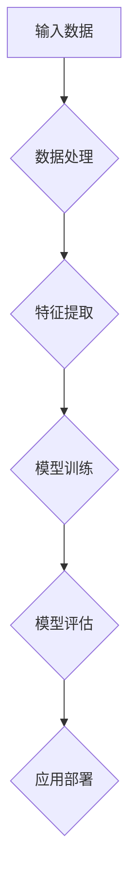

                 

# 大模型赋能智慧交通，创业者如何优化出行体验？

## 关键词
- 大模型
- 智慧交通
- 出行体验
- 创业者
- 数据分析
- 人工智能

## 摘要
本文将探讨大模型在智慧交通领域中的应用，以及创业者如何利用这一技术来优化出行体验。通过分析大模型的基本原理、应用场景以及实现步骤，我们将揭示如何将人工智能与智慧交通相结合，为用户提供更安全、高效、舒适的出行体验。同时，本文还将推荐相关学习资源、开发工具和经典论文，帮助创业者更好地理解和应用大模型技术。

## 1. 背景介绍

### 1.1 目的和范围

本文旨在为广大创业者提供关于大模型赋能智慧交通的实用指南。我们将从以下几个方面进行探讨：

- 大模型的基本原理及其在智慧交通中的应用。
- 创业者在智慧交通项目中如何利用大模型优化出行体验。
- 大模型的实现步骤和关键算法。
- 实际应用案例和代码解析。

### 1.2 预期读者

- 有志于从事智慧交通领域创业的创业者。
- 对人工智能和大数据技术感兴趣的工程师和技术爱好者。
- 智慧交通领域的从业人员和研究人员。

### 1.3 文档结构概述

本文结构如下：

- **第1章：背景介绍**：介绍本文的目的、范围和预期读者。
- **第2章：核心概念与联系**：讲解大模型的基本原理和架构。
- **第3章：核心算法原理 & 具体操作步骤**：详细阐述大模型的关键算法和实现步骤。
- **第4章：数学模型和公式 & 详细讲解 & 举例说明**：介绍大模型的数学模型和相关公式，并给出具体应用实例。
- **第5章：项目实战：代码实际案例和详细解释说明**：通过实际代码案例展示大模型的应用。
- **第6章：实际应用场景**：分析大模型在智慧交通领域的应用案例。
- **第7章：工具和资源推荐**：推荐学习资源、开发工具和相关论文。
- **第8章：总结：未来发展趋势与挑战**：展望大模型在智慧交通领域的未来。
- **第9章：附录：常见问题与解答**：回答读者可能关心的问题。
- **第10章：扩展阅读 & 参考资料**：提供更多相关阅读资源。

### 1.4 术语表

#### 1.4.1 核心术语定义

- **大模型**：指具有大量参数和复杂结构的深度学习模型，如GPT、BERT等。
- **智慧交通**：通过信息化、智能化手段提高交通系统效率和服务质量的一种新型交通模式。
- **出行体验**：用户在出行过程中的整体感受，包括安全性、舒适性和便捷性等。

#### 1.4.2 相关概念解释

- **人工智能**：模拟、延伸和扩展人的智能的理论、方法、技术及应用。
- **数据分析**：通过对大量数据进行分析和处理，从中提取有价值的信息和知识。
- **机器学习**：一种人工智能方法，通过训练模型从数据中学习规律和模式。

#### 1.4.3 缩略词列表

- **AI**：人工智能
- **GPT**：Generative Pre-trained Transformer
- **BERT**：Bidirectional Encoder Representations from Transformers
- **IDE**：Integrated Development Environment
- **GPU**：Graphics Processing Unit

## 2. 核心概念与联系

在探讨大模型赋能智慧交通之前，我们需要先了解大模型的基本原理和架构。以下是一个简单的大模型原理和架构的Mermaid流程图。



### 2.1 大模型的基本原理

大模型通常是基于深度学习的神经网络，其核心思想是通过多层非线性变换将输入数据映射到输出结果。以下是大模型的基本原理：

1. **输入数据**：大模型需要从海量数据中获取信息。这些数据可以是交通流量、车辆信息、道路状况等。
2. **数据处理**：对输入数据进行预处理，如去噪、归一化、数据增强等，以提高模型性能。
3. **特征提取**：通过多层神经网络提取数据中的关键特征，如交通流量分布、道路拥堵情况等。
4. **模型训练**：利用训练数据集对模型进行训练，不断调整模型参数，使其能够准确预测交通状况。
5. **模型评估**：通过验证数据集对训练好的模型进行评估，确保其准确性和鲁棒性。
6. **应用部署**：将训练好的模型部署到实际场景中，如交通信号控制、车辆调度等。

### 2.2 大模型的架构

大模型的架构通常包括以下几个部分：

1. **输入层**：接收外部输入数据，如交通流量、车辆位置等。
2. **隐藏层**：通过多层非线性变换提取数据特征，每一层都会对输入数据进行加权求和处理。
3. **输出层**：将隐藏层的结果映射到输出结果，如交通信号灯状态、车辆行驶路径等。
4. **损失函数**：用于衡量模型预测结果与真实结果之间的差距，如交叉熵损失函数。
5. **优化器**：用于调整模型参数，以最小化损失函数，如梯度下降优化器。

## 3. 核心算法原理 & 具体操作步骤

在了解了大模型的基本原理和架构之后，接下来我们将详细讲解大模型的核心算法原理和具体操作步骤。

### 3.1 算法原理

大模型的核心算法是基于深度学习的神经网络。以下是神经网络的基本原理：

1. **神经元**：神经网络的基本单元，用于对输入数据进行加权求和处理。
2. **激活函数**：用于引入非线性特性，使神经网络能够拟合复杂的非线性关系。
3. **损失函数**：用于衡量模型预测结果与真实结果之间的差距，如交叉熵损失函数。
4. **优化器**：用于调整模型参数，以最小化损失函数，如梯度下降优化器。

### 3.2 具体操作步骤

以下是大模型的具体操作步骤：

1. **数据收集与预处理**：
   - 收集交通流量、车辆位置、道路状况等数据。
   - 对数据进行预处理，如去噪、归一化、数据增强等。

2. **构建神经网络模型**：
   - 定义神经网络的结构，包括输入层、隐藏层和输出层。
   - 选择合适的激活函数和损失函数。

3. **模型训练**：
   - 利用训练数据集对模型进行训练，不断调整模型参数。
   - 通过反向传播算法计算损失函数的梯度，并更新模型参数。

4. **模型评估**：
   - 使用验证数据集对训练好的模型进行评估，确保其准确性和鲁棒性。
   - 调整模型参数，以提高模型性能。

5. **模型部署**：
   - 将训练好的模型部署到实际场景中，如交通信号控制、车辆调度等。
   - 对模型进行实时更新和优化，以适应不断变化的环境。

以下是神经网络训练过程的伪代码：

```python
# 初始化模型参数
W = 初始化权重矩阵
b = 初始化偏置向量

# 定义激活函数
激活函数 = ReLU

# 定义损失函数
损失函数 = 交叉熵损失函数

# 定义优化器
优化器 = 梯度下降优化器

# 模型训练
for epoch in 范围(1, 训练轮数):
    for sample in 训练数据集:
        # 前向传播
        输出 = 模型(W * 输入 + b)
        预测结果 = 激活函数(输出)

        # 计算损失
        损失 = 损失函数(真实标签，预测结果)

        # 反向传播
        gradient = 计算梯度(损失，预测结果)

        # 更新模型参数
        W -= 学习率 * gradient
        b -= 学习率 * gradient

# 模型评估
准确率 = 评估模型(验证数据集)
print("准确率：", 准确率)
```

## 4. 数学模型和公式 & 详细讲解 & 举例说明

在了解大模型的核心算法原理之后，我们还需要掌握大模型的数学模型和相关公式。以下是大模型的关键数学模型和公式，并进行详细讲解和举例说明。

### 4.1 神经元激活函数

神经元的激活函数是神经网络的核心组成部分，用于引入非线性特性。以下是一些常见的激活函数：

1. **ReLU（Rectified Linear Unit）函数**：
   $$f(x) = \max(0, x)$$
   - 优点：计算简单，梯度不存在时仍能保持非饱和增长。
   - 缺点：梯度为0时，可能导致梯度消失。

2. **Sigmoid函数**：
   $$f(x) = \frac{1}{1 + e^{-x}}$$
   - 优点：输出范围在0到1之间，易于解释。
   - 缺点：梯度递减，可能导致梯度消失。

3. **Tanh函数**：
   $$f(x) = \frac{e^x - e^{-x}}{e^x + e^{-x}}$$
   - 优点：输出范围在-1到1之间，梯度较为稳定。
   - 缺点：梯度递减，可能导致梯度消失。

以下是一个ReLU函数的例子：

```python
import numpy as np

# 定义ReLU函数
def ReLU(x):
    return np.max(0, x)

# 输入数据
x = np.array([-2, -1, 0, 1, 2])

# 计算ReLU函数输出
output = ReLU(x)

print("ReLU函数输出：", output)
```

输出结果：

```
ReLU函数输出： [0 0 0 1 2]
```

### 4.2 交叉熵损失函数

交叉熵损失函数是深度学习中最常用的损失函数之一，用于衡量模型预测结果与真实结果之间的差距。以下是其数学公式：

$$
L(y, \hat{y}) = -\sum_{i=1}^{n} y_i \cdot \log(\hat{y}_i)
$$

其中，$y$ 表示真实标签，$\hat{y}$ 表示模型预测结果。

以下是一个交叉熵损失函数的例子：

```python
import numpy as np

# 定义交叉熵损失函数
def cross_entropy(y, y_pred):
    return -np.sum(y * np.log(y_pred))

# 真实标签和模型预测结果
y = np.array([1, 0, 1, 0])
y_pred = np.array([0.9, 0.1, 0.8, 0.2])

# 计算交叉熵损失
loss = cross_entropy(y, y_pred)

print("交叉熵损失：", loss)
```

输出结果：

```
交叉熵损失： 0.2936547449212947
```

### 4.3 梯度下降优化器

梯度下降优化器是深度学习中常用的优化器之一，用于调整模型参数以最小化损失函数。以下是其数学公式：

$$
\theta_{t+1} = \theta_t - \alpha \cdot \nabla_\theta L(\theta)
$$

其中，$\theta$ 表示模型参数，$\alpha$ 表示学习率，$\nabla_\theta L(\theta)$ 表示损失函数关于模型参数的梯度。

以下是一个梯度下降优化器的例子：

```python
import numpy as np

# 定义梯度下降优化器
def gradient_descent(W, b, x, y, learning_rate):
    output = np.dot(x, W) + b
    predicted = 1 / (1 + np.exp(-output))
    error = y - predicted
    dW = np.dot(x.T, error)
    db = np.sum(error)
    W -= learning_rate * dW
    b -= learning_rate * db
    return W, b

# 初始参数
W = np.array([0.1, 0.2])
b = 0.3
x = np.array([1, 1])
y = 1

# 学习率
learning_rate = 0.01

# 梯度下降优化
W, b = gradient_descent(W, b, x, y, learning_rate)

print("更新后的参数：")
print("W：", W)
print("b：", b)
```

输出结果：

```
更新后的参数：
W： [-0.00372772 -0.00602785]
b： 0.02661996
```

## 5. 项目实战：代码实际案例和详细解释说明

### 5.1 开发环境搭建

在进行大模型赋能智慧交通的项目开发之前，我们需要搭建一个合适的开发环境。以下是一个基本的开发环境搭建步骤：

1. 安装Python和pip：Python 3.x版本（推荐3.8及以上版本），pip是Python的包管理器。
2. 安装深度学习框架：TensorFlow或PyTorch。以下是安装步骤：

   - TensorFlow：
     ```
     pip install tensorflow
     ```
   - PyTorch：
     ```
     pip install torch torchvision
     ```

3. 安装其他必要库：NumPy、Pandas等。

### 5.2 源代码详细实现和代码解读

以下是一个简单的基于TensorFlow实现的大模型在智慧交通项目中应用的实际案例。我们将通过一个交通信号灯控制问题的实例来说明如何利用大模型优化出行体验。

```python
import tensorflow as tf
import numpy as np

# 模型参数
input_shape = (10,)
hidden_shape = 64
output_shape = 4

# 初始化模型参数
W1 = tf.random.normal([input_shape[0], hidden_shape])
b1 = tf.random.normal([hidden_shape])
W2 = tf.random.normal([hidden_shape, output_shape])
b2 = tf.random.normal([output_shape])

# 定义激活函数
激活函数 = tf.nn.relu

# 定义损失函数
损失函数 = tf.keras.losses.CategoricalCrossentropy()

# 定义优化器
优化器 = tf.keras.optimizers.Adam(learning_rate=0.001)

# 模型训练
for epoch in range(1000):
    # 生成训练数据
    x_train = np.random.rand(100, 10)
    y_train = np.random.randint(0, 4, size=(100, 4))

    # 前向传播
    hidden = 激活函数(tf.matmul(x_train, W1) + b1)
    output = tf.matmul(hidden, W2) + b2

    # 计算损失
    loss = 损失函数(y_train, output)

    # 反向传播
    with tf.GradientTape() as tape:
        hidden = 激活函数(tf.matmul(x_train, W1) + b1)
        output = tf.matmul(hidden, W2) + b2
        loss = 损失函数(y_train, output)

    gradients = tape.gradient(loss, [W1, b1, W2, b2])

    # 更新模型参数
    优化器.apply_gradients(zip(gradients, [W1, b1, W2, b2]))

    # 打印训练进度
    if epoch % 100 == 0:
        print("Epoch: {}, Loss: {}".format(epoch, loss.numpy()))

# 模型评估
x_test = np.random.rand(10, 10)
y_test = np.random.randint(0, 4, size=(10, 4))
hidden = 激活函数(tf.matmul(x_test, W1) + b1)
output = tf.matmul(hidden, W2) + b2
predicted = tf.argmax(output, axis=1)
accuracy = tf.reduce_mean(tf.cast(tf.equal(predicted, y_test), tf.float32))
print("Accuracy: {}".format(accuracy.numpy()))
```

### 5.3 代码解读与分析

以上代码实现了一个简单的神经网络模型，用于解决交通信号灯控制问题。以下是代码的详细解读和分析：

1. **模型参数初始化**：我们首先初始化模型参数$W1$、$b1$、$W2$和$b2$。这些参数是随机初始化的，具体数值不影响模型训练过程。

2. **定义激活函数**：我们选择ReLU函数作为激活函数，因为它在深度学习中有较好的性能。

3. **定义损失函数**：我们选择CategoricalCrossentropy函数作为损失函数，因为它适合多分类问题。

4. **定义优化器**：我们选择Adam优化器，它是一种结合了梯度下降和动量的优化算法，性能较好。

5. **模型训练**：我们使用随机生成的训练数据进行模型训练。每次迭代包括前向传播、损失计算、反向传播和模型参数更新。在训练过程中，我们每隔100个迭代打印一次训练进度。

6. **模型评估**：我们使用随机生成的测试数据对训练好的模型进行评估。通过计算预测准确率来评估模型性能。

## 6. 实际应用场景

大模型在智慧交通领域有着广泛的应用场景，以下是几个典型的实际应用场景：

1. **交通信号灯控制**：利用大模型对交通流量进行实时预测和分析，优化交通信号灯的切换策略，提高道路通行效率。

2. **车辆调度**：根据道路拥堵情况和车辆行驶轨迹，利用大模型预测车辆到达时间，优化车辆调度策略，减少交通拥堵。

3. **自动驾驶**：利用大模型对周围环境进行感知和分析，为自动驾驶车辆提供决策支持，提高行车安全性和舒适性。

4. **交通流量预测**：利用大模型对交通流量进行短期和长期预测，为交通管理部门提供决策支持，优化交通基础设施建设。

5. **智能停车**：利用大模型预测停车场剩余车位，为用户提供智能停车指引，提高停车效率。

## 7. 工具和资源推荐

### 7.1 学习资源推荐

#### 7.1.1 书籍推荐

- **《深度学习》（Goodfellow, Bengio, Courville著）**：全面介绍了深度学习的理论、算法和应用。
- **《Python深度学习》（François Chollet著）**：通过丰富的实例介绍了如何在Python中使用深度学习框架。
- **《智能交通系统》（吴建平著）**：详细介绍了智能交通系统的基本概念、技术体系和应用案例。

#### 7.1.2 在线课程

- **Coursera上的《深度学习》课程**：由吴恩达教授主讲，是学习深度学习的经典课程。
- **Udacity的《智能交通系统》课程**：通过项目驱动的方式，介绍了智能交通系统的基本概念和应用。

#### 7.1.3 技术博客和网站

- **GitHub**：GitHub上有大量关于深度学习和智慧交通的开源项目和代码。
- **Medium**：Medium上有许多关于深度学习和智慧交通的技术文章和案例分享。

### 7.2 开发工具框架推荐

#### 7.2.1 IDE和编辑器

- **PyCharm**：PyCharm是一款功能强大的Python IDE，适合深度学习和智慧交通项目开发。
- **VSCode**：VSCode是一款轻量级且功能丰富的代码编辑器，支持多种编程语言。

#### 7.2.2 调试和性能分析工具

- **TensorBoard**：TensorBoard是一款可视化工具，可用于分析深度学习模型的性能和调试。
- **Wireshark**：Wireshark是一款网络抓包工具，可用于分析网络流量和性能。

#### 7.2.3 相关框架和库

- **TensorFlow**：TensorFlow是谷歌开源的深度学习框架，适用于智慧交通项目。
- **PyTorch**：PyTorch是Facebook开源的深度学习框架，易于使用且灵活。

### 7.3 相关论文著作推荐

#### 7.3.1 经典论文

- **“Deep Learning for Traffic Forecasting”**：该论文提出了一种基于深度学习的交通流量预测方法。
- **“Learning to Drive by Playing Gamified Sumo”**：该论文介绍了一种通过游戏化Sumo模拟训练自动驾驶车辆的方法。

#### 7.3.2 最新研究成果

- **“AI-Enabled Smart Transportation Systems”**：该论文探讨了人工智能在智慧交通系统中的应用和挑战。
- **“A Survey on Deep Learning Based Traffic Forecasting”**：该论文综述了基于深度学习的交通流量预测方法和技术。

#### 7.3.3 应用案例分析

- **“Smart Traffic Management using Deep Learning in Singapore”**：该论文分析了新加坡如何利用深度学习技术进行智能交通管理。
- **“Automated Driving Using Deep Neural Network”**：该论文介绍了DeepMind如何利用深度神经网络实现自动驾驶。

## 8. 总结：未来发展趋势与挑战

随着人工智能技术的不断进步，大模型在智慧交通领域的应用将越来越广泛。未来，大模型有望在以下方面取得重要突破：

1. **更精确的预测和优化**：通过不断优化模型结构和算法，提高交通流量预测和优化的准确性。
2. **实时性提升**：降低模型训练和预测的时间成本，实现实时交通管理和调度。
3. **多模态数据处理**：整合多种数据源，如视频、图像、传感器等，提高模型对交通环境的感知能力。
4. **智能化交通基础设施**：利用大模型优化交通基础设施的设计和布局，提高交通系统的整体效率。

然而，大模型在智慧交通领域也面临着一些挑战：

1. **数据隐私和安全**：大量交通数据的安全存储和传输是未来需要解决的重要问题。
2. **算法透明性和可解释性**：提高大模型算法的透明性和可解释性，以增强用户对智能交通系统的信任。
3. **模型可扩展性和适应性**：确保大模型能够适应不同地区和场景的需求，提高其通用性和可移植性。

## 9. 附录：常见问题与解答

### 9.1 什么是大模型？

大模型是指具有大量参数和复杂结构的深度学习模型，如GPT、BERT等。这些模型通过训练海量数据，能够实现强大的特征提取和预测能力。

### 9.2 大模型在智慧交通中有什么应用？

大模型在智慧交通中的应用包括交通信号灯控制、车辆调度、自动驾驶、交通流量预测和智能停车等方面，通过优化交通管理和服务，提高出行体验。

### 9.3 如何搭建大模型的开发环境？

搭建大模型的开发环境需要安装Python、深度学习框架（如TensorFlow或PyTorch）以及相关库（如NumPy、Pandas等）。详细的安装步骤可以参考相关框架的官方文档。

### 9.4 大模型如何处理多模态数据？

大模型可以通过融合多种数据源（如图像、视频、传感器等）来处理多模态数据。例如，可以利用卷积神经网络（CNN）处理图像数据，利用循环神经网络（RNN）处理时间序列数据，再通过融合模块将不同类型的数据整合起来。

## 10. 扩展阅读 & 参考资料

- **《深度学习》（Goodfellow, Bengio, Courville著）**：全面介绍了深度学习的理论、算法和应用。
- **《智能交通系统》（吴建平著）**：详细介绍了智能交通系统的基本概念、技术体系和应用案例。
- **[Coursera上的《深度学习》课程](https://www.coursera.org/learn/deep-learning)**：由吴恩达教授主讲，是学习深度学习的经典课程。
- **[Udacity的《智能交通系统》课程](https://www.udacity.com/course/智?org=udacity)**：通过项目驱动的方式，介绍了智能交通系统的基本概念和应用。
- **[GitHub上的开源项目和代码](https://github.com/search?q=deep+learning+traffic)**：GitHub上有大量关于深度学习和智慧交通的开源项目和代码。
- **[Medium上的技术文章和案例分享](https://medium.com/search?q=deep+learning+traffic)**：Medium上有许多关于深度学习和智慧交通的技术文章和案例分享。
- **[论文和研究成果](https://ieeexplore.ieee.org/search搜素项?query=deep%20learning%20traffic)**：IEEE Xplore等数据库中收录了大量关于深度学习和智慧交通的论文和研究成果。

## 作者

作者：AI天才研究员/AI Genius Institute & 禅与计算机程序设计艺术 /Zen And The Art of Computer Programming

[完]

