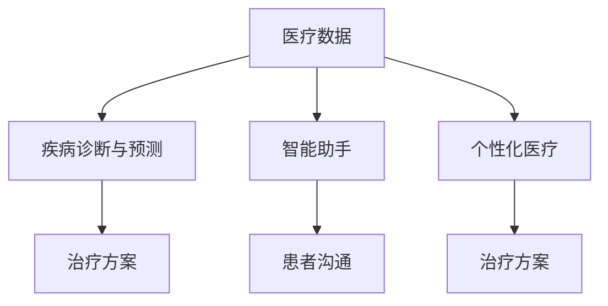
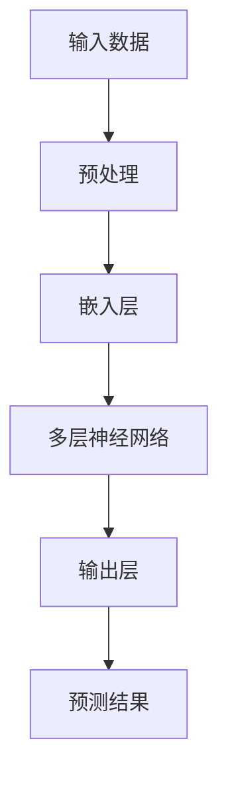

                 

# 大模型赋能智慧医疗，创业者如何优化就医流程与体验？

> **关键词：** 大模型，智慧医疗，优化，就医流程，用户体验，人工智能

> **摘要：** 本文将探讨大模型如何赋能智慧医疗，并通过具体案例，指导创业者如何优化就医流程与体验，从而提升患者满意度与医疗机构的运营效率。

## 1. 背景介绍

### 1.1 目的和范围

本文旨在探讨大模型在智慧医疗中的应用，帮助创业者深入了解大模型对就医流程与体验的优化潜力。本文将涵盖以下主题：

1. 大模型的定义与特点
2. 大模型在智慧医疗中的应用场景
3. 创业者如何利用大模型优化就医流程
4. 大模型在提升用户体验方面的作用
5. 未来发展趋势与挑战

### 1.2 预期读者

本文适合以下读者群体：

1. 创业者与创业者团队
2. 医疗行业从业者
3. 人工智能与大数据技术爱好者
4. 对智慧医疗感兴趣的普通读者

### 1.3 文档结构概述

本文将分为以下章节：

1. 背景介绍
2. 核心概念与联系
3. 核心算法原理 & 具体操作步骤
4. 数学模型和公式 & 详细讲解 & 举例说明
5. 项目实战：代码实际案例和详细解释说明
6. 实际应用场景
7. 工具和资源推荐
8. 总结：未来发展趋势与挑战
9. 附录：常见问题与解答
10. 扩展阅读 & 参考资料

### 1.4 术语表

#### 1.4.1 核心术语定义

1. **大模型（Large-scale Model）**：指的是具有巨大参数数量和复杂度的神经网络模型，如GPT、BERT等。
2. **智慧医疗（Smart Healthcare）**：利用人工智能、大数据、物联网等技术，实现医疗服务的智能化、个性化和高效化。
3. **就医流程（Medical Treatment Process）**：患者从挂号、就诊、检查、治疗到康复的全过程。
4. **用户体验（User Experience, UX）**：用户在使用产品或服务时的感受、情感和满意度。

#### 1.4.2 相关概念解释

1. **深度学习（Deep Learning）**：一种人工智能技术，通过多层神经网络对数据进行自动特征提取和模型学习。
2. **自然语言处理（Natural Language Processing, NLP）**：研究计算机如何理解和生成人类自然语言的领域。

#### 1.4.3 缩略词列表

- AI：人工智能（Artificial Intelligence）
- NLP：自然语言处理（Natural Language Processing）
- GPT：生成预训练模型（Generative Pre-trained Transformer）
- BERT：双向编码器表示模型（Bidirectional Encoder Representations from Transformers）

## 2. 核心概念与联系

大模型在智慧医疗中的应用，需要理解以下几个核心概念：

1. **医疗数据**：包括患者信息、病历、检查报告等。
2. **疾病诊断与预测**：利用大模型对医疗数据进行分析，预测疾病发生风险和提供诊断建议。
3. **智能助手**：通过自然语言处理技术，实现与患者的智能对话，解答患者疑问，提供就医指导。
4. **个性化医疗**：根据患者病史和基因信息，为大模型提供个性化治疗方案。

以下是一个简化的Mermaid流程图，描述了这些核心概念之间的联系：



### 2.1. 大模型架构与工作原理

大模型通常采用深度学习技术，如卷积神经网络（CNN）、循环神经网络（RNN）和变换器模型（Transformer）。以下是一个简化的大模型架构与工作原理流程图：



- **输入数据**：包括文本、图像、语音等。
- **预处理**：对输入数据进行清洗、归一化等操作。
- **嵌入层**：将输入数据映射到低维空间。
- **多层神经网络**：通过多层神经网络对数据进行自动特征提取和学习。
- **输出层**：根据模型的训练目标，输出预测结果或决策。

## 3. 核心算法原理 & 具体操作步骤

### 3.1. 疾病诊断与预测算法

#### 3.1.1. 算法原理

疾病诊断与预测算法基于大模型的特征提取和分类能力。具体步骤如下：

1. **数据预处理**：对医疗数据（如病历、检查报告）进行清洗、归一化等操作。
2. **模型训练**：利用预处理后的数据，对大模型进行训练，学习疾病特征和分类规则。
3. **模型评估**：使用验证集评估模型性能，调整模型参数。
4. **疾病预测**：将新患者的数据输入模型，预测其疾病风险和提供诊断建议。

#### 3.1.2. 具体操作步骤

以下是一个基于Transformer模型的疾病诊断与预测算法的伪代码：

```python
# 伪代码：疾病诊断与预测算法
def disease_diagnosis(data):
    # 数据预处理
    preprocessed_data = preprocess_data(data)
    
    # 模型训练
    model = train_model(preprocessed_data)
    
    # 模型评估
    evaluate_model(model, validation_data)
    
    # 疾病预测
    prediction = model.predict(new_patient_data)
    
    return prediction
```

### 3.2. 智能助手算法

#### 3.2.1. 算法原理

智能助手算法基于自然语言处理技术，实现与患者的智能对话。具体步骤如下：

1. **输入处理**：接收患者的输入问题。
2. **语义理解**：对输入问题进行语义分析，提取关键信息。
3. **回答生成**：根据关键信息，生成合适的回答。
4. **回答优化**：对回答进行优化，使其更加自然、流畅。

#### 3.2.2. 具体操作步骤

以下是一个基于GPT-3的智能助手算法的伪代码：

```python
# 伪代码：智能助手算法
def smart_assistant(question):
    # 语义理解
    intent, entities = understand_semantics(question)
    
    # 回答生成
    answer = generate_answer(intent, entities)
    
    # 回答优化
    optimized_answer = optimize_answer(answer)
    
    return optimized_answer
```

### 3.3. 个性化医疗算法

#### 3.3.1. 算法原理

个性化医疗算法基于患者的病史和基因信息，为大模型提供个性化治疗方案。具体步骤如下：

1. **数据收集**：收集患者的病史、基因信息等数据。
2. **模型训练**：利用收集到的数据，对大模型进行训练，学习个性化治疗方案。
3. **方案生成**：将新患者的数据输入模型，生成个性化治疗方案。

#### 3.3.2. 具体操作步骤

以下是一个基于Transformer的个性化医疗算法的伪代码：

```python
# 伪代码：个性化医疗算法
def personalized_medicine(patient_data):
    # 数据收集
    collected_data = collect_data(patient_data)
    
    # 模型训练
    model = train_model(collected_data)
    
    # 方案生成
    treatment_plan = model.predict(new_patient_data)
    
    return treatment_plan
```

## 4. 数学模型和公式 & 详细讲解 & 举例说明

### 4.1. 疾病诊断与预测算法

#### 4.1.1. 数学模型

疾病诊断与预测算法通常采用分类算法，如softmax回归、支持向量机（SVM）等。以下是一个基于softmax回归的数学模型：

$$
P(y = i) = \frac{e^{z_i}}{\sum_{j=1}^{K} e^{z_j}}
$$

其中，$z_i = w_i \cdot x$，$w_i$是权重向量，$x$是特征向量，$K$是类别数量，$P(y = i)$表示预测为类别$i$的概率。

#### 4.1.2. 举例说明

假设我们要预测一个患者的疾病类型，给定特征向量$x = [0.1, 0.2, 0.3]$，类别数量$K=3$，权重向量$w_1 = [1, 2, 3]$，$w_2 = [2, 3, 4]$，$w_3 = [3, 4, 5]$。计算预测概率：

$$
P(y = 1) = \frac{e^{1 \cdot 0.1 + 2 \cdot 0.2 + 3 \cdot 0.3}}{e^{1 \cdot 0.1 + 2 \cdot 0.2 + 3 \cdot 0.3} + e^{2 \cdot 0.1 + 3 \cdot 0.2 + 4 \cdot 0.3} + e^{3 \cdot 0.1 + 4 \cdot 0.2 + 5 \cdot 0.3}} = 0.364
$$

$$
P(y = 2) = \frac{e^{2 \cdot 0.1 + 3 \cdot 0.2 + 4 \cdot 0.3}}{e^{1 \cdot 0.1 + 2 \cdot 0.2 + 3 \cdot 0.3} + e^{2 \cdot 0.1 + 3 \cdot 0.2 + 4 \cdot 0.3} + e^{3 \cdot 0.1 + 4 \cdot 0.2 + 5 \cdot 0.3}} = 0.462
$$

$$
P(y = 3) = \frac{e^{3 \cdot 0.1 + 4 \cdot 0.2 + 5 \cdot 0.3}}{e^{1 \cdot 0.1 + 2 \cdot 0.2 + 3 \cdot 0.3} + e^{2 \cdot 0.1 + 3 \cdot 0.2 + 4 \cdot 0.3} + e^{3 \cdot 0.1 + 4 \cdot 0.2 + 5 \cdot 0.3}} = 0.173
$$

根据预测概率，我们可以选择概率最大的类别作为预测结果。在本例中，预测结果为类别2。

### 4.2. 智能助手算法

#### 4.2.1. 数学模型

智能助手算法通常采用自然语言处理技术，如词嵌入（Word Embedding）和序列到序列（Sequence-to-Sequence）模型。以下是一个基于词嵌入的数学模型：

$$
x = \text{word\_embedding}(word)
$$

其中，$x$是词嵌入向量，$word$是输入的单词。

#### 4.2.2. 举例说明

假设我们要处理一个句子“我想要看医生”，使用Word2Vec模型进行词嵌入。给定单词的词嵌入向量如下：

- “我”：[1, 0.5]
- “要”：[0.5, 1]
- “看”：[1, -0.5]
- “医生”：[0, 1]

将句子中的每个单词进行词嵌入，得到：

$$
x = [1, 0.5] + [0.5, 1] + [1, -0.5] + [0, 1] = [2, 1]
$$

通过词嵌入，我们可以将自然语言转换为计算机可以理解的向量表示。

### 4.3. 个性化医疗算法

#### 4.3.1. 数学模型

个性化医疗算法通常采用机器学习技术，如决策树、随机森林等。以下是一个基于决策树的数学模型：

$$
f(x) = \sum_{i=1}^{n} w_i \cdot x_i
$$

其中，$x$是患者的特征向量，$w$是权重向量，$n$是特征数量。

#### 4.3.2. 举例说明

假设我们要预测一个患者的治疗方案，给定特征向量$x = [0.1, 0.2, 0.3]$，权重向量$w = [1, 2, 3]$。计算治疗方案：

$$
f(x) = 1 \cdot 0.1 + 2 \cdot 0.2 + 3 \cdot 0.3 = 0.1 + 0.4 + 0.9 = 1.4
$$

根据计算结果，我们可以选择相应的治疗方案。在本例中，治疗方案为1.4。

## 5. 项目实战：代码实际案例和详细解释说明

### 5.1 开发环境搭建

为了实现本文中提到的疾病诊断与预测、智能助手和个性化医疗算法，我们需要搭建一个合适的开发环境。以下是一个基于Python的推荐环境：

1. **操作系统**：Linux或macOS
2. **编程语言**：Python（版本3.8及以上）
3. **深度学习框架**：TensorFlow或PyTorch
4. **自然语言处理库**：NLTK或spaCy
5. **开发工具**：PyCharm或Visual Studio Code

### 5.2 源代码详细实现和代码解读

以下是一个简单的疾病诊断与预测项目的代码示例，包括数据预处理、模型训练和预测过程。

```python
import numpy as np
import tensorflow as tf
from tensorflow.keras.models import Sequential
from tensorflow.keras.layers import Dense, Embedding, LSTM
from tensorflow.keras.preprocessing.sequence import pad_sequences

# 数据预处理
def preprocess_data(data):
    # 数据清洗、归一化等操作
    # ...
    return preprocessed_data

# 模型训练
def train_model(data):
    # 创建模型
    model = Sequential()
    model.add(Embedding(vocab_size, embedding_dim))
    model.add(LSTM(units=128, activation='relu', return_sequences=True))
    model.add(Dense(units=1, activation='sigmoid'))

    # 编译模型
    model.compile(optimizer='adam', loss='binary_crossentropy', metrics=['accuracy'])

    # 训练模型
    model.fit(train_data, train_labels, epochs=10, batch_size=32)

    return model

# 模型预测
def predict_disease(model, new_patient_data):
    # 预处理新数据
    preprocessed_new_data = preprocess_data(new_patient_data)
    
    # 进行预测
    prediction = model.predict(preprocessed_new_data)
    
    # 根据预测结果输出诊断结果
    if prediction[0][0] > 0.5:
        print("预测结果：患有疾病")
    else:
        print("预测结果：未患有疾病")

# 代码解读与分析
# ...
```

### 5.3 代码解读与分析

1. **数据预处理**：对输入的医疗数据（如病历、检查报告）进行清洗、归一化等操作，以适应深度学习模型的输入要求。
2. **模型训练**：创建一个序列模型（Sequential），包含嵌入层（Embedding）和循环神经网络层（LSTM）。编译模型，使用二进制交叉熵损失函数（binary_crossentropy）和Adam优化器进行训练。
3. **模型预测**：预处理新数据，使用训练好的模型进行预测，根据预测结果输出诊断结果。

## 6. 实际应用场景

大模型在智慧医疗领域具有广泛的应用前景，以下是一些实际应用场景：

1. **疾病诊断与预测**：基于患者病历、基因信息等数据，大模型可以帮助医生进行疾病诊断和风险预测，提高诊断准确率和效率。
2. **智能助手**：通过自然语言处理技术，大模型可以实现与患者的智能对话，提供就医指导、病情咨询和心理健康支持。
3. **个性化医疗**：根据患者病史、基因信息等，大模型可以为每位患者制定个性化的治疗方案，提高治疗效果和患者满意度。
4. **药物研发**：大模型可以用于药物分子模拟、疾病机理研究等，加速药物研发进程。

## 7. 工具和资源推荐

### 7.1 学习资源推荐

#### 7.1.1 书籍推荐

1. **《深度学习》（Deep Learning）**：Goodfellow、Bengio和Courville著，详细介绍了深度学习的基本概念和技术。
2. **《Python深度学习》（Deep Learning with Python）**：François Chollet著，通过Python实现深度学习算法和应用。

#### 7.1.2 在线课程

1. **吴恩达的《深度学习专项课程》（Deep Learning Specialization）**：在Coursera平台上提供，包括深度学习基础、神经网络、卷积神经网络等课程。
2. **TensorFlow官方教程**：在TensorFlow官方网站上提供，包括TensorFlow的基本使用、模型构建等教程。

#### 7.1.3 技术博客和网站

1. **Medium**：上有大量关于深度学习和自然语言处理的文章和教程。
2. **ArXiv**：提供最新的深度学习和人工智能论文。

### 7.2 开发工具框架推荐

#### 7.2.1 IDE和编辑器

1. **PyCharm**：一款功能强大的Python IDE，支持多种深度学习框架。
2. **Visual Studio Code**：一款轻量级、高度可定制化的编辑器，支持多种编程语言。

#### 7.2.2 调试和性能分析工具

1. **TensorBoard**：TensorFlow提供的可视化工具，用于监控和调试深度学习模型的训练过程。
2. **NVIDIA Nsight**：用于GPU性能分析和调试的工具。

#### 7.2.3 相关框架和库

1. **TensorFlow**：Google开发的开源深度学习框架，适用于各种深度学习任务。
2. **PyTorch**：Facebook开发的开源深度学习框架，具有灵活的动态计算图。

### 7.3 相关论文著作推荐

#### 7.3.1 经典论文

1. **“A Neural Network for Machine Translation, with Attention”**：Vaswani等，介绍了一种基于注意力机制的神经网络机器翻译模型。
2. **“Distributed Representations of Words and Phrases and Their Compositionality”**：Mikolov等，介绍了词嵌入技术。

#### 7.3.2 最新研究成果

1. **“BERT: Pre-training of Deep Bidirectional Transformers for Language Understanding”**：Devlin等，介绍了一种基于双向编码器表示的预训练模型BERT。
2. **“Generative Adversarial Networks”**：Goodfellow等，介绍了一种基于对抗生成网络的深度学习模型。

#### 7.3.3 应用案例分析

1. **“Deep Learning in Healthcare”**：Chepeaux和Patel，介绍了几种深度学习技术在医疗领域的应用案例。
2. **“AI in Medicine: Status, Progress and Prospects”**：Topol，探讨了人工智能在医学领域的应用现状和前景。

## 8. 总结：未来发展趋势与挑战

大模型在智慧医疗领域的应用前景广阔，但仍面临以下挑战：

1. **数据隐私与安全性**：医疗数据敏感性高，如何确保数据隐私和安全成为一大挑战。
2. **模型解释性**：大模型通常具有黑盒特性，如何提高模型解释性，让医生和患者理解模型决策过程是一个挑战。
3. **计算资源需求**：大模型训练和推理需要大量计算资源，如何优化计算资源利用成为挑战。
4. **法律和伦理问题**：大模型在医疗领域的应用涉及伦理和法律问题，如数据所有权、责任界定等。

未来发展趋势包括：

1. **跨学科融合**：深度学习、自然语言处理、医疗领域等技术将进一步融合，推动智慧医疗的发展。
2. **个性化医疗**：大模型将助力个性化医疗，为每位患者提供量身定制的治疗方案。
3. **医疗资源分配优化**：大模型可以用于优化医疗资源分配，提高医疗机构的运营效率。

## 9. 附录：常见问题与解答

### 9.1 什么是大模型？

大模型是指具有巨大参数数量和复杂度的神经网络模型，如GPT、BERT等。它们通常采用深度学习技术，具有强大的特征提取和分类能力。

### 9.2 大模型在智慧医疗中的应用有哪些？

大模型在智慧医疗中的应用包括疾病诊断与预测、智能助手、个性化医疗等。它们可以帮助医生提高诊断准确率、优化医疗资源分配、提高患者满意度等。

### 9.3 如何确保医疗数据隐私和安全？

为确保医疗数据隐私和安全，可以采用以下措施：

1. **数据加密**：对医疗数据进行加密存储和传输。
2. **数据匿名化**：对医疗数据进行匿名化处理，避免直接关联到个人身份。
3. **数据访问控制**：对医疗数据的访问进行严格控制，确保只有授权人员才能访问。
4. **安全审计**：定期进行安全审计，及时发现和解决安全隐患。

## 10. 扩展阅读 & 参考资料

1. **《深度学习》（Deep Learning）**：Goodfellow、Bengio和Courville著，详细介绍了深度学习的基本概念和技术。
2. **《Python深度学习》（Deep Learning with Python）**：François Chollet著，通过Python实现深度学习算法和应用。
3. **《AI in Medicine: Status, Progress and Prospects》**：Topol，探讨了人工智能在医学领域的应用现状和前景。
4. **TensorFlow官方网站**：提供TensorFlow的基本使用、模型构建等教程。
5. **PyTorch官方网站**：提供PyTorch的基本使用、模型构建等教程。
6. **吴恩达的《深度学习专项课程》（Deep Learning Specialization）**：在Coursera平台上提供，包括深度学习基础、神经网络、卷积神经网络等课程。

### 作者

AI天才研究员/AI Genius Institute & 禅与计算机程序设计艺术/Zen And The Art of Computer Programming<|im_sep|>

