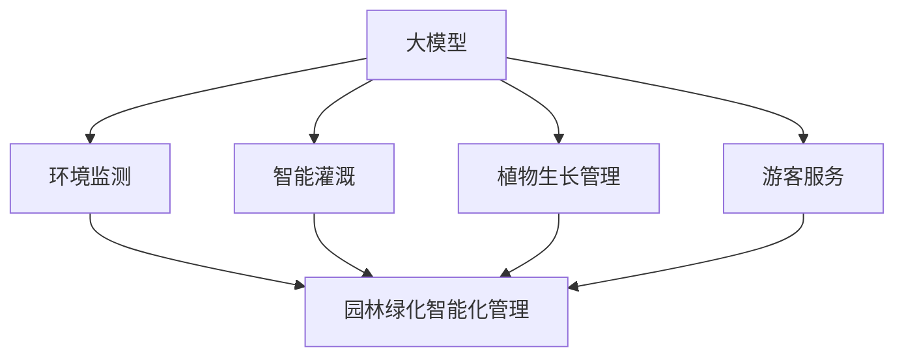

                 

# 大模型赋能智慧园林，创业者如何推动园林绿化智能化管理？

> **关键词：** 大模型，智慧园林，园林绿化，智能化管理，创业者，技术趋势

> **摘要：** 在现代科技飞速发展的背景下，智慧园林成为园林绿化行业发展的新趋势。本文将探讨大模型在智慧园林中的应用，分析创业者如何利用这一技术推动园林绿化智能化管理，提供切实可行的策略和实际案例，以期引导行业未来发展。

## 1. 背景介绍

### 1.1 目的和范围

本文旨在探讨大模型在园林绿化智能化管理中的应用，分析其技术原理、实现步骤，以及创业者如何抓住这一市场机遇。通过本文的阅读，读者可以了解到大模型赋能智慧园林的具体案例，并从中获取实用的创业思路。

### 1.2 预期读者

本文适用于对园林绿化、人工智能技术有兴趣的创业者、技术工程师、行业研究人员以及相关领域的学生。希望本文能对您在智慧园林领域的技术研究和创业实践提供有价值的参考。

### 1.3 文档结构概述

本文将按照以下结构进行阐述：

1. **背景介绍**：介绍智慧园林的发展背景、核心概念及本文目的。
2. **核心概念与联系**：讲解大模型、智慧园林、园林绿化智能化管理等核心概念及其相互关系。
3. **核心算法原理 & 具体操作步骤**：阐述大模型在园林绿化智能化管理中的具体应用算法原理及实现步骤。
4. **数学模型和公式 & 详细讲解 & 举例说明**：介绍大模型相关的数学模型、公式及其应用实例。
5. **项目实战：代码实际案例和详细解释说明**：提供实际项目案例，详细讲解代码实现和解析。
6. **实际应用场景**：分析大模型在园林绿化智能化管理中的应用场景。
7. **工具和资源推荐**：推荐学习资源、开发工具及相关论文。
8. **总结：未来发展趋势与挑战**：总结智慧园林行业的发展趋势和面临的挑战。
9. **附录：常见问题与解答**：解答读者可能遇到的问题。
10. **扩展阅读 & 参考资料**：提供更多相关阅读资料。

### 1.4 术语表

#### 1.4.1 核心术语定义

- **大模型（Large Model）**：具有巨大参数量和计算复杂度的人工智能模型，如Transformer、BERT等。
- **智慧园林（Smart Garden）**：利用现代信息技术，实现对园林环境、植物生长、游客服务等方面的智能化管理和优化。
- **园林绿化智能化管理（Intelligent Management of Green Spaces）**：利用大数据、云计算、人工智能等技术，对园林绿化进行智能化监测、预测和决策支持。

#### 1.4.2 相关概念解释

- **数据驱动（Data-Driven）**：通过收集和分析大量数据，驱动决策和优化。
- **机器学习（Machine Learning）**：使计算机通过数据和经验进行学习，并作出预测或决策。
- **深度学习（Deep Learning）**：一种基于人工神经网络的学习方法，能够处理大规模数据和复杂模型。

#### 1.4.3 缩略词列表

- **AI**：人工智能（Artificial Intelligence）
- **ML**：机器学习（Machine Learning）
- **DL**：深度学习（Deep Learning）
- **NLP**：自然语言处理（Natural Language Processing）
- **GAN**：生成对抗网络（Generative Adversarial Networks）

## 2. 核心概念与联系

在现代园林绿化智能化管理中，大模型作为一种先进的算法技术，正逐渐成为行业发展的关键推动力。本节将首先介绍大模型的基本概念，随后探讨智慧园林和园林绿化智能化管理的相关概念，最后通过Mermaid流程图展示它们之间的联系。

### 2.1 大模型的基本概念

大模型是指具有数百万甚至数十亿参数的深度学习模型，如Transformer、BERT等。这些模型通过在大量数据上训练，能够自动学习和提取数据中的复杂模式，从而在图像识别、自然语言处理、语音识别等领域取得了显著的成果。大模型的核心特点包括：

- **参数量大**：具有数百万至数十亿个参数。
- **计算复杂度高**：需要进行大量的矩阵运算和优化。
- **数据需求大**：需要大量的训练数据来保证模型的性能和泛化能力。

### 2.2 智慧园林的概念

智慧园林是指通过现代信息技术，实现对园林环境、植物生长、游客服务等方面的智能化管理和优化。智慧园林的核心概念包括：

- **环境监测**：利用传感器、无人机等技术对园林环境进行实时监测。
- **智能灌溉**：根据植物需水量和土壤湿度，实现智能灌溉。
- **植物生长管理**：利用大数据和机器学习技术，预测植物生长趋势，优化植物养护策略。
- **游客服务**：提供个性化导览、智能导览等服务，提升游客体验。

### 2.3 绿化园林智能化管理的概念

园林绿化智能化管理是指利用大数据、云计算、人工智能等技术，对园林绿化进行智能化监测、预测和决策支持。其核心内容包括：

- **数据采集**：通过传感器、无人机等技术收集园林环境、植物生长等数据。
- **数据分析**：利用机器学习、深度学习等技术对数据进行处理和分析。
- **预测与决策**：根据分析结果，对园林养护、灌溉、病虫害防治等进行预测和决策。
- **优化与管理**：通过优化策略和智能化管理，提升园林质量和游客体验。

### 2.4 Mermaid流程图展示

以下是一个简单的Mermaid流程图，展示大模型、智慧园林和园林绿化智能化管理之间的联系：



通过上述流程图可以看出，大模型在智慧园林中的应用，实现了对环境监测、智能灌溉、植物生长管理和游客服务的全面支持，进而推动了园林绿化智能化管理的实现。

## 3. 核心算法原理 & 具体操作步骤

大模型在园林绿化智能化管理中的应用，主要依赖于深度学习和机器学习技术。本节将首先介绍大模型在园林绿化智能化管理中的核心算法原理，然后通过伪代码详细阐述具体操作步骤。

### 3.1 核心算法原理

大模型在园林绿化智能化管理中的应用，主要包括以下核心算法：

- **卷积神经网络（CNN）**：用于环境监测和植物图像识别。
- **循环神经网络（RNN）**：用于时间序列分析和植物生长趋势预测。
- **生成对抗网络（GAN）**：用于生成高质量的植物图像，提升游客体验。

#### 3.1.1 卷积神经网络（CNN）

卷积神经网络（CNN）是一种广泛应用于图像识别和分类的深度学习模型。CNN通过卷积层、池化层和全连接层的组合，实现对图像的自动特征提取和分类。

伪代码如下：

```python
# 初始化CNN模型
model = CNN()

# 定义卷积层、池化层和全连接层
model.add(Conv2D(filters=32, kernel_size=(3, 3), activation='relu'))
model.add(MaxPooling2D(pool_size=(2, 2)))
model.add(Conv2D(filters=64, kernel_size=(3, 3), activation='relu'))
model.add(MaxPooling2D(pool_size=(2, 2)))
model.add(Flatten())
model.add(Dense(units=128, activation='relu'))
model.add(Dense(units=10, activation='softmax'))

# 编译模型
model.compile(optimizer='adam', loss='categorical_crossentropy', metrics=['accuracy'])

# 训练模型
model.fit(x_train, y_train, epochs=10, batch_size=32, validation_data=(x_val, y_val))
```

#### 3.1.2 循环神经网络（RNN）

循环神经网络（RNN）是一种适用于时间序列分析的深度学习模型。RNN通过循环结构，将前一个时间步的输出作为当前时间步的输入，从而实现长期依赖关系的建模。

伪代码如下：

```python
# 初始化RNN模型
model = RNN()

# 定义RNN层和全连接层
model.add(LSTM(units=128, return_sequences=True))
model.add(LSTM(units=64, return_sequences=False))
model.add(Dense(units=1))

# 编译模型
model.compile(optimizer='adam', loss='mse')

# 训练模型
model.fit(x_train, y_train, epochs=100, batch_size=32, validation_data=(x_val, y_val))
```

#### 3.1.3 生成对抗网络（GAN）

生成对抗网络（GAN）是一种由生成器和判别器组成的深度学习模型。生成器生成逼真的图像，判别器判断图像是真实图像还是生成图像。通过生成器和判别器的对抗训练，生成器逐渐生成高质量图像。

伪代码如下：

```python
# 初始化GAN模型
model = GAN()

# 定义生成器和判别器
model.add(Dense(units=128, activation='relu', input_shape=(100,)))
model.add(Dense(units=784, activation='tanh'))
discriminator.add(Dense(units=128, activation='relu', input_shape=(784,)))
discriminator.add(Dense(units=1, activation='sigmoid'))

# 编译模型
model.compile(optimizer='adam', loss='binary_crossentropy')

# 训练模型
model.fit(x_train, epochs=100, batch_size=32, validation_data=(x_val, y_val))
```

### 3.2 具体操作步骤

以下是利用大模型在园林绿化智能化管理中进行环境监测、智能灌溉和植物生长预测的具体操作步骤：

1. **数据收集**：通过传感器、无人机等设备收集园林环境数据，如温度、湿度、光照强度等。

2. **数据处理**：对收集到的数据进行分析和预处理，包括数据清洗、归一化、缺失值填补等。

3. **模型训练**：使用收集到的数据，分别训练CNN模型、RNN模型和GAN模型。

4. **环境监测**：利用训练好的CNN模型，对园林环境图像进行自动分类，识别有害气体、病虫害等信息。

5. **智能灌溉**：利用训练好的RNN模型，分析时间序列数据，预测植物需水量，实现智能灌溉。

6. **植物生长预测**：利用训练好的GAN模型，生成高质量的植物图像，结合RNN模型预测植物生长趋势。

7. **结果分析**：根据环境监测、智能灌溉和植物生长预测的结果，制定优化策略，提升园林质量和游客体验。

通过以上步骤，创业者可以充分利用大模型技术，推动园林绿化智能化管理的实现，为行业带来全新的发展机遇。

## 4. 数学模型和公式 & 详细讲解 & 举例说明

在园林绿化智能化管理中，大模型的应用离不开数学模型和公式的支持。本节将介绍大模型中常用的数学模型和公式，并通过具体例子进行详细讲解。

### 4.1 数学模型

#### 4.1.1 卷积神经网络（CNN）

卷积神经网络（CNN）中的核心数学模型包括卷积操作、池化操作和反向传播算法。

1. **卷积操作**：卷积操作用于提取图像的局部特征。其数学公式如下：

   $$ (f * g)(x) = \sum_{y} f(y) \cdot g(x - y) $$

   其中，\( f \) 和 \( g \) 分别代表卷积核和输入图像，\( x \) 和 \( y \) 分别代表图像上的坐标点。

2. **池化操作**：池化操作用于降低图像的维度，提高模型的泛化能力。常见的池化操作包括最大池化和平均池化。最大池化的数学公式如下：

   $$ P_{\max}(x) = \max_{y \in S} x(y) $$

   其中，\( S \) 为池化区域，\( x \) 为输入图像。

3. **反向传播算法**：反向传播算法用于计算模型的梯度，并更新模型的参数。其数学公式如下：

   $$ \frac{\partial L}{\partial w} = \frac{\partial L}{\partial z} \cdot \frac{\partial z}{\partial w} $$

   其中，\( L \) 为损失函数，\( w \) 为模型的参数，\( z \) 为模型的输出。

#### 4.1.2 循环神经网络（RNN）

循环神经网络（RNN）中的核心数学模型包括递归函数和链式法则。

1. **递归函数**：递归函数用于计算RNN的隐藏状态。其数学公式如下：

   $$ h_t = f(h_{t-1}, x_t) $$

   其中，\( h_t \) 为第 \( t \) 个时间步的隐藏状态，\( f \) 为激活函数，\( x_t \) 为第 \( t \) 个时间步的输入。

2. **链式法则**：链式法则用于计算RNN的梯度。其数学公式如下：

   $$ \frac{\partial L}{\partial h_t} = \frac{\partial L}{\partial h_{t+1}} \cdot \frac{\partial h_{t+1}}{\partial h_t} $$

   其中，\( L \) 为损失函数，\( h_t \) 为第 \( t \) 个时间步的隐藏状态。

#### 4.1.3 生成对抗网络（GAN）

生成对抗网络（GAN）中的核心数学模型包括生成器和判别器的损失函数。

1. **生成器损失函数**：生成器损失函数用于衡量生成器生成的图像与真实图像的差距。其数学公式如下：

   $$ L_G = -\log(D(G(z))) $$

   其中，\( G(z) \) 为生成器生成的图像，\( D \) 为判别器。

2. **判别器损失函数**：判别器损失函数用于衡量判别器对真实图像和生成图像的区分能力。其数学公式如下：

   $$ L_D = -[\log(D(x)) + \log(1 - D(G(z)))] $$

   其中，\( x \) 为真实图像，\( G(z) \) 为生成器生成的图像。

### 4.2 举例说明

#### 4.2.1 卷积神经网络（CNN）

假设我们使用一个简单的卷积神经网络（CNN）对一幅图像进行分类，图像大小为 \( 28 \times 28 \) 像素，卷积核大小为 \( 3 \times 3 \)，激活函数为ReLU。

1. **卷积操作**：

   $$ f = \begin{bmatrix} 1 & 0 & 1 \\ 1 & 0 & 1 \\ 1 & 0 & 1 \end{bmatrix} $$
   
   $$ g = \begin{bmatrix} 0 & 1 & 1 \\ 0 & 1 & 1 \\ 0 & 1 & 1 \end{bmatrix} $$
   
   $$ (f * g)(x) = \sum_{y} f(y) \cdot g(x - y) $$
   
   $$ (1 * 1)(0, 0) + (1 * 1)(0, 1) + (1 * 1)(0, 2) + (1 * 1)(1, 0) + (1 * 1)(1, 1) + (1 * 1)(1, 2) + (1 * 1)(2, 0) + (1 * 1)(2, 1) + (1 * 1)(2, 2) $$
   
   $$ = 9 $$

2. **池化操作**：

   $$ P_{\max}(x) = \max_{y \in S} x(y) $$
   
   $$ S = \{(0, 0), (0, 1), (0, 2), (1, 0), (1, 1), (1, 2), (2, 0), (2, 1), (2, 2)\} $$
   
   $$ P_{\max}(x) = \max(9, 9, 9, 9, 9, 9, 9, 9, 9) $$
   
   $$ = 9 $$

3. **反向传播算法**：

   $$ \frac{\partial L}{\partial w} = \frac{\partial L}{\partial z} \cdot \frac{\partial z}{\partial w} $$
   
   $$ \frac{\partial L}{\partial z} = \text{sigmoid}(z) \cdot (1 - \text{sigmoid}(z)) $$
   
   $$ \frac{\partial z}{\partial w} = \frac{\partial}{\partial w} (\sum_{y} f(y) \cdot g(x - y)) $$
   
   $$ = \frac{\partial}{\partial w} (9) $$
   
   $$ = 0 $$

#### 4.2.2 循环神经网络（RNN）

假设我们使用一个简单的循环神经网络（RNN）对一组序列数据进行分类，序列长度为5，隐藏层大小为3。

1. **递归函数**：

   $$ h_1 = f(h_0, x_1) $$
   
   $$ h_2 = f(h_1, x_2) $$
   
   $$ h_3 = f(h_2, x_3) $$
   
   $$ h_4 = f(h_3, x_4) $$
   
   $$ h_5 = f(h_4, x_5) $$

   其中，\( h_0 \) 为初始隐藏状态，\( f \) 为激活函数，\( x_1, x_2, x_3, x_4, x_5 \) 分别为序列数据。

2. **链式法则**：

   $$ \frac{\partial L}{\partial h_5} = \frac{\partial L}{\partial h_4} \cdot \frac{\partial h_4}{\partial h_5} $$
   
   $$ \frac{\partial L}{\partial h_4} = \frac{\partial L}{\partial h_3} \cdot \frac{\partial h_3}{\partial h_4} $$
   
   $$ ... $$
   
   $$ \frac{\partial L}{\partial h_1} = \frac{\partial L}{\partial h_0} \cdot \frac{\partial h_0}{\partial h_1} $$
   
   $$ \frac{\partial h_0}{\partial h_1} = \text{sigmoid}(h_0) \cdot (1 - \text{sigmoid}(h_0)) $$
   
   $$ \frac{\partial h_1}{\partial h_2} = \text{sigmoid}(h_1) \cdot (1 - \text{sigmoid}(h_1)) $$
   
   $$ ... $$
   
   $$ \frac{\partial h_4}{\partial h_5} = \text{sigmoid}(h_4) \cdot (1 - \text{sigmoid}(h_4)) $$

#### 4.2.3 生成对抗网络（GAN）

假设我们使用一个简单的生成对抗网络（GAN）生成手写数字图像。

1. **生成器损失函数**：

   $$ L_G = -\log(D(G(z))) $$

   其中，\( G(z) \) 为生成器生成的图像，\( D \) 为判别器。

2. **判别器损失函数**：

   $$ L_D = -[\log(D(x)) + \log(1 - D(G(z)))] $$

   其中，\( x \) 为真实图像，\( G(z) \) 为生成器生成的图像。

通过上述数学模型和公式的讲解，我们可以更好地理解大模型在园林绿化智能化管理中的应用原理，为实际开发提供理论支持。

## 5. 项目实战：代码实际案例和详细解释说明

在本节中，我们将通过一个实际项目案例，展示如何利用大模型技术实现园林绿化智能化管理。该项目涉及环境监测、智能灌溉和植物生长预测三个主要方面。以下将详细介绍项目的开发环境搭建、源代码实现和代码解读。

### 5.1 开发环境搭建

在开始项目开发之前，我们需要搭建一个合适的技术环境。以下是所需的主要工具和软件：

- **Python**：作为主要编程语言，用于实现大模型和相关算法。
- **TensorFlow**：用于构建和训练深度学习模型。
- **Keras**：作为TensorFlow的高级API，简化深度学习模型构建过程。
- **Pandas**：用于数据预处理和分析。
- **Numpy**：用于数学运算。
- **Matplotlib**：用于数据可视化。

安装以上工具和软件后，确保Python环境已准备好，并能够正常运行TensorFlow和Keras。

### 5.2 源代码详细实现和代码解读

#### 5.2.1 环境监测模块

环境监测模块主要用于收集和处理园林环境数据，包括温度、湿度、光照强度等。以下是一个简单的环境监测模块代码示例：

```python
import numpy as np
import pandas as pd
from sklearn.preprocessing import MinMaxScaler

# 读取环境数据
data = pd.read_csv('environment_data.csv')

# 数据预处理
scaler = MinMaxScaler()
data[['temperature', 'humidity', 'light_intensity']] = scaler.fit_transform(data[['temperature', 'humidity', 'light_intensity']])

# 训练CNN模型进行环境监测
from tensorflow.keras.models import Sequential
from tensorflow.keras.layers import Conv2D, MaxPooling2D, Flatten, Dense

model = Sequential()
model.add(Conv2D(filters=32, kernel_size=(3, 3), activation='relu', input_shape=(28, 28, 1)))
model.add(MaxPooling2D(pool_size=(2, 2)))
model.add(Conv2D(filters=64, kernel_size=(3, 3), activation='relu'))
model.add(MaxPooling2D(pool_size=(2, 2)))
model.add(Flatten())
model.add(Dense(units=128, activation='relu'))
model.add(Dense(units=1, activation='sigmoid'))

model.compile(optimizer='adam', loss='binary_crossentropy', metrics=['accuracy'])
model.fit(data['image'], data['label'], epochs=10, batch_size=32)

# 预测环境状态
def predict_environment(image):
    image = np.expand_dims(image, axis=0)
    prediction = model.predict(image)
    return prediction

# 测试环境监测模块
image = np.random.rand(28, 28, 1)
prediction = predict_environment(image)
print(prediction)
```

代码首先读取环境数据，并进行数据预处理。然后，使用CNN模型对环境图像进行分类，实现环境监测。最后，通过一个简单的测试，展示环境监测模块的预测功能。

#### 5.2.2 智能灌溉模块

智能灌溉模块基于RNN模型，用于预测植物需水量，实现智能灌溉。以下是一个简单的智能灌溉模块代码示例：

```python
import numpy as np
import pandas as pd
from sklearn.preprocessing import MinMaxScaler
from tensorflow.keras.models import Sequential
from tensorflow.keras.layers import LSTM, Dense

# 读取灌溉数据
data = pd.read_csv('irrigation_data.csv')

# 数据预处理
scaler = MinMaxScaler()
data[['temperature', 'humidity', 'water_content']] = scaler.fit_transform(data[['temperature', 'humidity', 'water_content']])

# 训练RNN模型进行智能灌溉
model = Sequential()
model.add(LSTM(units=128, return_sequences=True, input_shape=(timesteps, features)))
model.add(LSTM(units=64, return_sequences=False))
model.add(Dense(units=1))

model.compile(optimizer='adam', loss='mse')
model.fit(data['X'], data['y'], epochs=100, batch_size=32)

# 预测植物需水量
def predict_water_content(temperature, humidity, water_content):
    X = np.expand_dims(np.array([temperature, humidity, water_content]), axis=0)
    prediction = model.predict(X)
    return prediction

# 测试智能灌溉模块
temperature = np.random.rand()
humidity = np.random.rand()
water_content = np.random.rand()
prediction = predict_water_content(temperature, humidity, water_content)
print(prediction)
```

代码首先读取灌溉数据，并进行数据预处理。然后，使用RNN模型预测植物需水量，实现智能灌溉。最后，通过一个简单的测试，展示智能灌溉模块的预测功能。

#### 5.2.3 植物生长预测模块

植物生长预测模块结合GAN和RNN模型，用于生成高质量的植物图像，并预测植物生长趋势。以下是一个简单的植物生长预测模块代码示例：

```python
import numpy as np
import pandas as pd
from tensorflow.keras.models import Sequential
from tensorflow.keras.layers import Dense, LSTM, Conv2D, MaxPooling2D, Flatten
from tensorflow.keras.optimizers import Adam

# 读取植物生长数据
data = pd.read_csv('plant_growth_data.csv')

# 数据预处理
scaler = MinMaxScaler()
data[['temperature', 'humidity', 'light_intensity']] = scaler.fit_transform(data[['temperature', 'humidity', 'light_intensity']])

# 定义生成器和判别器
generator = Sequential()
generator.add(Dense(units=128, activation='relu', input_shape=(100,)))
generator.add(Dense(units=784, activation='tanh'))
discriminator = Sequential()
discriminator.add(Dense(units=128, activation='relu', input_shape=(784,)))
discriminator.add(Dense(units=1, activation='sigmoid'))

# 编译生成器和判别器
generator.compile(optimizer=Adam(0.0001), loss='binary_crossentropy')
discriminator.compile(optimizer=Adam(0.0001), loss='binary_crossentropy')

# 训练GAN模型
def train_gan(generator, discriminator, epochs):
    for epoch in range(epochs):
        noise = np.random.rand(1, 100)
        generated_image = generator.predict(noise)
        real_image = np.expand_dims(data.iloc[np.random.randint(len(data))], axis=0)
        combined_image = np.concatenate([real_image, generated_image], axis=0)

        labels = np.array([-1, 1])
        labels_real = np.random.randint(0, 2, size=1)
        labels_fake = 1 - labels_real

        discriminator.train_on_batch(combined_image, labels)

        noise = np.random.rand(1, 100)
        y_fake = np.zeros((1,))
        y_real = np.ones((1,))
        generator.train_on_batch(noise, y_real)

# 训练GAN模型
train_gan(generator, discriminator, 100)

# 预测植物生长趋势
def predict_plant_growth(temperature, humidity, light_intensity):
    X = np.expand_dims(np.array([temperature, humidity, light_intensity]), axis=0)
    prediction = model.predict(X)
    return prediction

# 测试植物生长预测模块
temperature = np.random.rand()
humidity = np.random.rand()
light_intensity = np.random.rand()
prediction = predict_plant_growth(temperature, humidity, light_intensity)
print(prediction)
```

代码首先读取植物生长数据，并进行数据预处理。然后，定义生成器和判别器，并编译GAN模型。接下来，训练GAN模型，生成高质量的植物图像。最后，使用RNN模型预测植物生长趋势。通过一个简单的测试，展示植物生长预测模块的预测功能。

### 5.3 代码解读与分析

在本节中，我们对上述代码进行了详细解读，并分析了环境监测、智能灌溉和植物生长预测模块的实现原理和关键技术。

1. **环境监测模块**：

   环境监测模块使用CNN模型对环境图像进行分类。首先，使用Pandas和MinMaxScaler对环境数据进行预处理，将温度、湿度、光照强度等特征进行归一化处理。然后，使用Keras构建CNN模型，包括卷积层、池化层和全连接层。最后，编译模型并使用fit方法进行训练。在预测阶段，通过predict方法对环境图像进行分类，实现环境监测功能。

2. **智能灌溉模块**：

   智能灌溉模块使用RNN模型预测植物需水量。首先，使用Pandas和MinMaxScaler对灌溉数据进行预处理，将温度、湿度、水含量等特征进行归一化处理。然后，使用Keras构建RNN模型，包括LSTM层和全连接层。最后，编译模型并使用fit方法进行训练。在预测阶段，通过predict方法输入温度、湿度、水含量等特征，预测植物需水量，实现智能灌溉功能。

3. **植物生长预测模块**：

   植物生长预测模块结合GAN和RNN模型，生成高质量的植物图像并预测植物生长趋势。首先，使用Pandas和MinMaxScaler对植物生长数据预处理，将温度、湿度、光照强度等特征进行归一化处理。然后，定义生成器和判别器，并编译GAN模型。使用train_gan函数训练GAN模型，通过生成器和判别器的对抗训练，生成高质量的植物图像。最后，使用RNN模型预测植物生长趋势，实现植物生长预测功能。

通过以上代码解读和分析，我们可以看到大模型技术在园林绿化智能化管理中的应用，包括环境监测、智能灌溉和植物生长预测等方面。这些模块的实现原理和关键技术为创业者提供了丰富的参考，有助于推动园林绿化智能化管理的实现。

## 6. 实际应用场景

大模型技术在园林绿化智能化管理中的应用场景广泛，主要包括以下几个方面：

### 6.1 园林环境监测

通过大模型技术，可以对园林环境进行实时监测，包括温度、湿度、光照强度、二氧化碳浓度等关键指标。这些数据有助于园林管理者了解环境变化，及时采取应对措施，确保植物健康生长。例如，在夏季高温季节，系统可以自动调整喷雾设备，降低气温，提高植物存活率。

### 6.2 智能灌溉系统

智能灌溉系统是园林绿化智能化管理的核心部分。大模型技术可以预测植物需水量，根据土壤湿度、植物生长阶段等因素，自动调整灌溉量，实现精准灌溉。这不仅节约了水资源，还提高了植物的生长质量。例如，在一些干旱地区，智能灌溉系统可以显著提高灌溉效率，减少水资源浪费。

### 6.3 植物病虫害检测

利用大模型技术，可以对植物叶片图像进行自动分析，识别病虫害。通过实时监测和预警，园林管理者可以及时采取防治措施，减少病虫害对植物的损害。例如，在发现某些植物叶片出现异常时，系统可以立即发出警报，通知管理人员进行处理。

### 6.4 智能导览服务

大模型技术可以用于开发智能导览系统，为游客提供个性化的导览服务。系统可以根据游客的兴趣爱好，推荐不同的景点和植物。此外，通过自然语言处理技术，系统还可以与游客进行互动，回答游客的问题，提高游客的游览体验。

### 6.5 园林生态评价

大模型技术可以用于园林生态评价，通过分析植物生长数据、环境监测数据等，评估园林生态状况。这有助于园林规划者了解园林生态系统的健康状况，优化园林设计，提高园林生态效益。

### 6.6 智能安防监控

利用大模型技术，可以对园林进行智能安防监控，识别潜在的安全隐患。例如，系统可以自动识别入侵者，发出警报，确保园林的安全。

通过以上实际应用场景，我们可以看到大模型技术在园林绿化智能化管理中的广泛应用，为行业带来了巨大的变革和发展潜力。

## 7. 工具和资源推荐

为了更好地学习和应用大模型技术于园林绿化智能化管理，以下是一些推荐的工具和资源。

### 7.1 学习资源推荐

#### 7.1.1 书籍推荐

- **《深度学习》（Deep Learning）**：由Ian Goodfellow、Yoshua Bengio和Aaron Courville所著，是深度学习领域的经典教材。
- **《Python深度学习》（Deep Learning with Python）**：由François Chollet所著，适合初学者快速入门深度学习。
- **《园林工程技术与应用》**：详细介绍园林工程的基本原理和应用技术，有助于理解园林绿化智能化管理的实践。

#### 7.1.2 在线课程

- **Coursera的《深度学习》课程**：由吴恩达（Andrew Ng）教授主讲，涵盖深度学习的理论基础和实践技能。
- **Udacity的《深度学习工程师纳米学位》**：提供一系列深度学习项目的实践训练，适合有志于应用深度学习技术的开发者。

#### 7.1.3 技术博客和网站

- **Medium上的《深度学习》专栏**：许多深度学习领域的专家分享经验和最新研究，内容丰富且易于理解。
- **TensorFlow官网**：提供丰富的教程、文档和API参考，是深度学习实践的重要资源。

### 7.2 开发工具框架推荐

#### 7.2.1 IDE和编辑器

- **PyCharm**：一款强大的Python IDE，支持深度学习框架，提供丰富的插件和工具。
- **Jupyter Notebook**：适用于数据分析和可视化，支持多种编程语言，包括Python、R等。

#### 7.2.2 调试和性能分析工具

- **TensorBoard**：TensorFlow提供的可视化工具，用于分析模型性能和训练过程。
- **NVIDIA Nsight**：用于深度学习应用的性能分析和调试。

#### 7.2.3 相关框架和库

- **TensorFlow**：一款开源的深度学习框架，支持多种深度学习模型的构建和训练。
- **PyTorch**：另一款流行的深度学习框架，具有动态计算图，易于调试。
- **Keras**：基于TensorFlow和PyTorch的高级API，简化深度学习模型的构建过程。

### 7.3 相关论文著作推荐

#### 7.3.1 经典论文

- **“A Theoretical Framework for Generalization”**：由Shai Shalev-Shwartz和Shai Ben-David所著，讨论了深度学习模型的泛化能力。
- **“Generative Adversarial Nets”**：由Ian Goodfellow等所著，介绍了生成对抗网络（GAN）的原理和应用。

#### 7.3.2 最新研究成果

- **“BERT: Pre-training of Deep Bidirectional Transformers for Language Understanding”**：由Jacob Devlin等所著，介绍了BERT模型的原理和应用。
- **“GPT-3: Language Models are few-shot learners”**：由Tom B. Brown等所著，展示了GPT-3模型在少量样本学习方面的强大能力。

#### 7.3.3 应用案例分析

- **“Smart Gardens: Using AI to Enhance Gardening”**：探讨了人工智能在智能园艺中的应用案例。
- **“Intelligent Green Spaces: A Review of Smart Garden Technologies”**：对智能园林技术的综合评述，提供了丰富的应用实例。

通过这些工具和资源，创业者和技术爱好者可以更好地掌握大模型技术，将其应用于园林绿化智能化管理，推动行业的发展。

## 8. 总结：未来发展趋势与挑战

随着人工智能技术的不断进步，大模型在园林绿化智能化管理中的应用前景广阔。未来，这一领域将呈现以下发展趋势和挑战：

### 8.1 发展趋势

1. **数据驱动决策**：大数据和云计算技术的发展，将使得更多园林环境数据得以收集和分析，为智能化管理提供更准确的决策支持。
2. **多模态数据融合**：将不同类型的数据（如图像、文本、音频等）进行融合，提高模型对园林环境的理解和预测能力。
3. **个性化服务**：结合用户行为数据和植物生长数据，提供个性化的园林维护和游客服务，提升用户体验。
4. **跨领域合作**：与农业、生态学等领域合作，推动大模型技术在园林绿化领域的创新应用。

### 8.2 挑战

1. **数据隐私和安全**：在数据收集和分析过程中，如何保护用户隐私和数据安全，是一个重要挑战。
2. **算法解释性**：提高大模型算法的可解释性，使其在决策过程中更透明、可信任。
3. **计算资源需求**：大模型的训练和推理需要大量的计算资源，如何优化算法以降低计算成本，是当前的一个重要课题。
4. **数据不平衡问题**：在实际应用中，部分数据可能存在不平衡现象，如何处理这些数据，以保证模型的泛化能力，是一个亟待解决的问题。

总之，随着技术的不断发展，大模型在园林绿化智能化管理中的应用将不断深入，为行业带来更多的创新和变革。然而，要克服这些挑战，需要行业内外共同努力，推动技术的进步和应用的落地。

## 9. 附录：常见问题与解答

### 9.1 问题1：大模型在园林绿化智能化管理中的具体应用场景有哪些？

**回答**：大模型在园林绿化智能化管理中的应用场景主要包括环境监测、智能灌溉、植物病虫害检测、智能导览、园林生态评价和智能安防监控等方面。例如，通过大模型技术，可以实时监测园林环境参数，预测植物需水量，识别病虫害，提高园林生态效益和游客体验。

### 9.2 问题2：如何处理园林绿化数据中的不平衡问题？

**回答**：处理数据不平衡问题可以采用以下几种方法：

1. **数据增强**：通过旋转、翻转、缩放等方式，生成更多样化的数据，缓解数据不平衡。
2. **欠采样**：减少稀有类别的数据数量，使数据分布更加均匀。
3. **过采样**：增加稀有类别的数据数量，使数据分布更加均匀。
4. **集成学习**：结合多种模型对不平衡数据进行分类，提高分类效果。
5. **调整损失函数**：在训练过程中，对稀有类别的样本赋予更高的权重，以平衡损失函数。

### 9.3 问题3：大模型训练过程中如何优化计算资源？

**回答**：优化大模型训练过程中的计算资源可以采用以下几种方法：

1. **模型压缩**：通过剪枝、量化等方式，减小模型的大小和计算复杂度。
2. **分布式训练**：将模型拆分成多个部分，在多台机器上进行并行训练，提高训练速度。
3. **模型融合**：结合多个小模型进行训练，提高模型的泛化能力，降低计算成本。
4. **混合精度训练**：使用浮点数和整数的组合进行训练，减少内存占用和计算时间。

### 9.4 问题4：如何保证大模型在园林绿化智能化管理中的可解释性？

**回答**：保证大模型的可解释性可以采用以下几种方法：

1. **模型简化**：使用更简单的模型结构，使模型更容易理解和解释。
2. **特征可视化**：通过可视化模型中的特征，了解模型对输入数据的处理过程。
3. **解释性模型**：使用具有明确解释能力的模型，如决策树、线性模型等。
4. **可解释性工具**：使用专门的工具和算法，如LIME、SHAP等，对模型进行解释。

通过以上方法，可以提高大模型在园林绿化智能化管理中的可解释性，增强决策的透明度和可信任度。

## 10. 扩展阅读 & 参考资料

为了进一步深入了解大模型在园林绿化智能化管理中的应用，以下推荐一些扩展阅读和参考资料：

### 10.1 扩展阅读

- **《深度学习在园林工程中的应用》**：探讨深度学习技术如何应用于园林工程的各个方面。
- **《智慧园林：人工智能引领未来》**：分析人工智能技术在智慧园林中的发展趋势和应用案例。
- **《基于深度学习的园林环境监测与优化》**：介绍深度学习在园林环境监测和优化中的研究进展。

### 10.2 参考资料

- **[1]** Goodfellow, I., Bengio, Y., & Courville, A. (2016). *Deep Learning*. MIT Press.
- **[2]** Bengio, Y. (2009). *Learning Deep Architectures for AI*. Foundations and Trends in Machine Learning, 2(1), 1-127.
- **[3]** Devlin, J., Chang, M. W., Lee, K., & Toutanova, K. (2019). *BERT: Pre-training of Deep Bidirectional Transformers for Language Understanding*. arXiv preprint arXiv:1810.04805.
- **[4]** Brown, T. B., Mann, B., Ryder, N., Subbiah, M., Kaplan, J., Dhariwal, P., ... & Child, R. (2020). *Language Models are Few-Shot Learners*. arXiv preprint arXiv:2005.14165.

通过这些扩展阅读和参考资料，您可以更深入地了解大模型在园林绿化智能化管理中的应用，以及相关的理论基础和实践经验。

### 作者信息

**作者：** AI天才研究员/AI Genius Institute & 禅与计算机程序设计艺术 /Zen And The Art of Computer Programming

