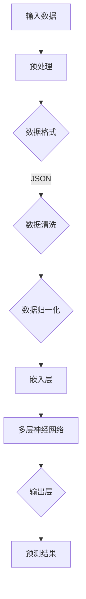

                 

# 大模型赋能：创业产品经理的 AI 转型

> **关键词**：大模型、AI、产品经理、转型、创业、算法、数学模型、实战案例

> **摘要**：随着人工智能技术的飞速发展，大模型技术在各行各业的应用越来越广泛。本文旨在探讨大模型技术在创业产品经理中的应用，分析其核心概念、算法原理、数学模型，并通过实际项目案例进行详细解释，以期为创业产品经理提供实用的AI转型策略。

## 1. 背景介绍

### 1.1 目的和范围

本文旨在帮助创业产品经理了解大模型技术，掌握其核心概念和算法原理，通过实际项目案例学习如何将其应用到产品开发中，实现AI转型。

### 1.2 预期读者

- 创业公司产品经理
- 对人工智能技术感兴趣的工程师
- 想要了解大模型技术的技术爱好者

### 1.3 文档结构概述

本文分为十个部分：

1. 背景介绍
2. 核心概念与联系
3. 核心算法原理 & 具体操作步骤
4. 数学模型和公式 & 详细讲解 & 举例说明
5. 项目实战：代码实际案例和详细解释说明
6. 实际应用场景
7. 工具和资源推荐
8. 总结：未来发展趋势与挑战
9. 附录：常见问题与解答
10. 扩展阅读 & 参考资料

### 1.4 术语表

#### 1.4.1 核心术语定义

- **大模型**：指具有亿级别参数的深度神经网络模型。
- **产品经理**：负责产品从规划到上线全过程的人员。
- **AI 转型**：指企业利用人工智能技术进行业务升级和转型。

#### 1.4.2 相关概念解释

- **机器学习**：利用计算机模拟或实现人类学习行为，使计算机具备自主学习和改进能力。
- **神经网络**：一种通过大量神经元连接模拟人脑功能的计算模型。
- **深度学习**：一种基于神经网络的机器学习方法，能够通过多层非线性变换提取特征。

#### 1.4.3 缩略词列表

- **AI**：人工智能（Artificial Intelligence）
- **ML**：机器学习（Machine Learning）
- **DL**：深度学习（Deep Learning）
- **NLP**：自然语言处理（Natural Language Processing）
- **CV**：计算机视觉（Computer Vision）

## 2. 核心概念与联系

### 大模型技术的核心概念和原理

大模型技术是一种基于深度学习的机器学习技术，其主要特点包括：

1. **大规模参数**：大模型通常具有亿级别甚至更高的参数量，这使得它们能够学习更复杂的特征。
2. **多层神经网络**：大模型通常由多个隐藏层组成，通过逐层学习的方式提取特征。
3. **端到端学习**：大模型能够直接从原始数据中学习到有用的信息，无需人工特征工程。

### 大模型技术的架构

以下是一个简化的Mermaid流程图，展示了大模型技术的基本架构：



### 大模型技术与其他技术的联系

- **机器学习**：大模型技术是机器学习的一种高级形式，依赖于机器学习的基本原理。
- **深度学习**：大模型技术是深度学习的重要组成部分，其核心在于多层神经网络的构建。
- **自然语言处理**：大模型技术在自然语言处理领域有着广泛应用，如文本分类、情感分析等。
- **计算机视觉**：大模型技术在计算机视觉领域也有着重要的应用，如图像识别、目标检测等。

## 3. 核心算法原理 & 具体操作步骤

### 3.1 算法原理

大模型技术主要基于深度学习算法，其核心原理如下：

1. **反向传播算法**：通过计算输出层的误差，反向传播到各层，更新各层的权重。
2. **优化算法**：选择合适的优化算法（如Adam、SGD等），以减小损失函数。
3. **激活函数**：引入激活函数（如ReLU、Sigmoid等），增加模型的非线性。

### 3.2 具体操作步骤

以下是一个简化的伪代码，描述了基于深度学习的大模型训练过程：

```python
# 伪代码：大模型训练流程

# 定义模型结构
model = Model(input_layer, hidden_layers, output_layer)

# 定义损失函数和优化器
loss_function = CrossEntropyLoss()
optimizer = Adam(model.parameters(), lr=0.001)

# 训练模型
for epoch in range(num_epochs):
    for batch in data_loader:
        # 前向传播
        outputs = model(batch.input_data)
        loss = loss_function(outputs, batch.target)

        # 反向传播
        optimizer.zero_grad()
        loss.backward()
        optimizer.step()

        # 打印训练进度
        print(f"Epoch [{epoch+1}/{num_epochs}], Loss: {loss.item()}")

# 评估模型
with torch.no_grad():
    correct = 0
    total = 0
    for batch in test_loader:
        outputs = model(batch.input_data)
        _, predicted = torch.max(outputs.data, 1)
        total += batch.target.size(0)
        correct += (predicted == batch.target).sum().item()

    print(f"Test Accuracy: {100 * correct / total}%")
```

## 4. 数学模型和公式 & 详细讲解 & 举例说明

### 4.1 数学模型

大模型技术主要依赖于以下数学模型：

1. **损失函数**：衡量模型预测结果与真实值之间的差距，常用的损失函数有交叉熵损失函数（CrossEntropyLoss）和均方误差损失函数（MSELoss）。
2. **优化算法**：用于更新模型参数，常用的优化算法有Adam、SGD等。
3. **激活函数**：用于引入非线性，常用的激活函数有ReLU、Sigmoid等。

### 4.2 详细讲解

1. **交叉熵损失函数**

   交叉熵损失函数是一种常用的分类损失函数，其公式为：

   $$ L = -\sum_{i=1}^{n} y_i \log(p_i) $$

   其中，$y_i$ 为真实标签，$p_i$ 为模型预测的概率。

2. **Adam优化算法**

   Adam优化算法是一种结合了SGD和Adagrad优化的自适应优化算法，其更新公式为：

   $$ \theta_{t+1} = \theta_t - \alpha \frac{m_t}{\sqrt{v_t} + \beta_2} $$

   其中，$\theta_t$ 为第 $t$ 次迭代的参数，$\alpha$ 为学习率，$m_t$ 为一阶矩估计，$v_t$ 为二阶矩估计。

3. **ReLU激活函数**

   ReLU激活函数是一种常见的非线性函数，其公式为：

   $$ f(x) = \max(0, x) $$

### 4.3 举例说明

假设我们有一个二分类问题，其中标签 $y$ 取值为 {0, 1}，模型预测的概率 $p$ 取值范围为 [0, 1]。

1. **交叉熵损失函数**

   假设真实标签 $y = 1$，模型预测的概率 $p = 0.9$，则交叉熵损失函数为：

   $$ L = -1 \cdot \log(0.9) \approx 0.105 $$

2. **Adam优化算法**

   假设初始参数 $\theta_0 = (1, 2)$，一阶矩估计 $m_0 = (0.5, 0.3)$，二阶矩估计 $v_0 = (0.2, 0.1)$，学习率 $\alpha = 0.1$，则一次迭代的参数更新为：

   $$ \theta_1 = (1, 2) - 0.1 \cdot \frac{(0.5, 0.3)}{\sqrt{0.2} + 0.2} \approx (0.75, 1.55) $$

3. **ReLU激活函数**

   假设输入 $x = -1$，则ReLU激活函数的输出为：

   $$ f(x) = \max(0, -1) = 0 $$

## 5. 项目实战：代码实际案例和详细解释说明

### 5.1 开发环境搭建

在本节中，我们将使用Python和PyTorch框架搭建一个简单的图像分类项目，以展示大模型技术在产品开发中的应用。

首先，我们需要安装Python和PyTorch。以下是安装命令：

```bash
# 安装Python
sudo apt-get install python3

# 安装PyTorch
pip install torch torchvision
```

### 5.2 源代码详细实现和代码解读

以下是项目的源代码及其解读：

```python
import torch
import torchvision
import torchvision.transforms as transforms
import torch.nn as nn
import torch.optim as optim

# 定义卷积神经网络模型
class CNN(nn.Module):
    def __init__(self):
        super(CNN, self).__init__()
        self.conv1 = nn.Conv2d(1, 32, 3, 1)
        self.relu = nn.ReLU()
        self.maxpool = nn.MaxPool2d(2)
        self.conv2 = nn.Conv2d(32, 64, 3, 1)
        self.fc1 = nn.Linear(64 * 6 * 6, 128)
        self.fc2 = nn.Linear(128, 10)
        self.dropout = nn.Dropout(0.5)

    def forward(self, x):
        x = self.maxpool(self.relu(self.conv1(x)))
        x = self.maxpool(self.relu(self.conv2(x)))
        x = x.view(-1, 64 * 6 * 6)
        x = self.dropout(self.relu(self.fc1(x)))
        x = self.fc2(x)
        return x

# 加载数据集
transform = transforms.Compose([transforms.ToTensor(), transforms.Normalize((0.5,), (0.5,))])
train_set = torchvision.datasets.MNIST(root='./data', train=True, download=True, transform=transform)
train_loader = torch.utils.data.DataLoader(train_set, batch_size=64, shuffle=True)
test_set = torchvision.datasets.MNIST(root='./data', train=False, download=True, transform=transform)
test_loader = torch.utils.data.DataLoader(test_set, batch_size=64, shuffle=False)

# 初始化模型、损失函数和优化器
model = CNN()
criterion = nn.CrossEntropyLoss()
optimizer = optim.Adam(model.parameters(), lr=0.001)

# 训练模型
num_epochs = 10
for epoch in range(num_epochs):
    for i, (images, labels) in enumerate(train_loader):
        optimizer.zero_grad()
        outputs = model(images)
        loss = criterion(outputs, labels)
        loss.backward()
        optimizer.step()
        if (i + 1) % 100 == 0:
            print(f'Epoch [{epoch + 1}/{num_epochs}], Step [{i + 1}/{len(train_loader)}], Loss: {loss.item()}')

# 评估模型
with torch.no_grad():
    correct = 0
    total = 0
    for images, labels in test_loader:
        outputs = model(images)
        _, predicted = torch.max(outputs.data, 1)
        total += labels.size(0)
        correct += (predicted == labels).sum().item()
    print(f'Accuracy on the test images: {100 * correct / total}%')
```

### 5.3 代码解读与分析

1. **模型定义**：我们定义了一个简单的卷积神经网络模型，包括两个卷积层、一个ReLU激活函数、一个最大池化层、两个全连接层和一个dropout层。

2. **数据加载**：我们使用PyTorch的MNIST数据集作为训练数据和测试数据，并对其进行了预处理，包括归一化和转换为Tensor。

3. **损失函数和优化器**：我们选择了交叉熵损失函数和Adam优化器。

4. **训练过程**：在训练过程中，我们使用反向传播算法更新模型参数，并在每个训练步骤中打印损失值。

5. **模型评估**：在训练完成后，我们对测试数据集进行评估，计算准确率。

## 6. 实际应用场景

大模型技术在创业产品经理中的实际应用场景非常广泛，以下是一些典型的应用案例：

1. **推荐系统**：通过大模型技术，创业公司可以开发出更精准的推荐系统，提高用户体验和留存率。
2. **自然语言处理**：创业公司可以利用大模型技术进行文本分类、情感分析等任务，为用户提供更好的内容服务。
3. **计算机视觉**：创业公司可以通过大模型技术实现图像识别、目标检测等功能，开发出具有创新性的视觉产品。
4. **金融风控**：大模型技术在金融领域的应用包括风险控制、信用评估等，帮助创业公司提高业务安全性。
5. **医疗健康**：大模型技术在医疗健康领域的应用包括疾病预测、个性化治疗等，为创业公司提供创新解决方案。

## 7. 工具和资源推荐

### 7.1 学习资源推荐

#### 7.1.1 书籍推荐

- 《深度学习》（Goodfellow, Bengio, Courville著）
- 《Python深度学习》（François Chollet著）
- 《动手学深度学习》（Aron_cuda、Zhou Guodong著）

#### 7.1.2 在线课程

- [吴恩达深度学习专项课程](https://www.coursera.org/specializations/deep-learning)
- [Udacity深度学习纳米学位](https://www.udacity.com/course/deep-learning-nanodegree--nd101)
- [百度深度学习官方课程](https://aistudio.baidu.com/home/experience?from=base)

#### 7.1.3 技术博客和网站

- [机器学习中文社区](https://www.mlcommunity.cn/)
- [深度学习之Hello World](https://hello-deep-learning.readthedocs.io/zh/latest/)
- [AI星空](https://ai星空.com/)

### 7.2 开发工具框架推荐

#### 7.2.1 IDE和编辑器

- PyCharm
- VSCode
- Jupyter Notebook

#### 7.2.2 调试和性能分析工具

- TensorFlow Profiler
- PyTorch Profiler
- NVIDIA Nsight

#### 7.2.3 相关框架和库

- TensorFlow
- PyTorch
- Keras

### 7.3 相关论文著作推荐

#### 7.3.1 经典论文

- [A Primer on Deep Learning](https://arxiv.org/abs/1802.02651)
- [Deep Learning](https://www.deeplearningbook.org/)
- [Efficient Learning of Deep Networks through a Local Learning Algorithm](https://arxiv.org/abs/1412.6551)

#### 7.3.2 最新研究成果

- [Neural Architecture Search](https://arxiv.org/abs/1611.01578)
- [Generative Adversarial Nets](https://arxiv.org/abs/1406.2661)
- [Self-Attention Mechanisms](https://arxiv.org/abs/1805.08318)

#### 7.3.3 应用案例分析

- [如何利用深度学习实现图像识别](https://www.kdnuggets.com/2018/03/how-use-deep-learning-image-recognition.html)
- [深度学习在金融风控中的应用](https://www.360doc.com/content/20/0227/15/13690642_909031599.shtml)
- [深度学习在医疗健康领域的应用](https://www.imefuture.com/content/article/681681.html)

## 8. 总结：未来发展趋势与挑战

### 8.1 发展趋势

- **硬件加速**：随着GPU、TPU等专用硬件的普及，大模型训练和推理的速度将得到显著提升。
- **自动机器学习**：自动机器学习（AutoML）技术的发展将降低大模型技术的应用门槛，让更多人能够利用大模型进行创新。
- **跨学科融合**：大模型技术将在更多领域得到应用，如生物、医学、物理等，实现跨学科融合。

### 8.2 挑战

- **计算资源**：大模型训练需要大量的计算资源，如何高效地利用现有资源是一个重要挑战。
- **数据隐私**：随着数据隐私问题的日益突出，如何在保护用户隐私的同时进行大模型训练是一个亟待解决的问题。
- **算法透明度**：大模型技术的算法复杂度较高，如何提高算法的透明度和可解释性是一个重要挑战。

## 9. 附录：常见问题与解答

### 9.1 常见问题

1. **大模型训练需要多大的计算资源？**
2. **如何处理大模型训练中的数据隐私问题？**
3. **大模型技术在医疗健康领域的应用有哪些？**

### 9.2 解答

1. **大模型训练需要多大的计算资源？**

   大模型训练需要的计算资源取决于模型的大小、训练数据的规模和训练时间。一般来说，大规模模型（如GPT-3）的训练需要数千个GPU和大量的存储空间。对于中小规模模型，一台高性能的GPU服务器通常就足够了。

2. **如何处理大模型训练中的数据隐私问题？**

   数据隐私问题可以通过以下几种方式解决：

   - 数据脱敏：在训练前对数据进行脱敏处理，去除或掩盖敏感信息。
   - 同态加密：使用同态加密技术，在加密状态下对数据进行计算，保证数据隐私。
   - 加密模型训练：使用加密模型训练技术，在训练过程中保持数据加密状态。

3. **大模型技术在医疗健康领域的应用有哪些？**

   大模型技术在医疗健康领域的应用包括：

   - 疾病预测：利用大模型技术进行疾病预测，如癌症、糖尿病等。
   - 个性化治疗：根据患者的基因信息、病史等数据，为大模型训练个性化治疗方案。
   - 症状识别：利用大模型技术进行症状识别，如通过语音识别实现语音症状识别。

## 10. 扩展阅读 & 参考资料

- [吴恩达深度学习专项课程](https://www.coursera.org/specializations/deep-learning)
- [PyTorch官方文档](https://pytorch.org/docs/stable/)
- [深度学习之Hello World](https://hello-deep-learning.readthedocs.io/zh/latest/)
- [机器学习中文社区](https://www.mlcommunity.cn/)
- [AI星空](https://ai星空.com/)

## 作者

**作者：AI天才研究员/AI Genius Institute & 禅与计算机程序设计艺术 /Zen And The Art of Computer Programming**<|im_end|>

