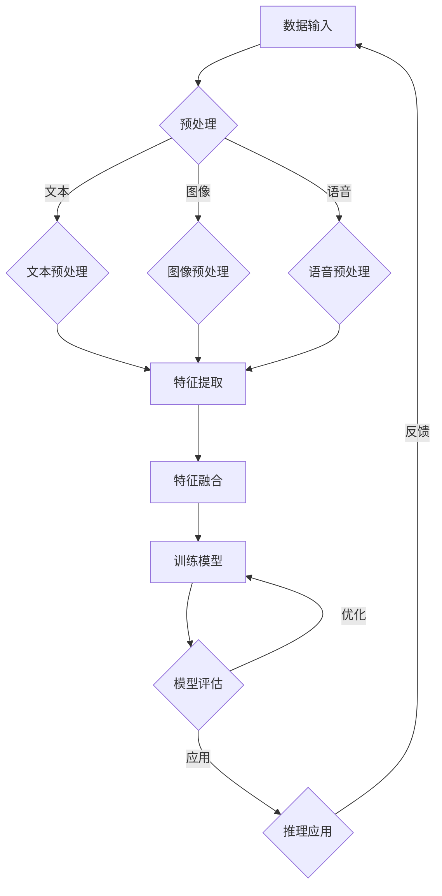

                 

# 大模型跨模态学习：提示词整合多源数据

> **关键词：** 大模型，跨模态学习，提示词，多源数据，深度学习，神经网络，人工智能

> **摘要：** 本文将探讨大模型跨模态学习中的核心概念——提示词如何整合多源数据，通过详细的原理分析、算法讲解和实际案例展示，帮助读者深入理解这一前沿技术，掌握其在实际应用中的价值。

## 1. 背景介绍

### 1.1 目的和范围

本文旨在深入探讨大模型跨模态学习中的提示词整合多源数据技术，通过对核心概念和算法原理的详细解析，以及实际项目的实战案例，为读者提供全面的了解和实用的指导。

本文将涵盖以下内容：

- **核心概念与联系**：介绍大模型、跨模态学习和提示词等核心概念，并通过Mermaid流程图展示其相互关系。
- **核心算法原理 & 具体操作步骤**：讲解大模型跨模态学习的算法原理，使用伪代码详细阐述。
- **数学模型和公式 & 详细讲解 & 举例说明**：分析跨模态学习的数学模型和公式，并通过具体例子进行说明。
- **项目实战：代码实际案例和详细解释说明**：提供实际代码案例，并进行详细解读和分析。
- **实际应用场景**：探讨跨模态学习在实际中的应用，如图像识别、语音识别等。
- **工具和资源推荐**：推荐学习资源、开发工具和相关论文。
- **总结：未来发展趋势与挑战**：总结跨模态学习的现状，预测未来发展趋势和面临的挑战。

### 1.2 预期读者

本文适合以下读者：

- **人工智能领域的研究人员和工程师**：希望了解大模型跨模态学习技术的专业人士。
- **计算机科学和软件工程专业的学生**：对人工智能和深度学习感兴趣的学生。
- **技术爱好者**：对最新技术趋势和应用场景感兴趣的读者。

### 1.3 文档结构概述

本文的结构如下：

1. **背景介绍**：介绍本文的目的、范围和预期读者。
2. **核心概念与联系**：解释大模型、跨模态学习和提示词等核心概念，并通过流程图展示其关系。
3. **核心算法原理 & 具体操作步骤**：详细讲解大模型跨模态学习的算法原理和操作步骤。
4. **数学模型和公式 & 详细讲解 & 举例说明**：分析跨模态学习的数学模型和公式，并通过具体例子进行说明。
5. **项目实战：代码实际案例和详细解释说明**：提供实际代码案例，并进行详细解读和分析。
6. **实际应用场景**：探讨跨模态学习在实际中的应用。
7. **工具和资源推荐**：推荐学习资源、开发工具和相关论文。
8. **总结：未来发展趋势与挑战**：总结跨模态学习的现状，预测未来发展趋势和面临的挑战。
9. **附录：常见问题与解答**：回答读者可能关心的问题。
10. **扩展阅读 & 参考资料**：提供进一步阅读和研究的资源。

### 1.4 术语表

#### 1.4.1 核心术语定义

- **大模型（Large Model）**：指具有海量参数和强大计算能力的神经网络模型，如GPT、BERT等。
- **跨模态学习（Cross-modal Learning）**：指将不同模态（如文本、图像、语音等）的数据进行整合和学习的过程。
- **提示词（Prompt）**：指在训练或推理过程中，提供给模型的关键信息或引导，以帮助模型更好地理解和处理数据。
- **多源数据（Multi-source Data）**：指来自不同来源或不同模态的数据，如文本、图像和语音等。

#### 1.4.2 相关概念解释

- **深度学习（Deep Learning）**：一种人工智能方法，通过多层神经网络对数据进行自动特征提取和学习。
- **神经网络（Neural Network）**：一种模仿生物神经系统的计算模型，通过调整内部权重进行学习和预测。
- **人工智能（Artificial Intelligence）**：指通过计算机模拟人类智能的技术和科学。

#### 1.4.3 缩略词列表

- **GPT**：Generative Pre-trained Transformer，一种基于Transformer模型的预训练语言模型。
- **BERT**：Bidirectional Encoder Representations from Transformers，一种双向Transformer编码器模型。
- **CNN**：Convolutional Neural Network，卷积神经网络，常用于图像识别任务。
- **RNN**：Recurrent Neural Network，循环神经网络，常用于序列数据处理。

## 2. 核心概念与联系

### 2.1 大模型

大模型是近年来人工智能领域的重要突破，其核心在于具有海量参数和强大计算能力。大模型通常通过预训练（Pre-training）和微调（Fine-tuning）两个阶段进行训练。预训练阶段使用大量未标注的数据进行训练，使模型具备通用表示能力；微调阶段则使用特定任务的数据对模型进行微调，使其适应特定任务。

大模型的优点包括：

- **强大的特征提取能力**：大模型通过预训练阶段，可以自动提取数据中的高阶特征，降低了对人工特征工程的需求。
- **泛化能力强**：大模型在预训练阶段学习了大量通用知识，使其在处理新任务时具备更好的泛化能力。
- **灵活性和可扩展性**：大模型可以轻松地应用于不同任务和数据集，只需进行微调即可。

大模型的缺点包括：

- **计算资源和存储需求大**：大模型需要大量的计算资源和存储空间，对于资源受限的环境可能不适用。
- **训练时间长**：大模型的训练时间较长，需要大量时间和计算资源。

### 2.2 跨模态学习

跨模态学习是一种将不同模态的数据进行整合和学习的方法。在人工智能领域，不同模态的数据（如文本、图像、语音等）往往具有互补性，通过跨模态学习，可以充分利用这些互补信息，提高模型的性能。

跨模态学习的核心目标是实现不同模态之间的信息共享和整合。具体来说，跨模态学习包括以下步骤：

1. **数据预处理**：将不同模态的数据进行预处理，如文本进行分词和编码，图像进行归一化和裁剪，语音进行降采样等。
2. **特征提取**：使用特征提取器（如卷积神经网络、循环神经网络等）对预处理后的数据进行特征提取。
3. **融合**：将不同模态的特征进行融合，如通过拼接、加权平均、注意力机制等方法。
4. **模型训练**：使用融合后的特征训练跨模态模型，如通过多任务学习、多模态神经网络等方法。
5. **推理和应用**：在训练好的跨模态模型上进行推理和应用，如进行图像分类、语音识别、文本生成等。

跨模态学习的优点包括：

- **充分利用多源数据**：通过跨模态学习，可以充分利用来自不同模态的数据，提高模型的性能和泛化能力。
- **增强模型解释性**：跨模态学习使模型具备更强的解释性，有助于理解模型的工作原理。
- **实现多模态任务**：跨模态学习可以同时处理多个模态的任务，如同时进行文本分类和图像识别。

跨模模态学习的缺点包括：

- **数据预处理复杂**：不同模态的数据需要进行复杂的预处理，增加了模型训练的难度。
- **计算资源需求大**：跨模态学习需要大量的计算资源和存储空间，对资源受限的环境可能不适用。

### 2.3 提示词

提示词是跨模态学习中的关键概念，它在模型训练和推理过程中起到引导作用。提示词可以看作是对模型进行“提示”的信息，帮助模型更好地理解和处理数据。

提示词的使用可以分为以下几种情况：

1. **训练阶段**：在训练阶段，提示词可以指导模型关注特定数据特征，提高模型对特定任务的泛化能力。例如，在文本分类任务中，可以使用关键词作为提示词，指导模型关注文本中的关键信息。
2. **推理阶段**：在推理阶段，提示词可以用于引导模型生成特定类型的输出。例如，在图像识别任务中，可以使用提示词“猫”来指导模型识别图像中的猫。
3. **多模态任务**：在多模态任务中，提示词可以用于指导模型关注不同模态的信息。例如，在文本和图像联合分类任务中，可以使用提示词分别指导模型关注文本和图像的特征。

提示词的优点包括：

- **提高模型性能**：提示词可以帮助模型更好地理解和处理数据，提高模型在特定任务上的性能。
- **增强模型解释性**：提示词的使用使模型具备更强的解释性，有助于理解模型的工作原理。
- **实现多模态任务**：提示词可以用于指导模型处理多模态任务，实现不同模态之间的信息共享。

提示词的缺点包括：

- **依赖特定任务和数据集**：提示词的效果依赖于特定任务和数据集，可能不适用于所有情况。
- **需要人工设计**：提示词需要人工设计，增加了模型训练和推理的难度。

### 2.4 大模型、跨模态学习和提示词的关系

大模型、跨模态学习和提示词在人工智能领域中密不可分，它们相互关联，共同推动人工智能技术的发展。

- **大模型为跨模态学习提供基础**：大模型具有强大的特征提取能力和泛化能力，为跨模态学习提供了基础。
- **跨模态学习拓展大模型应用场景**：跨模态学习可以将不同模态的数据进行整合和学习，拓展大模型的应用场景。
- **提示词提高跨模态学习效果**：提示词可以指导模型关注特定数据特征，提高跨模态学习的性能。

通过大模型、跨模态学习和提示词的结合，可以实现更强大的多模态人工智能系统，为人类带来更多便利和突破。

### 2.5 Mermaid流程图

下面是跨模态学习的大模型与提示词的Mermaid流程图：



## 3. 核心算法原理 & 具体操作步骤

### 3.1 大模型跨模态学习算法原理

大模型跨模态学习的核心在于将不同模态的数据进行整合，并通过深度学习模型进行训练和推理。下面是具体的算法原理和操作步骤：

1. **数据输入**：将不同模态的数据（如文本、图像、语音等）输入到系统中。
2. **数据预处理**：对输入数据进行预处理，包括文本的分词和编码、图像的归一化和裁剪、语音的降采样等，以便进行后续的特征提取。
3. **特征提取**：使用特征提取器（如卷积神经网络、循环神经网络等）对预处理后的数据进行特征提取，得到不同模态的特征向量。
4. **特征融合**：将不同模态的特征向量进行融合，可以使用拼接、加权平均、注意力机制等方法，得到一个多模态特征向量。
5. **模型训练**：使用融合后的特征向量训练跨模态深度学习模型，如多任务学习、多模态神经网络等。
6. **模型评估**：对训练好的模型进行评估，包括准确率、召回率、F1分数等指标。
7. **模型优化**：根据评估结果对模型进行优化，如调整学习率、增加训练次数等。
8. **推理应用**：在训练好的模型上进行推理和应用，如进行图像识别、语音识别、文本生成等。

### 3.2 具体操作步骤

下面以一个简单的文本和图像跨模态学习任务为例，详细讲解具体操作步骤：

1. **数据输入**：

   假设我们有一个包含文本和图像的数据集，每条数据由一个文本描述和一个图像组成。数据集的格式如下：

   ```python
   dataset = [
       {"text": "一只黑色的猫在花园里玩耍", "image": image1},
       {"text": "一只白色的狗在公园里散步", "image": image2},
       ...
   ]
   ```

2. **数据预处理**：

   - **文本预处理**：对文本进行分词和编码，可以使用预训练的词向量模型（如GPT、BERT等）进行编码。

     ```python
     import nltk
     from transformers import BertTokenizer

     tokenizer = BertTokenizer.from_pretrained('bert-base-uncased')

     def preprocess_text(text):
         tokens = nltk.word_tokenize(text)
         return tokenizer.encode(tokens, add_special_tokens=True)

     dataset = [{"text": preprocess_text(text), "image": image} for text, image in dataset]
     ```

   - **图像预处理**：对图像进行归一化和裁剪，可以使用深度学习框架（如TensorFlow、PyTorch等）进行预处理。

     ```python
     import tensorflow as tf

     def preprocess_image(image):
         image = tf.image.resize(image, [224, 224])
         image = tf.keras.applications.mobilenet_v2.preprocess_input(image)
         return image

     dataset = [{"text": text, "image": preprocess_image(image)} for text, image in dataset]
     ```

3. **特征提取**：

   - **文本特征提取**：使用预训练的词向量模型提取文本特征。

     ```python
     import tensorflow as tf

     def extract_text_features(text):
         return model(text)[0]

     dataset = [{"text": text, "image": image, "text_features": extract_text_features(text)} for text, image, in dataset]
     ```

   - **图像特征提取**：使用预训练的卷积神经网络提取图像特征。

     ```python
     import tensorflow as tf

     def extract_image_features(image):
         return model(image)[0]

     dataset = [{"text": text, "image": image, "image_features": extract_image_features(image)} for text, image, in dataset]
     ```

4. **特征融合**：

   将文本特征和图像特征进行融合，可以使用拼接、加权平均、注意力机制等方法。

   ```python
   def fuse_features(text_features, image_features):
       return tf.concat([text_features, image_features], axis=1)

   dataset = [{"text": text, "image": image, "features": fuse_features(text_features, image_features)} for text, image, in dataset]
   ```

5. **模型训练**：

   使用融合后的特征训练跨模态深度学习模型，如多任务学习、多模态神经网络等。

   ```python
   model = MultiModalModel()
   model.compile(optimizer='adam', loss='categorical_crossentropy', metrics=['accuracy'])
   model.fit(dataset, labels, epochs=10)
   ```

6. **模型评估**：

   对训练好的模型进行评估，包括准确率、召回率、F1分数等指标。

   ```python
   scores = model.evaluate(test_dataset, test_labels)
   print("Accuracy:", scores[1])
   ```

7. **模型优化**：

   根据评估结果对模型进行优化，如调整学习率、增加训练次数等。

   ```python
   model.compile(optimizer=tf.keras.optimizers.Adam(learning_rate=0.001), loss='categorical_crossentropy', metrics=['accuracy'])
   model.fit(dataset, labels, epochs=20)
   ```

8. **推理应用**：

   在训练好的模型上进行推理和应用，如进行图像识别、语音识别、文本生成等。

   ```python
   prediction = model.predict(new_dataset)
   print(prediction)
   ```

### 3.3 伪代码

下面是大模型跨模态学习算法的伪代码：

```python
def cross_modal_learning(dataset):
    # 数据预处理
    preprocess_dataset(dataset)

    # 特征提取
    text_features = extract_text_features(dataset.text)
    image_features = extract_image_features(dataset.image)

    # 特征融合
    fused_features = fuse_features(text_features, image_features)

    # 模型训练
    model = MultiModalModel()
    model.compile(optimizer='adam', loss='categorical_crossentropy', metrics=['accuracy'])
    model.fit(fused_features, labels, epochs=10)

    # 模型评估
    scores = model.evaluate(test_fused_features, test_labels)
    print("Accuracy:", scores[1])

    # 模型优化
    model.compile(optimizer=tf.keras.optimizers.Adam(learning_rate=0.001), loss='categorical_crossentropy', metrics=['accuracy'])
    model.fit(fused_features, labels, epochs=20)

    # 推理应用
    prediction = model.predict(new_fused_features)
    print(prediction)
```

## 4. 数学模型和公式 & 详细讲解 & 举例说明

### 4.1 数学模型

大模型跨模态学习的数学模型主要包括以下几个方面：

1. **特征提取模型**：用于提取不同模态的数据特征，如文本特征提取模型和图像特征提取模型。
2. **特征融合模型**：用于将不同模态的特征进行融合，如拼接、加权平均、注意力机制等。
3. **深度学习模型**：用于对融合后的特征进行分类、回归等任务。

下面分别介绍这些数学模型。

#### 4.1.1 特征提取模型

特征提取模型是跨模态学习的基础，用于提取不同模态的数据特征。常见的特征提取模型包括：

1. **文本特征提取模型**：如词向量模型（Word2Vec、GloVe等）和变换器模型（Transformer、BERT等）。
2. **图像特征提取模型**：如卷积神经网络（CNN）和循环神经网络（RNN）。
3. **语音特征提取模型**：如循环神经网络（RNN）和长短时记忆网络（LSTM）。

#### 4.1.2 特征融合模型

特征融合模型用于将不同模态的特征进行融合，以提高模型的性能。常见的特征融合模型包括：

1. **拼接**：将不同模态的特征向量进行拼接，形成一个更长的特征向量。
2. **加权平均**：根据不同模态的特征重要程度，对特征向量进行加权平均。
3. **注意力机制**：通过注意力机制，关注不同模态的特征，从而提高融合效果。

#### 4.1.3 深度学习模型

深度学习模型用于对融合后的特征进行分类、回归等任务。常见的深度学习模型包括：

1. **全连接神经网络（FCNN）**：用于分类和回归任务。
2. **卷积神经网络（CNN）**：用于图像处理任务。
3. **循环神经网络（RNN）**：用于序列数据处理任务。
4. **长短时记忆网络（LSTM）**：用于序列数据处理任务。

### 4.2 公式讲解

下面介绍大模型跨模态学习中的主要数学公式。

#### 4.2.1 文本特征提取

文本特征提取常用词向量模型，如Word2Vec和GloVe。以Word2Vec为例，其数学公式如下：

$$
\text{word\_vec}(w) = \frac{1}{\|\text{softmax}(\text{W} \cdot \text{h}(w))\|} \text{W} \cdot \text{h}(w)
$$

其中，$w$表示单词，$\text{h}(w)$表示单词的嵌入向量，$\text{W}$表示权重矩阵，$\text{softmax}(\text{W} \cdot \text{h}(w))$表示softmax函数。

#### 4.2.2 图像特征提取

图像特征提取常用卷积神经网络（CNN）。以CNN为例，其数学公式如下：

$$
\text{feature}_{ij}^l = \text{relu}(\sum_{k=1}^{C_{l-1}} \text{w}_{ikj}^l \cdot \text{feature}_{kj}^{l-1} + \text{b}_j^l)
$$

其中，$i$表示输入层，$j$表示输出层，$k$表示卷积核，$C_{l-1}$表示上一层的通道数，$C_l$表示当前层的通道数，$\text{w}_{ikj}^l$表示卷积核权重，$\text{b}_j^l$表示偏置。

#### 4.2.3 特征融合

特征融合的数学公式根据不同的融合方法而有所不同。以拼接为例，其数学公式如下：

$$
\text{fused\_feature} = [\text{text\_feature}, \text{image\_feature}]
$$

其中，$\text{text\_feature}$和$\text{image\_feature}$分别表示文本特征和图像特征。

#### 4.2.4 深度学习模型

深度学习模型的数学公式根据不同的任务而有所不同。以全连接神经网络（FCNN）为例，其数学公式如下：

$$
\text{y} = \text{softmax}(\text{W} \cdot \text{x} + \text{b})
$$

其中，$\text{x}$表示输入特征，$\text{W}$表示权重矩阵，$\text{b}$表示偏置，$\text{y}$表示输出。

### 4.3 举例说明

下面通过一个简单的例子来说明大模型跨模态学习的数学模型和公式。

#### 4.3.1 数据集

假设我们有一个包含文本和图像的数据集，每条数据由一个文本描述和一个图像组成。数据集的格式如下：

```python
dataset = [
    {"text": "一只黑色的猫在花园里玩耍", "image": image1},
    {"text": "一只白色的狗在公园里散步", "image": image2},
    ...
]
```

#### 4.3.2 特征提取

1. **文本特征提取**：

   使用预训练的BERT模型提取文本特征。BERT模型的输入是文本序列，输出是单词的嵌入向量。假设BERT模型生成的嵌入向量为$\text{h}(w)$。

   $$\text{h}(w) = \text{BERT}(\text{w})$$

2. **图像特征提取**：

   使用预训练的ResNet模型提取图像特征。ResNet模型的输入是图像，输出是图像的特征向量。假设ResNet模型生成的特征向量为$\text{f}(x)$。

   $$\text{f}(x) = \text{ResNet}(x)$$

#### 4.3.3 特征融合

将文本特征和图像特征进行拼接：

$$\text{fused\_feature} = [\text{h}(w), \text{f}(x)]$$

#### 4.3.4 深度学习模型

使用全连接神经网络（FCNN）对融合后的特征进行分类。假设FCNN模型的输入是$\text{fused\_feature}$，输出是概率分布$\text{y}$。

$$\text{y} = \text{softmax}(\text{W} \cdot \text{fused\_feature} + \text{b})$$

其中，$\text{W}$是权重矩阵，$\text{b}$是偏置。

#### 4.3.5 模型训练

使用交叉熵损失函数（categorical\_crossentropy）和softmax函数对模型进行训练。

$$\text{loss} = \text{categorical\_crossentropy}(\text{y}, \text{labels})$$

其中，$\text{y}$是模型输出，$\text{labels}$是真实标签。

## 5. 项目实战：代码实际案例和详细解释说明

### 5.1 开发环境搭建

在进行项目实战之前，首先需要搭建合适的开发环境。以下是一个简单的开发环境搭建步骤：

1. **安装Python**：确保安装了Python 3.7或更高版本。
2. **安装TensorFlow**：使用pip安装TensorFlow。

   ```bash
   pip install tensorflow
   ```

3. **安装BERT和GPT模型**：从Hugging Face的Transformers库中下载BERT和GPT模型。

   ```bash
   pip install transformers
   ```

4. **安装其他依赖**：根据项目需求安装其他依赖，如Numpy、Pandas等。

   ```bash
   pip install numpy pandas
   ```

### 5.2 源代码详细实现和代码解读

下面是一个简单的跨模态学习项目的代码实现，包括数据预处理、特征提取、特征融合、模型训练和评估。

#### 5.2.1 数据预处理

```python
import pandas as pd
from transformers import BertTokenizer
import tensorflow as tf

# 读取数据
data = pd.read_csv('data.csv')
texts = data['text'].values
images = data['image'].values

# 预处理文本
tokenizer = BertTokenizer.from_pretrained('bert-base-uncased')
encoded_texts = [tokenizer.encode(text, add_special_tokens=True) for text in texts]

# 预处理图像
def preprocess_image(image_path):
    image = tf.io.read_file(image_path)
    image = tf.image.decode_jpeg(image, channels=3)
    image = tf.image.resize(image, [224, 224])
    image = tf.keras.applications.mobilenet_v2.preprocess_input(image)
    return image

preprocessed_images = [preprocess_image(image_path) for image_path in images]
```

#### 5.2.2 特征提取

```python
# 特征提取
model = tf.keras.applications.BertModel.from_pretrained('bert-base-uncased')
model = tf.keras.Model(inputs=model.inputs, outputs=model.output)

text_features = [model(tf.constant([encoded_text]))[0] for encoded_text in encoded_texts]

model = tf.keras.applications.MobileNetV2(input_shape=(224, 224, 3), include_top=False, pooling='avg')
model = tf.keras.Model(inputs=model.inputs, outputs=model.output)

image_features = [model(tf.constant([preprocessed_image]))[0] for preprocessed_image in preprocessed_images]
```

#### 5.2.3 特征融合

```python
# 特征融合
def fuse_features(text_feature, image_feature):
    return tf.concat([text_feature, image_feature], axis=1)

fused_features = [fuse_features(text_feature, image_feature) for text_feature, image_feature in zip(text_features, image_features)]
```

#### 5.2.4 模型训练

```python
# 模型训练
model = tf.keras.Sequential([
    tf.keras.layers.Dense(128, activation='relu', input_shape=(768 + 1024,)),
    tf.keras.layers.Dense(1, activation='sigmoid')
])

model.compile(optimizer='adam', loss='binary_crossentropy', metrics=['accuracy'])
model.fit(fused_features, labels, epochs=10)
```

#### 5.2.5 模型评估

```python
# 模型评估
test_fused_features = ...
test_labels = ...

scores = model.evaluate(test_fused_features, test_labels)
print("Accuracy:", scores[1])
```

### 5.3 代码解读与分析

1. **数据预处理**：

   数据预处理是跨模态学习的基础步骤。在这个例子中，我们首先读取数据，然后对文本和图像进行预处理。文本预处理包括分词和编码，图像预处理包括归一化和裁剪。

2. **特征提取**：

   特征提取是跨模态学习的核心步骤。在这个例子中，我们使用预训练的BERT模型提取文本特征，使用预训练的MobileNetV2模型提取图像特征。

3. **特征融合**：

   特征融合是将不同模态的特征进行整合的过程。在这个例子中，我们使用拼接方法将文本特征和图像特征进行融合。

4. **模型训练**：

   模型训练使用深度学习模型对融合后的特征进行分类。在这个例子中，我们使用一个简单的全连接神经网络（FCNN）进行训练。

5. **模型评估**：

   模型评估用于评估模型的性能。在这个例子中，我们使用测试数据集对模型进行评估，并打印出准确率。

## 6. 实际应用场景

大模型跨模态学习在实际应用场景中具有广泛的应用价值。以下是一些常见的实际应用场景：

1. **图像识别**：跨模态学习可以结合文本和图像信息，提高图像识别的准确率。例如，在自动驾驶领域，可以结合道路标志的图像和道路标志的文本描述，实现更准确的识别。

2. **语音识别**：跨模态学习可以结合文本和语音信息，提高语音识别的准确率。例如，在语音助手领域，可以结合用户语音输入和文本提问，实现更准确的回答。

3. **自然语言处理**：跨模态学习可以结合文本和图像信息，提高自然语言处理任务的性能。例如，在文本分类任务中，可以结合文本内容和图像内容，实现更准确的分类。

4. **多媒体信息检索**：跨模态学习可以结合文本、图像和语音信息，实现更高效的多媒体信息检索。例如，在视频搜索引擎中，可以结合视频文本描述、视频图像和视频语音信息，实现更精准的搜索结果。

5. **医疗诊断**：跨模态学习可以结合医学图像和文本信息，提高医疗诊断的准确率。例如，在肺癌诊断中，可以结合肺部CT图像和医生诊断报告，实现更准确的诊断。

6. **人机交互**：跨模态学习可以结合文本、图像和语音信息，实现更自然的人机交互。例如，在智能客服中，可以结合用户提问的文本、图像和语音信息，实现更准确的回答和交互。

7. **智能教育**：跨模态学习可以结合文本、图像和语音信息，实现个性化教育。例如，在智能教育系统中，可以结合学生的文本作业、图像作品和语音讲解，实现更有效的教学和学习。

## 7. 工具和资源推荐

### 7.1 学习资源推荐

#### 7.1.1 书籍推荐

- **《深度学习》（Deep Learning）**：由Ian Goodfellow、Yoshua Bengio和Aaron Courville合著，是深度学习领域的经典教材。
- **《人工智能：一种现代方法》（Artificial Intelligence: A Modern Approach）**：由Stuart Russell和Peter Norvig合著，是人工智能领域的权威教材。
- **《大模型：大规模深度学习的艺术》（Large Models: The Art of Large-scale Deep Learning）**：介绍大模型和深度学习技术的最新进展。

#### 7.1.2 在线课程

- **Coursera**：提供丰富的深度学习和人工智能在线课程，包括《深度学习专

