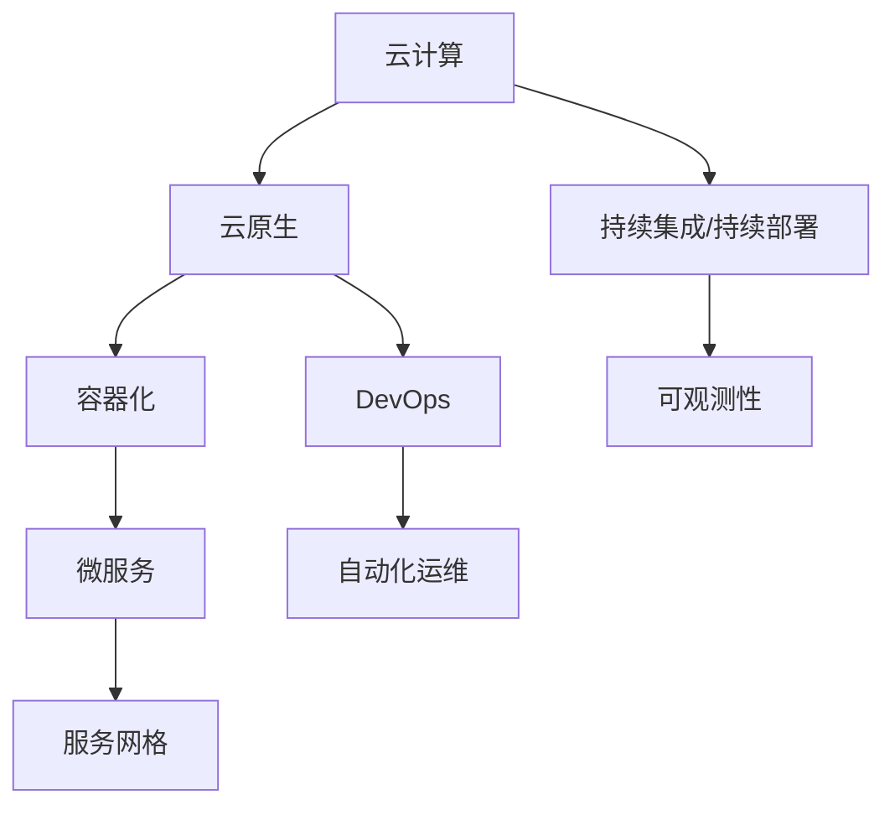

                 

# 大模型软件的云原生架构设计

> 关键词：大模型软件、云原生架构、微服务、容器化、服务网格、DevOps、可观测性

> 摘要：本文旨在探讨大模型软件的云原生架构设计。随着云计算技术的快速发展，云原生架构成为了现代软件系统设计的重要方向。本文将深入分析大模型软件在云原生架构中的设计原则、核心组件和技术要点，并通过实际案例展示云原生架构在大模型软件开发中的应用。

## 1. 背景介绍

### 1.1 目的和范围

本文的目标是介绍大模型软件在云原生架构下的设计原则和实践。云原生架构以其灵活性、可扩展性和自动化管理能力，为大模型软件的部署和运维提供了有力支持。本文将围绕以下几个核心问题展开讨论：

- 云原生架构对大模型软件设计的意义是什么？
- 如何设计一个高效、可靠、可扩展的大模型软件云原生架构？
- 实际应用场景中，大模型软件云原生架构是如何实现的？

### 1.2 预期读者

本文主要面向以下读者群体：

- 对大模型软件和云计算技术有基本了解的开发者。
- 意欲学习云原生架构设计和实践的工程师。
- 对新兴技术充满好奇心，希望掌握前沿技术的技术人员。

### 1.3 文档结构概述

本文将分为以下八个部分：

1. 背景介绍
2. 核心概念与联系
3. 核心算法原理 & 具体操作步骤
4. 数学模型和公式 & 详细讲解 & 举例说明
5. 项目实战：代码实际案例和详细解释说明
6. 实际应用场景
7. 工具和资源推荐
8. 总结：未来发展趋势与挑战

### 1.4 术语表

#### 1.4.1 核心术语定义

- 云原生（Cloud Native）：云原生是指利用云计算的灵活性和扩展性，实现软件系统开发、部署、运维的自动化、高效化和持续集成、持续部署。
- 大模型软件（Big Model Software）：指使用大规模深度学习模型进行训练和推理的软件，如自然语言处理、计算机视觉等领域的应用。
- 容器化（Containerization）：通过容器技术将应用及其依赖环境打包在一起，实现应用的隔离、轻量化和可移植性。
- 微服务（Microservices）：一种将复杂应用拆分为多个小型、独立服务的架构模式，每个服务负责特定功能，可以通过网络进行通信。
- 服务网格（Service Mesh）：用于管理和通信微服务之间流量的基础设施层，提供服务发现、负载均衡、服务熔断等功能。
- DevOps：一种文化和实践，旨在通过自动化和协作实现软件开发和运维的紧密结合。

#### 1.4.2 相关概念解释

- 持续集成（Continuous Integration）：将代码变化频繁提交到共享代码库，并通过自动化测试确保代码质量和构建成功。
- 持续部署（Continuous Deployment）：将经过持续集成验证的代码自动部署到生产环境，实现快速迭代和交付。
- 可观测性（Observability）：通过监控、日志、追踪等技术手段，对系统的运行状态、性能、问题进行全面的观测和分析。

#### 1.4.3 缩略词列表

- CI：持续集成
- CD：持续部署
- API：应用程序接口
- Docker：容器化技术
- Kubernetes：容器编排和管理平台
- Prometheus：监控和告警系统
- Jaeger：分布式追踪系统

## 2. 核心概念与联系

在深入探讨大模型软件的云原生架构之前，我们需要先了解几个核心概念及其相互之间的关系。以下是一个简化的Mermaid流程图，展示了这些核心概念的联系。



### 2.1 云计算与云原生

云计算为应用程序提供了可弹性的计算资源，而云原生则是在这种资源环境下构建软件系统的一种方法论。云原生架构强调利用云计算的灵活性，实现软件系统开发、部署、运维的自动化和高效化。

### 2.2 容器化

容器化技术通过将应用程序及其依赖环境打包在一起，实现应用的隔离、轻量化和可移植性。容器化是云原生架构实现的基础，使得应用程序可以在不同的环境中无缝运行。

### 2.3 微服务

微服务架构将复杂应用拆分为多个小型、独立的服务，每个服务负责特定功能，并通过网络进行通信。微服务架构实现了高可扩展性、高可靠性和灵活的部署方式，是云原生架构的核心组成部分。

### 2.4 服务网格

服务网格是一种用于管理和通信微服务之间流量的基础设施层。服务网格提供了一系列功能，如服务发现、负载均衡、服务熔断等，使得微服务之间的通信更加高效和可靠。

### 2.5 持续集成/持续部署

持续集成和持续部署是实现云原生架构的关键实践。持续集成通过自动化测试确保代码质量和构建成功，而持续部署则通过自动化的方式将经过验证的代码部署到生产环境。

### 2.6 可观测性

可观测性是云原生架构的一个重要特性，通过监控、日志、追踪等技术手段，实现对系统的运行状态、性能、问题的全面观测和分析。可观测性有助于快速识别和解决系统问题，提高系统的稳定性和可靠性。

### 2.7 DevOps

DevOps是一种文化和实践，旨在通过自动化和协作实现软件开发和运维的紧密结合。DevOps强调了团队协作、持续交付和快速响应，是云原生架构成功的关键因素。

## 3. 核心算法原理 & 具体操作步骤

在云原生架构下，大模型软件的设计和实现需要遵循一系列核心算法原理和操作步骤。以下内容将详细阐述这些算法原理和具体操作步骤。

### 3.1 数据预处理

数据预处理是大规模深度学习模型训练的重要环节。以下是一个数据预处理的伪代码示例：

```python
def preprocess_data(data):
    # 数据清洗
    cleaned_data = clean_data(data)

    # 数据归一化
    normalized_data = normalize_data(cleaned_data)

    # 数据分批次
    batch_data = create_batches(normalized_data, batch_size)

    return batch_data
```

### 3.2 模型训练

模型训练是深度学习算法的核心步骤。以下是一个模型训练的伪代码示例：

```python
def train_model(model, train_data, epochs):
    for epoch in range(epochs):
        for batch in train_data:
            # 前向传播
            output = model.forward(batch)

            # 计算损失函数
            loss = loss_function(output, batch.label)

            # 反向传播
            model.backward(loss)

        # 记录训练进度
        print(f"Epoch {epoch}: Loss = {loss}")

    return model
```

### 3.3 模型评估

模型评估是验证模型性能的重要步骤。以下是一个模型评估的伪代码示例：

```python
def evaluate_model(model, test_data):
    correct_predictions = 0
    total_predictions = len(test_data)

    for batch in test_data:
        output = model.forward(batch)
        predicted_label = output.argmax()

        if predicted_label == batch.label:
            correct_predictions += 1

    accuracy = correct_predictions / total_predictions
    print(f"Model Accuracy: {accuracy}")
```

### 3.4 模型部署

模型部署是将训练好的模型部署到云原生环境中的重要步骤。以下是一个模型部署的伪代码示例：

```python
def deploy_model(model, model_path):
    # 将模型序列化保存到文件
    serialize_model(model, model_path)

    # 将模型容器化
    container = containerize_model(model_path)

    # 部署容器到Kubernetes集群
    deploy_container_to_kubernetes(container, kubernetes_config)
```

## 4. 数学模型和公式 & 详细讲解 & 举例说明

在深度学习领域中，数学模型和公式是理解和实现大模型软件的核心。以下将详细讲解几个关键的数学模型和公式，并通过举例说明其应用。

### 4.1 激活函数

激活函数是深度学习模型中用于引入非线性特性的重要组件。以下是一个常见的激活函数——ReLU（Rectified Linear Unit）的数学模型和讲解：

#### 数学模型

\[ f(x) = \max(0, x) \]

#### 举例说明

假设输入特征向量 \( x = [-2, -1, 0, 1, 2] \)，则对应的ReLU激活函数输出为：

\[ f(x) = [0, 0, 0, 1, 2] \]

ReLU函数在输入为负值时输出为0，在输入为正值时保持输入值不变。这种特性使得ReLU函数在网络训练过程中能够加速梯度下降，从而提高模型的训练效率。

### 4.2 损失函数

损失函数是深度学习模型评估的重要工具，用于衡量模型预测值与真实值之间的差距。以下是一个常见的损失函数——均方误差（Mean Squared Error，MSE）的数学模型和讲解：

#### 数学模型

\[ L(y, \hat{y}) = \frac{1}{2} \sum_{i=1}^{n} (y_i - \hat{y}_i)^2 \]

其中，\( y \) 为真实标签，\( \hat{y} \) 为模型预测值，\( n \) 为样本数量。

#### 举例说明

假设有一个包含5个样本的数据集，其中真实标签为 \( y = [1, 2, 3, 4, 5] \)，模型预测值为 \( \hat{y} = [1.5, 2.5, 3.5, 4.5, 5.5] \)，则均方误差损失函数的计算结果为：

\[ L(y, \hat{y}) = \frac{1}{2} \sum_{i=1}^{5} (y_i - \hat{y}_i)^2 = \frac{1}{2} \times (0.5 + 0.5 + 0.5 + 0.5 + 0.5) = 0.25 \]

均方误差损失函数能够衡量模型预测值与真实值之间的平均差距，值越小表示模型预测越准确。

### 4.3 反向传播算法

反向传播算法是深度学习模型训练的核心步骤，用于更新模型的参数。以下是一个简化的反向传播算法的数学模型和讲解：

#### 数学模型

\[ \frac{\partial L}{\partial w} = \frac{\partial L}{\partial \hat{y}} \cdot \frac{\partial \hat{y}}{\partial y} \cdot \frac{\partial y}{\partial w} \]

其中，\( L \) 为损失函数，\( w \) 为模型参数，\( \hat{y} \) 为模型预测值，\( y \) 为真实标签。

#### 举例说明

假设有一个简单的线性模型 \( y = w \cdot x \)，其中 \( x \) 为输入特征，\( w \) 为模型参数。如果损失函数为均方误差 \( L(y, \hat{y}) = (y - \hat{y})^2 \)，则反向传播算法的参数更新公式为：

\[ \frac{\partial L}{\partial w} = 2 \cdot (y - \hat{y}) \cdot x \]

每次迭代中，通过计算损失函数关于模型参数的梯度，并使用梯度下降法更新模型参数，从而优化模型的预测性能。

通过以上数学模型和公式的讲解，我们可以更好地理解深度学习算法的原理，为大模型软件的云原生架构设计提供理论基础。

## 5. 项目实战：代码实际案例和详细解释说明

在本节中，我们将通过一个实际案例，展示如何在大模型软件中使用云原生架构进行开发和部署。此案例将包括环境搭建、源代码实现和代码解读与分析。

### 5.1 开发环境搭建

首先，我们需要搭建一个适合云原生架构的开发环境。以下是一个简化的步骤：

1. **安装Docker**：在开发机器上安装Docker，用于容器化应用程序。
   ```shell
   sudo apt-get update
   sudo apt-get install docker-ce docker-ce-cli containerd.io
   ```

2. **安装Kubernetes**：在开发机器或虚拟机上安装Kubernetes，用于容器编排和管理。
   ```shell
   # 安装Kubernetes相关依赖
   sudo apt-get update
   sudo apt-get install -y apt-transport-https ca-certificates curl
   # 添加Kubernetes官方GPG密钥
   curl -s https://mirrors.aliyun.com/kubernetes/apt/doc/apt-key.gpg | sudo apt-key add -
   # 添加Kubernetes软件源
   cat <<EOF | sudo tee /etc/apt/sources.list.d/kubernetes.list
   deb https://mirrors.aliyun.com/kubernetes/apt/ kubernetes-xenial main
   EOF
   # 更新软件包列表
   sudo apt-get update
   # 安装Kubernetes命令行工具
   sudo apt-get install -y kubelet kubectl
   # 启动和设置Kubernetes
   sudo systemctl enable kubelet && sudo systemctl start kubelet
   ```

3. **配置Kubernetes集群**：配置一个简单的Kubernetes集群，可以用于开发和测试。
   ```shell
   # 创建一个名为minikube的集群
   kubectl create cluster minikube --image=gcr.io/minikube/kicbase:v0.0.18
   # 连接到集群
   kubectl connect minikube
   ```

### 5.2 源代码详细实现和代码解读

接下来，我们将实现一个基于云原生架构的大模型软件，包括模型训练、模型评估和模型部署。

1. **模型训练**：

模型训练是深度学习的基础步骤。以下是一个简单的模型训练脚本：

```python
# train.py
import tensorflow as tf
from tensorflow.keras.models import Sequential
from tensorflow.keras.layers import Dense, Activation
from tensorflow.keras.optimizers import Adam

# 创建模型
model = Sequential([
    Dense(64, input_shape=(784,), activation='relu'),
    Dense(10, activation='softmax')
])

# 编译模型
model.compile(optimizer=Adam(), loss='categorical_crossentropy', metrics=['accuracy'])

# 加载训练数据
(x_train, y_train), (x_test, y_test) = tf.keras.datasets.mnist.load_data()
x_train = x_train / 255.0
x_test = x_test / 255.0
y_train = tf.keras.utils.to_categorical(y_train, 10)
y_test = tf.keras.utils.to_categorical(y_test, 10)

# 训练模型
model.fit(x_train, y_train, epochs=5, batch_size=32, validation_split=0.2)
```

代码解读：
- 导入所需的TensorFlow库。
- 创建一个简单的序列模型，包括一个全连接层和一个输出层。
- 编译模型，指定优化器和损失函数。
- 加载MNIST手写数字数据集，并预处理数据。
- 使用训练数据拟合模型。

2. **模型评估**：

模型评估用于验证模型的预测性能。以下是一个简单的模型评估脚本：

```python
# evaluate.py
import tensorflow as tf

# 加载训练好的模型
model = tf.keras.models.load_model('model.h5')

# 评估模型
test_loss, test_acc = model.evaluate(x_test, y_test, verbose=2)
print(f"Test accuracy: {test_acc}")
```

代码解读：
- 加载训练好的模型。
- 使用测试数据评估模型性能，并打印测试准确率。

3. **模型部署**：

模型部署是将训练好的模型部署到Kubernetes集群的过程。以下是一个简单的部署脚本：

```shell
# deploy.sh
#!/bin/bash

# 创建一个Docker镜像
docker build -t my-model .

# 将Docker镜像推送到容器注册中心
docker push my-model

# 创建一个Kubernetes部署
kubectl create deployment my-model --image=my-model

# 暴露服务
kubectl expose deployment my-model --type=LoadBalancer --name=my-model-service
```

代码解读：
- 使用Docker构建一个包含模型代码和依赖的镜像。
- 将镜像推送到容器注册中心。
- 创建一个Kubernetes部署，将镜像应用到部署中。
- 暴露服务，使其可通过负载均衡器访问。

通过以上代码实现，我们完成了一个基于云原生架构的大模型软件的开发和部署。该软件可以在Kubernetes集群中高效地运行和扩展。

### 5.3 代码解读与分析

在本节中，我们将对上述代码进行详细的解读和分析。

1. **模型训练代码解读**：

```python
# train.py
import tensorflow as tf
from tensorflow.keras.models import Sequential
from tensorflow.keras.layers import Dense, Activation
from tensorflow.keras.optimizers import Adam

# 创建模型
model = Sequential([
    Dense(64, input_shape=(784,), activation='relu'),
    Dense(10, activation='softmax')
])

# 编译模型
model.compile(optimizer=Adam(), loss='categorical_crossentropy', metrics=['accuracy'])

# 加载训练数据
(x_train, y_train), (x_test, y_test) = tf.keras.datasets.mnist.load_data()
x_train = x_train / 255.0
x_test = x_test / 255.0
y_train = tf.keras.utils.to_categorical(y_train, 10)
y_test = tf.keras.utils.to_categorical(y_test, 10)

# 训练模型
model.fit(x_train, y_train, epochs=5, batch_size=32, validation_split=0.2)
```

- **模型创建**：使用TensorFlow的`Sequential`模型创建一个简单的全连接神经网络，包括一个输入层、一个隐藏层和一个输出层。
- **模型编译**：指定模型的优化器、损失函数和评估指标。
- **数据加载和预处理**：使用TensorFlow的`datasets.mnist`加载MNIST手写数字数据集，并对数据执行归一化处理和类别编码。
- **模型训练**：使用`fit`方法训练模型，设置训练周期、批量大小和验证数据。

2. **模型评估代码解读**：

```python
# evaluate.py
import tensorflow as tf

# 加载训练好的模型
model = tf.keras.models.load_model('model.h5')

# 评估模型
test_loss, test_acc = model.evaluate(x_test, y_test, verbose=2)
print(f"Test accuracy: {test_acc}")
```

- **模型加载**：使用`load_model`方法加载训练好的模型。
- **模型评估**：使用`evaluate`方法对测试数据进行评估，并打印测试准确率。

3. **模型部署代码解读**：

```shell
# deploy.sh
#!/bin/bash

# 创建一个Docker镜像
docker build -t my-model .

# 将Docker镜像推送到容器注册中心
docker push my-model

# 创建一个Kubernetes部署
kubectl create deployment my-model --image=my-model

# 暴露服务
kubectl expose deployment my-model --type=LoadBalancer --name=my-model-service
```

- **Docker镜像创建**：使用`docker build`命令创建一个包含模型代码和依赖的Docker镜像。
- **镜像推送**：使用`docker push`命令将镜像推送到容器注册中心。
- **Kubernetes部署**：使用`kubectl create deployment`命令创建一个Kubernetes部署，将镜像应用到部署中。
- **服务暴露**：使用`kubectl expose`命令将部署暴露为服务，使其可通过负载均衡器访问。

通过以上代码解读，我们可以更好地理解云原生架构在大模型软件中的应用和实践。

## 6. 实际应用场景

云原生架构在大模型软件的实际应用场景中具有广泛的应用价值。以下是一些典型应用场景：

### 6.1 训练大规模深度学习模型

在深度学习领域中，大规模模型的训练通常需要大量的计算资源和时间。云原生架构通过提供灵活的资源配置和自动化管理，可以大大提高训练效率和资源利用率。例如，可以使用Kubernetes集群动态调整计算资源，以适应模型训练的需求。

### 6.2 模型微服务和API服务

在部署大模型软件时，可以将模型训练、模型评估和API服务拆分为多个微服务。每个微服务负责特定的功能，并通过服务网格进行通信。这种架构可以降低系统的复杂度，提高系统的可维护性和可扩展性。例如，可以使用Kubernetes部署和管理微服务，使用服务网格（如Istio）进行服务发现和流量管理。

### 6.3 模型部署和迭代

云原生架构使得大模型软件的部署和迭代变得更加高效和灵活。通过容器化和自动化部署工具，可以将训练好的模型快速部署到生产环境中，并进行实时迭代。例如，可以使用Docker和Kubernetes实现模型部署的自动化，并通过CI/CD流水线实现持续部署。

### 6.4 实时预测和在线推理

云原生架构支持大规模实时预测和在线推理。通过使用容器化和服务网格技术，可以将模型部署到边缘设备或云计算平台，提供高性能的实时预测服务。例如，可以使用Kubernetes集群部署模型服务，并通过服务网格进行流量管理和性能优化。

### 6.5 资源监控和优化

云原生架构提供了丰富的监控和日志分析工具，可以帮助开发者和运维人员实时监控系统的运行状态和性能。通过监控和日志分析，可以及时发现和解决系统问题，提高系统的稳定性和可靠性。例如，可以使用Prometheus和Grafana进行监控数据的收集、存储和可视化。

### 6.6 容灾备份和高可用性

云原生架构支持容灾备份和高可用性设计。通过使用分布式存储和备份技术，可以保证数据的可靠性和安全性。例如，可以使用Kubernetes集群实现故障转移和高可用性，确保系统在故障发生时能够快速恢复。

通过以上实际应用场景，我们可以看到云原生架构在大模型软件中的应用价值和优势。它不仅提高了系统的性能和可扩展性，还简化了部署和维护过程，为大规模深度学习模型的应用提供了有力支持。

## 7. 工具和资源推荐

在大模型软件的云原生架构设计和实践中，选择合适的工具和资源至关重要。以下是一些建议的学习资源、开发工具和框架，以及相关论文和研究成果。

### 7.1 学习资源推荐

#### 7.1.1 书籍推荐

1. 《云原生架构》
   - 作者：David Taylor
   - 简介：一本深入介绍云原生架构的设计原则、核心组件和实践经验的权威指南。

2. 《深度学习》
   - 作者：Ian Goodfellow、Yoshua Bengio、Aaron Courville
   - 简介：深度学习领域的经典教材，涵盖了深度学习的基础理论和实践方法。

3. 《容器化与容器编排》
   - 作者：Michael Sweet
   - 简介：一本全面介绍容器化技术和Kubernetes容器编排平台的指南。

#### 7.1.2 在线课程

1. 《云计算基础与架构》
   - 提供平台：网易云课堂
   - 简介：由云计算专家讲授的云计算基础知识和架构设计课程。

2. 《深度学习基础》
   - 提供平台：网易云课堂
   - 简介：由深度学习专家讲授的深度学习基础理论和实践课程。

3. 《Docker与Kubernetes实战》
   - 提供平台：网易云课堂
   - 简介：由云计算专家讲授的Docker和Kubernetes容器化技术的实战课程。

#### 7.1.3 技术博客和网站

1. Kubernetes官方文档（https://kubernetes.io/docs/）
   - 简介：Kubernetes官方文档，包含详尽的架构设计、安装配置和使用教程。

2. 深度学习博客（http://blog.keras.io/）
   - 简介：Keras深度学习框架的官方博客，提供了丰富的深度学习教程和实践案例。

3. 云原生技术社区（https://cloudnative.to/）
   - 简介：云原生技术社区，汇聚了众多云计算、容器化、微服务等领域的技术文章和实践经验。

### 7.2 开发工具框架推荐

#### 7.2.1 IDE和编辑器

1. Visual Studio Code
   - 简介：一款轻量级但功能强大的代码编辑器，支持多种编程语言和插件。

2. IntelliJ IDEA
   - 简介：一款专业的Java和Kubernetes开发IDE，提供了丰富的插件和工具支持。

3. PyCharm
   - 简介：一款适合Python和深度学习开发的IDE，提供了强大的代码补全、调试和性能分析功能。

#### 7.2.2 调试和性能分析工具

1. Prometheus
   - 简介：一款开源的监控和告警系统，支持收集、存储和可视化Kubernetes集群的监控数据。

2. Grafana
   - 简介：一款开源的监控和数据可视化工具，与Prometheus等监控系统紧密集成。

3. Jaeger
   - 简介：一款开源的分布式追踪系统，用于跟踪和分析微服务之间的通信性能。

#### 7.2.3 相关框架和库

1. Keras
   - 简介：一款高级深度学习框架，提供了简单易用的接口，方便快速搭建深度学习模型。

2. TensorFlow
   - 简介：一款广泛使用的开源深度学习框架，提供了丰富的模型和工具支持。

3. Flask
   - 简介：一款轻量级的Web框架，适用于构建微服务和API服务。

### 7.3 相关论文著作推荐

#### 7.3.1 经典论文

1. "Docker: Lightweight Linux Containers for Developing, Shipping, and Running Applications"
   - 作者：S. Forrest et al.
   - 简介：Docker容器技术的开创性论文，详细介绍了Docker的设计原理和实现方法。

2. "Kubernetes: System Architecture"
   - 作者：Kubernetes Authors
   - 简介：Kubernetes官方论文，介绍了Kubernetes的系统架构和核心组件。

3. "Deep Learning for Text: A Brief History, State-of-the-Art and Challenges"
   - 作者：A. Zhang et al.
   - 简介：一篇关于自然语言处理和深度学习在文本处理领域应用的经典综述。

#### 7.3.2 最新研究成果

1. "ChainedModels: Training Multi-Stage Neural Networks using Model Mirroring and Gradient Compression"
   - 作者：M. Chen et al.
   - 简介：一篇关于深度学习模型训练的优化方法研究，提出了多阶段神经网络训练的新方法。

2. "Tuning-Free Deep Learning"
   - 作者：A. Ananthanarayanan et al.
   - 简介：一篇关于自动化深度学习模型调优的研究，提出了一种无需人工调参的深度学习训练方法。

3. "Pruning Techniques for Deep Neural Network: A Survey"
   - 作者：X. Huang et al.
   - 简介：一篇关于神经网络剪枝技术的研究综述，总结了多种剪枝方法及其应用场景。

#### 7.3.3 应用案例分析

1. "Uber's Machine Learning Platforms: Focus on Efficiency"
   - 作者：Uber Engineering
   - 简介：Uber公司关于其机器学习平台架构和应用案例的详细介绍，展示了大规模机器学习系统的设计和实现经验。

2. "Building and Operating a Scalable Machine Learning Platform at Airbnb"
   - 作者：Airbnb Engineering
   - 简介：Airbnb公司关于其机器学习平台建设和运营的详细介绍，分享了大规模机器学习平台的设计和优化经验。

3. "A Cloud Native Application for Automated Machine Learning at Netflix"
   - 作者：Netflix Engineering
   - 简介：Netflix公司关于其自动化机器学习应用架构的详细介绍，展示了云原生架构在机器学习领域的应用实践。

通过以上推荐的学习资源、开发工具和框架，以及相关论文和研究成果，可以帮助开发者更好地理解和应用大模型软件的云原生架构，提升开发效率和应用性能。

## 8. 总结：未来发展趋势与挑战

随着云计算和人工智能技术的快速发展，大模型软件的云原生架构在未来将继续扮演重要角色。以下是一些发展趋势和面临的挑战：

### 8.1 发展趋势

1. **自动化和智能化**：云原生架构将不断引入更多自动化和智能化工具，如AI驱动的模型调优、自动化部署和运维等，降低开发者的负担，提高系统效率。

2. **边缘计算和物联网**：随着物联网设备的普及，边缘计算将成为重要趋势。云原生架构将扩展到边缘设备，实现大模型软件的实时推理和数据处理。

3. **高性能计算和分布式训练**：高性能计算将成为大模型软件的重要需求，分布式训练和推理技术将得到广泛应用，以支持大规模模型的训练和推理。

4. **混合云和多云**：混合云和多云架构将逐渐成为主流，大模型软件将能够灵活地在不同云环境间迁移和扩展，实现资源的高效利用。

5. **可观测性和安全性**：可观测性和安全性将成为云原生架构的重要关注点，通过引入先进的监控、日志和追踪技术，提高系统的可靠性和安全性。

### 8.2 面临的挑战

1. **复杂性和异构性**：随着系统规模的扩大和组件的增多，云原生架构的复杂性和异构性将增加，需要更加高效的架构设计和自动化工具来应对。

2. **数据隐私和合规性**：大模型软件涉及大量敏感数据，如何在保障数据隐私和合规性的同时，实现高效的数据处理和模型训练，是一个重要挑战。

3. **性能优化和可扩展性**：如何优化大模型软件的性能，实现高效的数据传输和模型推理，同时保证系统的可扩展性，是一个亟待解决的问题。

4. **生态系统成熟度**：虽然云原生技术已取得显著进展，但生态系统仍不够成熟，需要更多的开源工具、框架和社区支持，以推动技术的发展和应用。

5. **人才短缺**：云原生架构涉及多种技术和领域，对开发者和运维人员的要求较高，人才短缺将成为制约技术发展的瓶颈。

总之，大模型软件的云原生架构在未来将继续发展，面临诸多机遇和挑战。通过不断优化和改进，云原生架构将为大模型软件提供更加高效、可靠和灵活的解决方案。

## 9. 附录：常见问题与解答

### 9.1 常见问题

1. **什么是云原生架构？**

   云原生架构是一种利用云计算的灵活性、弹性和自动化的方法论，通过容器化、微服务、服务网格等技术，实现软件系统的高效开发、部署和运维。

2. **大模型软件在云原生架构中的优势是什么？**

   大模型软件在云原生架构中的优势包括：
   - 高效的资源利用和可扩展性：云原生架构能够灵活地分配和扩展计算资源，满足大规模模型的训练和推理需求。
   - 简化的部署和管理：通过容器化和自动化工具，可以简化大模型软件的部署和管理过程，提高运维效率。
   - 提高的可靠性和稳定性：云原生架构通过分布式部署和服务网格等技术，提高系统的可靠性和稳定性。

3. **如何优化大模型软件的云原生架构性能？**

   优化大模型软件的云原生架构性能可以从以下几个方面进行：
   - 资源调度和优化：合理配置计算资源和网络资源，确保模型训练和推理的高效运行。
   - 网络优化：优化数据传输路径和带宽，降低数据传输延迟。
   - 模型优化：通过模型剪枝、量化等技术，减小模型大小和计算复杂度，提高推理速度。

### 9.2 解答

1. **云原生架构是什么？**

   云原生架构是一种利用云计算的灵活性、弹性和自动化的方法论，通过容器化、微服务、服务网格等技术，实现软件系统的高效开发、部署和运维。云原生架构的核心目标是提高系统的可扩展性、可靠性、灵活性和自动化水平。

2. **大模型软件在云原生架构中的优势是什么？**

   大模型软件在云原生架构中的优势包括：
   - **高效资源利用**：云原生架构能够动态分配和释放计算资源，满足大规模模型的训练和推理需求。
   - **灵活部署和扩展**：通过容器化和微服务架构，可以轻松部署和管理大规模模型，实现灵活的扩展。
   - **简化运维**：自动化工具和持续集成/持续部署（CI/CD）流程可以简化大模型软件的部署和管理，提高运维效率。
   - **高可靠性和稳定性**：分布式部署和服务网格技术可以提高系统的可靠性和稳定性，确保大规模模型服务的连续性和可靠性。

3. **如何优化大模型软件的云原生架构性能？**

   优化大模型软件的云原生架构性能可以从以下几个方面进行：
   - **资源调度和优化**：通过合理配置计算资源和网络资源，确保模型训练和推理的高效运行。可以使用Kubernetes等容器编排工具实现资源的动态调度。
   - **网络优化**：优化数据传输路径和带宽，降低数据传输延迟。可以使用高速网络和优化协议，如Infiniband、RDMA等。
   - **模型优化**：通过模型剪枝、量化等技术，减小模型大小和计算复杂度，提高推理速度。可以采用深度可分卷积、瓶颈层等技术，降低模型的计算量。
   - **分布式训练**：使用分布式训练技术，将训练任务分解到多个节点上，提高训练速度。可以使用TensorFlow、PyTorch等框架的分布式训练功能。
   - **存储优化**：优化存储性能，使用高速存储设备，如NVMe SSD，提高数据读写速度。可以采用数据缓存、预取等技术，减少数据访问延迟。

通过以上措施，可以显著提高大模型软件在云原生架构中的性能，满足大规模深度学习应用的需求。

## 10. 扩展阅读 & 参考资料

### 10.1 扩展阅读

1. 《云原生架构：从Docker到Kubernetes》
   - 作者：Phil Estes、Joshua McKenty
   - 简介：详细介绍了云原生架构的设计原则、核心组件和实现方法，包括Docker、Kubernetes等技术的应用。

2. 《深度学习模型压缩与优化》
   - 作者：Yanming Liu、Zhiyun Qian、Kai Zhang
   - 简介：介绍了深度学习模型压缩和优化的多种方法，包括剪枝、量化、低秩分解等，适用于大规模模型的应用。

3. 《云计算与大数据技术》
   - 作者：唐杰、李明洁
   - 简介：全面介绍了云计算和大数据技术的基本原理、架构设计和应用实践，包括分布式存储、计算和数据处理等。

### 10.2 参考资料

1. **云原生技术社区**：[https://cloudnative.to/](https://cloudnative.to/)
   - 简介：云原生技术社区，提供了丰富的云原生架构、容器化、微服务等相关技术文章和实践经验。

2. **Kubernetes官方文档**：[https://kubernetes.io/docs/](https://kubernetes.io/docs/)
   - 简介：Kubernetes官方文档，包含了Kubernetes的架构设计、安装配置、使用指南等详细内容。

3. **TensorFlow官方文档**：[https://www.tensorflow.org/](https://www.tensorflow.org/)
   - 简介：TensorFlow官方文档，提供了TensorFlow框架的使用指南、API参考和深度学习教程。

4. **Docker官方文档**：[https://docs.docker.com/](https://docs.docker.com/)
   - 简介：Docker官方文档，包含了Docker的基本概念、安装配置、容器化应用开发等详细内容。

5. **Prometheus官方文档**：[https://prometheus.io/docs/](https://prometheus.io/docs/)
   - 简介：Prometheus官方文档，提供了Prometheus监控系统的安装配置、数据采集、告警管理等详细内容。

通过以上扩展阅读和参考资料，可以深入了解大模型软件的云原生架构设计、实现和优化，进一步提升技术水平和实践经验。

