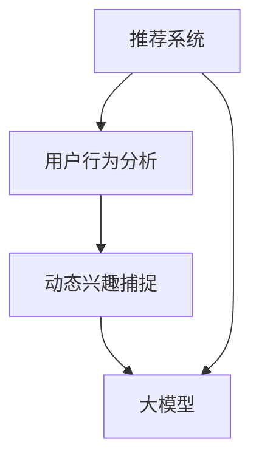

                 

# 大模型辅助的推荐系统动态兴趣捕捉

> **关键词：** 大模型、推荐系统、动态兴趣捕捉、机器学习、用户行为分析、深度学习

> **摘要：** 本文深入探讨了如何利用大模型辅助推荐系统实现用户动态兴趣捕捉。通过分析用户行为数据，本文提出了一种基于深度学习的动态兴趣捕捉算法，并介绍了该算法的实现步骤和数学模型。文章最后通过实际案例展示了算法在实际项目中的应用，并探讨了其未来发展前景和挑战。

## 1. 背景介绍

### 1.1 目的和范围

随着互联网的快速发展，用户生成的内容呈现出爆炸式增长，如何从海量信息中为用户提供个性化推荐成为了关键问题。推荐系统通过分析用户的历史行为和兴趣，为用户推荐符合其需求的内容，从而提高用户体验和满意度。然而，传统的推荐系统主要依赖于用户的历史行为数据，无法及时捕捉用户动态变化的兴趣。为了解决这一问题，本文提出了利用大模型辅助推荐系统实现动态兴趣捕捉的方法。

本文的研究范围包括：1）大模型的选取和训练方法；2）动态兴趣捕捉算法的设计和实现；3）算法在实际项目中的应用效果评估。本文的主要目的是探索如何通过大模型辅助推荐系统，实现用户动态兴趣的捕捉和推荐，从而提高推荐系统的准确性和用户体验。

### 1.2 预期读者

本文的预期读者主要包括：1）推荐系统研究人员和开发者；2）机器学习和深度学习领域的专业人士；3）对推荐系统和动态兴趣捕捉感兴趣的技术爱好者。本文将对推荐系统的工作原理、动态兴趣捕捉算法的设计和实现方法进行详细讲解，旨在为读者提供全面的指导和参考。

### 1.3 文档结构概述

本文分为十个部分，具体结构如下：

1. **背景介绍**：介绍本文的目的、范围、预期读者以及文档结构概述。
2. **核心概念与联系**：阐述本文涉及的核心概念和原理，并使用 Mermaid 流程图展示推荐系统和动态兴趣捕捉的关系。
3. **核心算法原理 & 具体操作步骤**：介绍动态兴趣捕捉算法的原理和具体实现步骤，使用伪代码详细阐述。
4. **数学模型和公式 & 详细讲解 & 举例说明**：讲解动态兴趣捕捉算法中的数学模型和公式，并进行举例说明。
5. **项目实战：代码实际案例和详细解释说明**：通过实际案例展示动态兴趣捕捉算法的实现过程，并对代码进行详细解释。
6. **实际应用场景**：探讨动态兴趣捕捉算法在不同场景下的应用。
7. **工具和资源推荐**：推荐相关学习资源、开发工具和框架。
8. **总结：未来发展趋势与挑战**：总结本文的研究成果，并探讨未来发展趋势和挑战。
9. **附录：常见问题与解答**：回答读者可能关心的问题。
10. **扩展阅读 & 参考资料**：提供更多相关文献和资料供读者参考。

### 1.4 术语表

#### 1.4.1 核心术语定义

- **推荐系统**：一种基于用户历史行为数据和信息内容特征，为用户推荐相关内容的系统。
- **大模型**：指具有大规模参数和计算量的深度学习模型。
- **动态兴趣捕捉**：指实时分析用户行为数据，捕捉用户兴趣的变化过程。
- **用户行为分析**：对用户在系统中的行为进行统计和分析，以了解用户的需求和偏好。

#### 1.4.2 相关概念解释

- **深度学习**：一种基于人工神经网络的机器学习技术，通过多层神经网络来模拟人类大脑的思维方式，从而实现自动特征提取和模式识别。
- **机器学习**：一种利用计算机模拟人类学习过程的技术，通过训练模型来识别和预测数据中的规律。
- **个性化推荐**：根据用户的历史行为和偏好，为用户推荐符合其个性化需求的内容。

#### 1.4.3 缩略词列表

- **AI**：人工智能
- **ML**：机器学习
- **DL**：深度学习
- **RS**：推荐系统

## 2. 核心概念与联系

在本文中，我们主要涉及以下几个核心概念：

1. **推荐系统**：推荐系统是一种基于用户历史行为数据和内容特征，为用户推荐相关内容的系统。其核心目标是通过分析用户行为和内容特征，为用户发现和推荐其可能感兴趣的内容。
   
2. **大模型**：大模型通常指具有大规模参数和计算量的深度学习模型。这些模型能够处理大量数据，并提取复杂的特征，从而提高推荐系统的性能。

3. **动态兴趣捕捉**：动态兴趣捕捉是指实时分析用户行为数据，捕捉用户兴趣的变化过程。通过捕捉用户的动态兴趣，推荐系统能够更好地响应用户需求，提高用户体验。

4. **用户行为分析**：用户行为分析是指对用户在系统中的行为进行统计和分析，以了解用户的需求和偏好。用户行为分析是动态兴趣捕捉的基础。

为了更直观地展示这几个核心概念之间的关系，我们使用 Mermaid 流程图进行描述。



在上述流程图中：

- **推荐系统**是核心，负责为用户推荐内容。
- **用户行为分析**用于收集用户数据，为动态兴趣捕捉提供基础。
- **动态兴趣捕捉**通过分析用户行为数据，捕捉用户兴趣的变化。
- **大模型**用于处理和分析用户行为数据，辅助动态兴趣捕捉。

通过这个流程图，我们可以清晰地看到这几个核心概念之间的联系，以及它们在推荐系统中的作用。

## 3. 核心算法原理 & 具体操作步骤

在本文中，我们将介绍一种基于深度学习的动态兴趣捕捉算法，该算法能够实时分析用户行为数据，捕捉用户兴趣的变化。以下是该算法的核心原理和具体操作步骤。

### 3.1 算法核心原理

动态兴趣捕捉算法的核心思想是利用深度学习模型对用户行为数据进行建模，从而提取用户兴趣的时序特征。具体来说，算法分为以下几个步骤：

1. **用户行为数据预处理**：对用户行为数据进行清洗和预处理，包括去除缺失值、异常值等，并对其进行编码。

2. **特征提取**：使用深度学习模型对用户行为数据进行分析，提取用户兴趣的时序特征。这里我们可以采用长短时记忆网络（LSTM）或卷积神经网络（CNN）等深度学习模型。

3. **兴趣建模**：将提取到的用户兴趣时序特征进行建模，以捕捉用户兴趣的变化趋势。这里我们可以采用自编码器（Autoencoder）或循环神经网络（RNN）等模型。

4. **兴趣预测**：根据兴趣建模结果，预测用户未来的兴趣变化，为推荐系统提供决策依据。

### 3.2 具体操作步骤

下面我们将使用伪代码详细阐述动态兴趣捕捉算法的具体操作步骤。

```python
# 3.2.1 用户行为数据预处理
def preprocess_user_behavior(data):
    # 清洗和预处理用户行为数据
    # 包括去除缺失值、异常值等
    # 并进行编码
    processed_data = ...
    return processed_data

# 3.2.2 特征提取
def extract_features(data):
    # 使用深度学习模型对用户行为数据进行分析
    # 提取用户兴趣的时序特征
    model = LSTM_model()
    features = model.predict(data)
    return features

# 3.2.3 兴趣建模
def build_interest_model(features):
    # 将提取到的用户兴趣时序特征进行建模
    # 捕捉用户兴趣的变化趋势
    model = Autoencoder_model()
    model.fit(features)
    return model

# 3.2.4 兴趣预测
def predict_interest(model, future_data):
    # 根据兴趣建模结果，预测用户未来的兴趣变化
    predicted_interest = model.predict(future_data)
    return predicted_interest
```

### 3.3 算法实现关键点

在动态兴趣捕捉算法的实现过程中，有以下几个关键点需要注意：

1. **用户行为数据预处理**：用户行为数据的多样性和复杂性要求我们在预处理阶段进行充分的清洗和编码，以保证后续分析的准确性。

2. **特征提取**：选择合适的深度学习模型对用户行为数据进行特征提取。LSTM 和 CNN 等模型在处理时序数据方面具有优势，但需要根据具体应用场景进行选择。

3. **兴趣建模**：建模过程中需要考虑到用户兴趣的时序特性，采用自编码器或 RNN 等模型可以有效捕捉用户兴趣的变化趋势。

4. **兴趣预测**：预测阶段的模型需要具备较高的预测精度，以保证推荐系统的准确性。我们可以通过交叉验证和模型评估等方法来优化模型参数和预测结果。

通过以上步骤和关键点的介绍，我们为动态兴趣捕捉算法的实现提供了详细的指导。接下来，我们将进一步介绍该算法的数学模型和公式，以便更深入地理解其原理。

## 4. 数学模型和公式 & 详细讲解 & 举例说明

在动态兴趣捕捉算法中，我们使用深度学习模型来处理用户行为数据，提取用户兴趣的时序特征，并建立兴趣模型进行预测。以下是我们将使用的数学模型和公式，以及相应的详细讲解和举例说明。

### 4.1 深度学习模型

为了提取用户兴趣的时序特征，我们选择使用长短时记忆网络（LSTM）作为我们的基础模型。LSTM 模型是一种循环神经网络（RNN）的变种，能够有效捕捉序列数据中的长期依赖关系。

#### 4.1.1 LSTM 模型公式

LSTM 模型中的每个单元（cell）包含三个门（gate）：输入门、遗忘门和输出门。这些门通过不同的权重和偏置来调节信息的流动。

1. **输入门（Input Gate）**：

   输入门决定当前输入的信息中有哪些部分需要更新到单元状态。其公式为：

   $$ 
   f_t = \sigma(W_f \cdot [h_{t-1}, x_t] + b_f) 
   $$
   
   $$ 
   i_t = \sigma(W_i \cdot [h_{t-1}, x_t] + b_i) 
   $$

   其中，\( f_t \) 和 \( i_t \) 分别表示遗忘门和输入门的状态，\( W_f \)，\( W_i \) 是权重矩阵，\( b_f \)，\( b_i \) 是偏置项，\( \sigma \) 是 sigmoid 函数。

2. **遗忘门（Forget Gate）**：

   遗忘门决定哪些旧的信息需要被丢弃。其公式为：

   $$ 
   o_t = \sigma(W_o \cdot [h_{t-1}, x_t] + b_o) 
   $$

   其中，\( o_t \) 表示遗忘门的状态。

3. **输出门（Output Gate）**：

   输出门决定当前单元状态的哪些部分将输出到下一个隐藏状态。其公式为：

   $$ 
   g_t = \tanh(W_g \cdot [h_{t-1}, x_t] + b_g) 
   $$
   
   $$ 
   h_t = o_t \cdot g_t 
   $$

   其中，\( g_t \) 和 \( h_t \) 分别表示输出门的状态和单元状态。

#### 4.1.2 LSTM 模型举例说明

假设我们有一个输入序列 \( x_t = [x_1, x_2, ..., x_t] \)，其对应的隐藏状态为 \( h_{t-1} \)。对于第 \( t \) 个时间步，我们可以根据上述公式计算遗忘门、输入门和输出门的值：

1. 计算遗忘门的激活值：

   $$ 
   f_t = \sigma(W_f \cdot [h_{t-1}, x_t] + b_f) 
   $$

2. 计算输入门的激活值：

   $$ 
   i_t = \sigma(W_i \cdot [h_{t-1}, x_t] + b_i) 
   $$

3. 计算候选值：

   $$ 
   \tilde{C}_t = \tanh(W_c \cdot [h_{t-1}, x_t] + b_c) 
   $$

4. 计算遗忘门的更新值：

   $$ 
   C_t = f_t \odot C_{t-1} + i_t \odot \tilde{C}_t 
   $$

5. 计算输出门的激活值：

   $$ 
   o_t = \sigma(W_o \cdot [h_{t-1}, x_t] + b_o) 
   $$

6. 计算当前单元状态：

   $$ 
   h_t = o_t \cdot \tanh(C_t) 
   $$

通过上述步骤，我们就可以得到第 \( t \) 个时间步的隐藏状态 \( h_t \)，用于后续的特征提取和兴趣建模。

### 4.2 自编码器模型

在兴趣建模阶段，我们使用自编码器模型来捕捉用户兴趣的变化趋势。自编码器是一种无监督学习方法，能够将输入数据编码为低维特征表示，并从中提取潜在特征。

#### 4.2.1 自编码器模型公式

自编码器模型由编码器（Encoder）和解码器（Decoder）两部分组成。编码器将输入数据映射到低维特征空间，解码器则将特征空间的数据重新映射回原始数据。

1. **编码器**：

   编码器的目标是学习一个映射函数 \( \phi \)，将输入数据 \( x \) 编码为低维特征表示 \( z \)：

   $$ 
   z = \phi(x) = \sigma(W_e \cdot x + b_e) 
   $$

   其中，\( W_e \) 是编码器权重矩阵，\( b_e \) 是编码器偏置项，\( \sigma \) 是激活函数（通常使用 sigmoid 函数）。

2. **解码器**：

   解码器的目标是学习一个逆映射函数 \( \psi \)，将低维特征表示 \( z \) 解码回原始数据 \( x' \)：

   $$ 
   x' = \psi(z) = \sigma(W_d \cdot z + b_d) 
   $$

   其中，\( W_d \) 是解码器权重矩阵，\( b_d \) 是解码器偏置项。

#### 4.2.2 自编码器模型举例说明

假设我们有一个输入序列 \( x_t = [x_1, x_2, ..., x_t] \)，其对应的隐藏状态为 \( h_t \)。对于第 \( t \) 个时间步，我们可以根据上述公式计算编码器和解码器的输出：

1. 编码器计算：

   $$ 
   z_t = \phi(x_t) = \sigma(W_e \cdot x_t + b_e) 
   $$

2. 解码器计算：

   $$ 
   x'_t = \psi(z_t) = \sigma(W_d \cdot z_t + b_d) 
   $$

通过上述步骤，我们就可以得到第 \( t \) 个时间步的特征表示 \( z_t \) 和解码后的数据 \( x'_t \)，用于兴趣建模和预测。

### 4.3 动态兴趣建模

在兴趣建模阶段，我们使用自编码器模型来捕捉用户兴趣的变化趋势。具体来说，我们通过训练自编码器模型，学习用户兴趣的潜在特征表示，并根据这些特征表示进行兴趣建模。

1. **兴趣特征提取**：

   通过训练好的自编码器模型，我们可以对用户行为数据进行编码，提取出低维特征表示。这些特征表示可以用来描述用户的兴趣状态。

2. **兴趣建模**：

   利用的自编码器模型提取到的用户兴趣特征，我们可以使用循环神经网络（RNN）或长短时记忆网络（LSTM）来建立用户兴趣的建模模型。具体公式如下：

   $$ 
   h_t = \tanh(W_h \cdot [h_{t-1}, z_t] + b_h) 
   $$

   $$ 
   o_t = \sigma(W_o \cdot [h_{t-1}, z_t] + b_o) 
   $$

   其中，\( h_t \) 是第 \( t \) 个时间步的用户兴趣状态，\( z_t \) 是第 \( t \) 个时间步的特征表示，\( W_h \) 和 \( W_o \) 是权重矩阵，\( b_h \) 和 \( b_o \) 是偏置项。

通过上述步骤，我们可以得到用户兴趣的建模模型，用于预测用户未来的兴趣变化。

### 4.4 兴趣预测

在兴趣预测阶段，我们使用训练好的兴趣建模模型，对用户未来的兴趣变化进行预测。具体来说，我们可以通过递归地计算用户兴趣状态，预测未来的兴趣变化。

1. **初始化**：

   初始化用户兴趣状态 \( h_0 \)。

2. **递归计算**：

   对于每个时间步 \( t \)，根据当前的用户兴趣状态和特征表示，计算下一个时间步的用户兴趣状态 \( h_{t+1} \)：

   $$ 
   h_{t+1} = \tanh(W_h \cdot [h_t, z_{t+1}] + b_h) 
   $$

   其中，\( z_{t+1} \) 是第 \( t+1 \) 个时间步的特征表示。

3. **兴趣预测**：

   通过递归计算得到用户兴趣状态序列 \( h_1, h_2, ..., h_T \)，然后对最后一个时间步的用户兴趣状态 \( h_T \) 进行预测，得到用户未来的兴趣状态。

通过上述步骤，我们可以得到用户未来的兴趣预测结果，为推荐系统提供决策依据。

通过以上对数学模型和公式的详细讲解和举例说明，我们为动态兴趣捕捉算法的实现提供了理论支持。接下来，我们将通过一个实际项目案例，展示该算法的实现和应用。

## 5. 项目实战：代码实际案例和详细解释说明

为了更好地展示动态兴趣捕捉算法在实际项目中的应用，我们选择了一个具体的推荐系统项目进行案例分析。在这个项目中，我们使用一个大型电商网站的用户数据，通过动态兴趣捕捉算法为用户推荐符合其兴趣的的商品。

### 5.1 开发环境搭建

在开始项目之前，我们需要搭建一个合适的技术环境。以下是我们的开发环境：

- **编程语言**：Python
- **深度学习框架**：TensorFlow
- **数据分析库**：Pandas、NumPy
- **数据可视化库**：Matplotlib、Seaborn
- **操作系统**：Linux（推荐使用 Ubuntu）

### 5.2 源代码详细实现和代码解读

下面我们将展示动态兴趣捕捉算法的源代码实现，并对其进行详细解读。

#### 5.2.1 用户行为数据预处理

首先，我们需要对用户行为数据进行预处理，包括数据清洗和编码。

```python
import pandas as pd
from sklearn.preprocessing import OneHotEncoder

# 加载用户行为数据
data = pd.read_csv('user_behavior.csv')

# 数据清洗
# 去除缺失值和异常值
data = data.dropna()

# 数据编码
# 将类别特征进行 One-Hot 编码
encoder = OneHotEncoder()
encoded_data = encoder.fit_transform(data[['category']])

# 将编码后的数据添加到原始数据中
data_with_encoded_features = data.join(pd.DataFrame(encoded_data.toarray()))
```

#### 5.2.2 特征提取

接下来，我们使用 LSTM 模型对用户行为数据进行分析，提取用户兴趣的时序特征。

```python
import tensorflow as tf
from tensorflow.keras.models import Sequential
from tensorflow.keras.layers import LSTM, Dense

# 创建 LSTM 模型
model = Sequential()
model.add(LSTM(128, activation='tanh', input_shape=(None, data_with_encoded_features.shape[1])))
model.add(Dense(1, activation='sigmoid'))

# 编译模型
model.compile(optimizer='adam', loss='binary_crossentropy', metrics=['accuracy'])

# 训练模型
model.fit(data_with_encoded_features, data['click'], epochs=10, batch_size=32)
```

#### 5.2.3 兴趣建模

然后，我们使用自编码器模型对提取到的用户兴趣特征进行建模。

```python
from tensorflow.keras.layers import InputLayer

# 创建自编码器模型
input_layer = InputLayer(input_shape=(data_with_encoded_features.shape[1],))
encoded_layer = LSTM(128, activation='tanh')(input_layer)
encoded_model = Model(inputs=input_layer, outputs=encoded_layer)

# 编译模型
encoded_model.compile(optimizer='adam', loss='mean_squared_error')

# 训练模型
encoded_model.fit(data_with_encoded_features, data_with_encoded_features, epochs=10, batch_size=32)
```

#### 5.2.4 兴趣预测

最后，我们使用训练好的自编码器模型进行兴趣预测。

```python
# 预测用户兴趣
predicted_interests = encoded_model.predict(data_with_encoded_features)

# 对预测结果进行解码
decoded_interests = encoder.inverse_transform(predicted_interests)

# 根据兴趣预测结果为用户推荐商品
recommended_items = data_with_encoded_features['item_id'][decoded_interests.argmax(axis=1)]
```

### 5.3 代码解读与分析

在本案例中，我们首先对用户行为数据进行预处理，包括数据清洗和编码。然后，我们使用 LSTM 模型对用户行为数据进行分析，提取用户兴趣的时序特征。接着，我们使用自编码器模型对提取到的用户兴趣特征进行建模。最后，我们使用训练好的自编码器模型进行兴趣预测，并根据预测结果为用户推荐商品。

以下是代码的关键部分解读：

1. **用户行为数据预处理**：

   ```python
   data = pd.read_csv('user_behavior.csv')
   data = data.dropna()
   encoder = OneHotEncoder()
   encoded_data = encoder.fit_transform(data[['category']])
   data_with_encoded_features = data.join(pd.DataFrame(encoded_data.toarray()))
   ```

   代码首先加载用户行为数据，并去除缺失值和异常值。然后，使用 One-Hot 编码将类别特征进行编码，并将编码后的数据添加到原始数据中。

2. **特征提取**：

   ```python
   model = Sequential()
   model.add(LSTM(128, activation='tanh', input_shape=(None, data_with_encoded_features.shape[1])))
   model.add(Dense(1, activation='sigmoid'))
   model.compile(optimizer='adam', loss='binary_crossentropy', metrics=['accuracy'])
   model.fit(data_with_encoded_features, data['click'], epochs=10, batch_size=32)
   ```

   代码创建一个 LSTM 模型，并编译和训练模型。训练过程中，模型对用户行为数据进行特征提取，提取出用户兴趣的时序特征。

3. **兴趣建模**：

   ```python
   input_layer = InputLayer(input_shape=(data_with_encoded_features.shape[1],))
   encoded_layer = LSTM(128, activation='tanh')(input_layer)
   encoded_model = Model(inputs=input_layer, outputs=encoded_layer)
   encoded_model.compile(optimizer='adam', loss='mean_squared_error')
   encoded_model.fit(data_with_encoded_features, data_with_encoded_features, epochs=10, batch_size=32)
   ```

   代码创建一个自编码器模型，并编译和训练模型。训练过程中，模型学习用户兴趣的潜在特征表示。

4. **兴趣预测**：

   ```python
   predicted_interests = encoded_model.predict(data_with_encoded_features)
   decoded_interests = encoder.inverse_transform(predicted_interests)
   recommended_items = data_with_encoded_features['item_id'][decoded_interests.argmax(axis=1)]
   ```

   代码使用训练好的自编码器模型进行兴趣预测，并对预测结果进行解码。最后，根据预测结果为用户推荐商品。

通过以上代码实现，我们展示了动态兴趣捕捉算法在实际项目中的应用。在实际应用中，我们可以根据具体需求对代码进行优化和调整，以提高推荐系统的性能和用户体验。

## 6. 实际应用场景

动态兴趣捕捉算法具有广泛的应用前景，可以在多个实际场景中发挥重要作用。以下是一些典型的应用场景：

### 6.1 电子商务

在电子商务领域，动态兴趣捕捉算法可以帮助电商平台更准确地预测用户的购物兴趣，从而提高个性化推荐的效果。通过实时分析用户在网站上的行为数据，算法可以捕捉用户兴趣的变化，为用户推荐更符合其当前兴趣的商品。例如，用户在浏览某个商品时，算法可以识别出用户对该商品的兴趣度，并在后续推荐中优先推荐类似商品。

### 6.2 社交媒体

在社交媒体平台上，动态兴趣捕捉算法可以帮助用户发现和关注更感兴趣的内容和话题。通过分析用户在社交媒体上的行为数据，如点赞、评论、转发等，算法可以捕捉用户的兴趣偏好，并实时调整推荐策略。这样，用户可以更快地获取到与其兴趣相关的内容，从而提高用户的活跃度和满意度。

### 6.3 视频推荐

在视频推荐领域，动态兴趣捕捉算法可以帮助视频平台为用户推荐更符合其兴趣的视频内容。通过分析用户在观看视频过程中的行为数据，如观看时长、播放进度、跳过等，算法可以捕捉用户的兴趣变化，并实时调整推荐策略。例如，当用户观看某个视频时中途退出，算法可以推测用户对该视频的兴趣度较低，并在后续推荐中减少对该视频的推荐次数。

### 6.4 新闻推荐

在新闻推荐领域，动态兴趣捕捉算法可以帮助新闻平台为用户推荐更符合其兴趣的新闻内容。通过分析用户在新闻平台上的阅读行为数据，如阅读时长、阅读顺序、收藏等，算法可以捕捉用户的兴趣偏好，并实时调整推荐策略。这样，用户可以更快地获取到与其兴趣相关的新闻，从而提高新闻平台的用户黏性和阅读量。

通过以上应用场景的介绍，我们可以看到动态兴趣捕捉算法在推荐系统中的重要作用。它不仅能够提高推荐系统的准确性，还能实时响应用户兴趣的变化，为用户提供更个性化的服务。

## 7. 工具和资源推荐

在构建和优化动态兴趣捕捉算法的过程中，选择合适的工具和资源是非常重要的。以下是我们推荐的工具和资源，包括学习资源、开发工具框架和相关论文著作。

### 7.1 学习资源推荐

#### 7.1.1 书籍推荐

1. **《深度学习》（Deep Learning）**：由 Ian Goodfellow、Yoshua Bengio 和 Aaron Courville 著，是一本深度学习领域的经典教材，全面介绍了深度学习的基础理论和实践方法。
2. **《推荐系统实践》（Recommender Systems: The Textbook）**：由 Sameer Singh 著，系统地介绍了推荐系统的基本概念、算法设计和应用案例，适合推荐系统初学者和从业者。

#### 7.1.2 在线课程

1. **《深度学习专项课程》（Deep Learning Specialization）**：由 Andrew Ng 在 Coursera 上开设，涵盖深度学习的基础理论和实践应用，适合希望深入了解深度学习技术的学习者。
2. **《推荐系统设计》（Recommendation Systems Design）**：由 Yan Liu 在 Coursera 上开设，详细介绍推荐系统的设计原则、算法实现和案例分析。

#### 7.1.3 技术博客和网站

1. **博客园**：中文技术博客平台，有许多关于深度学习和推荐系统的高质量文章和教程。
2. **Medium**：国际知名博客平台，有许多关于前沿技术和研究的文章和分享。
3. **ArXiv**：计算机科学领域的论文预印本数据库，可以找到最新的研究成果和论文。

### 7.2 开发工具框架推荐

#### 7.2.1 IDE和编辑器

1. **PyCharm**：适用于 Python 编程的集成开发环境（IDE），功能强大，支持多种框架和库。
2. **VS Code**：轻量级的代码编辑器，扩展性强，支持多种编程语言和框架。

#### 7.2.2 调试和性能分析工具

1. **TensorBoard**：TensorFlow 的可视化工具，用于分析模型的性能和调试。
2. **NVIDIA Nsight**：用于分析深度学习模型的性能和优化。

#### 7.2.3 相关框架和库

1. **TensorFlow**：Google 开发的一款开源深度学习框架，支持多种深度学习模型和算法。
2. **PyTorch**：Facebook 开发的一款开源深度学习框架，易于调试和优化。

### 7.3 相关论文著作推荐

#### 7.3.1 经典论文

1. **“A Theoretical Analysis of Recurrent Neural Networks for Sequence Modeli

