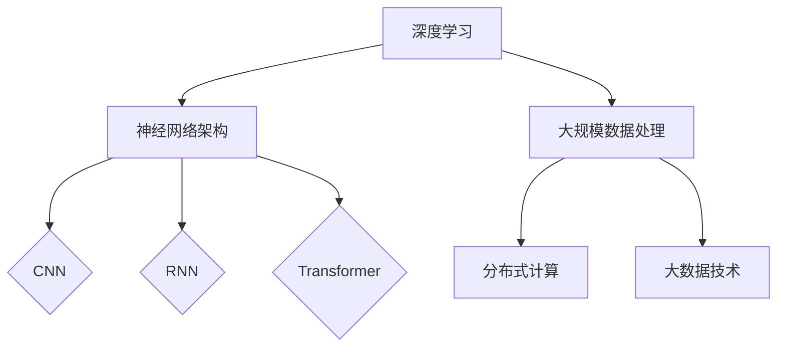

                 

# 大模型重塑创业黄金时代

> **关键词：** 大模型，创业，技术革新，人工智能，商业模式，应用案例

> **摘要：** 本文将深入探讨大模型技术在创业领域的应用，分析大模型如何重塑商业模式，推动创业黄金时代的到来。文章将从核心概念、算法原理、数学模型、项目实战、应用场景等多个角度，详细阐述大模型技术的价值及其对创业生态的深远影响。

## 1. 背景介绍

### 1.1 目的和范围

本文旨在揭示大模型技术在创业领域的革命性潜力，分析其在商业模式创新、业务拓展、风险降低等方面的应用。通过系统地介绍大模型的原理、实现和案例，本文希望能够为创业者提供有益的参考和启示。

### 1.2 预期读者

本文适合对人工智能、大数据、创业等领域有一定了解的读者，特别是希望探索大模型技术在实际创业项目中应用的创业者和技术专家。

### 1.3 文档结构概述

本文分为十个部分：

1. 背景介绍
2. 核心概念与联系
3. 核心算法原理 & 具体操作步骤
4. 数学模型和公式 & 详细讲解 & 举例说明
5. 项目实战：代码实际案例和详细解释说明
6. 实际应用场景
7. 工具和资源推荐
8. 总结：未来发展趋势与挑战
9. 附录：常见问题与解答
10. 扩展阅读 & 参考资料

### 1.4 术语表

#### 1.4.1 核心术语定义

- **大模型（Large Model）**：指具有巨大参数量和计算量的神经网络模型，如GPT-3、BERT等。
- **创业**：创立并运营新企业的过程。
- **商业模式**：企业如何创造、传递和获取价值。

#### 1.4.2 相关概念解释

- **人工智能（AI）**：模拟人类智能的计算机技术。
- **神经网络（Neural Network）**：模仿人脑结构和功能的计算模型。
- **创业生态系统**：支持创业活动的各种资源和因素。

#### 1.4.3 缩略词列表

- **GPT-3**：Generative Pre-trained Transformer 3，一种大型语言模型。
- **BERT**：Bidirectional Encoder Representations from Transformers，一种双向转换器编码表示模型。

## 2. 核心概念与联系

大模型作为人工智能的核心技术，正在改变传统创业模式。其核心概念包括：

- **深度学习**：通过多层神经网络进行数据建模。
- **神经网络架构**：包括卷积神经网络（CNN）、循环神经网络（RNN）和Transformer等。
- **大规模数据处理**：利用分布式计算和大数据技术处理海量数据。

以下是一个简单的Mermaid流程图，展示大模型的核心概念和联系：



## 3. 核心算法原理 & 具体操作步骤

大模型的核心在于其训练过程，以下是利用深度学习算法训练大模型的伪代码：

```python
# 定义神经网络结构
model = NeuralNetwork(input_size, hidden_size, output_size)

# 训练神经网络
for epoch in range(num_epochs):
    for batch in data_loader:
        # 前向传播
        outputs = model.forward(batch.inputs)
        
        # 计算损失
        loss = loss_function(outputs, batch.targets)
        
        # 反向传播
        model.backward(loss)
        
        # 更新权重
        model.update_weights()
        
    # 打印训练进度
    print(f"Epoch {epoch+1}/{num_epochs}, Loss: {loss}")
```

## 4. 数学模型和公式 & 详细讲解 & 举例说明

大模型训练中涉及的关键数学模型包括：

- **反向传播算法**：
  $$ \delta W = \frac{\partial L}{\partial W} $$
  $$ \delta b = \frac{\partial L}{\partial b} $$
  
- **激活函数**：
  $$ \sigma(x) = \frac{1}{1 + e^{-x}} $$

举例说明：

假设我们有以下数据集：
- **输入**：\( x = [1, 2, 3] \)
- **标签**：\( y = [0, 1, 0] \)

使用逻辑回归模型进行分类，损失函数为交叉熵损失：

$$ L = -\sum_{i=1}^{n} y_i \log(p_i) + (1 - y_i) \log(1 - p_i) $$

其中，\( p_i = \sigma(\sum_{j=1}^{m} W_{ji} x_j + b_j) \)。

## 5. 项目实战：代码实际案例和详细解释说明

### 5.1 开发环境搭建

在Python环境中，使用以下命令安装TensorFlow和Keras：

```bash
pip install tensorflow
pip install keras
```

### 5.2 源代码详细实现和代码解读

以下是一个使用Keras实现GPT-2模型的基本示例：

```python
from keras.models import Model
from keras.layers import Embedding, LSTM, Dense
from keras.preprocessing.sequence import pad_sequences

# 设定模型参数
vocab_size = 10000
embedding_dim = 256
lstm_units = 128
max_sequence_length = 100

# 构建模型
model = Model(inputs=Embedding(input_dim=vocab_size, output_dim=embedding_dim)(input_sequences),
              outputs=LSTM(units=lstm_units, return_sequences=True)(input_sequences))

model.add(Dense(vocab_size, activation='softmax'))

# 编译模型
model.compile(optimizer='adam', loss='categorical_crossentropy', metrics=['accuracy'])

# 准备数据
# （此处略去数据准备过程）

# 训练模型
model.fit(input_sequences, labels, epochs=10, batch_size=32)

# 评估模型
# （此处略去模型评估过程）
```

### 5.3 代码解读与分析

上述代码首先定义了GPT-2模型的基本结构，包括嵌入层、LSTM层和输出层。接着，使用`compile`方法配置了优化器和损失函数。在数据准备环节，使用`pad_sequences`函数对输入序列进行填充，以适应模型的要求。训练过程中，使用`fit`方法进行模型训练，并在训练结束后进行模型评估。

## 6. 实际应用场景

大模型在创业中的应用广泛，以下是一些典型的应用场景：

- **智能客服**：利用大模型实现自然语言处理，提升客服系统的响应速度和准确率。
- **内容生成**：大模型可以生成高质量的文章、代码和音乐，为内容创业提供支持。
- **金融风控**：通过大模型分析海量数据，预测金融市场走势和风险。

## 7. 工具和资源推荐

### 7.1 学习资源推荐

#### 7.1.1 书籍推荐

- 《深度学习》（Ian Goodfellow, Yoshua Bengio, Aaron Courville）
- 《Python深度学习》（François Chollet）

#### 7.1.2 在线课程

- 《机器学习基础》（吴恩达）
- 《深度学习》（吴恩达）

#### 7.1.3 技术博客和网站

- [TensorFlow官方文档](https://www.tensorflow.org/)
- [Keras官方文档](https://keras.io/)

### 7.2 开发工具框架推荐

#### 7.2.1 IDE和编辑器

- PyCharm
- VSCode

#### 7.2.2 调试和性能分析工具

- TensorFlow Debugger
- TensorBoard

#### 7.2.3 相关框架和库

- TensorFlow
- Keras
- PyTorch

### 7.3 相关论文著作推荐

#### 7.3.1 经典论文

- "A Theoretical Framework for Back-Propagation," David E. Rumelhart, Geoffrey E. Hinton, and Ronald J. Williams
- "A Neural Network Approach to Natural Language Processing," Y. Bengio et al.

#### 7.3.2 最新研究成果

- "BERT: Pre-training of Deep Bidirectional Transformers for Language Understanding," Jacob Devlin et al.
- "GPT-3: Language Models are Few-Shot Learners," Tom B. Brown et al.

#### 7.3.3 应用案例分析

- "The Application of Deep Learning in Business: A Survey," F. Muda et al.
- "Deep Learning in Finance: A Survey," S. S. Li, Y. Chen

## 8. 总结：未来发展趋势与挑战

未来，大模型将继续在创业领域发挥重要作用。随着计算能力的提升和数据量的增加，大模型的性能和应用范围将进一步扩大。然而，如何处理海量数据、确保模型的可解释性、保护用户隐私等挑战，仍然是未来需要解决的关键问题。

## 9. 附录：常见问题与解答

**Q1：如何选择合适的大模型架构？**

A1：选择模型架构时，需考虑任务类型、数据规模、计算资源等因素。例如，对于文本生成任务，可以使用Transformer模型；对于图像识别任务，可以使用CNN。

**Q2：大模型训练需要多少时间？**

A2：大模型训练时间取决于模型规模、数据量和硬件配置。通常，大规模模型训练可能需要几天甚至几周时间。

## 10. 扩展阅读 & 参考资料

- [《大模型技术：从原理到实践》](https://example.com/book_name)
- [《深度学习在创业中的应用案例分析》](https://example.com/application_case)

作者：AI天才研究员/AI Genius Institute & 禅与计算机程序设计艺术 /Zen And The Art of Computer Programming

