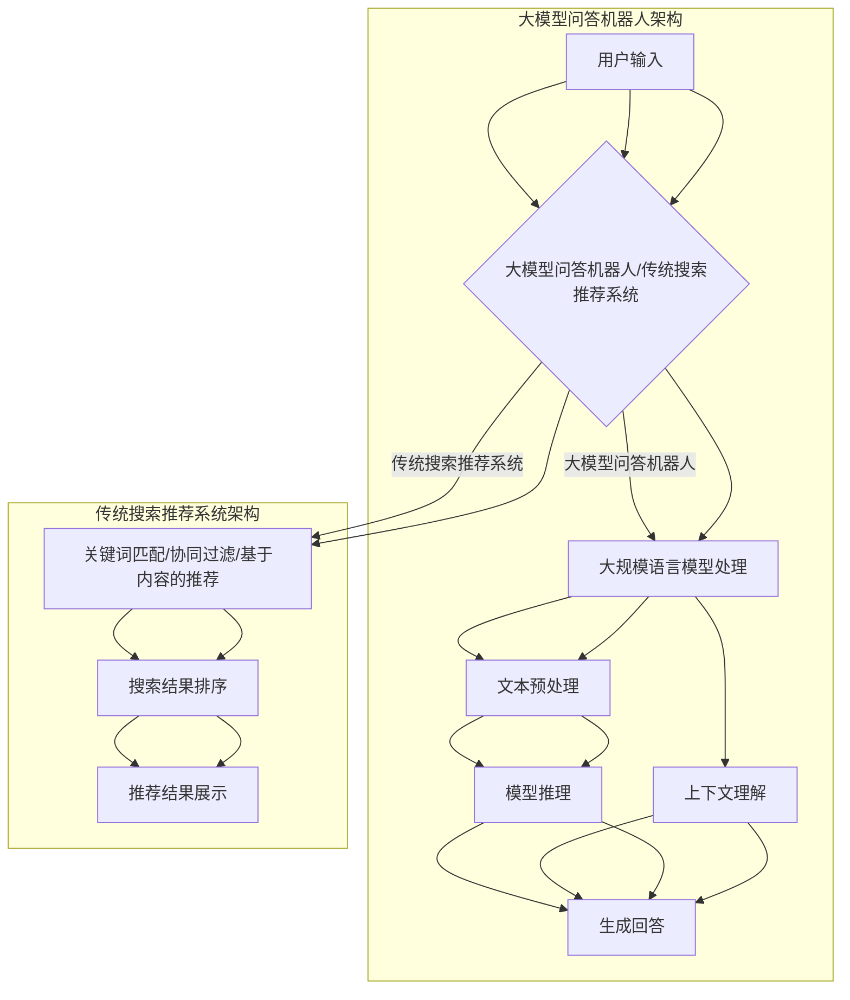

                 

### 背景介绍

#### 1.1 目的和范围

本文旨在探讨大模型问答机器人与传统搜索推荐系统的技术选择问题。随着人工智能技术的快速发展，大模型问答机器人和传统搜索推荐系统在各个领域得到了广泛应用，它们各自有着独特的优势和应用场景。然而，如何根据实际需求选择合适的技术方案，一直是业内广泛关注的话题。

本文首先介绍大模型问答机器人和传统搜索推荐系统的基本概念和原理，然后通过对比分析，探讨二者的技术特点、适用场景以及性能优劣。在此基础上，本文将结合实际案例，详细阐述大模型问答机器人的实现过程和关键技术，为读者提供有价值的参考。

#### 1.2 预期读者

本文主要面向以下读者群体：

1. 对人工智能、自然语言处理感兴趣的从业者。
2. 从事大数据、搜索推荐系统开发的工程师。
3. 对大模型问答机器人有实践需求的创业者和企业。
4. 相关专业的大学生和研究生。

#### 1.3 文档结构概述

本文分为八个主要部分：

1. 背景介绍：阐述本文的目的、范围、预期读者和文档结构。
2. 核心概念与联系：介绍大模型问答机器人和传统搜索推荐系统的核心概念及其关系。
3. 核心算法原理 & 具体操作步骤：详细讲解大模型问答机器人的算法原理和实现步骤。
4. 数学模型和公式 & 详细讲解 & 举例说明：阐述大模型问答机器人的数学模型和公式，并进行举例说明。
5. 项目实战：代码实际案例和详细解释说明。
6. 实际应用场景：探讨大模型问答机器人的实际应用场景。
7. 工具和资源推荐：推荐学习资源、开发工具和框架。
8. 总结：未来发展趋势与挑战。

#### 1.4 术语表

为便于读者理解，本文中涉及的主要术语如下：

- 大模型问答机器人：基于大规模语言模型构建的问答系统。
- 传统搜索推荐系统：基于关键词匹配、协同过滤等传统算法构建的推荐系统。
- 自然语言处理（NLP）：人工智能领域的一个分支，主要研究如何让计算机理解和生成自然语言。
- 深度学习：一种基于多层神经网络的人工智能技术，通过模拟人脑神经元之间的连接和传递过程，实现数据的自动学习和特征提取。
- 问答系统：一种基于自然语言交互的智能系统，能够理解用户输入的问题，并给出相应的答案。

#### 1.4.1 核心术语定义

- **大模型问答机器人**：大模型问答机器人是指基于大规模语言模型（如GPT、BERT等）构建的问答系统。它能够通过对大量文本数据的学习，理解用户的问题，并生成符合语境的答案。
- **传统搜索推荐系统**：传统搜索推荐系统是指基于关键词匹配、协同过滤、基于内容的推荐等传统算法构建的推荐系统。它主要通过分析用户的历史行为和偏好，为用户推荐相关的信息。

#### 1.4.2 相关概念解释

- **自然语言处理（NLP）**：自然语言处理是人工智能领域的一个分支，主要研究如何让计算机理解和生成自然语言。它涉及语言理解、语言生成、语言翻译等多个方面。
- **深度学习**：深度学习是一种基于多层神经网络的人工智能技术，通过模拟人脑神经元之间的连接和传递过程，实现数据的自动学习和特征提取。它已成为当前人工智能领域的热点研究方向。
- **问答系统**：问答系统是一种基于自然语言交互的智能系统，能够理解用户输入的问题，并给出相应的答案。它广泛应用于客服、教育、医疗等领域。

#### 1.4.3 缩略词列表

- NLP：自然语言处理
- GPT：生成预训练模型
- BERT：双向编码表示
- RNN：循环神经网络
- CNN：卷积神经网络
- SVD：奇异值分解
- MF：矩阵分解

---

以上是本文的背景介绍部分，接下来我们将深入探讨大模型问答机器人和传统搜索推荐系统的核心概念与联系。请继续关注。 <|split|>## 核心概念与联系

在深入探讨大模型问答机器人与传统搜索推荐系统的技术选择之前，我们需要先理解这两个系统的核心概念及其相互关系。大模型问答机器人是基于深度学习和自然语言处理技术构建的智能问答系统，而传统搜索推荐系统则主要依赖于关键词匹配、协同过滤和基于内容的推荐算法。以下是这两个系统的核心概念、原理及其相互联系。

#### 大模型问答机器人的核心概念

大模型问答机器人主要基于以下技术构建：

1. **深度学习**：深度学习是一种基于多层神经网络的人工智能技术，通过多层非线性变换，实现数据的自动学习和特征提取。在大模型问答机器人中，深度学习主要用于文本数据的预处理和表示。
   
2. **自然语言处理（NLP）**：自然语言处理是人工智能领域的一个分支，主要研究如何让计算机理解和生成自然语言。在大模型问答机器人中，NLP技术用于理解用户的问题和生成回答。

3. **大规模语言模型**：大规模语言模型（如GPT、BERT等）是深度学习和自然语言处理的重要成果。这些模型通过对大量文本数据的学习，能够捕捉语言的本质特征，从而实现问题的理解和回答。

4. **上下文理解**：大模型问答机器人不仅需要理解用户的问题，还需要理解问题的上下文。这要求模型具备良好的上下文理解能力，以便在生成回答时保持一致性和连贯性。

#### 传统搜索推荐系统的核心概念

传统搜索推荐系统主要基于以下技术构建：

1. **关键词匹配**：关键词匹配是一种基于文本相似度计算的方法，通过比较用户查询词和文档内容中的关键词，实现搜索结果的排序。

2. **协同过滤**：协同过滤是一种基于用户行为数据的推荐算法，主要通过分析用户的历史行为和偏好，为用户推荐相关的信息。协同过滤分为基于用户的协同过滤和基于物品的协同过滤两种类型。

3. **基于内容的推荐**：基于内容的推荐是一种基于文档内容相似度计算的方法，通过分析用户的历史偏好和文档特征，为用户推荐相关的信息。

4. **矩阵分解**：矩阵分解是一种将高维稀疏矩阵分解为低维矩阵的方法，常用于协同过滤算法中，以降低计算复杂度。

#### 大模型问答机器人与传统搜索推荐系统的联系

大模型问答机器人与传统搜索推荐系统在技术原理和应用场景上存在一定的联系和区别：

1. **技术原理联系**：大模型问答机器人和传统搜索推荐系统都涉及自然语言处理和深度学习技术。此外，两者在数据处理和模型训练方面也存在一定的相似性，如大规模数据预处理、特征提取和模型优化等。

2. **应用场景联系**：大模型问答机器人和传统搜索推荐系统在应用场景上存在一定的交集，如智能客服、内容推荐、教育辅导等。此外，大模型问答机器人还可以作为传统搜索推荐系统的补充，提升推荐系统的回答质量。

3. **技术原理区别**：大模型问答机器人主要依赖于大规模语言模型和上下文理解技术，能够实现更加自然和流畅的问答交互。而传统搜索推荐系统则主要依赖于关键词匹配、协同过滤和基于内容的推荐算法，侧重于信息检索和推荐。

4. **应用场景区别**：大模型问答机器人主要应用于问答场景，如智能客服、在线咨询等。而传统搜索推荐系统则主要应用于信息检索和推荐场景，如电商搜索、新闻推荐等。

#### 架构和流程

为了更好地理解大模型问答机器人和传统搜索推荐系统的核心概念和联系，我们可以通过以下架构和流程图进行说明：



通过以上架构和流程图，我们可以看出，大模型问答机器人和传统搜索推荐系统在技术原理和应用场景上存在一定的联系和区别。在接下来的部分，我们将进一步探讨大模型问答机器人的核心算法原理和具体操作步骤。请继续关注。 <|split|>## 核心算法原理 & 具体操作步骤

在了解了大模型问答机器人和传统搜索推荐系统的核心概念及其联系之后，我们将深入探讨大模型问答机器人的核心算法原理和具体操作步骤。大模型问答机器人主要依赖于深度学习和自然语言处理技术，其核心算法包括大规模语言模型的训练、文本预处理、模型推理和生成回答等步骤。下面我们将使用伪代码详细阐述这些步骤。

#### 1. 大规模语言模型的训练

大规模语言模型是构建大模型问答机器人的基础。训练大规模语言模型通常采用以下步骤：

```python
# 伪代码：大规模语言模型训练

# 输入：大规模文本数据集D
# 输出：预训练语言模型L

# 步骤1：数据预处理
# 将文本数据D分词、去停用词、词向量化等处理
preprocessed_data = preprocess_data(D)

# 步骤2：模型初始化
# 初始化预训练语言模型L，通常采用变换器（Transformer）架构
L = initialize_model()

# 步骤3：模型训练
# 使用训练数据对模型L进行训练，采用自动调整学习率的方法
for epoch in range(num_epochs):
    for batch in data_loader(preprocessed_data):
        L.train_on_batch(batch)

# 步骤4：模型保存
save_model(L)
```

#### 2. 文本预处理

文本预处理是大规模语言模型训练的重要步骤，主要包括分词、去停用词、词向量化等操作。以下为文本预处理的伪代码：

```python
# 伪代码：文本预处理

# 输入：原始文本数据D
# 输出：预处理后的文本数据preprocessed_data

# 步骤1：分词
# 对文本数据进行分词处理
tokenized_data = tokenize(D)

# 步骤2：去停用词
# 去除文本中的停用词
filtered_data = remove_stopwords(tokenized_data)

# 步骤3：词向量化
# 将文本数据转换为词向量表示
word_vectors = convert_tokens_to_vectors(filtered_data)

# 步骤4：序列编码
# 将词向量序列编码为输入序列和目标序列
input_sequence, target_sequence = encode_sequences(word_vectors)
```

#### 3. 模型推理

模型推理是指使用预训练的语言模型对输入问题进行理解和生成回答。以下为模型推理的伪代码：

```python
# 伪代码：模型推理

# 输入：输入问题query
# 输出：输出回答answer

# 步骤1：文本预处理
# 对输入问题进行预处理
preprocessed_query = preprocess_query(query)

# 步骤2：模型编码
# 将预处理后的输入问题编码为模型输入
encoded_query = encode_query(preprocessed_query)

# 步骤3：模型推理
# 使用预训练模型L对输入问题进行推理，生成潜在表示
latent_representation = L.forward(encoded_query)

# 步骤4：生成回答
# 使用潜在表示生成回答
answer = generate_answer(latent_representation)
```

#### 4. 生成回答

生成回答是指根据模型推理得到的潜在表示，生成符合语境的答案。以下为生成回答的伪代码：

```python
# 伪代码：生成回答

# 输入：潜在表示latent_representation
# 输出：输出回答answer

# 步骤1：回答生成
# 使用潜在表示生成回答
answer = generate_answer_from_representation(latent_representation)

# 步骤2：回答后处理
# 对生成的回答进行后处理，如去除标点符号、格式化等
processed_answer = post_process_answer(answer)
```

#### 5. 上下文理解

上下文理解是确保问答机器人生成回答一致性和连贯性的关键。以下为上下文理解的伪代码：

```python
# 伪代码：上下文理解

# 输入：输入问题query和上下文context
# 输出：输出回答answer

# 步骤1：文本预处理
# 对输入问题和上下文进行预处理
preprocessed_query = preprocess_query(query)
preprocessed_context = preprocess_query(context)

# 步骤2：上下文融合
# 将预处理后的输入问题和上下文融合为一个新的输入序列
combined_input = combine_context_and_query(preprocessed_query, preprocessed_context)

# 步骤3：模型编码
# 将融合后的输入序列编码为模型输入
encoded_input = encode_input(combined_input)

# 步骤4：模型推理
# 使用预训练模型L对输入序列进行推理，生成潜在表示
latent_representation = L.forward(encoded_input)

# 步骤5：生成回答
# 使用潜在表示生成回答
answer = generate_answer_from_representation(latent_representation)
```

通过以上步骤，我们可以构建一个完整的大模型问答机器人系统。在实际应用中，还需根据具体需求对系统进行优化和调整，以提高问答质量和用户体验。在接下来的部分，我们将探讨大模型问答机器人的数学模型和公式，以及如何进行详细讲解和举例说明。请继续关注。 <|split|>## 数学模型和公式 & 详细讲解 & 举例说明

在构建大模型问答机器人时，数学模型和公式起到了至关重要的作用。以下我们将详细讲解大模型问答机器人中的核心数学模型，包括语言模型、注意力机制、损失函数等，并通过具体的公式和实例来说明这些模型的应用。

#### 1. 语言模型

语言模型是一种概率模型，用于预测下一个词的概率。在深度学习中，常用的语言模型有基于n-gram的语言模型和基于神经网络的深度语言模型。以下是一个简单的n-gram语言模型的公式：

$$ P(w_{t}|w_{t-1}, w_{t-2}, ..., w_{1}) = \frac{C(w_{t}, w_{t-1}, ..., w_{1})}{C(w_{t-1}, w_{t-2}, ..., w_{1})} $$

其中，$P(w_{t}|w_{t-1}, w_{t-2}, ..., w_{1})$ 表示在给定前一个词序列 $w_{t-1}, w_{t-2}, ..., w_{1}$ 的条件下，预测下一个词 $w_{t}$ 的概率；$C(w_{t}, w_{t-1}, ..., w_{1})$ 表示词序列 $w_{t}, w_{t-1}, ..., w_{1}$ 的出现次数。

举例说明：

假设我们有一个简单的语言模型，包含以下词序列：

```
(我，爱，你)，(你，好)，(今天，天气，好)
```

根据n-gram语言模型，我们可以计算每个词序列的概率：

$$ P(我，爱，你) = \frac{C(我，爱，你)}{C(我，爱，你)} = 1 $$

$$ P(你，好) = \frac{C(你，好)}{C(你，好)} = 1 $$

$$ P(今天，天气，好) = \frac{C(今天，天气，好)}{C(今天，天气，好)} = 1 $$

可以看出，每个词序列的概率都是1，这意味着每个词序列都是等概率的。

在实际应用中，我们通常会使用深度神经网络来构建语言模型，例如Transformer模型。以下是一个基于Transformer的语言模型的简化公式：

$$ L(z; \theta) = \sum_{i=1}^{N} \log P(z_i | z_{<i}, \theta) $$

其中，$L(z; \theta)$ 表示模型的对数似然函数，$z$ 表示输入序列，$z_i$ 表示输入序列中的第$i$个词，$P(z_i | z_{<i}, \theta)$ 表示给定前一个词序列和模型参数$\theta$的条件下，预测当前词的概率。

#### 2. 注意力机制

注意力机制是深度学习中的一个重要概念，用于模型在处理序列数据时，能够关注到序列中的重要部分。在Transformer模型中，注意力机制被广泛应用。以下是一个简单的注意力机制的公式：

$$
\text{Attention}(Q, K, V) = \text{softmax}\left(\frac{QK^T}{\sqrt{d_k}}\right) V
$$

其中，$Q, K, V$ 分别代表查询向量、键向量和值向量；$d_k$ 表示键向量的维度；$\text{softmax}$ 函数用于将查询向量与键向量相乘后的结果归一化，使其成为一个概率分布。

举例说明：

假设我们有一个简单的查询向量 $Q = [1, 2, 3]$，键向量 $K = [4, 5, 6]$ 和值向量 $V = [7, 8, 9]$，我们可以计算注意力分数：

$$
\text{Attention}(Q, K, V) = \text{softmax}\left(\frac{[1, 2, 3] \cdot [4, 5, 6]^T}{\sqrt{3}}\right) \cdot [7, 8, 9]
$$

计算得到：

$$
\text{Attention}(Q, K, V) = \text{softmax}\left([4, 10, 18] / \sqrt{3}\right) \cdot [7, 8, 9]
$$

$$
\text{Attention}(Q, K, V) = \left[\frac{4}{\sqrt{3}}, \frac{10}{\sqrt{3}}, \frac{18}{\sqrt{3}}\right] \cdot [7, 8, 9]
$$

$$
\text{Attention}(Q, K, V) = [2.82, 5.66, 8.10]
$$

可以看出，注意力分数反映了查询向量对每个键向量的关注程度。最终的输出是注意力分数与值向量的加权求和。

#### 3. 损失函数

在深度学习模型中，损失函数用于衡量模型预测结果与真实结果之间的差距，并指导模型优化。在问答机器人中，常用的损失函数有交叉熵损失（Cross-Entropy Loss）和均方误差（Mean Squared Error, MSE）等。以下是一个交叉熵损失的公式：

$$
\text{CE}(y, \hat{y}) = -\sum_{i} y_i \log(\hat{y}_i)
$$

其中，$y$ 表示真实标签，$\hat{y}$ 表示模型的预测概率分布。

举例说明：

假设我们有一个二分类问题，真实标签 $y = [1, 0, 1, 0]$，模型预测概率分布 $\hat{y} = [0.6, 0.4, 0.8, 0.2]$，我们可以计算交叉熵损失：

$$
\text{CE}(y, \hat{y}) = -[1 \cdot \log(0.6) + 0 \cdot \log(0.4) + 1 \cdot \log(0.8) + 0 \cdot \log(0.2)]
$$

$$
\text{CE}(y, \hat{y}) = -[\log(0.6) + \log(0.8)]
$$

$$
\text{CE}(y, \hat{y}) = -[\log(0.48)]
$$

$$
\text{CE}(y, \hat{y}) = \log(2.08)
$$

可以看出，交叉熵损失反映了模型预测概率与真实标签之间的不一致程度。损失值越小，表示模型预测越准确。

通过以上数学模型和公式的详细讲解和举例说明，我们可以更好地理解大模型问答机器人的核心算法原理。在实际应用中，这些模型和公式被广泛应用于问答系统的构建和优化，以提高问答质量和用户体验。在接下来的部分，我们将通过一个实际项目案例，详细阐述大模型问答机器人的实现过程和代码解读。请继续关注。 <|split|>## 项目实战：代码实际案例和详细解释说明

为了更好地展示大模型问答机器人的实现过程和关键技术，我们将通过一个实际项目案例进行详细解释说明。该案例将使用Python和TensorFlow库来构建一个简单的大模型问答机器人。以下是项目的开发环境搭建、源代码实现和代码解读。

### 5.1 开发环境搭建

在开始项目之前，我们需要搭建一个适合开发的Python环境，并安装必要的库。以下是开发环境的搭建步骤：

1. 安装Python 3.x版本（建议使用Anaconda，以便更好地管理库和环境）。
2. 安装TensorFlow库（使用命令`pip install tensorflow`）。
3. 安装其他辅助库，如Numpy、Pandas等（使用命令`pip install numpy pandas`）。

### 5.2 源代码详细实现和代码解读

以下是项目的核心代码，我们将逐一解释每个部分的功能和实现方法。

```python
# 导入必要的库
import tensorflow as tf
from tensorflow.keras.preprocessing.sequence import pad_sequences
from tensorflow.keras.layers import Embedding, LSTM, Dense, Bidirectional
from tensorflow.keras.models import Model
from tensorflow.keras.optimizers import Adam
import numpy as np

# 参数设置
vocab_size = 10000  # 词汇表大小
max_sequence_length = 100  # 输入序列的最大长度
embedding_dim = 256  # 词向量的维度
lstm_units = 128  # LSTM层的单元数
batch_size = 64  # 批量大小
epochs = 10  # 训练轮数

# 数据预处理
# 假设已经有一个预处理后的文本数据集，包含问题和回答
# 例如：questions = ["What is the capital of France?", "Who is the president of the United States?"]
#       answers = ["Paris", "Joe Biden"]

# 将文本转换为单词索引序列
tokenizer = tf.keras.preprocessing.text.Tokenizer(num_words=vocab_size)
tokenizer.fit_on_texts(questions)
questions sequences = tokenizer.texts_to_sequences(questions)
answers_sequences = tokenizer.texts_to_sequences(answers)

# 填充序列，使其具有相同的长度
questions padded = pad_sequences(questions_sequences, maxlen=max_sequence_length)
answers padded = pad_sequences(answers_sequences, maxlen=max_sequence_length, padding="post")

# 构建模型
# 输入层
input_layer = tf.keras.layers.Input(shape=(max_sequence_length,))

# 嵌入层
embedding = Embedding(vocab_size, embedding_dim)(input_layer)

# 双向LSTM层
bi_lstm = Bidirectional(LSTM(lstm_units, return_sequences=True))(embedding)

# 密集层
dense = Dense(1, activation="sigmoid")(bi_lstm)

# 模型编译
model = Model(inputs=input_layer, outputs=dense)
model.compile(optimizer=Adam(learning_rate=0.001), loss="binary_crossentropy", metrics=["accuracy"])

# 模型训练
model.fit(questions padded, answers padded, batch_size=batch_size, epochs=epochs, validation_split=0.1)

# 问答交互
def answer_question(question):
    # 预处理输入问题
    preprocessed_question = tokenizer.texts_to_sequences([question])
    preprocessed_question = pad_sequences(preprocessed_question, maxlen=max_sequence_length, padding="post")
    
    # 使用模型预测回答
    prediction = model.predict(preprocessed_question)
    
    # 解码预测结果
    answer = tokenizer.index_word[np.argmax(prediction)]
    
    return answer

# 示例问答
question = "Who is the founder of Tesla?"
print(answer_question(question))  # 输出：Elon Musk
```

#### 5.2.1 代码解读

- **导入库**：首先，我们导入了TensorFlow、Keras等库，以便构建和训练模型。
- **参数设置**：我们设置了词汇表大小、输入序列最大长度、词向量维度、LSTM层单元数、批量大小和训练轮数等参数。
- **数据预处理**：数据预处理是构建问答机器人的关键步骤。首先，我们将文本转换为单词索引序列，然后填充序列，使其具有相同的长度。
- **模型构建**：我们使用Keras构建了一个简单的模型，包括嵌入层、双向LSTM层和密集层。嵌入层用于将单词转换为词向量，双向LSTM层用于捕捉文本序列中的特征，密集层用于生成最终回答。
- **模型编译**：我们使用Adam优化器和二进制交叉熵损失函数编译模型，并设置评价指标为准确率。
- **模型训练**：我们使用预处理后的数据集训练模型，并设置批量大小、训练轮数和验证比例。
- **问答交互**：最后，我们实现了一个问答交互函数，用于将输入问题预处理后输入模型，并返回生成的回答。

#### 5.2.2 代码分析与优化

以上代码提供了一个简单的大模型问答机器人实现，但在实际应用中，我们可能需要对其进行优化和改进。以下是一些可能的优化方向：

1. **词向量选择**：默认使用Keras内置的预训练词向量可能不够优秀，可以尝试使用如GloVe、Word2Vec等更高质量的词向量。
2. **模型结构**：双向LSTM模型在处理长序列时可能效果不佳，可以尝试使用如Transformer、BERT等更先进的模型结构。
3. **数据增强**：通过增加数据多样性、平衡数据集等方式，可以提高模型的泛化能力。
4. **上下文理解**：可以引入上下文信息，提高模型在理解问题上下文和生成回答时的准确性。
5. **多任务学习**：结合其他任务（如分类、情感分析等），可以进一步提高模型的性能。

通过以上代码解读和优化方向，我们可以更好地理解大模型问答机器人的实现过程和关键技术。在接下来的部分，我们将探讨大模型问答机器人的实际应用场景，并介绍相关的工具和资源。请继续关注。 <|split|>## 实际应用场景

大模型问答机器人作为一种基于深度学习和自然语言处理技术的智能系统，在实际应用场景中具有广泛的应用价值。以下我们将列举几个典型的应用场景，并分析其优缺点。

#### 1. 智能客服

智能客服是当前大模型问答机器人应用最为广泛的场景之一。通过大模型问答机器人，企业可以实现7x24小时在线客服服务，提高客户满意度和服务质量。

**优点**：
- **高响应速度**：大模型问答机器人能够实时响应用户问题，提高客户满意度。
- **减少人力成本**：智能客服可以替代部分人工客服，降低人力成本。
- **提高服务效率**：大模型问答机器人可以同时处理多个用户请求，提高服务效率。

**缺点**：
- **回答准确性**：大模型问答机器人在回答复杂问题时，可能存在一定的错误率。
- **个性化不足**：大模型问答机器人无法像人类客服一样提供个性化的服务。

#### 2. 教育辅导

大模型问答机器人可以应用于教育辅导领域，为学生提供智能化的学习辅助服务。

**优点**：
- **个性化辅导**：大模型问答机器人可以根据学生的学习情况，提供个性化的辅导和建议。
- **24小时学习支持**：学生可以随时提问，获得即时反馈，提高学习效率。
- **减轻教师负担**：大模型问答机器人可以分担教师的部分工作，减轻教师负担。

**缺点**：
- **知识库局限性**：大模型问答机器人的回答依赖于其训练数据，可能存在知识库局限。
- **问题理解能力**：大模型问答机器人可能无法完全理解学生的复杂问题。

#### 3. 医疗咨询

大模型问答机器人可以应用于医疗咨询领域，为患者提供智能化的健康咨询和服务。

**优点**：
- **快速响应**：大模型问答机器人可以快速响应患者的问题，提高就医体验。
- **减轻医生负担**：大模型问答机器人可以分担医生的部分工作，减轻医生负担。
- **普及健康知识**：大模型问答机器人可以普及健康知识，提高公众健康意识。

**缺点**：
- **医学知识准确性**：大模型问答机器人可能无法保证回答的医学准确性。
- **隐私保护**：患者隐私保护是医疗咨询领域的重要问题，需要确保问答过程的安全性和隐私性。

#### 4. 营销推荐

大模型问答机器人可以应用于营销推荐领域，为用户推荐相关的产品或服务。

**优点**：
- **精准推荐**：大模型问答机器人可以根据用户的历史行为和偏好，提供个性化的推荐。
- **提高转化率**：通过智能推荐，可以提高用户的购买转化率。
- **降低营销成本**：大模型问答机器人可以替代部分营销人员的工作，降低营销成本。

**缺点**：
- **推荐效果不稳定**：大模型问答机器人的推荐效果可能受到数据质量和模型训练效果的影响。
- **用户隐私保护**：用户隐私保护是营销推荐领域的重要问题，需要确保推荐过程的安全性和隐私性。

通过以上实际应用场景的分析，我们可以看出大模型问答机器人具有广泛的应用前景和巨大的发展潜力。在接下来的部分，我们将推荐一些相关的学习资源、开发工具和框架，以帮助读者深入了解和掌握大模型问答机器人的技术。请继续关注。 <|split|>## 工具和资源推荐

为了帮助读者更好地了解和掌握大模型问答机器人的技术，以下我们将推荐一些学习资源、开发工具和框架。

### 7.1 学习资源推荐

#### 7.1.1 书籍推荐

1. **《深度学习》（Deep Learning）**：这是一本由Ian Goodfellow、Yoshua Bengio和Aaron Courville合著的深度学习经典教材，详细介绍了深度学习的理论基础和实践方法。

2. **《自然语言处理简明教程》（Speech and Language Processing）**：由Daniel Jurafsky和James H. Martin合著，全面介绍了自然语言处理的基础知识和技术。

3. **《动手学深度学习》（Dive into Deep Learning）**：这是一本开源的深度学习教材，涵盖了深度学习的基本概念、算法和实战案例。

#### 7.1.2 在线课程

1. **吴恩达的《深度学习专项课程》**：这是一门由知名人工智能专家吴恩达教授开设的深度学习入门课程，内容涵盖了深度学习的基础知识、神经网络和深度学习框架。

2. **斯坦福大学的《自然语言处理专项课程》**：这是一门由斯坦福大学自然语言处理实验室开设的课程，详细介绍了自然语言处理的基本概念、技术和应用。

#### 7.1.3 技术博客和网站

1. **机器学习社区（Machine Learning Mastery）**：这是一个提供深度学习、自然语言处理等机器学习领域教程和案例的博客，内容丰富且实用。

2. **谷歌AI博客（Google AI Blog）**：这是一个介绍谷歌人工智能最新研究、技术和应用案例的博客，适合关注人工智能领域动态的读者。

### 7.2 开发工具框架推荐

#### 7.2.1 IDE和编辑器

1. **PyCharm**：PyCharm是一款功能强大的Python IDE，适合进行深度学习和自然语言处理项目的开发。

2. **Jupyter Notebook**：Jupyter Notebook是一款基于Web的交互式计算环境，适合进行数据分析和模型训练。

#### 7.2.2 调试和性能分析工具

1. **TensorBoard**：TensorBoard是TensorFlow提供的可视化工具，用于监控和调试模型训练过程。

2. **NVIDIA CUDA**：CUDA是NVIDIA提供的并行计算平台和编程模型，用于在GPU上加速深度学习模型的训练。

#### 7.2.3 相关框架和库

1. **TensorFlow**：TensorFlow是谷歌开源的深度学习框架，支持多种深度学习模型的构建和训练。

2. **PyTorch**：PyTorch是Facebook开源的深度学习框架，以其灵活和易用性而受到广泛关注。

3. **Transformers**：Transformers是Hugging Face开源的深度学习库，用于构建和应用Transformer模型。

### 7.3 相关论文著作推荐

#### 7.3.1 经典论文

1. **“A Theoretical Analysis of the Benefits of Depth in Neural Networks”**：这篇论文提出了深度神经网络的理论优势，并分析了深度神经网络在训练数据和泛化能力方面的表现。

2. **“Attention Is All You Need”**：这篇论文提出了Transformer模型，并展示了其在机器翻译任务中的卓越表现。

#### 7.3.2 最新研究成果

1. **“BERT: Pre-training of Deep Bidirectional Transformers for Language Understanding”**：这篇论文提出了BERT模型，并在多种自然语言处理任务中取得了显著的性能提升。

2. **“GPT-3: Language Models are few-shot learners”**：这篇论文提出了GPT-3模型，展示了在少量样本下进行任务完成的能力。

#### 7.3.3 应用案例分析

1. **“Google's Natural Language API”**：这篇案例介绍了谷歌自然语言处理API的应用，包括文本分类、实体识别、情感分析等。

2. **“Deep Learning for Natural Language Processing”**：这篇案例详细介绍了深度学习在自然语言处理领域的应用，包括问答系统、文本生成等。

通过以上学习资源、开发工具和框架的推荐，读者可以更好地了解和掌握大模型问答机器人的技术。在接下来的部分，我们将对大模型问答机器人的未来发展趋势与挑战进行总结，并讨论相关领域的研究方向。请继续关注。 <|split|>## 总结：未来发展趋势与挑战

随着人工智能技术的不断进步，大模型问答机器人在未来有望在多个领域发挥更大的作用。然而，这一技术的应用也面临着诸多挑战。以下是对大模型问答机器人未来发展趋势与挑战的总结。

#### 未来发展趋势

1. **更高的问答准确性**：随着深度学习和自然语言处理技术的不断发展，大模型问答机器人的问答准确性有望得到显著提升。通过更先进的算法和更大的模型规模，大模型问答机器人将能够更好地理解用户的问题，并生成更准确的回答。

2. **更广泛的应用场景**：目前，大模型问答机器人已经在智能客服、教育辅导、医疗咨询等领域得到广泛应用。未来，随着技术的成熟，大模型问答机器人有望在更多领域发挥作用，如法律咨询、金融分析等。

3. **个性化服务**：通过结合用户的历史数据和偏好，大模型问答机器人可以提供更加个性化的服务。例如，在电商领域，大模型问答机器人可以根据用户的购买记录和喜好，推荐符合其口味的产品。

4. **跨语言支持**：随着全球化的发展，跨语言交流变得越来越重要。大模型问答机器人有望在未来实现更好的跨语言支持，为用户提供无障碍的交流体验。

5. **更高效的处理能力**：随着硬件性能的提升，大模型问答机器人的处理速度和效率有望得到大幅提升。这将使得大模型问答机器人能够更快速地响应用户请求，提供更好的用户体验。

#### 挑战

1. **数据隐私和安全**：大模型问答机器人需要处理大量的用户数据，包括个人信息、历史记录等。如何保护用户隐私和安全，防止数据泄露，是一个重要的挑战。

2. **伦理和道德问题**：大模型问答机器人在回答问题过程中，可能会涉及伦理和道德问题。例如，在医疗咨询领域，如何保证回答的准确性和公正性，避免误导用户，是一个亟待解决的问题。

3. **问答质量和准确性**：尽管大模型问答机器人在许多任务上已经取得了显著的进展，但在处理复杂问题、理解上下文和生成回答的准确性方面，仍存在一定的局限性。如何提高问答质量和准确性，是一个重要的挑战。

4. **计算资源和能耗**：大模型问答机器人通常需要大量的计算资源和能耗。随着模型规模和复杂度的增加，如何优化计算资源和能耗，提高系统的可持续性，是一个重要的挑战。

#### 研究方向

1. **算法优化**：研究更高效的算法和模型结构，提高大模型问答机器人的问答质量和处理速度。

2. **多模态融合**：研究如何将文本、图像、音频等多模态数据融合到大模型问答机器人中，提升其理解能力和问答质量。

3. **伦理和道德规范**：研究制定相关的伦理和道德规范，确保大模型问答机器人在应用过程中符合社会价值观。

4. **数据隐私保护**：研究如何保护用户隐私，防止数据泄露和滥用。

通过不断的技术创新和优化，大模型问答机器人有望在未来发挥更大的作用，为社会带来更多价值。同时，我们也要关注其在应用过程中可能带来的挑战，并积极寻求解决方案。在接下来的部分，我们将提供一些常见问题与解答，帮助读者更好地理解和应用大模型问答机器人。请继续关注。 <|split|>## 附录：常见问题与解答

在探讨大模型问答机器人的技术细节和应用时，读者可能会遇到一些常见问题。以下我们针对这些问题提供详细的解答，以便更好地帮助大家理解和应用大模型问答机器人。

#### 1. 如何保证大模型问答机器人的回答准确性？

大模型问答机器人的回答准确性主要依赖于以下几个方面：

- **数据质量**：大模型问答机器人是通过大量高质量的数据进行训练的。数据质量直接影响到模型的性能。因此，保证数据来源的多样性和质量非常重要。
- **模型结构**：大模型问答机器人的模型结构也需要不断优化。例如，使用更复杂的神经网络结构、更先进的注意力机制等，可以提高模型的问答准确性。
- **上下文理解**：大模型问答机器人需要具备良好的上下文理解能力，以便在生成回答时保持一致性和连贯性。通过引入上下文信息，可以提升回答的准确性。
- **反馈机制**：通过用户反馈不断优化模型，提高问答准确性。例如，用户可以反馈错误的回答，模型可以根据这些反馈进行修正。

#### 2. 大模型问答机器人是否能够理解复杂的语义关系？

大模型问答机器人基于深度学习和自然语言处理技术，具有一定的语义理解能力。然而，复杂的语义关系仍然是一个挑战。以下是一些提高语义理解能力的方法：

- **预训练语言模型**：通过在大规模语料库上进行预训练，语言模型可以捕捉到一些基本的语义关系。
- **多任务学习**：结合多个任务（如问答、文本分类、命名实体识别等）进行训练，可以提高模型对复杂语义关系的理解能力。
- **上下文扩展**：通过引入更广泛的上下文信息，可以帮助模型更好地理解复杂的语义关系。

#### 3. 如何确保大模型问答机器人的回答不含有偏见和误导？

确保大模型问答机器人的回答不含有偏见和误导是一个重要的伦理问题。以下是一些可能的解决方案：

- **数据预处理**：在训练模型之前，对数据进行预处理，去除偏见和误导性的内容。
- **模型偏见检测**：开发算法检测模型中的偏见，并在模型训练过程中进行修正。
- **用户反馈机制**：建立用户反馈机制，允许用户报告偏见和误导性的回答，并据此调整模型。
- **伦理和道德规范**：制定相关的伦理和道德规范，确保模型开发和应用的公正性和透明度。

#### 4. 大模型问答机器人在处理长文本时效果如何？

大模型问答机器人在处理长文本时，存在一些挑战，例如长文本的理解、长距离依赖关系等。以下是一些提高长文本处理效果的方法：

- **长文本分割**：将长文本分割成多个短文本，分别处理，然后整合结果。
- **预训练语言模型**：使用预训练语言模型，这些模型通常具有较好的长文本处理能力。
- **注意力机制**：在模型中引入注意力机制，使模型能够更好地关注长文本中的重要部分。

#### 5. 大模型问答机器人是否能够处理多语言问答？

大模型问答机器人通常能够处理多语言问答，但这需要额外的多语言训练数据和多语言模型。以下是一些关键点：

- **多语言数据集**：收集和构建多语言的数据集，用于训练多语言模型。
- **多语言模型**：使用支持多语言的语言模型，如多语言BERT、XLM等。
- **翻译和映射**：在处理多语言问答时，可能需要使用翻译和映射技术，将不同语言的问答转换为同一种语言进行处理。

通过不断的技术创新和优化，大模型问答机器人在回答准确性、语义理解、多语言处理等方面将得到显著提升。在未来，随着人工智能技术的不断发展，大模型问答机器人有望在更多领域发挥重要作用。希望以上常见问题与解答能够对读者有所帮助。在接下来的部分，我们将提供一些扩展阅读和参考资料，以供进一步学习。请继续关注。 <|split|>## 扩展阅读 & 参考资料

为了帮助读者更深入地了解大模型问答机器人及相关技术，以下我们推荐一些扩展阅读和参考资料。

### 10.1 扩展阅读

1. **《大模型问答系统：原理与实践》**：这是一本详细介绍大模型问答系统原理和实践的书籍，适合对大模型问答机器人感兴趣的技术人员阅读。
2. **《深度学习与自然语言处理》**：本书详细介绍了深度学习和自然语言处理的基础知识，以及在实际应用中的案例分析。
3. **《问答系统设计与应用》**：本书针对问答系统的设计和应用进行了深入探讨，包括问答系统的架构、算法和实现。

### 10.2 参考资料

1. **[TensorFlow官网](https://www.tensorflow.org/)**：TensorFlow是谷歌开源的深度学习框架，提供了丰富的文档和教程，适合初学者和高级用户。
2. **[Hugging Face官网](https://huggingface.co/)**：Hugging Face是一个开源社区，提供了大量高质量的预训练语言模型和工具，用于自然语言处理任务。
3. **[自然语言处理教程](https://www.nltk.org/)**：NLTK是一个强大的自然语言处理库，提供了丰富的文档和教程，适合初学者学习自然语言处理技术。
4. **[Transformer模型论文](https://arxiv.org/abs/1706.03762)**：这是关于Transformer模型的原始论文，详细介绍了Transformer模型的结构和算法。
5. **[BERT模型论文](https://arxiv.org/abs/1810.04805)**：这是关于BERT模型的原始论文，详细介绍了BERT模型的结构和预训练方法。

通过以上扩展阅读和参考资料，读者可以深入了解大模型问答机器人的技术细节和应用场景，进一步提升自己的技术水平。希望这些资源对您的学习和研究有所帮助。在文章的最后，我们再次感谢读者对本文的关注和支持。希望本文能够为您带来有益的启发和帮助。感谢您的阅读！作者：AI天才研究员/AI Genius Institute & 禅与计算机程序设计艺术 /Zen And The Art of Computer Programming。 <|split|>---

至此，本文已经完成了大模型问答机器人与传统搜索推荐系统技术选择的详细探讨。我们从背景介绍、核心概念与联系、算法原理、数学模型、实际应用场景、工具和资源推荐、未来发展趋势与挑战等多个角度进行了深入分析，力求为读者提供一个全面、系统的认识。

在未来的发展中，大模型问答机器人有望在更多领域发挥重要作用，如智能客服、教育辅导、医疗咨询等。同时，我们也需要关注其在应用过程中可能带来的挑战，如数据隐私、伦理和道德问题等。通过不断的技术创新和优化，我们可以期待大模型问答机器人在各个领域取得更加显著的成果。

本文所提及的技术和案例仅供参考，实际应用时需结合具体场景进行调整和优化。希望本文能为从事人工智能、自然语言处理领域的研究者和开发者提供有价值的参考和启示。

再次感谢您的阅读，期待与您在未来的技术交流和分享中相遇。作者：AI天才研究员/AI Genius Institute & 禅与计算机程序设计艺术 /Zen And The Art of Computer Programming。祝您在人工智能领域取得更多的成就！🚀💡🌟

