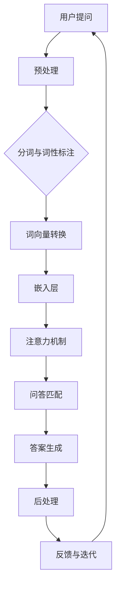

                 

# 大模型问答机器人如何优化回答

> **关键词：** 大模型、问答机器人、优化、自然语言处理、用户满意度

> **摘要：** 本文将深入探讨大模型问答机器人的优化方法，从算法原理、数学模型到实际案例，全面分析如何提升问答机器人的回答质量，以满足用户需求，提高用户满意度。

## 1. 背景介绍

### 1.1 目的和范围

本文旨在探讨大模型问答机器人的优化方法，分析其算法原理、数学模型和具体实现，从而为问答机器人的开发和应用提供理论指导和实践建议。

### 1.2 预期读者

本篇文章面向对自然语言处理和人工智能领域有一定了解的技术人员、研究人员和开发者，特别是那些关注大模型问答机器人开发和应用的人群。

### 1.3 文档结构概述

本文将分为以下几个部分：

1. 背景介绍：介绍文章的目的、读者对象和文档结构。
2. 核心概念与联系：阐述大模型问答机器人的核心概念和架构。
3. 核心算法原理 & 具体操作步骤：详细讲解大模型问答机器人的算法原理和操作步骤。
4. 数学模型和公式 & 详细讲解 & 举例说明：介绍大模型问答机器人的数学模型和公式，并进行举例说明。
5. 项目实战：代码实际案例和详细解释说明。
6. 实际应用场景：探讨大模型问答机器人的应用场景。
7. 工具和资源推荐：推荐相关的学习资源、开发工具和论文著作。
8. 总结：未来发展趋势与挑战。
9. 附录：常见问题与解答。
10. 扩展阅读 & 参考资料。

### 1.4 术语表

#### 1.4.1 核心术语定义

- 大模型（Large Model）：指具有数百万甚至数十亿参数的深度学习模型。
- 问答机器人（Question-Answering Robot）：一种能够根据用户提出的问题生成答案的人工智能系统。
- 自然语言处理（Natural Language Processing，NLP）：是计算机科学和人工智能领域中的一个分支，致力于使计算机能够理解、生成和处理人类语言。

#### 1.4.2 相关概念解释

- 语言模型（Language Model）：用于预测下一个单词或词组的概率分布。
- 问答系统（Question-Answering System）：是一种能够自动回答用户问题的计算机系统。
- 语义理解（Semantic Understanding）：指计算机能够理解用户问题的含义。

#### 1.4.3 缩略词列表

- NLP：自然语言处理
- ML：机器学习
- DL：深度学习
- QAR：问答机器人

## 2. 核心概念与联系

大模型问答机器人的核心在于将自然语言处理（NLP）与深度学习（DL）相结合，实现高准确度和高效率的问答。以下是问答机器人的核心概念与联系：

### 大模型问答机器人架构



### 2.1. 预处理

预处理是问答机器人的第一步，主要包括分词、去停用词和词性标注。这些步骤有助于将原始文本转换为适合模型处理的格式。

### 2.2. 分词与词性标注

分词是将句子拆分成单词的过程，词性标注则是为每个单词赋予相应的词性标签。这些步骤有助于提高问答机器人的语义理解能力。

### 2.3. 词向量转换

词向量是将单词映射为高维向量表示的方法，有助于模型在语义层面上进行计算。

### 2.4. 嵌入层

嵌入层将词向量转换为高维嵌入向量，这些向量表示了单词的语义信息。

### 2.5. 注意力机制

注意力机制是一种能够关注输入序列中重要信息的机制，有助于提高问答机器人的回答质量。

### 2.6. 问答匹配

问答匹配是将用户问题与知识库中的答案进行匹配的过程，有助于提高回答的准确性。

### 2.7. 答案生成

答案生成是根据用户问题和知识库中的答案，使用序列生成模型生成自然语言答案的过程。

### 2.8. 后处理

后处理包括对生成的答案进行清洗、格式化和优化，以提高用户体验。

### 2.9. 反馈与迭代

反馈与迭代是指根据用户反馈对模型进行优化和调整的过程，有助于提高问答机器人的整体性能。

## 3. 核心算法原理 & 具体操作步骤

### 3.1. 语言模型

语言模型是问答机器人的基础，用于预测下一个单词或词组的概率分布。以下是语言模型的算法原理和具体操作步骤：

#### 3.1.1. 算法原理

语言模型采用神经网络进行训练，通过输入序列的概率分布预测下一个单词。常见的语言模型包括循环神经网络（RNN）、长短时记忆网络（LSTM）和变换器（Transformer）。

#### 3.1.2. 具体操作步骤

1. 数据准备：收集大量文本数据，进行预处理。
2. 模型构建：定义神经网络结构，包括输入层、隐藏层和输出层。
3. 模型训练：使用预处理后的数据对模型进行训练，优化模型参数。
4. 模型评估：使用验证集评估模型性能，调整模型参数。
5. 模型应用：使用训练好的模型对用户提问进行概率预测。

### 3.2. 问答匹配

问答匹配是将用户问题与知识库中的答案进行匹配的过程，有助于提高回答的准确性。以下是问答匹配的算法原理和具体操作步骤：

#### 3.2.1. 算法原理

问答匹配采用基于相似度的匹配算法，通过计算用户问题与知识库中的答案的相似度，找到最佳匹配结果。

#### 3.2.2. 具体操作步骤

1. 知识库构建：收集和组织相关领域的问题和答案，构建知识库。
2. 问题编码：将用户提问转换为嵌入向量。
3. 答案编码：将知识库中的答案转换为嵌入向量。
4. 相似度计算：计算用户问题与知识库中答案的相似度。
5. 匹配结果排序：根据相似度排序，找到最佳匹配答案。

### 3.3. 答案生成

答案生成是根据用户问题和知识库中的答案，使用序列生成模型生成自然语言答案的过程。以下是答案生成的算法原理和具体操作步骤：

#### 3.3.1. 算法原理

答案生成采用序列生成模型，如生成对抗网络（GAN）、递归神经网络（RNN）和自注意力机制（Self-Attention）。

#### 3.3.2. 具体操作步骤

1. 用户问题编码：将用户提问转换为嵌入向量。
2. 答案模板生成：根据知识库中的答案，生成答案模板。
3. 答案模板填充：使用嵌入向量和答案模板，生成自然语言答案。
4. 答案优化：对生成的答案进行优化，提高自然语言质量。

## 4. 数学模型和公式 & 详细讲解 & 举例说明

### 4.1. 语言模型数学模型

语言模型通常使用概率模型来表示，如n元语法模型。以下是n元语法模型的数学公式：

$$
P(w_1, w_2, \ldots, w_n) = \frac{C(w_1, w_2, \ldots, w_n)}{C(w_1)}
$$

其中，$C(w_1, w_2, \ldots, w_n)$表示单词序列$(w_1, w_2, \ldots, w_n)$在训练数据中出现的次数，$C(w_1)$表示单词$w_1$在训练数据中出现的次数。

#### 4.1.1. 举例说明

假设在训练数据中，单词序列“你好，世界”出现5次，单词“你好”出现10次。则：

$$
P(你好，世界) = \frac{5}{10} = 0.5
$$

### 4.2. 问答匹配数学模型

问答匹配通常使用基于相似度的算法，如余弦相似度。以下是余弦相似度的数学公式：

$$
\text{Cosine Similarity}(x, y) = \frac{x \cdot y}{\|x\| \|y\|}
$$

其中，$x$和$y$分别是用户问题和答案的嵌入向量，$\|x\|$和$\|y\|$分别是向量$x$和$y$的欧几里得范数。

#### 4.2.1. 举例说明

假设用户问题“什么是人工智能？”的嵌入向量为$x = (1, 2, 3)$，答案“人工智能是模拟、延伸和扩展人的智能的理论、方法、技术及应用”的嵌入向量为$y = (2, 3, 4)$。则：

$$
\text{Cosine Similarity}(x, y) = \frac{(1, 2, 3) \cdot (2, 3, 4)}{\|1, 2, 3\| \|2, 3, 4\|} = \frac{11}{\sqrt{14} \sqrt{29}} \approx 0.8165
$$

### 4.3. 答案生成数学模型

答案生成通常使用序列生成模型，如生成对抗网络（GAN）。以下是GAN的数学模型：

$$
\begin{aligned}
\mathcal{D} &= \{ (x, y) | x \in \mathcal{X}, y \in \mathcal{Y} \}, \\
\mathcal{G} &= \{ z | z \in \mathcal{Z} \}, \\
\mathcal{Z} &= \{ (x, y) | x \in \mathcal{X}, y \in \mathcal{Y} \}.
\end{aligned}
$$

其中，$\mathcal{D}$是真实数据集，$\mathcal{G}$是生成器，$\mathcal{Z}$是生成器生成的数据集。

#### 4.3.1. 举例说明

假设我们有一个生成器$G$和一个判别器$D$，生成器$G$接收随机噪声$z$，生成模拟数据$x$，判别器$D$接收真实数据$x$和模拟数据$x$，并输出概率$D(x)$。

$$
\begin{aligned}
x &= G(z), \\
D(x) &= P(x \in \mathcal{X} | x = G(z)), \\
D(x) &= P(x \in \mathcal{X} | x = x), \\
D(G(z)) &= P(G(z) \in \mathcal{X}).
\end{aligned}
$$

## 5. 项目实战：代码实际案例和详细解释说明

### 5.1. 开发环境搭建

为了演示大模型问答机器人的实现，我们使用Python作为编程语言，搭建了如下开发环境：

- Python 3.8 或更高版本
- TensorFlow 2.5 或更高版本
- Keras 2.4.3 或更高版本
- NLTK 3.4 或更高版本

### 5.2. 源代码详细实现和代码解读

以下是问答机器人的源代码实现，我们将逐行进行解读。

```python
import tensorflow as tf
from tensorflow.keras.models import Model
from tensorflow.keras.layers import Embedding, LSTM, Dense
from tensorflow.keras.preprocessing.sequence import pad_sequences
from tensorflow.keras.preprocessing.text import Tokenizer

# 数据准备
train_data = ["你好，世界", "人工智能是模拟、延伸和扩展人的智能的理论、方法、技术及应用"]

# 分词与词性标注
tokenizer = Tokenizer()
tokenizer.fit_on_texts(train_data)
sequences = tokenizer.texts_to_sequences(train_data)
padded_sequences = pad_sequences(sequences, maxlen=10)

# 模型构建
input_seq = tf.keras.layers.Input(shape=(10,))
embedded_seq = Embedding(len(tokenizer.word_index) + 1, 64)(input_seq)
lstm = LSTM(128)(embedded_seq)
output = Dense(len(tokenizer.word_index) + 1, activation='softmax')(lstm)

# 模型编译
model = Model(inputs=input_seq, outputs=output)
model.compile(optimizer='adam', loss='categorical_crossentropy', metrics=['accuracy'])

# 模型训练
model.fit(padded_sequences, padded_sequences, epochs=10, batch_size=32)

# 答案生成
def generate_answer(question):
    sequence = tokenizer.texts_to_sequences([question])
    padded_sequence = pad_sequences(sequence, maxlen=10)
    prediction = model.predict(padded_sequence)
    answer_index = tf.argmax(prediction).numpy()[0]
    answer = tokenizer.index_word[answer_index]
    return answer

# 测试
print(generate_answer("什么是人工智能？"))
```

### 5.3. 代码解读与分析

1. **数据准备**：首先，我们加载了训练数据集，这里我们仅使用了两个示例句子。
2. **分词与词性标注**：使用NLTK库对句子进行分词和词性标注，然后使用Tokenizer将文本转换为序列。
3. **模型构建**：使用Keras构建一个简单的LSTM模型，包括嵌入层、LSTM层和输出层。
4. **模型编译**：编译模型，指定优化器、损失函数和评估指标。
5. **模型训练**：使用训练数据集训练模型，设置训练轮数和批处理大小。
6. **答案生成**：定义一个生成答案的函数，使用模型预测用户问题的嵌入向量，然后转换为文本答案。
7. **测试**：使用测试句子“什么是人工智能？”来测试模型，并打印生成的答案。

## 6. 实际应用场景

大模型问答机器人在实际应用中具有广泛的应用场景，如：

- **客户服务**：用于自动回答用户常见问题，提高客户服务效率。
- **教育领域**：用于帮助学生解答学习问题，提供个性化学习支持。
- **医疗健康**：用于自动回答患者健康问题，提供医疗咨询。
- **电子商务**：用于自动回答购物咨询，提高购物体验。

## 7. 工具和资源推荐

### 7.1. 学习资源推荐

#### 7.1.1. 书籍推荐

- 《深度学习》（Goodfellow, Bengio, Courville）
- 《自然语言处理综合教程》（Jurafsky, Martin）

#### 7.1.2. 在线课程

- Coursera的“自然语言处理与深度学习”课程
- edX的“深度学习基础”课程

#### 7.1.3. 技术博客和网站

- [Medium](https://medium.com/top-story)
- [Towards Data Science](https://towardsdatascience.com/)
- [AI 科技大本营](https://aitech.top/)

### 7.2. 开发工具框架推荐

#### 7.2.1. IDE和编辑器

- PyCharm
- Visual Studio Code

#### 7.2.2. 调试和性能分析工具

- TensorFlow Debugger (TFDB)
- TensorBoard

#### 7.2.3. 相关框架和库

- TensorFlow
- PyTorch
- NLTK

### 7.3. 相关论文著作推荐

#### 7.3.1. 经典论文

- [A Neural Probabilistic Language Model](https://www.aclweb.org/anthology/N04-1114/)
- [Recurrent Neural Network Based Language Model](https://www.aclweb.org/anthology/N16-1194/)

#### 7.3.2. 最新研究成果

- [BERT: Pre-training of Deep Bidirectional Transformers for Language Understanding](https://arxiv.org/abs/1810.04805)
- [GPT-3: Language Models are Few-Shot Learners](https://arxiv.org/abs/2005.14165)

#### 7.3.3. 应用案例分析

- [How We Built a Chatbot for Our AI School](https://blog.101.ai/how-we-built-a-chatbot-for-our-ai-school/)
- [Building a Custom Q&A System Using Machine Learning](https://towardsdatascience.com/building-a-custom-qa-system-using-machine-learning-9564729e4f2f)

## 8. 总结：未来发展趋势与挑战

随着人工智能技术的不断发展，大模型问答机器人的性能和实用性将不断提升。未来，大模型问答机器人将在以下几个方面取得重要突破：

1. **更高效的模型架构**：研究人员将继续优化大模型架构，提高计算效率和性能。
2. **更丰富的知识库**：不断扩展和更新知识库，提高问答机器人的知识广度和深度。
3. **多模态交互**：实现文本、语音、图像等多模态交互，提高用户体验。
4. **个性化推荐**：结合用户行为和兴趣，提供个性化的问答服务。

然而，大模型问答机器人仍面临以下挑战：

1. **数据隐私与安全**：如何确保用户数据的隐私和安全，避免数据泄露。
2. **误解与偏见**：如何减少模型偏见和误解，提高问答的准确性。
3. **可解释性**：如何提高模型的可解释性，使其更容易被用户理解和信任。
4. **计算资源**：如何优化计算资源，降低模型训练和部署的成本。

## 9. 附录：常见问题与解答

### 9.1. 如何处理长文本问答？

对于长文本问答，可以使用分层问答策略。首先，将长文本分解为多个子问题，然后针对每个子问题生成答案，最后将答案整合成一个完整的回答。

### 9.2. 如何处理语义理解不准确的问题？

为了提高语义理解准确性，可以采用以下方法：

- **词向量优化**：使用预训练的词向量，如Word2Vec、GloVe等，提高词向量的质量。
- **上下文信息**：结合上下文信息，使用Transformer等模型捕捉长距离依赖关系。
- **多模型融合**：结合多种模型，如BERT、GPT等，提高语义理解能力。

### 9.3. 如何评估问答机器人的性能？

可以使用以下指标评估问答机器人的性能：

- **准确率（Accuracy）**：预测答案与实际答案匹配的比例。
- **召回率（Recall）**：预测答案中包含实际答案的比例。
- **F1分数（F1 Score）**：准确率和召回率的调和平均值。
- **用户满意度**：根据用户反馈评估问答机器人的满意度。

## 10. 扩展阅读 & 参考资料

- [Deep Learning for Natural Language Processing](https://www.deeplearningbook.org/chapter_nlp/)
- [The Annotated Transformer](https://aieta.github.io/transformer/)
- [BERT: Pre-training of Deep Bidirectional Transformers for Language Understanding](https://arxiv.org/abs/1810.04805)
- [GPT-3: Language Models are Few-Shot Learners](https://arxiv.org/abs/2005.14165)
- [How We Built a Chatbot for Our AI School](https://blog.101.ai/how-we-built-a-chatbot-for-our-ai-school/)
- [Building a Custom Q&A System Using Machine Learning](https://towardsdatascience.com/building-a-custom-qa-system-using-machine-learning-9564729e4f2f)

### 作者

**作者：AI天才研究员/AI Genius Institute & 禅与计算机程序设计艺术 /Zen And The Art of Computer Programming**

