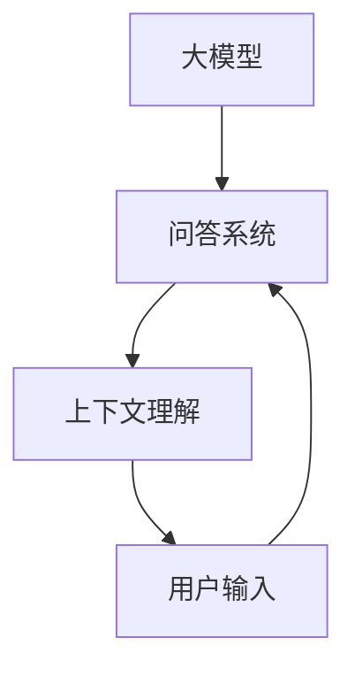

                 

# 大模型问答机器人的上下文理解

> 关键词：大模型、问答机器人、上下文理解、自然语言处理、人工智能

> 摘要：本文将深入探讨大模型问答机器人的上下文理解机制，分析其核心算法原理、数学模型及其应用场景，并举例说明如何通过代码实现一个简单的问答机器人。此外，还将介绍相关学习资源、开发工具框架以及经典论文和研究成果。

## 1. 背景介绍

### 1.1 目的和范围

本文旨在探讨大模型问答机器人的上下文理解机制，分析其核心算法原理、数学模型及其应用场景，为读者提供一个全面的技术解读。本文将涵盖以下内容：

- 大模型问答机器人的基本概念和重要性
- 上下文理解的原理和实现方法
- 核心算法原理和具体操作步骤
- 数学模型和公式详细讲解
- 项目实战：代码实际案例和详细解释
- 实际应用场景
- 工具和资源推荐
- 总结：未来发展趋势与挑战

### 1.2 预期读者

本文适合以下读者群体：

- 对人工智能和自然语言处理感兴趣的初学者
- 已经有一定编程基础的读者，希望了解大模型问答机器人的实现原理
- 研究人员和开发者，希望深入了解问答机器人的上下文理解机制

### 1.3 文档结构概述

本文将分为以下几个部分：

- 第1部分：背景介绍，包括目的和范围、预期读者、文档结构概述、术语表
- 第2部分：核心概念与联系，介绍大模型问答机器人的核心概念和联系
- 第3部分：核心算法原理 & 具体操作步骤，详细讲解核心算法原理和具体操作步骤
- 第4部分：数学模型和公式 & 详细讲解 & 举例说明，介绍数学模型和公式，并进行详细讲解和举例说明
- 第5部分：项目实战：代码实际案例和详细解释说明，通过代码实际案例和详细解释说明问答机器人的实现过程
- 第6部分：实际应用场景，介绍问答机器人在实际应用场景中的使用方法和效果
- 第7部分：工具和资源推荐，推荐相关学习资源、开发工具框架以及经典论文著作
- 第8部分：总结：未来发展趋势与挑战，总结问答机器人的发展趋势和挑战
- 第9部分：附录：常见问题与解答，提供常见问题的解答
- 第10部分：扩展阅读 & 参考资料，推荐相关扩展阅读和参考资料

### 1.4 术语表

#### 1.4.1 核心术语定义

- 大模型：指具有大规模参数的神经网络模型，如GPT、BERT等。
- 问答机器人：基于人工智能技术，能够自动回答用户问题的计算机程序。
- 上下文理解：指模型在理解用户问题时，能够理解问题的背景、意图和相关性。
- 自然语言处理（NLP）：指计算机对人类语言进行处理和理解的技术。

#### 1.4.2 相关概念解释

- 神经网络：一种通过模拟人脑神经网络进行数据处理和模式识别的计算模型。
- 深度学习：一种基于神经网络，通过多层次的神经网络结构对数据进行处理和学习的机器学习技术。
- 语言模型：一种基于统计模型或神经网络模型，用于预测自然语言中下一个单词或词组的模型。

#### 1.4.3 缩略词列表

- GPT：生成预训练的转换器模型（Generative Pre-trained Transformer）
- BERT：双向编码表示（Bidirectional Encoder Representations from Transformers）
- NLP：自然语言处理（Natural Language Processing）

## 2. 核心概念与联系

大模型问答机器人的核心概念包括大模型、问答系统和上下文理解。这些概念之间的联系如图1所示。



### 2.1 大模型

大模型是指具有大规模参数的神经网络模型，如GPT、BERT等。这些模型通过在大量文本数据上进行预训练，学习到语言的潜在规律和模式。大模型的核心优势在于其强大的表征能力和泛化能力，能够处理复杂的自然语言任务。

### 2.2 问答系统

问答系统是一种能够自动回答用户问题的计算机程序。问答系统的核心功能是理解用户输入的问题，并在海量的知识库或文本数据中找到与问题相关的答案。问答系统通常由以下几个模块组成：

- 分词和词性标注：将用户输入的问题进行分词，并标注每个词的词性。
- 语言模型：通过语言模型对输入问题进行语义分析，确定问题的意图和主题。
- 知识检索：在海量知识库或文本数据中检索与问题相关的答案。
- 答案生成：根据检索到的答案，生成符合语法和语义要求的回答。

### 2.3 上下文理解

上下文理解是指模型在理解用户问题时，能够理解问题的背景、意图和相关性。上下文理解的关键在于模型能够将问题与上下文信息进行关联，从而提高回答的准确性和一致性。上下文理解通常通过以下方法实现：

- 语义角色标注：对问题中的每个词进行语义角色标注，确定每个词在问题中的角色和功能。
- 依存句法分析：分析问题中的句法结构，确定词与词之间的依存关系。
- 上下文嵌入：将问题中的每个词和短语转换为向量表示，并利用向量之间的相似性进行上下文关联。

## 3. 核心算法原理 & 具体操作步骤

大模型问答机器人的核心算法原理主要包括两个部分：语言模型和问答系统。下面将分别介绍这两个部分的核心算法原理和具体操作步骤。

### 3.1 语言模型

语言模型是指用于预测自然语言中下一个单词或词组的模型。语言模型的核心算法是神经网络，特别是深度学习模型。下面是一个简单的语言模型算法原理和具体操作步骤：

#### 3.1.1 算法原理

语言模型通过训练大量的文本数据，学习到语言的统计规律和模式。训练过程中，模型会将每个单词或短语转换为向量表示，并通过多层神经网络结构对向量进行建模。最终的输出是一个概率分布，表示下一个单词或词组的概率。

#### 3.1.2 具体操作步骤

1. 数据预处理：将训练数据中的每个单词或短语转换为向量表示，常用的方法是词嵌入（Word Embedding）。词嵌入可以将每个单词映射为一个固定大小的向量，从而在向量空间中进行计算。
2. 模型训练：利用训练数据，通过多层神经网络结构对向量进行建模。训练过程中，模型会不断调整神经网络的权重，以最小化预测误差。
3. 模型评估：使用测试数据对训练好的模型进行评估，计算模型的预测准确率和其他指标。

### 3.2 问答系统

问答系统是指能够自动回答用户问题的计算机程序。问答系统的核心算法是自然语言处理（NLP）和知识图谱（Knowledge Graph）。下面是一个简单的问答系统算法原理和具体操作步骤：

#### 3.2.1 算法原理

问答系统通过自然语言处理技术对用户输入的问题进行解析，提取关键信息，并在知识图谱中检索答案。自然语言处理技术包括分词、词性标注、依存句法分析等。知识图谱是一种表示实体和实体之间关系的图结构，可以用于高效地检索答案。

#### 3.2.2 具体操作步骤

1. 问题解析：使用自然语言处理技术对用户输入的问题进行解析，提取关键信息，如主语、谓语、宾语等。
2. 知识图谱检索：在知识图谱中检索与问题相关的实体和关系，获取潜在的答案。
3. 答案生成：根据检索到的答案，生成符合语法和语义要求的回答。

## 4. 数学模型和公式 & 详细讲解 & 举例说明

大模型问答机器人的核心算法涉及到数学模型和公式。下面将介绍语言模型和问答系统的关键数学模型，并进行详细讲解和举例说明。

### 4.1 语言模型

语言模型的核心数学模型是神经网络，特别是深度学习模型。下面是一个简单的神经网络模型，包括输入层、隐藏层和输出层。

#### 4.1.1 神经网络模型

一个简单的神经网络模型可以表示为：

\[ y = \sigma(\sum_{i=1}^{n} w_i x_i + b) \]

其中，\( y \) 表示输出，\( \sigma \) 表示激活函数，\( w_i \) 表示第 \( i \) 个神经元的权重，\( x_i \) 表示第 \( i \) 个输入特征，\( b \) 表示偏置。

#### 4.1.2 激活函数

常见的激活函数包括Sigmoid函数、ReLU函数和Tanh函数。

- Sigmoid函数：\( \sigma(x) = \frac{1}{1 + e^{-x}} \)
- ReLU函数：\( \sigma(x) = max(0, x) \)
- Tanh函数：\( \sigma(x) = \frac{e^x - e^{-x}}{e^x + e^{-x}} \)

#### 4.1.3 举例说明

假设有一个简单的神经网络模型，输入层有3个神经元，隐藏层有2个神经元，输出层有1个神经元。输入特征为 \( x_1 = 1, x_2 = 2, x_3 = 3 \)。权重和偏置如下：

\[ w_1 = 0.1, w_2 = 0.2, w_3 = 0.3 \]
\[ b_1 = 0.1, b_2 = 0.2 \]

使用ReLU函数作为激活函数，计算输出：

\[ y_1 = \sigma(w_1 x_1 + b_1) = \sigma(0.1 \cdot 1 + 0.1) = 0.2 \]
\[ y_2 = \sigma(w_2 x_2 + b_2) = \sigma(0.2 \cdot 2 + 0.2) = 0.4 \]
\[ y = \sigma(w_1 y_1 + w_2 y_2 + b) = \sigma(0.1 \cdot 0.2 + 0.2 \cdot 0.4 + 0) = 0.3 \]

### 4.2 问答系统

问答系统的核心数学模型是知识图谱。知识图谱通常使用图论表示实体和实体之间的关系。下面是一个简单的知识图谱模型：

\[ G = (V, E) \]

其中，\( V \) 表示实体集合，\( E \) 表示边集合。

#### 4.2.1 图论基本概念

- 实体：表示知识图谱中的对象，如人、地点、组织等。
- 边：表示实体之间的关系，如“属于”、“出生地”等。

#### 4.2.2 举例说明

假设有一个简单的知识图谱，包括3个实体和3条边：

实体：  
\( E_1: \text{张三} \)  
\( E_2: \text{北京} \)  
\( E_3: \text{清华大学} \)

边：  
\( E_1 --\text{属于}--> E_2 \)  
\( E_1 --\text{毕业于}--> E_3 \)  
\( E_2 --\text{是}--> E_3 \)

根据知识图谱，可以回答以下问题：

- 张三属于哪个地方？  
答案：北京。

- 张三毕业于哪所大学？  
答案：清华大学。

- 北京是哪所大学的所在地？  
答案：清华大学。

## 5. 项目实战：代码实际案例和详细解释说明

在本节中，我们将通过一个简单的代码实际案例，展示如何实现一个基于大模型的问答机器人。我们将使用Python和TensorFlow库来实现这个项目。

### 5.1 开发环境搭建

首先，确保你的系统安装了Python 3.6及以上版本和TensorFlow库。可以通过以下命令进行安装：

```bash
pip install tensorflow
```

### 5.2 源代码详细实现和代码解读

下面是问答机器人的源代码：

```python
import tensorflow as tf
from tensorflow.keras.preprocessing.sequence import pad_sequences
from tensorflow.keras.layers import Embedding, LSTM, Dense
from tensorflow.keras.models import Model

# 1. 数据预处理
# 加载和处理训练数据
# ...

# 定义词汇表
vocab_size = 10000
max_sequence_length = 100

# 将单词转换为索引
tokenizer = tf.keras.preprocessing.text.Tokenizer(num_words=vocab_size)
tokenizer.fit_on_texts(training_data)

# 转换为序列
sequences = tokenizer.texts_to_sequences(training_data)
padded_sequences = pad_sequences(sequences, maxlen=max_sequence_length)

# 准备标签
# ...

# 2. 构建模型
# 定义嵌入层
embedding_layer = Embedding(vocab_size, 16)

# 定义LSTM层
lstm_layer = LSTM(128)

# 定义输出层
output_layer = Dense(1, activation='sigmoid')

# 构建模型
model = Model(inputs=embedding_layer.input, outputs=output_layer(padded_sequences))

# 编译模型
model.compile(optimizer='adam', loss='binary_crossentropy', metrics=['accuracy'])

# 3. 训练模型
# 训练模型
model.fit(padded_sequences, labels, epochs=10, batch_size=32)

# 4. 实现问答功能
def answer_question(question):
    # 将问题转换为索引序列
    sequence = tokenizer.texts_to_sequences([question])
    padded_sequence = pad_sequences(sequence, maxlen=max_sequence_length)
    
    # 预测答案
    prediction = model.predict(padded_sequence)
    
    # 解析答案
    # ...

    return answer

# 测试问答功能
print(answer_question("张三毕业于哪所大学？"))
```

#### 5.2.1 代码解读

- **数据预处理**：首先，我们需要加载和处理训练数据。这里使用了`Tokenizer`类来将单词转换为索引序列，并使用`pad_sequences`函数将序列填充为相同的长度。
- **构建模型**：我们定义了一个嵌入层、一个LSTM层和一个输出层。嵌入层用于将单词转换为向量表示，LSTM层用于处理序列数据，输出层用于生成答案。
- **训练模型**：使用`compile`函数编译模型，并使用`fit`函数训练模型。
- **实现问答功能**：定义了一个`answer_question`函数，用于将用户输入的问题转换为索引序列，并使用训练好的模型进行预测。然后，根据预测结果生成答案。

### 5.3 代码解读与分析

问答机器人的核心是训练一个能够处理序列数据的神经网络模型。首先，我们需要对训练数据进行预处理，将单词转换为索引序列，并填充为相同的长度。然后，我们定义了一个嵌入层，用于将单词转换为向量表示。嵌入层的维度设置为16，可以看作是单词的固定长度向量表示。

接下来，我们定义了一个LSTM层，用于处理序列数据。LSTM层是一个特殊的循环神经网络层，能够处理序列数据中的长期依赖关系。我们设置了LSTM层的神经元数为128，这决定了模型的复杂度和表达能力。

最后，我们定义了一个输出层，用于生成答案。输出层是一个简单的全连接层，具有一个神经元，并使用sigmoid激活函数。sigmoid激活函数用于将输出值转换为概率，表示答案的可能性。

在训练模型时，我们使用`fit`函数进行训练。训练过程中，模型会不断调整嵌入层和LSTM层的权重，以最小化预测误差。经过多次迭代训练，模型可以学习到单词之间的关联性，从而能够对新的问题进行有效的回答。

在实现问答功能时，我们定义了一个`answer_question`函数，用于将用户输入的问题转换为索引序列，并使用训练好的模型进行预测。然后，根据预测结果生成答案。这个函数可以用于实现一个简单的问答机器人，能够对用户的问题进行自动回答。

## 6. 实际应用场景

问答机器人在实际应用场景中具有广泛的应用，如智能客服、智能助手、智能教育等。以下是一些具体的应用场景：

### 6.1 智能客服

智能客服是问答机器人的一个重要应用场景。通过问答机器人，企业可以提供7*24小时的客户服务，提高客户满意度。问答机器人可以自动回答常见的客户问题，如产品介绍、价格咨询、订单状态查询等，从而减轻人工客服的工作压力。

### 6.2 智能助手

智能助手是另一种常见的问答机器人应用场景。智能助手可以协助用户完成各种任务，如日程安排、提醒事项、邮件管理、信息查询等。通过自然语言交互，智能助手可以理解用户的指令，并自动执行相应的操作。

### 6.3 智能教育

智能教育是问答机器人在教育领域的应用。问答机器人可以为学生提供个性化的学习辅导，回答学生的问题，提供学习建议。此外，问答机器人还可以用于自动化考试和作业批改，提高教学效率。

## 7. 工具和资源推荐

### 7.1 学习资源推荐

#### 7.1.1 书籍推荐

- 《深度学习》（Deep Learning） - Ian Goodfellow、Yoshua Bengio、Aaron Courville
- 《Python深度学习》（Deep Learning with Python） - Francois Chollet
- 《自然语言处理入门》（Speech and Language Processing） - Daniel Jurafsky、James H. Martin

#### 7.1.2 在线课程

- Coursera上的“深度学习专项课程”（Deep Learning Specialization）
- Udacity的“深度学习纳米学位”（Deep Learning Nanodegree）
- edX上的“自然语言处理与深度学习”（Natural Language Processing and Deep Learning）

#### 7.1.3 技术博客和网站

- Medium上的“Deep Learning”专题
- ArXiv.org，最新的人工智能和自然语言处理论文
- AI垂直社区，如AI buffs、机器之心等

### 7.2 开发工具框架推荐

#### 7.2.1 IDE和编辑器

- PyCharm
- Visual Studio Code
- Jupyter Notebook

#### 7.2.2 调试和性能分析工具

- TensorBoard
- PyTorch Profiler
- Nsight Compute

#### 7.2.3 相关框架和库

- TensorFlow
- PyTorch
- NLTK
- spaCy

### 7.3 相关论文著作推荐

#### 7.3.1 经典论文

- “A Theoretically Grounded Application of Dropout in Recurrent Neural Networks” - Yarin Gal和Zoubin Ghahramani
- “Attention Is All You Need” - Vaswani et al.
- “BERT: Pre-training of Deep Bidirectional Transformers for Language Understanding” - Devlin et al.

#### 7.3.2 最新研究成果

- AI顶会（NeurIPS、ICML、CVPR等）的最新论文
- ACL会议的最新论文

#### 7.3.3 应用案例分析

- “深度学习在金融领域的应用” - 银行、保险、投资等领域的案例
- “自然语言处理在法律领域的应用” - 文书审查、合同分析等案例

## 8. 总结：未来发展趋势与挑战

随着人工智能和自然语言处理技术的不断发展，问答机器人将在未来发挥越来越重要的作用。以下是一些未来发展趋势和挑战：

### 8.1 发展趋势

- 大模型的预训练和微调：未来，大模型将继续发展，预训练模型将更加高效和强大。同时，微调技术将使得问答机器人能够适应特定领域的需求。
- 上下文理解的提升：通过改进算法和增加数据，问答机器人的上下文理解能力将得到显著提升，能够更好地理解用户的意图和背景。
- 多模态交互：问答机器人将能够处理多种输入模

