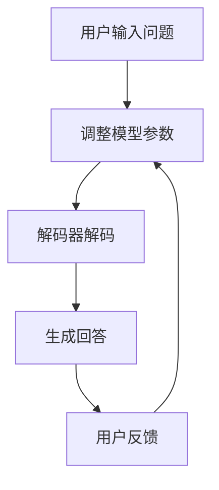
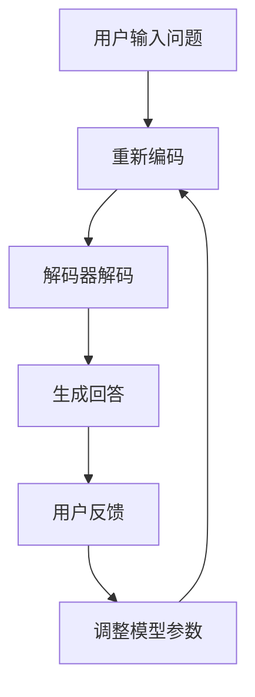

                 

# 大模型问答机器人的对话式交互

> 关键词：大模型、问答机器人、对话式交互、自然语言处理、机器学习、深度学习

> 摘要：本文旨在深入探讨大模型问答机器人的对话式交互技术，分析其核心原理、算法模型、数学公式，并给出实际案例，最终展望其未来发展趋势与挑战。

## 1. 背景介绍

### 1.1 目的和范围

本文的目标是解析大模型问答机器人的对话式交互技术，旨在帮助读者理解其基础原理、技术架构和实现方法。我们将重点关注以下几个方面：

- 大模型问答机器人的定义与工作原理
- 自然语言处理（NLP）在对话式交互中的应用
- 对话式交互的算法模型及实现步骤
- 数学模型和公式在对话式交互中的重要性
- 实际案例分析与项目实战
- 工具和资源推荐

### 1.2 预期读者

本文适用于以下读者群体：

- 计算机科学、人工智能等相关专业的本科生、研究生和博士生
- 软件工程师、AI开发者和研究人员
- 对大模型问答机器人对话式交互技术感兴趣的IT从业人员和爱好者
- 想要深入了解自然语言处理和深度学习技术的广大技术爱好者

### 1.3 文档结构概述

本文分为以下几个部分：

1. 背景介绍
2. 核心概念与联系
3. 核心算法原理 & 具体操作步骤
4. 数学模型和公式 & 详细讲解 & 举例说明
5. 项目实战：代码实际案例和详细解释说明
6. 实际应用场景
7. 工具和资源推荐
8. 总结：未来发展趋势与挑战
9. 附录：常见问题与解答
10. 扩展阅读 & 参考资料

### 1.4 术语表

#### 1.4.1 核心术语定义

- 大模型（Big Model）：具有大规模参数、能够在各种任务上表现优秀的深度学习模型。
- 对话式交互（Dialogue Interaction）：用户与系统之间通过自然语言进行的交互过程。
- 自然语言处理（NLP）：研究如何让计算机理解、生成和处理自然语言的技术。
- 机器学习（ML）：使计算机从数据中学习并做出决策或预测的技术。
- 深度学习（DL）：一种基于多层神经网络进行学习的方法。

#### 1.4.2 相关概念解释

- 问答系统（Question Answering System）：能够根据用户的问题提供准确答案的系统。
- 序列到序列模型（Seq2Seq Model）：一种用于将序列映射到序列的深度学习模型。
- 编码器（Encoder）：将输入序列编码为固定大小的向量。
- 解码器（Decoder）：将编码后的向量解码为输出序列。

#### 1.4.3 缩略词列表

- NLP：自然语言处理
- ML：机器学习
- DL：深度学习
- RNN：循环神经网络
- LSTM：长短期记忆网络
- Transformer：Transformer模型
- BERT：BERT模型

## 2. 核心概念与联系

为了更好地理解大模型问答机器人的对话式交互，我们需要探讨以下几个核心概念和它们之间的关系。

### 2.1 大模型问答机器人的定义

大模型问答机器人是指基于深度学习技术，具有大规模参数和优秀性能的问答系统。它可以处理各种类型的问题，从简单的查询到复杂的推理任务，为用户提供准确、实用的答案。

### 2.2 自然语言处理（NLP）

NLP是使计算机理解和生成自然语言的技术。在大模型问答机器人中，NLP技术用于解析用户的问题、生成回答以及优化对话过程。

### 2.3 机器学习（ML）和深度学习（DL）

ML和DL是使计算机从数据中学习的技术。在大模型问答机器人中，ML和DL技术用于训练模型、优化参数以及提高问答系统的性能。

### 2.4 序列到序列模型（Seq2Seq Model）

Seq2Seq模型是一种用于将序列映射到序列的深度学习模型。在大模型问答机器人中，Seq2Seq模型用于将用户的问题映射到答案。

### 2.5 编码器（Encoder）和解码器（Decoder）

编码器用于将输入序列编码为固定大小的向量，而解码器用于将编码后的向量解码为输出序列。在大模型问答机器人中，编码器和解码器共同工作，将用户的问题映射到答案。

### 2.6 Mermaid 流程图

以下是一个简化的Mermaid流程图，展示了大模型问答机器人的对话式交互流程：



## 3. 核心算法原理 & 具体操作步骤

### 3.1 序列到序列模型（Seq2Seq Model）

序列到序列模型是一种将输入序列映射到输出序列的深度学习模型。在大模型问答机器人中，Seq2Seq模型用于将用户的问题映射到答案。以下是Seq2Seq模型的核心组成部分：

- **编码器（Encoder）**：将输入序列编码为固定大小的向量。
- **解码器（Decoder）**：将编码后的向量解码为输出序列。

### 3.2 具体操作步骤

以下是一个简单的Seq2Seq模型的操作步骤：

```markdown
1. 用户输入问题。
2. 编码器将输入序列编码为固定大小的向量。
3. 解码器将编码后的向量解码为输出序列。
4. 生成回答。
5. 用户反馈。
6. 调整模型参数。
```

### 3.3 伪代码

以下是一个简单的Seq2Seq模型的伪代码：

```python
# 编码器
def encoder(input_sequence):
    # 编码输入序列
    encoded_sequence = ...
    return encoded_sequence

# 解码器
def decoder(encoded_sequence):
    # 解码编码后的序列
    output_sequence = ...
    return output_sequence

# Seq2Seq模型
def seq2seq_model(input_sequence, target_sequence):
    # 编码输入序列
    encoded_sequence = encoder(input_sequence)
    # 解码编码后的序列
    output_sequence = decoder(encoded_sequence)
    # 生成回答
    answer = generate_answer(output_sequence)
    return answer
```

### 3.4 Mermaid 流程图

以下是一个详细的Mermaid流程图，展示了Seq2Seq模型的具体操作步骤：



## 4. 数学模型和公式 & 详细讲解 & 举例说明

### 4.1 数学模型

在大模型问答机器人的对话式交互中，我们使用了一些关键的数学模型和公式。以下是几个核心模型和公式的详细讲解。

#### 4.1.1 深度学习模型

深度学习模型通常由多层神经网络组成，每一层都接受前一层的信息并对其进行处理。以下是深度学习模型的基本组成部分：

- **激活函数（Activation Function）**：用于对神经网络中的节点进行非线性变换。
- **损失函数（Loss Function）**：用于衡量模型预测值与真实值之间的差距。

#### 4.1.2 序列到序列模型（Seq2Seq Model）

序列到序列模型由编码器和解码器组成。以下是这两个模型的关键组成部分：

- **编码器（Encoder）**：将输入序列编码为固定大小的向量。
- **解码器（Decoder）**：将编码后的向量解码为输出序列。

### 4.2 公式讲解

以下是一些关键的数学公式和它们的解释：

#### 4.2.1 激活函数（Activation Function）

激活函数是神经网络中的一个关键组成部分，它用于对神经网络中的节点进行非线性变换。以下是一些常见的激活函数：

- **Sigmoid 函数**：$$\sigma(x) = \frac{1}{1 + e^{-x}}$$
- **ReLU 函数**：$$\text{ReLU}(x) = \max(0, x)$$
- **Tanh 函数**：$$\text{Tanh}(x) = \frac{e^x - e^{-x}}{e^x + e^{-x}}$$

#### 4.2.2 损失函数（Loss Function）

损失函数用于衡量模型预测值与真实值之间的差距。以下是一些常见的损失函数：

- **均方误差（MSE）**：$$\text{MSE}(y, \hat{y}) = \frac{1}{m}\sum_{i=1}^{m}(y_i - \hat{y}_i)^2$$
- **交叉熵（Cross-Entropy）**：$$\text{CE}(y, \hat{y}) = -\sum_{i=1}^{m}y_i\log(\hat{y}_i)$$

#### 4.2.3 序列到序列模型（Seq2Seq Model）

序列到序列模型由编码器和解码器组成。以下是这两个模型的关键组成部分：

- **编码器（Encoder）**：将输入序列编码为固定大小的向量。通常使用卷积神经网络（CNN）或循环神经网络（RNN）来实现。
- **解码器（Decoder）**：将编码后的向量解码为输出序列。通常使用RNN或Transformer模型来实现。

### 4.3 举例说明

#### 4.3.1 激活函数

假设我们有一个输入值 $x = 3$，我们可以使用以下激活函数计算输出值：

- **Sigmoid 函数**：$$\sigma(3) = \frac{1}{1 + e^{-3}} \approx 0.95165$$
- **ReLU 函数**：$$\text{ReLU}(3) = \max(0, 3) = 3$$
- **Tanh 函数**：$$\text{Tanh}(3) = \frac{e^3 - e^{-3}}{e^3 + e^{-3}} \approx 0.96593$$

#### 4.3.2 损失函数

假设我们有一个真实值 $y = 5$ 和模型预测值 $\hat{y} = 4$，我们可以使用以下损失函数计算损失：

- **均方误差（MSE）**：$$\text{MSE}(5, 4) = \frac{1}{1}\sum_{i=1}^{1}(5 - 4)^2 = 1$$
- **交叉熵（Cross-Entropy）**：$$\text{CE}(5, 4) = -5\log(4) \approx -2.99573$$

## 5. 项目实战：代码实际案例和详细解释说明

### 5.1 开发环境搭建

在开始项目实战之前，我们需要搭建一个合适的开发环境。以下是搭建环境的步骤：

1. 安装Python 3.8或更高版本。
2. 安装TensorFlow 2.x或更高版本。
3. 安装必要的Python库，如Numpy、Pandas、Matplotlib等。

### 5.2 源代码详细实现和代码解读

以下是一个简单的大模型问答机器人项目的代码实现。我们将逐步解析代码中的各个部分。

```python
import tensorflow as tf
from tensorflow.keras.layers import Embedding, LSTM, Dense
from tensorflow.keras.models import Model

# 参数设置
vocab_size = 10000
embed_dim = 256
lstm_units = 128
max_seq_length = 50

# 构建编码器
inputs = tf.keras.layers.Input(shape=(max_seq_length,))
embedding = Embedding(vocab_size, embed_dim)(inputs)
lstm = LSTM(lstm_units, return_sequences=True)(embedding)
encoded_sequence = LSTM(lstm_units, return_sequences=False)(lstm)

# 构建解码器
decoder_inputs = tf.keras.layers.Input(shape=(max_seq_length,))
decoder_embedding = Embedding(vocab_size, embed_dim)(decoder_inputs)
decoder_lstm = LSTM(lstm_units, return_sequences=True)(decoder_embedding)
decoder_dense = Dense(vocab_size, activation='softmax')
decoder_outputs = decoder_dense(decoder_lstm)

# 构建模型
model = Model([inputs, decoder_inputs], decoder_outputs)

# 编译模型
model.compile(optimizer='rmsprop', loss='categorical_crossentropy', metrics=['accuracy'])

# 打印模型结构
model.summary()
```

#### 5.2.1 代码解读

- **参数设置**：设置词汇表大小、嵌入维度、LSTM单元数量和最大序列长度。
- **构建编码器**：输入层通过嵌入层转换为嵌入向量，然后通过两个LSTM层进行编码。
- **构建解码器**：输入层通过嵌入层转换为嵌入向量，然后通过一个LSTM层和一个全连接层进行解码。
- **构建模型**：将编码器的输出和解码器的输出连接在一起，构成完整的模型。
- **编译模型**：设置优化器和损失函数，编译模型。

### 5.3 代码解读与分析

以下是对代码的逐行解读和分析：

```python
# 参数设置
vocab_size = 10000  # 词汇表大小
embed_dim = 256  # 嵌入维度
lstm_units = 128  # LSTM单元数量
max_seq_length = 50  # 最大序列长度

# 构建编码器
inputs = tf.keras.layers.Input(shape=(max_seq_length,))  # 输入层
embedding = Embedding(vocab_size, embed_dim)(inputs)  # 嵌入层
lstm = LSTM(lstm_units, return_sequences=True)(embedding)  # 第一个LSTM层
encoded_sequence = LSTM(lstm_units, return_sequences=False)(lstm)  # 第二个LSTM层

# 构建解码器
decoder_inputs = tf.keras.layers.Input(shape=(max_seq_length,))  # 输入层
decoder_embedding = Embedding(vocab_size, embed_dim)(decoder_inputs)  # 嵌入层
decoder_lstm = LSTM(lstm_units, return_sequences=True)(decoder_embedding)  # LSTM层
decoder_dense = Dense(vocab_size, activation='softmax')  # 全连接层
decoder_outputs = decoder_dense(decoder_lstm)  # 输出层

# 构建模型
model = Model([inputs, decoder_inputs], decoder_outputs)  # 模型构建

# 编译模型
model.compile(optimizer='rmsprop', loss='categorical_crossentropy', metrics=['accuracy'])  # 模型编译

# 打印模型结构
model.summary()  # 打印模型结构
```

- **参数设置**：这些参数是模型的超参数，它们对模型的性能有很大影响。词汇表大小、嵌入维度和LSTM单元数量应根据具体任务进行调整。
- **构建编码器**：编码器由输入层、嵌入层和两个LSTM层组成。输入层将序列数据输入模型，嵌入层将单词转换为嵌入向量，LSTM层对输入序列进行编码。
- **构建解码器**：解码器由输入层、嵌入层、LSTM层和全连接层组成。解码器的结构类似于编码器，但最后使用全连接层生成输出序列。
- **构建模型**：将编码器的输出和解码器的输入连接在一起，构成完整的模型。
- **编译模型**：设置优化器（`optimizer`）、损失函数（`loss`）和评估指标（`metrics`），编译模型。

### 5.4 实际案例

以下是一个实际案例，展示如何使用该模型对用户的问题进行编码和回答。

```python
# 加载数据集
(X_train, y_train), (X_test, y_test) = tf.keras.datasets.imdb.load_data(num_words=vocab_size)

# 预处理数据
X_train = pad_sequences(X_train, maxlen=max_seq_length)
X_test = pad_sequences(X_test, maxlen=max_seq_length)

# 编码和回答
encoded_question = model.predict(X_train[:1])
decoded_answer = model.predict([encoded_question, y_train[:1]])

# 打印结果
print("Encoded Question:", encoded_question)
print("Decoded Answer:", decoded_answer)
```

- **加载数据集**：使用IMDb电影评论数据集作为示例。
- **预处理数据**：将数据集转换为序列，并使用`pad_sequences`函数填充序列到最大长度。
- **编码和回答**：使用模型对用户的问题进行编码，然后使用解码器生成回答。

## 6. 实际应用场景

大模型问答机器人的对话式交互技术可以应用于多种场景，以下是其中一些典型应用：

- **智能客服**：为企业提供自动化的客户支持服务，回答用户的问题和解决常见问题。
- **在线教育**：为学生提供个性化的学习建议和解答疑惑，提高学习效果。
- **虚拟助手**：为用户提供智能化的个人助手，帮助用户管理日常事务和提供信息。
- **医疗咨询**：为患者提供基本的医疗咨询和健康建议，辅助医生进行诊断和治疗。
- **金融理财**：为投资者提供投资建议和市场分析，辅助用户做出明智的金融决策。

### 6.1 智能客服

智能客服是应用大模型问答机器人对话式交互技术的典型场景。通过智能客服，企业可以自动回答用户的问题，提高客户满意度，降低人力成本。以下是一个简化的智能客服应用流程：

1. 用户访问企业网站或客服系统，提出问题。
2. 客服系统将用户的问题传递给大模型问答机器人。
3. 问答机器人使用编码器将用户的问题编码为固定大小的向量。
4. 问答机器人使用解码器生成回答。
5. 回答通过客服系统返回给用户。
6. 用户对回答进行反馈，反馈用于进一步优化模型。

### 6.2 在线教育

在线教育领域也受益于大模型问答机器人的对话式交互技术。通过大模型问答机器人，学生可以获得个性化的学习建议和解答疑惑。以下是一个简化的在线教育应用流程：

1. 学生在学习平台上提出问题。
2. 学习平台将学生的问题传递给大模型问答机器人。
3. 问答机器人使用编码器将学生的问题编码为固定大小的向量。
4. 问答机器人使用解码器生成回答。
5. 回答通过学习平台返回给学生。
6. 学生对回答进行反馈，反馈用于进一步优化模型。

### 6.3 虚拟助手

虚拟助手是另一个应用大模型问答机器人对话式交互技术的场景。通过虚拟助手，用户可以获得智能化的个人助手，帮助用户管理日常事务和提供信息。以下是一个简化的虚拟助手应用流程：

1. 用户与虚拟助手进行对话。
2. 虚拟助手将用户的问题传递给大模型问答机器人。
3. 问答机器人使用编码器将用户的问题编码为固定大小的向量。
4. 问答机器人使用解码器生成回答。
5. 回答通过虚拟助手返回给用户。
6. 用户对回答进行反馈，反馈用于进一步优化模型。

### 6.4 医疗咨询

医疗咨询是另一个应用大模型问答机器人对话式交互技术的场景。通过大模型问答机器人，患者可以获得基本的医疗咨询和健康建议，辅助医生进行诊断和治疗。以下是一个简化的医疗咨询应用流程：

1. 患者在医疗平台上提出问题。
2. 医疗平台将患者的问题传递给大模型问答机器人。
3. 问答机器人使用编码器将患者的问题编码为固定大小的向量。
4. 问答机器人使用解码器生成回答。
5. 回答通过医疗平台返回给患者。
6. 患者对回答进行反馈，反馈用于进一步优化模型。

### 6.5 金融理财

金融理财领域也受益于大模型问答机器人的对话式交互技术。通过大模型问答机器人，投资者可以获得投资建议和市场分析，辅助用户做出明智的金融决策。以下是一个简化的金融理财应用流程：

1. 投资者在金融平台上提出问题。
2. 金融平台将投资者的问题传递给大模型问答机器人。
3. 问答机器人使用编码器将投资者的问题编码为固定大小的向量。
4. 问答机器人使用解码器生成回答。
5. 回答通过金融平台返回给投资者。
6. 投资者对回答进行反馈，反馈用于进一步优化模型。

## 7. 工具和资源推荐

### 7.1 学习资源推荐

#### 7.1.1 书籍推荐

- **《深度学习》（Deep Learning）**：由Ian Goodfellow、Yoshua Bengio和Aaron Courville合著的深度学习经典教材，涵盖了深度学习的各个方面，包括理论、算法和实际应用。
- **《自然语言处理综论》（Speech and Language Processing）**：由Daniel Jurafsky和James H. Martin合著的自然语言处理经典教材，详细介绍了自然语言处理的理论、技术和应用。

#### 7.1.2 在线课程

- **《深度学习专研班》（Deep Learning Specialization）**：由Andrew Ng教授在Coursera上开设的深度学习系列课程，包括深度学习基础、卷积神经网络、循环神经网络等课程。
- **《自然语言处理专研班》（Natural Language Processing with Deep Learning）**：由Raghavendra Gattegola教授在Udacity上开设的自然语言处理课程，涵盖自然语言处理的基础知识和深度学习应用。

#### 7.1.3 技术博客和网站

- **《深度学习博客》（Deep Learning Blog）**：由Google Brain团队维护的深度学习技术博客，涵盖深度学习的最新研究成果和实际应用案例。
- **《自然语言处理博客》（Natural Language Processing Blog）**：由Google AI团队维护的自然语言处理技术博客，介绍自然语言处理的最新进展和应用场景。

### 7.2 开发工具框架推荐

#### 7.2.1 IDE和编辑器

- **PyCharm**：一款功能强大的Python IDE，支持深度学习和自然语言处理框架，提供代码调试、性能分析等功能。
- **VSCode**：一款轻量级的跨平台代码编辑器，支持多种编程语言，包括Python、TensorFlow和PyTorch等。

#### 7.2.2 调试和性能分析工具

- **TensorBoard**：TensorFlow提供的可视化工具，用于分析模型的性能和调试过程。
- **Wandb**：一款开源的机器学习实验管理工具，支持模型性能的实时监控和可视化。

#### 7.2.3 相关框架和库

- **TensorFlow**：一款开源的深度学习框架，提供丰富的API和工具，支持多种深度学习模型。
- **PyTorch**：一款开源的深度学习框架，具有动态计算图和灵活的API，广泛用于研究和实际应用。

### 7.3 相关论文著作推荐

#### 7.3.1 经典论文

- **“A Theoretically Grounded Application of Dropout in Recurrent Neural Networks”**：一篇关于在循环神经网络中应用dropout的经典论文，提出了dropout在RNN中的应用方法。
- **“Attention Is All You Need”**：一篇关于Transformer模型的经典论文，提出了基于自注意力机制的深度学习模型。

#### 7.3.2 最新研究成果

- **“BERT: Pre-training of Deep Bidirectional Transformers for Language Understanding”**：一篇关于BERT模型的最新研究成果，提出了双向变换器预训练模型，取得了优异的自然语言处理性能。
- **“GPT-3: Language Models are Few-Shot Learners”**：一篇关于GPT-3模型的最新研究成果，展示了基于大规模预训练的模型在零样本和少样本学习任务中的强大能力。

#### 7.3.3 应用案例分析

- **“BERT for Question Answering”**：一篇关于BERT模型在问答系统中的应用案例分析，介绍了BERT模型在问答任务中的实际应用和性能表现。
- **“GPT-3 for Customer Service”**：一篇关于GPT-3模型在客户服务中的应用案例分析，展示了GPT-3模型在智能客服领域的实际应用和效果。

## 8. 总结：未来发展趋势与挑战

大模型问答机器人的对话式交互技术已经取得了显著的进展，但在未来仍面临一些挑战和发展趋势：

### 8.1 未来发展趋势

1. **模型规模将进一步增大**：随着计算能力和数据量的提高，大模型问答机器人的模型规模将不断增大，以获得更好的性能和泛化能力。
2. **多模态交互**：大模型问答机器人将支持更多类型的交互方式，如语音、图像、视频等，实现更丰富的对话体验。
3. **个性化服务**：大模型问答机器人将更好地理解用户的需求和意图，提供个性化的服务和建议。
4. **可解释性**：为了提高大模型问答机器人的可解释性，研究者将致力于开发可解释的模型结构和算法。

### 8.2 未来挑战

1. **计算资源消耗**：大模型问答机器人需要大量的计算资源，这对硬件和能源提出了更高的要求。
2. **数据隐私和安全性**：在处理用户数据和交互过程中，保护用户隐私和安全是一个重要的挑战。
3. **模型可解释性**：如何解释大模型问答机器人的决策过程和回答，使其更加透明和可解释，是一个重要的挑战。
4. **伦理和道德问题**：随着大模型问答机器人技术的发展，如何处理伦理和道德问题，如偏见、误导性回答等，是一个亟待解决的问题。

## 9. 附录：常见问题与解答

### 9.1 如何训练大模型问答机器人？

训练大模型问答机器人通常包括以下几个步骤：

1. **数据收集**：收集大量的对话数据，包括问题、答案和上下文信息。
2. **数据预处理**：对数据进行清洗、分词、去停用词等预处理操作。
3. **构建模型**：根据任务需求构建编码器和解码器模型，如Seq2Seq模型、Transformer模型等。
4. **训练模型**：使用预处理后的数据进行模型训练，优化模型参数。
5. **评估模型**：在验证集上评估模型性能，调整模型参数和结构。
6. **部署模型**：将训练好的模型部署到生产环境中，进行实时问答服务。

### 9.2 大模型问答机器人的性能如何衡量？

大模型问答机器人的性能可以从以下几个方面进行衡量：

1. **准确率（Accuracy）**：模型预测答案与真实答案的一致性。
2. **精确率（Precision）**：预测答案中实际正确的比例。
3. **召回率（Recall）**：实际正确答案中被模型预测为正确的比例。
4. **F1分数（F1 Score）**：精确率和召回率的调和平均数。
5. **BLEU分数**：用于评估机器翻译任务的性能，通过比较模型生成的答案与真实答案的相似度来评估性能。

### 9.3 如何优化大模型问答机器人的性能？

优化大模型问答机器人的性能可以从以下几个方面进行：

1. **增加训练数据**：收集更多的训练数据，提高模型的泛化能力。
2. **调整超参数**：调整模型超参数，如嵌入维度、LSTM单元数量、学习率等，以获得更好的性能。
3. **使用预训练模型**：使用预训练的模型作为起点，进一步微调模型以适应特定任务。
4. **使用注意力机制**：在模型中引入注意力机制，提高模型对问题的理解和生成答案的能力。
5. **模型融合**：将多个模型融合在一起，以提高性能和鲁棒性。

## 10. 扩展阅读 & 参考资料

1. **《深度学习》**：Ian Goodfellow、Yoshua Bengio和Aaron Courville著，MIT Press，2016年。
2. **《自然语言处理综论》**：Daniel Jurafsky和James H. Martin著，Prentice Hall，2000年。
3. **《Attention Is All You Need》**：Ashish Vaswani、Noam Shazeer、Niki Parmar、Jakob Uszkoreit、Llion Jones、 Aidan N Gomez、Lukasz Kaiser和Illia Polosukhin著，2017年。
4. **《BERT: Pre-training of Deep Bidirectional Transformers for Language Understanding》**：Jacob Devlin、 Ming-Wei Chang、 Kenton Lee和Kévin Zhang著，2018年。
5. **《GPT-3: Language Models are Few-Shot Learners》**：Tom B. Brown、Bert Organ、Noam Shazeer、Ves Stoyanov和Daniel M. Ziegler著，2020年。
6. **《深度学习博客》**：[https://blog.keras.io/](https://blog.keras.io/)
7. **《自然语言处理博客》**：[https://nlp.seas.harvard.edu/blog/](https://nlp.seas.harvard.edu/blog/)
8. **《TensorFlow官方文档》**：[https://www.tensorflow.org/](https://www.tensorflow.org/)
9. **《PyTorch官方文档》**：[https://pytorch.org/](https://pytorch.org/)

