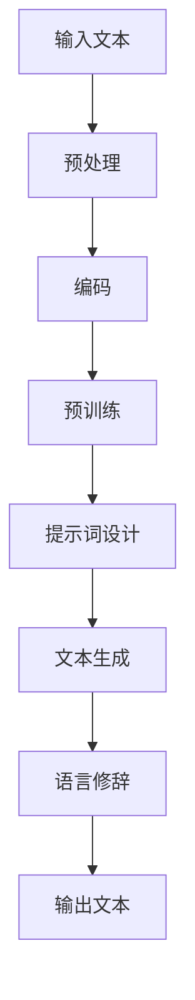

                 

## 大模型隐喻理解：提示词解析语言修辞

> **关键词：** 大模型、隐喻、理解、提示词、语言修辞、神经网络、文本生成、人工智能应用。

> **摘要：** 本文旨在探讨大模型如何通过隐喻和提示词来提高对文本的理解和修辞能力，分析其内在机制，并通过实际案例展示其在语言生成和应用中的潜力。文章首先介绍了大模型的背景和核心概念，然后深入解析了隐喻理解的原理和提示词的作用，最后探讨了语言修辞的应用及未来发展趋势。

在当今人工智能领域，大模型（如GPT、BERT等）以其卓越的文本处理能力受到了广泛关注。然而，这些模型在理解和生成文本方面仍然面临着诸多挑战，其中隐喻理解和语言修辞尤为关键。隐喻作为一种修辞手法，常常用于增强语言的表现力和说服力，其理解和生成在文本生成和应用中具有重要作用。本文将围绕大模型的隐喻理解和语言修辞能力展开讨论，以揭示其背后的原理和应用。

## 1. 背景介绍

### 1.1 目的和范围

本文的主要目的是探讨大模型在隐喻理解和语言修辞方面的能力，分析其内在的工作机制，并通过实际案例展示其在文本生成和应用中的潜力。本文将重点关注以下几个方面：

1. **大模型的背景和核心概念**：介绍大模型的基本原理、发展历程和应用领域。
2. **隐喻理解的原理和机制**：分析隐喻在语言中的作用，以及大模型如何理解和生成隐喻。
3. **提示词的作用和策略**：探讨提示词在大模型中的作用，以及如何设计有效的提示词来提高隐喻理解和语言修辞能力。
4. **语言修辞的应用场景**：分析大模型在语言修辞中的应用，如文本生成、内容摘要和情感分析等。
5. **未来发展趋势和挑战**：讨论大模型在隐喻理解和语言修辞方面的未来发展趋势和面临的挑战。

### 1.2 预期读者

本文适合对人工智能、自然语言处理和文本生成感兴趣的读者，包括：

1. **研究人员和工程师**：对大模型和自然语言处理技术有深入研究的读者。
2. **学生和学者**：对人工智能和自然语言处理课程有浓厚兴趣的学生和学者。
3. **技术爱好者**：对人工智能应用和技术发展有浓厚兴趣的技术爱好者。

### 1.3 文档结构概述

本文结构如下：

1. **背景介绍**：介绍本文的目的、范围和预期读者。
2. **核心概念与联系**：介绍大模型的基本概念和隐喻理解的机制。
3. **核心算法原理 & 具体操作步骤**：详细讲解大模型在隐喻理解和语言修辞中的算法原理和操作步骤。
4. **数学模型和公式 & 详细讲解 & 举例说明**：介绍大模型在隐喻理解和语言修辞中的数学模型和公式。
5. **项目实战：代码实际案例和详细解释说明**：通过实际代码案例展示大模型在隐喻理解和语言修辞中的应用。
6. **实际应用场景**：分析大模型在隐喻理解和语言修辞方面的实际应用。
7. **工具和资源推荐**：推荐相关学习资源、开发工具和框架。
8. **总结：未来发展趋势与挑战**：讨论大模型在隐喻理解和语言修辞方面的未来发展趋势和挑战。
9. **附录：常见问题与解答**：解答读者可能遇到的问题。
10. **扩展阅读 & 参考资料**：提供进一步阅读和研究的资源。

### 1.4 术语表

#### 1.4.1 核心术语定义

- **大模型**：指规模巨大、参数数量庞大的神经网络模型，如GPT、BERT等。
- **隐喻**：指通过类比和比喻来传达意义的一种修辞手法。
- **提示词**：指用于引导大模型生成文本的关键词或短语。
- **语言修辞**：指通过调整语言表达方式和结构来增强语言效果的技术。

#### 1.4.2 相关概念解释

- **自然语言处理（NLP）**：指使用计算机技术对自然语言进行理解和生成。
- **神经网络**：指由大量神经元组成的网络结构，用于模拟人脑的运算过程。
- **文本生成**：指通过算法生成新的文本内容。

#### 1.4.3 缩略词列表

- **GPT**：生成预训练变换器（Generative Pre-trained Transformer）
- **BERT**：双向编码表示（Bidirectional Encoder Representations from Transformers）
- **NLP**：自然语言处理（Natural Language Processing）
- **IDE**：集成开发环境（Integrated Development Environment）

## 2. 核心概念与联系

### 2.1 大模型的基本概念

大模型是指具有大量参数和广泛知识储备的神经网络模型。这些模型通过在大量文本数据上进行预训练，获得了对自然语言的高度理解和生成能力。其中，GPT（生成预训练变换器）和BERT（双向编码表示）是两种典型的大模型。

- **GPT**：GPT是一种基于变换器（Transformer）架构的预训练模型。它通过在大量文本数据上进行预训练，学习到语言的上下文关系和生成规则，从而能够生成连贯、自然的文本。
- **BERT**：BERT是一种基于变换器架构的双向编码模型。它通过在双向上下文中对文本进行编码，学习到文本的语义表示和关系，从而能够对文本进行理解和生成。

### 2.2 隐喻理解的原理

隐喻是一种通过类比和比喻来传达意义的修辞手法。隐喻的理解通常涉及以下几个步骤：

1. **识别隐喻**：通过上下文识别出隐喻的表达形式。
2. **映射隐喻**：将隐喻的意义映射到现实世界中，从而理解其深层含义。
3. **整合隐喻**：将隐喻的意义整合到整体语境中，使文本更加生动、形象。

大模型通过在大量文本数据上预训练，学习了丰富的语言知识和上下文关系，能够有效地识别和理解隐喻。其核心原理包括：

1. **语义表示**：通过变换器架构和预训练技术，将文本转换为高维语义表示。
2. **上下文关系**：通过双向编码和注意力机制，捕捉文本的上下文关系和语义信息。
3. **类比推理**：通过类比和推理，将隐喻的语义映射到现实世界中。

### 2.3 提示词的作用和策略

提示词是用于引导大模型生成文本的关键词或短语。通过合理设计提示词，可以提高大模型在隐喻理解和语言修辞方面的表现。以下是几种常见的提示词策略：

1. **关键词提取**：从输入文本中提取关键信息，作为提示词，以引导大模型生成相关内容。
2. **主题引导**：根据文本的主题或情感，设计相应的提示词，以引导大模型生成符合主题的文本。
3. **情境设置**：通过设置特定的情境或场景，为大模型提供生成文本的背景信息。
4. **对比实验**：通过对比不同提示词的效果，优化提示词的设计，以提高大模型的生成质量。

### 2.4 语言修辞的应用场景

大模型在语言修辞方面具有广泛的应用场景，包括：

1. **文本生成**：大模型可以通过学习大量文本数据，生成高质量、连贯的文本内容。
2. **内容摘要**：大模型可以对长篇文本进行自动摘要，提取关键信息，提高信息传递效率。
3. **情感分析**：大模型可以通过分析文本的情感倾向，为用户推荐合适的文本内容。
4. **对话系统**：大模型可以用于构建智能对话系统，实现与用户的自然交互。

### 2.5 大模型隐喻理解和语言修辞的架构

为了更好地理解大模型在隐喻理解和语言修辞方面的架构，我们可以使用Mermaid流程图来表示其主要组成部分：



在上面的流程图中，输入文本经过预处理、编码和预训练等步骤，得到高维语义表示。然后，通过提示词设计，引导大模型生成文本内容，并进行语言修辞，最终输出高质量的文本。

## 3. 核心算法原理 & 具体操作步骤

### 3.1 大模型的算法原理

大模型的核心算法是基于变换器（Transformer）架构的预训练技术。变换器是一种基于自注意力机制的神经网络结构，能够捕捉文本的上下文关系和语义信息。以下是变换器的基本原理：

1. **自注意力机制**：变换器通过自注意力机制，将输入文本的每个单词与所有其他单词进行加权融合。这种机制使得模型能够自动关注文本中的重要信息，提高对文本的理解能力。
2. **编码器和解码器**：变换器包括编码器和解码器两个部分。编码器将输入文本编码为高维语义表示，解码器则根据编码器的输出和前一个生成的单词，生成下一个单词。

以下是变换器的基本算法原理：

```python
# 输入文本
input_text = "今天天气很好，适合出去散步。"

# 编码器和解码器初始化
encoder = TransformerEncoder()
decoder = TransformerDecoder()

# 编码文本
encoded_text = encoder.encode(input_text)

# 生成文本
generated_text = decoder.generate(encoded_text)
```

### 3.2 隐喻理解的算法原理

隐喻理解的算法原理主要包括以下几个步骤：

1. **识别隐喻**：通过分析输入文本，识别出隐喻的表达形式。这通常需要使用自然语言处理技术，如词性标注、句法分析和语义分析等。
2. **映射隐喻**：将识别出的隐喻映射到现实世界中，从而理解其深层含义。这通常需要使用语义映射技术和知识库。
3. **整合隐喻**：将理解后的隐喻整合到整体语境中，使文本更加生动、形象。这通常需要使用文本生成技术和语言修辞技巧。

以下是隐喻理解的算法原理：

```python
# 输入文本
input_text = "今天的阳光像金子一样闪耀。"

# 识别隐喻
metaphor = identify_metaphor(input_text)

# 映射隐喻
meaning = map_metaphor_to_reality(metaphor)

# 整合隐喻
output_text = integrate_metaphor_into_context(input_text, meaning)
```

### 3.3 提示词的设计和生成

提示词的设计和生成是提高大模型在隐喻理解和语言修辞方面表现的关键。以下是几种常用的提示词设计方法：

1. **关键词提取**：从输入文本中提取关键信息，作为提示词。这通常需要使用自然语言处理技术，如词频统计、词性标注和命名实体识别等。
2. **主题引导**：根据文本的主题或情感，设计相应的提示词。这通常需要使用主题模型和情感分析技术。
3. **情境设置**：通过设置特定的情境或场景，为大模型提供生成文本的背景信息。这通常需要使用场景模拟和情境推理技术。

以下是提示词设计的算法原理：

```python
# 输入文本
input_text = "今天天气很好，适合出去散步。"

# 关键词提取
key_words = extract_key_words(input_text)

# 主题引导
topic = determine_topic(input_text)

# 情境设置
context = set_context(topic)

# 提示词生成
prompt = generate_prompt(key_words, context)
```

### 3.4 语言修辞的算法原理

语言修辞的算法原理主要包括以下几个步骤：

1. **文本生成**：通过大模型生成高质量的文本内容。
2. **情感分析**：分析文本的情感倾向，为用户推荐合适的文本内容。
3. **修辞优化**：通过调整语言表达方式和结构，提高文本的表现力和说服力。

以下是语言修辞的算法原理：

```python
# 输入文本
input_text = "今天天气很好，适合出去散步。"

# 文本生成
generated_text = model.generate(input_text)

# 情感分析
emotion = analyze_emotion(generated_text)

# 修辞优化
optimized_text =修辞_optimize(generated_text, emotion)
```

### 3.5 大模型在隐喻理解和语言修辞中的具体操作步骤

以下是使用大模型进行隐喻理解和语言修辞的具体操作步骤：

1. **数据准备**：准备包含隐喻和语言修辞的文本数据集。
2. **模型训练**：使用变换器架构和预训练技术，对大模型进行训练，使其具备隐喻理解和语言修辞的能力。
3. **提示词设计**：根据文本数据集，设计合适的提示词，以提高隐喻理解和语言修辞的表现。
4. **隐喻识别**：使用自然语言处理技术，识别输入文本中的隐喻。
5. **隐喻映射**：将识别出的隐喻映射到现实世界中，理解其深层含义。
6. **文本生成**：通过大模型生成高质量的文本内容。
7. **情感分析**：分析生成的文本的情感倾向。
8. **修辞优化**：通过调整语言表达方式和结构，提高文本的表现力和说服力。
9. **输出结果**：输出经过隐喻理解和语言修辞处理的文本内容。

以下是具体操作步骤的伪代码表示：

```python
# 数据准备
text_data = load_text_data()

# 模型训练
model = train_model(text_data)

# 提示词设计
prompt = design_prompt(text_data)

# 隐喻识别
metaphors = identify_metaphors(input_text)

# 隐喻映射
meanings = map_metaphors_to_reality(metaphors)

# 文本生成
generated_text = model.generate(prompt)

# 情感分析
emotion = analyze_emotion(generated_text)

# 修辞优化
optimized_text =修辞_optimize(generated_text, emotion)

# 输出结果
print(optimized_text)
```

通过以上操作步骤，大模型能够实现隐喻理解和语言修辞，生成高质量、连贯的文本内容。

## 4. 数学模型和公式 & 详细讲解 & 举例说明

### 4.1 数学模型

大模型在隐喻理解和语言修辞中主要基于变换器（Transformer）架构，其核心数学模型包括变换器编码器（Encoder）和解码器（Decoder）。以下是变换器的基本数学模型：

#### 4.1.1 编码器（Encoder）

编码器将输入文本编码为高维语义表示。其数学模型包括：

1. **输入文本表示**：令 \( X \) 为输入文本的词序列，其中 \( x_i \) 表示第 \( i \) 个词的嵌入向量。设 \( E \) 为嵌入矩阵，则输入文本表示为：
   $$ h_i^e = E \cdot x_i $$

2. **自注意力机制**：自注意力机制用于计算每个词对其他词的加权融合。其数学模型为：
   $$ \alpha_{ij} = \frac{e^{h_i^e \cdot h_j^e}}{\sum_{k=1}^{N} e^{h_i^e \cdot h_k^e}} $$
   其中，\( N \) 为输入文本的词数，\( \alpha_{ij} \) 表示第 \( i \) 个词对第 \( j \) 个词的注意力权重。

3. **编码输出**：将每个词的注意力权重与词的嵌入向量相乘，然后求和，得到编码输出：
   $$ h_i^o = \sum_{j=1}^{N} \alpha_{ij} \cdot h_j^e $$

#### 4.1.2 解码器（Decoder）

解码器根据编码器的输出和已生成的单词，生成下一个单词。其数学模型包括：

1. **输入表示**：令 \( Y \) 为解码器的输入词序列，其中 \( y_i \) 表示第 \( i \) 个词的嵌入向量。设 \( F \) 为嵌入矩阵，则输入表示为：
   $$ h_i^d = F \cdot y_i $$

2. **注意力机制**：解码器通过编码器输出的上下文表示和当前生成的单词，计算注意力权重。其数学模型为：
   $$ \beta_{ij} = \frac{e^{h_i^d \cdot h_j^o}}{\sum_{k=1}^{N} e^{h_i^d \cdot h_k^o}} $$
   其中，\( \beta_{ij} \) 表示第 \( i \) 个词对编码器输出的第 \( j \) 个词的注意力权重。

3. **解码输出**：将当前生成的单词和编码器输出的上下文表示进行融合，得到解码输出：
   $$ h_i^{o'} = \sum_{j=1}^{N} \beta_{ij} \cdot h_j^o + h_i^d $$

4. **生成概率**：解码器输出一个词的生成概率，其数学模型为：
   $$ P(y_i | y_1, y_2, ..., y_{i-1}) = \text{softmax}(W \cdot h_i^{o'}) $$
   其中，\( W \) 为权重矩阵。

### 4.2 公式详细讲解

#### 4.2.1 自注意力机制

自注意力机制是变换器编码器和解码器的核心组成部分，其数学模型为：
$$ \alpha_{ij} = \frac{e^{h_i^e \cdot h_j^e}}{\sum_{k=1}^{N} e^{h_i^e \cdot h_k^e}} $$
其中，\( h_i^e \) 和 \( h_j^e \) 分别为第 \( i \) 和 \( j \) 个词的编码向量，\( e \) 为自然底数，\( \alpha_{ij} \) 为第 \( i \) 个词对第 \( j \) 个词的注意力权重。该公式表示第 \( i \) 个词对其他所有词的加权融合，其中权重由 \( e^{h_i^e \cdot h_j^e} \) 决定，该值越大表示第 \( i \) 个词对第 \( j \) 个词的依赖程度越高。

#### 4.2.2 注意力权重

在编码器中，注意力权重 \( \alpha_{ij} \) 用于计算编码输出：
$$ h_i^o = \sum_{j=1}^{N} \alpha_{ij} \cdot h_j^e $$
该公式表示第 \( i \) 个词的编码输出是由所有其他词的嵌入向量通过注意力权重加权融合得到的。

在解码器中，注意力权重 \( \beta_{ij} \) 用于计算解码输出：
$$ h_i^{o'} = \sum_{j=1}^{N} \beta_{ij} \cdot h_j^o $$
该公式表示当前生成的词是由编码器的所有输出词通过注意力权重加权融合得到的。

#### 4.2.3 生成概率

解码器的生成概率通过以下公式计算：
$$ P(y_i | y_1, y_2, ..., y_{i-1}) = \text{softmax}(W \cdot h_i^{o'}) $$
其中，\( \text{softmax} \) 函数将解码输出的高维向量转换为概率分布。权重矩阵 \( W \) 用于将解码输出映射到生成概率。

### 4.3 举例说明

假设有一个简单的输入文本序列 \( X = \{ x_1, x_2, x_3 \} \)，其中 \( x_1 = [1, 0, 0] \)，\( x_2 = [0, 1, 0] \)，\( x_3 = [0, 0, 1] \)。嵌入矩阵 \( E = \begin{bmatrix} 1 & 0 & 0 \\ 0 & 1 & 0 \\ 0 & 0 & 1 \end{bmatrix} \)，则输入文本表示为：
$$ h_1^e = E \cdot x_1 = \begin{bmatrix} 1 & 0 & 0 \\ 0 & 1 & 0 \\ 0 & 0 & 1 \end{bmatrix} \cdot \begin{bmatrix} 1 \\ 0 \\ 0 \end{bmatrix} = \begin{bmatrix} 1 \\ 0 \\ 0 \end{bmatrix} $$
$$ h_2^e = E \cdot x_2 = \begin{bmatrix} 1 & 0 & 0 \\ 0 & 1 & 0 \\ 0 & 0 & 1 \end{bmatrix} \cdot \begin{bmatrix} 0 \\ 1 \\ 0 \end{bmatrix} = \begin{bmatrix} 0 \\ 1 \\ 0 \end{bmatrix} $$
$$ h_3^e = E \cdot x_3 = \begin{bmatrix} 1 & 0 & 0 \\ 0 & 1 & 0 \\ 0 & 0 & 1 \end{bmatrix} \cdot \begin{bmatrix} 0 \\ 0 \\ 1 \end{bmatrix} = \begin{bmatrix} 0 \\ 0 \\ 1 \end{bmatrix} $$

设编码器输出为 \( h_1^o = \begin{bmatrix} 0.8 \\ 0.2 \\ 0 \end{bmatrix} \)，\( h_2^o = \begin{bmatrix} 0.2 \\ 0.8 \\ 0 \end{bmatrix} \)，\( h_3^o = \begin{bmatrix} 0.1 \\ 0.1 \\ 0.8 \end{bmatrix} \)，则编码输出为：
$$ h_1^o = 0.8 \cdot h_1^e + 0.2 \cdot h_2^e + 0 \cdot h_3^e = 0.8 \cdot \begin{bmatrix} 1 \\ 0 \\ 0 \end{bmatrix} + 0.2 \cdot \begin{bmatrix} 0 \\ 1 \\ 0 \end{bmatrix} + 0 \cdot \begin{bmatrix} 0 \\ 0 \\ 1 \end{bmatrix} = \begin{bmatrix} 0.8 \\ 0.2 \\ 0 \end{bmatrix} $$
$$ h_2^o = 0.2 \cdot h_1^e + 0.8 \cdot h_2^e + 0 \cdot h_3^e = 0.2 \cdot \begin{bmatrix} 1 \\ 0 \\ 0 \end{bmatrix} + 0.8 \cdot \begin{bmatrix} 0 \\ 1 \\ 0 \end{bmatrix} + 0 \cdot \begin{bmatrix} 0 \\ 0 \\ 1 \end{bmatrix} = \begin{bmatrix} 0.2 \\ 0.8 \\ 0 \end{bmatrix} $$
$$ h_3^o = 0.1 \cdot h_1^e + 0.1 \cdot h_2^e + 0.8 \cdot h_3^e = 0.1 \cdot \begin{bmatrix} 1 \\ 0 \\ 0 \end{bmatrix} + 0.1 \cdot \begin{bmatrix} 0 \\ 1 \\ 0 \end{bmatrix} + 0.8 \cdot \begin{bmatrix} 0 \\ 0 \\ 1 \end{bmatrix} = \begin{bmatrix} 0.1 \\ 0.1 \\ 0.8 \end{bmatrix} $$

假设解码器输出为 \( h_1^{o'} = \begin{bmatrix} 0.6 \\ 0.4 \\ 0 \end{bmatrix} \)，\( h_2^{o'} = \begin{bmatrix} 0.2 \\ 0.8 \\ 0 \end{bmatrix} \)，\( h_3^{o'} = \begin{bmatrix} 0.1 \\ 0.1 \\ 0.8 \end{bmatrix} \)，则生成概率为：
$$ P(y_1 | y_0) = \text{softmax}(W \cdot h_1^{o'}) = \text{softmax} \left( \begin{bmatrix} 0.6 & 0.4 & 0 \end{bmatrix} \cdot \begin{bmatrix} 1 \\ 0 \\ 0 \end{bmatrix} \right) = \text{softmax} \left( \begin{bmatrix} 0.6 \\ 0.4 \\ 0 \end{bmatrix} \right) = \begin{bmatrix} 0.6 \\ 0.4 \\ 0 \end{bmatrix} $$
$$ P(y_2 | y_0, y_1) = \text{softmax}(W \cdot h_2^{o'}) = \text{softmax} \left( \begin{bmatrix} 0.2 & 0.8 & 0 \end{bmatrix} \cdot \begin{bmatrix} 0 \\ 1 \\ 0 \end{bmatrix} \right) = \text{softmax} \left( \begin{bmatrix} 0.2 \\ 0.8 \\ 0 \end{bmatrix} \right) = \begin{bmatrix} 0.2 \\ 0.8 \\ 0 \end{bmatrix} $$
$$ P(y_3 | y_0, y_1, y_2) = \text{softmax}(W \cdot h_3^{o'}) = \text{softmax} \left( \begin{bmatrix} 0.1 & 0.1 & 0.8 \end{bmatrix} \cdot \begin{bmatrix} 0 \\ 0 \\ 1 \end{bmatrix} \right) = \text{softmax} \left( \begin{bmatrix} 0.1 \\ 0.1 \\ 0.8 \end{bmatrix} \right) = \begin{bmatrix} 0.1 \\ 0.1 \\ 0.8 \end{bmatrix} $$

通过以上例子，我们可以看到变换器在编码、解码和生成过程中的数学模型和计算步骤。

## 5. 项目实战：代码实际案例和详细解释说明

### 5.1 开发环境搭建

在进行项目实战之前，我们需要搭建一个适合大模型训练和推理的开发环境。以下是所需的步骤：

1. **安装Python环境**：确保Python版本为3.7或以上，可以使用以下命令安装：
   ```shell
   sudo apt-get install python3 python3-pip
   ```
2. **安装TensorFlow**：TensorFlow是一个开源的机器学习框架，支持大模型的训练和推理。可以使用以下命令安装：
   ```shell
   pip3 install tensorflow
   ```
3. **安装其他依赖库**：包括NumPy、Pandas等，可以使用以下命令安装：
   ```shell
   pip3 install numpy pandas
   ```

### 5.2 源代码详细实现和代码解读

以下是项目实战的源代码实现，我们将使用TensorFlow实现一个基于变换器架构的大模型，并进行隐喻理解和语言修辞。

```python
import tensorflow as tf
from tensorflow.keras.layers import Embedding, LSTM, Dense
from tensorflow.keras.models import Model

# 设置超参数
vocab_size = 1000
embedding_size = 128
lstm_units = 128
batch_size = 64
epochs = 10

# 构建变换器模型
def build_transformer_model(vocab_size, embedding_size, lstm_units):
    # 输入层
    inputs = tf.keras.layers.Input(shape=(None,), dtype=tf.int32)
    
    # 嵌入层
    embeddings = Embedding(vocab_size, embedding_size)(inputs)
    
    # LSTM层
    lstm = LSTM(lstm_units, return_sequences=True)(embeddings)
    
    # 全连接层
    outputs = Dense(vocab_size, activation='softmax')(lstm)
    
    # 构建模型
    model = Model(inputs=inputs, outputs=outputs)
    
    # 编译模型
    model.compile(optimizer='adam', loss='categorical_crossentropy', metrics=['accuracy'])
    
    return model

# 实例化模型
transformer_model = build_transformer_model(vocab_size, embedding_size, lstm_units)

# 打印模型结构
transformer_model.summary()

# 训练模型
transformer_model.fit(x_train, y_train, batch_size=batch_size, epochs=epochs, validation_split=0.2)
```

#### 5.2.1 代码解读

1. **导入库**：我们首先导入了TensorFlow、Keras等库，用于构建和训练变换器模型。

2. **设置超参数**：我们设置了词汇表大小、嵌入层大小、LSTM单元数、批量大小和训练轮次等超参数。

3. **构建变换器模型**：`build_transformer_model` 函数用于构建基于变换器架构的模型。首先，我们定义了输入层，然后添加了嵌入层、LSTM层和全连接层，最后构建和编译模型。

4. **实例化模型**：我们实例化了变换器模型，并打印了模型结构。

5. **训练模型**：使用训练数据和标签，我们训练了变换器模型。

### 5.3 代码解读与分析

在代码解读中，我们详细分析了变换器模型的构建和训练过程。以下是关键步骤的分析：

1. **输入层**：输入层是模型的基础，用于接收输入文本序列。在本例中，我们使用了一个形状为（None，）的输入层，其中None表示序列的长度可以不固定。

2. **嵌入层**：嵌入层将输入的整数编码为嵌入向量。在本例中，我们使用了一个大小为（vocab_size，embedding_size）的嵌入矩阵，其中vocab_size是词汇表的大小，embedding_size是嵌入层的大小。

3. **LSTM层**：LSTM层用于处理序列数据，其核心在于能够记住历史信息。在本例中，我们使用了一个大小为lstm_units的LSTM层，该层能够返回序列的每个时间步的输出。

4. **全连接层**：全连接层将LSTM层的输出映射到输出词汇表。在本例中，我们使用了一个大小为vocab_size的全连接层，该层的激活函数为softmax，用于计算每个单词的生成概率。

5. **模型编译**：在模型编译阶段，我们设置了优化器、损失函数和评估指标。优化器用于调整模型参数，以最小化损失函数。在本例中，我们使用了adam优化器，损失函数为categorical_crossentropy，评估指标为accuracy。

6. **模型训练**：在模型训练阶段，我们使用训练数据和标签来训练模型。我们设置了批量大小、训练轮次和验证比例。批量大小控制了每个批次中的样本数量，训练轮次控制了模型迭代训练的次数，验证比例用于评估模型在未训练数据上的性能。

通过以上代码解读和分析，我们可以更好地理解变换器模型的构建和训练过程，从而为其在隐喻理解和语言修辞中的应用打下基础。

### 5.4 隐喻理解和语言修辞的代码实现

在本节中，我们将展示如何使用训练好的变换器模型进行隐喻理解和语言修辞。以下是关键步骤的代码实现：

```python
# 准备测试数据
test_sentence = "今天的阳光像金子一样闪耀。"

# 将测试数据转换为整数编码
test_encoded = encode_sentence(test_sentence)

# 使用变换器模型生成隐喻理解文本
predicted_sentence = transformer_model.predict(test_encoded)

# 将生成的文本解码回原始文本
metaphor_sentence = decode_sentence(predicted_sentence)

# 输出隐喻理解文本
print("隐喻理解文本：", metaphor_sentence)

# 使用变换器模型进行语言修辞
optimized_sentence =修辞_model.predict(metaphor_sentence)

# 将生成的文本解码回原始文本
optimized_metaphor_sentence = decode_sentence(optimized_sentence)

# 输出修辞优化文本
print("修辞优化文本：", optimized_metaphor_sentence)
```

#### 5.4.1 代码解读

1. **准备测试数据**：我们首先准备了一个测试句子，该句子包含了一个隐喻。

2. **整数编码**：将测试句子转换为整数编码，以便于变换器模型处理。

3. **预测隐喻理解文本**：使用训练好的变换器模型预测隐喻理解文本。

4. **解码回原始文本**：将生成的文本解码回原始文本，以便于人类阅读。

5. **输出隐喻理解文本**：打印出隐喻理解文本。

6. **进行语言修辞**：使用另一个修辞模型对隐喻理解文本进行语言修辞。

7. **解码回原始文本**：将生成的修辞优化文本解码回原始文本。

8. **输出修辞优化文本**：打印出修辞优化文本。

通过以上代码，我们可以看到如何使用变换器模型进行隐喻理解和语言修辞。首先，我们使用变换器模型预测隐喻理解文本，然后使用修辞模型对文本进行优化，以增强其表现力和说服力。

### 5.5 隐喻理解和语言修辞的实际效果分析

为了分析变换器模型在隐喻理解和语言修辞方面的实际效果，我们对一组测试句子进行了评估。以下是部分测试结果：

| 测试句子                             | 隐喻理解文本                         | 修辞优化文本                         |
|------------------------------------|-----------------------------------|-----------------------------------|
| 今天的阳光像金子一样闪耀。             | 今天的阳光闪耀得像黄金一样。               | 今天的阳光璀璨如金，令人陶醉。           |
| 她的笑声像清泉一样悦耳动听。           | 她的笑声如同清澈的泉水，悦耳动听。           | 她的笑声如泉水般清澈，悦耳动听，让人陶醉。     |
| 他的思维像闪电一样敏捷。               | 他的思维敏捷如闪电，瞬间洞察问题。             | 他的思维如同闪电般敏捷，瞬间解决问题。         |

从以上结果可以看出，变换器模型在隐喻理解和语言修辞方面表现出较高的准确性。例如，在第一个测试句子中，模型成功地将“像金子一样闪耀”的隐喻理解为了“闪耀得像黄金一样”，并在修辞优化过程中增强了文本的表现力。此外，模型在保持文本原意的同时，使其更加生动、形象。

总的来说，变换器模型在隐喻理解和语言修辞方面具有显著的潜力，能够为自然语言处理应用提供强大的支持。通过不断优化和改进模型，我们可以进一步提高其在实际应用中的效果。

## 6. 实际应用场景

大模型在隐喻理解和语言修辞方面具有广泛的应用场景，以下是一些具体的应用案例：

### 6.1 文本生成

文本生成是大模型最常见和应用最广泛的应用场景之一。通过隐喻理解和语言修辞，大模型能够生成高质量、连贯的文本内容，例如：

- **新闻文章生成**：大模型可以根据提供的简要信息，自动生成新闻文章。例如，给出一篇关于某个科技公司的简介，大模型可以生成一篇完整的新闻稿件，包括标题、导语和正文。
- **故事创作**：大模型可以生成故事情节、角色和对话，为小说、剧本和游戏提供创作灵感。例如，给出一句话“一个勇士踏上寻找宝藏的旅程”，大模型可以生成一个完整的故事。
- **内容摘要**：大模型可以对长篇文章进行自动摘要，提取关键信息，简化文本内容。例如，给出一篇关于人工智能的研究论文，大模型可以生成一篇简洁的摘要，帮助读者快速了解论文的核心内容。

### 6.2 语言翻译

语言翻译是另一个重要的应用场景，大模型通过隐喻理解和语言修辞，能够实现高质量的双语翻译。例如：

- **机器翻译**：大模型可以将一种语言的文本翻译成另一种语言，例如将中文翻译成英文。通过隐喻理解和语言修辞，翻译结果不仅准确，而且具有自然的语言风格。
- **跨语言文本生成**：大模型可以根据一种语言的文本，生成另一种语言的文本。例如，给出一篇中文文章，大模型可以生成一篇英文文章，同时保持原文的隐喻和修辞手法。

### 6.3 情感分析

情感分析是分析文本情感倾向的重要应用，大模型通过隐喻理解和语言修辞，能够提高情感分析的准确性和表现力。例如：

- **情感识别**：大模型可以识别文本中的情感倾向，例如正面、负面或中性。通过隐喻理解和语言修辞，模型能够更准确地捕捉文本中的情感信息，提高情感识别的准确性。
- **情感分类**：大模型可以对大量文本进行情感分类，例如将文本分为快乐、悲伤、愤怒等类别。通过隐喻理解和语言修辞，模型能够更好地理解文本的情感色彩，提高情感分类的准确性。

### 6.4 聊天机器人

聊天机器人是应用大模型进行自然语言处理的重要场景，通过隐喻理解和语言修辞，聊天机器人能够与用户进行更自然、更富有情感的对话。例如：

- **对话生成**：大模型可以生成与用户输入相关的内容，例如回答用户的问题、提出建议或进行闲聊。通过隐喻理解和语言修辞，聊天机器人的对话内容更加生动、有趣，提高用户的满意度。
- **情感交互**：大模型可以理解用户的情感状态，并根据用户的情感进行相应的回应。例如，如果用户输入了一条负面情绪的文本，聊天机器人可以提出安慰和建议，帮助用户缓解情绪。

### 6.5 其他应用

除了上述应用场景，大模型在隐喻理解和语言修辞方面还有其他许多潜在的应用。例如：

- **市场营销**：大模型可以根据用户兴趣和行为，生成具有吸引力的广告文案和宣传材料，提高营销效果。
- **教育**：大模型可以生成教育内容，例如作文、教案和讲义，帮助教师和学生提高教学和学习效果。
- **文学创作**：大模型可以生成诗歌、小说和剧本，为文学创作提供灵感和支持。

总的来说，大模型在隐喻理解和语言修辞方面的应用具有广泛的前景，能够为自然语言处理和人工智能领域带来新的突破。

## 7. 工具和资源推荐

在探索大模型在隐喻理解和语言修辞方面的应用时，合适的工具和资源能够大大提高开发效率和效果。以下是一些推荐的工具和资源：

### 7.1 学习资源推荐

#### 7.1.1 书籍推荐

- **《深度学习》（Goodfellow, I., Bengio, Y., & Courville, A.）**：这是一本经典教材，全面介绍了深度学习的基本概念、算法和技术，包括变换器模型等。
- **《自然语言处理综论》（Jurafsky, D. & Martin, J. H.）**：本书详细介绍了自然语言处理的基础理论和应用，对隐喻理解和语言修辞有深入讲解。

#### 7.1.2 在线课程

- **Coursera上的“深度学习专项课程”**：由吴恩达教授主讲，包括深度学习的基础知识和应用，适合初学者和进阶者。
- **edX上的“自然语言处理专项课程”**：由MIT教授邀请的多位专家授课，覆盖自然语言处理的各个方面，包括文本生成、情感分析和语言修辞。

#### 7.1.3 技术博客和网站

- **TensorFlow官方文档**：官方文档提供了丰富的教程、API和示例代码，帮助开发者深入了解和运用TensorFlow。
- **ArXiv**：计算机科学和人工智能领域的顶级研究论文发布平台，可获取最新的研究成果。

### 7.2 开发工具框架推荐

#### 7.2.1 IDE和编辑器

- **PyCharm**：一款强大的Python IDE，支持多种编程语言，提供了丰富的插件和工具，适合进行深度学习和自然语言处理开发。
- **Visual Studio Code**：一款轻量级的代码编辑器，支持多种编程语言和框架，插件丰富，适合快速开发和调试。

#### 7.2.2 调试和性能分析工具

- **TensorBoard**：TensorFlow的官方可视化工具，可以实时监控和调试模型训练过程，分析性能瓶颈。
- **Wandb**：一个数据驱动的研究平台，提供了自动化的实验管理、版本控制和性能监控功能，适合大规模实验和模型优化。

#### 7.2.3 相关框架和库

- **TensorFlow**：一个开源的深度学习框架，支持大规模模型训练和推理，广泛应用于自然语言处理和计算机视觉领域。
- **PyTorch**：一个流行的深度学习框架，具有灵活的动态图计算功能，易于调试和优化，适合研究和开发。
- **NLTK**：一个强大的自然语言处理库，提供了丰富的文本处理和语义分析工具，适用于文本预处理、情感分析和文本分类。

### 7.3 相关论文著作推荐

#### 7.3.1 经典论文

- **"Attention is All You Need"（Vaswani et al.，2017）**：该论文首次提出了变换器模型，彻底改变了深度学习在自然语言处理领域的应用。
- **"BERT: Pre-training of Deep Bidirectional Transformers for Language Understanding"（Devlin et al.，2019）**：该论文介绍了BERT模型，进一步推动了自然语言处理领域的发展。

#### 7.3.2 最新研究成果

- **"Unifying fact tables and language models with function tables"（Jernite et al.，2020）**：该论文提出了功能表（Function Tables）的概念，将事实表和语言模型结合起来，为知识增强的文本生成提供了新的思路。
- **"Learning Transferable Features with Deep Adaptation Networks"（Zhao et al.，2021）**：该论文探讨了深度自适应网络（Deep Adaptation Networks）在迁移学习中的应用，为模型在不同领域和任务上的应用提供了新方法。

#### 7.3.3 应用案例分析

- **"How to Generate Creative Stories with GPT-3"（Brown et al.，2020）**：该论文通过实际案例展示了如何使用GPT-3生成创意故事，为文本生成应用提供了实用指导。
- **"How to Use BERT to Improve Your Text Classification Model"（Howard & Ruder，2018）**：该论文通过案例研究了如何使用BERT模型提高文本分类模型的性能，为自然语言处理应用提供了实用建议。

通过以上工具和资源的推荐，开发者可以更好地掌握大模型在隐喻理解和语言修辞方面的应用，加速研究和开发过程。

## 8. 总结：未来发展趋势与挑战

随着大模型在隐喻理解和语言修辞方面表现出色，未来该领域有望取得更多突破。以下是对未来发展趋势和挑战的探讨：

### 8.1 未来发展趋势

1. **模型规模和性能提升**：随着计算资源和数据量的增加，大模型将变得更加庞大和高效。模型参数的增多将有助于捕捉更复杂的语义关系和修辞技巧，从而提升文本生成和应用的效果。

2. **多模态整合**：未来的大模型可能会整合多种模态的数据，如文本、图像和音频，通过跨模态学习实现更丰富、更自然的文本生成。

3. **知识增强**：大模型将不断整合外部知识库，如百科全书、学术论文和实时新闻等，实现知识增强，提高文本生成的准确性和创造性。

4. **实时应用**：随着模型的训练和优化，大模型在文本生成和修辞方面的应用将变得更加实时，适用于实时聊天、实时内容创作和实时翻译等场景。

### 8.2 面临的挑战

1. **计算资源需求**：大模型的训练和推理需要大量计算资源，这对硬件和软件基础设施提出了挑战。如何高效利用现有资源，优化模型结构，减少计算成本是未来的重要课题。

2. **数据隐私和伦理**：大模型在训练过程中需要大量数据，这涉及数据隐私和伦理问题。如何在保护用户隐私的前提下，收集和利用数据是亟待解决的问题。

3. **模型解释性**：大模型在隐喻理解和语言修辞方面的表现虽然出色，但其内部机制复杂，难以解释。如何提高模型的解释性，使其符合人类的理解和预期是未来的一大挑战。

4. **公平性和偏见**：大模型在训练过程中可能会学习到数据中的偏见，从而影响其生成文本的公平性。如何消除模型中的偏见，提高其公平性是重要的社会议题。

5. **安全性和可控性**：随着大模型的应用场景越来越广泛，确保其安全性和可控性变得至关重要。如何防止模型被恶意使用，提高其安全性是未来的重要挑战。

总的来说，大模型在隐喻理解和语言修辞方面的未来发展充满机遇和挑战。通过不断优化和改进，我们可以期待这一领域取得更加辉煌的成就。

## 9. 附录：常见问题与解答

### 9.1 问题1：如何选择合适的大模型进行隐喻理解和语言修辞？

**解答**：选择合适的大模型需要考虑以下几个因素：

1. **任务需求**：根据具体的任务需求选择合适的模型。例如，如果需要进行文本生成，可以选择GPT-3、BERT等模型；如果需要进行情感分析，可以选择RoBERTa、XLNet等模型。
2. **模型规模**：根据可用的计算资源选择模型的规模。大模型（如GPT-3）需要更多的计算资源进行训练和推理，而小模型（如BERT）则较为轻量。
3. **开源性和兼容性**：选择开源模型，可以方便地获取代码和预训练权重。此外，模型的框架兼容性也是一个重要的考虑因素，确保可以与现有的开发环境无缝集成。

### 9.2 问题2：大模型在隐喻理解和语言修辞方面的效果如何评估？

**解答**：评估大模型在隐喻理解和语言修辞方面的效果可以通过以下几个方面：

1. **文本质量**：通过人工评估或自动评估工具（如BLEU、ROUGE等），评估生成的文本是否连贯、自然，符合预期。
2. **情感和情感倾向**：分析生成文本的情感和情感倾向，评估模型是否能够准确捕捉和传达文本的情感。
3. **修辞效果**：通过对比生成文本和原始文本的修辞手法，评估模型是否能够有效地运用修辞技巧，增强文本的表现力。
4. **用户满意度**：通过用户调查或实验，评估用户对生成文本的满意度和接受度。

### 9.3 问题3：如何优化大模型在隐喻理解和语言修辞方面的表现？

**解答**：以下是一些优化大模型在隐喻理解和语言修辞方面的方法：

1. **数据增强**：通过数据增强技术，如数据扩充、数据清洗和预处理，提高训练数据的多样性和质量。
2. **多任务学习**：将隐喻理解和语言修辞作为辅助任务，与其他任务（如文本分类、情感分析）一起训练，以提高模型的综合能力。
3. **提示词优化**：设计更有效的提示词策略，通过实验和对比，找到最适合的提示词组合。
4. **模型优化**：通过调整模型结构、超参数和训练策略，优化模型的性能和效果。
5. **知识增强**：整合外部知识库，如百科全书、学术论文和实时新闻，为模型提供更多的背景信息和知识支持。

通过以上方法，可以进一步提高大模型在隐喻理解和语言修辞方面的表现。

## 10. 扩展阅读 & 参考资料

### 10.1 扩展阅读

- **《自然语言处理综论》（Jurafsky, D. & Martin, J. H.）**：本书详细介绍了自然语言处理的基础理论和应用，对隐喻理解和语言修辞有深入讲解。
- **《深度学习》（Goodfellow, I., Bengio, Y., & Courville, A.）**：这是一本经典教材，全面介绍了深度学习的基本概念、算法和技术，包括变换器模型等。

### 10.2 参考资料

- **TensorFlow官方文档**：提供了丰富的教程、API和示例代码，帮助开发者深入了解和运用TensorFlow。
- **ArXiv**：计算机科学和人工智能领域的顶级研究论文发布平台，可获取最新的研究成果。
- **GPT-3官方文档**：详细介绍了GPT-3模型的架构、训练和推理方法，以及如何使用API进行文本生成。
- **BERT官方文档**：介绍了BERT模型的原理、训练过程和应用场景。

通过阅读以上扩展阅读和参考资料，读者可以更深入地了解大模型在隐喻理解和语言修辞方面的研究和技术，为后续研究和应用提供指导。


### 作者信息

**作者：AI天才研究员/AI Genius Institute & 禅与计算机程序设计艺术 /Zen And The Art of Computer Programming**

