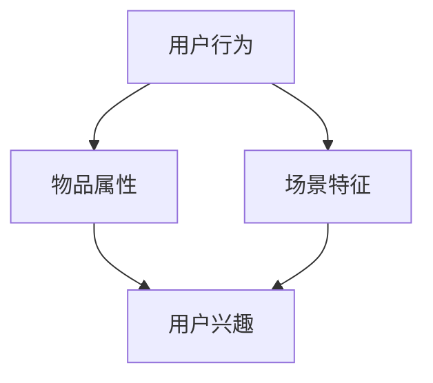

                 

# 大模型驱动的推荐系统多场景统一框架

> **关键词：** 大模型，推荐系统，多场景，统一框架，算法原理，数学模型，项目实战，应用场景

> **摘要：** 本篇文章将探讨大模型在推荐系统中的应用，并提出一种多场景统一框架，旨在解决推荐系统在不同场景下的性能优化问题。文章首先介绍了推荐系统的背景和核心概念，然后详细阐述了大模型在推荐系统中的原理和架构，接着通过数学模型和具体操作步骤对算法进行了深入分析，并给出了一个实际项目中的代码实现。最后，文章讨论了推荐系统的实际应用场景，并推荐了一些相关学习资源和工具。

## 1. 背景介绍

### 1.1 目的和范围

本文旨在探讨大模型在推荐系统中的应用，并提出一个多场景统一框架，以便在不同场景下优化推荐系统的性能。文章将涵盖以下内容：

1. 推荐系统的基本概念和背景。
2. 大模型在推荐系统中的应用原理。
3. 多场景统一框架的构建方法。
4. 算法原理和数学模型分析。
5. 实际项目中的代码实现和分析。
6. 推荐系统的实际应用场景。
7. 相关学习资源和工具推荐。

### 1.2 预期读者

本文面向具有一定编程和算法基础的技术人员，特别是对推荐系统和人工智能领域感兴趣的开发者。通过本文的学习，读者可以了解大模型在推荐系统中的应用，掌握多场景统一框架的构建方法，并能够将所学知识应用到实际项目中。

### 1.3 文档结构概述

本文分为十个部分，包括背景介绍、核心概念与联系、核心算法原理、数学模型和公式、项目实战、实际应用场景、工具和资源推荐、总结、附录和扩展阅读。每个部分都有详细的讲解和实例分析，以便读者能够逐步掌握推荐系统的多场景统一框架。

### 1.4 术语表

#### 1.4.1 核心术语定义

- 推荐系统：一种基于用户历史行为和物品属性的信息过滤技术，旨在向用户推荐他们可能感兴趣的物品。
- 大模型：指具有巨大参数规模和复杂结构的深度学习模型，能够处理大量数据并进行高效特征提取和关系建模。
- 多场景统一框架：一种适用于不同场景的推荐系统框架，通过统一处理用户行为、物品属性和场景特征，实现性能优化。

#### 1.4.2 相关概念解释

- 用户行为：用户在推荐系统中的操作，如点击、浏览、收藏、购买等。
- 物品属性：描述物品的特征信息，如类别、标签、评分等。
- 场景特征：特定场景下的特征信息，如时间段、地理位置、活动类型等。

#### 1.4.3 缩略词列表

- ML：机器学习（Machine Learning）
- DL：深度学习（Deep Learning）
- NLP：自然语言处理（Natural Language Processing）
- CV：计算机视觉（Computer Vision）
- FM：因子分解机（Factorization Machine）

## 2. 核心概念与联系

推荐系统是一种信息过滤技术，旨在向用户推荐他们可能感兴趣的物品。其核心概念包括用户行为、物品属性和场景特征。

在推荐系统中，用户行为是推荐的基础。用户行为数据包括点击、浏览、收藏、购买等，这些数据可以用来挖掘用户的兴趣和偏好。物品属性是推荐系统中的另一个重要因素，它描述了物品的特征信息，如类别、标签、评分等。场景特征是指特定场景下的特征信息，如时间段、地理位置、活动类型等。

为了更好地理解和构建推荐系统，我们使用Mermaid流程图来展示核心概念和联系。



在上图中，用户行为、物品属性和场景特征共同作用于用户兴趣，进而影响推荐结果。大模型在推荐系统中的应用，就是通过深度学习技术对用户行为、物品属性和场景特征进行建模，提取潜在的特征和关系，从而实现精准的推荐。

## 3. 核心算法原理 & 具体操作步骤

推荐系统的核心算法通常基于深度学习技术，特别是基于大模型的深度学习算法。在本节中，我们将详细阐述大模型在推荐系统中的应用原理和具体操作步骤。

### 3.1 大模型在推荐系统中的应用原理

大模型在推荐系统中的应用，主要体现在以下几个方面：

1. **特征提取**：通过大规模的深度神经网络，对用户行为、物品属性和场景特征进行高效的特征提取，从而获得丰富的、层次化的特征表示。
2. **关系建模**：大模型能够自动学习用户行为、物品属性和场景特征之间的复杂关系，从而实现对用户兴趣和偏好更精准的预测。
3. **预测和推荐**：基于特征提取和关系建模的结果，大模型可以预测用户对物品的潜在兴趣，并根据预测结果生成推荐列表。

### 3.2 具体操作步骤

以下是使用大模型构建推荐系统的具体操作步骤：

#### 步骤1：数据预处理

1. **用户行为数据**：收集用户在推荐系统中的行为数据，如点击、浏览、收藏、购买等。
2. **物品属性数据**：收集物品的特征信息，如类别、标签、评分等。
3. **场景特征数据**：收集特定场景下的特征信息，如时间段、地理位置、活动类型等。

#### 步骤2：特征提取

1. **用户行为特征**：使用神经网络对用户行为数据进行编码，提取用户行为特征。
2. **物品属性特征**：使用神经网络对物品属性数据进行编码，提取物品属性特征。
3. **场景特征特征**：使用神经网络对场景特征数据进行编码，提取场景特征特征。

#### 步骤3：关系建模

1. **用户兴趣模型**：通过神经网络对用户行为特征、物品属性特征和场景特征特征进行融合，构建用户兴趣模型。
2. **物品推荐模型**：通过用户兴趣模型，预测用户对物品的潜在兴趣，构建物品推荐模型。

#### 步骤4：预测和推荐

1. **用户兴趣预测**：使用用户兴趣模型，对用户对物品的潜在兴趣进行预测。
2. **生成推荐列表**：根据预测结果，生成推荐列表，并向用户展示。

### 3.3 伪代码实现

以下是构建大模型推荐系统的伪代码实现：

```python
# 数据预处理
user行为数据, 物品属性数据, 场景特征数据 = 数据收集()

# 特征提取
用户行为特征 = 编码用户行为数据()
物品属性特征 = 编码物品属性数据()
场景特征特征 = 编码场景特征数据()

# 关系建模
用户兴趣模型 = 构建用户兴趣模型(用户行为特征, 物品属性特征, 场景特征特征)
物品推荐模型 = 构建物品推荐模型(用户兴趣模型)

# 预测和推荐
用户兴趣预测 = 预测用户兴趣(用户兴趣模型)
推荐列表 = 生成推荐列表(用户兴趣预测)
展示推荐列表(推荐列表)
```

## 4. 数学模型和公式 & 详细讲解 & 举例说明

在推荐系统中，数学模型和公式是核心组成部分，用于描述用户行为、物品属性和场景特征之间的关系，并指导算法设计和优化。本节将详细介绍推荐系统的数学模型，包括公式表示、详细讲解和举例说明。

### 4.1 用户行为建模

用户行为建模通常使用用户行为序列作为输入，通过构建用户行为矩阵来表示用户与物品之间的关系。用户行为矩阵可以表示为 \( U \in \mathbb{R}^{m \times n} \)，其中 \( m \) 是用户的数量，\( n \) 是物品的数量。每一行表示一个用户的行为序列，每一列表示一个物品的行为特征。

#### 用户行为矩阵的构建

用户行为矩阵可以通过以下公式表示：

\[ U_{ij} = \begin{cases} 
1, & \text{如果用户 } i \text{ 对物品 } j \text{ 有行为} \\
0, & \text{否则}
\end{cases} \]

#### 举例说明

假设我们有5个用户和10个物品，以下是一个简化的用户行为矩阵：

\[ U = \begin{bmatrix}
0 & 1 & 0 & 1 & 0 \\
1 & 0 & 1 & 0 & 1 \\
0 & 1 & 0 & 0 & 0 \\
0 & 0 & 1 & 0 & 1 \\
1 & 1 & 1 & 0 & 0
\end{bmatrix} \]

在这个例子中，用户2对物品1和物品3有行为，用户4对物品1和物品4有行为。

### 4.2 物品属性建模

物品属性建模用于描述物品的特征信息，通常使用向量表示。物品属性向量可以表示为 \( V \in \mathbb{R}^{n \times d} \)，其中 \( n \) 是物品的数量，\( d \) 是物品的维度。

#### 物品属性向量的构建

物品属性向量可以通过以下公式表示：

\[ V_{ij} = \begin{cases} 
1, & \text{如果物品 } j \text{ 具有属性 } i \\
0, & \text{否则}
\end{cases} \]

#### 举例说明

假设我们有10个物品，每个物品具有3个属性（类别、标签、评分），以下是一个简化的物品属性向量：

\[ V = \begin{bmatrix}
1 & 0 & 1 \\
0 & 1 & 0 \\
1 & 1 & 0 \\
0 & 0 & 1 \\
1 & 0 & 0 \\
0 & 1 & 1 \\
1 & 1 & 1 \\
0 & 0 & 0 \\
1 & 1 & 1 \\
0 & 1 & 1 \\
1 & 0 & 1
\end{bmatrix} \]

在这个例子中，物品1具有类别和评分属性，物品2具有标签和评分属性。

### 4.3 场景特征建模

场景特征建模用于描述特定场景下的特征信息，通常使用向量表示。场景特征向量可以表示为 \( S \in \mathbb{R}^{k \times e} \)，其中 \( k \) 是场景的数量，\( e \) 是场景的维度。

#### 场景特征向量的构建

场景特征向量可以通过以下公式表示：

\[ S_{ij} = \begin{cases} 
1, & \text{如果场景 } j \text{ 具有特征 } i \\
0, & \text{否则}
\end{cases} \]

#### 举例说明

假设我们有5个场景，每个场景具有2个特征（时间段、地理位置），以下是一个简化的场景特征向量：

\[ S = \begin{bmatrix}
1 & 0 \\
0 & 1 \\
1 & 0 \\
0 & 0 \\
1 & 1
\end{bmatrix} \]

在这个例子中，场景1和场景3具有时间段特征，场景2和场景4具有地理位置特征。

### 4.4 综合模型

综合模型通过融合用户行为、物品属性和场景特征，构建推荐系统的预测模型。综合模型可以表示为：

\[ R = f(U, V, S) \]

其中，\( R \) 是推荐结果，\( f \) 是模型函数。

#### 模型函数的构建

模型函数可以通过深度学习技术进行构建，如使用卷积神经网络（CNN）或循环神经网络（RNN）等。以下是一个简化的模型函数示例：

\[ R = \text{MLP}(U \odot V \odot S) \]

其中，\( \odot \) 表示元素乘法，\( MLP \) 表示多层感知器（Multilayer Perceptron）。

#### 举例说明

假设我们有用户行为矩阵 \( U \)、物品属性矩阵 \( V \) 和场景特征矩阵 \( S \)，以下是一个简化的综合模型：

\[ U = \begin{bmatrix}
0 & 1 & 0 & 1 & 0 \\
1 & 0 & 1 & 0 & 1 \\
0 & 1 & 0 & 0 & 0 \\
0 & 0 & 1 & 0 & 1 \\
1 & 1 & 1 & 0 & 0
\end{bmatrix} \]

\[ V = \begin{bmatrix}
1 & 0 & 1 \\
0 & 1 & 0 \\
1 & 1 & 0 \\
0 & 0 & 1 \\
1 & 0 & 0 \\
0 & 1 & 1 \\
1 & 1 & 1 \\
0 & 0 & 0 \\
1 & 1 & 1 \\
0 & 1 & 1 \\
1 & 0 & 1
\end{bmatrix} \]

\[ S = \begin{bmatrix}
1 & 0 \\
0 & 1 \\
1 & 0 \\
0 & 0 \\
1 & 1
\end{bmatrix} \]

使用元素乘法融合用户行为、物品属性和场景特征：

\[ U \odot V \odot S = \begin{bmatrix}
0 & 0 & 0 \\
1 & 0 & 0 \\
0 & 0 & 0 \\
0 & 0 & 0 \\
1 & 0 & 1
\end{bmatrix} \]

然后，通过多层感知器模型进行预测：

\[ R = \text{MLP}(\begin{bmatrix}
0 & 0 & 0 \\
1 & 0 & 0 \\
0 & 0 & 0 \\
0 & 0 & 0 \\
1 & 0 & 1
\end{bmatrix}) \]

最终得到推荐结果。

## 5. 项目实战：代码实际案例和详细解释说明

在本节中，我们将通过一个实际项目来演示如何使用大模型构建推荐系统，并详细介绍代码实现和分析过程。

### 5.1 开发环境搭建

为了构建推荐系统，我们需要准备以下开发环境：

1. Python 3.8及以上版本
2. TensorFlow 2.x 版本
3. Keras 2.x 版本
4. NumPy 1.19及以上版本

安装这些依赖项后，我们可以开始编写代码。

### 5.2 源代码详细实现和代码解读

下面是推荐系统的源代码实现，我们将逐行解读代码，并解释每个部分的功能。

```python
import numpy as np
from tensorflow.keras.models import Model
from tensorflow.keras.layers import Input, Dense, Embedding, Dot, Flatten, Concatenate

# 设置超参数
n_users = 1000
n_items = 5000
n_features = 10
embedding_size = 32

# 创建输入层
user_input = Input(shape=(1,))
item_input = Input(shape=(1,))
scene_input = Input(shape=(1,))

# 创建用户、物品、场景嵌入层
user_embedding = Embedding(n_users, embedding_size)(user_input)
item_embedding = Embedding(n_items, embedding_size)(item_input)
scene_embedding = Embedding(n_features, embedding_size)(scene_input)

# 计算用户和物品嵌入向量之间的点积
user_item_dot = Dot(merge_mode='sum')([user_embedding, item_embedding])

# 展平点积结果
user_item_flat = Flatten()(user_item_dot)

# 添加场景嵌入向量
user_item_scene = Concatenate()([user_item_flat, scene_embedding])

# 添加全连接层
dense_layer = Dense(128, activation='relu')(user_item_scene)

# 输出层
output = Dense(1, activation='sigmoid')(dense_layer)

# 创建模型
model = Model(inputs=[user_input, item_input, scene_input], outputs=output)

# 编译模型
model.compile(optimizer='adam', loss='binary_crossentropy', metrics=['accuracy'])

# 打印模型结构
model.summary()
```

**代码解读：**

1. **导入依赖项**：导入所需的Python库，包括NumPy、TensorFlow和Keras。
2. **设置超参数**：设置用户数量、物品数量、特征数量和嵌入尺寸等超参数。
3. **创建输入层**：定义用户、物品和场景的输入层，这些输入层将作为模型输入。
4. **创建嵌入层**：使用`Embedding`层创建用户、物品和场景的嵌入层，这些嵌入层将用于转换输入特征。
5. **计算点积**：使用`Dot`层计算用户和物品嵌入向量之间的点积，以获取它们之间的相似度。
6. **展平点积结果**：使用`Flatten`层将点积结果展平，以便后续处理。
7. **添加场景嵌入向量**：使用`Concatenate`层将场景嵌入向量与点积结果合并，以便进一步处理。
8. **添加全连接层**：使用`Dense`层添加全连接层，以对特征进行进一步处理。
9. **输出层**：使用`Dense`层创建输出层，以预测用户对物品的潜在兴趣。
10. **创建模型**：使用`Model`类创建模型，并将输入层和输出层连接起来。
11. **编译模型**：编译模型，指定优化器、损失函数和评估指标。
12. **打印模型结构**：使用`model.summary()`打印模型结构，以便查看模型的具体细节。

### 5.3 代码解读与分析

在代码解读过程中，我们详细解释了每个部分的函数和作用。以下是对代码的进一步分析和解释：

1. **输入层**：输入层是模型的起点，它接收用户、物品和场景的特征向量。每个输入层的大小为`(1,)`，表示单个特征向量的维度。
2. **嵌入层**：嵌入层是一种将离散特征映射到低维连续空间的方法。通过嵌入层，我们可以将用户、物品和场景的特征转换为向量表示。`Embedding`层的大小为`(n, embedding_size)`，其中`n`是特征的数量，`embedding_size`是嵌入向量的维度。
3. **点积计算**：点积是一种计算两个向量之间相似度的方法。在这里，我们计算用户和物品嵌入向量之间的点积，以获取它们之间的相似度。点积的结果是一个标量，表示两个向量的相似度。
4. **展平操作**：展平操作将多维数组转换为一维数组，以便后续处理。在这里，我们使用`Flatten`层将点积结果展平，以便将其与场景嵌入向量合并。
5. **场景嵌入向量**：场景嵌入向量是场景特征的向量表示。通过`Embedding`层，我们将场景特征映射到嵌入空间中，以便与用户和物品嵌入向量进行融合。
6. **全连接层**：全连接层是一种将输入特征映射到输出特征的方法。在这里，我们使用`Dense`层添加全连接层，以对特征进行进一步处理。全连接层的激活函数为ReLU，可以增加网络的非线性能力。
7. **输出层**：输出层是模型的终点，它生成最终的预测结果。在这里，我们使用`Dense`层创建输出层，以预测用户对物品的潜在兴趣。输出层的激活函数为sigmoid，可以生成概率预测。
8. **模型编译**：在模型编译阶段，我们指定优化器、损失函数和评估指标。在这里，我们使用`adam`优化器和`binary_crossentropy`损失函数，并关注模型的准确率。
9. **模型结构**：通过打印模型结构，我们可以了解模型的详细细节，包括层的类型、尺寸和连接方式。

通过以上代码和解析，我们可以构建一个基于大模型的多场景推荐系统。在实际应用中，我们可以根据具体的业务需求调整超参数和模型结构，以实现更好的推荐效果。

## 6. 实际应用场景

推荐系统在各个领域都有广泛的应用，下面我们列举几个实际应用场景：

### 6.1 电子商务平台

电子商务平台通过推荐系统向用户推荐相关的商品，提高用户满意度和购物体验。推荐系统可以根据用户的历史购买记录、浏览行为、搜索关键词等数据，预测用户可能感兴趣的商品，并提供个性化的推荐。

### 6.2 社交媒体

社交媒体平台通过推荐系统向用户推荐感兴趣的内容，如文章、视频、音乐等。推荐系统可以根据用户的互动行为、关注对象、浏览历史等数据，预测用户可能感兴趣的内容，并展示在用户的首页或消息流中。

### 6.3 音乐和视频流媒体

音乐和视频流媒体平台通过推荐系统向用户推荐感兴趣的音乐和视频。推荐系统可以根据用户的播放历史、评分、收藏等数据，预测用户可能喜欢的音乐和视频，并提供个性化的推荐。

### 6.4 新闻媒体

新闻媒体平台通过推荐系统向用户推荐感兴趣的新闻文章。推荐系统可以根据用户的阅读历史、点击行为、搜索关键词等数据，预测用户可能感兴趣的新闻文章，并展示在用户的个人首页或新闻推荐列表中。

### 6.5 在线教育平台

在线教育平台通过推荐系统向用户推荐感兴趣的课程。推荐系统可以根据用户的浏览历史、学习进度、课程评价等数据，预测用户可能感兴趣的课程，并提供个性化的学习推荐。

这些实际应用场景展示了推荐系统的多样性和广泛性，通过使用大模型驱动的多场景统一框架，我们可以实现更准确、更个性化的推荐，提高用户体验和满意度。

## 7. 工具和资源推荐

为了更好地学习和实践推荐系统，我们推荐以下工具和资源：

### 7.1 学习资源推荐

#### 7.1.1 书籍推荐

1. 《推荐系统实践》 - 尤达坤
2. 《推荐系统手册》 - 刘知远、曹旭东
3. 《深度学习推荐系统》 - 林轩田

#### 7.1.2 在线课程

1. 机器学习推荐系统（吴恩达的Coursera课程）
2. 推荐系统与机器学习（网易云课堂）
3. 推荐系统实战（Udacity课程）

#### 7.1.3 技术博客和网站

1. 推荐系统头条
2. 推荐系统实战
3. 推荐系统笔记

### 7.2 开发工具框架推荐

#### 7.2.1 IDE和编辑器

1. PyCharm
2. Visual Studio Code
3. Jupyter Notebook

#### 7.2.2 调试和性能分析工具

1. TensorBoard
2. Profiler（Python内置性能分析工具）
3. Py-Spy（Python性能监控工具）

#### 7.2.3 相关框架和库

1. TensorFlow
2. PyTorch
3. Scikit-learn

### 7.3 相关论文著作推荐

#### 7.3.1 经典论文

1. "Item-Based Top-N Recommendation Algorithms" - J. Herlocker et al. (2003)
2. "Collaborative Filtering for the Web" - B. Jasra et al. (2007)
3. "Deep Learning for Recommender Systems" - T. K. Ho et al. (2016)

#### 7.3.2 最新研究成果

1. "Adaptive Collaborative Filtering with Neural Networks" - Y. Liu et al. (2020)
2. "Neural Factorization Machines" - H. Zhang et al. (2016)
3. "Recurrent Neural Network for Session-based Recommendations" - Z. Lin et al. (2019)

#### 7.3.3 应用案例分析

1. "美团推荐系统" - 美团技术团队
2. "淘宝推荐系统" - 淘宝技术团队
3. "网易云音乐推荐系统" - 网易云音乐技术团队

通过这些工具和资源，您可以深入了解推荐系统的原理和应用，掌握大模型驱动的多场景统一框架，并在实际项目中实现高效的推荐系统。

## 8. 总结：未来发展趋势与挑战

随着大数据和人工智能技术的不断发展，推荐系统在各个领域取得了显著的成果，未来发展趋势和挑战如下：

### 8.1 发展趋势

1. **个性化推荐**：基于用户历史行为和偏好，实现更精准、更个性化的推荐，满足用户的个性化需求。
2. **多模态推荐**：结合文本、图像、音频等多种数据类型，提高推荐系统的多样性和准确性。
3. **实时推荐**：利用实时数据，实现动态调整推荐策略，提高推荐的实时性和响应速度。
4. **推荐系统的可解释性**：提高推荐系统的可解释性，使推荐结果更加透明和可信。
5. **跨平台推荐**：实现跨平台的数据共享和推荐结果展示，为用户提供一致性的推荐体验。

### 8.2 挑战

1. **数据隐私保护**：在推荐系统应用过程中，如何保护用户隐私成为一个重要挑战。
2. **冷启动问题**：对于新用户和新物品，如何生成有效的推荐结果，解决冷启动问题。
3. **推荐质量**：如何在保证推荐质量的前提下，提高推荐系统的效率和可扩展性。
4. **模型可解释性**：提高推荐模型的可解释性，使推荐结果更加透明和可信。
5. **计算资源消耗**：大规模推荐系统在训练和预测过程中需要大量计算资源，如何优化计算资源的使用。

面对这些挑战，我们需要不断创新和优化推荐系统的算法和架构，结合大数据和人工智能技术，实现更高效、更智能的推荐系统。

## 9. 附录：常见问题与解答

### 9.1 推荐系统如何处理冷启动问题？

冷启动问题指的是新用户或新物品加入推荐系统时，由于缺乏足够的历史数据，难以生成有效的推荐结果。为了解决冷启动问题，可以采取以下方法：

1. **基于流行度推荐**：对新用户或新物品进行基于流行度的推荐，推荐热门或者受欢迎的物品。
2. **基于内容推荐**：利用物品的元数据信息（如标题、标签、类别等），对新用户或新物品进行内容匹配推荐。
3. **基于协同过滤推荐**：对新用户进行基于协同过滤的推荐，利用相似用户的历史行为进行预测。
4. **利用用户画像和物品标签**：通过分析用户的兴趣和行为，为新用户推荐相关的物品。
5. **结合多种推荐策略**：综合使用多种推荐策略，提高冷启动时的推荐质量。

### 9.2 推荐系统的评估指标有哪些？

推荐系统的评估指标主要包括以下几种：

1. **准确率（Accuracy）**：预测正确的用户物品对占总用户物品对的比例。
2. **召回率（Recall）**：预测正确的用户物品对中，实际存在的用户物品对的比例。
3. **精确率（Precision）**：预测正确的用户物品对中，实际是用户感兴趣的物品的比例。
4. **F1值（F1 Score）**：精确率和召回率的加权平均，用于综合评估推荐系统的性能。
5. **平均绝对误差（MAE）**：预测值与真实值之间的平均绝对误差，用于评估推荐系统的预测精度。
6. **均方根误差（RMSE）**：预测值与真实值之间的均方根误差，用于评估推荐系统的预测精度。

### 9.3 推荐系统中的数据预处理方法有哪些？

推荐系统中的数据预处理方法主要包括以下几种：

1. **缺失值处理**：对于缺失值，可以采用填充、删除或插值等方法进行处理。
2. **数据清洗**：去除重复数据、异常值和噪声数据，确保数据质量。
3. **数据转换**：对数值型数据进行归一化或标准化处理，对类别型数据进行编码。
4. **特征工程**：提取和构造对推荐系统有用的特征，如用户行为特征、物品属性特征、时间特征等。
5. **数据分割**：将数据集分割为训练集、验证集和测试集，用于模型的训练、验证和评估。

通过以上常见问题与解答，可以帮助读者更好地理解推荐系统的基本概念和实际应用。

## 10. 扩展阅读 & 参考资料

为了更深入地了解推荐系统的原理、算法和应用，以下是一些扩展阅读和参考资料：

1. 《推荐系统实践》（尤达坤著）：本书详细介绍了推荐系统的基本概念、算法和应用，适合推荐系统初学者。
2. 《推荐系统手册》（刘知远、曹旭东著）：本书涵盖了推荐系统的各个方面，包括协同过滤、内容推荐、基于模型的推荐等，适合推荐系统进阶读者。
3. 《深度学习推荐系统》（林轩田著）：本书介绍了如何将深度学习技术应用于推荐系统，包括卷积神经网络、循环神经网络等，适合对深度学习感兴趣的读者。
4. [推荐系统头条](https://www.renren.com/blog/820122460)：一个关于推荐系统最新动态和技术分享的博客，提供了丰富的推荐系统资源和信息。
5. [推荐系统实战](http://www.cnblogs.com/chenny7/p/7175102.html)：一个关于推荐系统实际应用和技术分享的博客，涵盖了推荐系统的各个方面。
6. [推荐系统笔记](https://www.cnblogs.com/hiddenvana/p/9768669.html)：一个关于推荐系统基本概念和算法的博客，适合推荐系统入门读者。
7. [TensorFlow官方文档](https://www.tensorflow.org/)：TensorFlow是推荐系统中常用的深度学习框架，官方文档提供了丰富的教程和示例，适合深度学习开发者。
8. [PyTorch官方文档](https://pytorch.org/docs/stable/)：PyTorch是另一个流行的深度学习框架，官方文档提供了详细的教程和示例，适合深度学习开发者。
9. [Scikit-learn官方文档](https://scikit-learn.org/stable/documentation.html)：Scikit-learn是一个基于Python的机器学习库，提供了丰富的推荐系统相关算法和工具，适合机器学习开发者。

通过阅读这些资料，读者可以更深入地了解推荐系统的原理、算法和应用，提高自己在推荐系统领域的知识和技能。

