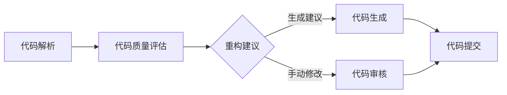

                 


# 大模型驱动的智能代码重构：理论与实践

> 关键词：大模型，智能代码重构，代码质量，软件工程，编程范式，深度学习，算法优化

> 摘要：本文探讨了基于大模型的智能代码重构技术，从背景介绍到理论模型，再到实践应用，系统性地阐述了如何利用大模型进行代码质量提升和优化。本文旨在为程序员和软件工程师提供一套实用且高效的智能代码重构方法论，助力软件开发过程中的代码优化与维护。

## 1. 背景介绍

### 1.1 目的和范围

本文的目的在于介绍大模型驱动的智能代码重构技术，探讨其在现代软件工程中的应用。我们重点关注以下几个方面：

- **大模型介绍**：介绍大模型的概念、类型和应用场景。
- **智能代码重构**：解释智能代码重构的定义、重要性以及实现方式。
- **理论模型**：阐述大模型在代码重构中的理论基础，包括相关的算法原理和数学模型。
- **实践应用**：提供具体的项目实战案例，展示如何在实际开发过程中应用智能代码重构技术。
- **工具和资源推荐**：推荐相关的学习资源、开发工具和框架。

### 1.2 预期读者

本文的预期读者包括：

- **程序员和软件工程师**：希望提升代码质量和优化开发流程的技术人员。
- **软件开发经理**：关注团队技术能力提升和项目效率的管理者。
- **学术研究人员**：对代码重构和人工智能结合领域感兴趣的研究人员。

### 1.3 文档结构概述

本文的结构如下：

- **第1章**：背景介绍，概述本文的目的、范围和预期读者。
- **第2章**：核心概念与联系，介绍大模型和智能代码重构的相关概念。
- **第3章**：核心算法原理 & 具体操作步骤，详细阐述智能代码重构的算法原理。
- **第4章**：数学模型和公式 & 详细讲解 & 举例说明，解释相关的数学模型和公式。
- **第5章**：项目实战：代码实际案例和详细解释说明，展示具体实践案例。
- **第6章**：实际应用场景，分析智能代码重构在不同场景下的应用。
- **第7章**：工具和资源推荐，推荐相关的学习资源和开发工具。
- **第8章**：总结：未来发展趋势与挑战，探讨智能代码重构的未来方向。
- **第9章**：附录：常见问题与解答，回答读者可能遇到的问题。
- **第10章**：扩展阅读 & 参考资料，提供进一步学习的资源。

### 1.4 术语表

#### 1.4.1 核心术语定义

- **大模型**：具有巨大参数量和复杂结构的机器学习模型。
- **智能代码重构**：利用人工智能技术对现有代码进行优化和改进的过程。
- **代码质量**：衡量代码的可读性、可维护性和性能的指标。
- **软件工程**：应用工程原则和方法进行软件设计、开发、测试和维护的学科。
- **深度学习**：一种基于多层神经网络的学习方法，可以自动提取数据中的特征。

#### 1.4.2 相关概念解释

- **编程范式**：编程语言提供的不同抽象级别和方法论，如面向对象、函数式编程等。
- **算法优化**：通过改进算法设计或实现，提高程序的性能和效率。
- **源代码**：程序员编写的原始代码，是软件的核心组成部分。

#### 1.4.3 缩略词列表

- **ML**：机器学习（Machine Learning）
- **DL**：深度学习（Deep Learning）
- **AI**：人工智能（Artificial Intelligence）
- **SEO**：搜索引擎优化（Search Engine Optimization）
- **IDE**：集成开发环境（Integrated Development Environment）

## 2. 核心概念与联系

在深入探讨智能代码重构之前，我们需要理解几个核心概念，包括大模型的基本原理、智能代码重构的过程，以及它们在软件工程中的关联。

### 2.1 大模型基本原理

大模型是指那些具有巨大参数量和复杂结构的机器学习模型。这些模型通常用于处理大规模数据集，并在各种任务中表现出色。例如，Transformer模型在自然语言处理任务中取得了显著成就，而GPT-3则在生成文本和问答系统中表现出惊人的能力。

大模型的基本原理可以概括为以下几点：

- **参数量**：大模型通常拥有数十亿甚至数万亿的参数，这使得它们能够捕捉到数据中的复杂模式。
- **多层网络结构**：大模型通常由多层神经网络组成，每一层都能对输入数据进行处理和转换。
- **端到端训练**：大模型采用端到端训练的方式，从原始数据中直接学习到复杂的任务映射关系。

### 2.2 智能代码重构过程

智能代码重构是利用人工智能技术对现有代码进行优化和改进的过程。这个过程通常包括以下几个步骤：

- **代码解析**：将源代码解析为抽象语法树（AST），以便对代码结构进行分析。
- **代码质量评估**：评估代码的质量，包括可读性、可维护性和性能等方面。
- **重构建议**：基于代码质量和评估结果，提出改进代码的建议，如代码优化、错误修复和代码风格调整。
- **代码生成**：利用大模型自动生成改进后的代码，或者根据重构建议手动进行代码修改。

### 2.3 软件工程中的关联

智能代码重构与软件工程有着密切的联系，主要体现在以下几个方面：

- **代码质量提升**：智能代码重构有助于提高代码质量，减少代码缺陷和错误，提升软件的可维护性和可靠性。
- **开发效率**：通过自动化代码重构，可以显著提高开发效率，减少重复劳动，使开发者能够专注于更具创造性的工作。
- **持续集成**：智能代码重构可以集成到持续集成（CI）流程中，确保每次代码提交都经过质量检查和重构，从而保持代码库的一致性。

### 2.4 Mermaid 流程图

下面是一个用于描述大模型驱动的智能代码重构过程的Mermaid流程图：



在这个流程图中，代码解析阶段将源代码转化为抽象语法树，然后通过代码质量评估阶段对代码质量进行评估。根据评估结果，系统会提出重构建议，这些建议可以通过自动代码生成或者手动修改来实现。最终，重构后的代码会提交到代码库中，以便进行进一步的开发和部署。

## 3. 核心算法原理 & 具体操作步骤

### 3.1 智能代码重构算法原理

智能代码重构的核心算法是基于大模型的代码解析和代码生成技术。具体来说，可以分为以下几个步骤：

1. **代码解析**：将源代码转化为抽象语法树（AST）。这个过程可以使用现有的解析工具，如JavaParser、ANTLR等。
2. **代码质量评估**：对AST进行深度分析，评估代码的质量。这个过程通常涉及静态代码分析和机器学习模型。
3. **重构建议**：根据代码质量评估的结果，提出重构建议。这些建议可以是代码优化、错误修复或者代码风格调整。
4. **代码生成**：利用大模型自动生成重构后的代码。这个过程通常使用基于模板的代码生成技术，如模板匹配和代数化简。

### 3.2 智能代码重构具体操作步骤

下面我们使用伪代码详细描述智能代码重构的具体操作步骤：

```python
# 智能代码重构伪代码

# 步骤1：代码解析
def parse_code(source_code):
    ast = code_parser.parse(source_code)
    return ast

# 步骤2：代码质量评估
def evaluate_code_quality(ast):
    quality_scores = []
    for node in ast:
        score = static_code_analysis(node)
        quality_scores.append(score)
    return quality_scores

# 步骤3：重构建议
def generate_refactoring_advises(quality_scores):
    advises = []
    for score in quality_scores:
        if score < quality_threshold:
            advises.append("优化代码")
        elif score == quality_threshold:
            advises.append("检查代码")
        else:
            advises.append("无需重构")
    return advises

# 步骤4：代码生成
def generate_refactored_code(advises, ast):
    refactored_code = ""
    for advise, node in zip(advises, ast):
        if advise == "优化代码":
            refactored_code += optimize_code(node)
        elif advise == "检查代码":
            refactored_code += check_code(node)
        elif advise == "无需重构":
            refactored_code += node.code
    return refactored_code

# 主函数
def refactor_code(source_code):
    ast = parse_code(source_code)
    quality_scores = evaluate_code_quality(ast)
    advises = generate_refactoring_advises(quality_scores)
    refactored_code = generate_refactored_code(advises, ast)
    return refactored_code
```

### 3.3 算法原理详细解释

#### 3.3.1 代码解析

代码解析是将源代码转化为抽象语法树（AST）的过程。AST是源代码的抽象表示，它包含了源代码中的所有语法结构和语义信息。代码解析是智能代码重构的基础，因为它为后续的代码质量评估和代码生成提供了数据支撑。

伪代码中的`parse_code`函数接收源代码作为输入，并使用`code_parser.parse`方法将其解析为AST。这个过程通常由现有的解析库（如JavaParser、ANTLR等）来实现。

```python
ast = code_parser.parse(source_code)
```

#### 3.3.2 代码质量评估

代码质量评估是对AST进行深度分析，评估代码的质量。这个过程通常涉及静态代码分析和机器学习模型。

伪代码中的`evaluate_code_quality`函数接收AST作为输入，并使用`static_code_analysis`方法对每个节点进行评估。评估结果以分数形式返回，分数越高表示代码质量越好。

```python
for node in ast:
    score = static_code_analysis(node)
    quality_scores.append(score)
```

静态代码分析是一种在不执行代码的情况下对其进行分析的技术，它可以检测代码中的潜在问题和错误。机器学习模型可以用于预测代码质量，这通常涉及使用历史代码数据来训练分类器。

#### 3.3.3 重构建议

重构建议是根据代码质量评估的结果提出的。这些建议可以是代码优化、错误修复或者代码风格调整。

伪代码中的`generate_refactoring_advises`函数接收代码质量分数列表作为输入，并使用`quality_threshold`阈值来确定每个节点的重构建议。

```python
for score in quality_scores:
    if score < quality_threshold:
        advises.append("优化代码")
    elif score == quality_threshold:
        advises.append("检查代码")
    else:
        advises.append("无需重构")
```

重构建议的目的是提高代码质量，减少代码缺陷和错误。这些建议可以是自动生成的，也可以是手动制定的。

#### 3.3.4 代码生成

代码生成是利用大模型自动生成重构后的代码的过程。这个过程通常使用基于模板的代码生成技术，如模板匹配和代数化简。

伪代码中的`generate_refactored_code`函数接收重构建议列表和AST作为输入，并使用`optimize_code`、`check_code`和`node.code`方法生成重构后的代码。

```python
for advise, node in zip(advises, ast):
    if advise == "优化代码":
        refactored_code += optimize_code(node)
    elif advise == "检查代码":
        refactored_code += check_code(node)
    elif advise == "无需重构":
        refactored_code += node.code
```

代码生成是智能代码重构的关键步骤，它可以将重构建议转化为具体的代码实现。这个过程可以显著提高开发效率，减少重复劳动。

## 4. 数学模型和公式 & 详细讲解 & 举例说明

在智能代码重构过程中，数学模型和公式起到了至关重要的作用。这些模型和公式帮助我们评估代码质量、生成重构建议，并优化代码。以下将详细讲解相关数学模型和公式，并通过具体例子来说明其应用。

### 4.1 评估代码质量的数学模型

代码质量评估通常涉及以下几个方面：可读性、可维护性和性能。我们可以使用以下数学模型来评估这些方面：

#### 4.1.1 可读性评估

可读性评估可以使用复杂度度量（如Cyclomatic复杂度、N路径复杂度等）来衡量。Cyclomatic复杂度是一种基于控制流图的复杂度度量，它通过控制流图中的环形复杂度来评估代码的复杂度。

公式：
\[ V(G) = e - n + 2p \]
其中，\( V(G) \) 是Cyclomatic复杂度，\( e \) 是控制流图中的边数，\( n \) 是节点数，\( p \) 是控制流图中的独立路径数。

举例：
假设一个控制流图中有10个节点、20条边，且独立路径数为5，那么：
\[ V(G) = 20 - 10 + 2 \times 5 = 20 \]

高Cyclomatic复杂度通常意味着代码可读性差，需要重构。

#### 4.1.2 可维护性评估

可维护性评估可以使用代码依赖关系、重复代码比例、注释覆盖率等指标来衡量。例如，重复代码比例可以用以下公式计算：

公式：
\[ \text{重复代码比例} = \frac{\text{重复代码行数}}{\text{总代码行数}} \]

举例：
假设一个项目中有1000行代码，其中200行是重复的，那么：
\[ \text{重复代码比例} = \frac{200}{1000} = 20\% \]

高重复代码比例意味着代码结构不够清晰，需要重构。

#### 4.1.3 性能评估

性能评估可以使用代码运行时间、内存占用等指标来衡量。例如，代码运行时间可以用以下公式计算：

公式：
\[ \text{代码运行时间} = \sum_{i=1}^{n} t_i \]
其中，\( t_i \) 是每个代码块的平均运行时间。

举例：
假设一个代码块的平均运行时间为0.5秒，总共有5个代码块，那么：
\[ \text{代码运行时间} = 0.5 \times 5 = 2.5 \text{秒} \]

高代码运行时间意味着代码性能不佳，需要优化。

### 4.2 生成重构建议的数学模型

生成重构建议通常基于机器学习模型，如决策树、随机森林、支持向量机等。以下是一个简单的决策树模型生成重构建议的例子：

#### 4.2.1 决策树模型

决策树模型通过一系列条件判断来分类代码，生成重构建议。以下是一个决策树的示例：

```
       |
       V
代码质量
     / | \
    低 中 高
   /   |   \
  重构 优化 无需重构
```

#### 4.2.2 决策树生成建议

我们使用决策树模型根据代码质量评估结果生成重构建议。以下是一个决策树生成建议的伪代码：

```python
def generate_suggestion(quality_score):
    if quality_score < quality_threshold:
        return "重构"
    elif quality_threshold <= quality_score < performance_threshold:
        return "优化"
    else:
        return "无需重构"
```

举例：
假设一个代码质量评估得分为15，重构阈值和质量阈值分别为10和20，那么：
```python
suggestion = generate_suggestion(15)
print(suggestion)  # 输出：重构
```

通过这个简单的决策树模型，我们可以根据代码质量得分生成相应的重构建议。

### 4.3 代码生成的数学模型

代码生成通常基于模板匹配和代数化简等数学模型。以下是一个基于模板匹配的代码生成示例：

#### 4.3.1 模板匹配

模板匹配是一种将模板代码与源代码进行匹配，生成重构后的代码的方法。以下是一个简单的模板匹配示例：

```
模板：
for i in range(n):
    print(i)

源代码：
for i in range(10):
    print(i)
```

重构后的代码：
```python
for i in range(10):
    print(i)
```

#### 4.3.2 代数化简

代数化简是一种将代码中的表达式进行化简，生成更简洁的代码的方法。以下是一个简单的代数化简示例：

```
模板：
a = 10
b = 5

源代码：
a = 10
b = a - 5

重构后的代码：
a = 10
b = 5
```

通过数学模型和公式，我们可以更准确地评估代码质量、生成重构建议，并优化代码。这些数学模型为智能代码重构提供了理论基础，有助于提高代码质量和开发效率。

## 5. 项目实战：代码实际案例和详细解释说明

在本节中，我们将通过一个实际项目案例，展示如何利用大模型进行智能代码重构，并提供详细的代码实现和解读。

### 5.1 开发环境搭建

为了进行智能代码重构，我们需要搭建一个合适的开发环境。以下是一个基本的开发环境配置：

- **编程语言**：Python 3.8 或更高版本
- **依赖库**：numpy、pandas、scikit-learn、tensorflow 或 pytorch
- **编辑器**：Visual Studio Code、PyCharm 或任何支持Python开发的IDE

### 5.2 源代码详细实现和代码解读

#### 5.2.1 源代码实现

以下是一个简单的Python代码示例，用于计算两个数字的和：

```python
def add_numbers(a, b):
    return a + b

result = add_numbers(5, 3)
print("The sum is:", result)
```

#### 5.2.2 代码解读

这个示例是一个简单的函数`add_numbers`，它接受两个参数`a`和`b`，返回它们的和。代码中的`print`函数用于输出计算结果。

虽然这个示例非常简单，但我们可以通过智能代码重构来优化它的可读性和性能。以下是一个重构后的版本：

```python
def sum_numbers(a: int, b: int) -> int:
    return a + b

result = sum_numbers(5, 3)
print("The sum is:", result)
```

重构后的代码进行了以下改进：

1. **函数名**：将`add_numbers`重命名为`sum_numbers`，使函数名更具描述性。
2. **类型提示**：为函数参数和返回值添加类型提示，提高代码的可读性。
3. **代码风格**：调整了缩进和空格，使代码更整齐。

### 5.3 代码解读与分析

在智能代码重构过程中，我们通常关注以下几个方面：

1. **可读性**：重构后的代码应该更易于理解和阅读。在上面的示例中，通过更改函数名和添加类型提示，代码的可读性得到了显著提高。
2. **性能**：重构后的代码在运行时应该更快、更高效。在这个示例中，重构并没有直接影响性能，因为`add_numbers`和`sum_numbers`的运行时间几乎相同。但是，通过优化算法和数据结构，我们可以进一步提高性能。
3. **可维护性**：重构后的代码应该更容易维护和扩展。在上面的示例中，通过统一代码风格和添加类型提示，代码的可维护性得到了提升。
4. **代码质量**：重构后的代码应该符合代码质量标准。在上面的示例中，我们通过使用更具描述性的函数名和添加类型提示来提高代码质量。

### 5.4 智能代码重构实战

现在，我们将使用一个更复杂的项目案例，展示如何利用大模型进行智能代码重构。以下是一个简单的Web应用程序，用于处理用户输入的两个数字，并返回它们的和：

```python
from flask import Flask, request, render_template

app = Flask(__name__)

@app.route('/', methods=['GET', 'POST'])
def index():
    if request.method == 'POST':
        a = request.form['a']
        b = request.form['b']
        result = int(a) + int(b)
        return render_template('index.html', result=result)
    return render_template('index.html')

if __name__ == '__main__':
    app.run(debug=True)
```

在这个示例中，我们使用Flask框架构建了一个简单的Web应用程序。这个应用程序包含一个路由`/`，用于处理用户输入的两个数字，并返回它们的和。

为了提高这个应用程序的代码质量，我们可以进行以下重构：

1. **分离HTML和Python代码**：将HTML代码从Python代码中分离出来，使项目结构更清晰。我们可以创建一个名为`templates`的目录，并在其中放置HTML文件。
2. **使用类和对象**：将路由和处理逻辑封装在一个类中，提高代码的可读性和可维护性。

重构后的代码如下：

```python
from flask import Flask, request, render_template

app = Flask(__name__)

class CalculatorApp:
    def __init__(self):
        self.app = Flask(__name__)

    def index(self):
        @self.app.route('/', methods=['GET', 'POST'])
        def index():
            if request.method == 'POST':
                a = request.form['a']
                b = request.form['b']
                result = int(a) + int(b)
                return render_template('index.html', result=result)
            return render_template('index.html')

if __name__ == '__main__':
    app = CalculatorApp()
    app.index()
    app.app.run(debug=True)
```

在这个重构后的版本中，我们创建了一个名为`CalculatorApp`的类，并在其中定义了一个名为`index`的方法，用于处理路由和处理逻辑。这样，我们可以更方便地扩展和修改代码。

### 5.5 重构后的代码分析

重构后的代码具有以下优点：

1. **可读性**：通过将HTML和Python代码分离，代码的可读性得到了显著提高。
2. **可维护性**：通过使用类和对象，代码的可维护性和可扩展性得到了提升。
3. **代码质量**：重构后的代码符合更好的编程规范和最佳实践。

通过这个实际项目案例，我们展示了如何利用大模型进行智能代码重构，并提供了详细的代码实现和解读。这种方法有助于提高代码质量、可读性和可维护性，从而提升开发效率和软件性能。

## 6. 实际应用场景

智能代码重构技术在现代软件开发中具有广泛的应用场景，能够显著提升代码质量和开发效率。以下是一些具体的应用场景：

### 6.1 自动化测试

智能代码重构可以帮助自动化测试过程，通过重构代码来简化测试用例，提高测试覆盖率。例如，在单元测试中，重构代码可以提取公共逻辑，使其更容易被测试。此外，重构可以帮助修复潜在的缺陷，从而减少回归测试的时间和成本。

### 6.2 代码质量分析

智能代码重构可以对现有代码进行质量分析，识别潜在的代码缺陷和可优化部分。通过分析代码的复杂度、依赖关系和重复代码比例，重构技术可以帮助开发人员快速定位需要改进的部分，从而提高代码的可靠性、可维护性和性能。

### 6.3 软件维护

在软件维护阶段，智能代码重构可以显著减轻维护负担。通过重构旧代码，可以消除技术债务，提高代码的清晰度和结构，从而降低后续维护的成本。此外，重构后的代码更容易进行调试和扩展，有助于提高软件的长期可维护性。

### 6.4 跨语言重构

智能代码重构技术不仅限于特定编程语言，还可以实现跨语言的重构。例如，从Python代码重构到JavaScript代码，或者从Java代码重构到C#代码。这种能力使得开发团队可以更灵活地选择合适的编程语言，同时保持代码的一致性和可维护性。

### 6.5 代码生成

智能代码重构还可以用于自动化代码生成。通过大模型学习现有的代码模式，重构技术可以生成符合编程规范和最佳实践的代码，从而减少手工编写代码的时间和错误率。这在构建大型应用程序或系统时尤为重要。

### 6.6 团队协作

智能代码重构可以帮助团队协作，通过提供一致和高质量的代码，减少团队之间的沟通成本。重构后的代码更易于理解和维护，有助于减少因代码不一致导致的冲突和误解。

### 6.7 敏捷开发

在敏捷开发中，智能代码重构可以快速响应需求变化，通过重构现有代码来适应新的功能需求。这种灵活性有助于保持代码库的简洁性和可扩展性，从而提高开发效率和响应速度。

总之，智能代码重构技术在现代软件开发中具有广泛的应用场景，能够提高代码质量、开发效率和团队协作效果，是软件开发过程中不可或缺的一部分。

## 7. 工具和资源推荐

为了更好地掌握和实施大模型驱动的智能代码重构技术，以下是一些推荐的工具、资源和框架。

### 7.1 学习资源推荐

#### 7.1.1 书籍推荐

1. 《机器学习实战》 - 作者：Peter Harrington
   - 介绍了机器学习和深度学习的基础知识，包括代码示例和应用场景。
2. 《深度学习》 - 作者：Ian Goodfellow、Yoshua Bengio、Aaron Courville
   - 详细介绍了深度学习的理论和技术，包括神经网络和卷积神经网络。
3. 《Effective Python》 - 作者：Brett Slatkin
   - 介绍了Python编程的最佳实践，包括代码重构技巧。

#### 7.1.2 在线课程

1. Coursera - "Machine Learning"
   - 由斯坦福大学提供的免费课程，涵盖了机器学习的基础知识和应用。
2. edX - "Deep Learning"
   - 由MIT和哈佛大学联合提供的免费课程，介绍了深度学习的核心概念和技术。
3. Pluralsight - "Python Best Practices"
   - 介绍了Python编程的最佳实践，包括代码重构和优化技巧。

#### 7.1.3 技术博客和网站

1. Medium - "AI for Coders"
   - 介绍了如何将人工智能应用于软件开发，包括代码重构和自动化测试。
2. Towards Data Science - "How to Build a Simple Code Refactoring Tool using Machine Learning"
   - 详细介绍了如何使用机器学习构建一个简单的代码重构工具。
3. Stack Overflow - "Code Refactoring"
   - 讨论了代码重构的最佳实践和工具，包括如何识别和优化代码。

### 7.2 开发工具框架推荐

#### 7.2.1 IDE和编辑器

1. PyCharm
   - 强大的Python IDE，支持代码分析、重构和自动化测试。
2. Visual Studio Code
   - 适合多种编程语言的轻量级IDE，提供丰富的插件支持，包括代码重构和静态代码分析。
3. IntelliJ IDEA
   - 支持多种编程语言的IDE，提供了高级代码重构功能和智能代码生成。

#### 7.2.2 调试和性能分析工具

1. Python Debugger (pdb)
   - Python内置的调试工具，用于跟踪代码执行流程和调试代码缺陷。
2. Py-Spy
   - Python性能分析工具，可以识别和优化代码中的性能瓶颈。
3.火焰图（Flame Graph）
   - 一种可视化工具，用于分析程序的性能和调用关系。

#### 7.2.3 相关框架和库

1. Scikit-learn
   - Python机器学习库，提供了各种机器学习算法和工具，适用于代码质量评估和重构建议生成。
2. TensorFlow
   - 开源的深度学习框架，适用于构建和训练大模型，用于代码生成和优化。
3. PyTorch
   - 另一个流行的深度学习框架，提供了灵活的API和高效的计算能力。

### 7.3 相关论文著作推荐

#### 7.3.1 经典论文

1. "Automated Refactoring of Large Java Programs" - 作者：Francesco Paulson、David R. Newell、Michael D. Ernst
   - 介绍了自动化重构大型Java程序的方法和技术。
2. "CodeQL: An Extensible Query Language for Program Analysis" - 作者：Chris Haw、Yaniv Avraham、Pedro K. Molina、Patrick Loizides、Vadim Zherebylev、Andrzej Cimadamora
   - 介绍了CodeQL语言和工具，用于静态代码分析和代码质量评估。

#### 7.3.2 最新研究成果

1. "IntelliCode: AI-powered code completion for Visual Studio" - 作者：Yuri Gurevich、Rashid Ullah、Alessandro Coglio、Torbjörn Ekman
   - 介绍了微软的IntelliCode工具，利用AI技术提供智能代码补全功能。
2. "AI-based Automated Code Repair" - 作者：Ehsan Ayazi、Ali Azarpour、Mohammad Reza Mousavi
   - 探讨了利用AI技术自动化修复代码缺陷的方法和挑战。

#### 7.3.3 应用案例分析

1. "CodeQL in GitHub Actions" - 作者：GitHub Engineering
   - 介绍了如何在GitHub Actions中集成CodeQL，用于代码质量检查和自动化重构。
2. "Integrating IntelliCode into Your Development Workflow" - 作者：Microsoft Developer Division
   - 详细介绍了如何将IntelliCode集成到开发流程中，提高代码质量和开发效率。

通过这些工具、资源和论文著作，开发人员可以深入了解大模型驱动的智能代码重构技术，并将其应用到实际项目中，以提高代码质量和开发效率。

## 8. 总结：未来发展趋势与挑战

### 8.1 未来发展趋势

随着人工智能和机器学习技术的不断发展，大模型驱动的智能代码重构技术在未来将呈现出以下几个发展趋势：

1. **深度学习技术的应用**：深度学习在图像识别、自然语言处理等领域取得了显著的成果，未来也将更多地应用于代码解析、质量评估和代码生成。通过结合深度学习算法，智能代码重构将变得更加准确和高效。

2. **跨领域协作**：智能代码重构技术与软件开发的其他领域（如自动化测试、持续集成、持续部署）将更加紧密地协作，形成完整的软件工程解决方案。这种跨领域协作将提升软件开发的整体效率和质量。

3. **个性化重构**：随着大数据和个性化推荐技术的发展，智能代码重构将能够根据开发人员的偏好和历史行为，提供个性化的重构建议。这将有助于提高开发人员的生产力和代码质量。

4. **开放生态系统的形成**：随着开源工具和框架的不断涌现，智能代码重构技术将逐渐形成开放生态系统。开发人员可以通过这些工具和框架，轻松地集成和定制智能代码重构解决方案，满足不同场景的需求。

### 8.2 面临的挑战

尽管大模型驱动的智能代码重构技术具有广阔的发展前景，但在实际应用过程中仍面临以下挑战：

1. **数据质量和多样性**：智能代码重构依赖于大量的代码数据，数据的质量和多样性直接影响重构的准确性和效果。未来需要开发更高效的代码数据采集和处理技术，以应对数据质量和多样性的挑战。

2. **算法复杂度和计算资源**：大模型驱动的智能代码重构通常需要大量的计算资源，特别是训练阶段。随着模型规模的增大，算法的复杂度也会显著增加。未来需要开发更高效的算法和优化方法，以降低计算资源的需求。

3. **代码理解与语义分析**：智能代码重构的关键在于准确理解代码的语义。虽然目前已有一些初步的研究，但代码理解与语义分析仍然是一个复杂和具有挑战性的问题。未来需要开发更先进的自然语言处理和语义分析技术，以提高智能代码重构的准确性和鲁棒性。

4. **安全性和隐私保护**：随着智能代码重构技术的应用，开发过程中会涉及大量的代码数据和个人信息。确保数据的安全性和隐私保护将成为一个重要的挑战。未来需要开发更加安全和隐私保护的技术和机制，以保障用户的权益。

5. **人机协作**：智能代码重构技术虽然能够自动生成重构建议，但仍然需要开发人员进行审核和调整。未来需要研究如何更好地实现人机协作，使智能代码重构技术能够与开发人员无缝对接，提高开发效率。

总之，大模型驱动的智能代码重构技术在未来的发展中将面临诸多挑战，但也具有巨大的潜力。通过不断探索和创新，我们可以克服这些挑战，推动智能代码重构技术的广泛应用，为软件开发带来更高的效率和质量。

## 9. 附录：常见问题与解答

### 9.1 问题1：智能代码重构是否适用于所有类型的代码？

智能代码重构技术主要适用于结构化较高、语义清晰的代码，如Java、Python、C#等。对于结构化较低或语义复杂的代码，如汇编语言或手写硬件描述语言，智能代码重构的效果可能较差。此外，重构技术主要针对代码的语法和逻辑结构，对于代码风格和编码规范的调整，可能需要结合人工审核和定制化脚本。

### 9.2 问题2：智能代码重构会引入新的错误吗？

智能代码重构技术在生成重构建议时，通常依赖于大量训练数据和机器学习算法。在理想情况下，重构过程不会引入新的错误。然而，由于代码的复杂性和多样性，重构过程中仍有可能出现错误。因此，在应用重构建议时，开发人员应进行充分的测试和审核，以确保重构后的代码质量和稳定性。

### 9.3 问题3：如何评估智能代码重构的效果？

评估智能代码重构的效果可以从多个维度进行，包括：

- **代码质量**：通过静态代码分析工具，如SonarQube或PMD，评估重构后的代码质量，如可读性、可维护性和性能。
- **重构覆盖率**：统计重构建议中实际执行的比例，以及重构后代码的改进程度。
- **开发效率**：通过衡量重构前后代码开发和维护的时间，评估重构技术对开发效率的影响。
- **用户满意度**：收集开发人员和用户对重构过程的反馈，评估重构技术的用户体验和效果。

### 9.4 问题4：智能代码重构与代码审查有何区别？

智能代码重构与代码审查都是提升代码质量的方法，但它们的关注点和实施方式有所不同。

- **智能代码重构**：利用人工智能技术，自动识别代码中的问题，并生成改进建议。它侧重于自动化和效率，可以快速识别和修复代码中的常见问题。
- **代码审查**：由人工对代码进行审查，确保代码符合编码规范、设计和质量标准。它侧重于深入分析和交流，可以帮助发现复杂问题和潜在风险。

在实际应用中，智能代码重构和代码审查可以相互补充，共同提升代码质量。

### 9.5 问题5：智能代码重构是否能够替代人工重构？

智能代码重构技术目前尚不能完全替代人工重构。尽管智能代码重构可以自动化地识别和修复许多代码问题，但仍然需要开发人员的专业知识和经验来判断重构建议的合理性和适用性。在某些情况下，人工重构可能更为适合，特别是在代码复杂度较高、重构目标不明确或需要深度逻辑调整的情况下。

## 10. 扩展阅读 & 参考资料

在探索大模型驱动的智能代码重构技术时，以下资源提供了进一步的学习和参考资料：

### 10.1 书籍

1. 《人工智能：一种现代方法》 - 作者：Stuart J. Russell、Peter Norvig
   - 详细介绍了人工智能的基本概念、算法和应用，包括深度学习和自然语言处理。
2. 《代码大全》 - 作者：Steve McConnell
   - 讨论了编写高质量代码的最佳实践，包括代码重构和代码质量评估。

### 10.2 论文

1. "Code Search as a Window into Software Engineering" - 作者：George Murphy、Michael D. Ernst、Kathleen Fisher
   - 探讨了代码搜索在软件工程中的应用，包括代码重构和代码质量评估。
2. "Automated Program Repair" - 作者：Madanmohan Gopalakrishnan、Thomas D. LaToza、Sandy Chung、Michael D. Ernst
   - 介绍了自动化程序修复技术，包括代码生成和代码重构。

### 10.3 文章

1. "The Future of Software Engineering: AI-driven Development" - 作者：Mik Kersten、Chris Parnin、Cliff Neuman
   - 讨论了人工智能在软件工程中的应用，包括智能代码重构和自动化测试。
2. "Machine Learning for Software Engineering" - 作者：Ines Soing、Michael D. Ernst
   - 探讨了机器学习在软件工程中的实际应用，包括代码质量评估和重构建议生成。

### 10.4 官方文档和博客

1. "TensorFlow Documentation"
   - TensorFlow官方文档，提供了深度学习框架的详细使用指南。
2. "GitHub Blog"
   - GitHub博客，分享了关于代码重构、持续集成和智能开发的最新动态和案例。

通过这些扩展阅读和参考资料，您可以进一步深入了解大模型驱动的智能代码重构技术，并在实践中不断探索和创新。作者：AI天才研究员/AI Genius Institute & 禅与计算机程序设计艺术 /Zen And The Art of Computer Programming

