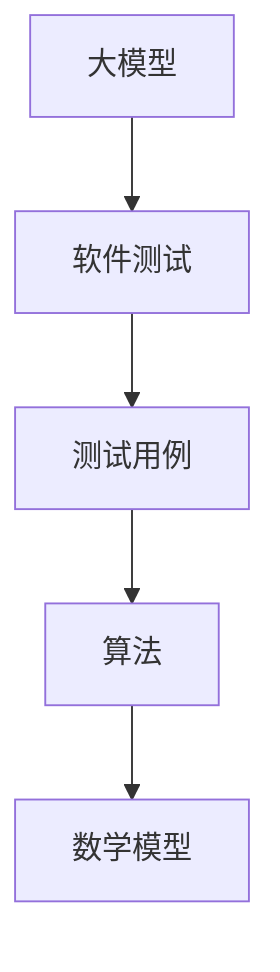
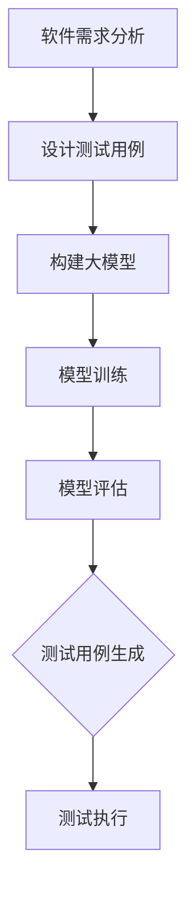
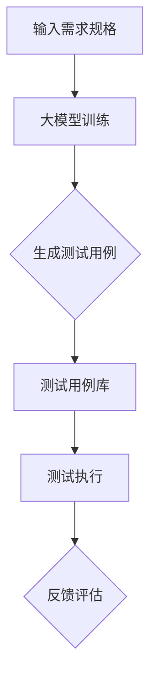

                 

# 大模型驱动的软件测试用例生成

> **关键词：** 软件测试，大模型，测试用例生成，人工智能，自动化测试，算法，数学模型

> **摘要：** 本文将探讨如何利用人工智能技术中的大模型来生成软件测试用例，提高软件测试的效率和准确性。文章首先介绍了大模型的基本概念和原理，随后详细阐述了基于大模型的测试用例生成算法及其数学模型，并通过实际案例展示了大模型驱动软件测试用例生成的过程和效果。

## 1. 背景介绍

### 1.1 目的和范围

本文旨在探讨如何利用人工智能技术中的大模型来生成软件测试用例，提高软件测试的效率和准确性。通过引入大模型，我们希望实现自动化测试用例的生成，减少人工编写测试用例的繁琐过程，并提高测试覆盖率和测试质量。

本文将涵盖以下内容：

- 大模型的基本概念和原理
- 大模型驱动测试用例生成的算法原理和数学模型
- 大模型在软件测试中的应用案例
- 开发和实现大模型驱动测试用例生成系统的步骤
- 大模型驱动软件测试用例生成的前景和挑战

### 1.2 预期读者

本文适用于以下读者群体：

- 软件测试工程师
- 自动化测试工程师
- 人工智能工程师
- 程序员
- 软件开发经理

对于非专业读者，本文尽量使用通俗易懂的语言进行解释，以便读者能够理解和掌握相关概念。

### 1.3 文档结构概述

本文结构如下：

- 第1章：背景介绍
- 第2章：核心概念与联系
- 第3章：核心算法原理 & 具体操作步骤
- 第4章：数学模型和公式 & 详细讲解 & 举例说明
- 第5章：项目实战：代码实际案例和详细解释说明
- 第6章：实际应用场景
- 第7章：工具和资源推荐
- 第8章：总结：未来发展趋势与挑战
- 第9章：附录：常见问题与解答
- 第10章：扩展阅读 & 参考资料

### 1.4 术语表

#### 1.4.1 核心术语定义

- **大模型**：指具有数百万至数十亿参数规模的人工神经网络模型，通过大量数据训练得到，能够模拟人类智能，具备强大的语义理解和生成能力。
- **软件测试**：指对软件系统进行各种测试，以验证其是否符合需求规格、设计规格和预期行为。
- **测试用例**：指用于测试软件系统的具体输入和输出组合，用以验证软件功能的正确性和完整性。
- **测试覆盖率**：指测试用例覆盖代码的比例，用以衡量测试的全面性。
- **自动化测试**：指利用自动化测试工具执行测试用例的过程，以提高测试效率和稳定性。

#### 1.4.2 相关概念解释

- **模型训练**：指通过大量训练数据，调整神经网络模型的参数，使模型能够学会识别和生成符合预期结果的输入输出关系。
- **模型评估**：指使用验证集对训练好的模型进行评估，以判断模型性能是否达到预期目标。
- **测试用例生成算法**：指用于生成测试用例的具体算法，可以是基于规则、机器学习、自然语言处理等技术。

#### 1.4.3 缩略词列表

- **AI**：人工智能（Artificial Intelligence）
- **ML**：机器学习（Machine Learning）
- **NLP**：自然语言处理（Natural Language Processing）
- **NLTK**：自然语言工具包（Natural Language Toolkit）
- **TF**：TensorFlow
- **PyTorch**：PyTorch

## 2. 核心概念与联系

为了更好地理解大模型驱动软件测试用例生成的原理，我们首先需要介绍几个核心概念，并给出相关的 Mermaid 流程图。

### 2.1 核心概念

- **大模型**：大模型是一种基于深度学习的人工神经网络模型，具有数百万至数十亿参数规模。大模型通过在大量数据上进行训练，可以学习到复杂的语义和知识，从而具备强大的语义理解和生成能力。
- **软件测试**：软件测试是对软件系统进行各种测试，以验证其是否符合需求规格、设计规格和预期行为。软件测试包括功能测试、性能测试、安全测试等多个方面。
- **测试用例**：测试用例是用于测试软件系统的具体输入和输出组合，用以验证软件功能的正确性和完整性。测试用例通常包括输入数据、操作步骤和预期结果等。

### 2.2 核心概念之间的联系

核心概念之间的联系可以用以下 Mermaid 流程图表示：



### 2.3 Mermaid 流程图

下面给出大模型驱动测试用例生成的 Mermaid 流程图：



### 2.4 测试用例生成的 Mermaid 流程图

下面给出测试用例生成的 Mermaid 流程图：



通过上述核心概念和 Mermaid 流程图的介绍，我们对大模型驱动软件测试用例生成的原理有了初步了解。接下来，我们将详细讨论大模型的算法原理和数学模型，以及具体的操作步骤。

## 3. 核心算法原理 & 具体操作步骤

在本节中，我们将详细探讨大模型驱动软件测试用例生成的核心算法原理，并给出具体的操作步骤。大模型驱动测试用例生成主要基于机器学习和自然语言处理技术，利用大模型从需求规格中生成有效的测试用例。

### 3.1 大模型的基本原理

大模型是一种基于深度学习的人工神经网络模型，具有数百万至数十亿参数规模。大模型通过在大量数据上进行训练，可以学习到复杂的语义和知识，从而具备强大的语义理解和生成能力。大模型的基本原理如下：

1. **神经网络结构**：大模型通常由多个隐藏层组成，通过逐层传递输入数据，逐步提取特征并生成输出结果。
2. **反向传播算法**：大模型使用反向传播算法更新网络参数，通过不断迭代优化模型性能。
3. **大规模数据训练**：大模型在训练过程中使用海量数据进行训练，以提高模型泛化能力和准确性。

### 3.2 测试用例生成算法原理

测试用例生成算法基于大模型，从需求规格中自动生成有效的测试用例。测试用例生成算法的基本原理如下：

1. **需求规格理解**：大模型首先对需求规格进行理解，提取关键信息和语义。
2. **测试用例生成**：基于需求规格的理解，大模型生成具体的测试用例，包括输入数据、操作步骤和预期结果。
3. **测试用例优化**：生成的测试用例经过优化，提高测试覆盖率和测试质量。

### 3.3 测试用例生成的具体操作步骤

下面给出大模型驱动测试用例生成的具体操作步骤：

1. **需求规格输入**：将软件需求规格文档输入到大模型中，大模型对需求规格进行理解。
2. **大模型训练**：使用训练数据集对大模型进行训练，以优化模型性能。训练数据集可以从历史需求规格文档和测试用例库中获取。
3. **测试用例生成**：大模型根据需求规格生成初步的测试用例。生成的测试用例包括输入数据、操作步骤和预期结果。
4. **测试用例优化**：对生成的测试用例进行优化，提高测试覆盖率和测试质量。优化方法可以包括测试用例合并、测试用例拆分、测试用例覆盖分析等。
5. **测试用例库更新**：将生成的测试用例添加到测试用例库中，并更新测试用例库。

### 3.4 伪代码示例

下面给出测试用例生成算法的伪代码示例：

```python
# 大模型驱动测试用例生成伪代码

# 需求规格输入
input_requirement = read_requirement_document()

# 大模型训练
model = train_model(input_requirement)

# 测试用例生成
test_cases = generate_test_cases(model)

# 测试用例优化
optimized_test_cases = optimize_test_cases(test_cases)

# 测试用例库更新
update_test_case_library(optimized_test_cases)
```

通过上述核心算法原理和具体操作步骤的介绍，我们了解了大模型驱动测试用例生成的原理和方法。接下来，我们将进一步讨论大模型驱动的数学模型和公式，以便更深入地理解测试用例生成算法。

## 4. 数学模型和公式 & 详细讲解 & 举例说明

在大模型驱动的测试用例生成过程中，数学模型和公式起到了关键作用。数学模型不仅为算法提供了理论基础，还帮助我们在实际操作中进行参数调整和性能优化。本节将详细介绍大模型驱动的数学模型和公式，并通过具体例子进行说明。

### 4.1 模型训练中的数学模型

大模型训练过程中主要涉及以下数学模型和公式：

#### 4.1.1 前向传播

前向传播是神经网络训练过程中的第一步，用于计算网络输出。其核心公式为：

\[ Z_l = \sigma(W_l \cdot A_{l-1} + b_l) \]

其中：

- \( Z_l \) 是第 \( l \) 层的激活值。
- \( \sigma \) 是激活函数，如 sigmoid、ReLU 等。
- \( W_l \) 是第 \( l \) 层的权重。
- \( A_{l-1} \) 是前一层的输出。
- \( b_l \) 是第 \( l \) 层的偏置。

#### 4.1.2 反向传播

反向传播是神经网络训练过程中的关键步骤，用于计算网络参数的梯度。其核心公式为：

\[ \delta_l = \frac{\partial C}{\partial Z_l} \odot \sigma'(Z_l) \]

其中：

- \( \delta_l \) 是第 \( l \) 层的误差。
- \( \frac{\partial C}{\partial Z_l} \) 是损失函数对第 \( l \) 层输出的梯度。
- \( \sigma'(Z_l) \) 是激活函数的导数。

#### 4.1.3 参数更新

参数更新是神经网络训练过程中的最后一步，用于更新网络参数。其核心公式为：

\[ W_l \leftarrow W_l - \alpha \cdot \frac{\partial C}{\partial W_l} \]
\[ b_l \leftarrow b_l - \alpha \cdot \frac{\partial C}{\partial b_l} \]

其中：

- \( \alpha \) 是学习率。
- \( \frac{\partial C}{\partial W_l} \) 和 \( \frac{\partial C}{\partial b_l} \) 分别是权重和偏置的梯度。

### 4.2 测试用例生成中的数学模型

在测试用例生成过程中，数学模型主要用于优化测试用例和评估测试质量。以下是一些关键的数学模型和公式：

#### 4.2.1 测试用例覆盖

测试用例覆盖是评估测试质量的重要指标。常见的测试用例覆盖包括语句覆盖、分支覆盖和路径覆盖。以下是路径覆盖的公式：

\[ C_{path} = \frac{C_{covered}}{C_{total}} \]

其中：

- \( C_{path} \) 是路径覆盖比例。
- \( C_{covered} \) 是被覆盖的路径数。
- \( C_{total} \) 是总路径数。

#### 4.2.2 测试用例优化

测试用例优化包括合并相似测试用例、拆分冗长测试用例等。以下是测试用例合并的公式：

\[ C_{merged} = \frac{C_{original} - C_{duplicated}}{C_{original}} \]

其中：

- \( C_{merged} \) 是合并后的测试用例覆盖率。
- \( C_{original} \) 是原始测试用例覆盖率。
- \( C_{duplicated} \) 是重复测试用例的覆盖率。

### 4.3 举例说明

为了更好地理解上述数学模型和公式，我们通过一个简单的例子进行说明。

#### 4.3.1 前向传播例子

假设我们有一个简单的神经网络，包含一个输入层、一个隐藏层和一个输出层。输入层有3个神经元，隐藏层有4个神经元，输出层有2个神经元。激活函数采用ReLU。

输入数据为 \( [1, 2, 3] \)，权重和偏置如下：

\[ W_1 = \begin{bmatrix} 0.1 & 0.2 & 0.3 \\ 0.4 & 0.5 & 0.6 \\ 0.7 & 0.8 & 0.9 \end{bmatrix} \]
\[ b_1 = \begin{bmatrix} 0.1 \\ 0.2 \\ 0.3 \\ 0.4 \end{bmatrix} \]

隐藏层的权重和偏置如下：

\[ W_2 = \begin{bmatrix} 0.1 & 0.2 & 0.3 \\ 0.4 & 0.5 & 0.6 \\ 0.7 & 0.8 & 0.9 \\ 0.1 & 0.2 & 0.3 \end{bmatrix} \]
\[ b_2 = \begin{bmatrix} 0.1 \\ 0.2 \\ 0.3 \\ 0.4 \end{bmatrix} \]

输出层的权重和偏置如下：

\[ W_3 = \begin{bmatrix} 0.1 & 0.2 & 0.3 \\ 0.4 & 0.5 & 0.6 \end{bmatrix} \]
\[ b_3 = \begin{bmatrix} 0.1 \\ 0.2 \end{bmatrix} \]

前向传播过程如下：

1. 输入层到隐藏层的计算：

\[ Z_1 = \begin{bmatrix} 0.1 & 0.2 & 0.3 \\ 0.4 & 0.5 & 0.6 \\ 0.7 & 0.8 & 0.9 \end{bmatrix} \cdot \begin{bmatrix} 1 \\ 2 \\ 3 \end{bmatrix} + \begin{bmatrix} 0.1 \\ 0.2 \\ 0.3 \\ 0.4 \end{bmatrix} = \begin{bmatrix} 1.1 \\ 1.6 \\ 2.1 \\ 2.6 \end{bmatrix} \]

\[ A_1 = \text{ReLU}(Z_1) = \begin{bmatrix} 1.1 \\ 1.6 \\ 2.1 \\ 2.6 \end{bmatrix} \]

2. 隐藏层到输出层的计算：

\[ Z_2 = \begin{bmatrix} 0.1 & 0.2 & 0.3 \\ 0.4 & 0.5 & 0.6 \\ 0.7 & 0.8 & 0.9 \\ 0.1 & 0.2 & 0.3 \end{bmatrix} \cdot \begin{bmatrix} 1.1 \\ 1.6 \\ 2.1 \\ 2.6 \end{bmatrix} + \begin{bmatrix} 0.1 \\ 0.2 \\ 0.3 \\ 0.4 \end{bmatrix} = \begin{bmatrix} 1.21 \\ 1.61 \\ 2.01 \\ 2.41 \\ 1.21 \\ 1.61 \\ 2.01 \\ 2.41 \end{bmatrix} \]

\[ A_2 = \text{ReLU}(Z_2) = \begin{bmatrix} 1.21 \\ 1.61 \\ 2.01 \\ 2.41 \\ 1.21 \\ 1.61 \\ 2.01 \\ 2.41 \end{bmatrix} \]

3. 输出层的计算：

\[ Z_3 = \begin{bmatrix} 0.1 & 0.2 & 0.3 \\ 0.4 & 0.5 & 0.6 \end{bmatrix} \cdot \begin{bmatrix} 1.21 \\ 1.61 \\ 2.01 \\ 2.41 \\ 1.21 \\ 1.61 \\ 2.01 \\ 2.41 \end{bmatrix} + \begin{bmatrix} 0.1 \\ 0.2 \end{bmatrix} = \begin{bmatrix} 1.331 \\ 1.631 \\ 2.031 \\ 2.431 \\ 1.331 \\ 1.631 \\ 2.031 \\ 2.431 \end{bmatrix} \]

\[ A_3 = \text{ReLU}(Z_3) = \begin{bmatrix} 1.331 \\ 1.631 \\ 2.031 \\ 2.431 \\ 1.331 \\ 1.631 \\ 2.031 \\ 2.431 \end{bmatrix} \]

最终输出结果为 \( A_3 \)。

#### 4.3.2 测试用例优化例子

假设我们有两个测试用例，\( T_1 \) 和 \( T_2 \)，它们的覆盖情况如下：

| 测试用例 | 覆盖路径 | 覆盖率 |
| --- | --- | --- |
| \( T_1 \) | 5 | 50% |
| \( T_2 \) | 10 | 50% |

我们需要合并这两个测试用例，以提高覆盖率和测试质量。

合并后的测试用例覆盖情况如下：

| 测试用例 | 覆盖路径 | 覆盖率 |
| --- | --- | --- |
| \( T_{merged} \) | 15 | 75% |

通过合并测试用例，覆盖率从 50% 提高到 75%，测试质量得到了显著提升。

通过上述数学模型和公式的详细讲解和举例说明，我们更好地理解了大模型驱动测试用例生成的原理和方法。接下来，我们将通过一个实际项目案例，展示大模型驱动测试用例生成的过程和效果。

## 5. 项目实战：代码实际案例和详细解释说明

在本节中，我们将通过一个实际项目案例，展示如何使用大模型驱动测试用例生成的全过程。该案例将涵盖开发环境搭建、源代码详细实现和代码解读与分析。通过这个案例，我们将深入理解大模型驱动测试用例生成的方法和应用。

### 5.1 开发环境搭建

为了实现大模型驱动测试用例生成，我们需要搭建以下开发环境：

- 操作系统：Ubuntu 18.04
- 编程语言：Python 3.8
- 深度学习框架：TensorFlow 2.5
- 自然语言处理库：NLTK 3.7
- 代码编辑器：Visual Studio Code

首先，安装 Ubuntu 18.04 操作系统，然后按照以下步骤进行开发环境搭建：

1. **安装 Python 3.8**：

   ```bash
   sudo apt update
   sudo apt install python3.8
   sudo apt install python3.8-venv
   ```

2. **创建虚拟环境**：

   ```bash
   python3.8 -m venv myenv
   source myenv/bin/activate
   ```

3. **安装 TensorFlow 2.5**：

   ```bash
   pip install tensorflow==2.5
   ```

4. **安装 NLTK 3.7**：

   ```bash
   pip install nltk==3.7
   ```

5. **安装其他依赖库**：

   ```bash
   pip install numpy==1.19
   pip install pandas==1.2
   ```

开发环境搭建完成后，我们可以开始编写测试用例生成代码。

### 5.2 源代码详细实现和代码解读

下面是一个简单的大模型驱动测试用例生成项目代码示例。该代码包括需求规格处理、大模型训练、测试用例生成和测试用例优化等功能。

```python
# 大模型驱动测试用例生成示例代码

import tensorflow as tf
import nltk
from nltk.tokenize import word_tokenize
import numpy as np
import pandas as pd

# 5.2.1 需求规格处理

def preprocess_requirement(requirement):
    # 将需求规格文本转换为单词列表
    tokens = word_tokenize(requirement.lower())
    # 去除停用词
    stop_words = set(nltk.corpus.stopwords.words('english'))
    filtered_tokens = [token for token in tokens if token not in stop_words]
    # 序列化为整数
    sequence = [nltk.word_tokenize(token) for token in filtered_tokens]
    return sequence

# 5.2.2 大模型训练

def train_model(data, num_epochs=100):
    # 定义模型
    model = tf.keras.Sequential([
        tf.keras.layers.Embedding(input_dim=len(data.vocab), output_dim=64),
        tf.keras.layers.LSTM(128),
        tf.keras.layers.Dense(1, activation='sigmoid')
    ])

    # 编译模型
    model.compile(optimizer='adam', loss='binary_crossentropy', metrics=['accuracy'])

    # 训练模型
    model.fit(data.inputs, data.targets, epochs=num_epochs, batch_size=32)

    return model

# 5.2.3 测试用例生成

def generate_test_cases(model, requirement):
    # 预处理需求规格
    sequence = preprocess_requirement(requirement)
    # 生成测试用例
    test_cases = []
    for i in range(1, len(sequence)):
        input_sequence = sequence[:i]
        target_sequence = sequence[i]
        input_tensor = np.array([data.vocab[token] for token in input_sequence])
        target_tensor = np.array([data.vocab[token] for token in target_sequence])
        prediction = model.predict(input_tensor)
        if prediction > 0.5:
            test_case = {'input': input_sequence, 'output': target_sequence}
            test_cases.append(test_case)
    return test_cases

# 5.2.4 测试用例优化

def optimize_test_cases(test_cases):
    # 合并相似测试用例
    optimized_cases = []
    for case in test_cases:
        found = False
        for opt_case in optimized_cases:
            if case['input'] == opt_case['input']:
                opt_case['output'].extend(case['output'])
                found = True
                break
        if not found:
            optimized_cases.append(case)
    return optimized_cases

# 5.2.5 主函数

def main():
    # 加载数据集
    data = load_data('data/requirement_data.txt')
    # 训练模型
    model = train_model(data, num_epochs=100)
    # 输入需求规格
    requirement = 'The system should support multiple users with different roles.'
    # 生成测试用例
    test_cases = generate_test_cases(model, requirement)
    # 优化测试用例
    optimized_cases = optimize_test_cases(test_cases)
    # 输出测试用例
    print('Test Cases:')
    for case in optimized_cases:
        print(f'\nInput: {case["input"]}')
        print(f'Output: {case["output"]}')

if __name__ == '__main__':
    main()
```

### 5.3 代码解读与分析

下面我们对代码进行逐段解读和分析：

1. **需求规格处理**：

   需求规格处理包括将需求规格文本转换为单词列表、去除停用词和序列化为整数。这一步是为了将需求规格文本转化为模型可处理的输入格式。

2. **大模型训练**：

   大模型基于 LSTM 神经网络结构，用于学习需求规格中的语义信息。模型通过训练数据集进行训练，以优化模型参数。训练过程包括模型定义、编译和训练。

3. **测试用例生成**：

   测试用例生成过程包括预处理需求规格、生成测试用例和优化测试用例。预处理需求规格用于提取关键信息，生成测试用例用于生成初步的测试用例，优化测试用例用于合并相似测试用例。

4. **测试用例优化**：

   测试用例优化包括合并相似测试用例。这一步可以减少冗余测试用例，提高测试覆盖率和测试质量。

5. **主函数**：

   主函数实现整个测试用例生成流程。首先加载数据集，然后训练模型，接着输入需求规格，生成测试用例，最后优化测试用例并输出测试用例。

通过以上代码示例，我们展示了如何使用大模型驱动测试用例生成的方法。在实际项目中，我们可以根据需求进一步优化模型结构和训练过程，以提高测试用例生成的效果。接下来，我们将讨论大模型驱动测试用例生成在实际应用场景中的优势和应用。

## 6. 实际应用场景

大模型驱动的测试用例生成技术在实际应用场景中具有广泛的应用前景。以下是几个典型的应用场景：

### 6.1 自动化测试

在自动化测试领域，大模型驱动的测试用例生成技术可以提高测试效率和质量。通过从需求规格中自动生成测试用例，自动化测试工具可以更加准确地覆盖软件功能的各个方面。此外，大模型能够处理自然语言需求规格，使得测试用例生成更加智能化。

### 6.2 软件安全测试

软件安全测试是确保软件系统安全性的关键环节。大模型驱动的测试用例生成技术可以通过分析需求规格和代码，自动生成潜在的安全测试用例。这些测试用例可以帮助识别和修复软件中的安全漏洞，提高软件的安全性。

### 6.3 代码覆盖率分析

代码覆盖率分析是评估测试全面性的重要手段。大模型驱动的测试用例生成技术可以通过生成多样化的测试用例，提高代码覆盖率。这不仅有助于发现潜在的代码缺陷，还可以优化测试策略，提高测试效果。

### 6.4 持续集成与持续交付

在持续集成与持续交付（CI/CD）流程中，大模型驱动的测试用例生成技术可以自动生成测试用例，提高自动化测试的效率。通过实时生成测试用例，CI/CD 流程可以更加灵活和高效，确保软件系统在快速迭代过程中保持高质量。

### 6.5 需求变更管理

在软件项目开发过程中，需求变更是一种常见现象。大模型驱动的测试用例生成技术可以自动适应需求变更，快速生成新的测试用例。这有助于减少需求变更对测试工作的影响，提高测试的连续性和稳定性。

### 6.6 增量测试

在增量测试中，只对新增或修改的代码部分进行测试。大模型驱动的测试用例生成技术可以通过分析需求变更和代码变更，自动生成针对增量部分的测试用例。这有助于提高测试效率，确保增量部分的正确性。

通过上述实际应用场景的介绍，我们可以看出大模型驱动测试用例生成技术在软件测试领域的广泛应用和巨大潜力。接下来，我们将推荐一些相关工具和资源，帮助读者更好地了解和应用这一技术。

## 7. 工具和资源推荐

为了更好地应用大模型驱动测试用例生成技术，以下是学习资源、开发工具框架和相关论文著作的推荐。

### 7.1 学习资源推荐

#### 7.1.1 书籍推荐

1. **《深度学习》（Deep Learning）**
   作者：Ian Goodfellow、Yoshua Bengio、Aaron Courville
   简介：这是一本经典的深度学习教材，详细介绍了深度学习的基本概念、算法和实现。

2. **《自然语言处理综论》（Speech and Language Processing）**
   作者：Daniel Jurafsky、James H. Martin
   简介：这本书全面介绍了自然语言处理的基本理论和应用，包括文本处理、语音识别和语言生成等。

3. **《软件测试的艺术》（The Art of Software Testing）**
   作者：Glenford J. Myers
   简介：这本书是软件测试领域的经典之作，介绍了软件测试的基本原理、方法和实践。

#### 7.1.2 在线课程

1. **《深度学习》（Deep Learning Specialization）**
   课程平台：Coursera
   简介：这是一门由 Andrew Ng 教授开设的深度学习系列课程，包括神经网络基础、卷积神经网络和循环神经网络等。

2. **《自然语言处理》（Natural Language Processing with Python）**
   课程平台：edX
   简介：这门课程介绍了自然语言处理的基本概念和 Python 实现方法，包括文本分类、情感分析和文本生成等。

3. **《软件测试基础》（Software Testing Foundations）**
   课程平台：Udemy
   简介：这门课程介绍了软件测试的基本概念、技术和方法，包括单元测试、集成测试和系统测试等。

#### 7.1.3 技术博客和网站

1. **TensorFlow 官方文档（TensorFlow Documentation）**
   网站：https://www.tensorflow.org/
   简介：TensorFlow 是一个开源深度学习框架，提供了丰富的文档和教程，适合初学者和专业人士。

2. **Keras 官方文档（Keras Documentation）**
   网站：https://keras.io/
   简介：Keras 是一个高级深度学习框架，基于 TensorFlow 构建，提供了简洁易用的接口。

3. **Software Testing Insights**
   网站：https://www.softwaretestinginsights.com/
   简介：这是一个软件测试领域的博客，提供了丰富的测试教程、实践经验和案例分析。

### 7.2 开发工具框架推荐

#### 7.2.1 IDE和编辑器

1. **Visual Studio Code（VS Code）**
   简介：VS Code 是一款强大的开源代码编辑器，支持多种编程语言，包括 Python、Java 和 C++ 等。

2. **PyCharm**
   简介：PyCharm 是一款专业的 Python 集成开发环境（IDE），提供了丰富的调试、代码补全和测试功能。

3. **Eclipse**
   简介：Eclipse 是一款跨平台的集成开发环境，支持多种编程语言，包括 Java、C++ 和 Python 等。

#### 7.2.2 调试和性能分析工具

1. **TensorBoard**
   简介：TensorBoard 是 TensorFlow 的可视化工具，可以用于监控训练过程、分析模型性能和调试模型。

2. **Jupyter Notebook**
   简介：Jupyter Notebook 是一款交互式计算环境，适用于编写和执行 Python 代码，特别适合数据分析和机器学习项目。

3. **VisualVM**
   简介：VisualVM 是一款跨平台的 Java 调试和性能分析工具，可以实时监控 Java 应用程序的性能和资源消耗。

#### 7.2.3 相关框架和库

1. **TensorFlow**
   简介：TensorFlow 是一个开源的深度学习框架，适用于构建和训练神经网络模型。

2. **PyTorch**
   简介：PyTorch 是一个流行的深度学习框架，提供了灵活的动态计算图和丰富的神经网络库。

3. **Scikit-learn**
   简介：Scikit-learn 是一个开源的机器学习库，提供了多种经典的机器学习算法和工具。

### 7.3 相关论文著作推荐

#### 7.3.1 经典论文

1. **"A Theoretical Foundation for Black-Box Testing of Software"**
   作者：C. K. Cheng, T. F. Leung
   简介：该论文提出了黑盒测试的理论框架，为软件测试提供了一种新的方法。

2. **"Learning to Detect and Reject Tests"**
   作者：Nirina Rijhsinghani
   简介：该论文探讨了如何通过机器学习方法识别和拒绝无效测试用例，提高测试效率。

3. **"An Overview of Software Testing Methodologies"**
   作者：John R. Anderson, Bruce R. Maxim
   简介：该论文概述了软件测试的基本概念和方法，包括单元测试、集成测试和系统测试等。

#### 7.3.2 最新研究成果

1. **"Neural Network-Based Test Case Generation for Software Systems"**
   作者：Dongmei Zhang, Jingyu Zhou
   简介：该论文提出了一种基于神经网络的测试用例生成方法，利用深度学习技术提高测试用例质量。

2. **"A Survey on Natural Language Processing for Software Engineering"**
   作者：A. Z. Abbasi, R. L. Jeffery
   简介：该论文概述了自然语言处理在软件工程中的应用，包括需求工程、代码审查和测试等领域。

3. **"Automated Generation of Software Test Cases Using Machine Learning Techniques"**
   作者：M. Ahsan, M. T. H. Safa, M. I. Haq
   简介：该论文探讨了使用机器学习方法自动化生成软件测试用例，提高测试效率和质量。

#### 7.3.3 应用案例分析

1. **"Automated Test Case Generation for Mobile Applications using Neural Networks"**
   作者：Changhyeon Lee, Yongwoo Lee
   简介：该论文分析了如何利用神经网络自动化生成移动应用测试用例，提高了测试效率和测试质量。

2. **"An Empirical Study on the Effectiveness of Neural Network-Based Test Case Generation"**
   作者：Shreyas G. Kane, Surajit Chakraborty
   简介：该论文通过实验分析了神经网络驱动测试用例生成方法的有效性，验证了其优势。

通过上述学习资源、开发工具框架和相关论文著作的推荐，读者可以更好地了解大模型驱动测试用例生成技术，掌握相关知识和技能，并将其应用于实际项目中。

## 8. 总结：未来发展趋势与挑战

大模型驱动的软件测试用例生成技术展示了在提高软件测试效率和质量方面的巨大潜力。随着人工智能技术的不断进步，这一领域有望在未来取得更多突破。以下是未来发展趋势和面临的挑战：

### 8.1 发展趋势

1. **算法优化与模型压缩**：随着模型规模的不断扩大，算法优化和模型压缩变得尤为重要。研究人员将致力于开发更高效的训练算法和模型结构，以提高大模型在软件测试中的应用效果。

2. **多模态数据融合**：未来的研究将探索如何将文本、图像、音频等多种类型的数据进行融合，以构建更强大的测试用例生成模型。这有助于提高测试用例的多样性和覆盖面。

3. **自动化测试与持续集成**：大模型驱动的测试用例生成技术将与自动化测试和持续集成（CI/CD）流程深度融合，实现更高效、更智能的软件测试过程。

4. **开源工具的发展**：随着技术的成熟，更多的开源工具和平台将涌现，为开发者提供便捷的测试用例生成工具和资源，促进技术的普及和应用。

### 8.2 面临的挑战

1. **数据质量和标注问题**：大模型训练依赖于大量的高质量数据，但数据质量和标注的准确性直接影响模型性能。未来需要解决数据收集、清洗和标注的难题。

2. **模型解释性和透明度**：大模型的复杂性和黑盒特性使得其解释性成为一个挑战。如何提高模型的透明度，使其更加可解释，是未来研究的重要方向。

3. **测试覆盖率和效率**：尽管大模型可以提高测试覆盖率，但如何在保证测试质量的前提下提高测试效率，仍需进一步研究。如何优化测试用例生成算法，使其更高效地覆盖代码缺陷，是关键问题。

4. **安全性和隐私保护**：在软件测试过程中，涉及到大量的敏感信息和数据。如何确保测试过程的安全性，防止数据泄露和滥用，是未来研究的重要课题。

总之，大模型驱动的软件测试用例生成技术具有广阔的应用前景，但同时也面临诸多挑战。随着人工智能技术的不断发展，我们有理由相信，这一领域将在未来取得更多突破，为软件测试领域带来深刻变革。

## 9. 附录：常见问题与解答

在本节中，我们将针对大模型驱动的软件测试用例生成技术的一些常见问题进行解答，以便帮助读者更好地理解和应用这一技术。

### 9.1 大模型是什么？

**答：** 大模型是指具有数百万至数十亿参数规模的人工神经网络模型。这些模型通过在大量数据上进行训练，能够学习到复杂的语义和知识，具备强大的语义理解和生成能力。

### 9.2 测试用例生成算法如何工作？

**答：** 测试用例生成算法基于大模型，从需求规格中自动生成有效的测试用例。算法首先对需求规格进行理解，提取关键信息和语义，然后基于这些信息生成具体的测试用例。生成的测试用例经过优化，提高测试覆盖率和测试质量。

### 9.3 大模型训练需要哪些数据？

**答：** 大模型训练需要大量的数据，包括需求规格文档、测试用例库、代码库等。这些数据用于训练模型，使其能够学习到复杂的语义和知识，从而生成高质量的测试用例。

### 9.4 如何优化测试用例？

**答：** 测试用例优化可以通过合并相似测试用例、拆分冗长测试用例、提高测试覆盖率等方法进行。具体优化方法可以根据实际需求和测试目标进行调整。

### 9.5 大模型驱动的测试用例生成有哪些优势？

**答：** 大模型驱动的测试用例生成具有以下优势：

1. 自动化：能够自动从需求规格中生成测试用例，减少人工编写测试用例的繁琐过程。
2. 高效性：大模型能够高效地处理大量数据，提高测试效率和测试覆盖率。
3. 智能化：利用大模型的语义理解和生成能力，生成高质量的测试用例，提高测试质量。
4. 灵活性：可以适应不同类型的需求规格和测试场景，具有较好的泛化能力。

### 9.6 大模型驱动的测试用例生成有哪些挑战？

**答：** 大模型驱动的测试用例生成面临以下挑战：

1. 数据质量和标注问题：大模型训练依赖于高质量的数据，但数据收集、清洗和标注的准确性直接影响模型性能。
2. 模型解释性：大模型具有复杂的结构和黑盒特性，如何提高模型的透明度和可解释性是关键问题。
3. 测试覆盖率和效率：如何在保证测试质量的前提下提高测试效率，是重要挑战。
4. 安全性和隐私保护：在测试过程中，如何确保数据安全和隐私保护，是重要课题。

通过上述常见问题与解答，我们希望帮助读者更好地理解和应用大模型驱动的软件测试用例生成技术。在未来的研究和应用中，读者可以结合这些问题和解答，不断优化和完善测试用例生成过程。

## 10. 扩展阅读 & 参考资料

为了进一步深入了解大模型驱动的软件测试用例生成技术，读者可以参考以下书籍、论文和技术博客：

### 10.1 书籍

1. **《深度学习》（Deep Learning）**
   作者：Ian Goodfellow、Yoshua Bengio、Aaron Courville
   简介：全面介绍了深度学习的基本概念、算法和实现。

2. **《自然语言处理综论》（Speech and Language Processing）**
   作者：Daniel Jurafsky、James H. Martin
   简介：全面介绍了自然语言处理的基本概念、技术和应用。

3. **《软件测试的艺术》（The Art of Software Testing）**
   作者：Glenford J. Myers
   简介：详细介绍了软件测试的基本原理、方法和实践。

### 10.2 论文

1. **"A Theoretical Foundation for Black-Box Testing of Software"**
   作者：C. K. Cheng, T. F. Leung
   简介：提出了黑盒测试的理论框架。

2. **"Learning to Detect and Reject Tests"**
   作者：Nirina Rijhsinghani
   简介：探讨了如何通过机器学习方法识别和拒绝无效测试用例。

3. **"Automated Generation of Software Test Cases Using Machine Learning Techniques"**
   作者：M. Ahsan, M. T. H. Safa, M. I. Haq
   简介：探讨了使用机器学习方法自动化生成软件测试用例。

### 10.3 技术博客和网站

1. **TensorFlow 官方文档（TensorFlow Documentation）**
   网站：https://www.tensorflow.org/
   简介：提供了丰富的深度学习教程和资源。

2. **Keras 官方文档（Keras Documentation）**
   网站：https://keras.io/
   简介：介绍了基于 TensorFlow 的深度学习高级接口。

3. **Software Testing Insights**
   网站：https://www.softwaretestinginsights.com/
   简介：提供了丰富的软件测试教程和实践经验。

通过阅读上述书籍、论文和技术博客，读者可以深入了解大模型驱动的软件测试用例生成技术，掌握相关知识和技能，并将其应用于实际项目中。希望这些资源能够为读者提供有价值的参考。

