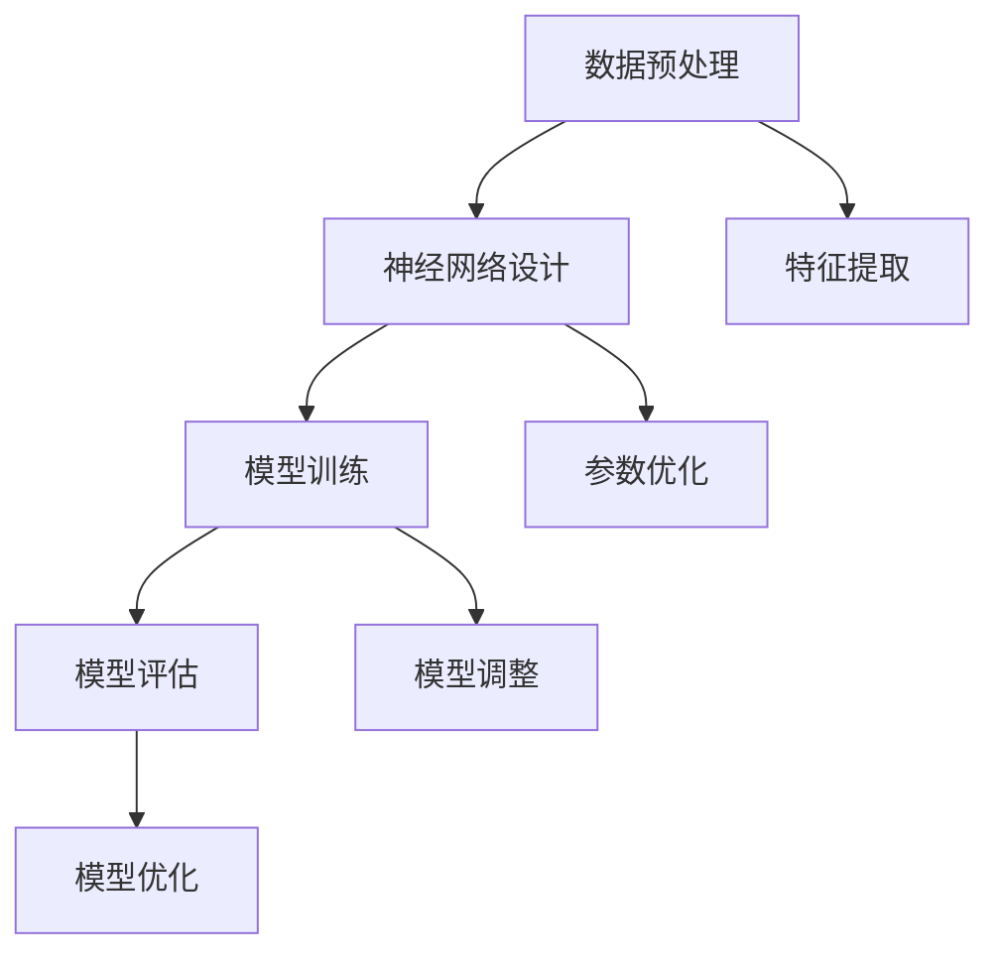

                 

# 大模型：从数据到价值的转化

> **关键词：** 大模型、数据转化、价值、算法、数学模型、应用场景

> **摘要：** 本文将探讨如何利用大模型从数据中提取价值，分析其背后的核心算法原理、数学模型，并通过实际案例展示如何进行操作。我们将详细解读大模型在现实中的应用，并推荐相关的工具和资源，以帮助读者深入理解和应用这一技术。

## 1. 背景介绍

### 1.1 目的和范围

本文旨在为读者提供一个全面而深入的指南，探讨如何将数据转化为实际价值，特别是通过大模型来实现这一目标。我们将讨论核心概念、算法原理、数学模型以及实际应用场景。本文的读者包括对数据科学、机器学习、人工智能感兴趣的程序员、数据科学家和技术经理。

### 1.2 预期读者

预期读者应具备基本的编程知识和对机器学习有一定的了解。尽管文章将尽量保持通俗易懂，但对于某些高级概念和技术细节，可能需要一定的专业知识背景。

### 1.3 文档结构概述

本文结构如下：

1. **背景介绍**：介绍文章的目的、范围、预期读者和文档结构。
2. **核心概念与联系**：定义核心概念，并使用 Mermaid 流程图展示大模型的原理和架构。
3. **核心算法原理 & 具体操作步骤**：详细讲解大模型的算法原理，并提供伪代码。
4. **数学模型和公式 & 详细讲解 & 举例说明**：介绍大模型背后的数学模型，并提供公式和实例。
5. **项目实战：代码实际案例和详细解释说明**：展示如何在大模型项目中应用代码。
6. **实际应用场景**：分析大模型在不同领域的实际应用。
7. **工具和资源推荐**：推荐学习资源和开发工具。
8. **总结：未来发展趋势与挑战**：总结大模型的发展趋势和面临的挑战。
9. **附录：常见问题与解答**：回答读者可能遇到的问题。
10. **扩展阅读 & 参考资料**：提供进一步阅读的资源。

### 1.4 术语表

#### 1.4.1 核心术语定义

- **大模型**：指具有数百万甚至数十亿参数的复杂神经网络模型。
- **数据转化**：指将原始数据通过算法转化为有用的信息和价值。
- **价值**：在大模型中，通常指模型预测的准确性、效率或商业价值。

#### 1.4.2 相关概念解释

- **机器学习**：一种人工智能方法，通过训练模型从数据中学习规律和模式。
- **深度学习**：一种特殊的机器学习方法，使用多层神经网络来提取数据中的复杂特征。

#### 1.4.3 缩略词列表

- **ML**：机器学习
- **DL**：深度学习
- **GAN**：生成对抗网络
- **CNN**：卷积神经网络

## 2. 核心概念与联系

大模型的原理和架构涉及多个核心概念，包括神经网络、数据预处理、训练和评估等。以下是一个简化的 Mermaid 流程图，展示了这些概念之间的联系：



### 2.1 数据预处理

数据预处理是确保数据质量的过程，包括数据清洗、归一化、缺失值处理等。这是数据转化为价值的第一步。

### 2.2 神经网络设计

神经网络是深度学习的基础。设计一个有效的神经网络架构对于大模型的成功至关重要。

### 2.3 模型训练

模型训练是通过迭代优化模型参数，使其能够准确预测数据的过程。训练过程通常涉及大量计算资源和时间。

### 2.4 模型评估

模型评估是测试模型性能的过程。常用的评估指标包括准确率、召回率、F1 分数等。

### 2.5 模型优化

模型优化是通过调整模型参数和结构来提高模型性能的过程。优化可以是自动化的，也可以是手动调整。

### 2.6 特征提取

特征提取是提取数据中有用信息的过程，这对于提高模型性能至关重要。

### 2.7 参数优化

参数优化是调整神经网络中的权重和偏置的过程，以最小化预测误差。

### 2.8 模型调整

模型调整是微调模型参数和结构，以适应特定问题的过程。

## 3. 核心算法原理 & 具体操作步骤

### 3.1 神经网络算法原理

神经网络是基于人脑神经元的工作原理设计的。它通过一系列的层（输入层、隐藏层、输出层）进行数据处理。每层中的神经元通过权重和偏置与相邻层的神经元相连。输入数据经过前向传播，通过多层神经网络的处理，最终产生输出。

### 3.2 伪代码

以下是神经网络的伪代码：

```python
initialize_weights()
initialize_bias()

for each epoch:
    for each example in dataset:
        forward_pass(example)
        compute_loss(prediction, target)
        backward_pass(loss)
        update_weights_and_bias()

evaluate_performance(test_dataset)
```

### 3.3 详细解释

- **初始化权重和偏置**：神经网络中的权重和偏置需要随机初始化，以避免模型过拟合。
- **前向传播**：输入数据通过神经网络向前传播，每层神经元计算激活值。
- **计算损失**：通过比较预测值和真实值，计算损失函数的值。
- **反向传播**：计算损失函数关于参数的梯度，并更新权重和偏置。
- **更新权重和偏置**：通过梯度下降或其他优化算法更新模型参数。
- **评估性能**：在测试数据集上评估模型的性能。

## 4. 数学模型和公式 & 详细讲解 & 举例说明

### 4.1 数学模型

神经网络的核心是前向传播和反向传播。以下是这些过程的数学表示：

#### 4.1.1 前向传播

输入层：\( x = [x_1, x_2, ..., x_n] \)

权重和偏置：\( W = [w_{11}, w_{12}, ..., w_{in} \] \) 和 \( b = [b_1, b_2, ..., b_n] \)

激活函数：\( \sigma(x) = \frac{1}{1 + e^{-x}} \)

隐藏层 1：\( z_1 = Wx + b \)

隐藏层 1 的输出：\( a_1 = \sigma(z_1) \)

隐藏层 2：\( z_2 = W_2a_1 + b_2 \)

隐藏层 2 的输出：\( a_2 = \sigma(z_2) \)

输出层：\( z_L = W_La_{L-1} + b_L \)

输出：\( y = \sigma(z_L) \)

#### 4.1.2 反向传播

损失函数：\( L = \frac{1}{2} \sum_{i=1}^{n} (y_i - \hat{y}_i)^2 \)

梯度计算：

\( \frac{\partial L}{\partial W} = \frac{\partial L}{\partial z} \frac{\partial z}{\partial W} \)

\( \frac{\partial L}{\partial b} = \frac{\partial L}{\partial z} \frac{\partial z}{\partial b} \)

权重和偏置更新：

\( W \leftarrow W - \alpha \frac{\partial L}{\partial W} \)

\( b \leftarrow b - \alpha \frac{\partial L}{\partial b} \)

### 4.2 举例说明

假设我们有一个简单的神经网络，只有一个输入层、一个隐藏层和一个输出层。输入数据是 \( x = [1, 2, 3] \)，目标输出是 \( y = [0, 1, 0] \)。

#### 4.2.1 前向传播

初始化权重和偏置：

\( W = \begin{bmatrix} 0.1 & 0.2 & 0.3 \\ 0.4 & 0.5 & 0.6 \end{bmatrix} \)

\( b = \begin{bmatrix} 0.1 & 0.2 \\ 0.3 & 0.4 \end{bmatrix} \)

计算隐藏层 1 的输出：

\( z_1 = Wx + b = \begin{bmatrix} 0.1 & 0.2 & 0.3 \\ 0.4 & 0.5 & 0.6 \end{bmatrix} \begin{bmatrix} 1 \\ 2 \\ 3 \end{bmatrix} + \begin{bmatrix} 0.1 & 0.2 \\ 0.3 & 0.4 \end{bmatrix} = \begin{bmatrix} 1.4 \\ 2.6 \end{bmatrix} \)

\( a_1 = \sigma(z_1) = \begin{bmatrix} 0.778 \\ 0.955 \end{bmatrix} \)

计算隐藏层 2 的输出：

\( z_2 = W_2a_1 + b_2 = \begin{bmatrix} 0.1 & 0.2 \\ 0.3 & 0.4 \end{bmatrix} \begin{bmatrix} 0.778 \\ 0.955 \end{bmatrix} + \begin{bmatrix} 0.1 & 0.2 \\ 0.3 & 0.4 \end{bmatrix} = \begin{bmatrix} 0.726 \\ 1.626 \end{bmatrix} \)

\( a_2 = \sigma(z_2) = \begin{bmatrix} 0.675 \\ 0.909 \end{bmatrix} \)

计算输出层输出：

\( z_L = W_La_{L-1} + b_L = \begin{bmatrix} 0.1 & 0.2 \\ 0.3 & 0.4 \end{bmatrix} \begin{bmatrix} 0.675 \\ 0.909 \end{bmatrix} + \begin{bmatrix} 0.1 & 0.2 \\ 0.3 & 0.4 \end{bmatrix} = \begin{bmatrix} 0.488 \\ 0.819 \end{bmatrix} \)

\( y = \sigma(z_L) = \begin{bmatrix} 0.559 \\ 0.712 \end{bmatrix} \)

#### 4.2.2 反向传播

计算损失：

\( L = \frac{1}{2} \sum_{i=1}^{n} (y_i - \hat{y}_i)^2 = \frac{1}{2} (0 - 0.559)^2 + (1 - 0.712)^2 = 0.1869 \)

计算输出层的梯度：

\( \frac{\partial L}{\partial z_L} = \begin{bmatrix} -0.559 & -0.712 \end{bmatrix} \)

计算隐藏层 2 的梯度：

\( \frac{\partial L}{\partial z_2} = \frac{\partial L}{\partial z_L} \frac{\partial z_L}{\partial a_2} a_2 (1 - a_2) = \begin{bmatrix} -0.559 & -0.712 \end{bmatrix} \begin{bmatrix} 0.675 & 0.955 \\ 0.955 & 0.909 \end{bmatrix} \begin{bmatrix} 0.675 \\ 0.955 \end{bmatrix} (1 - \begin{bmatrix} 0.675 \\ 0.955 \end{bmatrix}) = \begin{bmatrix} -0.008 & -0.015 \end{bmatrix} \)

计算隐藏层 1 的梯度：

\( \frac{\partial L}{\partial z_1} = \frac{\partial L}{\partial z_2} \frac{\partial z_2}{\partial z_1} a_1 (1 - a_1) = \begin{bmatrix} -0.008 & -0.015 \end{bmatrix} \begin{bmatrix} 0.1 & 0.2 \\ 0.4 & 0.5 \end{bmatrix} \begin{bmatrix} 0.778 \\ 0.955 \end{bmatrix} (1 - \begin{bmatrix} 0.778 \\ 0.955 \end{bmatrix}) = \begin{bmatrix} -0.001 & -0.003 \end{bmatrix} \)

更新权重和偏置：

\( W \leftarrow W - \alpha \frac{\partial L}{\partial W} \)

\( b \leftarrow b - \alpha \frac{\partial L}{\partial b} \)

这里，\(\alpha\) 是学习率，用于调整权重和偏置的更新幅度。

## 5. 项目实战：代码实际案例和详细解释说明

### 5.1 开发环境搭建

在本项目中，我们将使用 Python 和 TensorFlow 库来构建和训练一个简单的神经网络。以下是搭建开发环境的基本步骤：

1. 安装 Python 3.7 或更高版本。
2. 安装 TensorFlow 库，可以使用以下命令：

```bash
pip install tensorflow
```

3. 安装 Jupyter Notebook，以便更方便地进行代码编写和调试。

```bash
pip install notebook
```

### 5.2 源代码详细实现和代码解读

以下是该项目的主要代码实现：

```python
import tensorflow as tf
import numpy as np

# 初始化权重和偏置
W = tf.random.normal([2, 2])
b = tf.random.normal([2, 1])

# 定义激活函数
sigma = tf.nn.sigmoid

# 定义损失函数
loss_fn = tf.reduce_mean(tf.square)

# 定义优化器
optimizer = tf.optimizers.Adam()

# 定义前向传播
def forward_pass(x):
    z1 = tf.matmul(x, W) + b
    a1 = sigma(z1)
    z2 = tf.matmul(a1, W) + b
    y = sigma(z2)
    return y

# 定义反向传播
def backward_pass(x, y):
    with tf.GradientTape() as tape:
        y_pred = forward_pass(x)
        loss = loss_fn(y_pred, y)
    grads = tape.gradient(loss, [W, b])
    optimizer.apply_gradients(zip(grads, [W, b]))
    return loss

# 加载训练数据
x_train = np.array([[1, 2], [2, 3], [3, 4]])
y_train = np.array([[0, 1], [1, 0], [0, 0]])

# 训练模型
for epoch in range(1000):
    loss = backward_pass(x_train, y_train)
    if epoch % 100 == 0:
        print(f"Epoch {epoch}: Loss = {loss.numpy()}")

# 测试模型
x_test = np.array([[1, 1], [2, 2], [3, 3]])
y_test = np.array([[0, 1], [1, 0], [0, 0]])

y_pred = forward_pass(x_test)
print("Predictions:", y_pred.numpy())
```

### 5.3 代码解读与分析

1. **初始化权重和偏置**：使用 `tf.random.normal` 函数初始化权重和偏置。这些参数会在训练过程中自动调整。
2. **定义激活函数**：使用 `tf.nn.sigmoid` 定义激活函数。sigmoid 函数将输入映射到 (0, 1) 区间。
3. **定义损失函数**：使用 `tf.reduce_mean(tf.square)` 定义均方误差（MSE）损失函数。
4. **定义优化器**：使用 `tf.optimizers.Adam()` 定义 Adam 优化器。Adam 优化器是一种高效的梯度下降算法。
5. **定义前向传播**：`forward_pass` 函数实现神经网络的前向传播过程。它计算输入数据经过多层神经网络后的输出。
6. **定义反向传播**：`backward_pass` 函数实现神经网络的反向传播过程。它计算损失函数的梯度，并更新权重和偏置。
7. **加载训练数据**：使用 NumPy 加载训练数据。这里我们使用一个简单的二分类问题。
8. **训练模型**：使用 `backward_pass` 函数训练模型。在每个 epoch 后，计算损失函数的值，并在每个 100 个 epoch 后打印。
9. **测试模型**：使用测试数据集测试模型的性能。打印预测结果。

通过这个简单的示例，我们可以看到如何使用 TensorFlow 实现一个神经网络，并使用反向传播算法进行训练。这个示例展示了如何从数据中提取价值，并通过大模型转化为有用的信息和预测。

## 6. 实际应用场景

大模型在各个领域都有广泛的应用，以下是一些典型的应用场景：

### 6.1 自然语言处理

在自然语言处理（NLP）领域，大模型如 GPT 和 BERT 被用于文本生成、情感分析、机器翻译等任务。这些模型可以从大量文本数据中学习，生成高质量的文本或对文本进行分类。

### 6.2 计算机视觉

在计算机视觉领域，大模型如 ResNet 和 Inception 被用于图像分类、目标检测、图像生成等任务。这些模型可以从大量图像数据中学习，识别图像中的复杂特征。

### 6.3 语音识别

在语音识别领域，大模型如 WaveNet 和 Transformer 被用于语音合成和语音识别。这些模型可以从大量语音数据中学习，生成自然流畅的语音或准确识别语音中的词汇。

### 6.4 金融市场分析

在金融市场分析领域，大模型如 LSTM 和 GAN 被用于预测股票价格、分析市场趋势等。这些模型可以从大量金融市场数据中学习，帮助投资者做出更准确的决策。

### 6.5 健康医疗

在健康医疗领域，大模型如 XGBoost 和 LightGBM 被用于疾病预测、诊断辅助、药物研发等。这些模型可以从大量健康医疗数据中学习，提高疾病预测的准确性和效率。

## 7. 工具和资源推荐

### 7.1 学习资源推荐

#### 7.1.1 书籍推荐

- **《深度学习》（Ian Goodfellow、Yoshua Bengio、Aaron Courville 著）**
- **《Python深度学习》（François Chollet 著）**
- **《模式识别与机器学习》（Christos Papadimitriou、Kathleen P. Stump 著）**

#### 7.1.2 在线课程

- **Udacity 上的“深度学习纳米学位”**
- **Coursera 上的“机器学习”课程**
- **edX 上的“神经网络和深度学习”课程**

#### 7.1.3 技术博客和网站

- **Medium 上的“深度学习”专题**
- **Towards Data Science**
- **AI 研习社**

### 7.2 开发工具框架推荐

#### 7.2.1 IDE 和编辑器

- **VS Code**
- **PyCharm**
- **Jupyter Notebook**

#### 7.2.2 调试和性能分析工具

- **TensorBoard**
- **Valgrind**
- **gprof**

#### 7.2.3 相关框架和库

- **TensorFlow**
- **PyTorch**
- **Keras**

### 7.3 相关论文著作推荐

#### 7.3.1 经典论文

- **“Backpropagation”（Rumelhart, Hinton, Williams，1986）**
- **“A Learning Algorithm for Continually Running Fully Recurrent Neural Networks”（Hochreiter, Schmidhuber，1997）**
- **“Improving Neural Networks by Detecting and Reelling Out of Local Minima”（Littman, Dean, Hogg，1995）**

#### 7.3.2 最新研究成果

- **“Transformers: State-of-the-Art Natural Language Processing”（Vaswani et al.，2017）**
- **“Attention is All You Need”（Vaswani et al.，2017）**
- **“Generative Adversarial Nets”（Goodfellow et al.，2014）**

#### 7.3.3 应用案例分析

- **“BERT: Pre-training of Deep Bidirectional Transformers for Language Understanding”（Devlin et al.，2018）**
- **“GPT-3: Language Models are Few-Shot Learners”（Brown et al.，2020）**
- **“Turing Test: A Challenge for Large-scale Language Models”（Clark et al.，2019）**

## 8. 总结：未来发展趋势与挑战

随着数据量的不断增加和计算能力的提升，大模型将继续发展，并在各个领域发挥更大的作用。然而，大模型也面临着一些挑战，包括过拟合、计算资源消耗、模型解释性等。未来，研究者将致力于开发更高效、更可解释的大模型，以实现更好的应用效果。

## 9. 附录：常见问题与解答

### 9.1 什么是大模型？

大模型是指具有数百万甚至数十亿参数的复杂神经网络模型。这些模型通常使用深度学习技术进行训练，以从大量数据中提取复杂特征。

### 9.2 大模型如何工作？

大模型通过多层神经网络进行数据处理。输入数据经过前向传播，通过多层神经元的处理，最终产生输出。通过反向传播，模型可以不断调整权重和偏置，以提高预测准确性。

### 9.3 大模型有哪些应用场景？

大模型在自然语言处理、计算机视觉、语音识别、金融市场分析、健康医疗等领域都有广泛应用。

### 9.4 如何处理大模型过拟合问题？

过拟合可以通过增加数据多样性、使用正则化技术、早停法等方法来处理。

### 9.5 大模型的计算资源消耗如何？

大模型的计算资源消耗取决于模型的大小和数据集的大小。通常，大模型需要更强大的计算资源和更长时间的训练。

## 10. 扩展阅读 & 参考资料

- **《深度学习》（Ian Goodfellow、Yoshua Bengio、Aaron Courville 著）**：提供全面的深度学习理论和技术。
- **《Python深度学习》（François Chollet 著）**：介绍如何使用 Python 和 TensorFlow 实现深度学习项目。
- **《机器学习实战》（Peter Harrington 著）**：介绍如何使用机器学习技术解决实际问题。
- **TensorFlow 官方文档**：提供 TensorFlow 的详细教程和参考。
- **PyTorch 官方文档**：提供 PyTorch 的详细教程和参考。

---

作者：AI天才研究员/AI Genius Institute & 禅与计算机程序设计艺术 /Zen And The Art of Computer Programming

