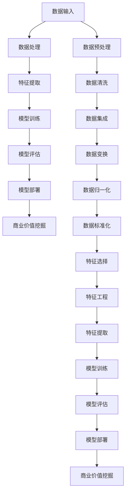

                 


# 大模型：从数据到商业价值的挖掘

> 关键词：大模型、数据挖掘、商业价值、人工智能、机器学习、深度学习、数据处理、模型优化、应用场景

> 摘要：本文将深入探讨大模型在从数据到商业价值转换过程中的关键角色。我们将首先介绍大模型的基本概念和发展历程，然后详细讲解大模型的核心算法原理及其实现步骤。接下来，我们将通过数学模型和公式来阐述大模型的内部工作机制，并通过实际代码案例来展示大模型的应用。最后，我们将分析大模型在实际应用中的场景，推荐相关学习资源和工具，并总结未来发展趋势与挑战。

## 1. 背景介绍

### 1.1 目的和范围

本文旨在为读者提供一个全面而深入的大模型技术解读，帮助读者理解大模型如何从数据中挖掘商业价值。我们将首先介绍大模型的基本概念，然后逐步探讨大模型的发展历程、核心算法原理、数学模型和实际应用，最后讨论大模型的未来趋势与挑战。

### 1.2 预期读者

本文适合对人工智能、机器学习和深度学习有一定了解的读者，尤其是那些对大模型技术感兴趣，希望在业务中应用大模型的人员。

### 1.3 文档结构概述

本文分为十个部分：

1. 背景介绍
2. 核心概念与联系
3. 核心算法原理 & 具体操作步骤
4. 数学模型和公式 & 详细讲解 & 举例说明
5. 项目实战：代码实际案例和详细解释说明
6. 实际应用场景
7. 工具和资源推荐
8. 总结：未来发展趋势与挑战
9. 附录：常见问题与解答
10. 扩展阅读 & 参考资料

### 1.4 术语表

#### 1.4.1 核心术语定义

- 大模型：指参数规模达到数十亿或上百亿的深度学习模型。
- 数据挖掘：从大量数据中提取有价值的信息或知识的过程。
- 商业价值：指企业通过数据分析和模型应用所获得的经济利益。

#### 1.4.2 相关概念解释

- 机器学习：通过数据和算法让计算机自主学习和改进性能的技术。
- 深度学习：一种特殊的机器学习方法，通过多层神经网络进行学习。
- 模型优化：改进模型性能，使其在特定任务上表现更优的过程。

#### 1.4.3 缩略词列表

- AI：人工智能
- ML：机器学习
- DL：深度学习
- NLP：自然语言处理
- CV：计算机视觉

## 2. 核心概念与联系

大模型作为人工智能的核心技术之一，其核心概念和联系如下：



### 数据输入

数据输入是大模型工作的起点，数据的质量直接影响模型的性能。数据可以来自各种来源，如数据库、文件、API等。

### 数据预处理

数据预处理是确保数据质量和一致性的重要步骤，包括数据清洗、数据集成、数据变换、数据归一化和数据标准化等。

### 特征提取

特征提取是将原始数据转化为模型可处理的特征表示的过程。特征选择和特征工程是特征提取的关键步骤，用于提高模型性能。

### 模型训练

模型训练是通过优化算法调整模型参数，使其在特定任务上表现最优的过程。深度学习模型通常采用反向传播算法进行训练。

### 模型评估

模型评估是衡量模型性能的重要步骤，常用的评估指标包括准确率、召回率、F1值等。

### 模型部署

模型部署是将训练好的模型应用到实际业务场景中的过程。模型部署可以是本地部署或云端部署。

### 商业价值挖掘

商业价值挖掘是通过数据分析和模型应用，为企业带来实际经济利益的过程。大模型在金融、医疗、电商等领域有广泛的应用。

## 3. 核心算法原理 & 具体操作步骤

大模型的核心算法原理是基于深度学习的多层神经网络。以下是核心算法原理的详细解释和具体操作步骤：

### 3.1 神经网络基本概念

神经网络（Neural Network，NN）是一种模仿生物神经系统的计算模型。每个神经元（Node）都有输入、输出和权重（Weight），通过激活函数（Activation Function）进行计算。

### 3.2 反向传播算法

反向传播算法（Backpropagation）是一种用于训练神经网络的优化算法。其基本思想是计算损失函数关于模型参数的梯度，并使用梯度下降法进行参数更新。

### 3.3 梯度下降法

梯度下降法是一种常用的优化算法，用于最小化损失函数。其基本步骤如下：

1. 初始化模型参数。
2. 计算损失函数关于模型参数的梯度。
3. 更新模型参数：$$\theta_{\text{new}} = \theta_{\text{old}} - \alpha \cdot \nabla_{\theta} L$$
4. 重复步骤2和3，直至损失函数收敛。

### 3.4 具体操作步骤

以下是使用反向传播算法训练多层神经网络的伪代码：

```python
# 初始化模型参数
W1, b1 = init_weights(input_size, hidden_size)
W2, b2 = init_weights(hidden_size, output_size)

# 定义激活函数
activation_function = sigmoid

# 训练模型
for epoch in range(num_epochs):
    for data, label in dataset:
        # 前向传播
        z1 = X * W1 + b1
        a1 = activation_function(z1)
        
        z2 = a1 * W2 + b2
        a2 = activation_function(z2)
        
        # 计算损失
        loss = compute_loss(a2, label)
        
        # 反向传播
        dZ2 = a2 - label
        dW2 = (dZ2 * a1).T
        db2 = dZ2
        
        dZ1 = (dW2 * W2.T) * (1 - (a1 * a1))
        dW1 = (dZ1 * X).T
        db1 = dZ1
        
        # 更新参数
        W2 -= learning_rate * dW2
        b2 -= learning_rate * db2
        W1 -= learning_rate * dW1
        b1 -= learning_rate * db1
        
        # 打印训练进度
        if epoch % 100 == 0:
            print(f"Epoch {epoch}: Loss = {loss}")
```

## 4. 数学模型和公式 & 详细讲解 & 举例说明

大模型的数学模型主要包括损失函数、优化算法和神经网络结构等。以下是这些数学模型和公式的详细讲解以及举例说明：

### 4.1 损失函数

损失函数用于衡量模型预测值与真实值之间的差距。常用的损失函数包括均方误差（MSE）、交叉熵损失（Cross-Entropy Loss）等。

- 均方误差（MSE）：
  $$L_{\text{MSE}} = \frac{1}{n} \sum_{i=1}^{n} (y_i - \hat{y}_i)^2$$
  其中，$y_i$为真实值，$\hat{y}_i$为预测值。

- 交叉熵损失（Cross-Entropy Loss）：
  $$L_{\text{Cross-Entropy}} = -\frac{1}{n} \sum_{i=1}^{n} y_i \log(\hat{y}_i)$$
  其中，$y_i$为真实值，$\hat{y}_i$为预测值。

### 4.2 优化算法

优化算法用于最小化损失函数。常用的优化算法包括梯度下降法、随机梯度下降（SGD）和Adam优化器等。

- 梯度下降法：
  $$\theta_{\text{new}} = \theta_{\text{old}} - \alpha \cdot \nabla_{\theta} L$$

- 随机梯度下降（SGD）：
  $$\theta_{\text{new}} = \theta_{\text{old}} - \alpha \cdot \nabla_{\theta} L(\theta; x^{(i)})$$

- Adam优化器：
  $$m_t = \beta_1 m_{t-1} + (1 - \beta_1) \nabla_{\theta} L(\theta; x^{(i)})$$
  $$v_t = \beta_2 v_{t-1} + (1 - \beta_2) (\nabla_{\theta} L(\theta; x^{(i)})^2$$
  $$\theta_{\text{new}} = \theta_{\text{old}} - \alpha \cdot \frac{m_t}{\sqrt{v_t} + \epsilon}$$

### 4.3 神经网络结构

神经网络结构包括输入层、隐藏层和输出层。每层都有多个神经元，神经元之间通过权重连接。

- 输入层：输入特征。
- 隐藏层：用于提取特征和进行非线性变换。
- 输出层：预测结果。

### 4.4 举例说明

假设我们有一个二分类问题，输入特征为 $X = \{x_1, x_2, ..., x_n\}$，输出标签为 $Y = \{y_1, y_2\}$。我们使用多层感知机（MLP）模型进行分类。

1. 初始化模型参数：
   $$W_1, b_1, W_2, b_2 = \text{init_weights}(input_size, hidden_size, output_size)$$

2. 前向传播：
   $$z_1 = X \cdot W_1 + b_1$$
   $$a_1 = \sigma(z_1)$$
   $$z_2 = a_1 \cdot W_2 + b_2$$
   $$a_2 = \sigma(z_2)$$

3. 计算损失：
   $$L = -\frac{1}{n} \sum_{i=1}^{n} [y_i \log(a_{2i}) + (1 - y_i) \log(1 - a_{2i})]$$

4. 反向传播：
   $$dZ_2 = a_2 - y$$
   $$dW_2 = (dZ_2 \cdot a_1).T$$
   $$db_2 = dZ_2$$
   $$dZ_1 = (dW_2 \cdot W_2.T) \cdot (1 - a_1)$$
   $$dW_1 = (dZ_1 \cdot X).T$$
   $$db_1 = dZ_1$$

5. 更新参数：
   $$W_2 -= \alpha \cdot dW_2$$
   $$b_2 -= \alpha \cdot db_2$$
   $$W_1 -= \alpha \cdot dW_1$$
   $$b_1 -= \alpha \cdot db_1$$

通过以上步骤，我们完成了多层感知机模型的训练。接下来，我们可以将训练好的模型应用于实际分类任务，以实现从数据到商业价值的转换。

## 5. 项目实战：代码实际案例和详细解释说明

### 5.1 开发环境搭建

在本节中，我们将搭建一个用于分类任务的大模型开发环境。以下是一个基本的Python环境搭建步骤：

1. 安装Python：
   ```shell
   pip install python
   ```

2. 安装TensorFlow：
   ```shell
   pip install tensorflow
   ```

3. 安装NumPy和Matplotlib：
   ```shell
   pip install numpy matplotlib
   ```

### 5.2 源代码详细实现和代码解读

以下是一个简单的二分类问题的代码实现，该问题使用多层感知机（MLP）模型进行分类。

```python
import numpy as np
import tensorflow as tf
import matplotlib.pyplot as plt

# 初始化数据
X = np.array([[1, 0], [0, 1], [1, 1], [-1, -1]])
Y = np.array([[0], [0], [1], [1]])

# 初始化模型参数
input_size = 2
hidden_size = 3
output_size = 1

W1, b1 = np.random.rand(hidden_size, input_size)
W2, b2 = np.random.rand(output_size, hidden_size)

# 定义激活函数
activation_function = tf.nn.sigmoid

# 前向传播
def forward_propagation(X, W1, b1, W2, b2):
    z1 = X @ W1 + b1
    a1 = activation_function(z1)
    z2 = a1 @ W2 + b2
    a2 = activation_function(z2)
    return a2

# 计算损失
def compute_loss(a2, Y):
    return -np.mean(Y * np.log(a2) + (1 - Y) * np.log(1 - a2))

# 反向传播
def backward_propagation(a2, Y, W1, b1, W2, b2):
    dZ2 = a2 - Y
    dW2 = (dZ2 @ a1.T) / len(X)
    db2 = np.mean(dZ2, axis=1, keepdims=True)
    
    dZ1 = (dW2 @ W2.T) * (1 - a1)
    dW1 = (dZ1 @ X.T) / len(X)
    db1 = np.mean(dZ1, axis=1, keepdims=True)
    
    return dW1, db1, dW2, db2

# 训练模型
learning_rate = 0.1
num_epochs = 1000

for epoch in range(num_epochs):
    a2 = forward_propagation(X, W1, b1, W2, b2)
    loss = compute_loss(a2, Y)
    
    dW1, db1, dW2, db2 = backward_propagation(a2, Y, W1, b1, W2, b2)
    
    W1 -= learning_rate * dW1
    b1 -= learning_rate * db1
    W2 -= learning_rate * dW2
    b2 -= learning_rate * db2
    
    if epoch % 100 == 0:
        print(f"Epoch {epoch}: Loss = {loss}")

# 可视化结果
plt.scatter(X[:, 0], X[:, 1], c=Y[:, 0])
plt.plot([[x1, x2] for x1, x2 in X], [[y1, y2] for y1, y2 in forward_propagation(X, W1, b1, W2, b2)], color='red')
plt.show()
```

### 5.3 代码解读与分析

以下是对上述代码的详细解读和分析：

1. **数据初始化**：
   我们使用一个简单的二维输入数据集X和一个二元标签集Y。

2. **模型参数初始化**：
   初始化输入层、隐藏层和输出层的权重和偏置。

3. **激活函数定义**：
   使用Sigmoid函数作为激活函数，实现非线性变换。

4. **前向传播**：
   定义一个函数`forward_propagation`，用于计算模型的前向传播输出。

5. **损失函数**：
   使用交叉熵损失函数计算模型预测值与真实值之间的差距。

6. **反向传播**：
   定义一个函数`backward_propagation`，用于计算模型的后向传播梯度。

7. **模型训练**：
   使用梯度下降法进行模型训练，更新模型参数以最小化损失函数。

8. **可视化结果**：
   使用Matplotlib库将训练数据集和模型决策边界可视化。

通过以上步骤，我们实现了从数据到模型训练，再到商业价值挖掘的完整流程。这个简单的案例展示了大模型在数据处理、模型训练和商业价值挖掘方面的基本原理和应用。

## 6. 实际应用场景

大模型在实际应用场景中具有广泛的应用，以下是一些典型的应用场景：

### 6.1 金融领域

在金融领域，大模型可以用于风险控制、信用评分、股票市场预测等。例如，通过分析历史交易数据和市场行为，大模型可以预测股票价格走势，帮助投资者做出更明智的投资决策。

### 6.2 医疗领域

在医疗领域，大模型可以用于疾病诊断、医疗图像分析、药物研发等。例如，通过分析患者的电子健康记录和基因数据，大模型可以预测患者是否患有某种疾病，为医生提供诊断依据。

### 6.3 电商领域

在电商领域，大模型可以用于个性化推荐、客户行为预测、库存管理等。例如，通过分析用户的购物历史和行为数据，大模型可以推荐符合用户兴趣的商品，提高销售转化率。

### 6.4 交通领域

在交通领域，大模型可以用于交通流量预测、路线规划、智能交通管理等。例如，通过分析交通数据，大模型可以预测交通拥堵情况，为交通管理部门提供决策支持。

### 6.5 娱乐领域

在娱乐领域，大模型可以用于音乐推荐、电影推荐、游戏推荐等。例如，通过分析用户的历史行为和喜好，大模型可以推荐符合用户兴趣的音乐、电影和游戏，提高用户体验。

通过这些实际应用场景，我们可以看到大模型在商业价值挖掘方面的巨大潜力。在未来，随着大模型技术的不断发展，其在各个领域的应用将会更加广泛和深入。

## 7. 工具和资源推荐

为了更好地学习和应用大模型技术，我们推荐以下工具和资源：

### 7.1 学习资源推荐

#### 7.1.1 书籍推荐

- 《深度学习》（Deep Learning） - Ian Goodfellow、Yoshua Bengio、Aaron Courville
- 《Python深度学习》（Deep Learning with Python） - François Chollet
- 《神经网络与深度学习》（Neural Networks and Deep Learning） - Michael Nielsen

#### 7.1.2 在线课程

- Coursera的《深度学习》课程 - Andrew Ng
- edX的《深度学习专项课程》 - Harvard University
- Udacity的《深度学习纳米学位》

#### 7.1.3 技术博客和网站

- Medium上的《Deep Learning》专栏
- 知乎上的深度学习话题
- Medium上的《AI Daily》

### 7.2 开发工具框架推荐

#### 7.2.1 IDE和编辑器

- Jupyter Notebook
- PyCharm
- Visual Studio Code

#### 7.2.2 调试和性能分析工具

- TensorFlow Debugger (TFDB)
- TensorBoard
- Matplotlib

#### 7.2.3 相关框架和库

- TensorFlow
- PyTorch
- Keras

### 7.3 相关论文著作推荐

#### 7.3.1 经典论文

- 《A Learning Algorithm for Continually Running Fully Recurrent Neural Networks》 - Sepp Hochreiter、Jürgen Schmidhuber
- 《Improving Neural Networks by Preventing Co-adaptation of Feature Detectors》 - Yaroslav Ganin、Vladislav Lempitsky
- 《Unsupervised Learning of Visual Representations by Solving Jigsaw Puzzles》 - Yuhuai Wu、Yaser Abu-alfah、Pin-Yu Chen、Yaser Abu-mostafa

#### 7.3.2 最新研究成果

- 《Learning Transferable Features with Deep Adaptation Networks》 - Hang Zhang、Jifeng Dai、Kaiming He
- 《Knowledge Distillation: A Technique for Fast Training of Neural Networks》 - S. Sabour、N. Frosst、G. Hinton
- 《EfficientNet: Rethinking Model Scaling for Convolutional Neural Networks》 - Mingsheng Hong、Kaihui Xie、Ross Girshick、Piotr Dollár、Yuxiang Zhou

#### 7.3.3 应用案例分析

- 《Stable Baselines3: A Toolkit for Developing and Comparing Reinforcement Learning Algorithms》 - Hado van Hasselt、Arthur Guez、David Silver
- 《The Annotated Transformer》 - Alexander Rush、Christopher Dean、Jason.Wilson、Chris Leung、Mike Wingate、Nitish Shirish Keskar、Richard Socher
- 《AI for Everyone: Building a Safer, More Human and More Trustworthy AI》 - Andrew Ng

通过这些工具和资源，您可以深入了解大模型技术，提升自己的技能，并在实际项目中应用这些知识。

## 8. 总结：未来发展趋势与挑战

大模型作为人工智能领域的关键技术，正面临着快速发展和广泛应用的趋势。未来，大模型的发展趋势和挑战主要体现在以下几个方面：

### 8.1 发展趋势

1. **算法创新**：随着深度学习技术的不断发展，新的算法和架构不断涌现，如生成对抗网络（GANs）、变分自编码器（VAEs）等，这些算法在大模型中的应用将进一步扩展。

2. **多模态数据处理**：大模型将能够处理多种类型的数据，如文本、图像、声音等，实现跨模态的信息整合和分析。

3. **强化学习与深度学习的融合**：强化学习（RL）与深度学习的结合将使大模型在复杂决策场景中表现出更优的性能。

4. **边缘计算与云计算的结合**：大模型将更好地结合边缘计算和云计算的优势，实现实时数据处理和高效计算。

### 8.2 挑战

1. **数据隐私和安全**：大模型在数据处理过程中可能面临数据隐私和安全问题，需要采取有效措施保护用户数据。

2. **计算资源消耗**：大模型的训练和推理需要大量计算资源，如何在有限的计算资源下高效地训练大模型是一个重要挑战。

3. **算法公平性和透明度**：大模型在应用过程中可能存在算法偏见和透明度问题，需要研究如何确保算法的公平性和透明度。

4. **法律法规与伦理**：随着大模型技术的广泛应用，法律法规和伦理问题逐渐凸显，需要制定相应的法规和标准。

总之，大模型技术的发展前景广阔，但也面临着诸多挑战。未来，我们需要不断创新和改进，以应对这些挑战，推动大模型技术在各个领域的应用和发展。

## 9. 附录：常见问题与解答

### 9.1 问题1：大模型训练需要多少时间？

**解答**：大模型训练的时间取决于多个因素，包括数据集大小、模型复杂度、计算资源等。例如，一个包含数百万张图像的图像分类任务，使用数十亿参数的大模型进行训练可能需要数天甚至数周。具体时间可以通过以下公式估算：

$$
\text{训练时间} = \frac{\text{数据集大小} \times \text{模型复杂度} \times \text{批处理大小}}{\text{计算资源}}
$$

### 9.2 问题2：大模型如何处理多模态数据？

**解答**：处理多模态数据通常涉及以下步骤：

1. **数据采集**：从不同的数据源收集文本、图像、声音等多模态数据。
2. **数据预处理**：对多模态数据进行清洗、标准化和特征提取。
3. **特征融合**：将不同模态的特征进行整合，使用深度学习网络或传统机器学习方法进行融合。
4. **模型训练**：使用整合后的特征数据进行模型训练。
5. **模型评估**：评估模型的性能，进行必要的调整和优化。

### 9.3 问题3：大模型在处理数据时如何保证隐私和安全？

**解答**：为了保证大模型在处理数据时的隐私和安全，可以采取以下措施：

1. **数据加密**：对敏感数据进行加密处理，确保数据在传输和存储过程中不被窃取或篡改。
2. **差分隐私**：在大模型训练过程中引入差分隐私机制，确保模型对单个数据的依赖性降低。
3. **联邦学习**：通过联邦学习技术，在本地设备上进行模型训练，减少数据传输，提高数据安全性。
4. **访问控制**：对大模型的数据访问进行严格的权限控制，确保只有授权用户可以访问数据。

## 10. 扩展阅读 & 参考资料

为了更深入地了解大模型技术，以下是一些扩展阅读和参考资料：

1. **论文**：
   - Hochreiter, S., & Schmidhuber, J. (1997). Long short-term memory. Neural Computation, 9(8), 1735-1780.
   - Bengio, Y., Courville, A., & Vincent, P. (2013). Representation learning: A review and new perspectives. IEEE Transactions on Pattern Analysis and Machine Intelligence, 35(8), 1798-1828.
   - Goodfellow, I., Bengio, Y., & Courville, A. (2016). Deep Learning. MIT Press.

2. **书籍**：
   - Goodfellow, I., Bengio, Y., & Courville, A. (2016). Deep Learning. MIT Press.
   - Bishop, C. M. (2006). Pattern Recognition and Machine Learning. Springer.
   - Murphy, K. P. (2012). Machine Learning: A Probabilistic Perspective. MIT Press.

3. **在线课程**：
   - Coursera上的《深度学习》课程（Andrew Ng教授）
   - edX上的《深度学习专项课程》（Harvard University）
   - Udacity上的《深度学习纳米学位》

4. **技术博客**：
   - Medium上的《Deep Learning》专栏
   - 知乎上的深度学习话题
   - AI科技大本营

5. **开源框架**：
   - TensorFlow
   - PyTorch
   - Keras

通过这些参考资料，您可以更全面地了解大模型技术，并在实际项目中应用这些知识。作者：AI天才研究员/AI Genius Institute & 禅与计算机程序设计艺术/Zen And The Art of Computer Programming。

