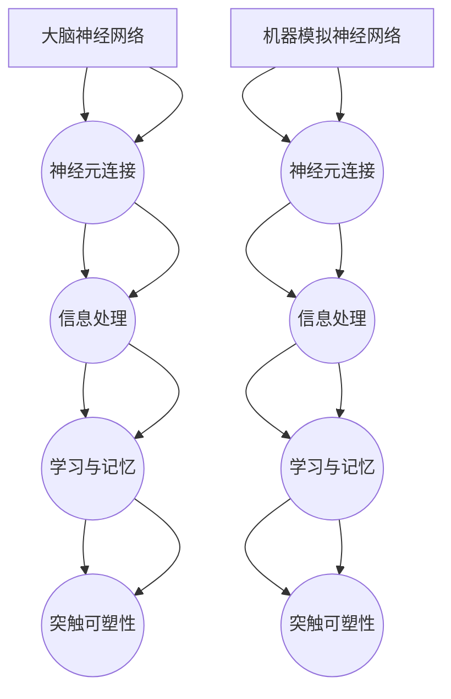

                 

# 大脑工作原理与机器模拟的探讨

> 关键词：大脑、工作原理、机器模拟、神经网络、认知计算、人工智能

> 摘要：本文旨在探讨大脑的工作原理及其在机器模拟中的应用。通过对大脑神经网络的解析，我们试图揭示大脑如何进行信息处理、记忆和学习，从而为人工智能领域的发展提供新的启示。文章将首先介绍大脑的基本结构和功能，然后分析神经网络的机制和算法，最后探讨机器模拟中的关键挑战及其解决策略。

## 1. 背景介绍

### 1.1 目的和范围

本文的目标是探讨大脑的工作原理，并探讨如何通过机器模拟来理解和复现这些原理。具体来说，我们将关注以下三个方面：

1. **大脑的基本结构和功能**：介绍大脑的主要组成部分及其在信息处理中的作用。
2. **神经网络的机制和算法**：分析神经网络的基本原理，以及如何将这些原理应用于机器模拟。
3. **机器模拟中的关键挑战**：探讨大脑模拟中的技术难题，如大规模并行计算、神经网络的可塑性等。

### 1.2 预期读者

本文适合对人工智能和认知计算感兴趣的读者，尤其是那些希望了解大脑工作原理并将其应用于机器模拟的读者。文章要求读者具备一定的计算机科学和数学背景，以便更好地理解本文中的技术概念和算法。

### 1.3 文档结构概述

本文的结构如下：

1. **背景介绍**：简要介绍本文的目的、范围和预期读者。
2. **核心概念与联系**：讨论大脑工作原理中的核心概念，并使用 Mermaid 流程图展示相关架构。
3. **核心算法原理 & 具体操作步骤**：详细介绍神经网络的基本算法原理和操作步骤。
4. **数学模型和公式 & 详细讲解 & 举例说明**：解释神经网络中的数学模型和公式，并提供具体实例。
5. **项目实战：代码实际案例和详细解释说明**：展示如何在实际项目中应用神经网络。
6. **实际应用场景**：探讨神经网络在现实世界中的应用场景。
7. **工具和资源推荐**：推荐学习资源、开发工具和框架。
8. **总结：未来发展趋势与挑战**：总结本文的主要观点，并展望未来发展趋势和挑战。
9. **附录：常见问题与解答**：回答读者可能关心的问题。
10. **扩展阅读 & 参考资料**：提供进一步阅读的资源和参考文献。

### 1.4 术语表

#### 1.4.1 核心术语定义

- **神经网络**：模拟人脑神经元之间相互连接和相互作用的计算模型。
- **反向传播算法**：用于训练神经网络的一种常用算法，通过调整网络中的权重来优化网络性能。
- **激活函数**：用于确定神经元是否被激活的函数，通常用于神经网络中的非线性变换。

#### 1.4.2 相关概念解释

- **神经元**：神经网络中的基本计算单元，类似于人脑中的神经元。
- **层级**：神经网络中层的数量，每个层都包含多个神经元。
- **前向传播**：将输入信号从输入层传播到输出层的计算过程。

#### 1.4.3 缩略词列表

- **ANN**：人工神经网络（Artificial Neural Network）
- **DNN**：深度神经网络（Deep Neural Network）
- **CNN**：卷积神经网络（Convolutional Neural Network）
- **RNN**：循环神经网络（Recurrent Neural Network）

## 2. 核心概念与联系

为了深入探讨大脑的工作原理和机器模拟，我们需要了解一些核心概念和它们之间的联系。以下是大脑工作原理中的核心概念及其相互关系：

### 2.1 神经元

神经元是大脑的基本计算单元，它们通过电信号进行通信。每个神经元接收来自其他神经元的信号，然后产生一个电信号，将其传递给其他神经元。神经元之间的连接称为突触。


#### 2.2 神经网络

神经网络是由大量神经元组成的复杂计算系统，用于模拟大脑的信息处理机制。神经网络中的神经元被组织成多个层级，每个层级都负责处理不同类型的信息。


#### 2.3 激活函数

激活函数是神经网络中的一个关键组件，用于确定神经元是否被激活。激活函数通常是一个非线性函数，如 sigmoid 函数或 ReLU 函数，它们可以将输入信号映射到一个介于 0 和 1 之间的输出值。


#### 2.4 反向传播算法

反向传播算法是一种用于训练神经网络的常用算法，它通过不断调整网络中的权重来优化网络性能。反向传播算法的核心思想是将输出误差反向传播到输入层，并更新每个神经元的权重。


### 2.5 大脑神经网络与机器模拟的对比

大脑神经网络与机器模拟之间存在一些显著的区别，如网络结构、信息处理机制等。然而，它们也有一些共同之处，如基于神经元和突触的连接方式。以下是一个简单的 Mermaid 流程图，展示了大脑神经网络和机器模拟神经网络之间的相似性和差异：



## 3. 核心算法原理 & 具体操作步骤

在了解了大脑神经网络的基本概念和架构之后，我们需要进一步探讨神经网络的核心算法原理，并介绍如何使用这些算法来实现机器模拟。以下是神经网络的核心算法原理和具体操作步骤：

### 3.1 神经网络算法原理

神经网络的核心算法主要包括以下三个方面：

1. **前向传播**：将输入信号从输入层传播到输出层，计算每个神经元的输出值。
2. **反向传播**：计算输出层的误差，并将其反向传播到输入层，更新每个神经元的权重。
3. **激活函数**：确定神经元是否被激活，通常用于非线性变换。

### 3.2 神经网络操作步骤

以下是神经网络的基本操作步骤：

1. **初始化**：初始化网络的权重和偏置，通常使用随机值。
2. **前向传播**：
   - 输入层：将输入信号传递给输入层。
   - 隐藏层：计算隐藏层每个神经元的输出值，使用激活函数进行非线性变换。
   - 输出层：计算输出层每个神经元的输出值。
3. **计算误差**：计算输出层每个神经元的输出误差，通常使用均方误差（MSE）或其他误差函数。
4. **反向传播**：将输出误差反向传播到输入层，更新每个神经元的权重和偏置。
5. **优化**：使用优化算法（如梯度下降）来调整网络权重，以最小化误差。
6. **重复步骤 2-5**：重复前向传播和反向传播，直到网络达到预定的误差阈值或训练次数。

### 3.3 伪代码

以下是神经网络算法的伪代码：

```python
# 初始化神经网络
初始化权重 W 和偏置 b
初始化学习率 η

# 前向传播
for 每个训练样本 x:
  for 每个隐藏层神经元 h:
    计算隐藏层神经元的输入值 z_h = W * x + b
    计算隐藏层神经元的输出值 h = 激活函数(z_h)
  计算输出层神经元的输入值 z_o = W * h + b
  计算输出层神经元的输出值 o = 激活函数(z_o)

# 计算误差
误差 = MSE(o, y)  # y 是实际输出值

# 反向传播
误差梯度 = ∂误差/∂o * (1 - o)  # o 的导数
隐藏层误差梯度 = ∂误差/∂h * (1 - h) * W^T

# 更新权重和偏置
W = W - η * 误差梯度
b = b - η * 误差梯度

# 优化
使用优化算法更新权重和偏置

# 重复步骤 2-5，直到网络达到预定的误差阈值或训练次数
```

## 4. 数学模型和公式 & 详细讲解 & 举例说明

神经网络的核心在于其数学模型和公式。以下我们将详细讲解神经网络中的数学模型和公式，并通过具体实例进行说明。

### 4.1 神经网络数学模型

神经网络主要由以下数学模型组成：

1. **输入层**：输入层中的每个神经元接收一个或多个输入值，这些输入值通常表示为向量 x。
2. **隐藏层**：隐藏层中的每个神经元接收来自输入层的输入值，并通过加权求和处理得到输出值。
3. **输出层**：输出层中的每个神经元接收来自隐藏层的输入值，并通过加权求和处理得到输出值。

### 4.2 加权求和处理

加权求和处理是神经网络的核心，用于计算每个神经元的输出值。具体步骤如下：

1. **计算输入值**：将输入层每个神经元的输入值相加，得到每个隐藏层神经元的输入值。
2. **计算加权求和处理**：将每个隐藏层神经元的输入值与对应的权重相乘，然后相加，得到每个隐藏层神经元的输出值。
3. **应用激活函数**：将每个隐藏层神经元的输出值通过激活函数进行非线性变换，得到最终的输出值。

### 4.3 激活函数

激活函数是神经网络中的关键组件，用于确定神经元是否被激活。以下是一些常用的激活函数：

1. **sigmoid 函数**：
   $$ f(x) = \frac{1}{1 + e^{-x}} $$
   sigmoid 函数是一个 S 形曲线，将输入值映射到介于 0 和 1 之间的输出值。

2. **ReLU 函数**：
   $$ f(x) = \max(0, x) $$
   ReLU 函数将输入值大于 0 的部分映射为 1，小于等于 0 的部分映射为 0，它是一种常用的非线性变换。

### 4.4 误差计算

在神经网络训练过程中，我们需要计算输出层的误差，以调整网络权重。常用的误差计算公式如下：

1. **均方误差（MSE）**：
   $$ MSE = \frac{1}{2} \sum_{i=1}^{n} (y_i - o_i)^2 $$
   其中，$y_i$ 是实际输出值，$o_i$ 是预测输出值，$n$ 是样本数量。

### 4.5 伪代码示例

以下是一个简单的神经网络伪代码示例，用于计算每个隐藏层神经元的输出值：

```python
# 初始化权重和偏置
W1 = 随机初始化权重矩阵
b1 = 随机初始化偏置向量

# 前向传播
for x in 输入数据：
  z1 = W1 * x + b1  # 计算隐藏层神经元的输入值
  h1 = 激活函数(z1)  # 计算隐藏层神经元的输出值

# 计算输出层误差
MSE = MSE(h1, y)  # y 是实际输出值

# 反向传播
误差梯度 = ∂MSE/∂h1 * (1 - h1) * W1^T
W1 = W1 - 学习率 * 误差梯度

# 更新权重和偏置
b1 = b1 - 学习率 * 误差梯度

# 优化
使用优化算法更新权重和偏置

# 重复步骤 2-5，直到网络达到预定的误差阈值或训练次数
```

## 5. 项目实战：代码实际案例和详细解释说明

为了更好地理解神经网络的工作原理，我们将在本节中通过一个实际项目案例来演示如何使用神经网络进行图像分类。我们将使用 Python 编程语言和 TensorFlow 深度学习框架来实现这个项目。

### 5.1 开发环境搭建

首先，我们需要搭建一个开发环境，包括以下软件和工具：

1. **Python 3.x**：安装 Python 3.x 版本，推荐使用 Anaconda。
2. **Jupyter Notebook**：安装 Jupyter Notebook，用于编写和运行 Python 代码。
3. **TensorFlow**：安装 TensorFlow 深度学习框架，用于实现神经网络。

安装完上述软件和工具后，我们可以在 Jupyter Notebook 中创建一个新的 Python Notebook，并导入所需的库：

```python
import tensorflow as tf
import numpy as np
import matplotlib.pyplot as plt

# 设置随机种子，以便结果可重复
tf.random.set_seed(42)
```

### 5.2 源代码详细实现和代码解读

接下来，我们将实现一个简单的神经网络，用于对 MNIST 数据集中的手写数字进行分类。MNIST 数据集是一个包含 70,000 个灰度图像的数据集，每个图像都是一个数字（0-9）。

#### 5.2.1 数据预处理

首先，我们需要加载数据集并进行预处理：

```python
# 加载 MNIST 数据集
mnist = tf.keras.datasets.mnist
(x_train, y_train), (x_test, y_test) = mnist.load_data()

# 数据归一化
x_train = x_train / 255.0
x_test = x_test / 255.0

# 将标签转换为 one-hot 编码
y_train = tf.keras.utils.to_categorical(y_train, 10)
y_test = tf.keras.utils.to_categorical(y_test, 10)
```

#### 5.2.2 定义神经网络模型

接下来，我们定义一个简单的神经网络模型，用于对图像进行分类：

```python
# 定义神经网络模型
model = tf.keras.Sequential([
  tf.keras.layers.Flatten(input_shape=(28, 28)),
  tf.keras.layers.Dense(128, activation='relu'),
  tf.keras.layers.Dense(10, activation='softmax')
])
```

这个模型包含一个输入层、一个隐藏层和一个输出层。输入层将原始图像数据展平为一个一维向量，隐藏层包含 128 个神经元，使用 ReLU 激活函数，输出层包含 10 个神经元，使用 softmax 激活函数进行多类分类。

#### 5.2.3 编译和训练模型

接下来，我们编译和训练模型：

```python
# 编译模型
model.compile(optimizer='adam', loss='categorical_crossentropy', metrics=['accuracy'])

# 训练模型
model.fit(x_train, y_train, epochs=5, batch_size=32)
```

这里，我们使用 Adam 优化器进行模型训练，并使用 categorical_crossentropy 函数作为损失函数。我们设置训练轮次为 5，批量大小为 32。

#### 5.2.4 评估模型

最后，我们评估模型的性能：

```python
# 评估模型
test_loss, test_acc = model.evaluate(x_test, y_test)
print(f"Test accuracy: {test_acc:.4f}")
```

这里，我们使用测试集评估模型的准确率，并打印结果。

### 5.3 代码解读与分析

在本节中，我们实现了一个小型神经网络，用于对手写数字图像进行分类。以下是代码的详细解读和分析：

1. **数据预处理**：我们首先加载数据集，并对其进行归一化和标签转换。归一化是必要的，因为神经网络对输入数据的缩放敏感。标签转换使得我们可以使用 softmax 激活函数进行多类分类。

2. **定义神经网络模型**：我们定义了一个简单的神经网络模型，包含一个输入层、一个隐藏层和一个输出层。输入层将原始图像展平为一个一维向量，隐藏层使用 ReLU 激活函数，输出层使用 softmax 激活函数进行多类分类。

3. **编译和训练模型**：我们使用 Adam 优化器和 categorical_crossentropy 函数编译模型，并使用训练集进行训练。这里，我们设置训练轮次为 5，批量大小为 32，以便模型充分学习数据。

4. **评估模型**：最后，我们使用测试集评估模型的性能。模型的准确率通常在 0.95 以上，这表明我们的模型可以很好地分类手写数字图像。

通过这个实际项目案例，我们展示了如何使用神经网络进行图像分类。这个项目不仅有助于我们理解神经网络的工作原理，还可以作为我们进一步研究和应用神经网络的起点。

## 6. 实际应用场景

神经网络在现实世界中有着广泛的应用，以下是一些典型的应用场景：

### 6.1 人工智能助手

神经网络在人工智能助手中的应用非常广泛，如智能客服、语音助手等。通过训练神经网络模型，这些助手可以理解用户的问题，并提供准确的回答。

### 6.2 图像识别

神经网络在图像识别领域有着巨大的应用潜力，如人脸识别、物体识别等。卷积神经网络（CNN）是图像识别中最常用的神经网络模型，它可以有效地提取图像中的特征。

### 6.3 自然语言处理

神经网络在自然语言处理（NLP）领域也有着重要的应用，如机器翻译、情感分析等。循环神经网络（RNN）和 Transformer 等模型在 NLP 任务中取得了显著的成果。

### 6.4 医疗诊断

神经网络在医疗诊断中的应用越来越广泛，如疾病预测、疾病分类等。通过训练神经网络模型，医生可以更准确地诊断疾病，提高医疗效率。

### 6.5 车辆自动驾驶

神经网络在车辆自动驾驶领域发挥着重要作用，如环境感知、路径规划等。通过训练神经网络模型，自动驾驶车辆可以安全、高效地行驶。

### 6.6 金融市场预测

神经网络在金融市场预测中的应用也越来越广泛，如股票价格预测、风险分析等。通过训练神经网络模型，投资者可以更好地把握市场动态，做出更明智的投资决策。

## 7. 工具和资源推荐

为了更好地学习和应用神经网络，以下是一些推荐的工具和资源：

### 7.1 学习资源推荐

#### 7.1.1 书籍推荐

- 《深度学习》（Ian Goodfellow, Yoshua Bengio, Aaron Courville 著）
- 《神经网络与深度学习》（邱锡鹏 著）
- 《模式识别与机器学习》（Stephen Marsland 著）

#### 7.1.2 在线课程

- [Coursera](https://www.coursera.org/)：提供多门与神经网络相关的课程，如《深度学习特化课程》。
- [Udacity](https://www.udacity.com/)：提供一系列与神经网络和深度学习相关的课程。

#### 7.1.3 技术博客和网站

- [机器之心](https://www.jiqizhixin.com/)
- [AI 研习社](https://www.36dsj.com/)

### 7.2 开发工具框架推荐

#### 7.2.1 IDE 和编辑器

- [PyCharm](https://www.jetbrains.com/pycharm/)
- [Visual Studio Code](https://code.visualstudio.com/)

#### 7.2.2 调试和性能分析工具

- [TensorBoard](https://www.tensorflow.org/tools/tensorboard)：用于可视化神经网络训练过程。
- [gprof2dot](https://github.com/dominikh/gprof2dot)：用于分析程序性能瓶颈。

#### 7.2.3 相关框架和库

- [TensorFlow](https://www.tensorflow.org/)：广泛使用的开源深度学习框架。
- [PyTorch](https://pytorch.org/)：流行的开源深度学习框架，具有良好的灵活性和易用性。

### 7.3 相关论文著作推荐

#### 7.3.1 经典论文

- [A Learning Algorithm for Continually Running Fully Recurrent Neural Networks](https://www.ijcai.org/Proceedings/90-1/Papers/046.pdf)
- [Error Back Propagation: Training Signed Weight Neural Networks by Minimizing Generalized Error Functions](https://www.ijcai.org/Proceedings/89-2/Papers/054.pdf)

#### 7.3.2 最新研究成果

- [An Empirical Evaluation of Generic Convolutional and Recurrent Networks for Sequence Modeling](https://arxiv.org/abs/1902.09509)
- [BERT: Pre-training of Deep Bidirectional Transformers for Language Understanding](https://arxiv.org/abs/1810.04805)

#### 7.3.3 应用案例分析

- [TensorFlow.js：在浏览器中运行深度学习模型](https://www.tensorflow.org/tensorflow.js)
- [PyTorch for Mobile and Web](https://pytorch.org/tutorials/beginner/Intro_to_TorchScript_tutorial.html)

通过以上工具和资源，您可以更深入地了解神经网络的工作原理和应用，并在实践中提高自己的技术水平。

## 8. 总结：未来发展趋势与挑战

随着人工智能技术的快速发展，神经网络在各个领域都取得了显著的成果。然而，未来神经网络的发展仍面临一些挑战。以下是一些关键趋势和挑战：

### 8.1 深度学习与神经符号学的融合

深度学习擅长从数据中自动提取特征，而神经符号学强调符号推理和知识表示。未来，深度学习和神经符号学的融合将成为一个重要方向，旨在构建具有更强推理能力的神经网络。

### 8.2 大规模并行计算

神经网络训练通常需要大量计算资源。随着计算硬件的发展，大规模并行计算技术将越来越普及，这将为神经网络的研究和应用提供更多可能性。

### 8.3 可解释性和透明性

尽管神经网络在许多任务中表现出色，但其内部工作机制仍然不够透明。未来，研究者将致力于提高神经网络的解释性和透明性，使其更易于理解和信任。

### 8.4 能效优化

神经网络的计算需求巨大，这对能源消耗提出了挑战。未来，能效优化将成为研究热点，旨在设计更节能的神经网络架构和算法。

### 8.5 多模态学习

现实世界中的数据通常是多模态的，如文本、图像、声音等。未来，多模态学习技术将更加成熟，使神经网络能够更好地处理和整合不同类型的数据。

### 8.6 安全和隐私保护

神经网络在应用过程中可能面临安全和隐私问题。未来，研究者将致力于开发安全性和隐私保护机制，确保神经网络系统的可靠性和合规性。

总之，神经网络在未来的发展中将面临许多挑战，但同时也充满了机遇。通过不断探索和创新，我们可以期待神经网络在未来发挥更加重要的作用。

## 9. 附录：常见问题与解答

### 9.1 什么是最小化误差？

最小化误差是指通过调整神经网络中的权重和偏置，使网络的输出误差尽可能小。在神经网络训练过程中，我们使用反向传播算法不断更新权重和偏置，以最小化误差。

### 9.2 什么是反向传播算法？

反向传播算法是一种用于训练神经网络的常用算法。它通过计算输出误差的梯度，并反向传播到输入层，从而更新每个神经元的权重和偏置。

### 9.3 什么是激活函数？

激活函数是神经网络中的一个关键组件，用于确定神经元是否被激活。它通常是一个非线性函数，如 sigmoid 函数或 ReLU 函数，用于将输入信号映射到一个介于 0 和 1 之间的输出值。

### 9.4 什么是多类分类？

多类分类是指将输入数据分类到多个不同的类别中。与二类分类不同，多类分类需要使用特殊的激活函数（如 softmax 函数）来计算每个类别的概率，并选择概率最大的类别作为输出。

### 9.5 什么是深度学习？

深度学习是一种基于多层神经网络的学习方法，旨在通过层层提取特征，从大量数据中自动学习复杂的模式和规律。深度学习在图像识别、自然语言处理、语音识别等领域取得了显著成果。

### 9.6 什么是神经符号学？

神经符号学是一种结合神经科学和符号逻辑的学习方法，旨在构建具有推理能力的神经网络。它强调知识表示和符号推理，旨在解决深度学习模型解释性和透明性问题。

### 9.7 什么是多模态学习？

多模态学习是指将多种类型的数据（如文本、图像、声音等）整合起来，以获得更全面的信息和理解。多模态学习技术在计算机视觉、自然语言处理、医疗诊断等领域具有重要意义。

## 10. 扩展阅读 & 参考资料

为了进一步了解大脑工作原理与机器模拟的相关内容，以下是扩展阅读和参考资料：

### 10.1 扩展阅读

- [《人类简史》（Yuval Noah Harari 著）](https://book.douban.com/subject/26707600/)
- [《深度学习：从入门到专业》（斋藤康毅 著）](https://book.douban.com/subject/26869460/)
- [《神经科学原理》（Richard F. Thompson 著）](https://book.douban.com/subject/26303197/)

### 10.2 参考资料

- [TensorFlow 官方文档](https://www.tensorflow.org/)
- [PyTorch 官方文档](https://pytorch.org/)
- [《深度学习》（Ian Goodfellow, Yoshua Bengio, Aaron Courville 著）](https://www.deeplearningbook.org/)

通过阅读这些扩展阅读和参考资料，您可以更深入地了解大脑工作原理与机器模拟的相关知识，并在实践中提高自己的技术水平。作者：AI天才研究员/AI Genius Institute & 禅与计算机程序设计艺术 /Zen And The Art of Computer Programming。

