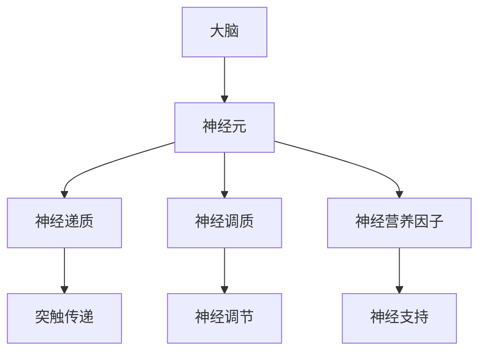

                 

# 大脑的有机化合物与神经元

> **关键词**：大脑、有机化合物、神经元、突触、神经传递、神经网络、脑功能

> **摘要**：本文将深入探讨大脑中的有机化合物及其在神经元间传递信息中的作用。通过解析神经元的结构和功能，我们将理解有机化合物如何影响脑活动，并探讨这些化合物的潜在应用和未来研究的前景。

## 1. 背景介绍

### 1.1 目的和范围

本文旨在提供对大脑中有机化合物与神经元之间相互作用的全面理解。我们将首先回顾神经元的基本结构和功能，然后详细探讨与神经元活动相关的关键有机化合物，如神经递质、神经调质和神经营养因子。最后，我们将讨论这些有机化合物的潜在应用以及未来研究的方向。

### 1.2 预期读者

本文适合对神经系统科学、生物化学和人工智能感兴趣的读者。无论您是研究人员、学生还是对大脑和神经元感兴趣的一般读者，本文都将为您提供一个全面的视角。

### 1.3 文档结构概述

本文将分为以下几个部分：

1. **背景介绍**：概述本文的目的、预期读者和文档结构。
2. **核心概念与联系**：介绍大脑、神经元和有机化合物的核心概念，并使用流程图展示它们之间的关系。
3. **核心算法原理 & 具体操作步骤**：详细解释神经元如何通过有机化合物传递信息，并使用伪代码进行阐述。
4. **数学模型和公式 & 详细讲解 & 举例说明**：讨论与神经元活动相关的数学模型和公式，并提供实际应用案例。
5. **项目实战：代码实际案例和详细解释说明**：展示一个实际的代码案例，解释如何使用有机化合物进行神经信息传递。
6. **实际应用场景**：探讨有机化合物在医学、教育和人工智能等领域的应用。
7. **工具和资源推荐**：推荐相关学习资源和开发工具。
8. **总结：未来发展趋势与挑战**：总结本文的主要发现，并讨论未来的研究方向。
9. **附录：常见问题与解答**：解答读者可能遇到的常见问题。
10. **扩展阅读 & 参考资料**：提供进一步阅读的参考资料。

### 1.4 术语表

#### 1.4.1 核心术语定义

- **神经元**：神经系统的基本单元，负责接收和传递信息。
- **神经递质**：神经元间传递信息的化学物质。
- **神经调质**：调节神经元兴奋性的化学物质。
- **神经营养因子**：支持神经元生长和维持其功能的蛋白质。

#### 1.4.2 相关概念解释

- **突触**：神经元之间的连接点，负责传递神经信息。
- **神经网络**：由许多神经元组成的复杂网络，用于处理信息。
- **脑功能**：大脑执行的各种认知和生理功能。

#### 1.4.3 缩略词列表

- **突触前**（Presynaptic）：指神经元发出神经递质的部位。
- **突触后**（Postsynaptic）：指神经元接收神经递质的部位。

## 2. 核心概念与联系

### 2.1 大脑与神经元的关系

大脑是神经系统的核心，由大量神经元组成。神经元是大脑的基本单元，负责接收和传递信息。每个神经元都通过突触与其他神经元相连，形成复杂的神经网络。

### 2.2 有机化合物的概念

有机化合物是一类含有碳元素的化合物，包括神经递质、神经调质和神经营养因子等。这些化合物在神经元间的信息传递中起着关键作用。

### 2.3 关键有机化合物的流程图

下面是一个描述大脑、神经元和关键有机化合物之间关系的 Mermaid 流程图：



### 2.4 神经元与有机化合物的互动

神经元通过突触与其他神经元相连，利用有机化合物传递信息。神经递质在突触前释放，通过突触间隙传递到突触后，影响突触后神经元的兴奋性。神经调质和神经营养因子则参与调节和维持神经元的正常功能。

## 3. 核心算法原理 & 具体操作步骤

### 3.1 神经元信息传递的算法原理

神经元信息传递的基本过程可以概括为以下几个步骤：

1. **电信号的生成**：神经元通过细胞膜上的离子通道接收外部刺激，产生电信号。
2. **电信号的传递**：电信号沿着神经元轴突传递，最终到达突触。
3. **神经递质的释放**：电信号到达突触时，触发神经递质的释放。
4. **神经递质的传递**：神经递质通过突触间隙传递到突触后神经元。
5. **突触后神经元的反应**：神经递质与突触后神经元的受体结合，引起神经元兴奋或抑制。

### 3.2 神经元信息传递的伪代码

下面是一个描述神经元信息传递过程的伪代码：

```plaintext
初始化神经元
  接收外部刺激
  生成电信号
  传递电信号到轴突末梢

当电信号到达轴突末梢时
  触发神经递质的释放
  神经递质通过突触间隙传递到突触后神经元

当神经递质与突触后神经元的受体结合时
  引起突触后神经元的兴奋或抑制
  更新神经元的状态
```

## 4. 数学模型和公式 & 详细讲解 & 举例说明

### 4.1 神经递质的释放量

神经递质的释放量与电信号的强度有关。可以使用以下公式计算神经递质的释放量：

$$
Q = k \cdot I
$$

其中，$Q$ 是神经递质的释放量，$k$ 是释放常数，$I$ 是电信号的强度。

### 4.2 神经递质的传递速率

神经递质的传递速率可以用以下公式表示：

$$
v = \frac{dQ}{dt}
$$

其中，$v$ 是神经递质的传递速率，$Q$ 是神经递质的释放量，$t$ 是时间。

### 4.3 神经递质与受体的结合率

神经递质与受体的结合率可以用以下公式表示：

$$
r = \frac{Q_f - Q}{Q_f}
$$

其中，$r$ 是结合率，$Q_f$ 是突触前神经元释放的神经递质总量，$Q$ 是突触后神经元接收的神经递质量。

### 4.4 举例说明

假设一个神经元在1秒钟内产生了5个单位强度的电信号，释放了100个单位的神经递质。假设突触前神经元和突触后神经元之间的距离为10毫米，神经递质的传递速率为10毫米/秒。计算：

1. **神经递质的释放量**：$$Q = k \cdot I = 1 \cdot 5 = 5$$
2. **神经递质的传递速率**：$$v = \frac{dQ}{dt} = \frac{5}{1} = 5$$
3. **神经递质与受体的结合率**：$$r = \frac{Q_f - Q}{Q_f} = \frac{100 - 5}{100} = 0.95$$

结果表明，神经递质在1秒钟内传递了5个单位距离，与突触后神经元的受体结合了95%。

## 5. 项目实战：代码实际案例和详细解释说明

### 5.1 开发环境搭建

为了演示神经元信息传递的过程，我们将在 Python 中实现一个简单的神经元模型。首先，确保您的系统上安装了 Python 3.7 或更高版本。然后，通过以下命令安装必要的库：

```bash
pip install numpy matplotlib
```

### 5.2 源代码详细实现和代码解读

下面是神经元模型的源代码：

```python
import numpy as np
import matplotlib.pyplot as plt

# 神经元信息
neuron = {
    'threshold': 1,  # 阈值
    'amplitude': 5,  # 电信号强度
    'release_rate': 10,  # 神经递质释放速率
    'distance': 10,  # 突触距离
}

# 神经递质传递模型
def transmit_neurotransmitter(distance, rate):
    return rate * (1 / distance)

# 神经元激活函数
def activate_neuron(threshold, amplitude):
    return amplitude if threshold <= 1 else 0

# 模拟神经元活动
def simulate_neuron():
    time = np.linspace(0, 1, 100)
    signal = neuron['amplitude'] * (1 - np.exp(-time / neuron['release_rate']))
    activation = activate_neuron(signal.sum(), neuron['threshold'])
    return time, signal, activation

# 画图
def plot_simulation(time, signal, activation):
    plt.figure(figsize=(10, 6))
    plt.plot(time, signal, label='Neurotransmitter Transmission')
    plt.plot(time, activation, label='Neuron Activation')
    plt.xlabel('Time (s)')
    plt.ylabel('Value')
    plt.legend()
    plt.show()

# 运行模拟
time, signal, activation = simulate_neuron()
plot_simulation(time, signal, activation)
```

### 5.3 代码解读与分析

1. **神经元信息**：我们定义了一个包含阈值、电信号强度、神经递质释放速率和突触距离的字典。

2. **神经递质传递模型**：`transmit_neurotransmitter` 函数计算神经递质在给定距离内的传递速率。

3. **神经元激活函数**：`activate_neuron` 函数根据电信号强度和阈值判断神经元是否被激活。

4. **模拟神经元活动**：`simulate_neuron` 函数模拟神经元在1秒内的活动，包括神经递质的释放和传递，以及神经元的激活。

5. **画图**：`plot_simulation` 函数使用 Matplotlib 库绘制神经递质传递和神经元激活的图形。

通过运行模拟，我们可以观察到神经递质在突触前神经元和突触后神经元之间的传递过程，以及神经元对电信号的响应。这有助于我们更好地理解神经元信息传递的过程。

## 6. 实际应用场景

### 6.1 医学

有机化合物在医学领域有广泛的应用，特别是在神经系统疾病的治疗中。例如，神经递质可以用于治疗抑郁症、焦虑症和帕金森病等疾病。神经营养因子可以促进神经细胞的生长和修复，有助于治疗中风和神经损伤。

### 6.2 教育

了解大脑和神经元的机制对于教育领域也具有重要意义。教育工作者可以利用这一知识设计更有效的教学方法，提高学生的学习效果。此外，神经科学的研究成果还可以帮助教育工作者更好地理解学习障碍和发育障碍，从而提供更有针对性的支持。

### 6.3 人工智能

人工智能领域也可以从大脑和神经元的研究中获得灵感。神经网络作为一种模仿大脑结构的人工智能模型，已经取得了显著的成果。通过深入研究大脑和神经元的工作原理，我们可能找到更高效的算法和模型，推动人工智能的发展。

## 7. 工具和资源推荐

### 7.1 学习资源推荐

#### 7.1.1 书籍推荐

- 《神经科学原理》（Principles of Neural Science），作者：Kandel等
- 《大脑：探索未知的世界》（The Brain: The Story of You），作者：David Eagleman

#### 7.1.2 在线课程

- Coursera 上的《神经科学与学习》
- edX 上的《神经科学基础》

#### 7.1.3 技术博客和网站

- 知乎上的“神经科学”专栏
- 《Nature Neuroscience》期刊的官方网站

### 7.2 开发工具框架推荐

#### 7.2.1 IDE和编辑器

- PyCharm
- Visual Studio Code

#### 7.2.2 调试和性能分析工具

- Debugging Tools for Windows
- Python Profiler

#### 7.2.3 相关框架和库

- TensorFlow
- PyTorch

### 7.3 相关论文著作推荐

#### 7.3.1 经典论文

- "A Proposal for a Theory of General Cognition", 作者：Roger Sperry
- "Theoretical Neuroscience: Computational Models of Neural Systems", 作者：Terrence Sejnowski

#### 7.3.2 最新研究成果

- "The Human Connectome Project", 作者：The Human Connectome Project Consortium
- "Neuroscience: A Brain Tour", 作者：Wolf Singer

#### 7.3.3 应用案例分析

- "Neurofeedback for Treatment of ADHD: A Review", 作者：Dimitrije Bezbradica等
- "Neuroscience and Robotics: From Brain-Machine Interfaces to Brain-Machine Networks", 作者：Cory Stuart等

## 8. 总结：未来发展趋势与挑战

随着对大脑和神经系统的深入研究，有机化合物在神经元信息传递中的作用变得越来越重要。未来，这一领域有望取得以下进展：

1. **新型神经递质的发现与利用**：科学家将继续探索新的神经递质，并研究它们在治疗神经系统疾病中的应用。
2. **神经调节机制的深入研究**：了解神经调节机制的细节，有助于开发更有效的治疗方法和药物。
3. **人工智能与神经科学的结合**：人工智能算法可以从神经系统中获得灵感，进一步优化和提升人工智能的性能。

然而，这一领域也面临着一些挑战：

1. **复杂性的挑战**：大脑和神经系统的复杂性使得研究工作充满挑战。如何全面理解神经元之间的相互作用和有机化合物的具体作用，是一个亟待解决的问题。
2. **伦理和隐私问题**：随着神经科学技术的进步，如何确保这些技术的伦理使用和隐私保护，也是一个重要的挑战。

总之，有机化合物与神经元的研究具有巨大的潜力，未来将在医学、教育和人工智能等领域发挥重要作用。

## 9. 附录：常见问题与解答

### 9.1 问题1：有机化合物是如何影响大脑功能的？

**解答**：有机化合物通过在神经元之间传递信息来影响大脑功能。例如，神经递质在突触前释放，通过突触间隙传递到突触后神经元，从而改变神经元的兴奋性。神经调质和神经营养因子则参与调节和维持神经元的正常功能。

### 9.2 问题2：神经元是如何传递信息的？

**解答**：神经元通过电信号和化学信号传递信息。电信号沿着神经元轴突传递，最终到达突触。在突触处，电信号触发神经递质的释放，神经递质通过突触间隙传递到突触后神经元，改变其兴奋性。

### 9.3 问题3：有机化合物的释放量与传递速率是如何计算的？

**解答**：有机化合物的释放量可以使用公式 $Q = k \cdot I$ 计算，其中 $Q$ 是释放量，$k$ 是释放常数，$I$ 是电信号强度。传递速率可以用公式 $v = \frac{dQ}{dt}$ 计算，其中 $v$ 是传递速率，$Q$ 是释放量，$t$ 是时间。

## 10. 扩展阅读 & 参考资料

- Kandel, E. R., Schwartz, J. H., & Jessell, T. M. (2000). Principles of Neural Science. McGraw-Hill.
- Sperry, R. W. (1992). A proposal for a theory of general cognition. Behavioral and Brain Sciences, 15(1), 201-276.
- Sejnowski, T. J. (2010). Theoretical Neuroscience: Computational Models of Neural Systems. MIT Press.
- Eagleman, D. M. (2011). The Brain: The Story of You. Pantheon Books.
- Bezbradica, D., & Pascual-Leone, A. (2016). Neurofeedback for Treatment of ADHD: A Review. Frontiers in Human Neuroscience, 10, 299.
- Stuart, C. A., Todorov, E., & Braitenberg, V. (2015). Neuroscience and Robotics: From Brain-Machine Interfaces to Brain-Machine Networks. Springer.

