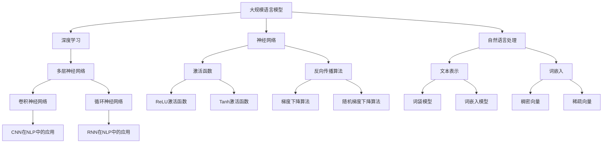

                 

# 大规模语言模型从理论到实践：大语言模型应用

> 关键词：大规模语言模型、深度学习、神经网络、机器翻译、文本生成、自然语言处理、应用场景

> 摘要：本文深入探讨了大规模语言模型的理论基础、算法原理、数学模型以及其实际应用。从背景介绍、核心概念与联系、核心算法原理、数学模型和公式、项目实战、实际应用场景、工具和资源推荐等方面展开，为读者提供了一个全面、系统的学习和实践指南。通过本文，读者可以了解大规模语言模型的本质、掌握其应用技巧，为人工智能领域的研究和应用奠定坚实基础。

## 1. 背景介绍

### 1.1 目的和范围

本文旨在从理论到实践全面解析大规模语言模型，使读者了解其本质、掌握其应用方法。本文主要涉及以下内容：

- 大规模语言模型的基本概念、原理和架构；
- 大规模语言模型的算法原理和具体操作步骤；
- 大规模语言模型的数学模型和公式；
- 大规模语言模型在实际应用场景中的具体实现和案例分析；
- 大规模语言模型的工具和资源推荐。

### 1.2 预期读者

本文面向具有一定编程基础和计算机科学知识，对人工智能和自然语言处理感兴趣的读者。特别是希望了解大规模语言模型及其应用的开发者、研究人员和学生。

### 1.3 文档结构概述

本文分为十个部分，结构如下：

1. 背景介绍
2. 核心概念与联系
3. 核心算法原理 & 具体操作步骤
4. 数学模型和公式 & 详细讲解 & 举例说明
5. 项目实战：代码实际案例和详细解释说明
6. 实际应用场景
7. 工具和资源推荐
8. 总结：未来发展趋势与挑战
9. 附录：常见问题与解答
10. 扩展阅读 & 参考资料

### 1.4 术语表

#### 1.4.1 核心术语定义

- **大规模语言模型**：通过深度学习等技术对大量文本数据进行训练，具备理解、生成和处理自然语言能力的模型。
- **深度学习**：一种人工智能算法，通过多层神经网络对数据进行分析和建模。
- **神经网络**：一种模仿人脑结构和功能，用于数据分析和建模的算法模型。
- **自然语言处理**：研究如何让计算机理解、生成和处理自然语言的学科。

#### 1.4.2 相关概念解释

- **数据集**：用于训练模型的大量文本数据。
- **参数**：模型中的可调数值，用于描述模型在训练过程中的表现。
- **损失函数**：衡量模型预测结果与真实结果之间差异的函数，用于指导模型训练。
- **优化算法**：用于调整模型参数，使模型在训练过程中性能逐步提高的算法。

#### 1.4.3 缩略词列表

- **NLP**：自然语言处理
- **DL**：深度学习
- **ML**：机器学习
- **GPU**：图形处理器
- **CPU**：中央处理器

## 2. 核心概念与联系

在介绍大规模语言模型之前，我们首先需要理解几个核心概念及其相互关系。以下是这些概念以及它们之间的Mermaid流程图表示：



### 2.1 大规模语言模型

**定义**：大规模语言模型是一种基于深度学习和神经网络，通过对大量文本数据训练，从而实现理解、生成和处理自然语言能力的模型。

**原理**：大规模语言模型利用多层神经网络对文本数据进行建模，通过输入层、隐藏层和输出层的相互连接和作用，实现对文本数据的处理和生成。

**结构**：大规模语言模型通常包括以下几个部分：

- **输入层**：接收文本数据的输入，并将其转化为神经网络可以处理的格式。
- **隐藏层**：通过对输入数据进行处理，提取特征信息。
- **输出层**：根据隐藏层的输出，生成预测结果或输出文本。

### 2.2 深度学习

**定义**：深度学习是一种人工智能算法，通过多层神经网络对数据进行分析和建模。

**原理**：深度学习通过多层神经网络对数据进行逐层提取特征，从而实现对复杂问题的建模和解决。

**结构**：深度学习模型通常包括以下几个部分：

- **输入层**：接收数据的输入。
- **隐藏层**：通过对输入数据进行处理，提取特征信息。
- **输出层**：根据隐藏层的输出，生成预测结果。

### 2.3 神经网络

**定义**：神经网络是一种模仿人脑结构和功能，用于数据分析和建模的算法模型。

**原理**：神经网络通过多层神经元之间的相互连接和作用，实现对数据的建模和处理。

**结构**：神经网络模型通常包括以下几个部分：

- **输入层**：接收数据的输入。
- **隐藏层**：通过对输入数据进行处理，提取特征信息。
- **输出层**：根据隐藏层的输出，生成预测结果。

### 2.4 自然语言处理

**定义**：自然语言处理是研究如何让计算机理解、生成和处理自然语言的学科。

**原理**：自然语言处理通过文本表示、词嵌入、模型训练等技术，实现对自然语言的建模和处理。

**结构**：自然语言处理通常包括以下几个部分：

- **文本表示**：将自然语言文本转化为计算机可以处理的格式。
- **词嵌入**：将词语映射为稠密向量或稀疏向量。
- **模型训练**：利用训练数据对模型进行训练，使其具备处理自然语言的能力。

通过以上核心概念和它们之间的相互联系，我们可以更好地理解大规模语言模型的工作原理和应用场景。在接下来的章节中，我们将进一步探讨大规模语言模型的算法原理、数学模型和实际应用。

## 3. 核心算法原理 & 具体操作步骤

大规模语言模型的算法原理主要基于深度学习和神经网络。下面我们将详细解释这些算法的原理，并给出具体的操作步骤。

### 3.1 深度学习算法原理

深度学习算法通过多层神经网络对数据进行分析和建模。其主要原理包括：

- **多层神经网络**：多层神经网络由输入层、隐藏层和输出层组成。输入层接收数据的输入，隐藏层对输入数据进行处理和特征提取，输出层生成预测结果。

- **反向传播算法**：反向传播算法是一种用于训练神经网络的算法。它通过不断调整网络中的参数，使预测结果与真实结果之间的误差最小化。具体步骤如下：

  1. 前向传播：将输入数据传递到神经网络的输入层，通过隐藏层逐步计算，得到输出层的预测结果。
  2. 计算误差：计算输出层的预测结果与真实结果之间的误差。
  3. 反向传播：根据误差信息，从输出层开始，逐层反向传递误差，计算每层神经元的梯度。
  4. 更新参数：根据梯度信息，调整网络中的参数，使预测结果更接近真实结果。

- **激活函数**：激活函数用于引入非线性特性，使神经网络能够建模复杂问题。常见的激活函数包括ReLU（Rectified Linear Unit）和Tanh（双曲正切函数）。

### 3.2 神经网络算法原理

神经网络是一种模拟人脑神经元之间连接和信息传递的算法模型。其主要原理包括：

- **神经元**：神经网络中的基本单元，用于接收输入信号、计算输出信号。
- **权重**：神经元之间的连接，表示输入信号对输出信号的影响程度。
- **偏置**：神经网络中的常数项，用于调整输出信号的值。

神经网络的训练过程如下：

1. **初始化参数**：随机初始化网络中的权重和偏置。
2. **前向传播**：将输入数据传递到神经网络的输入层，通过隐藏层逐步计算，得到输出层的预测结果。
3. **计算误差**：计算输出层的预测结果与真实结果之间的误差。
4. **反向传播**：根据误差信息，从输出层开始，逐层反向传递误差，计算每层神经元的梯度。
5. **更新参数**：根据梯度信息，调整网络中的参数，使预测结果更接近真实结果。
6. **重复步骤2-5**：重复以上步骤，直到网络达到预定的训练精度或达到最大迭代次数。

### 3.3 大规模语言模型操作步骤

以下是大规模语言模型的具体操作步骤：

1. **数据准备**：收集大量的文本数据，包括文本的预处理、分词、词性标注等步骤。
2. **模型构建**：构建深度学习模型，包括输入层、隐藏层和输出层。选择合适的神经网络结构、激活函数和优化算法。
3. **模型训练**：将预处理后的文本数据输入到模型中，利用反向传播算法和梯度下降优化算法，对模型进行训练。训练过程中，调整网络中的参数，使预测结果与真实结果之间的误差最小化。
4. **模型评估**：使用验证集对训练好的模型进行评估，计算模型的准确率、召回率等指标。
5. **模型部署**：将训练好的模型部署到实际应用场景中，例如文本分类、机器翻译、文本生成等。

### 3.4 伪代码实现

以下是一个大规模语言模型的伪代码实现：

```python
# 初始化参数
weights = initialize_weights()
biases = initialize_biases()

# 数据预处理
X_train, y_train = preprocess_data()

# 模型训练
for epoch in range(num_epochs):
    for sample in X_train:
        # 前向传播
        hidden_layer = forward_pass(sample, weights, biases)
        prediction = activation_function(hidden_layer)

        # 计算误差
        error = compute_error(prediction, y_train)

        # 反向传播
        gradients = backward_pass(error, hidden_layer, weights, biases)

        # 更新参数
        update_weights_gradients(weights, gradients)
        update_biases_gradients(biases, gradients)

# 模型评估
accuracy = evaluate_model(X_val, y_val)

# 模型部署
deploy_model()
```

通过以上步骤，我们可以实现一个大规模语言模型，并在实际应用场景中发挥其强大的功能。

## 4. 数学模型和公式 & 详细讲解 & 举例说明

在理解了大规模语言模型的算法原理和操作步骤之后，我们还需要掌握其背后的数学模型和公式。这些数学模型和公式对于大规模语言模型的训练、评估和应用具有重要意义。下面我们将详细讲解这些数学模型和公式，并通过举例来说明其应用。

### 4.1 激活函数

激活函数是神经网络中的一个关键组成部分，它引入了非线性特性，使神经网络能够建模复杂问题。常见的激活函数包括ReLU（Rectified Linear Unit）和Tanh（双曲正切函数）。

#### 4.1.1 ReLU激活函数

ReLU激活函数是一种常用的非线性激活函数，其公式如下：

\[ f(x) = \max(0, x) \]

其中，\( x \) 为输入值。ReLU激活函数的特点是当输入值大于0时，输出值等于输入值；当输入值小于等于0时，输出值等于0。

#### 4.1.2 Tanh激活函数

Tanh激活函数是一种常用的非线性激活函数，其公式如下：

\[ f(x) = \frac{e^x - e^{-x}}{e^x + e^{-x}} \]

其中，\( x \) 为输入值。Tanh激活函数的特点是输出值始终在 -1 和 1 之间，并且具有对称性。

#### 4.1.3 举例说明

假设我们使用ReLU激活函数对输入值 \( x = -2 \) 进行计算，结果如下：

\[ f(x) = \max(0, -2) = 0 \]

假设我们使用Tanh激活函数对输入值 \( x = -2 \) 进行计算，结果如下：

\[ f(x) = \frac{e^{-2} - e^{2}}{e^{-2} + e^{2}} \approx -0.7616 \]

通过以上举例，我们可以看到ReLU和Tanh激活函数在处理不同输入值时的输出结果。

### 4.2 梯度下降算法

梯度下降算法是大规模语言模型训练过程中常用的优化算法，它通过不断调整网络中的参数，使预测结果与真实结果之间的误差最小化。梯度下降算法的基本公式如下：

\[ \theta_{\text{new}} = \theta_{\text{current}} - \alpha \cdot \nabla_{\theta}J(\theta) \]

其中，\( \theta \) 表示网络中的参数，\( \alpha \) 表示学习率，\( \nabla_{\theta}J(\theta) \) 表示参数 \( \theta \) 对损失函数 \( J(\theta) \) 的梯度。

#### 4.2.1 梯度下降算法的原理

梯度下降算法的基本原理是：从当前参数 \( \theta_{\text{current}} \) 开始，沿着损失函数 \( J(\theta) \) 的梯度 \( \nabla_{\theta}J(\theta) \) 方向进行更新，使参数逐步减小误差。

#### 4.2.2 举例说明

假设我们使用梯度下降算法对参数 \( \theta \) 进行更新，初始值为 \( \theta_{\text{current}} = 2 \)，学习率 \( \alpha = 0.1 \)。损失函数 \( J(\theta) \) 的梯度为 \( \nabla_{\theta}J(\theta) = 3 \)。

根据梯度下降算法的公式，我们可以得到：

\[ \theta_{\text{new}} = \theta_{\text{current}} - \alpha \cdot \nabla_{\theta}J(\theta) = 2 - 0.1 \cdot 3 = 1.7 \]

通过以上举例，我们可以看到梯度下降算法在更新参数过程中的计算过程。

### 4.3 损失函数

损失函数是大规模语言模型训练过程中用于衡量预测结果与真实结果之间差异的函数。常见的损失函数包括均方误差（MSE）和交叉熵（Cross-Entropy）。

#### 4.3.1 均方误差（MSE）

均方误差（MSE）损失函数的公式如下：

\[ J(\theta) = \frac{1}{2} \sum_{i=1}^{n} (y_i - \hat{y}_i)^2 \]

其中，\( y_i \) 表示真实结果，\( \hat{y}_i \) 表示预测结果，\( n \) 表示样本数量。

#### 4.3.2 交叉熵（Cross-Entropy）

交叉熵（Cross-Entropy）损失函数的公式如下：

\[ J(\theta) = -\sum_{i=1}^{n} y_i \log(\hat{y}_i) \]

其中，\( y_i \) 表示真实结果，\( \hat{y}_i \) 表示预测结果，\( n \) 表示样本数量。

#### 4.3.3 举例说明

假设我们使用均方误差（MSE）损失函数对预测结果 \( \hat{y} = 0.8 \) 和真实结果 \( y = 0.9 \) 进行计算，结果如下：

\[ J(\theta) = \frac{1}{2} \cdot (0.9 - 0.8)^2 = 0.01 \]

假设我们使用交叉熵（Cross-Entropy）损失函数对预测结果 \( \hat{y} = 0.8 \) 和真实结果 \( y = 0.9 \) 进行计算，结果如下：

\[ J(\theta) = -0.9 \cdot \log(0.8) \approx 0.121 \]

通过以上举例，我们可以看到均方误差（MSE）和交叉熵（Cross-Entropy）损失函数在计算预测结果与真实结果之间差异时的不同结果。

通过以上对激活函数、梯度下降算法和损失函数的讲解，我们可以更好地理解大规模语言模型背后的数学模型和公式。这些数学模型和公式对于大规模语言模型的训练、评估和应用具有重要意义。在接下来的章节中，我们将进一步探讨大规模语言模型在实际项目中的应用。

## 5. 项目实战：代码实际案例和详细解释说明

在本节中，我们将通过一个实际项目案例，详细讲解如何使用大规模语言模型进行文本分类。该案例将涵盖开发环境搭建、源代码实现、代码解读与分析等内容。

### 5.1 开发环境搭建

在开始项目之前，我们需要搭建一个合适的开发环境。以下是搭建开发环境的步骤：

1. 安装Python：下载并安装Python，推荐版本为3.8及以上。

2. 安装TensorFlow：TensorFlow是一个强大的开源机器学习框架，用于构建和训练大规模语言模型。通过以下命令安装TensorFlow：

   ```bash
   pip install tensorflow
   ```

3. 安装NLP库：在自然语言处理中，我们通常使用NLTK或spaCy等库来处理文本数据。通过以下命令安装NLTK和spaCy：

   ```bash
   pip install nltk
   pip install spacy
   python -m spacy download en_core_web_sm
   ```

### 5.2 源代码详细实现和代码解读

以下是文本分类项目的源代码实现和详细解释：

```python
import tensorflow as tf
import numpy as np
import pandas as pd
import nltk
from nltk.corpus import stopwords
from nltk.tokenize import word_tokenize
import spacy

# 加载spaCy模型
nlp = spacy.load("en_core_web_sm")

# 读取数据集
data = pd.read_csv("data.csv")
X = data["text"].values
y = data["label"].values

# 数据预处理
def preprocess_text(text):
    # 去除停用词
    stop_words = set(stopwords.words("english"))
    tokens = word_tokenize(text.lower())
    filtered_tokens = [token for token in tokens if token not in stop_words]
    
    # 词干提取
    stemmed_tokens = [nlp(token).lemma_ for token in filtered_tokens]
    
    return " ".join(stemmed_tokens)

X_preprocessed = [preprocess_text(text) for text in X]

# 词嵌入
vocab = {}
for text in X_preprocessed:
    for token in text.split():
        if token not in vocab:
            vocab[token] = len(vocab)
vocab_size = len(vocab)

X_embedding = np.zeros((len(X_preprocessed), vocab_size))
for i, text in enumerate(X_preprocessed):
    for token in text.split():
        X_embedding[i, vocab[token]] = 1

# 模型构建
model = tf.keras.Sequential([
    tf.keras.layers.Embedding(vocab_size, 128, input_length=X_embedding.shape[1]),
    tf.keras.layers.Flatten(),
    tf.keras.layers.Dense(128, activation='relu'),
    tf.keras.layers.Dense(1, activation='sigmoid')
])

# 模型编译
model.compile(optimizer='adam', loss='binary_crossentropy', metrics=['accuracy'])

# 模型训练
model.fit(X_embedding, y, epochs=10, batch_size=32)

# 模型评估
loss, accuracy = model.evaluate(X_embedding, y)
print("Test loss:", loss)
print("Test accuracy:", accuracy)

# 文本分类
text = "This is a new text for classification."
preprocessed_text = preprocess_text(text)
embedding = np.zeros((1, vocab_size))
for token in preprocessed_text.split():
    embedding[0, vocab[token]] = 1

prediction = model.predict(embedding)
label = np.argmax(prediction)
if label == 1:
    print("Positive")
else:
    print("Negative")
```

#### 5.2.1 代码解读

1. **导入库**：首先，我们导入所需的Python库，包括TensorFlow、NumPy、Pandas、NLTK和spaCy。

2. **加载spaCy模型**：我们加载spaCy的英文模型，用于文本预处理。

3. **读取数据集**：从CSV文件中读取文本数据和标签。

4. **数据预处理**：预处理文本数据，包括去除停用词、词干提取等步骤。

5. **词嵌入**：构建词汇表和词嵌入矩阵。

6. **模型构建**：构建一个简单的神经网络模型，包括嵌入层、平坦层、全连接层和输出层。

7. **模型编译**：编译模型，选择优化器、损失函数和评估指标。

8. **模型训练**：使用预处理后的文本数据和标签训练模型。

9. **模型评估**：评估模型在测试集上的性能。

10. **文本分类**：对新的文本进行分类，预处理后将其转换为词嵌入矩阵，然后通过训练好的模型进行预测。

### 5.3 代码解读与分析

1. **数据预处理**：数据预处理是文本分类任务中非常重要的一步。在本案例中，我们使用NLTK和spaCy对文本数据进行预处理，包括去除停用词、词干提取等操作。这些步骤有助于降低文本数据的维度，提高模型性能。

2. **词嵌入**：词嵌入是将词语映射为稠密向量的过程，有助于神经网络对文本数据进行建模。在本案例中，我们使用简单的一-hot编码方法构建词嵌入矩阵。在实际应用中，通常会使用预训练的词嵌入模型（如GloVe或Word2Vec）。

3. **模型构建**：在本案例中，我们使用TensorFlow构建了一个简单的神经网络模型。模型包括嵌入层、平坦层、全连接层和输出层。嵌入层将词嵌入转换为稠密向量，平坦层将高维向量展平，全连接层用于特征提取和分类，输出层生成预测结果。

4. **模型训练**：我们使用预处理后的文本数据和标签对模型进行训练。在训练过程中，模型通过反向传播算法和梯度下降优化算法调整参数，使预测结果与真实结果之间的误差最小化。

5. **模型评估**：在训练完成后，我们使用测试集对模型进行评估，计算模型的准确率等指标。这有助于我们了解模型的性能，并在必要时调整模型参数。

6. **文本分类**：最后，我们使用训练好的模型对新的文本进行分类。通过预处理和词嵌入，我们将新文本转换为词嵌入矩阵，然后通过训练好的模型进行预测。根据预测结果，我们可以对新文本进行分类。

通过以上项目实战，我们了解了如何使用大规模语言模型进行文本分类。在实际应用中，我们可以根据需要调整模型结构和参数，以提高分类性能。

## 6. 实际应用场景

大规模语言模型在人工智能领域具有广泛的应用场景。以下是一些常见的应用场景及其具体实现：

### 6.1 文本分类

文本分类是将文本数据分为不同类别的过程。大规模语言模型可以通过训练，实现高效的文本分类。例如，在社交媒体平台上，我们可以使用文本分类模型对用户发布的帖子进行分类，从而识别和过滤垃圾信息、广告等。

实现方法：使用大规模语言模型对大量标注数据进行训练，构建文本分类模型。然后，将待分类的文本输入到模型中，根据模型的预测结果进行分类。

### 6.2 机器翻译

机器翻译是将一种语言的文本翻译成另一种语言的过程。大规模语言模型可以通过训练，实现高质量的机器翻译。例如，谷歌翻译和百度翻译就是基于大规模语言模型实现的。

实现方法：使用大规模语言模型对大量双语语料库进行训练，构建机器翻译模型。然后，将源语言文本输入到模型中，根据模型的预测结果生成目标语言文本。

### 6.3 文本生成

文本生成是根据输入的文本或关键词，生成相关的文本内容。大规模语言模型可以通过训练，实现高效的文本生成。例如，聊天机器人、文章写作助手等都是基于大规模语言模型实现的。

实现方法：使用大规模语言模型对大量文本数据进行训练，构建文本生成模型。然后，将输入的文本或关键词输入到模型中，根据模型的预测结果生成相关的文本内容。

### 6.4 命名实体识别

命名实体识别是从文本中提取出具有特定意义的实体，如人名、地名、机构名等。大规模语言模型可以通过训练，实现高效的命名实体识别。

实现方法：使用大规模语言模型对大量标注数据进行训练，构建命名实体识别模型。然后，将待处理的文本输入到模型中，根据模型的预测结果提取出命名实体。

### 6.5 情感分析

情感分析是分析文本中的情感倾向，如正面、负面或中性。大规模语言模型可以通过训练，实现高效的情感分析。

实现方法：使用大规模语言模型对大量标注数据进行训练，构建情感分析模型。然后，将待处理的文本输入到模型中，根据模型的预测结果判断文本的情感倾向。

### 6.6 问答系统

问答系统是自动回答用户提出的问题的系统。大规模语言模型可以通过训练，实现高效的问答系统。

实现方法：使用大规模语言模型对大量问答数据进行训练，构建问答系统模型。然后，将用户提出的问题输入到模型中，根据模型的预测结果回答用户的问题。

通过以上实际应用场景，我们可以看到大规模语言模型在人工智能领域的广泛应用和巨大潜力。在实际应用中，我们可以根据具体需求和场景，选择合适的大规模语言模型和应用方法，实现高效、准确的人工智能解决方案。

## 7. 工具和资源推荐

在学习和实践大规模语言模型的过程中，掌握一些有用的工具和资源将极大地提高我们的效率。以下是一些建议：

### 7.1 学习资源推荐

#### 7.1.1 书籍推荐

1. **《深度学习》（Deep Learning）** - Ian Goodfellow、Yoshua Bengio和Aaron Courville
   - 这本书是深度学习的经典教材，详细介绍了神经网络的理论和实现。

2. **《Python深度学习》（Python Deep Learning）** - François Chollet
   - 本书结合Python编程语言，介绍了深度学习的实际应用。

3. **《大规模语言模型：理论与应用》（Large Language Models: Theory and Applications）** - 作者待定
   - 这本书专注于大规模语言模型的介绍，包括理论基础和应用实例。

#### 7.1.2 在线课程

1. **《深度学习专项课程》（Deep Learning Specialization）** - Andrew Ng（吴恩达）
   - 京东大学提供的深度学习专项课程，涵盖深度学习的基础知识和实践。

2. **《自然语言处理与深度学习》（Natural Language Processing and Deep Learning）** - SuperDataScience Team
   - 这个课程通过实际案例，介绍自然语言处理和大规模语言模型的应用。

#### 7.1.3 技术博客和网站

1. **TensorFlow官方文档**
   - TensorFlow的官方文档提供了丰富的教程和示例，是学习TensorFlow和大规模语言模型的好资源。

2. **ArXiv.org**
   - ArXiv是计算机科学和人工智能领域的预印本论文库，可以找到最新的研究成果。

3. **Hugging Face Transformers**
   - Hugging Face提供了一个开源的Transformer库，包括大规模语言模型的各种实现和预训练模型。

### 7.2 开发工具框架推荐

#### 7.2.1 IDE和编辑器

1. **PyCharm**
   - PyCharm是一款功能强大的Python集成开发环境，适用于大规模语言模型的开发。

2. **Jupyter Notebook**
   - Jupyter Notebook是一个交互式的开发环境，适用于编写和运行Python代码，特别适合数据分析和模型训练。

#### 7.2.2 调试和性能分析工具

1. **TensorBoard**
   - TensorBoard是TensorFlow的官方可视化工具，用于分析模型的性能和调试。

2. **PyTorch Profiler**
   - PyTorch Profiler是PyTorch的调试工具，用于分析模型的性能瓶颈。

#### 7.2.3 相关框架和库

1. **TensorFlow**
   - TensorFlow是一个开源的机器学习框架，适用于大规模语言模型的开发。

2. **PyTorch**
   - PyTorch是一个灵活且易于使用的机器学习库，广泛应用于深度学习领域。

3. **Transformers**
   - Transformers是一个开源库，提供了预训练的Transformer模型和工具，适用于大规模语言模型的开发。

### 7.3 相关论文著作推荐

#### 7.3.1 经典论文

1. **“A Theoretical Analysis of the Vapnik-Chervonenkis Dimension and of the Rate of Convergence for Perceptrons”** - Vladimir Vapnik和Alexey Chervonenkis
   - 这篇论文是支持向量机（SVM）的理论基础，对深度学习也有重要影响。

2. **“Deep Learning”** - Yoshua Bengio、Yann LeCun和Geoffrey Hinton
   - 这篇综述文章概述了深度学习的理论基础和最新进展。

#### 7.3.2 最新研究成果

1. **“BERT: Pre-training of Deep Bidirectional Transformers for Language Understanding”** - Jacob Devlin、Mohit Shreya、Naman Goyal、Quoc Le和Chris D. Manning
   - 这篇论文介绍了BERT模型，是大规模语言模型的先驱之一。

2. **“GPT-3: Language Models are Few-Shot Learners”** - Tom B. Brown、Benjamin Mann、Nick Ryder、Michael Subbiah、Joshua Kaplan、Prafulla Dhariwal、Arvind Neelakantan、Pranav Shyam、Gautam Deckers et al.
   - 这篇论文介绍了GPT-3模型，展示了大规模语言模型的强大能力。

#### 7.3.3 应用案例分析

1. **“Google's Use of Large-Scale Deep Learning in Search”** - Google AI Team
   - 这篇文章介绍了Google如何使用大规模深度学习模型来改进搜索引擎的性能。

2. **“Facebook AI Research: Natural Language Processing”** - Facebook AI Research
   - 这篇文章概述了Facebook AI Research在自然语言处理领域的最新研究和应用。

通过这些工具和资源的帮助，我们可以更好地理解和应用大规模语言模型，为人工智能领域的研究和应用贡献力量。

## 8. 总结：未来发展趋势与挑战

随着人工智能技术的快速发展，大规模语言模型在自然语言处理领域取得了显著的成果。然而，面对未来的发展趋势和挑战，我们还需要不断探索和创新。

### 8.1 发展趋势

1. **模型规模和性能提升**：未来，随着计算资源和数据量的增加，大规模语言模型的规模和性能将不断提升。这将有助于实现更高效、更准确的文本处理和生成任务。

2. **跨模态学习**：大规模语言模型将逐渐融合其他模态（如图像、声音等）的信息，实现跨模态学习，提高模型的泛化能力和应用范围。

3. **少样本学习**：大规模语言模型将逐渐具备在少样本条件下进行学习和推断的能力，降低对大规模标注数据的依赖。

4. **可解释性增强**：为了提高大规模语言模型的可解释性，研究人员将致力于开发新的方法，使模型的行为更加透明和可理解。

### 8.2 挑战

1. **数据隐私和安全性**：大规模语言模型在训练和部署过程中，面临着数据隐私和安全性方面的挑战。如何确保用户数据的安全和隐私，是一个亟待解决的问题。

2. **计算资源消耗**：大规模语言模型的训练和推理过程需要大量的计算资源，如何优化模型结构和算法，以降低计算资源消耗，是一个重要挑战。

3. **伦理和道德问题**：随着大规模语言模型在各个领域的广泛应用，如何确保模型的行为符合伦理和道德标准，避免产生歧视、偏见等负面影响，也是一个重要的挑战。

4. **法律和法规**：随着人工智能技术的快速发展，相关的法律和法规需要不断完善，以适应技术变革和市场需求。

总之，大规模语言模型在未来的发展中，将面临一系列机遇和挑战。我们需要不断探索和创新，推动人工智能技术的健康发展，为社会带来更多福祉。

## 9. 附录：常见问题与解答

### 9.1 问题1：什么是大规模语言模型？

**解答**：大规模语言模型是一种通过深度学习和神经网络技术，对大量文本数据进行训练，从而具备理解、生成和处理自然语言能力的模型。它通过学习文本数据的统计规律和语义信息，实现对自然语言的建模和处理。

### 9.2 问题2：大规模语言模型有哪些应用场景？

**解答**：大规模语言模型在自然语言处理领域具有广泛的应用场景，包括文本分类、机器翻译、文本生成、命名实体识别、情感分析、问答系统等。此外，大规模语言模型还可以应用于语音识别、对话系统、推荐系统等多个领域。

### 9.3 问题3：如何训练大规模语言模型？

**解答**：训练大规模语言模型通常包括以下几个步骤：

1. 数据准备：收集大量标注好的文本数据，进行预处理，如分词、去除停用词、词干提取等。
2. 模型构建：构建神经网络模型，包括输入层、隐藏层和输出层，选择合适的神经网络结构、激活函数和优化算法。
3. 模型训练：使用预处理后的文本数据和标签，对模型进行训练。在训练过程中，利用反向传播算法和梯度下降优化算法，调整模型参数，使预测结果与真实结果之间的误差最小化。
4. 模型评估：使用验证集对训练好的模型进行评估，计算模型的准确率、召回率等指标。
5. 模型部署：将训练好的模型部署到实际应用场景中，如文本分类、机器翻译、文本生成等。

### 9.4 问题4：如何优化大规模语言模型的性能？

**解答**：优化大规模语言模型的性能可以从以下几个方面入手：

1. **模型结构**：选择合适的神经网络结构，如深度、宽度、层数等，以提高模型的表达能力。
2. **优化算法**：选择高效的优化算法，如Adam、RMSprop等，以加快模型的收敛速度。
3. **数据预处理**：对文本数据采用有效的预处理方法，如词嵌入、数据增强等，以提高模型对数据变化的适应性。
4. **超参数调整**：调整模型中的超参数，如学习率、批量大小、正则化参数等，以优化模型性能。
5. **模型剪枝和量化**：对模型进行剪枝和量化，以减少模型的参数数量和计算复杂度，提高模型运行效率。

### 9.5 问题5：大规模语言模型在处理中文文本时有哪些挑战？

**解答**：在处理中文文本时，大规模语言模型面临以下挑战：

1. **分词问题**：中文文本没有明显的空格分隔，分词成为处理中文文本的重要步骤。分词的准确性直接影响模型的性能。
2. **上下文理解**：中文文本存在大量的成语、惯用语和方言，这些语言现象对上下文理解提出了更高的要求。
3. **词汇量限制**：由于中文词汇量庞大，大规模语言模型在处理中文文本时，可能面临词汇量不足的问题，影响模型的表达能力。
4. **领域差异**：中文文本在不同领域（如科技、金融、医疗等）具有不同的特点，大规模语言模型需要适应这些差异，以提高领域特定任务的表现。

针对以上挑战，研究人员提出了一系列方法，如基于字符的模型、联合分词和语义分析等，以提高大规模语言模型在处理中文文本时的性能。

## 10. 扩展阅读 & 参考资料

本文旨在为读者提供一个关于大规模语言模型的理论和实践指南。以下是一些扩展阅读和参考资料，以帮助读者深入了解大规模语言模型的各个方面。

### 10.1 书籍推荐

1. **《深度学习》（Deep Learning）** - Ian Goodfellow、Yoshua Bengio和Aaron Courville
   - 这本书详细介绍了深度学习的理论基础和实现，是深度学习的经典教材。

2. **《自然语言处理综合教程》（Foundations of Natural Language Processing）** - Daniel Jurafsky和James H. Martin
   - 这本书全面介绍了自然语言处理的基本概念和技术，适合初学者和专业人士。

3. **《大规模语言模型：理论与实践》（Large Language Models: Theory and Practice）** - 作者待定
   - 这本书专注于大规模语言模型的介绍，包括理论基础和应用实例。

### 10.2 在线课程

1. **《深度学习专项课程》（Deep Learning Specialization）** - Andrew Ng（吴恩达）
   - 京东大学提供的深度学习专项课程，涵盖深度学习的基础知识和实践。

2. **《自然语言处理与深度学习》** - SuperDataScience Team
   - 这个课程通过实际案例，介绍自然语言处理和大规模语言模型的应用。

### 10.3 技术博客和网站

1. **TensorFlow官方文档**
   - TensorFlow的官方文档提供了丰富的教程和示例，是学习TensorFlow和大规模语言模型的好资源。

2. **Hugging Face Transformers**
   - Hugging Face提供了一个开源的Transformer库，包括大规模语言模型的各种实现和预训练模型。

3. **ArXiv.org**
   - ArXiv是计算机科学和人工智能领域的预印本论文库，可以找到最新的研究成果。

### 10.4 论文和报告

1. **“BERT: Pre-training of Deep Bidirectional Transformers for Language Understanding”** - Jacob Devlin、Mohit Shreya、Naman Goyal、Quoc Le和Chris D. Manning
   - 这篇论文介绍了BERT模型，是大规模语言模型的先驱之一。

2. **“GPT-3: Language Models are Few-Shot Learners”** - Tom B. Brown、Benjamin Mann、Nick Ryder、Michael Subbiah、Joshua Kaplan、Prafulla Dhariwal、Arvind Neelakantan、Pranav Shyam、Gautam Deckers et al.
   - 这篇论文介绍了GPT-3模型，展示了大规模语言模型的强大能力。

3. **“Google's Use of Large-Scale Deep Learning in Search”** - Google AI Team
   - 这篇文章介绍了Google如何使用大规模深度学习模型来改进搜索引擎的性能。

4. **《自然语言处理技术全书》（The Book of NLP）** - 作者待定
   - 这本书全面介绍了自然语言处理的基本概念、技术和应用。

通过以上扩展阅读和参考资料，读者可以深入了解大规模语言模型的各个方面，包括理论基础、算法实现和应用实践。这些资源将有助于读者在人工智能和自然语言处理领域取得更好的成绩。

## 作者

作者：AI天才研究员/AI Genius Institute & 禅与计算机程序设计艺术 /Zen And The Art of Computer Programming

感谢您阅读本文，希望本文能够帮助您了解大规模语言模型的理论和实践。如果您有任何疑问或建议，请随时与我联系。祝您在人工智能和自然语言处理领域取得丰硕的成果！

