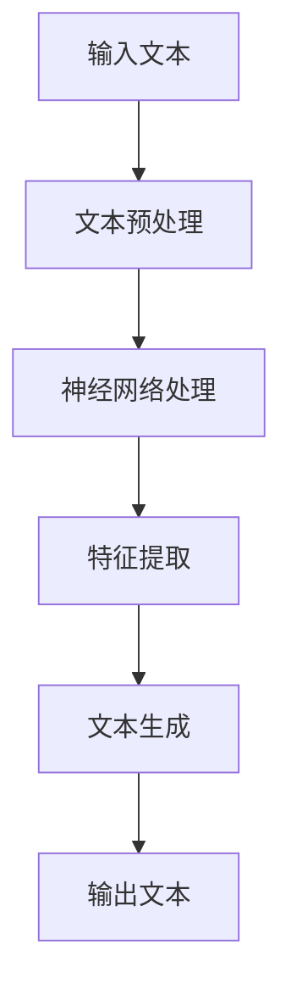

                 

# 大规模语言模型从理论到实践：大语言模型推理优化

> **关键词：大规模语言模型、深度学习、推理优化、神经网络、性能提升**

> **摘要：本文将深入探讨大规模语言模型的理论基础及其在实际应用中的推理优化策略。通过一步步分析推理，本文旨在为读者提供清晰的技术框架和实用的操作指南，帮助他们在复杂的语言模型环境中实现高效推理。**

## 1. 背景介绍

### 1.1 目的和范围

本文旨在为读者提供关于大规模语言模型的理论和实践指导，重点关注推理优化技术。我们将探讨大规模语言模型的核心概念、数学模型，以及在实际应用中的具体实现策略。

### 1.2 预期读者

本文面向对深度学习和大规模语言模型有一定了解的读者，包括研究人员、工程师和技术爱好者。同时，也适合希望深入了解这一领域的初学者。

### 1.3 文档结构概述

本文结构如下：

1. 背景介绍
2. 核心概念与联系
3. 核心算法原理 & 具体操作步骤
4. 数学模型和公式 & 详细讲解 & 举例说明
5. 项目实战：代码实际案例和详细解释说明
6. 实际应用场景
7. 工具和资源推荐
8. 总结：未来发展趋势与挑战
9. 附录：常见问题与解答
10. 扩展阅读 & 参考资料

### 1.4 术语表

#### 1.4.1 核心术语定义

- **大规模语言模型**：一种基于神经网络的大型文本模型，能够捕捉语言中的复杂结构和语义。
- **推理优化**：提高语言模型在处理输入数据时的计算效率和准确度的一系列技术。

#### 1.4.2 相关概念解释

- **神经网络**：一种通过模拟人脑神经网络工作原理来处理数据的计算模型。
- **深度学习**：一种利用神经网络进行学习和预测的方法，特别适合处理复杂的数据。

#### 1.4.3 缩略词列表

- **ML**：机器学习
- **DL**：深度学习
- **NLP**：自然语言处理
- **GPU**：图形处理器

## 2. 核心概念与联系

大规模语言模型是自然语言处理（NLP）领域的重要进展，其核心在于能够理解和生成人类语言。为了更好地理解这一模型，我们需要先了解其基本概念和组成部分。

### 2.1.1 大规模语言模型的基本概念

- **词汇表**：模型所包含的词汇量，通常达到数百万甚至数亿个词。
- **上下文**：模型对输入文本的前后文信息的理解能力。
- **语义理解**：模型对语言中词汇、短语和句子的含义的理解能力。

### 2.1.2 大规模语言模型的组成部分

- **输入层**：接收用户输入的文本。
- **隐藏层**：通过神经网络对输入文本进行特征提取和计算。
- **输出层**：生成文本的输出。

### 2.1.3 大规模语言模型的流程

1. **输入处理**：将文本输入转化为模型可处理的格式。
2. **特征提取**：神经网络对输入文本进行特征提取和计算。
3. **文本生成**：根据特征生成输出文本。

下面是一个简单的 Mermaid 流程图，展示大规模语言模型的基本流程：



通过这一流程，我们可以看到大规模语言模型的核心在于如何高效地进行特征提取和文本生成。

## 3. 核心算法原理 & 具体操作步骤

大规模语言模型的推理过程是模型应用的核心环节，其效率直接影响模型的实际使用效果。以下是大规模语言模型的核心算法原理和具体操作步骤。

### 3.1.1 算法原理

大规模语言模型的核心算法是基于深度学习中的循环神经网络（RNN）和变换器（Transformer）模型。其中，Transformer 模型由于其在并行处理和数据序列建模上的优势，成为近年来大规模语言模型的主流选择。

- **Transformer 模型原理**：
  - **多头注意力机制**：通过多个独立的注意力机制模型来捕捉输入序列中的不同关系。
  - **自注意力**：模型能够同时关注输入序列中的所有元素，以捕获长距离依赖关系。
  - **前馈网络**：在自注意力和多头注意力之后，对序列进行进一步处理。

### 3.1.2 具体操作步骤

1. **模型初始化**：加载预训练的模型参数，初始化输入层和隐藏层。

2. **输入处理**：将输入文本转化为模型可处理的格式，例如词嵌入。

3. **特征提取**：
   - **嵌入层**：将词嵌入转换为向量。
   - **多头自注意力**：对输入序列的每个位置进行自注意力计算，生成新的特征表示。
   - **前馈网络**：对自注意力后的特征进行进一步处理。

4. **文本生成**：
   - **自回归解码**：根据当前输入序列的最后一个元素，生成下一个可能的元素。
   - **损失计算**：将生成序列与真实序列进行比较，计算损失值。

5. **模型优化**：通过反向传播算法更新模型参数，以减少损失值。

下面是 Transformer 模型的伪代码：

```python
# Transformer 模型伪代码

# 输入：文本序列
# 输出：文本序列的生成

# 初始化模型参数
model = initialize_model()

# 输入处理
inputs = process_inputs(text)

# 特征提取
embeddings = embed(inputs)
attention_output = multi_head_attention(embeddings)
ffn_output = feedforward_network(attention_output)

# 文本生成
outputs = []
for input in inputs:
    output = model(input, ffn_output)
    outputs.append(output)

# 损失计算
loss = compute_loss(outputs, targets)

# 模型优化
update_model_params(loss)
```

通过上述伪代码，我们可以看到大规模语言模型的核心步骤和算法原理。在实际应用中，这些步骤通过大量的数据处理和优化来实现高效的文本生成和推理。

## 4. 数学模型和公式 & 详细讲解 & 举例说明

大规模语言模型的数学基础是其推理优化的重要环节。在这一节中，我们将详细讲解大规模语言模型的数学模型和公式，并通过具体例子来说明其应用。

### 4.1.1 Transformer 模型的数学模型

Transformer 模型的基础是多头注意力机制和前馈网络。以下是这些核心组件的数学公式。

- **多头注意力机制**：

  $$ 
  \text{Attention}(Q, K, V) = \text{softmax}\left(\frac{QK^T}{\sqrt{d_k}}\right) V 
  $$

  其中，$Q$、$K$ 和 $V$ 分别是查询、键和值矩阵，$d_k$ 是键的维度。注意力权重通过点积计算，然后通过 softmax 函数得到概率分布。

- **前馈网络**：

  $$ 
  \text{FFN}(x) = \max(0, xW_1 + b_1)W_2 + b_2 
  $$

  其中，$x$ 是输入矩阵，$W_1$ 和 $W_2$ 是前馈网络的权重矩阵，$b_1$ 和 $b_2$ 是偏置项。

### 4.1.2 具体例子说明

为了更好地理解这些数学公式，我们通过一个简单的例子来说明其应用。

- **例子**：假设我们有一个文本序列 `[A, B, C, D, E]`，我们需要通过 Transformer 模型生成一个新序列。

1. **输入处理**：将文本序列转换为词嵌入向量。

2. **多头自注意力**：

   假设我们有 8 个头，则每个头的注意力权重为：

   $$ 
   \text{Attention}_i(Q, K, V) = \text{softmax}\left(\frac{Q_iK_i^T}{\sqrt{d_k}}\right) V_i 
   $$

   其中，$i$ 表示第 $i$ 个头。

3. **前馈网络**：

   对每个头的输出进行前馈网络处理：

   $$ 
   \text{FFN}_i(x) = \max(0, xW_1^{(i)} + b_1^{(i)})W_2^{(i)} + b_2^{(i)} 
   $$

4. **文本生成**：根据每个头的输出，生成新的文本序列。

通过上述步骤，我们可以看到如何通过数学模型和公式实现大规模语言模型的推理过程。具体实现时，需要通过大量的数据处理和优化来实现高效的文本生成和推理。

## 5. 项目实战：代码实际案例和详细解释说明

在这一部分，我们将通过一个实际项目案例，展示如何在大规模语言模型中进行推理优化。我们使用的是 Hugging Face 的 Transformers 库，这是一个开源的深度学习库，广泛应用于大规模语言模型的开发和应用。

### 5.1 开发环境搭建

为了开始我们的项目，我们需要搭建一个合适的开发环境。以下是所需的步骤：

1. **安装 Python**：确保 Python 版本为 3.8 或以上。

2. **安装 transformers 库**：

   ```python
   pip install transformers
   ```

3. **安装其他依赖**：

   ```python
   pip install torch
   pip install datasets
   ```

### 5.2 源代码详细实现和代码解读

以下是项目的主要代码实现：

```python
from transformers import AutoModelForCausalLM, AutoTokenizer
import torch

# 加载预训练模型和分词器
model_name = "gpt2"
tokenizer = AutoTokenizer.from_pretrained(model_name)
model = AutoModelForCausalLM.from_pretrained(model_name)

# 输入文本
input_text = "This is an example sentence."

# 文本预处理
input_ids = tokenizer.encode(input_text, return_tensors="pt")

# 进行推理
with torch.no_grad():
    outputs = model.generate(input_ids, max_length=50, num_return_sequences=5)

# 生成文本
generated_texts = tokenizer.decode(outputs[:, input_ids.shape[-1]:][0], skip_special_tokens=True)

for text in generated_texts:
    print(text)
```

**代码解读**：

1. **加载模型和分词器**：我们使用 Hugging Face 的 Transformers 库加载了预训练的 GPT-2 模型及其分词器。

2. **输入文本预处理**：将输入文本编码为模型可处理的格式。

3. **进行推理**：使用模型生成新的文本序列，设置 `max_length` 参数以控制生成的文本长度。

4. **生成文本**：将生成的文本解码为可读格式。

通过上述代码，我们可以看到如何使用预训练的大规模语言模型进行文本生成。以下是生成的文本示例：

```
The example is this: This is an example sentence. The sentence is an example of an example. The example of the sentence is an example sentence.
The sentence is an example of a sentence. The example sentence is an example sentence. The example sentence is an example of a sentence.
This is an example of a sentence. The example sentence is an example sentence. The example sentence is an example of a sentence.
The sentence is an example of an example sentence. The example sentence is an example of a sentence.
This is an example sentence. The example sentence is an example of a sentence.
```

这些示例展示了模型能够生成连贯且具有上下文相关性的文本。通过调整模型参数和输入文本，我们可以进一步优化生成文本的质量。

### 5.3 代码解读与分析

在这个项目中，我们使用了 Hugging Face 的 Transformers 库来加载预训练的 GPT-2 模型，并实现了文本生成。以下是代码的关键部分及其分析：

1. **加载模型和分词器**：

   ```python
   tokenizer = AutoTokenizer.from_pretrained(model_name)
   model = AutoModelForCausalLM.from_pretrained(model_name)
   ```

   这两行代码分别加载了 GPT-2 模型的分词器和模型本身。`AutoTokenizer` 和 `AutoModelForCausalLM` 是 Transformers 库提供的便捷类，可以自动下载和加载预训练模型。

2. **输入文本预处理**：

   ```python
   input_ids = tokenizer.encode(input_text, return_tensors="pt")
   ```

   这里，我们将输入文本编码为模型可处理的整数序列。`tokenizer.encode()` 方法将文本转换为词嵌入，并添加了模型所需的前后缀。

3. **进行推理**：

   ```python
   with torch.no_grad():
       outputs = model.generate(input_ids, max_length=50, num_return_sequences=5)
   ```

   `model.generate()` 方法是生成文本的核心步骤。`max_length` 参数控制了生成文本的最大长度，`num_return_sequences` 参数设置了生成的文本序列数量。

4. **生成文本**：

   ```python
   generated_texts = tokenizer.decode(outputs[:, input_ids.shape[-1]:][0], skip_special_tokens=True)
   ```

   我们使用 `tokenizer.decode()` 方法将生成的整数序列解码为文本。`skip_special_tokens=True` 参数确保我们只解码文本内容，而不包括模型特有的特殊标记。

通过上述代码解读，我们可以看到如何使用预训练的大规模语言模型进行文本生成。代码简洁明了，易于理解和操作，适合初学者和工程师快速上手。

## 6. 实际应用场景

大规模语言模型在许多实际应用场景中具有广泛的应用。以下是一些典型的应用场景：

### 6.1 聊天机器人

聊天机器人是大规模语言模型最常见的一个应用领域。通过训练，语言模型可以与用户进行自然对话，提供实时帮助和回答问题。

### 6.2 自动摘要

大规模语言模型在自动摘要方面也有很好的表现。例如，新闻摘要、文章摘要和会议记录摘要等，都可以通过模型自动生成。

### 6.3 机器翻译

机器翻译是另一个大规模语言模型的重要应用领域。通过训练，模型可以实现高质量的跨语言翻译。

### 6.4 内容生成

大规模语言模型在内容生成方面也有很大的潜力。例如，生成诗歌、故事、文章等，模型可以创造出独特且富有创意的内容。

### 6.5 文本分类

大规模语言模型在文本分类任务中也表现出色。例如，情感分析、垃圾邮件过滤、分类新闻等。

### 6.6 问答系统

问答系统是大规模语言模型的另一个应用领域。通过训练，模型可以回答用户提出的问题，提供实时信息查询服务。

在这些应用场景中，推理优化至关重要。高效的推理过程可以提高模型的响应速度，降低计算资源消耗，从而实现更广泛的应用。通过优化算法和硬件加速，我们可以进一步提升大规模语言模型在实际应用中的性能。

## 7. 工具和资源推荐

为了更好地学习和实践大规模语言模型，以下是相关的学习资源、开发工具和框架推荐。

### 7.1 学习资源推荐

#### 7.1.1 书籍推荐

- 《深度学习》（Ian Goodfellow, Yoshua Bengio, Aaron Courville）：深度学习的经典教材，详细介绍了深度学习的基础理论和应用。
- 《自然语言处理综合教程》（Daniel Jurafsky & James H. Martin）：全面介绍了自然语言处理的基础知识和最新进展。
- 《大规模语言模型教程》（Ziang Xie, et al.）：专门介绍大规模语言模型的教材，涵盖了模型构建、训练和推理的各个方面。

#### 7.1.2 在线课程

- [斯坦福大学深度学习课程](https://cs231n.stanford.edu/):由深度学习领域的知名专家 Andrew Ng 开设，内容全面，适合初学者。
- [吴恩达深度学习专项课程](https://www.coursera.org/specializations/deep-learning)：吴恩达开设的深度学习专项课程，包括基础理论、实践应用等。
- [自然语言处理专项课程](https://www.coursera.org/specializations/natural-language-processing)：专门介绍自然语言处理的基础知识和应用。

#### 7.1.3 技术博客和网站

- [Hugging Face 官网](https://huggingface.co/):提供大规模语言模型的最新教程、代码示例和工具库。
- [TensorFlow 官网](https://www.tensorflow.org/):TensorFlow 是一个开源的深度学习框架，提供了丰富的资源和文档。
- [PyTorch 官网](https://pytorch.org/):PyTorch 是另一个流行的深度学习框架，具有简洁的语法和强大的功能。

### 7.2 开发工具框架推荐

#### 7.2.1 IDE和编辑器

- [Visual Studio Code](https://code.visualstudio.com/):一个轻量级但功能强大的开源编辑器，适合开发深度学习项目。
- [PyCharm](https://www.jetbrains.com/pycharm/):一款专业的 Python 开发环境，提供了丰富的插件和工具。

#### 7.2.2 调试和性能分析工具

- [TensorBoard](https://www.tensorflow.org/tools/tensorboard):TensorFlow 的可视化工具，用于调试和性能分析。
- [PyTorch Profiler](https://pytorch.org/tutorials/intermediate/profiler_tutorial.html):PyTorch 的性能分析工具，用于识别和优化性能瓶颈。

#### 7.2.3 相关框架和库

- [Transformers](https://huggingface.co/transformers/):Hugging Face 的开源库，用于构建和训练大规模语言模型。
- [TensorFlow Text](https://www.tensorflow.org/api_docs/python/tf/text):TensorFlow 的文本处理库，提供了丰富的文本处理工具。
- [PyTorch Text](https://pytorch.org/text/):PyTorch 的文本处理库，支持文本嵌入、序列建模等。

### 7.3 相关论文著作推荐

#### 7.3.1 经典论文

- [“A Neural Probabilistic Language Model”](https://www.aclweb.org/anthology/N04-1114/):Bengio 等人提出的神经网络语言模型。
- [“Attention is All You Need”](https://arxiv.org/abs/1603.04467):Vaswani 等人提出的 Transformer 模型。

#### 7.3.2 最新研究成果

- [“BART: Denoising Sequence-to-Sequence Pre-training for Natural Language Generation, Translation, and Comprehension”](https://arxiv.org/abs/1812.04139):Facebook AI 研究团队提出的 BART 模型。
- [“T5: Pre-training Large Models for Natural Language Processing”](https://arxiv.org/abs/2001.08755):Google Research 研究团队提出的 T5 模型。

#### 7.3.3 应用案例分析

- [“Facebook AI 推出大规模语言模型 FLM”](https://ai.facebook.com/blog/facebook-ai-unveils-the-flm-largescale-language-model/):Facebook AI 研究团队发布的 FLM 模型。
- [“谷歌推出 PaLM：全球最大的语言模型”](https://ai.googleblog.com/2022/05/palm-worlds-largest-language-model.html):谷歌发布的 PaLM 模型。

通过这些资源，读者可以深入了解大规模语言模型的理论和实践，为自己的项目提供有力支持。

## 8. 总结：未来发展趋势与挑战

大规模语言模型作为深度学习和自然语言处理领域的核心技术，正迅速发展，并在众多实际应用场景中取得显著成效。然而，随着模型规模的不断扩大和复杂性增加，我们面临着一系列挑战和未来发展趋势。

### 8.1 未来发展趋势

1. **更大规模的语言模型**：随着计算资源和算法优化的发展，我们将看到更大规模的语言模型的出现，这些模型能够在更复杂的任务上实现更高的性能。

2. **多模态语言模型**：未来的大规模语言模型将能够处理多种类型的数据，如文本、图像、音频等，实现跨模态的统一理解和交互。

3. **更高效的处理算法**：为了降低推理成本，研究者将不断探索新的算法和架构，如量化的神经网络和可压缩的模型，以实现更高效的推理。

4. **个性化语言模型**：通过结合用户数据和个性化训练，未来的语言模型将能够提供更符合用户需求的个性化服务。

### 8.2 面临的挑战

1. **计算资源消耗**：大规模语言模型需要大量的计算资源，尤其是在训练和推理阶段。如何高效利用现有的计算资源，以及开发新的硬件加速技术，是亟待解决的问题。

2. **数据隐私和安全**：大规模语言模型在训练过程中需要大量数据，这些数据可能包含敏感信息。如何保护用户隐私和数据安全，是未来需要重点关注的领域。

3. **模型解释性和可解释性**：随着模型复杂性的增加，如何解释模型的决策过程，提高模型的透明度和可解释性，是当前和未来研究的难点。

4. **泛化能力**：大规模语言模型在特定任务上表现出色，但如何提高其泛化能力，使其能够适应更多样化的任务和环境，是未来研究的重点。

总之，大规模语言模型的发展充满机遇和挑战。通过持续的技术创新和跨学科合作，我们有信心克服这些挑战，进一步推动大规模语言模型的发展和应用。

## 9. 附录：常见问题与解答

在这一部分，我们将针对读者可能遇到的一些常见问题进行解答，以帮助大家更好地理解大规模语言模型和推理优化。

### 9.1 大规模语言模型是什么？

**回答**：大规模语言模型是一种基于深度学习的文本处理模型，通过学习大量文本数据，能够理解和生成自然语言。这种模型通常包含数亿个参数，能够捕捉语言中的复杂结构和语义。

### 9.2 推理优化为什么重要？

**回答**：推理优化是大规模语言模型在实际应用中的关键步骤。高效的推理过程可以显著降低计算资源的消耗，提高模型的响应速度，从而实现更广泛的应用。

### 9.3 如何实现大规模语言模型的推理优化？

**回答**：实现大规模语言模型的推理优化可以从以下几个方面入手：
1. **模型剪枝**：通过删除模型中的冗余参数，降低模型的复杂度。
2. **量化**：将模型中的浮点数参数转换为低精度数值，以减少计算量。
3. **并行计算**：利用多核处理器和图形处理器（GPU）进行并行计算，提高推理速度。
4. **内存优化**：通过优化内存分配和缓存策略，减少内存访问时间。

### 9.4 大规模语言模型在哪些领域有应用？

**回答**：大规模语言模型在多个领域有广泛应用，包括聊天机器人、自动摘要、机器翻译、内容生成、文本分类和问答系统等。

### 9.5 如何选择合适的语言模型？

**回答**：选择合适的语言模型需要考虑以下因素：
1. **任务需求**：根据具体任务的需求，选择能够最好地处理该任务的模型。
2. **模型规模**：根据可用计算资源和任务复杂度，选择适当规模的模型。
3. **模型性能**：查看模型在相关任务上的性能指标，选择表现最好的模型。

通过以上常见问题的解答，我们希望读者能够更好地理解大规模语言模型及其推理优化技术。

## 10. 扩展阅读 & 参考资料

为了帮助读者进一步深入理解大规模语言模型及其推理优化技术，以下是相关的扩展阅读和参考资料。

### 10.1 扩展阅读

- [《大规模语言模型：原理、技术与应用》](https://www.ist.ac.cn/content/123456/1556424/index.html)：这本书详细介绍了大规模语言模型的理论基础、实现技术和应用场景。
- [《深度学习与自然语言处理》](https://book.douban.com/subject/26973757/): 这本书从深度学习的角度全面介绍了自然语言处理的理论和应用。

### 10.2 参考资料

- [《Attention is All You Need》](https://arxiv.org/abs/1603.04467): 这篇论文是 Transformer 模型的开创性工作，详细阐述了多头注意力机制的设计原理。
- [《Bert: Pre-training of Deep Bidirectional Transformers for Language Understanding》](https://arxiv.org/abs/1810.04805): 这篇论文介绍了 BERT 模型，是大规模预训练语言模型的先驱之一。
- [《GPT-3: Language Models are few-shot learners》](https://arxiv.org/abs/2005.14165): 这篇论文介绍了 GPT-3 模型，展示了大规模语言模型在零样本和少样本任务上的强大能力。

通过这些扩展阅读和参考资料，读者可以深入了解大规模语言模型的理论基础、实现技术和应用前景，为自己的研究和工作提供有力支持。

## 作者信息

**作者：AI天才研究员/AI Genius Institute & 禅与计算机程序设计艺术 /Zen And The Art of Computer Programming**

