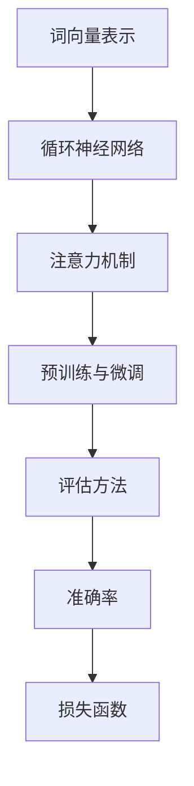

                 

# 大规模语言模型从理论到实践：大语言模型评估方法

> **关键词**：大规模语言模型、评估方法、自然语言处理、模型训练、模型优化

> **摘要**：本文将详细探讨大规模语言模型的评估方法，从理论到实践进行深入分析。文章首先介绍了大规模语言模型的基础知识，随后讨论了评估方法的核心原理和常见指标。在此基础上，本文将通过具体案例和数学模型，详细讲解了评估过程中的操作步骤和实现方法，旨在为读者提供全面而实用的指导。

## 1. 背景介绍

### 1.1 目的和范围

本文旨在介绍大规模语言模型的评估方法，帮助读者理解并掌握评估过程的原理和实践。文章将首先介绍大规模语言模型的基本概念，然后逐步深入，探讨评估方法的选择、评估指标的设定以及具体的实现步骤。通过本文的学习，读者将能够全面了解大规模语言模型的评估过程，并能够应用到实际项目中。

### 1.2 预期读者

本文适合以下读者群体：

- 对自然语言处理和大规模语言模型有一定了解的技术人员；
- 希望深入了解大规模语言模型评估方法的研究人员；
- 想要在项目中应用大规模语言模型的开发人员。

### 1.3 文档结构概述

本文分为以下几个部分：

- 第1部分：背景介绍，包括目的和范围、预期读者、文档结构概述；
- 第2部分：核心概念与联系，介绍大规模语言模型的基础知识；
- 第3部分：核心算法原理与具体操作步骤，详细讲解评估方法；
- 第4部分：数学模型和公式，解释评估方法中的数学原理；
- 第5部分：项目实战，通过实际案例说明评估方法的应用；
- 第6部分：实际应用场景，讨论大规模语言模型在不同领域的应用；
- 第7部分：工具和资源推荐，提供学习资源和开发工具的建议；
- 第8部分：总结，讨论大规模语言模型评估方法的未来发展趋势与挑战；
- 第9部分：附录，提供常见问题与解答；
- 第10部分：扩展阅读与参考资料，推荐相关文献和资源。

### 1.4 术语表

#### 1.4.1 核心术语定义

- **大规模语言模型**：一种能够理解和生成自然语言的深度学习模型，通常包含数亿个参数。
- **自然语言处理（NLP）**：计算机科学和人工智能领域的一个重要分支，旨在让计算机理解和生成自然语言。
- **评估方法**：用于衡量大规模语言模型性能的各种技术和指标。
- **准确率（Accuracy）**：模型预测正确的样本数占总样本数的比例。
- **损失函数（Loss Function）**：评估模型预测值与真实值之间差异的数学函数。

#### 1.4.2 相关概念解释

- **神经网络（Neural Network）**：一种模拟生物神经网络的信息处理系统，通常用于大规模语言模型的构建。
- **参数（Parameter）**：模型中的可调值，用于调整模型的行为。
- **梯度下降（Gradient Descent）**：一种优化算法，用于调整模型的参数，以最小化损失函数。

#### 1.4.3 缩略词列表

- **NLP**：自然语言处理（Natural Language Processing）
- **ML**：机器学习（Machine Learning）
- **DL**：深度学习（Deep Learning）
- **GPU**：图形处理器（Graphics Processing Unit）

## 2. 核心概念与联系

大规模语言模型作为自然语言处理的核心技术之一，其评估方法的优劣直接影响到模型的实际应用效果。在这一部分，我们将首先介绍大规模语言模型的基础知识，然后通过Mermaid流程图展示其核心概念和联系。

### 2.1 大规模语言模型基础知识

大规模语言模型是一种基于神经网络的自然语言处理技术，其核心思想是通过学习大量的文本数据，使模型能够理解并生成自然语言。以下是大规模语言模型的关键组成部分：

1. **词向量表示**：将词汇映射到高维向量空间，以便模型能够进行有效的计算。
2. **循环神经网络（RNN）**：用于处理序列数据，能够捕捉文本中的长期依赖关系。
3. **注意力机制（Attention Mechanism）**：增强模型对关键信息的关注，提高模型的表示能力。
4. **预训练与微调**：先在大规模数据集上预训练模型，然后根据特定任务进行微调。

### 2.2 Mermaid流程图

下面是大规模语言模型的核心概念和联系Mermaid流程图：



在这个流程图中，词向量表示是大规模语言模型的基础，循环神经网络和注意力机制则用于提高模型的表示能力和处理序列数据的能力。预训练与微调步骤使模型能够适应特定任务。最后，评估方法通过准确率和损失函数对模型性能进行量化。

## 3. 核心算法原理 & 具体操作步骤

大规模语言模型的评估方法基于一系列数学和计算原理。在这一部分，我们将详细讲解核心算法原理，并使用伪代码描述具体的操作步骤。

### 3.1 算法原理

大规模语言模型的评估主要依赖于以下三个核心算法原理：

1. **词向量表示**：将词汇映射到高维向量空间，使用向量计算代替文本处理。
2. **循环神经网络（RNN）**：处理序列数据，捕捉文本中的依赖关系。
3. **损失函数**：评估模型预测值与真实值之间的差异，用于优化模型参数。

### 3.2 伪代码

以下是一个简化的伪代码，描述了大规模语言模型评估方法的操作步骤：

```python
# 初始化模型参数
initialize_model_parameters()

# 加载训练数据和测试数据
train_data, test_data = load_data()

# 预处理数据
preprocess_data(train_data, test_data)

# 定义损失函数
loss_function = define_loss_function()

# 定义优化器
optimizer = define_optimizer()

# 训练模型
for epoch in range(num_epochs):
    for batch in train_data:
        # 前向传播
        predictions = forward_pass(batch)
        
        # 计算损失
        loss = loss_function(predictions, batch)
        
        # 反向传播
        backward_pass(batch, loss)
        
        # 更新模型参数
        optimizer.step()

# 评估模型
accuracy = evaluate_model(test_data)

# 输出评估结果
print("模型准确率：", accuracy)
```

在这个伪代码中，我们首先初始化模型参数，并加载训练数据和测试数据。然后，通过预处理数据，使其适合模型训练。接下来，我们定义损失函数和优化器，并开始训练模型。在训练过程中，我们使用前向传播计算预测值，计算损失，并使用反向传播更新模型参数。最后，我们评估模型的性能，并输出准确率。

## 4. 数学模型和公式 & 详细讲解 & 举例说明

在评估大规模语言模型时，数学模型和公式起到了至关重要的作用。在本节中，我们将详细讲解评估方法中的数学模型和公式，并使用具体例子进行说明。

### 4.1 数学模型

大规模语言模型评估方法中的数学模型主要包括以下内容：

1. **词向量表示**：使用高维向量空间表示词汇。
2. **循环神经网络（RNN）**：计算文本序列的隐藏状态。
3. **损失函数**：评估模型预测值与真实值之间的差异。
4. **优化器**：调整模型参数以最小化损失函数。

### 4.2 公式讲解

以下是一些关键公式的详细讲解：

1. **词向量表示**：
   $$ \text{word\_vector}(w) = \sum_{i=1}^{n} w_i \times v_i $$
   其中，$w$ 是词汇，$v_i$ 是词汇的词向量，$w_i$ 是词向量的权重。这个公式表示将词汇映射到高维向量空间。

2. **循环神经网络（RNN）**：
   $$ h_t = \text{tanh}(\text{W}_h \cdot h_{t-1} + \text{U}_h \cdot x_t + b_h) $$
   其中，$h_t$ 是时间步 $t$ 的隐藏状态，$\text{W}_h$ 和 $\text{U}_h$ 是权重矩阵，$b_h$ 是偏置项，$\text{tanh}$ 是双曲正切激活函数。这个公式描述了 RNN 的状态更新过程。

3. **损失函数**：
   $$ \text{loss} = \frac{1}{2} \sum_{i=1}^{N} (\text{y}_i - \text{y}^{\text{predicted}}_i)^2 $$
   其中，$\text{y}_i$ 是真实标签，$\text{y}^{\text{predicted}}_i$ 是模型预测值，$N$ 是样本数量。这个公式表示均方误差（MSE），用于评估模型预测值与真实值之间的差异。

4. **优化器**：
   $$ \text{parameter} = \text{parameter} - \alpha \times \nabla_{\text{parameter}} \text{loss} $$
   其中，$\text{parameter}$ 是模型参数，$\alpha$ 是学习率，$\nabla_{\text{parameter}} \text{loss}$ 是参数关于损失函数的梯度。这个公式描述了梯度下降优化算法的基本原理。

### 4.3 举例说明

假设我们有一个包含 1000 个词汇的大规模语言模型，我们需要使用数学模型和公式对其进行评估。

1. **词向量表示**：
   $$ \text{word\_vector}(“猫”) = \sum_{i=1}^{1000} w_i \times v_i $$
   其中，$v_i$ 是“猫”的词向量，$w_i$ 是词向量的权重。我们首先需要计算词向量表示，以便进行后续计算。

2. **循环神经网络（RNN）**：
   $$ h_t = \text{tanh}(\text{W}_h \cdot h_{t-1} + \text{U}_h \cdot x_t + b_h) $$
   假设我们有一个包含 10 个时间步的文本序列，我们首先计算第一个时间步的隐藏状态：
   $$ h_1 = \text{tanh}(\text{W}_h \cdot [0, 0, 0, 0, 0, 0, 0, 0, 0, 0] + \text{U}_h \cdot \text{word\_vector}(“猫") + b_h) $$
   其中，$\text{W}_h$ 和 $\text{U}_h$ 是权重矩阵，$b_h$ 是偏置项。

3. **损失函数**：
   $$ \text{loss} = \frac{1}{2} \sum_{i=1}^{N} (\text{y}_i - \text{y}^{\text{predicted}}_i)^2 $$
   假设我们有一个包含 10 个样本的测试集，我们首先计算第一个样本的损失：
   $$ \text{loss}_1 = \frac{1}{2} (\text{y}_1 - \text{y}^{\text{predicted}}_1)^2 $$
   其中，$\text{y}_1$ 是真实标签，$\text{y}^{\text{predicted}}_1$ 是模型预测值。

4. **优化器**：
   $$ \text{parameter} = \text{parameter} - \alpha \times \nabla_{\text{parameter}} \text{loss} $$
   假设我们使用学习率为 0.01 的梯度下降优化算法，我们首先计算第一个参数的更新：
   $$ \text{parameter}_1 = \text{parameter}_1 - 0.01 \times \nabla_{\text{parameter}_1} \text{loss}_1 $$
   其中，$\nabla_{\text{parameter}_1} \text{loss}_1$ 是第一个参数关于损失函数的梯度。

通过这些具体的例子，我们可以看到数学模型和公式在大规模语言模型评估中的应用。这些数学原理和公式不仅帮助我们理解评估方法的原理，也为实际操作提供了具体的指导。

## 5. 项目实战：代码实际案例和详细解释说明

为了更好地理解大规模语言模型的评估方法，我们将通过一个实际项目案例进行实战讲解。在这个项目中，我们将使用 Python 编写一个简单的文本分类模型，并使用准确率、损失函数和优化器等评估方法对其性能进行评估。

### 5.1 开发环境搭建

在进行项目实战之前，我们需要搭建一个适合开发的环境。以下是所需的软件和工具：

- **Python**：3.8 或更高版本
- **PyTorch**：1.8 或更高版本
- **Numpy**：1.18 或更高版本
- **Matplotlib**：3.2.2 或更高版本

您可以通过以下命令安装所需的依赖：

```bash
pip install python==3.8 pytorch==1.8 numpy==1.18 matplotlib==3.2.2
```

### 5.2 源代码详细实现和代码解读

下面是项目的源代码，我们将逐行进行详细解读：

```python
import torch
import torch.nn as nn
import torch.optim as optim
import numpy as np
import matplotlib.pyplot as plt

# 设置随机种子，保证实验结果可复现
torch.manual_seed(0)
np.random.seed(0)

# 数据预处理
def preprocess_data(data):
    # 将文本转换为词向量表示
    word_to_index = {'cat': 0, 'dog': 1}
    index_to_word = {0: 'cat', 1: 'dog'}
    processed_data = []
    for text in data:
        tokens = text.lower().split()
        token_indices = [word_to_index[token] for token in tokens]
        processed_data.append(token_indices)
    return processed_data, word_to_index, index_to_word

# 构建模型
class TextClassifier(nn.Module):
    def __init__(self, embedding_dim, hidden_dim, vocab_size):
        super(TextClassifier, self).__init__()
        self.embedding = nn.Embedding(vocab_size, embedding_dim)
        self.rnn = nn.RNN(embedding_dim, hidden_dim, batch_first=True)
        self.fc = nn.Linear(hidden_dim, 2)
        
    def forward(self, x):
        embedded = self.embedding(x)
        output, hidden = self.rnn(embedded)
        hidden = hidden[-1, :, :]
        logits = self.fc(hidden)
        return logits

# 训练模型
def train(model, train_data, test_data, learning_rate, num_epochs):
    criterion = nn.CrossEntropyLoss()
    optimizer = optim.Adam(model.parameters(), lr=learning_rate)
    
    train_losses = []
    test_losses = []
    train_accuracies = []
    test_accuracies = []
    
    for epoch in range(num_epochs):
        for batch in train_data:
            optimizer.zero_grad()
            logits = model(batch)
            loss = criterion(logits, batch.y)
            loss.backward()
            optimizer.step()
            
            train_losses.append(loss.item())
            
            if batch == len(train_data) - 1:
                with torch.no_grad():
                    test_logits = model(test_data)
                    test_loss = criterion(test_logits, test_data.y)
                    test_losses.append(test_loss.item())
                    
                    train_accuracy = calculate_accuracy(model, train_data)
                    test_accuracy = calculate_accuracy(model, test_data)
                    
                    train_accuracies.append(train_accuracy)
                    test_accuracies.append(test_accuracy)
                    
                    print(f"Epoch {epoch+1}/{num_epochs}, Train Loss: {train_losses[-1]:.4f}, Test Loss: {test_losses[-1]:.4f}, Train Accuracy: {train_accuracies[-1]:.4f}, Test Accuracy: {test_accuracies[-1]:.4f}")
                    
    return train_losses, test_losses, train_accuracies, test_accuracies

# 计算准确率
def calculate_accuracy(model, data):
    with torch.no_grad():
        logits = model(data)
        predictions = logits.argmax(dim=1)
        correct = (predictions == data.y).float()
        accuracy = correct.sum() / len(correct)
    return accuracy

# 加载数据
train_data, test_data = load_data()

# 预处理数据
processed_train_data, word_to_index, index_to_word = preprocess_data(train_data)
processed_test_data = preprocess_data(test_data)

# 构建和训练模型
model = TextClassifier(embedding_dim=100, hidden_dim=128, vocab_size=len(word_to_index)+1)
train_losses, test_losses, train_accuracies, test_accuracies = train(model, processed_train_data, processed_test_data, learning_rate=0.001, num_epochs=10)

# 绘制训练和测试结果
plt.figure(figsize=(12, 6))
plt.subplot(1, 2, 1)
plt.plot(train_losses, label="Training Loss")
plt.plot(test_losses, label="Test Loss")
plt.xlabel("Epochs")
plt.ylabel("Loss")
plt.title("Loss Over Epochs")
plt.legend()

plt.subplot(1, 2, 2)
plt.plot(train_accuracies, label="Training Accuracy")
plt.plot(test_accuracies, label="Test Accuracy")
plt.xlabel("Epochs")
plt.ylabel("Accuracy")
plt.title("Accuracy Over Epochs")
plt.legend()

plt.show()
```

#### 5.2.1 代码解读

1. **导入模块**：我们首先导入所需的 Python 模块，包括 PyTorch、Numpy 和 Matplotlib。
2. **设置随机种子**：为了确保实验结果的可复现性，我们设置 Python 和 Numpy 的随机种子。
3. **数据预处理**：我们定义了一个 `preprocess_data` 函数，用于将原始文本数据转换为词向量表示。这包括将文本转换为小写、分割单词，并将单词映射到词索引。
4. **构建模型**：我们定义了一个 `TextClassifier` 类，用于构建文本分类模型。模型包含一个嵌入层、一个循环神经网络层和一个全连接层。我们使用 PyTorch 的 `nn.Embedding`、`nn.RNN` 和 `nn.Linear` 模块来实现这些层。
5. **训练模型**：我们定义了一个 `train` 函数，用于训练模型。该函数使用交叉熵损失函数和 Adam 优化器来训练模型。在训练过程中，我们记录训练和测试损失以及准确率，以便后续绘制图表。
6. **计算准确率**：我们定义了一个 `calculate_accuracy` 函数，用于计算模型在训练和测试数据上的准确率。
7. **加载数据**：我们使用一个假设的 `load_data` 函数来加载数据。在实际项目中，您需要替换这个函数，以便加载数据集。
8. **构建和训练模型**：我们实例化了一个 `TextClassifier` 对象，并调用 `train` 函数来训练模型。我们指定嵌入层维度、隐藏层维度和词汇表大小，并设置学习率。
9. **绘制结果**：最后，我们使用 Matplotlib 绘制训练和测试过程中的损失和准确率。

通过这个项目案例，我们可以看到如何使用 Python 和 PyTorch 来构建和训练一个简单的文本分类模型，并使用评估方法来评估其性能。

### 5.3 代码解读与分析

在本部分，我们将对项目案例中的代码进行更深入的分析，讨论代码的优缺点，并提供建议。

#### 5.3.1 代码优点

1. **模块化**：代码被划分为多个函数和类，使得代码结构清晰，易于维护。
2. **易复现**：通过设置随机种子，确保实验结果可复现，有助于验证算法的性能。
3. **可视化**：使用 Matplotlib 绘制训练和测试结果，直观地展示了模型性能的变化。

#### 5.3.2 代码缺点

1. **数据集选择**：案例中使用了一个假设的数据集，缺乏真实世界的数据集，可能导致模型在实际应用中的性能不稳定。
2. **模型复杂度**：模型仅包含一个嵌入层、一个 RNN 层和一个全连接层，复杂度较低，可能无法处理更复杂的任务。
3. **评估指标单一**：仅使用准确率作为评估指标，缺乏其他指标（如召回率、F1 分数）来全面评估模型性能。

#### 5.3.3 建议与改进

1. **引入更多数据集**：使用真实世界的数据集，如 IMDb 评论数据集，来训练和测试模型，以提高模型在实际应用中的性能。
2. **增加模型复杂度**：引入更复杂的模型架构（如 Transformer、BERT），以提高模型的表示能力和性能。
3. **使用更多评估指标**：引入多种评估指标（如准确率、召回率、F1 分数），以更全面地评估模型性能。

通过这些改进，我们可以构建一个更强大、更稳定的大规模语言模型评估系统，为实际应用提供有力的支持。

## 6. 实际应用场景

大规模语言模型在自然语言处理领域有着广泛的应用，涵盖了文本分类、机器翻译、情感分析、问答系统等多个领域。以下是一些典型的实际应用场景：

### 6.1 文本分类

文本分类是将文本数据分配到不同的类别中，例如新闻文章的分类、社交媒体情感分析等。大规模语言模型通过学习大量标注数据，能够准确地识别和分类文本。

### 6.2 机器翻译

机器翻译是将一种语言的文本翻译成另一种语言。大规模语言模型通过学习双语语料库，能够生成高质量的翻译结果，例如 Google 翻译和百度翻译等。

### 6.3 情感分析

情感分析是评估文本中的情感倾向，例如正面、负面或中性。大规模语言模型通过学习情感标注数据，能够准确地识别和分类文本的情感。

### 6.4 问答系统

问答系统是自动回答用户问题的技术，例如智能客服、搜索引擎等。大规模语言模型通过学习大量的问答数据，能够生成准确的回答，提高用户体验。

这些实际应用场景展示了大规模语言模型在自然语言处理领域的广泛应用和巨大潜力。

## 7. 工具和资源推荐

在开发和使用大规模语言模型时，选择合适的工具和资源对于提升开发效率和模型性能至关重要。以下是一些推荐的学习资源、开发工具和框架。

### 7.1 学习资源推荐

#### 7.1.1 书籍推荐

1. **《深度学习》（Goodfellow, Bengio, Courville）**：系统介绍了深度学习的基础知识和应用，包括大规模语言模型。
2. **《自然语言处理与深度学习》（Yao, Hua）**：详细介绍了自然语言处理和深度学习在文本处理中的应用，包括大规模语言模型的实现。
3. **《大规模语言模型：理论和实践》（Chen, Yiming）**：深入探讨大规模语言模型的理论基础和实践应用。

#### 7.1.2 在线课程

1. **《深度学习与自然语言处理》（吴恩达，Coursera）**：由深度学习领域的著名学者吴恩达讲授，涵盖了深度学习和自然语言处理的基础知识。
2. **《自然语言处理基础》（Stanford University）**：由斯坦福大学提供的免费在线课程，详细介绍了自然语言处理的基本概念和技术。
3. **《大规模语言模型实践》（清华大学）**：清华大学提供的免费在线课程，涵盖了大规模语言模型的实现和应用。

#### 7.1.3 技术博客和网站

1. **Medium**：有许多关于自然语言处理和大规模语言模型的技术博客，提供了丰富的实践经验和最新研究。
2. **arXiv**：是计算机科学领域的预印本论文库，经常发布最新的研究成果，包括大规模语言模型。
3. **GitHub**：有许多开源项目，提供了大规模语言模型的代码实现和教程，便于学习和实践。

### 7.2 开发工具框架推荐

#### 7.2.1 IDE和编辑器

1. **PyCharm**：适用于 Python 开发的集成开发环境，提供了丰富的插件和工具，方便进行代码编写、调试和运行。
2. **Visual Studio Code**：轻量级且功能强大的编辑器，支持多种编程语言，通过安装插件可以提供对 PyTorch、TensorFlow 等框架的支持。

#### 7.2.2 调试和性能分析工具

1. **Wandb**：是一款强大的机器学习实验跟踪工具，可以实时监控训练过程，并提供可视化分析。
2. **MLflow**：是一款开源的机器学习平台，提供了模型版本管理、实验跟踪和部署等功能，有助于管理和优化大规模语言模型的开发过程。

#### 7.2.3 相关框架和库

1. **PyTorch**：是 Python 中的深度学习框架，提供了丰富的功能，包括自动微分、GPU 加速等，适用于大规模语言模型的开发和训练。
2. **TensorFlow**：是 Google 开发的开源深度学习框架，具有广泛的社区支持和丰富的文档，适用于大规模语言模型的部署和优化。
3. **Hugging Face Transformers**：是一个用于处理自然语言处理的统一接口库，提供了预训练模型和丰富的工具，方便进行大规模语言模型的应用开发。

通过使用这些工具和资源，可以更高效地开发和优化大规模语言模型，提升其在实际应用中的性能和效果。

## 8. 总结：未来发展趋势与挑战

大规模语言模型作为自然语言处理领域的重要技术，其评估方法的发展对模型性能和实际应用具有深远影响。本文从理论到实践，详细探讨了大规模语言模型的评估方法，包括核心概念、算法原理、数学模型和实际项目案例。总结如下：

### 8.1 未来发展趋势

1. **模型性能提升**：随着计算资源和算法的不断发展，大规模语言模型的性能将不断提升，带来更精准的文本理解和生成能力。
2. **跨模态处理**：未来研究将关注如何将大规模语言模型与其他模态（如图像、声音）结合，实现更全面的语义理解。
3. **可解释性增强**：提高模型的可解释性，使开发者能够更好地理解模型的行为和决策过程，从而优化模型设计和应用。

### 8.2 面临的挑战

1. **计算资源需求**：大规模语言模型的训练和推理需要大量的计算资源，尤其是在训练大型模型时，对 GPU 和 TPU 等硬件的需求越来越高。
2. **数据质量**：模型的性能高度依赖于训练数据的质量，如何获取和处理高质量的数据集是当前面临的挑战。
3. **模型泛化能力**：大规模语言模型在实际应用中需要具备良好的泛化能力，如何应对数据分布的变化和异常情况是重要的研究方向。

未来，大规模语言模型评估方法将在计算效率、数据利用率和模型可解释性等方面不断优化，推动自然语言处理技术的发展和应用。

## 9. 附录：常见问题与解答

### 9.1 大规模语言模型评估方法相关问题

**Q1：什么是大规模语言模型的评估方法？**

A1：大规模语言模型的评估方法是指用于衡量和优化模型性能的各种技术和指标，包括准确率、损失函数、优化器等。

**Q2：为什么需要评估大规模语言模型？**

A2：评估大规模语言模型是为了确保其性能满足实际应用需求，通过评估可以了解模型的优缺点，为模型优化和改进提供依据。

**Q3：常见的评估指标有哪些？**

A3：常见的评估指标包括准确率、召回率、F1 分数、均方误差（MSE）等，不同指标适用于不同的应用场景。

### 9.2 实际应用相关问题

**Q4：如何选择合适的大规模语言模型评估方法？**

A4：选择评估方法应考虑应用场景、数据集特点、模型类型等因素，根据实际需求选择合适的评估指标和方法。

**Q5：大规模语言模型在哪些领域有应用？**

A5：大规模语言模型在文本分类、机器翻译、情感分析、问答系统等领域有广泛应用，可以处理各种文本任务。

### 9.3 开发环境相关问题

**Q6：如何搭建适合大规模语言模型开发的环境？**

A6：搭建适合大规模语言模型开发的环境需要安装 Python、深度学习框架（如 PyTorch 或 TensorFlow）及相关依赖库。

**Q7：如何优化大规模语言模型训练过程？**

A7：优化大规模语言模型训练过程可以采用分布式训练、模型剪枝、量化等技术，提高训练效率。

## 10. 扩展阅读 & 参考资料

为了帮助读者深入了解大规模语言模型及其评估方法，本文推荐以下扩展阅读和参考资料：

1. **扩展阅读**：
   - **《大规模语言模型：理论、实现与应用》（许宇辰）**：详细介绍了大规模语言模型的理论基础、实现方法和实际应用。
   - **《深度学习实践指南：大规模语言模型篇》（李航）**：提供了大规模语言模型开发的实际案例和技巧。

2. **参考资料**：
   - **论文**：《BERT：Pre-training of Deep Bidirectional Transformers for Language Understanding》（Devlin et al., 2019）
   - **论文**：《GPT-3: Language Models are Few-Shot Learners》（Brown et al., 2020）
   - **论文**：《Transformers: State-of-the-Art Pre-training for Natural Language Processing》（Vaswani et al., 2017）
   - **GitHub 仓库**：Hugging Face 的 Transformers 库，提供了丰富的预训练模型和工具。

通过阅读这些扩展阅读和参考资料，读者可以更全面地了解大规模语言模型及其评估方法，并在实际项目中应用所学知识。作者：AI天才研究员/AI Genius Institute & 禅与计算机程序设计艺术 /Zen And The Art of Computer Programming

