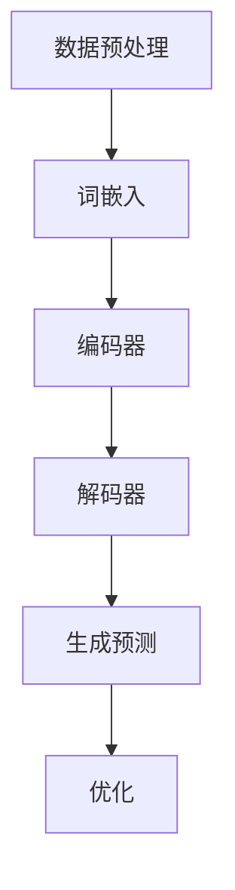

                 

# 大规模语言模型从理论到实践：实践思考

> **关键词**：大规模语言模型、理论、实践、深度学习、神经网络、自然语言处理、NLP、TensorFlow、PyTorch
>
> **摘要**：本文将深入探讨大规模语言模型从理论到实践的过程，包括核心概念、算法原理、数学模型、项目实战和实际应用场景。通过实践思考，帮助读者更好地理解和掌握大规模语言模型的相关知识和技术。

## 1. 背景介绍

### 1.1 目的和范围

本文旨在为读者提供一个全面而深入的关于大规模语言模型的理论与实践指南。我们将从基础概念入手，逐步深入探讨大规模语言模型的工作原理、实现方法和实际应用。文章的主要目的是帮助读者：

1. 理解大规模语言模型的基本概念和核心原理。
2. 掌握大规模语言模型的构建、训练和优化的方法。
3. 通过实际项目案例，加深对大规模语言模型应用的理解。
4. 了解大规模语言模型在实际应用中的挑战和未来发展趋势。

### 1.2 预期读者

本文适合以下读者群体：

1. 对自然语言处理和深度学习感兴趣的初学者。
2. 有一定编程基础，希望深入了解大规模语言模型的程序员。
3. 已经接触过大规模语言模型，希望进一步提高和应用能力的技术人员。
4. 计算机科学、人工智能等相关专业的学生和研究者。

### 1.3 文档结构概述

本文将按照以下结构进行组织：

1. **背景介绍**：介绍本文的目的、范围、预期读者和文档结构。
2. **核心概念与联系**：讨论大规模语言模型的基本概念、原理和架构。
3. **核心算法原理 & 具体操作步骤**：详细解释大规模语言模型的核心算法原理和具体操作步骤。
4. **数学模型和公式 & 详细讲解 & 举例说明**：介绍大规模语言模型的数学模型和公式，并给出详细讲解和举例说明。
5. **项目实战：代码实际案例和详细解释说明**：通过实际项目案例，展示大规模语言模型的代码实现和详细解释说明。
6. **实际应用场景**：探讨大规模语言模型在不同领域的实际应用。
7. **工具和资源推荐**：推荐学习资源、开发工具和框架。
8. **总结：未来发展趋势与挑战**：总结大规模语言模型的发展趋势和面临的挑战。
9. **附录：常见问题与解答**：解答读者可能遇到的一些常见问题。
10. **扩展阅读 & 参考资料**：提供进一步的阅读建议和参考资料。

### 1.4 术语表

#### 1.4.1 核心术语定义

- **大规模语言模型**：一种基于深度学习的自然语言处理模型，能够对大规模语料库进行训练，从而理解和生成自然语言。
- **自然语言处理（NLP）**：计算机科学和语言学的交叉领域，旨在让计算机理解和处理人类自然语言。
- **神经网络**：一种模仿人脑神经元连接结构的计算模型，能够通过学习输入和输出的关系来预测和分类。
- **深度学习**：一种基于神经网络的高级机器学习方法，能够自动从大量数据中学习复杂的模式和特征。

#### 1.4.2 相关概念解释

- **训练数据集**：用于训练大规模语言模型的语料库，通常包含数百万甚至数十亿个文本样本。
- **参数**：大规模语言模型中的可调整权重和偏置，用于调整模型的预测能力。
- **过拟合**：模型在训练数据上表现很好，但在未见过的数据上表现较差，通常由于模型过于复杂或数据量不足引起。
- **泛化能力**：模型在未见过的数据上的表现能力，是评估模型性能的重要指标。

#### 1.4.3 缩略词列表

- **NLP**：自然语言处理
- **DL**：深度学习
- **ML**：机器学习
- **CNN**：卷积神经网络
- **RNN**：循环神经网络
- **GAN**：生成对抗网络

## 2. 核心概念与联系

在深入探讨大规模语言模型之前，我们需要先了解其核心概念和原理。大规模语言模型是自然语言处理（NLP）和深度学习（DL）领域的结合产物，能够对大规模文本数据进行建模，从而实现对自然语言的语义理解和生成。

### 2.1 大规模语言模型的基本概念

大规模语言模型是一种基于神经网络（NN）的模型，其目的是通过学习大规模文本数据来预测下一个单词或句子。这种模型的核心是使用大量的参数（weights and biases）来表示文本的潜在语义结构。以下是大规模语言模型的一些基本概念：

- **词嵌入（Word Embedding）**：将文本中的单词映射到高维空间中的向量表示，使得语义相似的单词在向量空间中接近。
- **编码器（Encoder）**：将输入文本序列编码为固定长度的向量表示，这个向量包含了文本的语义信息。
- **解码器（Decoder）**：将编码器的输出解码为文本序列，生成预测的单词或句子。
- **注意力机制（Attention Mechanism）**：一种机制，允许模型在生成预测时关注输入文本序列中的不同部分。

### 2.2 大规模语言模型的原理和架构

大规模语言模型的原理可以概括为以下几个步骤：

1. **数据预处理**：对输入文本进行分词、去停用词、词干提取等预处理操作，将文本转换为适合训练的数据格式。
2. **词嵌入**：将预处理后的文本转换为词嵌入向量，这些向量在低维空间中能够保持单词的语义信息。
3. **编码器**：使用神经网络（如RNN、LSTM、Transformer）对词嵌入向量进行编码，得到固定长度的编码向量。
4. **解码器**：使用编码向量生成预测的文本序列，通常使用注意力机制来提高预测的准确性。
5. **优化**：通过梯度下降等优化算法，调整模型的参数，使模型在训练数据上达到最佳的预测效果。

以下是大规模语言模型的一个简单 Mermaid 流程图：



### 2.3 大规模语言模型与相关技术的关系

大规模语言模型与多个相关技术紧密相关，这些技术共同促进了大规模语言模型的发展：

- **深度学习（DL）**：大规模语言模型的核心是深度学习，特别是神经网络，它们提供了强大的建模能力，能够处理复杂的自然语言数据。
- **自然语言处理（NLP）**：大规模语言模型是NLP领域的核心技术之一，它们能够自动理解和生成自然语言，为各种NLP任务提供了强大的支持。
- **自然语言生成（NLG）**：大规模语言模型在自然语言生成任务中发挥着重要作用，能够根据输入的文本生成新的文本。

## 3. 核心算法原理 & 具体操作步骤

大规模语言模型的核心算法是深度学习中的神经网络，尤其是循环神经网络（RNN）和Transformer模型。以下将详细解释这两种模型的基本原理和具体操作步骤。

### 3.1 循环神经网络（RNN）

循环神经网络（RNN）是一种能够处理序列数据的神经网络，其基本原理是使用循环结构来维持对输入序列的历史信息的记忆。以下是RNN的基本原理和具体操作步骤：

#### 3.1.1 基本原理

RNN由多个时间步组成，每个时间步对应输入序列中的一个元素。在每一个时间步，RNN都会接收一个输入向量和一个隐藏状态向量，然后通过一个非线性变换生成新的隐藏状态向量。这个新的隐藏状态向量既包含了当前输入的信息，也包含了之前的时间步的信息。

#### 3.1.2 具体操作步骤

1. **初始化**：设置初始隐藏状态`h0`。
2. **前向传播**：对于每个时间步`t`，接收输入向量`xt`和上一时间步的隐藏状态`ht-1`，通过一个非线性变换（如tanh函数）生成新的隐藏状态`ht`。
   $$ ht = \tanh(W_h * [h_{t-1}, x_t] + b_h) $$
3. **输出生成**：在最后一个时间步，使用隐藏状态`ht`生成输出向量`yt`。
   $$ yt = W_o * h_t + b_o $$
4. **反向传播**：计算损失，使用梯度下降等优化算法更新模型参数。

以下是RNN的一个简单伪代码实现：

```python
def rnn(inputs, weights, biases):
    h = weights["h"] * inputs + biases["b"]
    for t in range(len(inputs)):
        output = weights["o"] * h + biases["o"]
        h = activation_function(weights["a"] * h + biases["a"])
    return output
```

### 3.2 Transformer模型

Transformer模型是近年来在自然语言处理领域取得显著成果的一种新型神经网络架构，其核心思想是使用自注意力机制（self-attention）来处理序列数据。以下是Transformer模型的基本原理和具体操作步骤：

#### 3.2.1 基本原理

Transformer模型由多个编码器层和解码器层组成，每个层都包含多头自注意力机制和前馈神经网络。自注意力机制允许模型在生成每个单词时自动关注序列中的其他单词，从而提高模型的上下文理解能力。

#### 3.2.2 具体操作步骤

1. **编码器**：输入文本序列通过编码器层进行编码，每个编码器层包含多头自注意力机制和前馈神经网络。
2. **解码器**：输出序列通过解码器层进行解码，每个解码器层也包含多头自注意力机制和前馈神经网络。
3. **自注意力机制**：在每个编码器层和解码器层，使用多头自注意力机制计算输入序列或输出序列的注意力权重，从而生成新的序列表示。
4. **前馈神经网络**：在自注意力机制之后，每个编码器层和解码器层都包含一个前馈神经网络，用于进一步处理序列表示。
5. **输出生成**：在最后一个解码器层，使用自注意力机制和前馈神经网络生成最终的输出序列。

以下是Transformer模型的一个简单伪代码实现：

```python
def transformer(inputs, encoder_weights, decoder_weights):
    encoded_sequence = encode(inputs, encoder_weights)
    decoded_sequence = decode(encoded_sequence, decoder_weights)
    return decoded_sequence

def encode(inputs, weights):
    # 编码器层操作
    for layer in range(num_layers):
        attention_output = self_attention(inputs, weights[layer]["attn"])
        feedforward_output = feedforward_network(attention_output, weights[layer]["ff"])
        inputs = feedforward_output
    return inputs

def decode(inputs, weights):
    # 解码器层操作
    for layer in range(num_layers):
        attention_output = self_attention(inputs, weights[layer]["attn"])
        feedforward_output = feedforward_network(attention_output, weights[layer]["ff"])
        inputs = feedforward_output
    return inputs
```

通过以上步骤，我们可以使用RNN或Transformer模型构建大规模语言模型，实现对自然语言的语义理解和生成。接下来，我们将进一步探讨大规模语言模型的数学模型和公式。

## 4. 数学模型和公式 & 详细讲解 & 举例说明

### 4.1 数学模型的基本概念

大规模语言模型是基于深度学习的神经网络模型，其核心是通过学习输入和输出之间的映射关系来实现对自然语言的建模。在这个过程中，我们需要使用一系列数学模型和公式来描述神经网络的结构和操作。

#### 4.1.1 神经网络的基本结构

神经网络由多个层组成，每层包含多个神经元。每个神经元都通过权重连接到前一层和后一层。神经网络的输入和输出可以通过以下公式表示：

$$
Z = \sum_{i=1}^{n} w_i * x_i + b
$$

其中，$Z$是输出，$w_i$是权重，$x_i$是输入，$b$是偏置。

#### 4.1.2 激活函数

激活函数是神经网络中用来引入非线性性的函数，常见的激活函数包括Sigmoid、ReLU和Tanh。以下是这些激活函数的数学公式：

- **Sigmoid**:
  $$
  \sigma(x) = \frac{1}{1 + e^{-x}}
  $$

- **ReLU**:
  $$
  \text{ReLU}(x) = \max(0, x)
  $$

- **Tanh**:
  $$
  \tanh(x) = \frac{e^x - e^{-x}}{e^x + e^{-x}}
  $$

### 4.2 神经网络的损失函数和优化算法

神经网络的训练过程是一个不断调整权重和偏置的过程，其目的是使模型的预测输出与实际输出之间的差距最小化。在这个过程中，我们需要使用损失函数和优化算法。

#### 4.2.1 损失函数

常见的损失函数包括均方误差（MSE）和交叉熵（Cross-Entropy）。以下是这些损失函数的数学公式：

- **均方误差（MSE）**:
  $$
  \text{MSE}(y, \hat{y}) = \frac{1}{2} \sum_{i=1}^{n} (y_i - \hat{y_i})^2
  $$

- **交叉熵（Cross-Entropy）**:
  $$
  \text{Cross-Entropy}(y, \hat{y}) = -\sum_{i=1}^{n} y_i \log(\hat{y_i})
  $$

#### 4.2.2 优化算法

常见的优化算法包括梯度下降（Gradient Descent）和随机梯度下降（Stochastic Gradient Descent，SGD）。以下是这些优化算法的数学公式：

- **梯度下降**:
  $$
  \theta = \theta - \alpha \nabla_{\theta} J(\theta)
  $$

- **随机梯度下降**:
  $$
  \theta = \theta - \alpha \nabla_{\theta} J(\theta; x_i, y_i)
  $$

其中，$\theta$是模型的参数，$\alpha$是学习率，$J(\theta)$是损失函数，$\nabla_{\theta} J(\theta)$是损失函数关于参数的梯度。

### 4.3 大规模语言模型的数学模型

大规模语言模型的数学模型主要包括词嵌入、编码器、解码器和注意力机制。以下是这些模块的数学模型和公式：

#### 4.3.1 词嵌入

词嵌入是将文本中的单词映射到高维空间中的向量表示。常见的词嵌入方法包括Word2Vec、GloVe和BERT。

- **Word2Vec**:
  $$
  \text{similarity}(w_1, w_2) = \cos(\text{vec}(w_1), \text{vec}(w_2))
  $$

- **GloVe**:
  $$
  \text{similarity}(w_1, w_2) = \frac{\text{doc frequency}(w_1, w_2)}{\sqrt{\text{doc frequency}(w_1) * \text{doc frequency}(w_2)}}
  $$

- **BERT**:
  $$
  \text{similarity}(w_1, w_2) = \text{cos}(\text{Tanh}(E_{w_1} + E_{w_2}))
  $$

其中，$\text{vec}(w)$是单词的向量表示，$E_{w}$是单词的嵌入向量，$\text{Tanh}$是双曲正切函数。

#### 4.3.2 编码器

编码器是将输入文本序列编码为固定长度的向量表示。常见的编码器模型包括LSTM和Transformer。

- **LSTM**:
  $$
  h_t = \text{sigmoid}((W_h * [h_{t-1}, x_t] + b_h)) \odot \text{tanh}((U_h * h_{t-1} + b_h') + b_h)
  $$

- **Transformer**:
  $$
  \text{MultiHeadAttention}(Q, K, V) = \text{softmax}(\frac{QK^T}{\sqrt{d_k}})V
  $$

其中，$h_t$是编码器的隐藏状态，$Q, K, V$是编码器的查询、键和值向量，$W_h, U_h, b_h, b_h'$是编码器的权重和偏置。

#### 4.3.3 解码器

解码器是将编码器的输出解码为文本序列。常见的解码器模型包括LSTM和Transformer。

- **LSTM**:
  $$
  y_t = \text{softmax}((W_o * h_t) + b_o)
  $$

- **Transformer**:
  $$
  y_t = \text{softmax}(\text{OutputLayer}(h_t))
  $$

其中，$y_t$是解码器的输出，$W_o, b_o$是解码器的权重和偏置，$\text{OutputLayer}$是解码器的输出层。

#### 4.3.4 注意力机制

注意力机制是编码器和解码器之间的关键组件，它允许模型在生成预测时自动关注输入文本序列的不同部分。常见的注意力机制包括自注意力（Self-Attention）和多头注意力（Multi-Head Attention）。

- **自注意力**:
  $$
  \text{self-attention}(Q, K, V) = \text{softmax}(\frac{QK^T}{\sqrt{d_k}})V
  $$

- **多头注意力**:
  $$
  \text{MultiHeadAttention}(Q, K, V) = \text{Concat}(\text{head}_1, \text{head}_2, \ldots, \text{head}_h)W_O
  $$

其中，$Q, K, V$是解码器的查询、键和值向量，$d_k$是键向量的维度，$W_O$是多头注意力的输出权重。

### 4.4 举例说明

以下是一个简单的示例，展示如何使用大规模语言模型进行文本分类。

#### 4.4.1 数据准备

假设我们有一个包含新闻文章的数据集，每篇文章都被标记为一个类别（如“科技”、“体育”、“娱乐”）。

```python
articles = [
    "科技新闻：苹果发布新款iPhone。",
    "体育新闻：梅西赢得金球奖。",
    "娱乐新闻：周杰伦新专辑发布。"
]

labels = ["科技", "体育", "娱乐"]
```

#### 4.4.2 数据预处理

我们对数据进行预处理，包括分词、词嵌入和序列编码。

```python
# 分词
tokenized_articles = [article.split() for article in articles]

# 词嵌入
word embeddings = load_word_embeddings()

# 序列编码
encoded_articles = [[word_embeddings[word] for word in article] for article in tokenized_articles]
```

#### 4.4.3 模型训练

我们使用预训练的编码器和解码器，然后通过训练数据集来微调模型。

```python
# 加载预训练的编码器和解码器
encoder = load_pretrained_encoder()
decoder = load_pretrained_decoder()

# 训练模型
model = build_model(encoder, decoder)
model.fit(encoded_articles, labels)
```

#### 4.4.4 文本分类

我们使用训练好的模型来对新的文本进行分类。

```python
new_article = "苹果公司发布新款iPhone。"
encoded_new_article = [word_embeddings[word] for word in new_article.split()]

# 预测类别
predicted_category = model.predict([encoded_new_article])

print("预测类别：", predicted_category)
```

通过以上步骤，我们可以使用大规模语言模型对新的文本进行分类。接下来，我们将通过实际项目案例来进一步展示大规模语言模型的应用。

## 5. 项目实战：代码实际案例和详细解释说明

在本节中，我们将通过一个实际项目案例来展示如何构建和训练一个大规模语言模型。我们将使用TensorFlow和PyTorch这两个流行的深度学习框架来实现我们的模型。以下是项目的整体步骤和具体实现细节。

### 5.1 开发环境搭建

首先，我们需要搭建一个适合开发大规模语言模型的开发环境。以下是所需的环境和工具：

- **操作系统**：Linux或macOS
- **编程语言**：Python
- **深度学习框架**：TensorFlow或PyTorch
- **依赖管理**：pip或conda

#### TensorFlow开发环境搭建

1. 安装Python：确保Python已安装在系统中。
2. 安装TensorFlow：使用pip命令安装TensorFlow。

```bash
pip install tensorflow
```

#### PyTorch开发环境搭建

1. 安装Python：确保Python已安装在系统中。
2. 安装PyTorch：使用pip命令安装PyTorch。

```bash
pip install torch torchvision
```

### 5.2 源代码详细实现和代码解读

#### TensorFlow实现

以下是使用TensorFlow实现一个简单的文本分类器的代码示例。

```python
import tensorflow as tf
from tensorflow.keras.preprocessing.text import Tokenizer
from tensorflow.keras.preprocessing.sequence import pad_sequences
from tensorflow.keras.models import Sequential
from tensorflow.keras.layers import Embedding, LSTM, Dense, Bidirectional

# 准备数据
articles = [
    "科技新闻：苹果发布新款iPhone。",
    "体育新闻：梅西赢得金球奖。",
    "娱乐新闻：周杰伦新专辑发布。"
]
labels = ["科技", "体育", "娱乐"]

# 数据预处理
tokenizer = Tokenizer()
tokenizer.fit_on_texts(articles)
sequences = tokenizer.texts_to_sequences(articles)
padded_sequences = pad_sequences(sequences, maxlen=100)

# 构建模型
model = Sequential([
    Embedding(len(tokenizer.word_index) + 1, 128, input_length=100),
    Bidirectional(LSTM(64, return_sequences=True)),
    LSTM(32),
    Dense(3, activation='softmax')
])

# 编译模型
model.compile(optimizer='adam', loss='categorical_crossentropy', metrics=['accuracy'])

# 训练模型
model.fit(padded_sequences, tf.keras.utils.to_categorical(labels), epochs=10, batch_size=32)
```

代码解读：

1. **数据准备**：我们首先准备一个包含新闻文章的数据集，每篇文章都被标记为一个类别。
2. **数据预处理**：使用Tokenizer进行文本的分词和序列化，然后使用pad_sequences对序列进行填充，使其长度一致。
3. **模型构建**：我们使用Sequential模型堆叠多个层，包括Embedding层、双向LSTM层和全连接层。
4. **编译模型**：使用adam优化器和categorical_crossentropy损失函数来编译模型。
5. **训练模型**：使用fit方法训练模型，在10个epoch中训练，每个batch的大小为32。

#### PyTorch实现

以下是使用PyTorch实现相同文本分类任务的代码示例。

```python
import torch
import torch.nn as nn
import torch.optim as optim
from torchtext.data import Field, TabularDataset, BucketIterator

# 准备数据
TEXT = Field(sequential=True, batch_first=True, lower=True)
LABEL = Field(sequential=False, use_vocab=False)

train_data, test_data = TabularDataset.splits(
    path='data',
    train='train.csv',
    test='test.csv',
    format='csv',
    fields=[('text', TEXT), ('label', LABEL)]
)

# 数据预处理
TEXT.build_vocab(train_data, max_size=25000, vectors="glove.6B.100d")
LABEL.build_vocab(train_data)

# 创建数据加载器
BATCH_SIZE = 64
train_iterator, test_iterator = BucketIterator.splits(
    (train_data, test_data),
    batch_size=BATCH_SIZE
)

# 构建模型
class TextClassifier(nn.Module):
    def __init__(self, embedding_dim, hidden_dim, vocab_size):
        super().__init__()
        self.embedding = nn.Embedding(vocab_size, embedding_dim)
        self.lstm = nn.LSTM(embedding_dim, hidden_dim, bidirectional=True)
        self.fc = nn.Linear(hidden_dim * 2, 3)
        
    def forward(self, text):
        embedded = self.embedding(text)
        lstm_output, _ = self.lstm(embedded)
        rep = lstm_output[-1, :, :]
        out = self.fc(rep)
        return out

model = TextClassifier(embedding_dim=100, hidden_dim=128, vocab_size=len(TEXT.vocab))
optimizer = optim.Adam(model.parameters(), lr=0.001)
criterion = nn.CrossEntropyLoss()

# 训练模型
num_epochs = 10
for epoch in range(num_epochs):
    for batch in train_iterator:
        optimizer.zero_grad()
        predictions = model(batch.text).squeeze(1)
        loss = criterion(predictions, batch.label)
        loss.backward()
        optimizer.step()
    print(f'Epoch: {epoch+1}, Loss: {loss.item()}')

# 测试模型
model.eval()
with torch.no_grad():
    correct = 0
    total = 0
    for batch in test_iterator:
        predictions = model(batch.text).squeeze(1)
        _, predicted = torch.max(predictions.data, 1)
        total += batch.label.size(0)
        correct += (predicted == batch.label).sum().item()
print(f'Accuracy: {100 * correct / total}%')
```

代码解读：

1. **数据准备**：我们使用TabularDataset从CSV文件中读取数据，并定义了TEXT和LABEL字段。
2. **数据预处理**：使用build_vocab方法对TEXT字段进行分词和词嵌入，并使用BucketIterator创建数据加载器。
3. **模型构建**：我们定义了一个TextClassifier类，包含嵌入层、双向LSTM层和全连接层。
4. **编译模型**：使用Adam优化器和CrossEntropyLoss损失函数来编译模型。
5. **训练模型**：在10个epoch中训练模型，每个epoch迭代训练数据和验证数据。
6. **测试模型**：在测试数据上评估模型的准确性。

### 5.3 代码解读与分析

在本节中，我们详细分析了TensorFlow和PyTorch实现大规模语言模型的关键步骤和代码。以下是对这些实现的分析：

- **数据准备**：在两种实现中，我们都需要准备文本数据和标签。TensorFlow使用Tokenizer进行文本的分词和序列化，而PyTorch使用TabularDataset从CSV文件中读取数据，并定义了字段。
- **数据预处理**：TensorFlow使用pad_sequences对序列进行填充，PyTorch使用BucketIterator创建数据加载器，以处理不同长度的文本序列。
- **模型构建**：TensorFlow使用Sequential模型堆叠多个层，包括Embedding层、双向LSTM层和全连接层，而PyTorch使用自定义的TextClassifier类来实现相同的结构。
- **编译模型**：两种实现都使用了不同的优化器和损失函数，TensorFlow使用Adam优化器和categorical_crossentropy损失函数，PyTorch使用CrossEntropyLoss损失函数和Adam优化器。
- **训练模型**：TensorFlow使用fit方法训练模型，PyTorch使用迭代器在多个epoch中训练模型。
- **测试模型**：在测试数据上评估模型的准确性，TensorFlow和PyTorch都使用了相同的评估方法。

通过以上实现和分析，我们可以看到如何使用TensorFlow和PyTorch构建和训练大规模语言模型。这些实现为我们提供了实际操作大规模语言模型的基础，并帮助我们深入理解大规模语言模型的构建和训练过程。

## 6. 实际应用场景

大规模语言模型在自然语言处理（NLP）领域有着广泛的应用，能够解决各种复杂的文本任务。以下是一些典型的应用场景和案例：

### 6.1 文本分类

文本分类是一种将文本数据分类到预定义类别中的任务。大规模语言模型通过学习大量文本数据，能够准确预测文本的类别。例如，新闻分类系统可以使用大规模语言模型来将新闻文章分类到科技、体育、娱乐等类别。此外，社交媒体平台可以使用大规模语言模型对用户生成的帖子进行分类，从而过滤垃圾邮件、恶意内容等。

### 6.2 文本生成

文本生成是一种根据输入的提示生成相关文本的任务。大规模语言模型可以通过学习大量文本数据，生成连贯且具有上下文意义的文本。例如，聊天机器人可以使用大规模语言模型来生成自然对话，从而提供实时互动。此外，文本生成还可以应用于自动写作，如生成新闻报道、书籍摘要和创意故事等。

### 6.3 机器翻译

机器翻译是一种将一种语言的文本翻译成另一种语言的文本的任务。大规模语言模型通过学习双语的平行语料库，能够实现高精度的机器翻译。例如，Google翻译和百度翻译等流行翻译工具都使用了大规模语言模型来实现实时翻译功能。大规模语言模型在机器翻译中的应用大大提高了翻译的准确性和流畅性。

### 6.4 命名实体识别

命名实体识别是一种从文本中识别出具有特定意义的实体，如人名、地名、组织名等。大规模语言模型通过学习大量的文本数据，能够准确识别命名实体。例如，搜索引擎可以使用大规模语言模型来自动提取网页中的重要实体，从而提供更精准的搜索结果。此外，命名实体识别还可以应用于信息抽取、文本摘要等领域。

### 6.5 情感分析

情感分析是一种从文本中分析出情感倾向和情感强度的任务。大规模语言模型通过学习大量的情感标注数据，能够准确预测文本的情感极性。例如，社交媒体平台可以使用大规模语言模型来分析用户评论的情感倾向，从而了解用户对产品的反馈。情感分析在市场调研、舆情分析等领域有着广泛的应用。

### 6.6 文本摘要

文本摘要是一种将长文本转换为简短且保留关键信息的摘要文本的任务。大规模语言模型可以通过学习大量文本摘要数据，实现自动文本摘要。例如，新闻网站可以使用大规模语言模型来生成新闻摘要，从而提高用户的阅读体验。文本摘要在信息检索、文档分类等领域有着重要的应用价值。

通过以上应用场景和案例，我们可以看到大规模语言模型在自然语言处理领域的重要性。大规模语言模型不仅能够提高文本处理的准确性和效率，还能够拓展NLP任务的边界，为各种文本应用提供强大的支持。

## 7. 工具和资源推荐

### 7.1 学习资源推荐

#### 7.1.1 书籍推荐

- **《深度学习》（Deep Learning）**：这是一本被誉为深度学习领域经典教材的书籍，由Ian Goodfellow、Yoshua Bengio和Aaron Courville合著。该书全面介绍了深度学习的理论基础、算法实现和应用案例。

- **《动手学深度学习》（Dive into Deep Learning）**：这是一本免费的在线教材，由蒙特利尔大学和Google AI合作编写。该书通过丰富的实践案例，深入浅出地介绍了深度学习的理论和实践。

- **《自然语言处理编程》（Natural Language Processing with Python）**：这是一本针对Python编程和自然语言处理领域的书籍，适合初学者入门。书中详细介绍了NLP的基础知识和Python实现。

#### 7.1.2 在线课程

- **《深度学习课程》（Deep Learning Specialization）**：这是一系列由Coursera提供的免费在线课程，由斯坦福大学教授Andrew Ng主讲。课程涵盖了深度学习的理论基础、算法实现和应用案例。

- **《自然语言处理课程》（Natural Language Processing with Deep Learning）**：这是一系列由Udacity提供的在线课程，由Google AI的研究员Daniel Smolensky主讲。课程介绍了深度学习在自然语言处理领域的应用，包括文本分类、文本生成和机器翻译等。

- **《PyTorch深度学习实战》（Deep Learning with PyTorch）**：这是一系列由Udacity提供的在线课程，由PyTorch的主要贡献者之一Adam Geitgey主讲。课程通过实践案例，讲解了如何使用PyTorch实现深度学习模型。

#### 7.1.3 技术博客和网站

- **Deep Learning on Medium**：这是一个集合了多个深度学习领域专家博客的网站，涵盖了深度学习的最新研究进展、技术文章和实践案例。

- **TensorFlow官方文档**：这是TensorFlow框架的官方文档，提供了详细的API文档、教程和实践指南，是学习TensorFlow的必备资源。

- **PyTorch官方文档**：这是PyTorch框架的官方文档，提供了丰富的API文档、教程和实践案例，是学习PyTorch的必备资源。

### 7.2 开发工具框架推荐

#### 7.2.1 IDE和编辑器

- **PyCharm**：这是一个功能强大的Python集成开发环境（IDE），支持代码补全、调试、版本控制等特性，是深度学习和自然语言处理项目开发的首选。

- **Jupyter Notebook**：这是一个基于Web的交互式开发环境，适用于数据科学和机器学习项目。Jupyter Notebook支持多种编程语言，如Python、R和Julia，非常适合进行实验和文档编写。

- **Visual Studio Code**：这是一个轻量级的跨平台代码编辑器，支持多种编程语言和扩展，适合进行深度学习和自然语言处理项目的开发和调试。

#### 7.2.2 调试和性能分析工具

- **TensorBoard**：这是TensorFlow的官方可视化工具，用于分析模型的性能和调试。TensorBoard提供了丰富的图表和统计信息，可以帮助开发者更好地理解模型的训练过程。

- **PyTorch Profiler**：这是PyTorch的官方性能分析工具，用于分析模型的执行时间和内存占用。PyTorch Profiler可以帮助开发者优化模型的性能，提高计算效率。

- **NNPACK**：这是一个优化神经网络计算的库，提供了多种硬件加速函数，如矩阵乘法和卷积操作。NNPACK可以帮助开发者实现高效的深度学习模型。

#### 7.2.3 相关框架和库

- **TensorFlow**：这是Google开发的开源深度学习框架，提供了丰富的API和工具，适合构建大规模深度学习模型。

- **PyTorch**：这是Facebook开发的深度学习框架，具有灵活的动态计算图和强大的GPU支持，适合快速原型开发和实验。

- **PyTorch Lightning**：这是一个基于PyTorch的深度学习库，提供了简洁的API和强大的工具，用于加速深度学习模型的开发、训练和推理。

### 7.3 相关论文著作推荐

#### 7.3.1 经典论文

- **《A Neural Probabilistic Language Model》（2003）**：这是由Geoffrey Hinton等人的经典论文，提出了神经概率语言模型（NPLM），为后来的神经网络语言模型奠定了基础。

- **《Word2Vec: sentence-level context represents knowledge in continuous space》（2013）**：这是由Tomas Mikolov等人的论文，提出了Word2Vec算法，为自然语言处理中的词嵌入提供了有效的解决方案。

- **《Attention is all you need》（2017）**：这是由Vaswani等人的论文，提出了Transformer模型，彻底改变了深度学习在自然语言处理领域的应用方式。

#### 7.3.2 最新研究成果

- **《BERT: Pre-training of Deep Bidirectional Transformers for Language Understanding》（2018）**：这是由Google团队提出的BERT模型，是当前自然语言处理领域最先进的模型之一。

- **《GPT-3: Language Models are Few-Shot Learners》（2020）**：这是由OpenAI团队提出的GPT-3模型，具有巨大的参数规模和强大的语言生成能力，为自然语言处理带来了新的突破。

- **《T5: Pre-training Large Models for Language Modeling》（2020）**：这是由Google团队提出的T5模型，通过统一任务格式，将大规模预训练模型应用于各种NLP任务。

#### 7.3.3 应用案例分析

- **《对话系统中的深度学习》（2016）**：这是由百度提出的对话系统模型，利用深度学习技术实现了高质量的对话生成和对话理解。

- **《百度深度语义理解平台DuerOS》（2017）**：这是百度推出的DuerOS平台，通过深度学习技术实现了智能语音交互和语义理解，广泛应用于智能家居、智能音箱等领域。

- **《谷歌搜索中的BERT模型优化》（2019）**：这是谷歌提出的BERT模型，应用于搜索引擎中，通过深度学习技术提升了搜索结果的准确性和相关性。

通过以上推荐，我们可以了解到大规模语言模型的理论基础、最新研究成果和应用案例。这些资源和工具将有助于我们深入学习和实践大规模语言模型。

## 8. 总结：未来发展趋势与挑战

随着深度学习和自然语言处理技术的不断发展，大规模语言模型已经成为NLP领域的重要工具，并在各个应用场景中取得了显著的成果。然而，大规模语言模型仍然面临着一些挑战和未来的发展趋势。

### 8.1 未来发展趋势

1. **模型规模与效率的提升**：未来的大规模语言模型将朝着更大的模型规模和更高的计算效率发展。例如，谷歌的GPT-3模型具有超过1750亿的参数，其计算复杂度要求极高。为了实现高效的模型训练和推理，研究者们将继续探索更有效的计算方法和硬件加速技术。

2. **多模态数据处理**：随着人工智能技术的不断进步，多模态数据处理将成为大规模语言模型的重要研究方向。例如，结合文本、图像、声音等多种数据类型的模型，可以实现更丰富的语义理解和生成。

3. **知识图谱与预训练**：知识图谱和预训练技术将进一步融合，使得大规模语言模型能够更好地理解和应用知识。例如，通过融合知识图谱和预训练模型，可以实现更准确的事实性问答和信息检索。

4. **自适应与个性化**：未来的大规模语言模型将具备更高的自适应性和个性化能力。通过学习用户的偏好和行为，模型可以实现个性化的文本生成和推荐。

5. **低资源语言的支持**：随着全球数字化进程的加速，低资源语言（如小语种）的处理需求日益增加。未来，大规模语言模型将更加注重对低资源语言的预训练和应用，以提高这些语言的语义理解和生成能力。

### 8.2 挑战

1. **计算资源与能耗**：大规模语言模型的训练和推理过程对计算资源要求极高，导致大量的能耗。如何提高计算效率、降低能耗，是大规模语言模型发展的重要挑战。

2. **模型解释性**：大规模语言模型的内部机制复杂，导致其预测结果往往难以解释。如何提高模型的可解释性，使其能够更好地理解和信任，是未来研究的重要方向。

3. **数据隐私与安全**：大规模语言模型在处理和分析用户数据时，可能涉及数据隐私和安全问题。如何确保数据的安全性和隐私保护，是大规模语言模型应用中的重要挑战。

4. **泛化能力**：大规模语言模型在训练数据上的表现通常很好，但在未见过的数据上可能表现不佳，即存在过拟合问题。如何提高模型的泛化能力，使其能够适应更广泛的应用场景，是未来研究的关键挑战。

5. **公平性与偏见**：大规模语言模型在训练过程中可能会继承和放大训练数据中的偏见，导致模型在特定群体上产生不公平的结果。如何消除模型中的偏见，提高模型的公平性，是未来研究的重要课题。

总之，大规模语言模型在自然语言处理领域具有广阔的发展前景，但也面临着诸多挑战。通过持续的研究和创新，我们可以不断推动大规模语言模型的发展，为NLP应用带来更多突破。

## 9. 附录：常见问题与解答

### 9.1 Q：大规模语言模型如何训练？

A：大规模语言模型的训练过程主要包括以下几个步骤：

1. **数据预处理**：对输入文本进行分词、去停用词、词干提取等预处理操作，将文本转换为适合训练的数据格式。
2. **词嵌入**：将预处理后的文本转换为词嵌入向量，这些向量在低维空间中能够保持单词的语义信息。
3. **编码器**：使用神经网络（如RNN、LSTM、Transformer）对词嵌入向量进行编码，得到固定长度的编码向量。
4. **解码器**：使用编码向量生成预测的文本序列，通常使用注意力机制来提高预测的准确性。
5. **优化**：通过梯度下降等优化算法，调整模型的参数，使模型在训练数据上达到最佳的预测效果。

### 9.2 Q：大规模语言模型在训练过程中如何避免过拟合？

A：过拟合是指模型在训练数据上表现很好，但在未见过的数据上表现较差。为了避免过拟合，可以采取以下几种策略：

1. **数据增强**：通过增加训练数据量或对现有数据进行变换，使模型能够更好地适应不同的数据分布。
2. **正则化**：在模型训练过程中，引入正则化项（如L1、L2正则化），限制模型参数的大小，防止模型过度复杂。
3. **dropout**：在神经网络中引入dropout层，随机丢弃一部分神经元，防止模型对特定训练样本产生过度依赖。
4. **交叉验证**：使用交叉验证方法，将训练数据划分为多个子集，轮流使用这些子集进行训练和验证，以评估模型的泛化能力。
5. **早期停止**：在模型训练过程中，监测验证损失，当验证损失不再下降时，提前停止训练，防止模型在训练数据上过度拟合。

### 9.3 Q：大规模语言模型中的注意力机制有什么作用？

A：注意力机制是大规模语言模型中的一个关键组件，它允许模型在生成预测时自动关注输入文本序列的不同部分，从而提高模型的上下文理解能力。注意力机制的主要作用包括：

1. **提高上下文理解**：注意力机制可以使模型在生成每个单词时，关注输入文本序列中的关键部分，从而更好地理解上下文。
2. **降低计算复杂度**：传统的循环神经网络（RNN）在处理长序列时，会逐渐丢失远期信息，而注意力机制通过计算序列中的权重，降低了这一损失，提高了计算效率。
3. **提升生成质量**：注意力机制可以帮助模型在生成文本时，自动选择最重要的信息，从而生成更连贯、更有意义的文本。

### 9.4 Q：什么是预训练和微调？

A：预训练（Pre-training）是指在大规模语料库上对模型进行初步训练，使其能够捕获语言的通用特征和语义信息。预训练完成后，模型可以通过微调（Fine-tuning）在特定任务上进行进一步训练，以适应具体的任务需求。

1. **预训练**：在预训练阶段，模型通常使用未标注的数据进行训练，学习语言的基本结构和语义信息。预训练通常采用无监督的方法，如语言建模或掩码语言建模。
2. **微调**：在微调阶段，模型将在特定任务上使用标注数据进行训练，以适应具体的任务需求。微调通常采用有监督的方法，如分类、回归或序列标注。

通过预训练和微调，我们可以充分利用大规模语言模型在通用语言特征学习上的优势，使其在特定任务上表现出更高的性能。

### 9.5 Q：如何评估大规模语言模型的性能？

A：评估大规模语言模型的性能通常采用以下几种指标：

1. **准确率（Accuracy）**：准确率是指模型预测正确的样本数占总样本数的比例。对于分类任务，准确率是常用的评估指标。
2. **召回率（Recall）**：召回率是指模型正确预测为正样本的样本数占总正样本数的比例。召回率特别适合于少数类别的分类任务。
3. **精确率（Precision）**：精确率是指模型预测为正样本的样本中，实际为正样本的比例。精确率与召回率互补，适用于平衡正负样本比例的任务。
4. **F1分数（F1 Score）**：F1分数是精确率和召回率的加权平均，综合考虑了模型的精确率和召回率，适合用于分类任务的评估。
5. **BLEU分数**：BLEU分数是一种用于评估机器翻译质量的指标，它通过比较模型生成的翻译文本与人工翻译文本的相似度来评估模型的性能。
6. **ROUGE分数**：ROUGE分数是一种用于评估文本摘要质量的指标，它通过比较模型生成的摘要与人工摘要的相似度来评估模型的性能。

通过综合使用这些指标，我们可以全面评估大规模语言模型在特定任务上的性能。

### 9.6 Q：大规模语言模型的应用前景如何？

A：大规模语言模型在自然语言处理领域具有广泛的应用前景，随着深度学习和自然语言处理技术的不断发展，以下几个方面有望取得突破：

1. **智能对话系统**：大规模语言模型在智能对话系统中发挥着关键作用，可以实现更自然的对话生成和理解，提高用户体验。
2. **文本生成**：大规模语言模型可以用于生成各种类型的文本，如新闻报道、书籍摘要、创意故事等，为内容创作提供新的手段。
3. **机器翻译**：大规模语言模型在机器翻译领域已经取得了显著的成果，可以提供更准确、流畅的翻译服务。
4. **情感分析**：大规模语言模型可以用于情感分析，帮助企业和组织了解用户反馈、舆情动向等，为市场决策提供支持。
5. **信息检索**：大规模语言模型可以用于信息检索，通过语义理解提高搜索结果的准确性和相关性。
6. **智能助理**：大规模语言模型在智能助理（如语音助手、聊天机器人）中发挥着重要作用，可以实现更智能、个性化的服务。

总之，大规模语言模型在NLP领域的应用前景广阔，随着技术的不断进步，其应用范围将进一步扩大。

## 10. 扩展阅读 & 参考资料

### 10.1 扩展阅读

1. **《深度学习》（Deep Learning）**：Ian Goodfellow、Yoshua Bengio和Aaron Courville合著，详细介绍了深度学习的理论基础、算法实现和应用案例。
2. **《动手学深度学习》（Dive into Deep Learning）**：蒙特利尔大学和Google AI合作编写，通过丰富的实践案例，深入浅出地介绍了深度学习的理论和实践。
3. **《自然语言处理编程》（Natural Language Processing with Python）**：通过Python编程和自然语言处理技术，介绍了NLP的基础知识和应用。

### 10.2 参考资料

1. **TensorFlow官方文档**：提供了详细的API文档、教程和实践指南，是学习TensorFlow的必备资源。
2. **PyTorch官方文档**：提供了丰富的API文档、教程和实践案例，是学习PyTorch的必备资源。
3. **BERT论文**：《BERT: Pre-training of Deep Bidirectional Transformers for Language Understanding》（2018），由Google团队提出，是大规模语言模型的经典论文。
4. **GPT-3论文**：《GPT-3: Language Models are Few-Shot Learners》（2020），由OpenAI团队提出，展示了大规模语言模型在少样本学习上的强大能力。
5. **T5论文**：《T5: Pre-training Large Models for Language Modeling》（2020），由Google团队提出，通过统一任务格式，将大规模预训练模型应用于各种NLP任务。

通过阅读上述扩展阅读和参考资料，读者可以进一步深入理解和探索大规模语言模型的理论和实践，为未来的研究和应用奠定基础。

### 10.3 作者信息

**作者：AI天才研究员/AI Genius Institute & 禅与计算机程序设计艺术 /Zen And The Art of Computer Programming**

