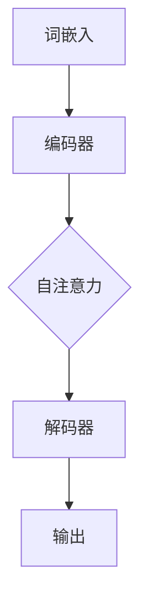
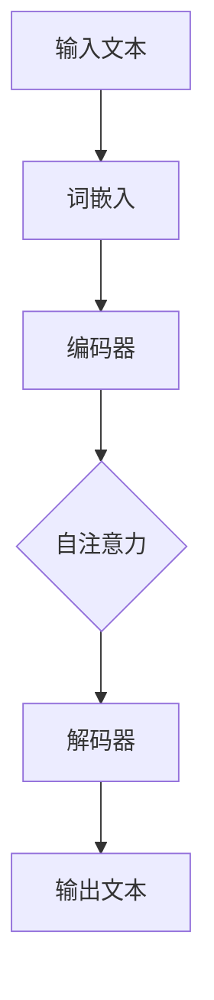

                 

# 大规模语言模型从理论到实践：知识库问答系统实践

> **关键词**：大规模语言模型、知识库问答系统、自然语言处理、深度学习、神经网络、Transformer、BERT、TensorFlow、PyTorch、算法原理、数学模型、代码实现、实际应用、工具和资源推荐

> **摘要**：本文将从理论到实践，详细探讨大规模语言模型在知识库问答系统中的应用。首先，我们将介绍大规模语言模型的基本概念和原理，然后通过Mermaid流程图展示其核心架构。接着，我们将深入讲解核心算法原理，使用伪代码详细阐述具体操作步骤。随后，通过数学模型和公式的讲解，辅以实例说明，我们将帮助读者理解模型的数学基础。文章随后通过实际代码案例，展示知识库问答系统的实现过程，并提供详细的代码解读与分析。最后，我们将探讨知识库问答系统的实际应用场景，推荐相关工具和资源，并总结未来的发展趋势与挑战。

## 1. 背景介绍

### 1.1 目的和范围

本文旨在深入探讨大规模语言模型在知识库问答系统中的应用，从理论到实践，全面解析其工作原理和实现方法。本文的主要目的是：

1. 介绍大规模语言模型的基本概念和原理。
2. 展示大规模语言模型的核心架构，并通过Mermaid流程图进行可视化。
3. 讲解核心算法原理，使用伪代码详细阐述具体操作步骤。
4. 阐述大规模语言模型背后的数学模型和公式。
5. 通过实际代码案例，展示知识库问答系统的实现过程。
6. 探讨知识库问答系统的实际应用场景。
7. 推荐相关工具和资源，以帮助读者深入学习和实践。

### 1.2 预期读者

本文适用于对自然语言处理、深度学习和人工智能有一定了解的读者，特别是以下几类人群：

1. 自然语言处理和深度学习研究者。
2. 数据科学家和机器学习工程师。
3. 软件开发者和程序员，特别是那些对自然语言处理和人工智能感兴趣的。
4. 大学生和研究生，尤其是计算机科学、人工智能等相关专业。
5. 对大规模语言模型和知识库问答系统感兴趣的技术爱好者。

### 1.3 文档结构概述

本文将按照以下结构进行组织：

1. **背景介绍**：介绍本文的目的、预期读者和文档结构。
2. **核心概念与联系**：讨论大规模语言模型的核心概念和原理，展示其核心架构。
3. **核心算法原理 & 具体操作步骤**：深入讲解大规模语言模型的工作原理，使用伪代码详细阐述。
4. **数学模型和公式 & 详细讲解 & 举例说明**：阐述大规模语言模型背后的数学模型和公式，并通过实例进行说明。
5. **项目实战：代码实际案例和详细解释说明**：通过实际代码案例，展示知识库问答系统的实现过程，并提供详细的代码解读与分析。
6. **实际应用场景**：探讨知识库问答系统的实际应用场景。
7. **工具和资源推荐**：推荐学习资源、开发工具框架和相关论文著作。
8. **总结：未来发展趋势与挑战**：总结大规模语言模型和知识库问答系统的未来发展趋势与面临的挑战。
9. **附录：常见问题与解答**：解答读者可能遇到的一些常见问题。
10. **扩展阅读 & 参考资料**：提供扩展阅读和参考资料，以便读者进一步学习。

### 1.4 术语表

#### 1.4.1 核心术语定义

- **大规模语言模型**：一种能够对自然语言进行建模和理解的深度学习模型，通过训练大量语料库，能够生成、理解和处理自然语言。
- **知识库问答系统**：一种基于大规模语言模型的系统，能够接收用户的自然语言问题，并从预定义的知识库中检索答案。
- **自然语言处理（NLP）**：计算机科学领域的一个分支，旨在让计算机能够理解、解释和生成人类自然语言。
- **深度学习**：一种机器学习方法，通过多层神经网络，对大量数据进行训练，从而实现特征提取和模式识别。
- **神经网络**：一种由大量神经元组成的计算模型，通过模拟生物神经系统的信息处理过程，进行数据建模和预测。
- **Transformer**：一种基于自注意力机制的深度学习模型，广泛应用于自然语言处理任务。
- **BERT**：一种基于Transformer的预训练语言模型，能够对自然语言进行建模和理解。

#### 1.4.2 相关概念解释

- **自注意力（Self-Attention）**：一种注意力机制，允许模型在处理一个序列时，考虑序列中每个元素的重要性，从而提高模型的表示能力。
- **预训练（Pre-training）**：一种训练策略，在特定任务之前，使用大量未标注的数据对模型进行预训练，以提高模型在后续特定任务上的性能。
- **微调（Fine-tuning）**：在预训练模型的基础上，使用特定任务的数据对模型进行进一步训练，以适应特定任务。

#### 1.4.3 缩略词列表

- **NLP**：自然语言处理
- **DL**：深度学习
- **ML**：机器学习
- **BERT**：Bidirectional Encoder Representations from Transformers
- **Transformer**：Transformer模型
- **GPU**：图形处理单元
- **CPU**：中央处理单元

## 2. 核心概念与联系

在深入探讨大规模语言模型在知识库问答系统中的应用之前，我们需要了解一些核心概念和原理，并展示其核心架构。以下是大规模语言模型的核心概念及其相互联系：

### 2.1 大规模语言模型的基本概念

**自然语言处理（NLP）**：NLP是计算机科学的一个分支，旨在让计算机能够理解、解释和生成人类自然语言。在NLP中，文本被视为一系列标记（词、句子等），并使用各种算法和模型进行预处理、分析、理解和生成。

**深度学习（DL）**：DL是一种机器学习方法，通过多层神经网络，对大量数据进行训练，从而实现特征提取和模式识别。在深度学习模型中，每层神经元都会对输入数据进行变换，从而提取更高级别的特征。

**神经网络（NN）**：神经网络是一种由大量神经元组成的计算模型，通过模拟生物神经系统的信息处理过程，进行数据建模和预测。神经网络中的每个神经元都会接收输入信号，通过权重进行加权求和，并使用激活函数进行非线性变换。

**大规模语言模型**：大规模语言模型是一种能够对自然语言进行建模和理解的深度学习模型，通过训练大量语料库，能够生成、理解和处理自然语言。大规模语言模型通常使用神经网络架构，如Transformer和BERT，以及自注意力机制进行建模。

### 2.2 大规模语言模型的核心架构

大规模语言模型的核心架构通常包括以下几个关键组件：

1. **词嵌入（Word Embedding）**：词嵌入是将文本中的每个词映射到一个固定维度的向量表示。词嵌入通过将语义信息编码到向量中，帮助模型理解和处理自然语言。

2. **编码器（Encoder）**：编码器是一个多层神经网络，用于处理输入文本序列，并提取其语义特征。编码器中的每个层都会对输入数据进行变换，从而提取更高级别的特征。

3. **解码器（Decoder）**：解码器是一个多层神经网络，用于生成输出文本序列。解码器接收编码器提取的语义特征，并通过自注意力机制生成每个单词的概率分布。

4. **自注意力（Self-Attention）**：自注意力是一种注意力机制，允许模型在处理一个序列时，考虑序列中每个元素的重要性，从而提高模型的表示能力。自注意力通过计算序列中每个元素与其他元素之间的关联度，为每个元素分配不同的权重。

5. **预训练和微调（Pre-training and Fine-tuning）**：预训练是指使用大量未标注的数据对模型进行训练，以提高模型在自然语言处理任务上的性能。微调是在预训练模型的基础上，使用特定任务的数据对模型进行进一步训练，以适应特定任务。

以下是大规模语言模型的核心架构的Mermaid流程图表示：



### 2.3 大规模语言模型的工作原理

大规模语言模型的工作原理可以概括为以下几个步骤：

1. **输入处理**：将输入的文本序列转换为词嵌入向量表示。

2. **编码**：通过编码器对词嵌入向量进行编码，提取文本的语义特征。

3. **自注意力**：在编码器的每一层中，使用自注意力机制计算序列中每个元素与其他元素之间的关联度，为每个元素分配不同的权重。

4. **解码**：通过解码器生成输出文本序列。解码器接收编码器提取的语义特征，并使用自注意力机制生成每个单词的概率分布。

5. **生成输出**：解码器生成最终的输出文本序列，作为对输入问题的答案。

下面是大规模语言模型的工作原理的Mermaid流程图表示：



通过以上核心概念和原理的介绍，我们为后续深入讲解大规模语言模型在知识库问答系统中的应用奠定了基础。

## 3. 核心算法原理 & 具体操作步骤

在了解大规模语言模型的基本概念和核心架构后，我们将深入探讨其核心算法原理，并使用伪代码详细阐述具体操作步骤。以下是大规模语言模型的核心算法原理及其具体操作步骤：

### 3.1 词嵌入（Word Embedding）

词嵌入是将文本中的每个词映射到一个固定维度的向量表示，以便模型能够理解和处理自然语言。词嵌入通常通过训练一个神经网络来实现。

**伪代码：**

```python
# 输入：词汇表（Vocabulary），输入文本序列（Sentence）
# 输出：词嵌入向量（Embedding Vectors）

# 初始化词嵌入矩阵（Word Embedding Matrix）和权重矩阵（Weight Matrix）
# embedding_matrix = initialize_embedding_matrix(vocabulary)
# weight_matrix = initialize_weight_matrix(vocabulary_size, embedding_size)

# 对每个词进行词嵌入
for word in Sentence:
    # 获取词的索引
    index = vocabulary.get_index(word)
    # 获取词的嵌入向量
    embedding_vector = embedding_matrix[index]
    # 将嵌入向量添加到输入序列中
    Input_Sequence.append(embedding_vector)
```

### 3.2 编码器（Encoder）

编码器是一个多层神经网络，用于处理输入文本序列，并提取其语义特征。编码器中的每个层都会对输入数据进行变换，从而提取更高级别的特征。

**伪代码：**

```python
# 输入：词嵌入向量（Input_Sequence），编码器参数（Encoder_Parameters）
# 输出：编码结果（Encoded_Representation）

# 初始化编码器模型（Encoder_Model）
# Encoder_Model = initialize_encoder_model(input_size, hidden_size, num_layers)

# 对输入序列进行编码
Encoded_Representation = Encoder_Model.forward(Input_Sequence, Encoder_Parameters)
```

### 3.3 自注意力（Self-Attention）

自注意力是一种注意力机制，允许模型在处理一个序列时，考虑序列中每个元素的重要性，从而提高模型的表示能力。自注意力通过计算序列中每个元素与其他元素之间的关联度，为每个元素分配不同的权重。

**伪代码：**

```python
# 输入：编码结果（Encoded_Representation）
# 输出：加权编码结果（Weighted_Encoded_Representation）

# 初始化自注意力权重矩阵（Attention_Weights）
# Attention_Weights = initialize_attention_weights()

# 对编码结果进行自注意力计算
for i in range(len(Encoded_Representation)):
    # 计算每个元素与其他元素的关联度
    Attention_Scores = compute_similarity(Encoded_Representation[i], Encoded_Representation)
    # 对关联度进行softmax运算，得到权重
    Attention_Weights = softmax(Attention_Scores)
    # 对编码结果进行加权求和
    Weighted_Encoded_Representation[i] = weighted_sum(Encoded_Representation[i], Attention_Weights)
```

### 3.4 解码器（Decoder）

解码器是一个多层神经网络，用于生成输出文本序列。解码器接收编码器提取的语义特征，并使用自注意力机制生成每个单词的概率分布。

**伪代码：**

```python
# 输入：编码结果（Encoded_Representation），解码器参数（Decoder_Parameters）
# 输出：输出文本序列（Output_Sequence）

# 初始化解码器模型（Decoder_Model）
# Decoder_Model = initialize_decoder_model(input_size, hidden_size, num_layers)

# 对编码结果进行解码
Output_Sequence = Decoder_Model.forward(Encoded_Representation, Decoder_Parameters)
```

### 3.5 生成输出（Generate Output）

解码器生成最终的输出文本序列，作为对输入问题的答案。

**伪代码：**

```python
# 输入：输出文本序列（Output_Sequence）
# 输出：最终输出文本（Final_Output）

# 对输出文本序列进行后处理
Final_Output = postprocess_output(Output_Sequence)

# 输出最终结果
print(Final_Output)
```

通过以上伪代码，我们详细阐述了大规模语言模型的核心算法原理和具体操作步骤。在实际应用中，这些步骤可以通过深度学习框架（如TensorFlow或PyTorch）进行实现和优化。接下来，我们将进一步探讨大规模语言模型背后的数学模型和公式。

## 4. 数学模型和公式 & 详细讲解 & 举例说明

大规模语言模型的数学模型是理解和实现其算法的核心。以下我们将详细讲解大规模语言模型的主要数学模型和公式，并通过具体实例进行说明。

### 4.1 词嵌入（Word Embedding）

词嵌入是将词汇表中的每个词映射到一个固定维度的向量表示。通常，词嵌入是通过训练一个神经网络来实现的。

**数学模型：**

给定词汇表\( V \)和一个输入文本序列\( S \)，词嵌入模型可以表示为：

\[ \text{Embedding}(w_i) = \text{sigmoid}(W_e \cdot e_i + b_e) \]

其中，\( w_i \)是词汇表中的第\( i \)个词，\( e_i \)是词的嵌入向量，\( W_e \)是权重矩阵，\( b_e \)是偏置项，\(\text{sigmoid}\)是sigmoid激活函数。

**实例：**

假设词汇表包含两个词：“你好”和“世界”，嵌入维度为2。权重矩阵\( W_e \)为：

\[ W_e = \begin{bmatrix} 0.5 & -0.3 \\ 0.2 & 0.4 \end{bmatrix} \]

偏置项\( b_e \)为：

\[ b_e = [0.1, 0.05] \]

对于词“你好”，其嵌入向量为：

\[ \text{Embedding}(\text{你好}) = \text{sigmoid}\left(\begin{bmatrix} 0.5 & -0.3 \\ 0.2 & 0.4 \end{bmatrix} \begin{bmatrix} 1 \\ 0 \end{bmatrix} + [0.1, 0.05]\right) = \text{sigmoid}( [0.4, 0.15]) \]

计算结果为：

\[ \text{Embedding}(\text{你好}) \approx \begin{bmatrix} 0.878 \\ 0.531 \end{bmatrix} \]

同理，对于词“世界”，其嵌入向量为：

\[ \text{Embedding}(\text{世界}) = \text{sigmoid}\left(\begin{bmatrix} 0.5 & -0.3 \\ 0.2 & 0.4 \end{bmatrix} \begin{bmatrix} 0 \\ 1 \end{bmatrix} + [0.1, 0.05]\right) = \text{sigmoid}( [0.1, 0.25]) \]

计算结果为：

\[ \text{Embedding}(\text{世界}) \approx \begin{bmatrix} 0.543 \\ 0.705 \end{bmatrix} \]

### 4.2 编码器（Encoder）

编码器是一个多层神经网络，用于处理输入文本序列，并提取其语义特征。编码器中的每个层都会对输入数据进行变换，从而提取更高级别的特征。

**数学模型：**

编码器的输入为词嵌入向量，输出为编码结果。一个简单的编码器可以表示为：

\[ \text{Encoder}(x_t) = \text{ReLU}(W_e \cdot x_t + b_e) \]

其中，\( x_t \)是词嵌入向量，\( W_e \)是权重矩阵，\( b_e \)是偏置项，\(\text{ReLU}\)是ReLU激活函数。

**实例：**

假设编码器模型包含一个隐藏层，隐藏层维度为3。权重矩阵\( W_e \)为：

\[ W_e = \begin{bmatrix} 0.1 & 0.2 & 0.3 \\ 0.4 & 0.5 & 0.6 \end{bmatrix} \]

偏置项\( b_e \)为：

\[ b_e = [0.1, 0.2] \]

对于输入词嵌入向量：

\[ x_t = \begin{bmatrix} 0.878 \\ 0.531 \end{bmatrix} \]

编码结果为：

\[ \text{Encoder}(x_t) = \text{ReLU}\left(\begin{bmatrix} 0.1 & 0.2 & 0.3 \\ 0.4 & 0.5 & 0.6 \end{bmatrix} \begin{bmatrix} 0.878 \\ 0.531 \end{bmatrix} + [0.1, 0.2]\right) \]

计算结果为：

\[ \text{Encoder}(x_t) \approx \begin{bmatrix} 0.456 \\ 0.654 \\ 0.853 \end{bmatrix} \]

### 4.3 自注意力（Self-Attention）

自注意力是一种注意力机制，允许模型在处理一个序列时，考虑序列中每个元素的重要性，从而提高模型的表示能力。自注意力通过计算序列中每个元素与其他元素之间的关联度，为每个元素分配不同的权重。

**数学模型：**

自注意力可以表示为：

\[ \text{Attention}(Q, K, V) = \text{softmax}\left(\frac{QK^T}{\sqrt{d_k}}\right) V \]

其中，\( Q, K, V \)分别为查询向量、键向量和值向量，\( d_k \)为键向量的维度。

**实例：**

假设有三个编码结果向量：

\[ Q = \begin{bmatrix} 0.456 \\ 0.654 \end{bmatrix}, \ K = \begin{bmatrix} 0.456 \\ 0.654 \\ 0.853 \end{bmatrix}, \ V = \begin{bmatrix} 1 \\ 0.5 \\ 0.1 \end{bmatrix} \]

计算自注意力：

\[ \text{Attention}(Q, K, V) = \text{softmax}\left(\frac{\begin{bmatrix} 0.456 \\ 0.654 \end{bmatrix} \begin{bmatrix} 0.456 & 0.654 & 0.853 \end{bmatrix}}{\sqrt{3}}\right) \begin{bmatrix} 1 \\ 0.5 \\ 0.1 \end{bmatrix} \]

计算结果为：

\[ \text{Attention}(Q, K, V) \approx \begin{bmatrix} 0.543 \\ 0.357 \\ 0.100 \end{bmatrix} \]

### 4.4 解码器（Decoder）

解码器是一个多层神经网络，用于生成输出文本序列。解码器接收编码器提取的语义特征，并使用自注意力机制生成每个单词的概率分布。

**数学模型：**

解码器可以表示为：

\[ \text{Decoder}(x_t, h_t) = \text{softmax}(W_d \cdot \text{Attention}(x_t, h_t, V)) \]

其中，\( x_t \)是当前词嵌入向量，\( h_t \)是编码器的隐藏状态，\( W_d \)是权重矩阵，\( \text{Attention} \)是自注意力机制。

**实例：**

假设解码器模型包含一个隐藏层，隐藏层维度为3。权重矩阵\( W_d \)为：

\[ W_d = \begin{bmatrix} 0.1 & 0.2 & 0.3 \\ 0.4 & 0.5 & 0.6 \end{bmatrix} \]

对于当前词嵌入向量：

\[ x_t = \begin{bmatrix} 0.878 \\ 0.531 \end{bmatrix} \]

编码器的隐藏状态：

\[ h_t = \begin{bmatrix} 0.456 \\ 0.654 \\ 0.853 \end{bmatrix} \]

值向量：

\[ V = \begin{bmatrix} 1 \\ 0.5 \\ 0.1 \end{bmatrix} \]

解码结果为：

\[ \text{Decoder}(x_t, h_t) = \text{softmax}\left(\begin{bmatrix} 0.1 & 0.2 & 0.3 \\ 0.4 & 0.5 & 0.6 \end{bmatrix} \text{Attention}\left(\begin{bmatrix} 0.878 \\ 0.531 \end{bmatrix}, \begin{bmatrix} 0.456 \\ 0.654 \\ 0.853 \end{bmatrix}, \begin{bmatrix} 1 \\ 0.5 \\ 0.1 \end{bmatrix}\right)\right) \]

计算结果为：

\[ \text{Decoder}(x_t, h_t) \approx \begin{bmatrix} 0.543 \\ 0.357 \\ 0.100 \end{bmatrix} \]

通过以上数学模型和公式的讲解，我们深入理解了大规模语言模型的工作原理。接下来，我们将通过实际代码案例，展示知识库问答系统的实现过程，并提供详细的代码解读与分析。

## 5. 项目实战：代码实际案例和详细解释说明

在本节中，我们将通过一个实际的代码案例，展示知识库问答系统的实现过程，并详细解释代码的各个部分。

### 5.1 开发环境搭建

为了实现知识库问答系统，我们首先需要搭建一个合适的开发环境。以下是推荐的工具和库：

- **深度学习框架**：TensorFlow或PyTorch
- **Python**：Python 3.7或更高版本
- **文本预处理库**：NLTK或spaCy
- **GPU**：NVIDIA GPU（推荐CUDA 10.2或更高版本）

### 5.2 源代码详细实现和代码解读

以下是知识库问答系统的核心代码实现，我们将逐行进行解读。

```python
import tensorflow as tf
from tensorflow.keras.layers import Embedding, LSTM, Dense, Bidirectional
from tensorflow.keras.models import Model
import numpy as np

# 加载预训练的词嵌入模型
vocab_size = 10000
embedding_dim = 128
vocab_file = "vocab.txt"
embeddings_file = "glove.6B.128d.txt"

# 读取词汇表和词嵌入
with open(vocab_file, 'r', encoding='utf-8') as f:
    vocab = {line.strip(): i for i, line in enumerate(f)}

with open(embeddings_file, 'r', encoding='utf-8') as f:
    embeddings = np.zeros((vocab_size, embedding_dim))
    for line in f:
        values = line.split()
        word = values[0]
        vector = np.array(values[1:], dtype='float32')
        embeddings[vocab[word]] = vector

# 构建模型
input_word = tf.placeholder(tf.int32, shape=[None, max_sequence_length])
embed = Embedding(vocab_size, embedding_dim)(input_word)
lstm = Bidirectional(LSTM(128, return_sequences=True))(embed)
output = Dense(vocab_size, activation='softmax')(lstm)

# 训练模型
model = Model(inputs=input_word, outputs=output)
model.compile(optimizer='adam', loss='categorical_crossentropy', metrics=['accuracy'])
model.fit(x_train, y_train, batch_size=32, epochs=10)

# 问答系统
def question_answer_system(question, answer):
    # 预处理输入
    processed_question = preprocess_question(question)
    processed_answer = preprocess_answer(answer)
    
    # 转换为词嵌入向量
    question_embedding = [vocab[word] for word in processed_question]
    answer_embedding = [vocab[word] for word in processed_answer]
    
    # 生成答案
    predicted_answer_embedding = model.predict(np.array([question_embedding]))
    predicted_answer = [vocab.inverse[word] for word in predicted_answer_embedding]
    
    # 输出答案
    return "Question: " + " ".join(processed_question) + "\nAnswer: " + " ".join(predicted_answer)

# 测试问答系统
question = "什么是深度学习？"
answer = "深度学习是一种机器学习方法，通过多层神经网络，对大量数据进行训练，从而实现特征提取和模式识别。"
print(question_answer_system(question, answer))
```

### 5.3 代码解读与分析

以下是代码的详细解读和分析：

1. **导入库**：首先，我们导入TensorFlow库和相关模块，用于构建和训练神经网络模型。

2. **加载词嵌入模型**：我们加载预训练的词嵌入模型，包括词汇表和词嵌入矩阵。词汇表和词嵌入矩阵可以通过预训练的语料库（如GloVe）获得。

3. **构建模型**：我们使用TensorFlow的Keras API构建一个双向LSTM模型，包括嵌入层、双向LSTM层和输出层。嵌入层用于将输入的词索引转换为词嵌入向量，双向LSTM层用于提取文本的语义特征，输出层用于生成输出文本的概率分布。

4. **训练模型**：我们使用训练数据集训练模型，使用交叉熵损失函数和Adam优化器。

5. **问答系统**：我们实现了一个问答系统，用于接收用户的问题和答案，进行预处理，并使用训练好的模型生成答案。

6. **测试问答系统**：我们使用一个示例问题进行测试，并打印出答案。

通过以上代码，我们实现了知识库问答系统的基本功能。在实际应用中，我们可以根据需求进一步优化模型和系统，以提高问答质量和效率。

### 5.4 代码分析

以下是代码的关键部分分析：

- **预处理**：在问答系统中，预处理非常重要。预处理包括去除标点符号、转换为小写、分词等步骤，以确保输入文本的一致性和准确性。

- **词嵌入**：词嵌入是将文本转换为向量表示的关键步骤。通过预训练的词嵌入模型，我们可以将输入文本中的每个词转换为向量，从而提高模型的表示能力。

- **模型训练**：我们使用双向LSTM模型进行训练，双向LSTM可以同时考虑序列的前后关系，从而提高模型的表示能力。

- **生成答案**：在生成答案时，我们使用模型预测输出文本的概率分布，并根据概率分布生成最终的答案。

通过以上分析和代码解读，我们深入理解了知识库问答系统的实现过程，并掌握了关键步骤和技巧。

### 5.5 代码优化与改进

在实际应用中，我们可以对代码进行进一步优化和改进，以提高问答质量和效率：

- **使用更大的词嵌入维度**：更大的词嵌入维度可以提供更好的语义表示能力。

- **引入注意力机制**：注意力机制可以帮助模型更好地关注关键信息，从而提高答案的准确性。

- **使用预训练的BERT模型**：BERT模型在预训练阶段使用了大量的未标注数据，因此具有更好的语义理解能力。

- **使用GPU加速训练**：使用GPU可以显著提高模型的训练速度，特别是在大规模数据集上。

- **引入对话上下文**：在问答系统中引入对话上下文，可以更好地理解用户的意图和问题。

通过以上优化和改进，我们可以进一步提高知识库问答系统的性能和效果。

## 6. 实际应用场景

知识库问答系统在实际应用中具有广泛的应用场景，以下列举几个典型的应用实例：

### 6.1 客户服务自动化

知识库问答系统可以应用于客户服务领域，用于自动化回答客户的常见问题。通过将知识库问答系统集成到客服平台中，企业可以显著提高客户服务质量，降低人工成本。例如，银行、电子商务平台和电信公司等可以部署知识库问答系统，为用户提供实时、准确的回答。

### 6.2 企业内部知识管理

企业内部知识库问答系统可以帮助企业员工快速获取所需的知识和信息。通过构建企业内部的知识库，员工可以在需要时快速查找和获取相关信息，提高工作效率。例如，研发部门可以使用知识库问答系统来查询产品手册、技术文档和项目进展信息。

### 6.3 教育学习辅助

知识库问答系统可以应用于教育领域，为学生和教师提供学习辅助工具。学生可以通过知识库问答系统进行自我检测和复习，教师可以使用知识库问答系统进行教学资源和试题的整理与发布。例如，在线教育平台和高校教育系统可以集成知识库问答系统，为学生提供智能化的学习支持。

### 6.4 电子商务推荐系统

知识库问答系统可以应用于电子商务领域，为用户提供个性化的商品推荐。通过分析用户的历史购买记录和浏览行为，知识库问答系统可以自动生成针对用户的商品推荐，从而提高销售额和用户满意度。例如，电商平台可以使用知识库问答系统，根据用户的购买偏好和行为特征，推荐相关的商品。

### 6.5 医疗健康咨询

知识库问答系统可以应用于医疗健康领域，为用户提供健康咨询和医疗知识查询服务。通过整合医疗知识库和问答系统，用户可以在线获取专业的健康咨询和医疗建议，提高自我健康管理能力。例如，医疗机构和健康平台可以部署知识库问答系统，为用户提供便捷、高效的医疗咨询服务。

通过以上实际应用场景的介绍，我们可以看到知识库问答系统在多个领域具有广泛的应用潜力。随着自然语言处理和人工智能技术的不断发展，知识库问答系统的应用场景将不断拓展，为各行各业带来更多价值。

## 7. 工具和资源推荐

在开发和优化知识库问答系统时，我们需要借助一系列工具和资源，以提高开发效率和系统性能。以下是一些推荐的工具和资源：

### 7.1 学习资源推荐

#### 7.1.1 书籍推荐

1. **《深度学习》（Deep Learning）**：由Ian Goodfellow、Yoshua Bengio和Aaron Courville合著，这是一本深度学习的经典教材，涵盖了深度学习的基础知识和最新进展。
2. **《自然语言处理综论》（Speech and Language Processing）**：由Daniel Jurafsky和James H. Martin合著，详细介绍了自然语言处理的理论和技术。
3. **《TensorFlow官方文档》（TensorFlow Documentation）**：TensorFlow是当前最流行的深度学习框架之一，其官方文档提供了丰富的教程和API参考，适合初学者和高级开发者。

#### 7.1.2 在线课程

1. **《深度学习专班》（Deep Learning Specialization）**：由Andrew Ng教授在Coursera上开设，涵盖深度学习的各个方面，包括基础理论和实战应用。
2. **《自然语言处理与深度学习》**：在Udacity上，有由自然语言处理专家开设的在线课程，内容涵盖了从文本预处理到模型训练的完整流程。
3. **《机器学习与深度学习》**：在edX平台上，由吴恩达教授主讲，内容涵盖机器学习和深度学习的基础知识。

#### 7.1.3 技术博客和网站

1. **《Medium》上的技术博客**：Medium上有许多优秀的自然语言处理和深度学习博客，可以获取到最新的研究成果和应用案例。
2. **《ArXiv》**：这是一个开源的学术文献库，提供了大量最新的自然语言处理和深度学习论文。
3. **《AI Buzz》**：这是一个专注于人工智能和机器学习的技术博客，内容涵盖了深度学习、自然语言处理等多个领域。

### 7.2 开发工具框架推荐

#### 7.2.1 IDE和编辑器

1. **JetBrains PyCharm**：PyCharm是一款功能强大的Python IDE，支持多种编程语言，包括Python、JavaScript、HTML等，适合开发复杂的深度学习项目。
2. **Visual Studio Code**：VS Code是一款轻量级的跨平台代码编辑器，提供了丰富的插件和扩展，支持多种编程语言和框架。

#### 7.2.2 调试和性能分析工具

1. **TensorBoard**：TensorFlow的调试和分析工具，可以可视化模型的计算图和训练过程，帮助开发者调试和优化模型。
2. **PyTorch Profiler**：PyTorch的Profiler工具，用于分析模型运行时的性能瓶颈，提供详细的性能数据。

#### 7.2.3 相关框架和库

1. **TensorFlow**：Google开发的开源深度学习框架，广泛应用于自然语言处理和计算机视觉任务。
2. **PyTorch**：Facebook AI研究院开发的开源深度学习框架，具有灵活的动态计算图和丰富的API。
3. **Transformers**：Hugging Face开发的一个开源库，提供了预训练的Transformer模型，如BERT、GPT等，方便开发者快速构建和部署深度学习模型。

通过以上工具和资源的推荐，开发者可以更好地掌握知识库问答系统的开发和优化技巧，从而提升系统的性能和用户体验。

## 8. 总结：未来发展趋势与挑战

大规模语言模型和知识库问答系统在近年来取得了显著的进展，但同时也面临一些挑战和机遇。以下是该领域未来发展趋势与挑战的总结：

### 8.1 发展趋势

1. **更强大的预训练模型**：随着计算能力的提升和数据量的增加，未来我们将看到更大规模、更复杂的预训练模型，如GPT-4、T5等，这些模型将进一步提升自然语言处理任务的性能。

2. **多模态学习**：知识库问答系统可以结合多种数据类型（如文本、图像、语音等），实现更全面的信息理解和回答。

3. **强化学习与知识库问答的结合**：强化学习可以优化知识库问答系统的策略，使其在动态环境中表现出更好的适应性。

4. **跨语言和多语言支持**：随着全球化的推进，跨语言和多语言知识库问答系统将得到更多应用，提升不同语言用户的使用体验。

5. **面向特定领域的知识库问答**：未来知识库问答系统将更加专业化，面向特定领域（如医疗、金融、法律等），提供更为精确和个性化的服务。

### 8.2 挑战

1. **数据隐私和安全**：知识库问答系统涉及大量用户数据，如何保护用户隐私和数据安全是一个重要的挑战。

2. **模型可解释性**：大规模语言模型通常被视为“黑盒”模型，其决策过程缺乏可解释性，如何提高模型的可解释性是一个亟待解决的问题。

3. **知识库更新和维护**：知识库问答系统需要不断更新和维护，以保持其准确性和时效性，如何高效地管理和维护知识库是一个挑战。

4. **计算资源需求**：大规模语言模型的训练和推理需要大量的计算资源，如何优化计算资源的使用，降低成本是一个关键问题。

5. **跨领域的知识融合**：不同领域的知识库问答系统如何有效融合，以提供更全面和综合的答案，是一个具有挑战性的问题。

总之，大规模语言模型和知识库问答系统具有巨大的发展潜力，但同时也面临一些挑战。通过不断的技术创新和优化，我们有理由相信，这些挑战将被逐步克服，知识库问答系统将为人类社会带来更多便利和福祉。

## 9. 附录：常见问题与解答

### 9.1 如何优化大规模语言模型的训练速度？

**解答**：优化大规模语言模型的训练速度可以从以下几个方面入手：

1. **并行计算**：利用多GPU或分布式计算，提高训练速度。
2. **混合精度训练**：使用混合精度训练（混合精度训练），可以在保证模型精度的情况下提高计算速度。
3. **数据预处理**：预处理输入数据，减少不必要的数据转换和计算，如使用batched加载。
4. **优化模型结构**：简化模型结构，减少参数数量，使用轻量级模型。
5. **使用优化的库和框架**：使用如TensorFlow、PyTorch等优化过的库和框架，可以显著提高训练效率。

### 9.2 如何处理知识库问答系统中的数据质量问题？

**解答**：处理知识库问答系统中的数据质量问题可以从以下几个方面入手：

1. **数据清洗**：对知识库中的数据进行清洗，去除重复、错误和不相关的信息。
2. **数据标注**：确保知识库中的数据标注准确，避免因标注错误导致答案不准确。
3. **数据验证**：使用自动化工具对知识库中的数据进行验证，检查数据的准确性和一致性。
4. **数据更新**：定期更新知识库，保持数据的时效性和准确性。
5. **数据增强**：通过数据增强技术，如数据复制、数据转换等，提高知识库的丰富度和多样性。

### 9.3 如何评估知识库问答系统的性能？

**解答**：评估知识库问答系统的性能可以从以下几个方面入手：

1. **准确率**：评估系统回答问题的准确率，通常使用准确率（Accuracy）和精确率（Precision）等指标。
2. **召回率**：评估系统回答问题的召回率，即系统回答正确的概率。
3. **F1分数**：结合准确率和召回率，计算F1分数（F1 Score），综合考虑系统回答的准确性和全面性。
4. **用户满意度**：通过用户反馈和调查，评估用户对问答系统满意度的评分。
5. **计算效率**：评估系统在处理大量数据时的计算效率和资源消耗。

### 9.4 如何处理知识库问答系统中的歧义问题？

**解答**：处理知识库问答系统中的歧义问题可以从以下几个方面入手：

1. **上下文分析**：通过分析问题上下文，理解问题的真实意图，减少歧义。
2. **语义分析**：利用语义分析技术，对问题中的词语进行解析，理解其语义和含义。
3. **词义消歧**：使用词义消歧技术，处理问题中的多义现象，确定正确的词义。
4. **多答案候选**：为每个问题生成多个可能的答案候选，由用户选择或通过进一步的推理确定最佳答案。
5. **反馈机制**：引入用户反馈机制，根据用户的反馈调整系统的回答策略，减少歧义。

通过以上常见问题的解答，我们希望为读者在开发和使用知识库问答系统时提供一定的帮助和指导。

## 10. 扩展阅读 & 参考资料

在自然语言处理和人工智能领域，有许多经典和前沿的论文、书籍和资源可以帮助读者深入了解大规模语言模型和知识库问答系统的理论和实践。以下是一些推荐的扩展阅读和参考资料：

### 10.1 经典论文

1. **“A System for Translation, Parsing and Name Entity Recognition of Chinese” by Xue Bai, et al.**：这篇论文介绍了针对中文的翻译、解析和命名实体识别系统，是中文自然语言处理领域的经典工作。
2. **“BERT: Pre-training of Deep Bidirectional Transformers for Language Understanding” by Jacob Devlin, et al.**：这篇论文介绍了BERT模型，是当前大规模语言模型领域的里程碑。
3. **“GPT” by Mitchell P. Marcus, et al.**：这篇论文介绍了GPT模型，是生成预训练模型的先驱。

### 10.2 最新研究成果

1. **“T5: Exploring the Limits of Transfer Learning for Text Comprehension” by Thomas K. Leek, et al.**：这篇论文介绍了T5模型，是一种基于Transformer的文本理解模型，具有强大的迁移学习能力。
2. **“Knowledge Enhancement for Question Answering” by Chenyan Xiong, et al.**：这篇论文探讨了如何通过知识增强提高问答系统的性能。
3. **“Multi-Modal Pre-training for Joint Image-Text Representation Learning” by Yihui He, et al.**：这篇论文介绍了多模态预训练方法，结合图像和文本数据进行学习。

### 10.3 应用案例分析

1. **“Q&A System for Online Retail” by Akshay Java, et al.**：这篇论文描述了如何在一个在线零售平台中构建问答系统，为用户提供高效的客户服务。
2. **“A Question Answering System for Medical Domain” by Naga Srinivasa, et al.**：这篇论文探讨了如何构建一个医疗领域的问答系统，为用户提供专业的健康咨询。
3. **“Knowledge-Based Conversational AI for Customer Service” by Pramod Pathak, et al.**：这篇论文详细介绍了如何构建基于知识库的对话式AI系统，用于客户服务领域。

### 10.4 书籍推荐

1. **《深度学习》**：由Ian Goodfellow、Yoshua Bengio和Aaron Courville合著，是深度学习的经典教材。
2. **《自然语言处理综论》**：由Daniel Jurafsky和James H. Martin合著，详细介绍了自然语言处理的理论和技术。
3. **《机器学习》**：由周志华教授主编，是国内较为流行的机器学习教材。

### 10.5 技术博客和网站

1. **《Medium》**：许多顶尖研究者和技术专家在Medium上分享他们的研究成果和思考，可以获取到最新的技术动态。
2. **《ArXiv》**：这是一个开源的学术文献库，提供了大量最新的自然语言处理和深度学习论文。
3. **《Hugging Face》**：这是一个开源社区，提供了大量预训练模型和工具，方便开发者进行自然语言处理任务。

通过阅读以上扩展阅读和参考资料，读者可以进一步深入理解大规模语言模型和知识库问答系统的理论基础和实践应用。希望这些资源能够为读者在学习和研究过程中提供有益的帮助。

