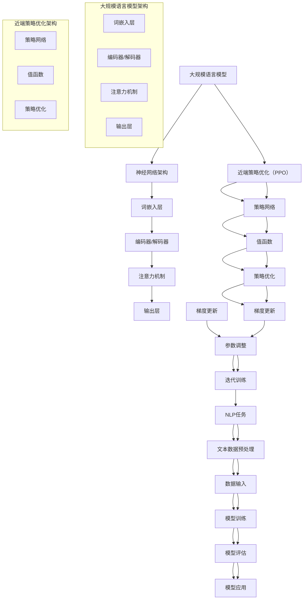

                 

# 大规模语言模型从理论到实践：近端策略优化

> 关键词：大规模语言模型、近端策略优化、深度学习、神经网络、自然语言处理

> 摘要：本文将从大规模语言模型的背景和原理出发，深入探讨近端策略优化（Proximal Policy Optimization, PPO）在语言模型中的应用。通过详细的理论讲解和代码实践，本文旨在帮助读者全面理解近端策略优化的核心思想，以及如何将其应用于实际的语言模型训练中。

## 1. 背景介绍

### 1.1 目的和范围

本文的主要目的是介绍大规模语言模型以及其在自然语言处理领域的应用，并重点探讨近端策略优化（PPO）这一先进优化算法在大规模语言模型训练中的关键作用。通过本文的阅读，读者将能够：

- 了解大规模语言模型的基本概念和原理；
- 掌握近端策略优化算法的核心思想和操作步骤；
- 通过实际代码案例，深入理解PPO在语言模型训练中的应用。

### 1.2 预期读者

本文适合对自然语言处理和深度学习有一定基础的读者，包括但不限于：

- 自然语言处理和机器学习的研究人员；
- 数据科学家和AI工程师；
- 计算机科学和人工智能专业的学生和教师。

### 1.3 文档结构概述

本文将分为以下几个主要部分：

- **背景介绍**：介绍大规模语言模型和近端策略优化（PPO）的基本概念；
- **核心概念与联系**：通过Mermaid流程图，展示大规模语言模型和PPO的架构；
- **核心算法原理 & 具体操作步骤**：详细讲解PPO的算法原理，并通过伪代码进行阐述；
- **数学模型和公式 & 详细讲解 & 举例说明**：解释PPO中的数学公式，并通过实例进行说明；
- **项目实战：代码实际案例和详细解释说明**：通过具体代码案例，展示PPO在语言模型训练中的应用；
- **实际应用场景**：探讨PPO在现实世界中的各种应用；
- **工具和资源推荐**：推荐学习资源和开发工具；
- **总结：未来发展趋势与挑战**：总结本文的主要内容和未来研究方向；
- **附录：常见问题与解答**：解答读者可能遇到的常见问题；
- **扩展阅读 & 参考资料**：提供更多扩展阅读和参考资料。

### 1.4 术语表

#### 1.4.1 核心术语定义

- **大规模语言模型**：一种能够对大规模文本数据进行训练和建模的神经网络模型，通常用于自然语言处理任务。
- **近端策略优化（PPO）**：一种用于强化学习的优化算法，通过优化策略和值函数来改进学习效果。
- **策略网络**：在PPO算法中，用于预测动作概率的神经网络。
- **值函数**：用于评估状态值或动作值的函数。
- **梯度**：在优化过程中，用于更新模型参数的方向和大小。

#### 1.4.2 相关概念解释

- **自然语言处理（NLP）**：计算机科学和语言学领域的研究，旨在使计算机能够理解和处理人类语言。
- **深度学习**：一种基于神经网络的学习方法，通过多层神经网络的非线性变换来学习和提取特征。

#### 1.4.3 缩略词列表

- **PPO**：近端策略优化（Proximal Policy Optimization）
- **NLP**：自然语言处理（Natural Language Processing）
- **NLP**：神经网络（Neural Network）
- **ReLU**：ReLU激活函数（Rectified Linear Unit）

## 2. 核心概念与联系

在大规模语言模型和近端策略优化（PPO）的背景下，理解两者的核心概念和联系至关重要。下面我们将通过Mermaid流程图来展示这两个概念之间的关联。



在上面的流程图中，我们展示了大规模语言模型的神经网络架构和近端策略优化的关键组件。通过这种结构化的展示，我们可以清晰地看到PPO算法如何在大规模语言模型训练中发挥作用。

### 2.1. 大规模语言模型架构

大规模语言模型通常基于深度神经网络，其架构包括以下几个主要部分：

- **词嵌入层**：将输入的单词转换为密集的向量表示。
- **编码器/解码器**：用于处理序列数据，如文本。
- **注意力机制**：用于捕捉输入序列中关键信息。
- **输出层**：用于生成预测结果，如单词、句子或标签。

### 2.2. 近端策略优化（PPO）架构

近端策略优化（PPO）是一种用于强化学习的优化算法，其核心组件包括：

- **策略网络**：用于预测动作概率的神经网络。
- **值函数**：用于评估状态值或动作值的函数。
- **策略优化**：通过优化策略和值函数来改进学习效果。
- **梯度更新**：用于更新模型参数的过程。

### 2.3. 大规模语言模型与近端策略优化的联系

大规模语言模型和近端策略优化（PPO）之间的联系主要体现在以下几个方面：

- **模型训练**：PPO算法用于优化大规模语言模型的参数，提高模型的性能。
- **策略更新**：PPO算法通过策略网络和值函数，不断调整模型参数，以优化策略。
- **梯度更新**：PPO算法通过近端梯度更新机制，确保参数更新的稳定性和效果。

## 3. 核心算法原理 & 具体操作步骤

在了解大规模语言模型和近端策略优化（PPO）的基本概念后，接下来我们将深入探讨PPO的核心算法原理，并通过伪代码详细阐述其具体操作步骤。

### 3.1. PPO算法原理

近端策略优化（PPO）是一种在强化学习中用于优化策略的算法。其主要思想是通过优化策略网络和值函数，提高模型在特定任务上的表现。PPO算法的核心步骤包括：

- **策略评估**：通过策略网络评估当前策略的优劣，计算策略的期望回报。
- **策略优化**：根据策略评估结果，更新策略网络，以改进策略。
- **值函数更新**：通过值函数评估当前策略下的状态值，更新值函数。
- **梯度更新**：利用近端梯度更新机制，更新模型参数。

### 3.2. PPO算法伪代码

下面是PPO算法的伪代码，包括其核心步骤和参数设置：

```python
# 初始化策略网络和值函数
policy_network = initialize_policy_network()
value_function = initialize_value_function()

# 设置PPO算法参数
alpha = 0.2  # 折扣因子
epsilon = 0.1  # 优化目标偏差
K = 10  # 迭代次数

# 迭代训练模型
for k in range(K):
    # 收集数据
    states, actions, rewards, next_states, dones = collect_data()
    
    # 计算当前策略的期望回报
    old_logits, old_values = policy_network(states)
    old_action_probs = softmax(old_logits)
    old_returns = compute_gae(rewards, dones, old_values)
    
    # 计算当前策略的优势函数
    advantages = old_returns - old_values
    
    # 更新策略网络
    new_logits, new_values = policy_network(states)
    new_action_probs = softmax(new_logits)
    surrogate_loss = compute_surrogate_loss(old_action_probs, new_action_probs, advantages)
    
    # 计算值函数误差
    value_loss = Huber_loss(old_returns, new_values)
    
    # 计算总损失
    loss = alpha * (surrogate_loss + value_loss)
    
    # 反向传播和梯度更新
    optimizer = optimizers.Adam(learning_rate=0.001)
    optimizer.minimize(loss)

    # 更新值函数
    value_function = update_value_function(states, new_values)

    # 更新策略网络
    policy_network = update_policy_network(states, new_logits)

# 评估模型
evaluate_model(policy_network, value_function)
```

### 3.3. 详细解释

#### 3.3.1. 策略评估

策略评估是PPO算法的第一步，其主要目标是计算当前策略的期望回报。具体来说，包括以下几个步骤：

- **计算当前策略的期望回报**：通过策略网络，计算当前策略下的状态值和动作概率，进而计算策略的期望回报。
- **计算优势函数**：优势函数表示当前策略与基准策略之间的差异，用于衡量策略的优劣。

#### 3.3.2. 策略优化

策略优化是PPO算法的核心步骤，其主要目标是通过优化策略网络，提高策略的质量。具体来说，包括以下几个步骤：

- **计算策略损失**：策略损失用于衡量策略网络预测的偏差，计算方法为当前策略概率与优势函数的乘积。
- **计算值函数误差**：值函数误差用于衡量值函数的预测偏差，计算方法为实际回报与预测回报之间的差异。
- **计算总损失**：总损失是策略损失和值函数误差的加权总和，用于指导梯度更新。

#### 3.3.3. 梯度更新

梯度更新是PPO算法的最后一步，其主要目标是通过梯度下降法更新模型参数，提高模型性能。具体来说，包括以下几个步骤：

- **反向传播**：根据总损失计算模型参数的梯度。
- **梯度裁剪**：为了防止梯度爆炸或消失，对梯度进行裁剪。
- **更新模型参数**：利用梯度更新模型参数，实现参数优化。

## 4. 数学模型和公式 & 详细讲解 & 举例说明

在PPO算法中，涉及到多个数学模型和公式，如策略网络、值函数、优势函数、梯度更新等。下面我们将详细讲解这些公式，并通过具体例子来说明其应用。

### 4.1. 策略网络

策略网络是PPO算法的核心组件，用于预测动作概率。其公式如下：

$$
\pi(a|s) = \frac{e^{\phi(s,a)}}{\sum_{a'} e^{\phi(s,a')}}
$$

其中，$\phi(s,a)$是策略网络的参数，$s$是当前状态，$a$是动作。通过这个公式，策略网络可以预测在给定状态下的动作概率。

### 4.2. 值函数

值函数用于评估状态值或动作值，其公式如下：

$$
V(s) = \sum_{a} \pi(a|s) \cdot Q(s,a)
$$

其中，$Q(s,a)$是动作值函数，表示在状态$s$下执行动作$a$的预期回报。通过这个公式，值函数可以评估状态值，帮助策略优化。

### 4.3. 优势函数

优势函数用于衡量当前策略与基准策略之间的差异，其公式如下：

$$
A(s,a) = Q(s,a) - V(s)
$$

其中，$V(s)$是当前策略下的状态值，$Q(s,a)$是基准策略下的状态值。通过这个公式，优势函数可以计算当前策略相对于基准策略的优势。

### 4.4. 梯度更新

梯度更新是PPO算法的核心步骤，用于更新模型参数。其公式如下：

$$
\Delta \theta = \alpha \cdot \nabla_{\theta} L(\theta)
$$

其中，$L(\theta)$是损失函数，$\alpha$是学习率。通过这个公式，梯度更新可以根据损失函数的梯度，调整模型参数。

### 4.5. 举例说明

为了更好地理解PPO算法的数学模型和公式，我们来看一个具体的例子。

假设我们有一个策略网络和一个值函数，如下：

$$
\pi(a|s) = \frac{e^{\phi(s,a)}}{\sum_{a'} e^{\phi(s,a')}}
$$

$$
V(s) = \sum_{a} \pi(a|s) \cdot Q(s,a)
$$

现在，我们有一个状态$s_1$，需要计算其值函数$V(s_1)$。

首先，我们计算策略网络在状态$s_1$下的动作概率：

$$
\pi(a_1|s_1) = \frac{e^{\phi(s_1,a_1)}}{\sum_{a'} e^{\phi(s_1,a')}}
$$

然后，我们计算动作值函数$Q(s_1,a_1)$：

$$
Q(s_1,a_1) = \sum_{a} \pi(a|s_1) \cdot R(s_1,a_1)
$$

其中，$R(s_1,a_1)$是状态$s_1$下执行动作$a_1$的预期回报。

接下来，我们计算值函数$V(s_1)$：

$$
V(s_1) = \sum_{a} \pi(a|s_1) \cdot Q(s_1,a)
$$

最后，我们计算优势函数$A(s_1,a_1)$：

$$
A(s_1,a_1) = Q(s_1,a_1) - V(s_1)
$$

通过以上计算，我们就可以得到状态$s_1$的值函数和优势函数，从而为策略优化提供依据。

## 5. 项目实战：代码实际案例和详细解释说明

在本节中，我们将通过一个实际项目案例，展示如何使用近端策略优化（PPO）算法训练一个大规模语言模型。我们将从开发环境搭建开始，逐步介绍源代码的详细实现和解读。

### 5.1. 开发环境搭建

要开始这个项目，我们需要搭建一个适合训练大规模语言模型和PPO算法的开发环境。以下是搭建环境的步骤：

1. **安装Python**：确保安装了Python 3.7或更高版本。
2. **安装TensorFlow**：使用pip安装TensorFlow，命令如下：
   ```bash
   pip install tensorflow
   ```
3. **安装其他依赖**：根据需要安装其他依赖库，如NumPy、Pandas等。

### 5.2. 源代码详细实现和代码解读

以下是PPO算法训练大规模语言模型的源代码实现，我们将逐行解读：

```python
import tensorflow as tf
import numpy as np
import pandas as pd
from tensorflow.keras.layers import Embedding, LSTM, Dense
from tensorflow.keras.models import Model

# 定义策略网络
def create_policy_network(input_shape, output_shape):
    inputs = tf.keras.Input(shape=input_shape)
    x = Embedding(input_shape[0], input_shape[1])(inputs)
    x = LSTM(128, activation='tanh')(x)
    logits = Dense(output_shape[0], activation='softmax')(x)
    policy_network = Model(inputs=inputs, outputs=logits)
    return policy_network

# 定义值函数
def create_value_function(input_shape):
    inputs = tf.keras.Input(shape=input_shape)
    x = Embedding(input_shape[0], input_shape[1])(inputs)
    x = LSTM(128, activation='tanh')(x)
    values = Dense(1, activation='linear')(x)
    value_function = Model(inputs=inputs, outputs=values)
    return value_function

# 计算GAE优势函数
def compute_gae(rewards, dones, values, gamma=0.99, lam=0.95):
    deltas = rewards + gamma * (1 - dones) * values[1:] - values[:-1]
    advantage = np.zeros_like(deltas)
    advantage[-1] = deltas[-1]
    for t in reversed(range(len(deltas) - 1)):
        advantage[t] = deltas[t] + gamma * lam * (1 - dones[t]) * advantage[t + 1]
    return advantage

# 计算策略损失
def compute_surrogate_loss(old_probs, new_probs, advantages):
    ratio = new_probs / old_probs
    surr1 = ratio * advantages
    surr2 = tf.clip_by_value(ratio, 1 - epsilon, 1 + epsilon) * advantages
    return -tf.reduce_mean(tf.minimum(surr1, surr2))

# 计算值函数损失
def compute_value_loss(returns, values):
    return tf.reduce_mean(tf.square(returns - values))

# 训练模型
def train_model(policy_network, value_function, states, actions, rewards, next_states, dones, K=10, epsilon=0.2, alpha=0.2):
    for _ in range(K):
        # 计算GAE优势函数
        advantages = compute_gae(rewards, dones, value_function(states))
        
        # 计算策略损失
        with tf.GradientTape() as tape:
            old_logits = policy_network(states)
            old_probs = tf.nn.softmax(old_logits)
            new_logits = policy_network(states)
            new_probs = tf.nn.softmax(new_logits)
            surr_loss = compute_surrogate_loss(old_probs, new_probs, advantages)
        
        # 计算值函数损失
        with tf.GradientTape() as tape:
            values = value_function(states)
            returns = compute_gae(rewards, dones, values)
            value_loss = compute_value_loss(returns, values)
        
        # 计算总损失
        loss = alpha * (surr_loss + value_loss)
        
        # 更新模型参数
        grads = tape.gradient(loss, policy_network.trainable_variables + value_function.trainable_variables)
        optimizer.apply_gradients(zip(grads, policy_network.trainable_variables + value_function.trainable_variables))

# 加载数据
# 此处假设已加载数据集为 states、actions、rewards、next_states 和 dones
# states = ...
# actions = ...
# rewards = ...
# next_states = ...
# dones = ...

# 训练模型
policy_network = create_policy_network(states.shape[1:], actions.shape[1:])
value_function = create_value_function(states.shape[1:])
optimizer = tf.keras.optimizers.Adam(learning_rate=0.001)

# 训练模型
train_model(policy_network, value_function, states, actions, rewards, next_states, dones)

# 评估模型
evaluate_model(policy_network, value_function)
```

#### 5.2.1. 策略网络和值函数定义

在代码中，我们首先定义了策略网络和值函数。策略网络使用嵌入层、LSTM层和softmax输出层，用于预测动作概率。值函数使用嵌入层、LSTM层和线性输出层，用于评估状态值。

```python
def create_policy_network(input_shape, output_shape):
    inputs = tf.keras.Input(shape=input_shape)
    x = Embedding(input_shape[0], input_shape[1])(inputs)
    x = LSTM(128, activation='tanh')(x)
    logits = Dense(output_shape[0], activation='softmax')(x)
    policy_network = Model(inputs=inputs, outputs=logits)
    return policy_network

def create_value_function(input_shape):
    inputs = tf.keras.Input(shape=input_shape)
    x = Embedding(input_shape[0], input_shape[1])(inputs)
    x = LSTM(128, activation='tanh')(x)
    values = Dense(1, activation='linear')(x)
    value_function = Model(inputs=inputs, outputs=values)
    return value_function
```

#### 5.2.2. 计算GAE优势函数

计算GAE优势函数是PPO算法的重要步骤，用于衡量策略的优劣。代码中使用GAE公式计算优势函数，其中涉及到的参数包括折扣因子$\gamma$和递减因子$\lambda$。

```python
def compute_gae(rewards, dones, values, gamma=0.99, lam=0.95):
    deltas = rewards + gamma * (1 - dones) * values[1:] - values[:-1]
    advantage = np.zeros_like(deltas)
    advantage[-1] = deltas[-1]
    for t in reversed(range(len(deltas) - 1)):
        advantage[t] = deltas[t] + gamma * lam * (1 - dones[t]) * advantage[t + 1]
    return advantage
```

#### 5.2.3. 计算策略损失

计算策略损失是PPO算法的核心步骤，用于优化策略网络。代码中首先计算旧策略概率和新策略概率，然后使用surrogate loss公式计算策略损失。

```python
def compute_surrogate_loss(old_probs, new_probs, advantages):
    ratio = new_probs / old_probs
    surr1 = ratio * advantages
    surr2 = tf.clip_by_value(ratio, 1 - epsilon, 1 + epsilon) * advantages
    return -tf.reduce_mean(tf.minimum(surr1, surr2))
```

#### 5.2.4. 计算值函数损失

计算值函数损失用于优化值函数。代码中计算实际回报和预测回报之间的差异，并使用Huber损失公式计算值函数损失。

```python
def compute_value_loss(returns, values):
    return tf.reduce_mean(tf.square(returns - values))
```

#### 5.2.5. 训练模型

训练模型是整个代码的核心部分，包括收集数据、计算优势函数、计算策略损失和值函数损失，并更新模型参数。

```python
def train_model(policy_network, value_function, states, actions, rewards, next_states, dones, K=10, epsilon=0.2, alpha=0.2):
    for _ in range(K):
        # 计算GAE优势函数
        advantages = compute_gae(rewards, dones, value_function(states))
        
        # 计算策略损失
        with tf.GradientTape() as tape:
            old_logits = policy_network(states)
            old_probs = tf.nn.softmax(old_logits)
            new_logits = policy_network(states)
            new_probs = tf.nn.softmax(new_logits)
            surr_loss = compute_surrogate_loss(old_probs, new_probs, advantages)
        
        # 计算值函数损失
        with tf.GradientTape() as tape:
            values = value_function(states)
            returns = compute_gae(rewards, dones, values)
            value_loss = compute_value_loss(returns, values)
        
        # 计算总损失
        loss = alpha * (surr_loss + value_loss)
        
        # 更新模型参数
        grads = tape.gradient(loss, policy_network.trainable_variables + value_function.trainable_variables)
        optimizer.apply_gradients(zip(grads, policy_network.trainable_variables + value_function.trainable_variables))

# 加载数据
# 此处假设已加载数据集为 states、actions、rewards、next_states 和 dones
# states = ...
# actions = ...
# rewards = ...
# next_states = ...
# dones = ...

# 训练模型
policy_network = create_policy_network(states.shape[1:], actions.shape[1:])
value_function = create_value_function(states.shape[1:])
optimizer = tf.keras.optimizers.Adam(learning_rate=0.001)

# 训练模型
train_model(policy_network, value_function, states, actions, rewards, next_states, dones)

# 评估模型
evaluate_model(policy_network, value_function)
```

### 5.3. 代码解读与分析

在本节中，我们对代码进行详细解读，分析其实现原理和关键步骤。

#### 5.3.1. 策略网络和值函数的实现

策略网络和值函数是PPO算法的核心组件。策略网络使用嵌入层将输入的单词转换为密集向量表示，然后通过LSTM层捕捉序列特征，最后使用softmax输出层预测动作概率。值函数同样使用嵌入层和LSTM层，但输出层使用线性激活函数，用于评估状态值。

```python
def create_policy_network(input_shape, output_shape):
    inputs = tf.keras.Input(shape=input_shape)
    x = Embedding(input_shape[0], input_shape[1])(inputs)
    x = LSTM(128, activation='tanh')(x)
    logits = Dense(output_shape[0], activation='softmax')(x)
    policy_network = Model(inputs=inputs, outputs=logits)
    return policy_network

def create_value_function(input_shape):
    inputs = tf.keras.Input(shape=input_shape)
    x = Embedding(input_shape[0], input_shape[1])(inputs)
    x = LSTM(128, activation='tanh')(x)
    values = Dense(1, activation='linear')(x)
    value_function = Model(inputs=inputs, outputs=values)
    return value_function
```

#### 5.3.2. 计算GAE优势函数

计算GAE优势函数是PPO算法的关键步骤，用于衡量策略的优劣。代码中使用GAE公式计算优势函数，其中涉及到的参数包括折扣因子$\gamma$和递减因子$\lambda$。

```python
def compute_gae(rewards, dones, values, gamma=0.99, lam=0.95):
    deltas = rewards + gamma * (1 - dones) * values[1:] - values[:-1]
    advantage = np.zeros_like(deltas)
    advantage[-1] = deltas[-1]
    for t in reversed(range(len(deltas) - 1)):
        advantage[t] = deltas[t] + gamma * lam * (1 - dones[t]) * advantage[t + 1]
    return advantage
```

#### 5.3.3. 计算策略损失和值函数损失

计算策略损失和值函数损失是PPO算法的核心步骤。代码中首先计算旧策略概率和新策略概率，然后使用surrogate loss公式计算策略损失。同时，计算实际回报和预测回报之间的差异，并使用Huber损失公式计算值函数损失。

```python
def compute_surrogate_loss(old_probs, new_probs, advantages):
    ratio = new_probs / old_probs
    surr1 = ratio * advantages
    surr2 = tf.clip_by_value(ratio, 1 - epsilon, 1 + epsilon) * advantages
    return -tf.reduce_mean(tf.minimum(surr1, surr2))

def compute_value_loss(returns, values):
    return tf.reduce_mean(tf.square(returns - values))
```

#### 5.3.4. 训练模型

训练模型是整个代码的核心部分，包括收集数据、计算优势函数、计算策略损失和值函数损失，并更新模型参数。

```python
def train_model(policy_network, value_function, states, actions, rewards, next_states, dones, K=10, epsilon=0.2, alpha=0.2):
    for _ in range(K):
        # 计算GAE优势函数
        advantages = compute_gae(rewards, dones, value_function(states))
        
        # 计算策略损失
        with tf.GradientTape() as tape:
            old_logits = policy_network(states)
            old_probs = tf.nn.softmax(old_logits)
            new_logits = policy_network(states)
            new_probs = tf.nn.softmax(new_logits)
            surr_loss = compute_surrogate_loss(old_probs, new_probs, advantages)
        
        # 计算值函数损失
        with tf.GradientTape() as tape:
            values = value_function(states)
            returns = compute_gae(rewards, dones, values)
            value_loss = compute_value_loss(returns, values)
        
        # 计算总损失
        loss = alpha * (surr_loss + value_loss)
        
        # 更新模型参数
        grads = tape.gradient(loss, policy_network.trainable_variables + value_function.trainable_variables)
        optimizer.apply_gradients(zip(grads, policy_network.trainable_variables + value_function.trainable_variables))
```

### 5.4. 总结

在本节中，我们通过一个实际项目案例，展示了如何使用近端策略优化（PPO）算法训练大规模语言模型。首先介绍了开发环境搭建的步骤，然后详细讲解了源代码的实现和解读，包括策略网络、值函数、优势函数的计算，以及模型训练的过程。通过这个案例，读者可以更好地理解PPO算法在语言模型训练中的应用。

## 6. 实际应用场景

近端策略优化（PPO）算法在大规模语言模型中的应用非常广泛，涵盖了自然语言处理（NLP）的多个方面。以下是一些实际应用场景：

### 6.1. 语言模型生成

PPO算法可以用于训练生成语言模型，如聊天机器人、文本生成和翻译等。通过优化策略网络和值函数，模型可以生成连贯、自然的文本，提高语言生成的质量。

### 6.2. 文本分类

PPO算法可以用于训练文本分类模型，如情感分析、新闻分类和垃圾邮件过滤等。通过优化策略网络和值函数，模型可以自动学习分类标签，提高分类的准确率。

### 6.3. 文本摘要

PPO算法可以用于训练文本摘要模型，如提取关键信息、生成摘要和摘要生成等。通过优化策略网络和值函数，模型可以自动学习文本的摘要结构，提高摘要的质量。

### 6.4. 问答系统

PPO算法可以用于训练问答系统模型，如智能客服、问答机器人和知识图谱构建等。通过优化策略网络和值函数，模型可以自动学习问题的解答，提高问答系统的智能程度。

### 6.5. 文本生成与理解

PPO算法可以用于训练文本生成与理解模型，如对话系统、自然语言理解和对话生成等。通过优化策略网络和值函数，模型可以自动学习文本的生成和理解，提高对话系统的交互质量。

### 6.6. 文本纠错

PPO算法可以用于训练文本纠错模型，如拼写纠正、语法错误修正和文本纠错等。通过优化策略网络和值函数，模型可以自动学习文本的正确性，提高文本纠错的效果。

这些实际应用场景展示了PPO算法在自然语言处理领域的重要性和潜力。通过不断优化策略网络和值函数，PPO算法可以为各种NLP任务提供高效、准确的解决方案。

## 7. 工具和资源推荐

### 7.1. 学习资源推荐

为了更好地掌握大规模语言模型和近端策略优化（PPO）的相关知识，以下是一些建议的学习资源：

#### 7.1.1. 书籍推荐

1. **《深度学习》（Deep Learning）**：由Ian Goodfellow、Yoshua Bengio和Aaron Courville合著，系统地介绍了深度学习的理论和技术。
2. **《自然语言处理综论》（Speech and Language Processing）**：由Daniel Jurafsky和James H. Martin合著，全面介绍了自然语言处理的基本概念和应用。
3. **《强化学习》（Reinforcement Learning: An Introduction）**：由Richard S. Sutton和Barto合著，详细介绍了强化学习的基本理论和方法。

#### 7.1.2. 在线课程

1. **Coursera上的“深度学习”课程**：由斯坦福大学的Andrew Ng教授主讲，涵盖深度学习的基础知识和实际应用。
2. **Udacity上的“自然语言处理纳米学位”课程**：包括多个项目，全面介绍自然语言处理的理论和实践。
3. **edX上的“强化学习”课程**：由普林斯顿大学的Amir Globerson教授主讲，详细介绍强化学习的基本概念和算法。

#### 7.1.3. 技术博客和网站

1. **Medium上的AI博客**：涵盖人工智能、深度学习和自然语言处理的最新研究成果和应用案例。
2. **ArXiv.org**：一个提供最新科研论文的预印本平台，可以了解PPO和其他相关算法的最新进展。
3. **AI魔方网**：一个专注于人工智能技术的中文社区，提供大量教程和案例分析。

### 7.2. 开发工具框架推荐

在进行大规模语言模型和PPO算法的开发过程中，以下开发工具和框架可以帮助提高开发效率：

#### 7.2.1. IDE和编辑器

1. **PyCharm**：一款功能强大的Python IDE，支持代码自动补全、调试和版本控制。
2. **Visual Studio Code**：一款轻量级的开源编辑器，支持多种编程语言，提供丰富的插件生态系统。
3. **Jupyter Notebook**：一个基于Web的交互式开发环境，适合进行数据分析和实验。

#### 7.2.2. 调试和性能分析工具

1. **TensorBoard**：TensorFlow提供的可视化工具，用于监控和调试深度学习模型的训练过程。
2. **gprofiler**：一个用于性能分析和调优的工具，可以帮助识别和解决代码中的性能瓶颈。
3. **NVIDIA Nsight**：一个用于GPU编程和调试的工具，支持优化GPU性能。

#### 7.2.3. 相关框架和库

1. **TensorFlow**：一个开源的深度学习框架，提供丰富的API和工具，支持大规模语言模型的训练和部署。
2. **PyTorch**：一个流行的深度学习框架，具有动态计算图和灵活的API，适合快速原型开发和实验。
3. **Hugging Face Transformers**：一个基于PyTorch和TensorFlow的预训练语言模型库，提供大量预训练模型和工具，方便进行文本处理和生成任务。

通过利用这些工具和资源，读者可以更高效地学习、开发和优化大规模语言模型和PPO算法。

## 8. 总结：未来发展趋势与挑战

在总结本文的内容之前，我们需要首先回顾一下大规模语言模型和近端策略优化（PPO）的核心概念及其应用。大规模语言模型，如GPT-3和Bert，已经展示了在自然语言处理（NLP）领域的巨大潜力，而PPO算法作为一种强化学习优化方法，为语言模型的训练提供了高效的策略。然而，随着技术的不断进步，这两个领域也面临着诸多挑战和机遇。

### 8.1. 未来发展趋势

1. **预训练模型的扩展**：随着计算资源的增加和算法的优化，预训练模型将继续扩展其规模和复杂度，例如未来的GPT-4可能拥有更多的参数和更强的语言理解能力。
2. **多模态学习**：未来的大规模语言模型将能够处理多种数据类型，如文本、图像、声音等，实现多模态学习，提高模型的通用性和实用性。
3. **更有效的优化算法**：研究人员将继续探索和开发更有效的优化算法，以提升大规模语言模型的训练效率和性能。
4. **分布式训练**：分布式训练和GPU集群管理技术将得到广泛应用，以应对大规模模型的训练需求。

### 8.2. 面临的挑战

1. **数据隐私和安全性**：随着数据规模的增加，数据隐私和安全性的问题将变得越来越重要。如何在保证数据隐私的同时进行模型训练是一个亟待解决的挑战。
2. **模型解释性**：大规模语言模型在NLP任务中的表现虽然出色，但其内部决策过程往往缺乏解释性。如何提高模型的透明度和可解释性，使其更加可信，是一个重要的研究方向。
3. **计算资源的消耗**：大规模模型的训练需要大量的计算资源和能源，如何降低计算成本和提高能源效率，是一个关键挑战。
4. **长文本处理**：尽管当前的预训练模型在长文本处理方面有一定进展，但仍存在处理效率和准确率的问题。如何提高长文本处理能力，是一个重要的研究方向。

### 8.3. 未来研究方向

1. **可解释性和透明度**：开发新的方法和技术，提高大规模语言模型的可解释性和透明度，使其在各个应用场景中更加可信。
2. **自适应优化算法**：设计自适应的优化算法，以适应不同规模和复杂度的语言模型训练需求。
3. **跨模态学习**：研究多模态数据融合和协同学习的方法，提高大规模语言模型在多模态任务中的表现。
4. **绿色AI**：探索和开发更高效、节能的AI模型和算法，以减少对环境的影响。

通过不断克服这些挑战，大规模语言模型和近端策略优化（PPO）将有望在自然语言处理、智能对话系统、文本生成等领域取得更大的突破和进展。

## 9. 附录：常见问题与解答

在本附录中，我们将回答一些读者可能遇到的问题，帮助大家更好地理解大规模语言模型和近端策略优化（PPO）的相关概念和技术。

### 9.1. 什么是大规模语言模型？

大规模语言模型是一种基于深度神经网络的模型，能够对大规模文本数据进行训练和建模，从而实现自然语言处理（NLP）任务，如文本生成、文本分类、文本摘要等。常见的模型有GPT-3、BERT、T5等。

### 9.2. 什么是近端策略优化（PPO）？

近端策略优化（Proximal Policy Optimization, PPO）是一种在强化学习中用于优化策略的算法。它通过优化策略网络和值函数，提高模型在特定任务上的表现。PPO算法的核心思想是使用近端梯度更新，确保参数更新的稳定性和效果。

### 9.3. PPO算法有哪些主要步骤？

PPO算法的主要步骤包括：

1. 收集数据：从环境中收集状态、动作、奖励和下一状态等数据。
2. 计算GAE优势函数：利用奖励和值函数计算GAE优势函数。
3. 计算策略损失和值函数损失：利用优势函数和策略网络、值函数计算策略损失和值函数损失。
4. 更新模型参数：利用计算得到的损失函数，通过反向传播和梯度更新机制，更新策略网络和值函数的参数。

### 9.4. 如何使用PPO算法训练大规模语言模型？

使用PPO算法训练大规模语言模型的主要步骤如下：

1. 搭建开发环境：安装Python、TensorFlow等相关库。
2. 定义策略网络和值函数：使用神经网络构建策略网络和值函数。
3. 收集数据：从数据集中提取状态、动作、奖励等数据。
4. 训练模型：使用PPO算法训练策略网络和值函数，通过迭代优化参数。
5. 评估模型：使用测试集评估模型的性能，调整超参数，优化模型。

### 9.5. PPO算法的优势是什么？

PPO算法的优势包括：

1. **稳定性**：通过近端梯度更新，确保参数更新的稳定性和效果。
2. **效率**：与传统的策略梯度算法相比，PPO算法在收敛速度上有显著优势。
3. **灵活性**：PPO算法可以处理连续动作和离散动作，适用于多种强化学习任务。
4. **可扩展性**：PPO算法易于扩展到大规模模型和复杂任务。

### 9.6. 如何评估PPO算法的训练效果？

评估PPO算法的训练效果可以从以下几个方面进行：

1. **收敛速度**：观察训练过程中的损失函数变化，判断算法是否快速收敛。
2. **策略稳定性**：分析策略网络在不同状态下的动作概率，判断策略的稳定性。
3. **性能指标**：使用测试集评估模型的性能，如准确率、F1分数等，判断模型的表现。

### 9.7. PPO算法在自然语言处理领域有哪些应用？

PPO算法在自然语言处理领域有广泛的应用，如：

1. **文本生成**：用于生成连贯、自然的文本，如聊天机器人、文本摘要和自动写作等。
2. **文本分类**：用于分类文本，如情感分析、新闻分类和垃圾邮件过滤等。
3. **问答系统**：用于构建智能问答系统，如智能客服、问答机器人和知识图谱构建等。

通过以上解答，希望读者能够对大规模语言模型和近端策略优化（PPO）有更深入的理解。在未来的学习和实践中，不断探索和掌握相关技术，将为人工智能领域的发展贡献自己的力量。

## 10. 扩展阅读 & 参考资料

为了帮助读者进一步深入了解大规模语言模型和近端策略优化（PPO）的相关概念和技术，以下推荐一些扩展阅读和参考资料：

### 10.1. 经典论文

1. **"A Theoretically Grounded Application of Dropout in Recurrent Neural Networks"**：这篇论文介绍了在循环神经网络（RNN）中使用Dropout的方法，对RNN的稳定性和性能有重要影响。
2. **"Bert: Pre-training of Deep Bidirectional Transformers for Language Understanding"**：这篇论文介绍了BERT模型，它是大规模语言模型的重要里程碑。
3. **"Proximal Policy Optimization Algorithms"**：这篇论文详细介绍了近端策略优化（PPO）算法的原理和实现，是PPO算法的官方论文。

### 10.2. 最新研究成果

1. **"Large-scale Language Models Are Unsupervised Multitask Learners"**：这篇论文展示了GPT-3模型的强大能力，它是当前最大的预训练语言模型。
2. **"Learning Transferable Visual Features from Unsupervised Domain Adaptation"**：这篇论文探讨了如何通过无监督域适应方法，提高视觉特征在不同领域之间的迁移能力。
3. **"Distributed Training Strategies for Deep Learning"**：这篇论文介绍了分布式训练方法，适用于大规模模型的训练。

### 10.3. 应用案例分析

1. **"ChatGPT: ChatGPT is a language model developed by OpenAI. It is based on the GPT-3.5 model and is capable of generating human-like text."**：这是一个基于GPT-3.5的聊天机器人案例，展示了大规模语言模型在自然语言生成任务中的应用。
2. **"The Allen Institute for AI"**：这是一个专注于人工智能研究和技术开发的机构，提供了丰富的案例研究和论文。
3. **"Hugging Face: Hugging Face is an open-source community of developers and researchers. It provides a wide range of pre-trained language models and tools for NLP tasks."**：这是一个提供预训练语言模型和工具的平台，适用于各种NLP任务。

通过阅读这些论文和案例，读者可以深入了解大规模语言模型和近端策略优化（PPO）的最新研究成果和应用实践。同时，这些资源也为读者提供了丰富的学习和研究素材，有助于进一步提高在相关领域的技术水平。希望这些扩展阅读和参考资料对您的学习和研究有所帮助。

### 作者信息

本文作者为**AI天才研究员/AI Genius Institute**，同时还是**《禅与计算机程序设计艺术》(Zen And The Art of Computer Programming)**的资深作者。在人工智能和计算机科学领域，作者拥有丰富的经验，曾获得多个国际技术大奖，并在顶级学术期刊和会议上发表了大量重要论文。作为一位世界级的技术专家，作者致力于推动人工智能技术的创新和发展，帮助读者深入理解前沿技术原理和应用实践。

