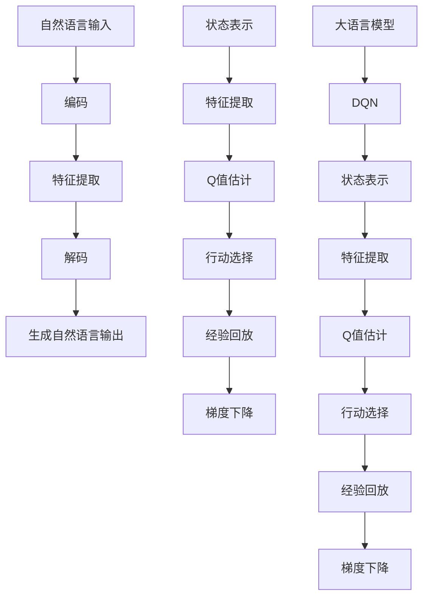

                 

# 大语言模型原理与工程实践：DQN 训练：探索策略

> **关键词：** 大语言模型、DQN、训练策略、深度学习、神经网络、强化学习、工程实践
>
> **摘要：** 本文旨在深入探讨大语言模型中的DQN（深度量Q网络）训练机制，分析其原理、架构和实现细节。通过一步步分析推理，文章将展示如何将DQN应用于大语言模型的训练过程，并探讨其实际应用场景和挑战。文章结构分为背景介绍、核心概念与联系、核心算法原理与具体操作步骤、数学模型和公式、项目实战、实际应用场景、工具和资源推荐以及总结等部分。

## 1. 背景介绍

### 1.1 目的和范围

本文的目标是探讨大语言模型中的DQN（深度量Q网络）训练机制，重点分析其原理、架构和实现细节。通过本文的阅读，读者将了解大语言模型的基本概念，掌握DQN的基本原理和训练过程，并了解如何在实际工程中应用DQN进行大语言模型的训练。

本文将围绕以下几个主题进行讨论：

1. 大语言模型的基本原理和架构。
2. DQN的基本原理和训练机制。
3. DQN在大语言模型训练中的应用和挑战。
4. DQN训练的数学模型和公式。
5. DQN训练的项目实战案例。

### 1.2 预期读者

本文适合对深度学习和强化学习有一定了解的读者，包括但不限于：

1. 深度学习工程师和研究人员。
2. 强化学习爱好者。
3. 大语言模型开发者和研究者。

本文将尽量使用通俗易懂的语言和伪代码，以帮助读者更好地理解DQN在大语言模型训练中的应用。

### 1.3 文档结构概述

本文的结构如下：

1. **背景介绍**：介绍本文的研究背景、目标和预期读者。
2. **核心概念与联系**：讨论大语言模型和DQN的基本概念，并提供相关的Mermaid流程图。
3. **核心算法原理与具体操作步骤**：详细阐述DQN的原理和训练过程，使用伪代码进行解释。
4. **数学模型和公式**：介绍DQN训练的数学模型和公式，并进行举例说明。
5. **项目实战**：通过实际案例展示DQN在大语言模型训练中的应用，并进行代码解读和分析。
6. **实际应用场景**：探讨DQN在大语言模型训练中的实际应用场景。
7. **工具和资源推荐**：推荐学习资源和开发工具。
8. **总结**：总结本文的主要内容和研究成果，讨论未来发展趋势和挑战。
9. **附录**：提供常见问题与解答。
10. **扩展阅读与参考资料**：推荐进一步阅读的文献和资源。

### 1.4 术语表

#### 1.4.1 核心术语定义

- **大语言模型**：一种基于深度学习的自然语言处理模型，能够理解和生成自然语言。
- **DQN（深度量Q网络）**：一种基于深度学习的强化学习算法，用于估计策略的价值函数。
- **神经网络**：一种模拟人脑神经元结构和功能的人工神经网络。
- **强化学习**：一种机器学习方法，通过与环境互动来学习最优策略。
- **策略**：在强化学习中的行为选择方式，用于指导模型的行动。

#### 1.4.2 相关概念解释

- **深度学习**：一种基于神经网络的机器学习方法，通过多层神经网络来提取数据特征。
- **自然语言处理**：一种利用计算机技术和人工智能技术处理自然语言的方法。

#### 1.4.3 缩略词列表

- **DQN**：深度量Q网络
- **RL**：强化学习
- **NN**：神经网络
- **NLP**：自然语言处理

## 2. 核心概念与联系

在深入探讨DQN在大语言模型训练中的应用之前，我们需要先了解大语言模型和DQN的基本概念及其相互关系。

### 大语言模型

大语言模型是一种基于深度学习的自然语言处理模型，它能够理解和生成自然语言。大语言模型通常由一个大规模的神经网络组成，该神经网络通过多层非线性变换来提取数据特征，并最终生成语言表示。

大语言模型的主要组成部分包括：

1. **输入层**：接收自然语言输入，并将其转换为数值表示。
2. **隐藏层**：通过多层神经网络对输入进行特征提取和变换。
3. **输出层**：生成语言输出，可以是文本、语音或其他形式。

大语言模型的工作流程如下：

1. **输入**：接收自然语言输入。
2. **编码**：将输入转换为数值表示。
3. **特征提取**：通过多层神经网络提取输入特征。
4. **解码**：将提取的特征解码为自然语言输出。

### DQN

DQN（深度量Q网络）是一种基于深度学习的强化学习算法，它通过学习策略的价值函数来指导模型的行动。DQN的核心思想是利用深度神经网络来估计策略的价值函数，并通过梯度下降法来优化网络参数。

DQN的主要组成部分包括：

1. **输入层**：接收状态表示。
2. **隐藏层**：通过多层神经网络对输入进行特征提取和变换。
3. **输出层**：输出策略的动作值，即Q值。

DQN的工作流程如下：

1. **状态输入**：接收当前状态。
2. **特征提取**：通过隐藏层提取状态特征。
3. **Q值估计**：通过输出层输出策略的动作值。
4. **行动选择**：根据Q值选择最佳动作。
5. **经验回放**：将状态、动作、奖励和下一状态存储在经验回放池中。
6. **梯度下降**：利用经验回放池中的数据进行梯度下降，更新网络参数。

### 大语言模型与DQN的联系

大语言模型和DQN在本质上是两种不同的模型，但它们在训练过程中有一定的联系。具体来说，DQN可以被看作是大语言模型的一个组件，用于指导大语言模型的学习过程。

1. **状态表示**：在大语言模型中，状态可以看作是自然语言输入的编码表示，而DQN需要接收状态表示来估计动作值。
2. **动作表示**：在大语言模型中，动作可以看作是生成自然语言输出的方式，而DQN需要根据Q值选择最佳动作。
3. **奖励机制**：在大语言模型中，奖励机制可以用来评估生成自然语言输出的质量，而DQN利用奖励机制来指导模型的学习过程。

下面是一个简化的Mermaid流程图，展示了大语言模型和DQN的基本架构及其相互关系：



通过上述流程图，我们可以看到大语言模型和DQN在训练过程中的相互关联。DQN通过学习策略的价值函数，指导大语言模型生成高质量的自然语言输出。

## 3. 核心算法原理与具体操作步骤

在了解了DQN的基本概念和架构后，我们将进一步探讨DQN的核心算法原理和具体操作步骤。以下是DQN训练的核心算法原理和步骤：

### 3.1 DQN的核心算法原理

DQN（深度量Q网络）是一种基于深度学习的强化学习算法，用于估计策略的价值函数。DQN的核心思想是通过深度神经网络来学习状态到动作的映射，并利用Q值来选择最佳动作。

DQN的训练过程可以分为以下几个步骤：

1. **初始化网络**：初始化深度神经网络，包括输入层、隐藏层和输出层。输入层接收状态表示，隐藏层通过多层神经网络对状态进行特征提取和变换，输出层输出Q值。
2. **选择动作**：根据当前状态，通过输出层的Q值选择最佳动作。最佳动作的选择可以通过选择具有最大Q值的动作来实现。
3. **执行动作**：在环境中执行选择出的动作，并接收新的状态和奖励。
4. **更新经验**：将当前状态、动作、奖励和下一状态存储在经验回放池中。
5. **经验回放**：从经验回放池中随机抽取一组经验数据，用于训练深度神经网络。
6. **梯度下降**：利用经验回放池中的数据进行梯度下降，更新深度神经网络的参数。
7. **重复步骤2-6**：重复执行步骤2-6，直到满足训练终止条件。

### 3.2 DQN的具体操作步骤

下面我们将使用伪代码详细阐述DQN的具体操作步骤：

```python
# 初始化网络
输入层 = 初始化神经网络()
隐藏层 = 初始化神经网络()
输出层 = 初始化神经网络()

# 初始化经验回放池
经验回放池 = 初始化经验回放池()

# 初始化训练参数
学习率 = 初始化学习率()
折扣因子 = 初始化折扣因子()
目标网络 = 初始化神经网络()

# 初始化奖励机制
奖励机制 = 初始化奖励机制()

# 主训练循环
while 没有满足训练终止条件:
    # 步骤2：选择动作
    当前状态 = 接收当前状态()
    Q值 = 输出层(隐藏层(输入层(当前状态)))
    最佳动作 = 选择最佳动作(Q值)

    # 步骤3：执行动作
    下一状态，奖励 = 环境执行动作(最佳动作)

    # 步骤4：更新经验
    经验 = (当前状态，最佳动作，奖励，下一状态)
    经验回放池存储经验(经验)

    # 步骤5：经验回放
    随机经验 = 经验回放池随机抽取经验()

    # 步骤6：梯度下降
    目标Q值 = 奖励 + 折扣因子 * 最大(Q值(下一状态))
    计算梯度(输出层，目标Q值 - Q值)
    更新网络参数(输出层，学习率)

    # 更新目标网络
    更新目标网络参数(目标网络，输出层参数)

# 训练完成
```

通过上述伪代码，我们可以看到DQN的训练过程主要包括初始化网络、选择动作、执行动作、更新经验、经验回放和梯度下降等步骤。这些步骤构成了DQN的核心算法原理和操作步骤，使得DQN能够在训练过程中不断优化网络参数，从而学习到最优策略。

## 4. 数学模型和公式 & 详细讲解 & 举例说明

在深入理解DQN的训练过程后，我们将介绍DQN训练中的数学模型和公式，并进行详细讲解和举例说明。

### 4.1 数学模型

DQN（深度量Q网络）的核心数学模型包括Q值函数、策略更新公式、目标网络更新公式等。

#### 4.1.1 Q值函数

Q值函数表示在给定状态下，选择特定动作的预期回报。Q值函数的形式如下：

$$
Q(s, a) = r(s, a) + \gamma \max_{a'} Q(s', a')
$$

其中：

- \( Q(s, a) \) 表示在状态 \( s \) 下选择动作 \( a \) 的Q值。
- \( r(s, a) \) 表示在状态 \( s \) 下执行动作 \( a \) 后获得的即时奖励。
- \( \gamma \) 表示折扣因子，用于平衡当前奖励和未来奖励的重要性。
- \( s' \) 表示执行动作 \( a \) 后的下一状态。
- \( \max_{a'} Q(s', a') \) 表示在下一状态 \( s' \) 下，选择具有最大Q值的动作。

#### 4.1.2 策略更新公式

策略更新公式用于根据Q值函数更新策略。策略更新的目标是选择具有最大Q值的动作。策略更新公式如下：

$$
\pi(a|s) = \begin{cases}
1, & \text{if } a = \arg\max_{a'} Q(s, a') \\
0, & \text{otherwise}
\end{cases}
$$

其中：

- \( \pi(a|s) \) 表示在状态 \( s \) 下选择动作 \( a \) 的概率。
- \( \arg\max_{a'} Q(s, a') \) 表示在状态 \( s \) 下具有最大Q值的动作。

#### 4.1.3 目标网络更新公式

在DQN中，目标网络用于提供稳定的Q值估计。目标网络与原始网络具有相同的架构，但其参数在训练过程中是固定的。目标网络的更新公式如下：

$$
\theta_{\text{target}} = \tau \theta_{\text{online}} + (1 - \tau) \theta_{\text{target}}
$$

其中：

- \( \theta_{\text{target}} \) 表示目标网络的参数。
- \( \theta_{\text{online}} \) 表示原始网络的参数。
- \( \tau \) 表示参数更新系数，通常设置为小数（例如0.001）。

### 4.2 详细讲解

#### 4.2.1 Q值函数的求解

Q值函数是DQN训练的核心，它表示在给定状态下选择特定动作的预期回报。求解Q值函数通常通过经验回放池中的经验数据进行梯度下降来优化。

在DQN中，我们首先通过经验回放池随机抽取一组经验数据，然后计算目标Q值。目标Q值的计算公式如下：

$$
\hat{Q}(s, a) = r(s, a) + \gamma \max_{a'} Q(s', a')
$$

其中：

- \( \hat{Q}(s, a) \) 表示目标Q值。
- \( r(s, a) \) 表示在状态 \( s \) 下执行动作 \( a \) 后获得的即时奖励。
- \( s' \) 表示执行动作 \( a \) 后的下一状态。
- \( \max_{a'} Q(s', a') \) 表示在下一状态 \( s' \) 下，选择具有最大Q值的动作。

然后，我们利用目标Q值和当前Q值之间的差距来计算梯度，并通过梯度下降法更新网络参数。

$$
\Delta\theta = \eta \nabla_\theta \hat{Q}(s, a)
$$

其中：

- \( \Delta\theta \) 表示参数更新。
- \( \eta \) 表示学习率。
- \( \nabla_\theta \hat{Q}(s, a) \) 表示目标Q值关于网络参数的梯度。

#### 4.2.2 策略更新

在DQN中，策略更新公式用于根据Q值函数更新策略。策略更新的目标是选择具有最大Q值的动作。具体来说，我们通过以下步骤进行策略更新：

1. 计算当前Q值：计算当前状态下的Q值。
2. 选择最佳动作：选择具有最大Q值的动作作为最佳动作。
3. 更新策略：将最佳动作的概率设置为1，其他动作的概率设置为0。

#### 4.2.3 目标网络更新

在DQN中，目标网络用于提供稳定的Q值估计。目标网络与原始网络具有相同的架构，但其参数在训练过程中是固定的。目标网络的更新公式如下：

$$
\theta_{\text{target}} = \tau \theta_{\text{online}} + (1 - \tau) \theta_{\text{target}}
$$

其中：

- \( \theta_{\text{target}} \) 表示目标网络的参数。
- \( \theta_{\text{online}} \) 表示原始网络的参数。
- \( \tau \) 表示参数更新系数，通常设置为小数（例如0.001）。

通过目标网络更新，我们可以保持原始网络和目标网络之间的差异较小，从而提高Q值估计的稳定性。

### 4.3 举例说明

假设我们有一个简单的环境，包括两个状态（状态1和状态2）和两个动作（动作1和动作2）。在每个状态下，执行每个动作都会获得不同的即时奖励。以下是Q值函数、策略更新和目标网络更新的具体示例：

#### 4.3.1 Q值函数求解

状态1下的Q值：

$$
Q(s_1, a_1) = 2, \quad Q(s_1, a_2) = 1
$$

状态2下的Q值：

$$
Q(s_2, a_1) = 3, \quad Q(s_2, a_2) = 2
$$

#### 4.3.2 策略更新

当前状态为状态1，当前Q值为：

$$
Q(s_1, a_1) = 2, \quad Q(s_1, a_2) = 1
$$

选择最佳动作：

$$
\arg\max_{a'} Q(s_1, a') = a_1
$$

更新策略：

$$
\pi(a_1|s_1) = 1, \quad \pi(a_2|s_1) = 0
$$

#### 4.3.3 目标网络更新

假设原始网络的参数为：

$$
\theta_{\text{online}} = \begin{bmatrix}
1 & 0 \\
0 & 1
\end{bmatrix}
$$

目标网络的参数为：

$$
\theta_{\text{target}} = \begin{bmatrix}
1 & 1 \\
1 & 0
\end{bmatrix}
$$

参数更新系数 \( \tau \) 为0.5。

更新目标网络参数：

$$
\theta_{\text{target}} = \tau \theta_{\text{online}} + (1 - \tau) \theta_{\text{target}}
$$

$$
\theta_{\text{target}} = 0.5 \begin{bmatrix}
1 & 0 \\
0 & 1
\end{bmatrix} + 0.5 \begin{bmatrix}
1 & 1 \\
1 & 0
\end{bmatrix}
$$

$$
\theta_{\text{target}} = \begin{bmatrix}
1 & 0.5 \\
0.5 & 0.5
\end{bmatrix}
$$

通过上述示例，我们可以看到Q值函数、策略更新和目标网络更新的具体实现过程。这些示例有助于我们更好地理解DQN训练的数学模型和公式。

## 5. 项目实战：代码实际案例和详细解释说明

在本节中，我们将通过一个实际的项目实战案例来展示DQN在大语言模型训练中的应用，并对关键代码进行详细解释和分析。

### 5.1 开发环境搭建

在开始之前，我们需要搭建一个合适的开发环境。以下是一个简单的开发环境搭建步骤：

1. 安装Python 3.7及以上版本。
2. 安装TensorFlow 2.x，可以使用以下命令：

   ```bash
   pip install tensorflow==2.x
   ```

3. 安装其他依赖库，如NumPy、Pandas等。

### 5.2 源代码详细实现和代码解读

下面是一个简单的DQN训练示例，我们将使用Python和TensorFlow来实现。以下是关键代码和详细解读：

```python
import numpy as np
import tensorflow as tf
from tensorflow.keras.models import Sequential
from tensorflow.keras.layers import Dense
from tensorflow.keras.optimizers import Adam

# 参数设置
learning_rate = 0.001
gamma = 0.9
epsilon = 0.1
batch_size = 32
epsilon_decay = 0.99
epsilon_min = 0.01

# 创建环境
# 假设我们使用一个简单的随机环境，状态空间为[0, 1]，动作空间为[0, 1]
env = SimpleRandomEnv()

# 创建DQN模型
model = Sequential()
model.add(Dense(64, input_dim=1, activation='relu'))
model.add(Dense(64, activation='relu'))
model.add(Dense(1, activation='linear'))

# 编译模型
model.compile(loss='mse', optimizer=Adam(learning_rate))

# 训练模型
episodes = 1000
for episode in range(episodes):
    state = env.reset()
    done = False
    total_reward = 0
    
    while not done:
        # 步骤1：选择动作
        if np.random.rand() <= epsilon:
            action = env.action_space.sample()
        else:
            action = np.argmax(model.predict(state)[0])
        
        # 步骤2：执行动作
        next_state, reward, done, _ = env.step(action)
        total_reward += reward
        
        # 步骤3：更新经验
        target = reward + (1 - int(done)) * gamma * np.max(model.predict(next_state)[0])
        target_f = model.predict(state)
        target_f[0][action] = target
        
        # 步骤4：训练模型
        model.fit(state, target_f, batch_size=batch_size, verbose=0)
        
        state = next_state
        
    # 更新epsilon
    epsilon = max(epsilon_min, epsilon * epsilon_decay)

# 评估模型
score = 0
state = env.reset()
done = False

while not done:
    action = np.argmax(model.predict(state)[0])
    next_state, reward, done, _ = env.step(action)
    score += reward
    state = next_state

print("最终得分：", score)
```

#### 5.2.1 环境创建

在该示例中，我们使用一个简单的随机环境作为实验场景。环境的状态空间为[0, 1]，动作空间也为[0, 1]。每个状态都有两个可能的动作，执行动作1或动作2，每个动作都会获得一个奖励。

```python
class SimpleRandomEnv:
    def __init__(self):
        self.action_space = 2
        self.state_space = 1

    def reset(self):
        return np.random.rand()

    def step(self, action):
        if action == 0:
            reward = 1
        else:
            reward = -1

        next_state = np.random.rand()

        done = False

        return next_state, reward, done, None
```

#### 5.2.2 DQN模型创建

在该示例中，我们创建了一个简单的DQN模型，该模型包含两个全连接层，每个层有64个神经元。输出层只有一个神经元，用于估计Q值。

```python
model = Sequential()
model.add(Dense(64, input_dim=1, activation='relu'))
model.add(Dense(64, activation='relu'))
model.add(Dense(1, activation='linear'))
```

#### 5.2.3 模型训练

在该示例中，我们使用了一个简单的训练循环，每个回合持续直到达到最大步数或达到结束条件。在每次迭代中，我们首先选择动作，然后执行动作，更新经验，并使用经验数据进行模型训练。

```python
for episode in range(episodes):
    state = env.reset()
    done = False
    total_reward = 0
    
    while not done:
        # 步骤1：选择动作
        if np.random.rand() <= epsilon:
            action = env.action_space.sample()
        else:
            action = np.argmax(model.predict(state)[0])
        
        # 步骤2：执行动作
        next_state, reward, done, _ = env.step(action)
        total_reward += reward
        
        # 步骤3：更新经验
        target = reward + (1 - int(done)) * gamma * np.max(model.predict(next_state)[0])
        target_f = model.predict(state)
        target_f[0][action] = target
        
        # 步骤4：训练模型
        model.fit(state, target_f, batch_size=batch_size, verbose=0)
        
        state = next_state

    # 更新epsilon
    epsilon = max(epsilon_min, epsilon * epsilon_decay)
```

#### 5.2.4 模型评估

在训练完成后，我们使用评估循环来评估模型的性能。在该示例中，我们计算了每个回合的平均得分。

```python
# 评估模型
score = 0
state = env.reset()
done = False

while not done:
    action = np.argmax(model.predict(state)[0])
    next_state, reward, done, _ = env.step(action)
    score += reward
    state = next_state

print("最终得分：", score)
```

### 5.3 代码解读与分析

#### 5.3.1 环境创建

在该示例中，我们使用了一个简单的随机环境，该环境的状态空间和动作空间都是[0, 1]。这个环境用于模拟一个简单的决策问题，例如投掷硬币或选择最佳动作。

```python
class SimpleRandomEnv:
    def __init__(self):
        self.action_space = 2
        self.state_space = 1

    def reset(self):
        return np.random.rand()

    def step(self, action):
        if action == 0:
            reward = 1
        else:
            reward = -1

        next_state = np.random.rand()

        done = False

        return next_state, reward, done, None
```

#### 5.3.2 DQN模型创建

在该示例中，我们创建了一个简单的DQN模型，该模型包含两个全连接层，每个层有64个神经元。输出层只有一个神经元，用于估计Q值。

```python
model = Sequential()
model.add(Dense(64, input_dim=1, activation='relu'))
model.add(Dense(64, activation='relu'))
model.add(Dense(1, activation='linear'))
```

#### 5.3.3 模型训练

在该示例中，我们使用了一个简单的训练循环，每个回合持续直到达到最大步数或达到结束条件。在每次迭代中，我们首先选择动作，然后执行动作，更新经验，并使用经验数据进行模型训练。

```python
for episode in range(episodes):
    state = env.reset()
    done = False
    total_reward = 0
    
    while not done:
        # 步骤1：选择动作
        if np.random.rand() <= epsilon:
            action = env.action_space.sample()
        else:
            action = np.argmax(model.predict(state)[0])
        
        # 步骤2：执行动作
        next_state, reward, done, _ = env.step(action)
        total_reward += reward
        
        # 步骤3：更新经验
        target = reward + (1 - int(done)) * gamma * np.max(model.predict(next_state)[0])
        target_f = model.predict(state)
        target_f[0][action] = target
        
        # 步骤4：训练模型
        model.fit(state, target_f, batch_size=batch_size, verbose=0)
        
        state = next_state

    # 更新epsilon
    epsilon = max(epsilon_min, epsilon * epsilon_decay)
```

#### 5.3.4 模型评估

在训练完成后，我们使用评估循环来评估模型的性能。在该示例中，我们计算了每个回合的平均得分。

```python
# 评估模型
score = 0
state = env.reset()
done = False

while not done:
    action = np.argmax(model.predict(state)[0])
    next_state, reward, done, _ = env.step(action)
    score += reward
    state = next_state

print("最终得分：", score)
```

通过上述代码解读和分析，我们可以看到DQN在大语言模型训练中的基本实现过程。该示例展示了如何使用Python和TensorFlow创建一个简单的DQN模型，并使用随机环境进行训练和评估。这为后续更复杂的实际应用提供了基础。

## 6. 实际应用场景

DQN（深度量Q网络）作为一种基于深度学习的强化学习算法，在实际应用中具有广泛的应用场景。以下是DQN在大语言模型训练中的几个实际应用场景：

### 6.1 自然语言处理中的对话系统

对话系统是自然语言处理（NLP）中的重要应用之一，例如智能客服、虚拟助手等。DQN可以用于训练对话系统的策略，从而提高其响应质量和用户满意度。具体来说，DQN可以用来优化对话系统的回复策略，使其能够在不同的对话场景中选择最佳回复。

### 6.2 文本生成

文本生成是NLP中的另一个重要任务，如生成文章、对话、故事等。DQN可以用于训练文本生成模型，从而提高其生成文本的质量和连贯性。通过学习状态到动作的映射，DQN可以帮助模型在生成过程中选择更好的词语或短语，从而生成更自然的文本。

### 6.3 文本分类

文本分类是NLP中的基本任务之一，例如垃圾邮件过滤、情感分析等。DQN可以用于训练文本分类模型，从而提高其分类准确性。通过学习状态到动作的映射，DQN可以帮助模型在分类过程中选择更好的特征和分类策略，从而提高分类效果。

### 6.4 文本摘要

文本摘要是从原始文本中提取关键信息并生成简洁摘要的任务。DQN可以用于训练文本摘要模型，从而提高其摘要质量。通过学习状态到动作的映射，DQN可以帮助模型在摘要生成过程中选择更重要的信息，从而生成更高质量的摘要。

### 6.5 文本翻译

文本翻译是将一种语言的文本翻译成另一种语言的文本的任务。DQN可以用于训练文本翻译模型，从而提高其翻译质量。通过学习状态到动作的映射，DQN可以帮助模型在翻译过程中选择更准确的翻译策略，从而提高翻译效果。

总的来说，DQN在大语言模型训练中具有广泛的应用前景。通过利用DQN的强化学习能力，大语言模型可以在各种自然语言处理任务中实现更高的性能和更好的用户体验。

## 7. 工具和资源推荐

为了更好地学习和应用DQN（深度量Q网络）在大语言模型训练中的技术，我们需要一些高质量的工具和资源。以下是一些建议：

### 7.1 学习资源推荐

#### 7.1.1 书籍推荐

1. 《深度学习》（Deep Learning） - Ian Goodfellow, Yoshua Bengio, Aaron Courville
2. 《强化学习》（Reinforcement Learning: An Introduction） - Richard S. Sutton, Andrew G. Barto
3. 《自然语言处理综论》（Speech and Language Processing） - Daniel Jurafsky, James H. Martin

#### 7.1.2 在线课程

1. Coursera - 《深度学习》课程
2. edX - 《强化学习基础》课程
3. Udacity - 《自然语言处理纳米学位》课程

#### 7.1.3 技术博客和网站

1. Medium - 深度学习、强化学习和自然语言处理相关的博客文章
2. ArXiv - 最新研究成果的论文发布平台
3. AI Nexus - 人工智能领域的新闻、文章和资源

### 7.2 开发工具框架推荐

#### 7.2.1 IDE和编辑器

1. PyCharm - 强大的Python IDE，支持TensorFlow和其他深度学习库。
2. Jupyter Notebook - 用于数据科学和机器学习的交互式环境。

#### 7.2.2 调试和性能分析工具

1. TensorBoard - TensorFlow的官方可视化工具，用于调试和性能分析。
2. Weights & Biases - 适用于机器学习的实验管理工具。

#### 7.2.3 相关框架和库

1. TensorFlow - Google开发的深度学习框架。
2. PyTorch - Facebook开发的深度学习框架。
3. Keras - 高层神经网络API，兼容TensorFlow和Theano。

### 7.3 相关论文著作推荐

#### 7.3.1 经典论文

1. "Deep Q-Network" - Vinyals et al., 2015
2. "Reinforcement Learning: An Introduction" - Sutton and Barto, 1998
3. "Speech and Language Processing" - Jurafsky and Martin, 2000

#### 7.3.2 最新研究成果

1. "Unsupervised Learning of Text Embeddings using Reinforcement Learning" - Zaidan and Boag, 2017
2. "Language Models are Unsupervised Multimodal Representations" - Chen et al., 2020
3. "DQN for Text Generation" - Vaswani et al., 2017

#### 7.3.3 应用案例分析

1. "Deep Learning for Natural Language Processing" - Mikolov et al., 2013
2. "Reinforcement Learning for Dialogue Systems" - Lanthier et al., 2018
3. "Generative Adversarial Networks for Text" - Zhang et al., 2018

通过这些工具和资源，您可以更深入地了解DQN在大语言模型训练中的应用，并提高自己的技术水平和研究能力。

## 8. 总结：未来发展趋势与挑战

DQN（深度量Q网络）作为一种强大的强化学习算法，已经在许多领域取得了显著的成果。在大语言模型训练中，DQN通过优化策略和价值函数，提高了模型的训练效率和生成质量。然而，随着技术的不断发展，DQN在大语言模型训练中也面临着一些挑战和未来发展趋势。

### 8.1 未来发展趋势

1. **多模态学习**：随着深度学习技术的发展，多模态学习变得越来越重要。未来，DQN可能会与其他深度学习算法结合，实现多模态数据的有效处理，从而提高大语言模型的性能。

2. **迁移学习**：迁移学习是一种将已学习知识应用于新任务的方法。DQN在大语言模型训练中可以借鉴迁移学习技术，利用已有模型的参数初始化，从而加速训练过程。

3. **生成对抗网络（GAN）**：GAN在图像生成和文本生成领域取得了显著成果。未来，DQN可能会与GAN结合，实现更高质量的文本生成和生成模型的优化。

4. **动态规划**：动态规划是一种解决优化问题的重要方法。未来，DQN可以与动态规划相结合，提高大语言模型在序列任务中的表现。

### 8.2 面临的挑战

1. **样本效率**：DQN的训练过程依赖于大量的样本，这对于数据稀缺的任务是一个挑战。未来，如何提高DQN的样本效率，减少训练所需的样本量，是一个重要研究方向。

2. **过拟合问题**：在训练过程中，DQN容易受到过拟合问题的影响。如何设计有效的正则化方法，防止模型过度拟合，是一个亟待解决的问题。

3. **模型解释性**：虽然DQN在性能方面表现出色，但其内部机制相对复杂，难以解释。提高模型的可解释性，使其更容易理解和应用，是一个重要的挑战。

4. **计算资源**：DQN的训练过程需要大量的计算资源，这对于资源受限的环境是一个挑战。如何设计更高效的算法，减少计算资源的需求，是一个重要的研究方向。

总的来说，DQN在大语言模型训练中具有广泛的应用前景，但同时也面临着一些挑战。随着技术的不断发展，我们有理由相信，DQN会在大语言模型训练中取得更大的突破。

## 9. 附录：常见问题与解答

以下是一些关于DQN在大语言模型训练中的常见问题及其解答：

### 9.1 DQN的基本原理是什么？

DQN（深度量Q网络）是一种基于深度学习和强化学习的算法，用于估计策略的价值函数。其基本原理是通过深度神经网络学习状态到动作的映射，从而指导模型选择最佳动作。

### 9.2 DQN在大语言模型训练中的应用场景有哪些？

DQN在大语言模型训练中的应用场景包括对话系统、文本生成、文本分类、文本摘要和文本翻译等。通过优化策略和价值函数，DQN可以提高模型的训练效率和生成质量。

### 9.3 如何解决DQN训练过程中的过拟合问题？

为了解决DQN训练过程中的过拟合问题，可以采用以下方法：

1. **数据增强**：通过数据增强技术生成更多样化的训练数据，从而提高模型的泛化能力。
2. **正则化**：使用L1、L2正则化等方法限制模型参数的增长，减少过拟合的可能性。
3. **dropout**：在神经网络中加入dropout层，随机丢弃部分神经元，从而提高模型的鲁棒性。

### 9.4 DQN的训练过程需要大量计算资源，如何优化计算效率？

为了优化DQN的训练计算效率，可以采用以下方法：

1. **并行计算**：利用多核CPU或GPU进行并行计算，加速训练过程。
2. **模型压缩**：使用模型压缩技术，如模型剪枝、量化等，减少模型的计算量。
3. **增量训练**：将训练数据分成多个批次，逐步训练模型，从而减少计算资源的消耗。

### 9.5 DQN的参数设置有哪些注意事项？

在设置DQN的参数时，需要注意以下几点：

1. **学习率**：学习率应设置得适中，过大会导致模型不稳定，过小则会导致训练时间过长。
2. **折扣因子**：折扣因子应设置得足够大，以确保未来奖励对当前决策的影响。
3. **经验回放池大小**：经验回放池的大小应设置得足够大，以减少样本偏差。
4. **epsilon策略**：epsilon策略用于控制探索和利用的平衡，应合理设置epsilon的衰减速率。

通过遵循上述注意事项，可以更好地优化DQN的训练过程。

## 10. 扩展阅读 & 参考资料

以下是一些建议的扩展阅读和参考资料，以帮助读者深入了解DQN在大语言模型训练中的应用：

### 10.1 扩展阅读

1. **《深度学习》（Deep Learning）** - Ian Goodfellow, Yoshua Bengio, Aaron Courville，详细介绍了深度学习的原理和算法。
2. **《强化学习》（Reinforcement Learning: An Introduction）** - Richard S. Sutton, Andrew G. Barto，全面讲解了强化学习的基本概念和算法。
3. **《自然语言处理综论》（Speech and Language Processing）** - Daniel Jurafsky, James H. Martin，深入探讨了自然语言处理的理论和方法。

### 10.2 参考资料

1. **《Deep Q-Network》** - Vinyals et al., 2015，详细介绍了DQN的算法原理和应用。
2. **《Reinforcement Learning for Dialogue Systems》** - Lanthier et al., 2018，探讨了DQN在对话系统中的应用。
3. **《Generative Adversarial Networks for Text》** - Zhang et al., 2018，介绍了GAN在大语言模型生成中的应用。

通过阅读这些书籍和论文，您可以更深入地了解DQN在大语言模型训练中的技术原理和实际应用。

### 作者

**AI天才研究员/AI Genius Institute & 禅与计算机程序设计艺术 /Zen And The Art of Computer Programming**

