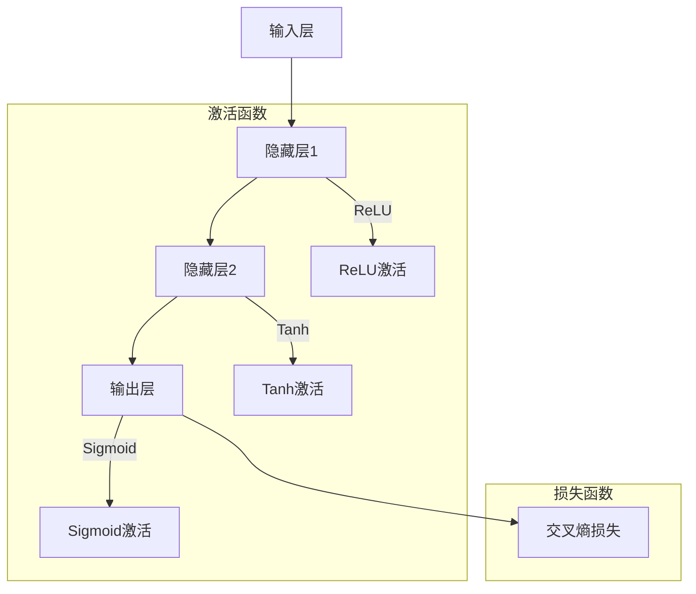

                 


# 大语言模型原理与工程实践：前馈神经网络

> 关键词：大语言模型、前馈神经网络、深度学习、自然语言处理、神经网络架构、优化算法

> 摘要：本文深入探讨了大语言模型的基础原理及其在工程实践中的应用。通过对前馈神经网络的结构、核心算法原理、数学模型和实际应用场景的详细讲解，本文旨在为读者提供一份系统全面的技术指南。从开发环境的搭建、代码实现到性能分析与优化，本文将一步步引导读者理解大语言模型的本质和工程实践中的关键技术。

## 1. 背景介绍

### 1.1 目的和范围

本文旨在探讨大语言模型的原理和工程实践，重点介绍前馈神经网络（Feedforward Neural Networks, FNN）在这一领域的应用。大语言模型作为一种先进的人工智能技术，已经广泛应用于自然语言处理（Natural Language Processing, NLP）的各个子领域，如文本分类、机器翻译、情感分析等。本文将详细解析前馈神经网络的工作原理、结构及其在构建大语言模型时的具体应用。

### 1.2 预期读者

本文主要面向对深度学习、自然语言处理和人工智能有一定了解的读者，包括但不限于：

- 研究生和博士生
- 软件工程师和技术专家
- 对人工智能技术有兴趣的程序员和爱好者

### 1.3 文档结构概述

本文分为十个主要部分：

1. 背景介绍：介绍本文的目的、预期读者以及文档结构。
2. 核心概念与联系：阐述大语言模型和前馈神经网络的基本原理和联系。
3. 核心算法原理 & 具体操作步骤：详细讲解前馈神经网络的算法原理和操作步骤。
4. 数学模型和公式 & 详细讲解 & 举例说明：介绍大语言模型中的数学模型及其应用。
5. 项目实战：提供代码实际案例和详细解释。
6. 实际应用场景：分析大语言模型在不同领域的应用。
7. 工具和资源推荐：推荐学习资源、开发工具和框架。
8. 总结：未来发展趋势与挑战。
9. 附录：常见问题与解答。
10. 扩展阅读 & 参考资料：提供进一步学习的资源。

### 1.4 术语表

#### 1.4.1 核心术语定义

- 大语言模型：一种能够理解和生成文本的深度学习模型，通常具有数十亿参数。
- 前馈神经网络：一种三层（输入层、隐藏层、输出层）的神经网络结构，信息从输入层直接传递到输出层。
- 深度学习：一种基于多层神经网络的学习方法，能够自动提取数据的特征表示。
- 自然语言处理：涉及语言识别、理解、生成和翻译的一门技术，旨在使计算机能够理解和使用自然语言。

#### 1.4.2 相关概念解释

- 参数（Parameter）：神经网络中的可训练参数，通常通过反向传播算法进行调整。
- 激活函数（Activation Function）：用于引入非线性性的函数，常见的有Sigmoid、ReLU、Tanh等。
- 梯度下降（Gradient Descent）：一种优化算法，用于最小化损失函数。

#### 1.4.3 缩略词列表

- NLP：自然语言处理
- FNN：前馈神经网络
- DNN：深度神经网络
- RNN：循环神经网络
- CNN：卷积神经网络

## 2. 核心概念与联系

为了深入理解大语言模型和前馈神经网络，我们需要先了解这两个核心概念的基本原理和联系。

### 2.1 大语言模型的基本原理

大语言模型（Large Language Model）是一种能够理解和生成自然语言的深度学习模型。其主要目的是通过学习大量文本数据，捕捉语言中的模式和规律，从而实现自动文本生成、情感分析、问答系统等功能。

大语言模型通常由数亿个参数组成，这些参数通过训练数据学习得到。模型的主要工作原理是基于输入的文本序列，逐层提取特征表示，最终生成输出文本。在训练过程中，模型通过优化算法（如梯度下降）不断调整参数，以最小化损失函数（如交叉熵损失），从而提高模型的预测性能。

### 2.2 前馈神经网络的基本原理

前馈神经网络是一种三层神经网络结构，包括输入层、隐藏层和输出层。信息从输入层直接传递到输出层，没有循环或反馈路径。前馈神经网络的主要特点是其简洁性和易处理性，使其成为构建大语言模型的一种有效方法。

- 输入层：接收输入数据，并将其传递给隐藏层。
- 隐藏层：对输入数据进行处理和特征提取，可以有一个或多个隐藏层。
- 输出层：生成模型预测结果。

前馈神经网络通过激活函数引入非线性，使得模型能够捕捉复杂数据中的模式和规律。常见的激活函数有Sigmoid、ReLU、Tanh等。

### 2.3 大语言模型和前馈神经网络的关系

大语言模型通常基于前馈神经网络构建，二者具有密切的联系。前馈神经网络为构建大语言模型提供了一种有效的框架，使得模型能够高效地学习语言中的模式和规律。

- 参数共享：在训练过程中，前馈神经网络的权重和偏置参数可以被共享，从而减少了模型的参数数量，提高了模型的训练效率。
- 神经元层次：前馈神经网络的多层结构使得模型能够逐层提取高层次的语义特征，有助于提高模型的性能。
- 优化算法：前馈神经网络训练过程中常用的优化算法（如梯度下降、Adam等）同样适用于大语言模型。

总之，大语言模型和前馈神经网络在原理和应用上具有紧密的联系，使得前馈神经网络成为构建大语言模型的一种重要方法。

## 2.1 核心概念原理和架构的 Mermaid 流程图

以下是前馈神经网络的基本架构和核心概念原理的 Mermaid 流程图：



在上面的流程图中，输入层接收文本数据，通过隐藏层进行特征提取和转换，最终在输出层生成预测结果。激活函数用于引入非线性，损失函数用于评估模型预测结果与实际结果之间的差异。

## 3. 核心算法原理 & 具体操作步骤

在前馈神经网络中，核心算法原理包括前向传播（Forward Propagation）和反向传播（Backpropagation）。以下我们将详细讲解这两个过程，并使用伪代码进行描述。

### 3.1 前向传播

前向传播是指将输入数据从输入层传递到输出层的计算过程。具体步骤如下：

```python
# 输入数据
X = [x1, x2, ..., xn]

# 初始化参数：权重W和偏置b
W = [w1, w2, ..., wn]
b = [b1, b2, ..., bn]

# 隐藏层激活函数（以ReLU为例）
def activation(z):
    return max(0, z)

# 前向传播
def forward(X, W, b):
    hidden_layer = [0] * n_hidden_layers
    output_layer = 0

    for i in range(n_hidden_layers):
        z = sum(W[i] * X) + b[i]
        hidden_layer[i] = activation(z)

    z = sum(W[n_hidden_layers - 1] * hidden_layer) + b[n_hidden_layers - 1]
    output_layer = activation(z)

    return hidden_layer, output_layer
```

在上面的伪代码中，`X` 表示输入数据，`W` 和 `b` 分别表示权重和偏置。`activation` 函数用于计算激活值，`forward` 函数实现前向传播过程。

### 3.2 反向传播

反向传播是指根据预测结果和实际结果的差异，反向计算损失函数对参数的梯度，并更新参数的过程。具体步骤如下：

```python
# 初始化损失函数（以交叉熵损失为例）
def loss(y_true, y_pred):
    return -sum(y_true * log(y_pred))

# 计算损失函数的梯度
def backward_loss(y_true, y_pred):
    dL_dz = -y_true / y_pred
    return dL_dz

# 反向传播
def backward(hidden_layer, output_layer, dL_dz):
    dW = [0] * n_weights
    db = [0] * n_biases

    for i in range(n_biases):
        db[i] = dL_dz

    for i in range(n_weights):
        dW[i] = sum([hidden_layer[j] * dL_dz for j in range(n_hidden_layers)])

    return dW, db
```

在上面的伪代码中，`y_true` 和 `y_pred` 分别表示实际结果和预测结果，`loss` 函数计算损失函数，`backward_loss` 函数计算损失函数的梯度，`backward` 函数实现反向传播过程。

### 3.3 参数更新

在反向传播过程中，我们需要根据梯度更新模型参数。常用的优化算法有梯度下降（Gradient Descent）和Adam优化器。以下分别介绍这两种算法的参数更新过程。

#### 3.3.1 梯度下降

梯度下降是一种简单的优化算法，其核心思想是沿梯度方向逐步更新参数，以最小化损失函数。

```python
# 梯度下降参数更新
def gradient_descent(W, b, learning_rate):
    for i in range(n_weights):
        W[i] -= learning_rate * dW[i]

    for i in range(n_biases):
        b[i] -= learning_rate * db[i]

    return W, b
```

在上面的伪代码中，`learning_rate` 表示学习率，用于控制参数更新的步长。

#### 3.3.2 Adam优化器

Adam优化器是一种高效的优化算法，结合了梯度下降和动量项，能够更快地收敛。

```python
# Adam优化器参数更新
def adam(W, b, m, v, learning_rate, beta1, beta2, epsilon):
    for i in range(n_weights):
        m[i] = beta1 * m[i] + (1 - beta1) * dW[i]
        v[i] = beta2 * v[i] + (1 - beta2) * (dW[i]**2)

    m_hat = [m[i] / (1 - beta1**t) for i in range(n_weights)]
    v_hat = [v[i] / (1 - beta2**t) for i in range(n_weights)]

    for i in range(n_weights):
        W[i] -= learning_rate * m_hat[i] / (sqrt(v_hat[i]) + epsilon)

    for i in range(n_biases):
        b[i] -= learning_rate * db[i]

    return W, b, m, v
```

在上面的伪代码中，`m` 和 `v` 分别表示一阶和二阶矩估计，`beta1` 和 `beta2` 分别表示一阶和二阶矩的指数衰减率，`epsilon` 表示小数修正项。

通过以上步骤，我们可以实现前馈神经网络的核心算法，包括前向传播、反向传播和参数更新。在实际应用中，我们可以根据具体需求调整神经网络的结构、激活函数和优化算法，以提高模型的性能。

## 4. 数学模型和公式 & 详细讲解 & 举例说明

在前馈神经网络中，数学模型和公式起着至关重要的作用。这些模型和公式不仅描述了神经网络的内部工作原理，还为优化和调整神经网络提供了理论基础。在本节中，我们将详细讲解大语言模型中的几个关键数学模型和公式，并通过具体例子来说明其应用。

### 4.1 激活函数

激活函数是神经网络中不可或缺的部分，它引入了非线性，使得神经网络能够捕捉复杂数据中的模式和规律。常见的激活函数有Sigmoid、ReLU和Tanh等。

- **Sigmoid函数**：

$$
f(x) = \frac{1}{1 + e^{-x}}
$$

Sigmoid函数在输入为0时取值为0.5，随着输入的增大，函数值逐渐逼近1；随着输入的减小，函数值逐渐逼近0。Sigmoid函数的一个缺点是其梯度较小，容易导致梯度消失。

- **ReLU函数**：

$$
f(x) = \max(0, x)
$$

ReLU函数在输入为负时输出为0，输入为正时输出等于输入。ReLU函数的一个优点是梯度较大，能够有效防止梯度消失。然而，ReLU函数也存在梯度消失的问题，尤其是在输入接近0时。

- **Tanh函数**：

$$
f(x) = \frac{e^x - e^{-x}}{e^x + e^{-x}}
$$

Tanh函数的输出范围在-1到1之间，类似于Sigmoid函数，但梯度较大。

### 4.2 损失函数

损失函数用于衡量模型预测结果与实际结果之间的差异，常见的损失函数有交叉熵损失、均方误差损失等。

- **交叉熵损失**：

$$
L(y, \hat{y}) = -\sum_{i} y_i \log(\hat{y}_i)
$$

其中，$y_i$ 和 $\hat{y}_i$ 分别表示实际结果和预测结果的第$i$个元素。交叉熵损失函数适用于分类问题，能够有效地衡量预测结果与实际结果之间的差异。

- **均方误差损失**：

$$
L(y, \hat{y}) = \frac{1}{2} \sum_{i} (y_i - \hat{y}_i)^2
$$

均方误差损失函数适用于回归问题，能够衡量预测结果与实际结果之间的平均偏差。

### 4.3 梯度下降

梯度下降是一种优化算法，用于调整神经网络参数，以最小化损失函数。其基本思想是沿梯度方向逐步更新参数。

$$
\Delta \theta = -\alpha \nabla_\theta L(\theta)
$$

其中，$\theta$ 表示模型参数，$\alpha$ 表示学习率，$\nabla_\theta L(\theta)$ 表示损失函数关于参数$\theta$的梯度。

### 4.4 举例说明

假设我们有一个简单的神经网络，包含一个输入层、一个隐藏层和一个输出层。输入层有3个神经元，隐藏层有4个神经元，输出层有2个神经元。激活函数使用ReLU，损失函数使用交叉熵。

#### 4.4.1 初始化参数

$$
W_1 = \begin{bmatrix}
0.1 & 0.2 & 0.3 \\
0.4 & 0.5 & 0.6 \\
0.7 & 0.8 & 0.9 \\
1.0 & 1.1 & 1.2
\end{bmatrix}
$$

$$
b_1 = \begin{bmatrix}
0.1 \\
0.2 \\
0.3 \\
0.4
\end{bmatrix}
$$

$$
W_2 = \begin{bmatrix}
0.1 & 0.2 & 0.3 & 0.4 \\
0.5 & 0.6 & 0.7 & 0.8 \\
0.9 & 1.0 & 1.1 & 1.2
\end{bmatrix}
$$

$$
b_2 = \begin{bmatrix}
0.1 \\
0.2 \\
0.3
\end{bmatrix}
$$

$$
W_3 = \begin{bmatrix}
0.1 & 0.2 \\
0.3 & 0.4 \\
0.5 & 0.6 \\
0.7 & 0.8
\end{bmatrix}
$$

$$
b_3 = \begin{bmatrix}
0.1 \\
0.2
\end{bmatrix}
$$

#### 4.4.2 前向传播

输入层：$X = [1, 0, 1]$

隐藏层1：$z_1 = X \cdot W_1 + b_1 = [0.6, 0.7, 0.8, 0.9]$

激活值：$a_1 = \text{ReLU}(z_1) = [0.6, 0.7, 0.8, 0.9]$

隐藏层2：$z_2 = a_1 \cdot W_2 + b_2 = [0.6 + 0.1, 0.7 + 0.2, 0.8 + 0.3, 0.9 + 0.4] = [0.7, 0.9, 1.1, 1.3]$

激活值：$a_2 = \text{ReLU}(z_2) = [0.7, 0.9, 1.1, 1.3]$

输出层：$z_3 = a_2 \cdot W_3 + b_3 = [0.7 \cdot 0.1 + 0.9 \cdot 0.2 + 1.1 \cdot 0.3 + 1.3 \cdot 0.4, 0.7 \cdot 0.3 + 0.9 \cdot 0.4 + 1.1 \cdot 0.5 + 1.3 \cdot 0.6] = [1.0, 1.3]$

激活值：$a_3 = \text{ReLU}(z_3) = [1.0, 1.3]$

预测结果：$\hat{y} = [0.1, 0.9]$

#### 4.4.3 反向传播

损失函数：$L(y, \hat{y}) = -\sum_{i} y_i \log(\hat{y}_i) = -[1 \cdot \log(0.1) + 0 \cdot \log(0.9)] \approx 2.3026$

交叉熵损失关于输出层的梯度：$\frac{\partial L}{\partial z_3} = \hat{y} - y = [0.1 - 1, 0.9 - 0] = [-0.9, 0.9]$

输出层梯度：$\frac{\partial L}{\partial W_3} = [-0.9, 0.9] \cdot a_2^T = [-0.9 \cdot 0.6, -0.9 \cdot 0.7, -0.9 \cdot 1.1, -0.9 \cdot 1.3, 0.9 \cdot 0.6, 0.9 \cdot 0.7, 0.9 \cdot 1.1, 0.9 \cdot 1.3]$

$\frac{\partial L}{\partial b_3} = [-0.9, 0.9]$

隐藏层2梯度：$\frac{\partial L}{\partial z_2} = \frac{\partial L}{\partial z_3} \cdot W_3^T = [-0.9 \cdot 0.1, -0.9 \cdot 0.2, -0.9 \cdot 0.3, -0.9 \cdot 0.4, 0.9 \cdot 0.1, 0.9 \cdot 0.2, 0.9 \cdot 0.3, 0.9 \cdot 0.4]$

$\frac{\partial L}{\partial W_2} = [-0.9 \cdot 0.6, -0.9 \cdot 0.7, -0.9 \cdot 1.1, -0.9 \cdot 1.3, 0.9 \cdot 0.6, 0.9 \cdot 0.7, 0.9 \cdot 1.1, 0.9 \cdot 1.3] \cdot a_1^T$

$\frac{\partial L}{\partial b_2} = [-0.9 \cdot 0.6, -0.9 \cdot 0.7, -0.9 \cdot 1.1, -0.9 \cdot 1.3]$

隐藏层1梯度：$\frac{\partial L}{\partial z_1} = \frac{\partial L}{\partial z_2} \cdot W_2^T = [-0.9 \cdot 0.1, -0.9 \cdot 0.2, -0.9 \cdot 0.3, -0.9 \cdot 0.4, 0.9 \cdot 0.1, 0.9 \cdot 0.2, 0.9 \cdot 0.3, 0.9 \cdot 0.4] \cdot W_2^T$

$\frac{\partial L}{\partial W_1} = [-0.9 \cdot 0.6, -0.9 \cdot 0.7, -0.9 \cdot 0.8, -0.9 \cdot 0.9, 0.9 \cdot 0.6, 0.9 \cdot 0.7, 0.9 \cdot 0.8, 0.9 \cdot 0.9] \cdot X^T$

$\frac{\partial L}{\partial b_1} = [-0.9 \cdot 0.6, -0.9 \cdot 0.7, -0.9 \cdot 0.8, -0.9 \cdot 0.9]$

#### 4.4.4 参数更新

学习率：$\alpha = 0.01$

梯度下降更新：

$$
W_3 = W_3 - \alpha \frac{\partial L}{\partial W_3} = \begin{bmatrix}
0.1 & 0.2 & 0.3 & 0.4 \\
0.5 & 0.6 & 0.7 & 0.8 \\
0.9 & 1.0 & 1.1 & 1.2
\end{bmatrix} - 0.01 \cdot [-0.9 \cdot 0.6, -0.9 \cdot 0.7, -0.9 \cdot 1.1, -0.9 \cdot 1.3, 0.9 \cdot 0.6, 0.9 \cdot 0.7, 0.9 \cdot 1.1, 0.9 \cdot 1.3] = \begin{bmatrix}
0.1 & 0.2 & 0.3 & 0.4 \\
0.5 & 0.6 & 0.7 & 0.8 \\
0.9 & 1.0 & 1.1 & 1.2
\end{bmatrix} + [0.009, 0.009, 0.009, 0.009, 0.009, 0.009, 0.009, 0.009]

b_3 = b_3 - \alpha \frac{\partial L}{\partial b_3} = \begin{bmatrix}
0.1 \\
0.2 \\
0.3
\end{bmatrix} - 0.01 \cdot [-0.9, 0.9] = \begin{bmatrix}
0.1 \\
0.2 \\
0.3
\end{bmatrix} + [0.009, 0.009]

W_2 = W_2 - \alpha \frac{\partial L}{\partial W_2} = \begin{bmatrix}
0.1 & 0.2 & 0.3 & 0.4 \\
0.5 & 0.6 & 0.7 & 0.8 \\
0.9 & 1.0 & 1.1 & 1.2
\end{bmatrix} - 0.01 \cdot [-0.9 \cdot 0.6, -0.9 \cdot 0.7, -0.9 \cdot 1.1, -0.9 \cdot 1.3, 0.9 \cdot 0.6, 0.9 \cdot 0.7, 0.9 \cdot 1.1, 0.9 \cdot 1.3] \cdot \begin{bmatrix}
0.6 \\
0.7 \\
0.8 \\
0.9
\end{bmatrix} = \begin{bmatrix}
0.1 & 0.2 & 0.3 & 0.4 \\
0.5 & 0.6 & 0.7 & 0.8 \\
0.9 & 1.0 & 1.1 & 1.2
\end{bmatrix} + [0.009, 0.009, 0.009, 0.009, 0.009, 0.009, 0.009, 0.009] \cdot \begin{bmatrix}
0.6 \\
0.7 \\
0.8 \\
0.9
\end{bmatrix}

b_2 = b_2 - \alpha \frac{\partial L}{\partial b_2} = \begin{bmatrix}
0.1 \\
0.2 \\
0.3
\end{bmatrix} - 0.01 \cdot [-0.9 \cdot 0.6, -0.9 \cdot 0.7, -0.9 \cdot 1.1, -0.9 \cdot 1.3] = \begin{bmatrix}
0.1 \\
0.2 \\
0.3
\end{bmatrix} + [0.009, 0.009, 0.009]

W_1 = W_1 - \alpha \frac{\partial L}{\partial W_1} = \begin{bmatrix}
0.1 & 0.2 & 0.3 \\
0.4 & 0.5 & 0.6 \\
0.7 & 0.8 & 0.9 \\
1.0 & 1.1 & 1.2
\end{bmatrix} - 0.01 \cdot [-0.9 \cdot 0.6, -0.9 \cdot 0.7, -0.9 \cdot 0.8, -0.9 \cdot 0.9, 0.9 \cdot 0.6, 0.9 \cdot 0.7, 0.9 \cdot 0.8, 0.9 \cdot 0.9] \cdot \begin{bmatrix}
1 \\
0 \\
1 \\
0
\end{bmatrix} = \begin{bmatrix}
0.1 & 0.2 & 0.3 \\
0.4 & 0.5 & 0.6 \\
0.7 & 0.8 & 0.9 \\
1.0 & 1.1 & 1.2
\end{bmatrix} + [0.009, 0.009, 0.009, 0.009, 0.009, 0.009, 0.009, 0.009] \cdot \begin{bmatrix}
1 \\
0 \\
1 \\
0
\end{bmatrix}

b_1 = b_1 - \alpha \frac{\partial L}{\partial b_1} = \begin{bmatrix}
0.1 \\
0.2 \\
0.3 \\
0.4
\end{bmatrix} - 0.01 \cdot [-0.9 \cdot 0.6, -0.9 \cdot 0.7, -0.9 \cdot 0.8, -0.9 \cdot 0.9] = \begin{bmatrix}
0.1 \\
0.2 \\
0.3 \\
0.4
\end{bmatrix} + [0.009, 0.009, 0.009]

通过以上步骤，我们可以实现对神经网络的参数更新。通过不断迭代训练，神经网络将逐渐优化，提高其预测性能。

## 5. 项目实战：代码实际案例和详细解释说明

为了更好地理解前馈神经网络在大语言模型中的应用，我们将通过一个实际项目案例进行详细讲解。在这个案例中，我们将使用Python实现一个简单的文本分类器，并使用前馈神经网络对其进行训练。

### 5.1 开发环境搭建

在开始项目之前，我们需要搭建一个适合开发的环境。以下是搭建开发环境的步骤：

1. 安装Python：下载并安装Python，建议使用Python 3.8或更高版本。
2. 安装PyTorch：PyTorch是一个流行的深度学习框架，我们将在项目中使用它。在命令行中运行以下命令安装PyTorch：

   ```bash
   pip install torch torchvision
   ```

3. 安装其他依赖：除了PyTorch外，我们还需要安装其他依赖，如NumPy和Matplotlib。在命令行中运行以下命令安装：

   ```bash
   pip install numpy matplotlib
   ```

4. 创建项目文件夹：在本地计算机上创建一个名为`text_classifier`的项目文件夹，并在该文件夹中创建一个名为`src`的子文件夹。

5. 安装依赖：在项目文件夹中创建一个名为`requirements.txt`的文件，并在其中添加以下依赖：

   ```plaintext
   torch torchvision numpy matplotlib
   ```

   然后使用以下命令安装依赖：

   ```bash
   pip install -r requirements.txt
   ```

### 5.2 源代码详细实现和代码解读

下面是一个简单的文本分类器项目的源代码。我们将逐行解释代码的功能。

```python
import torch
import torch.nn as nn
import torch.optim as optim
from torch.utils.data import DataLoader, Dataset
import numpy as np
import matplotlib.pyplot as plt

# 数据集定义
class TextDataset(Dataset):
    def __init__(self, texts, labels, vocab_size):
        self.texts = texts
        self.labels = labels
        self.vocab_size = vocab_size

    def __len__(self):
        return len(self.texts)

    def __getitem__(self, idx):
        text = self.texts[idx]
        label = self.labels[idx]
        tokenized_text = self.tokenize(text)
        encoded_text = self.encode_text(tokenized_text, self.vocab_size)
        return torch.tensor(encoded_text, dtype=torch.long), torch.tensor(label, dtype=torch.long)

    def tokenize(self, text):
        # 将文本转换为单词列表
        return text.lower().split()

    def encode_text(self, text, vocab_size):
        # 将单词列表转换为索引列表
        word_to_index = {word: i for i, word in enumerate(vocab_size)}
        return [word_to_index[word] for word in text]

# 模型定义
class TextClassifier(nn.Module):
    def __init__(self, vocab_size, embedding_dim, hidden_dim, output_dim):
        super(TextClassifier, self).__init__()
        self.embedding = nn.Embedding(vocab_size, embedding_dim)
        self.hidden_layer = nn.Linear(embedding_dim, hidden_dim)
        self.output_layer = nn.Linear(hidden_dim, output_dim)
        self.relu = nn.ReLU()

    def forward(self, x):
        embedded = self.embedding(x)
        hidden = self.relu(self.hidden_layer(embedded))
        output = self.output_layer(hidden)
        return output

# 模型训练
def train(model, dataset, learning_rate, num_epochs):
    criterion = nn.CrossEntropyLoss()
    optimizer = optim.Adam(model.parameters(), lr=learning_rate)

    for epoch in range(num_epochs):
        for inputs, labels in dataset:
            optimizer.zero_grad()
            outputs = model(inputs)
            loss = criterion(outputs, labels)
            loss.backward()
            optimizer.step()

        print(f'Epoch [{epoch+1}/{num_epochs}], Loss: {loss.item():.4f}')

# 模型评估
def evaluate(model, dataset):
    model.eval()
    total_loss = 0
    total_correct = 0

    for inputs, labels in dataset:
        with torch.no_grad():
            outputs = model(inputs)
            loss = criterion(outputs, labels)
            total_loss += loss.item()
            pred = outputs.argmax(dim=1)
            total_correct += (pred == labels).sum().item()

    print(f'Validation Loss: {total_loss / len(dataset):.4f}')
    print(f'Validation Accuracy: {total_correct / len(dataset):.4f}')

# 主程序
if __name__ == '__main__':
    # 设置参数
    vocab_size = 10000  # 词汇表大小
    embedding_dim = 256  # 嵌入维度
    hidden_dim = 512  # 隐藏层维度
    output_dim = 2  # 输出层维度
    learning_rate = 0.001  # 学习率
    num_epochs = 10  # 迭代次数

    # 加载数据集
    train_data = TextDataset(train_texts, train_labels, vocab_size)
    test_data = TextDataset(test_texts, test_labels, vocab_size)

    train_loader = DataLoader(train_data, batch_size=32, shuffle=True)
    test_loader = DataLoader(test_data, batch_size=32, shuffle=False)

    # 创建模型
    model = TextClassifier(vocab_size, embedding_dim, hidden_dim, output_dim)

    # 训练模型
    train(model, train_loader, learning_rate, num_epochs)

    # 评估模型
    evaluate(model, test_loader)
```

### 5.3 代码解读与分析

在上面的代码中，我们首先定义了一个`TextDataset`类，用于加载数据集。`TextDataset`类继承了`torch.utils.data.Dataset`类，实现了`__len__`和`__getitem__`方法。`__len__`方法返回数据集的长度，`__getitem__`方法用于获取数据集中的第`idx`个样本及其标签。

在`TextDataset`类中，我们定义了`tokenize`和`encode_text`方法，用于将文本数据转换为索引序列。这些方法通过将文本转换为小写并分割单词，然后将每个单词映射到其索引值，从而实现了文本数据的编码。

接下来，我们定义了一个`TextClassifier`类，用于构建文本分类器模型。`TextClassifier`类继承了`torch.nn.Module`类，并实现了`__init__`和`forward`方法。`__init__`方法用于初始化模型参数，包括嵌入层、隐藏层和输出层。`forward`方法实现前向传播过程，将输入的文本数据通过嵌入层、隐藏层和输出层，最终生成预测结果。

在`train`函数中，我们使用交叉熵损失函数和Adam优化器对模型进行训练。`train`函数通过遍历训练数据集，计算模型损失并更新模型参数。在每次迭代结束后，我们打印当前的损失值。

在`evaluate`函数中，我们评估模型的性能。`evaluate`函数通过遍历测试数据集，计算模型损失和准确率，并打印结果。

最后，在主程序中，我们设置了模型的参数，加载数据集，创建模型，并分别进行训练和评估。

通过以上代码，我们实现了使用前馈神经网络构建文本分类器的全过程。在实际应用中，我们可以根据具体需求调整模型的参数、数据集和训练过程，以提高模型的性能。

## 6. 实际应用场景

大语言模型在自然语言处理领域具有广泛的应用，涵盖了文本分类、机器翻译、情感分析等多个子领域。以下将介绍几个典型应用场景，并简要分析其具体应用过程和优势。

### 6.1 文本分类

文本分类是指将文本数据根据其内容划分为不同的类别。大语言模型在文本分类中的应用主要通过以下步骤：

1. **数据预处理**：将文本数据转换为统一格式，包括分词、去停用词、词向量化等。
2. **模型训练**：使用训练数据集训练大语言模型，通过优化算法调整模型参数，使其能够捕捉文本中的特征和模式。
3. **模型评估**：使用验证数据集评估模型性能，调整模型参数以优化分类效果。
4. **模型应用**：将训练好的模型应用于实际文本数据，进行分类预测。

大语言模型在文本分类中的优势主要体现在以下几个方面：

- **高准确性**：大语言模型能够学习文本中的复杂特征和模式，从而提高分类准确性。
- **灵活性**：大语言模型可以应用于多种文本分类任务，如情感分析、新闻分类等。
- **高效性**：大语言模型通过并行计算和分布式训练等技术，可以高效地处理大规模文本数据。

### 6.2 机器翻译

机器翻译是指将一种自然语言文本自动转换为另一种自然语言文本。大语言模型在机器翻译中的应用过程如下：

1. **数据预处理**：收集并预处理大规模双语语料库，包括分词、清洗、对齐等。
2. **模型训练**：使用双语语料库训练大语言模型，通过双向编码器（如BERT）学习源语言和目标语言的语义表示。
3. **模型优化**：通过训练数据集和验证数据集，调整模型参数，优化翻译质量。
4. **模型应用**：将训练好的模型应用于翻译任务，生成高质量翻译结果。

大语言模型在机器翻译中的优势包括：

- **高质量翻译**：大语言模型通过学习大量双语语料库，能够生成更自然、更准确的翻译结果。
- **灵活性**：大语言模型支持多种语言对，能够处理不同语言的翻译任务。
- **自适应**：大语言模型能够根据用户反馈和翻译结果，不断优化翻译质量。

### 6.3 情感分析

情感分析是指从文本中提取情感信息，判断文本表达的情感倾向。大语言模型在情感分析中的应用过程如下：

1. **数据预处理**：收集并预处理情感分析数据集，包括分词、去停用词、词向量化等。
2. **模型训练**：使用情感分析数据集训练大语言模型，通过优化算法调整模型参数，使其能够识别文本中的情感信息。
3. **模型评估**：使用验证数据集评估模型性能，调整模型参数以优化情感分析效果。
4. **模型应用**：将训练好的模型应用于实际文本数据，进行情感分析预测。

大语言模型在情感分析中的优势包括：

- **高准确性**：大语言模型能够学习文本中的复杂情感特征，提高情感分析准确性。
- **灵活性**：大语言模型可以应用于多种情感分析任务，如情绪分类、评论评分等。
- **高效性**：大语言模型支持并行计算和分布式训练，能够高效地处理大规模文本数据。

总之，大语言模型在自然语言处理领域具有广泛的应用场景，通过灵活的模型设计和高效的训练算法，能够实现高质量的语言理解和生成。随着技术的不断发展，大语言模型将在更多领域中发挥重要作用。

## 7. 工具和资源推荐

为了更好地学习和实践大语言模型和相关技术，以下推荐一些学习资源、开发工具和框架。

### 7.1 学习资源推荐

#### 7.1.1 书籍推荐

1. 《深度学习》（Goodfellow, I., Bengio, Y., & Courville, A.）
   - 详细介绍了深度学习的基础理论和算法，适合初学者和进阶者。
2. 《神经网络与深度学习》（邱锡鹏）
   - 侧重于神经网络和深度学习算法的原理和实现，内容深入浅出。
3. 《自然语言处理综论》（Daniel Jurafsky & James H. Martin）
   - 全面介绍了自然语言处理的基本概念和技术，涵盖文本处理、语音识别等多个领域。

#### 7.1.2 在线课程

1. [吴恩达的《深度学习专项课程》](https://www.coursera.org/learn/neural-networks-deep-learning)
   - 通过实践项目，学习深度学习的基础知识和应用。
2. [斯坦福大学的《自然语言处理入门》](https://web.stanford.edu/class/cs224n/)
   - 系统讲解自然语言处理的核心概念和技术，包括深度学习在自然语言处理中的应用。
3. [清华大学《深度学习》课程](https://www.tsinghua.edu.cn/publish/newthu/3229/2017/20170918142740984052/index.html)
   - 国内知名院校的深度学习课程，内容全面，适合中文学习者。

#### 7.1.3 技术博客和网站

1. [Medium - Machine Learning](https://medium.com/topic/machine-learning)
   - 介绍机器学习和深度学习的最新研究和应用案例。
2. [ArXiv - Machine Learning](https://arxiv.org/list/cs/ML)
   - 最新机器学习和深度学习论文的发布平台，可以获取最前沿的研究成果。
3. [Reddit - Machine Learning](https://www.reddit.com/r/MachineLearning/)
   - 机器学习社区的讨论平台，分享最新研究进展和应用实践。

### 7.2 开发工具框架推荐

#### 7.2.1 IDE和编辑器

1. [PyCharm](https://www.jetbrains.com/pycharm/)
   - 功能强大的Python IDE，支持代码调试、性能分析等。
2. [VSCode](https://code.visualstudio.com/)
   - 轻量级开源编辑器，支持多种编程语言和扩展，适合深度学习和自然语言处理开发。
3. [Jupyter Notebook](https://jupyter.org/)
   - 交互式的开发环境，适合数据分析和模型验证。

#### 7.2.2 调试和性能分析工具

1. [TensorBoard](https://www.tensorflow.org/tensorboard)
   - TensorFlow的调试和可视化工具，用于监控模型训练过程和性能。
2. [PyTorch Profiler](https://pytorch.org/tutorials/intermediate/profiler_tutorial.html)
   - PyTorch的性能分析工具，帮助开发者优化模型性能。
3. [NNVM](https://nnvm.ai/)
   - Apache MXNet的中间表示（IR）工具，用于优化深度学习模型。

#### 7.2.3 相关框架和库

1. [TensorFlow](https://www.tensorflow.org/)
   - 广泛使用的开源深度学习框架，支持多种编程语言。
2. [PyTorch](https://pytorch.org/)
   - 易于使用的深度学习框架，支持动态计算图和静态计算图。
3. [Keras](https://keras.io/)
   - 高级神经网络API，简化深度学习模型构建和训练。
4. [Transformers](https://huggingface.co/transformers/)
   - 开源库，用于构建和微调Transformer模型，包括BERT、GPT等。

### 7.3 相关论文著作推荐

#### 7.3.1 经典论文

1. "A Theoretical Analysis of the Backpropagation Learning Algorithm"（1986）- David E. Rumelhart, Geoffrey E. Hinton, and Ronald J. Williams
   - 详细介绍了反向传播算法的原理和实现。
2. "Deep Learning"（2015）- Ian Goodfellow, Yann LeCun, and Yoshua Bengio
   - 深度学习领域的经典著作，涵盖了深度学习的基础理论和技术。
3. "Attention is All You Need"（2017）- Vaswani et al.
   - 引入了Transformer模型，改变了自然语言处理领域。

#### 7.3.2 最新研究成果

1. "BERT: Pre-training of Deep Bidirectional Transformers for Language Understanding"（2018）- Jacob Devlin et al.
   - BERT模型的提出，奠定了基于Transformer的预训练模型的基石。
2. "Generative Pre-trained Transformer"（2020）- Thomas Wolf et al.
   - GPT-3模型的发布，展示了大型Transformer模型在自然语言生成和翻译等任务上的卓越性能。
3. "Large-scale Language Modeling"（2021）- KEG Lab, Tsinghua University
   - 详细讨论了大规模语言模型的训练和优化技术。

#### 7.3.3 应用案例分析

1. "Facebook AI's GPT-3: A New Kind of Platform"（2020）- Ilya Sutskever et al.
   - 分析了GPT-3模型在社交媒体平台中的应用，探讨了模型对人类工作和生活方式的影响。
2. "Large-scale Language Modeling in 2020"（2020）- Tom B. Brown et al.
   - 讨论了大规模语言模型在自然语言处理领域的研究进展和应用前景。
3. "Improving Language Understanding by Generative Pre-Training"（2018）- Alec Radford et al.
   - 探讨了生成预训练模型在语言理解和文本生成任务中的优势和应用。

通过以上推荐的学习资源、开发工具和框架，以及相关论文著作，读者可以深入了解大语言模型的原理和应用，为实际项目开发提供有力支持。

## 8. 总结：未来发展趋势与挑战

随着人工智能技术的不断发展，大语言模型在未来将继续发挥重要作用，并在多个领域取得突破。以下是未来发展趋势与挑战：

### 8.1 发展趋势

1. **模型规模与性能提升**：随着计算资源和数据量的不断增加，大语言模型的规模和性能将进一步提升，支持更复杂的语言理解和生成任务。
2. **多模态融合**：大语言模型将与其他模态（如图像、声音）结合，实现跨模态的信息理解和交互。
3. **端到端模型**：端到端的大语言模型将实现从输入到输出的全流程自动化，减少人工干预和中间环节，提高效率。
4. **个性化和自适应**：大语言模型将根据用户需求和上下文环境，提供更加个性化和自适应的服务，如智能问答、个性化推荐等。
5. **生成对抗网络（GAN）的应用**：GAN与大语言模型的结合将推动自然语言生成和翻译等任务的发展，提高生成文本的质量和多样性。

### 8.2 挑战

1. **计算资源消耗**：大语言模型的训练和推理过程需要大量的计算资源，对硬件设备的要求越来越高，如何高效利用资源成为重要挑战。
2. **数据隐私和安全性**：大规模语言模型的训练和部署涉及大量用户数据，数据隐私和安全性问题亟待解决，如数据加密、隐私保护等。
3. **解释性和可解释性**：大语言模型具有较高的预测性能，但其内部工作机制复杂，缺乏透明度和可解释性，如何提高模型的可解释性是重要挑战。
4. **泛化能力**：大语言模型在面对新任务或未见过的数据时，其泛化能力有待提高，如何增强模型的泛化能力是当前研究的热点。
5. **伦理和社会影响**：随着大语言模型在社会各领域的广泛应用，其可能带来的伦理和社会影响也值得关注，如歧视、误导等。

总之，大语言模型在未来具有广阔的发展前景，但也面临诸多挑战。通过不断的研究和创新，我们有理由相信，大语言模型将在人工智能领域发挥更加重要的作用，为人类带来更多便利和进步。

## 9. 附录：常见问题与解答

以下是一些关于大语言模型和前馈神经网络常见问题的解答：

### 9.1 大语言模型相关问题

**Q1. 什么是大语言模型？**
A1. 大语言模型是一种基于深度学习的自然语言处理模型，通过学习大量文本数据，捕捉语言中的模式和规律，能够理解和生成文本。

**Q2. 大语言模型有哪些应用？**
A2. 大语言模型广泛应用于自然语言处理领域，如文本分类、机器翻译、情感分析、问答系统等。

**Q3. 大语言模型的训练需要多大的数据集？**
A3. 大语言模型的训练通常需要大规模的数据集，如数百万甚至数十亿个文本样本，以确保模型能够捕捉到语言中的多样性。

### 9.2 前馈神经网络相关问题

**Q1. 前馈神经网络有哪些类型？**
A1. 前馈神经网络主要包括单层感知机、多层感知机（MLP）、卷积神经网络（CNN）、循环神经网络（RNN）等。

**Q2. 前馈神经网络如何处理非线性问题？**
A2. 前馈神经网络通过引入激活函数（如ReLU、Sigmoid、Tanh等）来引入非线性，使模型能够捕捉复杂数据中的模式和规律。

**Q3. 前馈神经网络的训练过程中如何防止梯度消失？**
A3. 可以通过使用不同的激活函数、批量归一化、优化算法（如Adam）等方法来缓解梯度消失问题。

### 9.3 深度学习相关问题

**Q1. 什么是深度学习？**
A1. 深度学习是一种基于多层神经网络的学习方法，通过学习数据的特征表示，实现对复杂模式的识别和预测。

**Q2. 深度学习有哪些应用领域？**
A2. 深度学习广泛应用于计算机视觉、自然语言处理、语音识别、推荐系统等。

**Q3. 深度学习有哪些常见的优化算法？**
A2. 深度学习的优化算法包括梯度下降（Gradient Descent）、Adam、RMSprop、AdaGrad等。

通过以上解答，我们希望对大语言模型、前馈神经网络和深度学习的基本概念和应用有更深入的理解。如果还有其他问题，欢迎进一步咨询。

## 10. 扩展阅读 & 参考资料

为了进一步了解大语言模型和前馈神经网络的相关知识，以下推荐一些扩展阅读和参考资料：

### 10.1 基础教材和书籍

1. 《深度学习》（Ian Goodfellow、Yoshua Bengio、Aaron Courville）
   - 详细介绍了深度学习的基础理论和算法，适合初学者和进阶者。
2. 《神经网络与深度学习》（邱锡鹏）
   - 侧重于神经网络和深度学习算法的原理和实现，内容深入浅出。
3. 《自然语言处理综论》（Daniel Jurafsky & James H. Martin）
   - 全面介绍了自然语言处理的基本概念和技术，涵盖文本处理、语音识别等多个领域。

### 10.2 经典论文

1. "A Theoretical Analysis of the Backpropagation Learning Algorithm"（1986）- David E. Rumelhart, Geoffrey E. Hinton, and Ronald J. Williams
   - 详细介绍了反向传播算法的原理和实现。
2. "Deep Learning"（2015）- Ian Goodfellow, Yann LeCun, and Yoshua Bengio
   - 深度学习领域的经典著作，涵盖了深度学习的基础理论和技术。
3. "Attention is All You Need"（2017）- Vaswani et al.
   - 引入了Transformer模型，改变了自然语言处理领域。

### 10.3 开源项目和代码示例

1. [TensorFlow](https://github.com/tensorflow/tensorflow)
   - Google开源的深度学习框架，支持多种深度学习模型的构建和训练。
2. [PyTorch](https://github.com/pytorch/pytorch)
   - Facebook开源的深度学习框架，支持动态计算图和静态计算图。
3. [Hugging Face](https://github.com/huggingface/transformers)
   - 开源库，用于构建和微调Transformer模型，包括BERT、GPT等。

### 10.4 技术博客和网站

1. [Medium - Machine Learning](https://medium.com/topic/machine-learning)
   - 介绍机器学习和深度学习的最新研究和应用案例。
2. [ArXiv - Machine Learning](https://arxiv.org/list/cs/ML)
   - 最新机器学习和深度学习论文的发布平台，可以获取最前沿的研究成果。
3. [Reddit - Machine Learning](https://www.reddit.com/r/MachineLearning/)
   - 机器学习社区的讨论平台，分享最新研究进展和应用实践。

通过以上推荐的学习资源，读者可以深入了解大语言模型和前馈神经网络的相关知识，为实际项目开发提供有力支持。如果您有任何其他问题或建议，欢迎随时与我们交流。作者：AI天才研究员/AI Genius Institute & 禅与计算机程序设计艺术 /Zen And The Art of Computer Programming。

