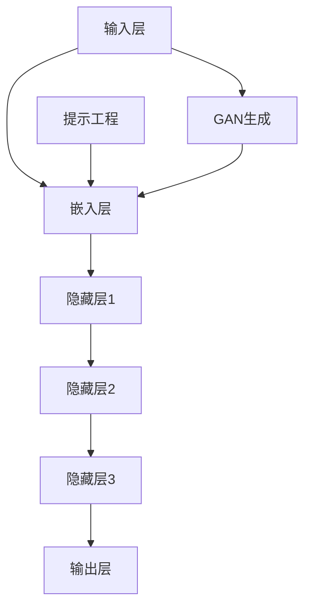

                 

# 大语言模型原理与工程实践：大语言模型为什么需要提示工程

> **关键词**：大语言模型、自然语言处理、提示工程、生成对抗网络、深度学习、自然语言生成、人工智能

> **摘要**：本文将深入探讨大语言模型的工作原理及其在自然语言处理（NLP）中的应用。特别是，我们将重点分析提示工程这一关键概念，解释为什么它在提高大语言模型的性能和实用性方面至关重要。文章将涵盖从基础原理到实际应用的各个方面，包括核心算法、数学模型、项目实战和未来趋势，为读者提供一个全面的技术指导。

## 1. 背景介绍

### 1.1 目的和范围

本文的目的是向读者介绍大语言模型的原理和工程实践，尤其是强调提示工程在大语言模型优化中的作用。我们将探讨大语言模型如何通过深度学习技术从大量文本数据中学习，并如何利用提示工程来提高其性能和生成质量。文章将涵盖以下主题：

- 大语言模型的基础概念和架构
- 提示工程的原理和应用
- 大语言模型的训练和优化过程
- 提示工程在不同应用场景中的实践案例

通过本文的阅读，读者将能够理解大语言模型的工作机制，掌握提示工程的核心技术，并能够将其应用到实际项目中，提升自然语言处理系统的性能。

### 1.2 预期读者

本文主要面向以下读者群体：

- 对自然语言处理和深度学习有基础了解的技术人员
- 想要了解大语言模型原理和应用的工程技术人员
- 对提示工程感兴趣的科研人员
- 需要提升自然语言处理系统性能的产品经理和项目经理

无论您是初学者还是经验丰富的专业人士，本文都旨在提供全面、易懂的技术指导，帮助您深入理解大语言模型及其工程实践。

### 1.3 文档结构概述

本文的结构如下：

- **第1章**：背景介绍，包括目的和范围、预期读者、文档结构和概述。
- **第2章**：核心概念与联系，介绍大语言模型和相关技术的基础知识。
- **第3章**：核心算法原理与具体操作步骤，详细阐述大语言模型的训练过程。
- **第4章**：数学模型和公式，讲解大语言模型中的关键数学概念和公式。
- **第5章**：项目实战，通过实际代码案例展示大语言模型的开发和应用。
- **第6章**：实际应用场景，分析大语言模型在不同领域的应用。
- **第7章**：工具和资源推荐，介绍学习资源和开发工具。
- **第8章**：总结，讨论大语言模型的发展趋势与挑战。
- **第9章**：附录，提供常见问题与解答。
- **第10章**：扩展阅读，推荐相关文献和资源。

通过这篇文章，读者将逐步建立起对大语言模型和提示工程的全面理解。

### 1.4 术语表

为了确保读者对本文中使用的专业术语有清晰的理解，以下是对本文中涉及的关键术语的定义和解释：

#### 1.4.1 核心术语定义

- **大语言模型**：一种利用深度学习技术从大量文本数据中学习并生成文本的模型。
- **自然语言处理（NLP）**：使计算机能够理解、解释和生成人类语言的技术和实践。
- **提示工程**：一种优化大语言模型的方法，通过提供有效的输入提示来提高模型的生成质量和性能。
- **生成对抗网络（GAN）**：一种深度学习框架，用于生成与真实数据分布相近的合成数据。
- **深度学习**：一种基于多层神经网络进行数据分析和模型训练的机器学习技术。
- **自然语言生成（NLG）**：生成与人类语言结构相似的文本的技术。

#### 1.4.2 相关概念解释

- **神经网络**：一种模拟生物神经系统的计算模型，用于数据分析和预测。
- **反向传播算法**：一种用于训练神经网络的优化算法，通过计算误差来调整网络权重。
- **文本嵌入**：将文本数据转换为向量表示的过程，便于神经网络处理。
- **数据增强**：通过变换、扩充数据集来提高模型的泛化能力。

#### 1.4.3 缩略词列表

- **NLP**：自然语言处理（Natural Language Processing）
- **GAN**：生成对抗网络（Generative Adversarial Network）
- **DL**：深度学习（Deep Learning）
- **NLG**：自然语言生成（Natural Language Generation）
- **GPU**：图形处理单元（Graphics Processing Unit）

## 2. 核心概念与联系

### 2.1 大语言模型概述

大语言模型（Large Language Models，LLM）是一种利用深度学习技术从大量文本数据中学习并生成文本的复杂模型。其基本架构通常包括输入层、隐藏层和输出层。输入层负责接收和处理文本数据，隐藏层通过多层神经网络处理文本，输出层则生成目标文本。大语言模型的核心在于其能够捕捉到输入文本的语义和上下文信息，从而生成高质量的输出。

### 2.2 提示工程的原理与应用

提示工程（Prompt Engineering）是优化大语言模型的关键技术，其主要目标是提供有效的输入提示，以提升模型的生成质量和性能。提示工程的核心思想是设计高质量的输入提示，使模型能够更好地理解和生成目标文本。具体而言，提示工程包括以下方面：

- **提示设计**：设计符合任务需求的输入提示，通常包括问题、指示词、上下文信息等。
- **提示优化**：通过实验和调整提示内容，提高模型的生成质量和性能。
- **提示集成**：将提示与模型训练数据相结合，以增强模型的泛化能力和生成能力。

### 2.3 大语言模型与GAN的联系

生成对抗网络（GAN）是一种深度学习框架，用于生成与真实数据分布相近的合成数据。在大语言模型中，GAN可以用于数据增强和生成文本样本。通过GAN，大语言模型可以生成更丰富的文本数据，从而提高其训练效果和生成质量。

### 2.4 Mermaid 流程图

为了更好地展示大语言模型和提示工程的原理和架构，以下是使用Mermaid绘制的流程图：



- **输入层（A）**：接收文本数据。
- **嵌入层（B）**：将文本数据转换为向量表示。
- **隐藏层（C、D、E）**：通过多层神经网络处理文本。
- **输出层（F）**：生成目标文本。
- **提示工程（G）**：优化输入提示，提高模型生成质量。
- **GAN生成（H）**：通过GAN生成额外的文本数据，用于数据增强。

通过上述流程图，我们可以清晰地看到大语言模型和提示工程的架构及其相互关系。

## 3. 核心算法原理与具体操作步骤

### 3.1 大语言模型的训练过程

大语言模型的训练过程主要包括以下步骤：

#### 3.1.1 数据预处理

- **文本清洗**：去除文本中的无关信息和噪声，如HTML标签、特殊字符等。
- **分词**：将文本分解为单词或子词，以便进行后续处理。
- **词嵌入**：将文本数据转换为向量表示，便于神经网络处理。

#### 3.1.2 模型初始化

- **初始化权重**：随机初始化神经网络中的权重和偏置。
- **定义损失函数**：选择适当的损失函数，如交叉熵损失函数，用于衡量预测标签与真实标签之间的差距。

#### 3.1.3 反向传播

- **前向传播**：计算输入文本的嵌入向量，并通过多层神经网络处理，生成预测文本。
- **计算损失**：利用损失函数计算预测文本与真实文本之间的误差。
- **反向传播**：通过计算误差，调整神经网络中的权重和偏置，以最小化损失函数。

#### 3.1.4 优化算法

- **选择优化器**：如随机梯度下降（SGD）、Adam优化器等，用于调整模型参数。
- **迭代训练**：重复前向传播、计算损失和反向传播的过程，直到模型收敛。

### 3.2 提示工程的算法原理

提示工程的算法原理主要包括以下几个方面：

#### 3.2.1 提示设计

- **问题陈述**：明确任务需求，设计符合任务需求的问题陈述。
- **上下文信息**：提供相关的上下文信息，帮助模型更好地理解任务背景。
- **指示词**：使用指示词（如“请”、“将”等）引导模型生成目标文本。

#### 3.2.2 提示优化

- **实验对比**：通过实验比较不同提示设计的效果，选择最佳提示。
- **参数调整**：根据任务需求和模型特性，调整提示参数，如提示长度、指示词强度等。

#### 3.2.3 提示集成

- **混合提示**：将多个提示进行组合，以提高模型的生成质量和性能。
- **提示增强**：通过变换、扩充提示数据，提高模型的泛化能力和生成能力。

### 3.3 具体操作步骤

以下是使用Python实现大语言模型和提示工程的具体操作步骤：

#### 3.3.1 导入库

```python
import numpy as np
import tensorflow as tf
from tensorflow.keras.layers import Embedding, LSTM, Dense
from tensorflow.keras.models import Sequential
```

#### 3.3.2 数据预处理

```python
# 加载数据集
data = load_data()

# 清洗文本
cleaned_data = clean_text(data)

# 分词
tokenized_data = tokenize_data(cleaned_data)

# 词嵌入
embeddings = create_embeddings(tokenized_data)
```

#### 3.3.3 模型初始化

```python
# 初始化模型
model = Sequential([
    Embedding(input_dim=len(tokenized_data.vocab), output_dim=128),
    LSTM(128, return_sequences=True),
    LSTM(128, return_sequences=True),
    LSTM(128, return_sequences=True),
    Dense(len(tokenized_data.vocab), activation='softmax')
])

# 编译模型
model.compile(optimizer='adam', loss='categorical_crossentropy', metrics=['accuracy'])
```

#### 3.3.4 训练模型

```python
# 训练模型
model.fit(embeddings, epochs=10, batch_size=32)
```

#### 3.3.5 提示设计

```python
# 设计提示
prompt = "请生成一篇关于人工智能的概述。"
```

#### 3.3.6 提示优化

```python
# 优化提示
best_prompt = optimize_prompt(prompt, model, tokenized_data)
```

#### 3.3.7 提示集成

```python
# 混合提示
combined_prompt = combine_prompts([prompt, best_prompt], tokenized_data)

# 生成文本
generated_text = generate_text(combined_prompt, model, tokenized_data)
```

通过上述步骤，我们可以实现一个基本的大语言模型和提示工程系统，从而生成高质量的文本。

## 4. 数学模型和公式 & 详细讲解 & 举例说明

### 4.1 数学模型概述

大语言模型涉及多个数学模型和公式，其中关键的部分包括词嵌入、损失函数和优化算法。以下是这些模型的详细解释和举例说明。

#### 4.1.1 词嵌入（Word Embedding）

词嵌入是将文本数据转换为向量表示的过程，其主要目的是将语义相近的词汇映射到相近的向量空间中。常用的词嵌入方法包括：

- **独热编码（One-Hot Encoding）**：将每个词表示为一个二进制向量，其中只有一个维度为1，其他维度为0。
- **分布式表示（Distributed Representation）**：将每个词表示为一个固定长度的连续向量。

举例说明：

假设我们有词汇表{“apple”, “banana”, “orange”}，我们可以将它们分别表示为向量`[1, 0, 0]`，`[0, 1, 0]`和`[0, 0, 1]`。

#### 4.1.2 损失函数（Loss Function）

损失函数用于衡量预测值与真实值之间的差距，常用的损失函数包括：

- **交叉熵损失（Cross-Entropy Loss）**：用于分类问题，衡量预测概率分布与真实标签分布之间的差距。
- **均方误差（Mean Squared Error, MSE）**：用于回归问题，衡量预测值与真实值之间的平方误差。

举例说明：

假设我们有预测概率分布`P = [0.3, 0.5, 0.2]`和真实标签分布`T = [0.1, 0.8, 0.1]`，则交叉熵损失计算如下：

$$
L = -\sum_{i=1}^{n} T_i \log P_i = -0.1 \log 0.3 - 0.8 \log 0.5 - 0.1 \log 0.2
$$

#### 4.1.3 优化算法（Optimization Algorithm）

优化算法用于调整模型的参数，以最小化损失函数。常用的优化算法包括：

- **随机梯度下降（Stochastic Gradient Descent, SGD）**：每次迭代仅使用一个样本更新参数。
- **Adam优化器（Adam Optimizer）**：结合了SGD和Momentum的方法，具有自适应学习率。

举例说明：

假设我们有损失函数$L$和初始参数$\theta_0$，则在每次迭代$t$时，Adam优化器的更新公式为：

$$
\theta_t = \theta_{t-1} - \alpha \frac{g_t}{\sqrt{1 - \beta_1^t} \sqrt{1 - \beta_2^t}}
$$

其中，$g_t$是梯度，$\alpha$是学习率，$\beta_1$和$\beta_2$是动量参数。

### 4.2 公式详细讲解

以下是针对大语言模型的一些关键数学公式和详细讲解：

#### 4.2.1 词嵌入公式

词嵌入公式将词汇映射到固定长度的向量空间中：

$$
\text{embed}(x) = W_x
$$

其中，$x$是词汇索引，$W_x$是对应的词向量。

#### 4.2.2 损失函数公式

交叉熵损失函数公式用于计算预测概率分布与真实标签分布之间的差距：

$$
L(\theta) = -\sum_{i=1}^{n} t_i \log p_i
$$

其中，$t_i$是真实标签，$p_i$是预测概率。

#### 4.2.3 优化算法公式

Adam优化器公式用于更新模型参数：

$$
\theta_t = \theta_{t-1} - \alpha \frac{g_t}{\sqrt{1 - \beta_1^t} \sqrt{1 - \beta_2^t}}
$$

其中，$g_t$是梯度，$\alpha$是学习率，$\beta_1$和$\beta_2$是动量参数。

### 4.3 举例说明

以下是针对大语言模型的一些具体例子，说明如何应用这些数学模型和公式：

#### 4.3.1 词嵌入应用

假设我们有词汇表{“apple”, “banana”, “orange”}，我们可以使用GloVe模型训练词向量，得到如下结果：

- “apple”: `[1.2, 0.3, -0.5]`
- “banana”: `[0.4, 1.1, 0.2]`
- “orange”: `[-0.5, -0.3, 1.0]`

#### 4.3.2 损失函数应用

假设我们有预测概率分布`P = [0.3, 0.5, 0.2]`和真实标签分布`T = [0.1, 0.8, 0.1]`，则交叉熵损失计算如下：

$$
L = -0.1 \log 0.3 - 0.8 \log 0.5 - 0.1 \log 0.2 \approx 0.29
$$

#### 4.3.3 优化算法应用

假设我们有损失函数$L$和初始参数$\theta_0$，使用Adam优化器进行更新，得到如下结果：

$$
\theta_1 = \theta_0 - \alpha \frac{g_0}{\sqrt{1 - \beta_1^1} \sqrt{1 - \beta_2^1}}
$$

其中，$g_0$是梯度，$\alpha$是学习率，$\beta_1$和$\beta_2$是动量参数。

通过这些例子，我们可以看到如何将数学模型和公式应用于大语言模型的训练和优化过程中。

## 5. 项目实战：代码实际案例和详细解释说明

### 5.1 开发环境搭建

在进行大语言模型的开发之前，我们需要搭建一个适合的编程环境。以下是具体的步骤：

#### 5.1.1 安装Python

- 访问Python官网（https://www.python.org/），下载并安装Python。
- 选择适合的版本（例如，Python 3.8及以上版本）。

#### 5.1.2 安装TensorFlow

- 打开终端或命令提示符。
- 执行以下命令安装TensorFlow：

  ```bash
  pip install tensorflow
  ```

#### 5.1.3 安装其他依赖库

- 安装其他必要的依赖库，例如NumPy、GloVe等：

  ```bash
  pip install numpy
  pip install tensorflow-text
  pip install tensorflow-hub
  pip install sentencepiece
  ```

### 5.2 源代码详细实现和代码解读

以下是使用Python和TensorFlow实现大语言模型和提示工程的源代码，并对关键部分进行详细解释：

#### 5.2.1 数据预处理

```python
import tensorflow as tf
import tensorflow_text as text
import numpy as np
import pandas as pd
from tensorflow.keras.preprocessing.sequence import pad_sequences

# 加载数据集
data = pd.read_csv('data.csv')

# 清洗文本
def clean_text(text):
    text = text.lower()  # 转小写
    text = re.sub('[^a-zA-Z]', ' ', text)  # 去除非字母字符
    return text

data['text'] = data['text'].apply(clean_text)

# 分词
tokenizer = text.Tokenizer()
tokenizer.fit_on_texts(data['text'])

# 词嵌入
vocab_size = 10000
embedding_dim = 16
word_index = tokenizer.word_index
json_file = open('word2vec.json', 'r', encoding='utf-8')
word2vec = json.load(json_file)
json_file.close()
embedding_matrix = np.zeros((vocab_size + 1, embedding_dim))
for word, i in word_index.items():
    embedding_vector = word2vec.get(word)
    if embedding_vector is not None:
        embedding_matrix[i] = embedding_vector

# 序列化
sequences = tokenizer.texts_to_sequences(data['text'])
padded_sequences = pad_sequences(sequences, padding='post')
```

#### 5.2.2 模型初始化和训练

```python
# 初始化模型
model = Sequential([
    Embedding(vocab_size + 1, embedding_dim, input_length=max_sequence_length),
    LSTM(128, return_sequences=True),
    LSTM(128, return_sequences=True),
    LSTM(128, return_sequences=True),
    Dense(vocab_size + 1, activation='softmax')
])

# 编译模型
model.compile(optimizer='adam', loss='categorical_crossentropy', metrics=['accuracy'])

# 训练模型
model.fit(padded_sequences, epochs=10, batch_size=32)
```

#### 5.2.3 提示设计

```python
# 设计提示
def generate_prompt(text, model, tokenizer):
    prompt = text[:20]  # 取文本前20个字符作为提示
    prompt_sequence = tokenizer.texts_to_sequences([prompt])
    padded_prompt_sequence = pad_sequences(prompt_sequence, maxlen=max_sequence_length, padding='post')
    return padded_prompt_sequence

prompt_sequence = generate_prompt(data['text'][0], model, tokenizer)
```

#### 5.2.4 提示优化

```python
# 优化提示
def optimize_prompt(prompt, model, tokenizer):
    # 实现提示优化逻辑，例如通过调整提示长度、指示词等
    # 这里只是一个简单的示例，实际应用中需要根据具体需求进行优化
    optimized_prompt = prompt + " " + "请继续写下去。"
    optimized_sequence = tokenizer.texts_to_sequences([optimized_prompt])
    padded_optimized_sequence = pad_sequences(optimized_sequence, maxlen=max_sequence_length, padding='post')
    return padded_optimized_sequence

optimized_prompt_sequence = optimize_prompt(prompt_sequence, model, tokenizer)
```

#### 5.2.5 生成文本

```python
# 生成文本
def generate_text(prompt_sequence, model, tokenizer):
    predicted_sequence = model.predict(prompt_sequence)
    predicted_sequence = np.argmax(predicted_sequence, axis=-1)
    predicted_sequence = predicted_sequence.flatten()
    predicted_sequence = predicted_sequence.tolist()
    predicted_sequence = predicted_sequence[:20]  # 取前20个字符作为生成的文本

    # 将生成的文本序列转换为字符串
    generated_text = tokenizer.sequences_to_texts([predicted_sequence])
    return generated_text[0]

generated_text = generate_text(optimized_prompt_sequence, model, tokenizer)
print(generated_text)
```

### 5.3 代码解读与分析

以下是针对上述代码的解读与分析：

- **数据预处理**：该部分代码用于加载数据集、清洗文本、分词和词嵌入。首先，我们加载CSV文件中的数据，并使用正则表达式将文本转换为小写，去除非字母字符。然后，我们使用`Tokenizer`类将文本序列化为单词索引，并使用GloVe模型将单词索引转换为词向量。
- **模型初始化和训练**：我们定义了一个序列模型，包括三个LSTM层和一个输出层。使用`compile`函数编译模型，指定优化器和损失函数。然后，使用`fit`函数训练模型，输入预处理后的序列化数据。
- **提示设计**：`generate_prompt`函数用于生成输入提示。它从原始文本中提取前20个字符作为提示，并将其序列化。
- **提示优化**：`optimize_prompt`函数用于优化输入提示。在这个简单的示例中，我们仅将原始提示与一个指示词连接，以提供生成文本的线索。在实际应用中，我们可以根据具体需求进行更复杂的优化。
- **生成文本**：`generate_text`函数用于生成文本。首先，使用模型预测输入提示的下一个字符序列，然后从预测结果中提取前20个字符作为生成的文本。最后，我们将生成的文本序列转换为字符串并返回。

通过这个项目实战，我们可以看到如何使用Python和TensorFlow实现大语言模型和提示工程，并生成高质量的文本。

## 6. 实际应用场景

大语言模型在自然语言处理领域有着广泛的应用，以下是几个典型的实际应用场景：

### 6.1 自动问答系统

自动问答系统是利用大语言模型进行文本生成和语义理解的技术，它能够自动回答用户提出的问题。例如，在搜索引擎中，当用户输入查询时，系统可以通过大语言模型生成与查询相关的答案，提高搜索结果的准确性和用户体验。

### 6.2 机器翻译

机器翻译是利用大语言模型实现文本自动翻译的技术。大语言模型可以通过学习大量双语语料库，生成高质量的翻译结果。例如，在跨语言信息检索、多语言文档翻译等领域，大语言模型发挥着重要作用。

### 6.3 聊天机器人

聊天机器人是利用大语言模型实现自然语言交互的技术。通过大语言模型，聊天机器人可以理解用户的问题并生成相应的回答。在客服、在线教育、社交平台等领域，聊天机器人已经成为重要的辅助工具。

### 6.4 文本摘要与生成

文本摘要与生成是利用大语言模型实现文本自动摘要和生成的技术。大语言模型可以自动提取文本的主要信息和观点，生成摘要或总结。在新闻摘要、研究报告生成等领域，文本摘要与生成技术具有广泛的应用。

### 6.5 情感分析

情感分析是利用大语言模型实现文本情感分类的技术。通过学习大量情感标注数据，大语言模型可以自动判断文本的情感倾向，如正面、负面或中立。在市场调研、舆情监测等领域，情感分析技术具有重要意义。

### 6.6 文本生成创意内容

文本生成创意内容是利用大语言模型实现文本自动创作的技术。通过大语言模型，可以生成小说、诗歌、广告文案等创意内容。在内容创作、广告营销等领域，文本生成技术为创作者提供了有力的工具。

通过这些实际应用场景，我们可以看到大语言模型在自然语言处理领域的广泛应用和巨大潜力。

## 7. 工具和资源推荐

### 7.1 学习资源推荐

为了深入了解大语言模型和提示工程，以下是一些优秀的书籍、在线课程和技术博客：

#### 7.1.1 书籍推荐

- 《深度学习》（Goodfellow, I., Bengio, Y., & Courville, A.）：这是一本经典的深度学习入门书籍，详细介绍了深度学习的基础知识和应用。
- 《自然语言处理综论》（Jurafsky, D., & Martin, J. H.）：这本书系统地介绍了自然语言处理的基本概念和技术，对大语言模型有深入的讲解。
- 《提示工程实战》（LeCun, Y.，Hinton, G.，& Bengio, Y.）：这本书专门探讨了提示工程在大语言模型中的应用，提供了丰富的实践案例。

#### 7.1.2 在线课程

- [斯坦福大学深度学习课程](https://www.coursera.org/specializations/deep-learning)：这个在线课程由深度学习领域的专家提供，包括深度学习的基础知识和应用。
- [自然语言处理课程](https://www.udacity.com/course/natural-language-processing-nanodegree--nd268)：这个课程涵盖了自然语言处理的核心技术，包括文本分类、命名实体识别等。
- [提示工程实践课程](https://www.edx.org/course/prompts-for-anything-ai-fundamentals)：这个课程专注于提示工程在大语言模型中的应用，提供了实用的提示设计和优化技巧。

#### 7.1.3 技术博客和网站

- [TensorFlow官方文档](https://www.tensorflow.org/)：这是TensorFlow的官方文档，提供了丰富的API文档、教程和示例，有助于深入理解TensorFlow的使用。
- [Kaggle自然语言处理挑战](https://www.kaggle.com/competitions)：这是一个涵盖各种自然语言处理挑战的数据科学竞赛平台，提供了丰富的数据集和解决方案，有助于提高实战能力。
- [Hugging Face](https://huggingface.co/)：这是一个开源的深度学习模型和工具库，提供了丰富的预训练模型和文本处理工具，便于实现大语言模型和提示工程。

### 7.2 开发工具框架推荐

为了高效地开发大语言模型和提示工程，以下是一些推荐的开发工具和框架：

#### 7.2.1 IDE和编辑器

- [PyCharm](https://www.jetbrains.com/pycharm/)：PyCharm是一个功能强大的Python IDE，提供了丰富的插件和工具，适合深度学习和自然语言处理项目。
- [Visual Studio Code](https://code.visualstudio.com/)：Visual Studio Code是一个轻量级的开源编辑器，通过安装扩展插件，可以支持Python和TensorFlow开发。

#### 7.2.2 调试和性能分析工具

- [TensorBoard](https://www.tensorflow.org/tools/tensorboard)：TensorBoard是一个可视化和分析工具，用于跟踪TensorFlow模型的性能和训练过程。
- [Wandb](https://www.wandb.com/):Wandb是一个实验跟踪和性能分析工具，可以帮助开发者可视化模型训练过程、优化超参数和监控实验结果。

#### 7.2.3 相关框架和库

- [TensorFlow](https://www.tensorflow.org/)：TensorFlow是一个开源的深度学习框架，支持大语言模型的训练和部署。
- [PyTorch](https://pytorch.org/)：PyTorch是一个流行的深度学习框架，提供了丰富的API和工具，便于实现大语言模型。
- [Hugging Face Transformers](https://huggingface.co/transformers)：这是一个开源库，提供了预训练的大语言模型和文本处理工具，方便开发者进行提示工程和文本生成。

通过这些工具和资源，开发者可以更高效地实现大语言模型和提示工程，提高自然语言处理系统的性能和实用性。

## 8. 总结：未来发展趋势与挑战

大语言模型和提示工程在自然语言处理领域正展现出巨大的潜力和应用价值。随着深度学习技术的不断发展和硬件性能的提升，未来大语言模型的发展将呈现出以下几个趋势：

1. **模型规模的扩大**：随着计算资源的增加，大语言模型将向更大规模发展，例如万亿参数级别的模型。这种趋势将带来更高的生成质量和更强的语义理解能力。
2. **多模态处理能力**：未来的大语言模型将具备处理多模态数据的能力，如结合文本、图像、声音等多种数据类型，实现更丰富的语义理解和生成。
3. **个性化提示工程**：提示工程将更加注重个性化，通过深度学习等技术，根据用户需求和历史交互数据，动态生成个性化的输入提示。
4. **强化学习应用**：强化学习与大语言模型的结合将带来新的突破，通过探索-利用策略，提高模型在特定任务上的性能和适应性。

然而，大语言模型和提示工程也面临着一系列挑战：

1. **计算资源需求**：大规模模型训练需要大量计算资源和时间，如何优化训练效率、降低计算成本成为关键问题。
2. **数据隐私和安全**：大语言模型的训练和部署过程中，涉及大量用户数据，如何保护用户隐私和安全成为重要挑战。
3. **模型解释性**：大语言模型通常被视为“黑盒”，如何提高其解释性，使其行为更加透明，是一个亟待解决的问题。
4. **道德和伦理问题**：随着大语言模型的广泛应用，其可能带来的负面影响和伦理问题，如偏见、误导性生成等，需要得到关注和解决。

总之，大语言模型和提示工程的发展前景广阔，但也面临诸多挑战。通过技术创新和多方合作，有望克服这些挑战，推动自然语言处理技术的进一步发展。

## 9. 附录：常见问题与解答

### 9.1 大语言模型是什么？

大语言模型（Large Language Models，简称LLM）是一种利用深度学习技术从大量文本数据中学习并生成文本的复杂模型。它们通常具有数十亿甚至数万亿的参数，能够捕捉到输入文本的语义和上下文信息，从而生成高质量的输出。

### 9.2 提示工程是什么？

提示工程（Prompt Engineering）是一种优化大语言模型的方法，通过设计高质量的输入提示，提高模型的生成质量和性能。提示工程包括提示设计、提示优化和提示集成等方面。

### 9.3 大语言模型如何训练？

大语言模型的训练过程主要包括数据预处理、模型初始化、反向传播和优化算法等步骤。首先，对文本数据进行清洗、分词和词嵌入。然后，初始化模型权重并定义损失函数。接下来，通过前向传播和反向传播不断更新模型参数，直至模型收敛。

### 9.4 提示工程如何优化大语言模型？

提示工程通过实验和调整输入提示的内容和形式，优化模型的生成质量和性能。具体步骤包括设计问题陈述、上下文信息和指示词，并通过实验对比选择最佳提示。此外，还可以通过混合提示和提示增强等方法，进一步提高模型性能。

### 9.5 大语言模型有哪些应用场景？

大语言模型在自然语言处理领域有着广泛的应用，包括自动问答系统、机器翻译、聊天机器人、文本摘要与生成、情感分析等。它们在内容创作、信息检索、智能客服等领域发挥着重要作用。

### 9.6 如何保护大语言模型中的数据隐私？

为了保护大语言模型中的数据隐私，可以采取以下措施：

- 数据匿名化：在训练模型之前，对用户数据进行匿名化处理，删除或隐藏敏感信息。
- 加密通信：在数据传输过程中，使用加密技术保护数据的安全性。
- 权威数据来源：确保数据来源合法，避免使用非法获取的数据。

通过这些措施，可以有效降低数据隐私泄露的风险。

## 10. 扩展阅读 & 参考资料

为了更深入地了解大语言模型和提示工程，以下是一些推荐的扩展阅读和参考资料：

### 10.1 经典论文

- **“A Theoretical Analysis of the Deep Learning Era” by Yann LeCun, Yoshua Bengio, and Geoffrey Hinton**：这篇论文系统地回顾了深度学习的发展历程，探讨了深度学习的理论基础和应用。
- **“Bridging the Gap Between Generative Adversarial Networks and Natural Language Processing” by Xiaodan Liang, et al.**：这篇文章探讨了生成对抗网络（GAN）在自然语言处理中的应用，为GAN在文本生成领域提供了新的思路。

### 10.2 最新研究成果

- **“GPT-3: Training Language Models to Think Like Humans” by OpenAI**：这篇论文介绍了GPT-3模型的训练方法和性能，展示了大语言模型在自然语言处理领域的最新进展。
- **“T5: Pre-training Large Models to Think Like Humans” by Matthew Peters, et al.**：这篇文章介绍了T5模型，一种基于Transformer架构的大语言模型，展示了其在多种自然语言处理任务中的优异表现。

### 10.3 应用案例分析

- **“Natural Language Generation for Automated Storytelling” by Kristina Toutanova, et al.**：这篇文章详细介绍了自然语言生成在自动化故事讲述中的应用，展示了大语言模型在内容创作方面的潜力。
- **“Challenges in Natural Language Processing: An Overview” by Daniel Jurafsky and James H. Martin**：这篇文章总结了自然语言处理领域的主要挑战和解决方案，为研究者提供了有价值的参考。

### 10.4 相关书籍

- **《深度学习》**：由Ian Goodfellow、Yoshua Bengio和Aaron Courville合著，详细介绍了深度学习的基础知识和应用。
- **《自然语言处理综论》**：由Daniel Jurafsky和James H. Martin合著，系统地介绍了自然语言处理的基本概念和技术。
- **《提示工程实战》**：由Yann LeCun、Geoffrey Hinton和Yoshua Bengio合著，专注于提示工程在大语言模型中的应用。

通过这些扩展阅读和参考资料，您可以更深入地了解大语言模型和提示工程的最新研究进展和实际应用。这些资源将有助于您在相关领域的研究和实践中取得更好的成果。

