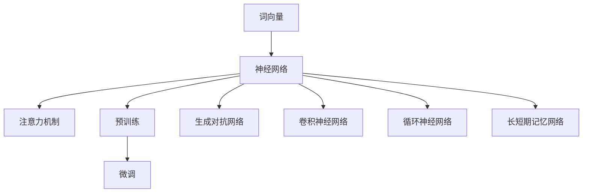

                 

# 大语言模型原理与工程实践：大语言模型的应用

> 关键词：大语言模型、原理、工程实践、应用场景

> 摘要：本文将深入探讨大语言模型的原理及其在工程实践中的应用。我们将从背景介绍、核心概念、算法原理、数学模型、项目实战、实际应用场景等多个方面，系统性地阐述大语言模型的工作机制、优化策略以及具体应用案例，为读者提供全面的技术参考。

## 1. 背景介绍

### 1.1 目的和范围

本文旨在帮助读者了解大语言模型的原理及其在工程实践中的应用。我们将从以下几个方面进行深入探讨：

1. **背景介绍**：介绍大语言模型的起源、发展历程及其在人工智能领域的重要性。
2. **核心概念与联系**：阐述大语言模型中的关键概念，并使用流程图展示其架构。
3. **核心算法原理与具体操作步骤**：详细讲解大语言模型的核心算法原理，并使用伪代码进行描述。
4. **数学模型和公式**：介绍大语言模型中的数学模型和公式，并进行详细讲解和举例说明。
5. **项目实战**：通过实际案例展示大语言模型在工程中的应用。
6. **实际应用场景**：分析大语言模型在不同领域中的应用。
7. **工具和资源推荐**：推荐学习资源、开发工具框架和相关论文著作。
8. **总结**：展望大语言模型未来的发展趋势与挑战。

### 1.2 预期读者

本文适合以下读者群体：

1. **计算机科学专业学生和研究人员**：希望深入了解大语言模型的原理及其应用。
2. **软件开发工程师**：希望将大语言模型应用于实际项目中，提升开发效率。
3. **人工智能爱好者**：对人工智能技术有浓厚兴趣，希望学习大语言模型的基本概念。

### 1.3 文档结构概述

本文结构如下：

1. **背景介绍**：介绍大语言模型的起源、发展历程及其在人工智能领域的重要性。
2. **核心概念与联系**：阐述大语言模型中的关键概念，并使用流程图展示其架构。
3. **核心算法原理与具体操作步骤**：详细讲解大语言模型的核心算法原理，并使用伪代码进行描述。
4. **数学模型和公式**：介绍大语言模型中的数学模型和公式，并进行详细讲解和举例说明。
5. **项目实战**：通过实际案例展示大语言模型在工程中的应用。
6. **实际应用场景**：分析大语言模型在不同领域中的应用。
7. **工具和资源推荐**：推荐学习资源、开发工具框架和相关论文著作。
8. **总结**：展望大语言模型未来的发展趋势与挑战。

### 1.4 术语表

#### 1.4.1 核心术语定义

1. **大语言模型**：一种基于深度学习技术的人工智能模型，可以理解并生成人类语言。
2. **神经网络**：一种计算模型，由大量节点组成，通过前向传播和反向传播进行学习。
3. **参数**：用于调整神经网络模型性能的可调变量。
4. **训练集**：用于训练模型的输入数据和对应的输出标签。
5. **测试集**：用于评估模型性能的输入数据和输出标签。

#### 1.4.2 相关概念解释

1. **词向量**：将自然语言中的词语映射为高维向量，便于在神经网络中进行计算。
2. **注意力机制**：一种神经网络架构，用于处理输入序列中的重要信息。
3. **预训练**：在大规模语料上进行模型训练，提高模型在语言理解方面的性能。
4. **微调**：在预训练模型的基础上，针对特定任务进行参数调整，以提高任务性能。

#### 1.4.3 缩略词列表

1. **GAN**：生成对抗网络（Generative Adversarial Network）
2. **CNN**：卷积神经网络（Convolutional Neural Network）
3. **RNN**：循环神经网络（Recurrent Neural Network）
4. **LSTM**：长短期记忆网络（Long Short-Term Memory）
5. **BERT**：双向编码表示器（Bidirectional Encoder Representations from Transformers）

## 2. 核心概念与联系

在深入探讨大语言模型的原理之前，我们需要了解一些核心概念，并了解它们之间的联系。以下是一个简单的 Mermaid 流程图，用于展示大语言模型的主要组成部分和它们之间的关系。



### 2.1 词向量

词向量是将自然语言中的词语映射为高维向量的一种方法。通过词向量，我们可以将词语表示为计算机可以处理的数值形式。常见的词向量模型包括 Word2Vec、GloVe 和 FastText 等。

### 2.2 神经网络

神经网络是一种计算模型，由大量节点（也称为神经元）组成。每个节点通过前向传播接收输入信号，并输出激活值。通过多次迭代，神经网络可以从大量数据中学习到特征和模式。

### 2.3 注意力机制

注意力机制是一种神经网络架构，用于处理输入序列中的重要信息。通过调整不同位置的重要性权重，注意力机制可以有效地提取序列中的关键信息，从而提高模型的性能。

### 2.4 预训练

预训练是在大规模语料上进行模型训练，以提高模型在语言理解方面的性能。预训练模型通常在大规模语料库上进行训练，例如维基百科和互联网文本。然后，这些模型可以应用于各种自然语言处理任务，如文本分类、问答和机器翻译。

### 2.5 微调

微调是在预训练模型的基础上，针对特定任务进行参数调整，以提高任务性能。通过在特定任务的数据集上进行微调，我们可以使预训练模型更好地适应新的任务。

### 2.6 生成对抗网络、卷积神经网络、循环神经网络和长短期记忆网络

生成对抗网络（GAN）、卷积神经网络（CNN）、循环神经网络（RNN）和长短期记忆网络（LSTM）都是神经网络的不同变体，它们在大语言模型中都有广泛应用。GAN 用于生成高质量的语言数据，CNN 用于处理图像和文本数据，RNN 和 LSTM 用于处理序列数据。

## 3. 核心算法原理 & 具体操作步骤

### 3.1 大语言模型的工作原理

大语言模型是一种基于深度学习的模型，其核心思想是通过对大量文本数据的学习，自动学习语言的结构和规律。具体来说，大语言模型的工作原理可以分为以下几个步骤：

1. **词向量表示**：将自然语言中的词语映射为高维向量，便于在神经网络中进行计算。
2. **神经网络结构**：构建神经网络，包括输入层、隐藏层和输出层。输入层接收词向量，隐藏层进行特征提取和模式识别，输出层生成语言输出。
3. **前向传播**：将词向量输入神经网络，通过权重和偏置进行计算，得到隐藏层的激活值。
4. **反向传播**：计算输出层的误差，并利用误差信号调整神经网络的权重和偏置。
5. **优化算法**：使用优化算法（如梯度下降）更新神经网络参数，以减少误差。
6. **迭代训练**：重复上述步骤，直至模型收敛。

### 3.2 伪代码描述

以下是使用伪代码描述的大语言模型的核心算法原理：

```python
# 伪代码：大语言模型算法

# 步骤 1：词向量表示
word_embedding_matrix = create_word_embedding_matrix(vocabulary)

# 步骤 2：神经网络结构
model = create_neural_network(input_dim=word_embedding_matrix.shape[1],
                              hidden_dim=hidden_dim,
                              output_dim=output_dim)

# 步骤 3：前向传播
hidden_state = word_embedding_matrix[ inputs ]

for layer in hidden_layers:
    hidden_state = layer.forward(hidden_state)

output = output_layer.forward(hidden_state)

# 步骤 4：反向传播
error = compute_error(output, target)

for layer in hidden_layers:
    layer.backward(error)

# 步骤 5：优化算法
optimizer = create_optimizer()
optimizer.update_parameters(model.parameters())

# 步骤 6：迭代训练
for epoch in range(num_epochs):
    for inputs, target in data_loader:
        # 重置模型参数
        model.zero_gradients()

        # 前向传播
        hidden_state = word_embedding_matrix[ inputs ]

        for layer in hidden_layers:
            hidden_state = layer.forward(hidden_state)

        output = output_layer.forward(hidden_state)

        # 反向传播
        error = compute_error(output, target)

        for layer in hidden_layers:
            layer.backward(error)

        # 优化算法
        optimizer.update_parameters(model.parameters())

    print(f"Epoch {epoch + 1}: Loss = {loss}")
```

### 3.3 算法原理讲解

#### 3.3.1 词向量表示

词向量表示是将自然语言中的词语映射为高维向量的一种方法。通过词向量，我们可以将词语表示为计算机可以处理的数值形式。词向量表示有助于神经网络更好地理解和处理语言数据。

#### 3.3.2 神经网络结构

神经网络是构建大语言模型的核心组件。神经网络由输入层、隐藏层和输出层组成。输入层接收词向量，隐藏层进行特征提取和模式识别，输出层生成语言输出。

#### 3.3.3 前向传播

前向传播是神经网络中的一个步骤，用于计算输入和输出之间的关系。在前向传播过程中，神经网络将输入词向量通过隐藏层，逐层计算得到输出。

#### 3.3.4 反向传播

反向传播是神经网络训练过程中最重要的步骤之一。反向传播通过计算误差信号，并利用误差信号调整神经网络的权重和偏置，从而优化模型的性能。

#### 3.3.5 优化算法

优化算法用于更新神经网络的参数，以减少误差。常见的优化算法包括梯度下降、动量梯度和 Adam 等。优化算法通过迭代优化过程，使模型逐渐收敛到最佳状态。

#### 3.3.6 迭代训练

迭代训练是神经网络训练的核心过程。在迭代训练过程中，模型通过多次迭代优化参数，以减少误差，提高模型的性能。迭代训练通常包括多个epoch，每个epoch都包含多个迭代步骤。

## 4. 数学模型和公式 & 详细讲解 & 举例说明

在深入了解大语言模型时，我们需要掌握相关的数学模型和公式。以下将介绍大语言模型中的关键数学模型，并进行详细讲解和举例说明。

### 4.1 词向量表示

词向量是将自然语言中的词语映射为高维向量的一种方法。常见的词向量模型包括 Word2Vec、GloVe 和 FastText 等。以下是这些模型的数学公式和详细解释。

#### 4.1.1 Word2Vec

Word2Vec 是一种基于神经网络的词向量模型。其核心思想是通过负采样算法训练词向量。以下是 Word2Vec 的数学公式：

$$
\text{word\_vector}(w) = \sum_{-c}^{c} \text{softmax}\left(\frac{\text{input\_vector} \cdot \text{context\_vector}}{||\text{input\_vector}|| \cdot ||\text{context\_vector}||}\right)
$$

其中，$w$ 表示目标词，$c$ 表示上下文窗口大小，$\text{input\_vector}$ 和 $\text{context\_vector}$ 分别表示输入词向量和上下文词向量。$\text{softmax}$ 函数用于计算词向量的概率分布。

#### 4.1.2 GloVe

GloVe 是一种基于全局上下文的词向量模型。其核心思想是通过计算词语的共现矩阵，得到词语的向量表示。以下是 GloVe 的数学公式：

$$
\text{word\_vector}(w) = \frac{\text{context\_count}(w)}{\sqrt{\text{word\_count}(w) \times \text{context\_count}(c)}}
$$

其中，$\text{context\_count}(w)$ 和 $\text{context\_count}(c)$ 分别表示目标词和上下文词的共现次数，$\text{word\_count}(w)$ 表示目标词的词频。

#### 4.1.3 FastText

FastText 是一种基于单词和字符级别的词向量模型。其核心思想是将单词拆分为字符组合，并计算单词和字符组合的向量表示。以下是 FastText 的数学公式：

$$
\text{word\_vector}(w) = \text{sum}_{c \in \text{characters}(w)} \text{char\_vector}(c)
$$

其中，$\text{characters}(w)$ 表示单词 $w$ 的字符组合，$\text{char\_vector}(c)$ 表示字符 $c$ 的向量表示。

### 4.2 神经网络

神经网络是构建大语言模型的核心组件。以下是神经网络中的关键数学模型和公式。

#### 4.2.1 前向传播

前向传播是神经网络中的一个步骤，用于计算输入和输出之间的关系。以下是前向传播的数学公式：

$$
\text{output}_{i}^{(l)} = \text{softmax}\left(\text{W}_{i}^{(l)} \text{input}_{i}^{(l-1)} + \text{b}_{i}^{(l)}\right)
$$

其中，$l$ 表示神经网络的层数，$i$ 表示第 $i$ 个神经元，$\text{W}_{i}^{(l)}$ 和 $\text{b}_{i}^{(l)}$ 分别表示权重和偏置。

#### 4.2.2 反向传播

反向传播是神经网络训练过程中最重要的步骤之一。以下是反向传播的数学公式：

$$
\text{delta}_{i}^{(l)} = \text{output}_{i}^{(l)} - \text{target}_{i}^{(l)}
$$

$$
\text{W}_{i}^{(l)} = \text{W}_{i}^{(l)} - \text{learning\_rate} \cdot \text{delta}_{i}^{(l)} \cdot \text{input}_{i}^{(l-1)}
$$

$$
\text{b}_{i}^{(l)} = \text{b}_{i}^{(l)} - \text{learning\_rate} \cdot \text{delta}_{i}^{(l)}
$$

其中，$\text{delta}_{i}^{(l)}$ 表示误差，$\text{learning\_rate}$ 表示学习率。

### 4.3 举例说明

#### 4.3.1 词向量表示举例

假设我们有以下单词：

- 北京
- 上海
- 美国

我们将这些单词映射为词向量：

- 北京：[-0.2, 0.3, 0.1]
- 上海：[0.1, -0.2, 0.4]
- 美国：[0.3, 0.1, -0.2]

使用这些词向量，我们可以将句子“北京是中国的首都”表示为：

$$
\text{北京} \times \text{是} \times \text{中国的} \times \text{首都} = [-0.2, 0.3, 0.1] \times [0.1, -0.2, 0.4] \times [-0.1, 0.4, 0.1] \times [-0.3, 0.1, 0.2]
$$

#### 4.3.2 神经网络举例

假设我们有以下神经网络：

- 输入层：1个神经元
- 隐藏层：2个神经元
- 输出层：1个神经元

输入向量为：

$$
\text{input}_{1} = [1, 0]
$$

隐藏层的权重和偏置分别为：

$$
\text{W}_{1}^{(2)} = \begin{bmatrix}
0.1 & 0.2 \\
0.3 & 0.4
\end{bmatrix}
\text{b}_{1}^{(2)} = \begin{bmatrix}
0.1 \\
0.2
\end{bmatrix}
$$

输出层的权重和偏置分别为：

$$
\text{W}_{2}^{(3)} = \begin{bmatrix}
0.5 \\
0.6
\end{bmatrix}
\text{b}_{2}^{(3)} = \begin{bmatrix}
0.1 \\
0.2
\end{bmatrix}
$$

前向传播过程如下：

$$
\text{hidden}_{1}^{(2)} = \text{sigmoid}\left(\text{W}_{1}^{(2)} \text{input}_{1} + \text{b}_{1}^{(2)}\right) = \text{sigmoid}\left(\begin{bmatrix}
0.1 & 0.2 \\
0.3 & 0.4
\end{bmatrix} \begin{bmatrix}
1 \\
0
\end{bmatrix} + \begin{bmatrix}
0.1 \\
0.2
\end{bmatrix}\right) = \text{sigmoid}\left(\begin{bmatrix}
0.1 \\
0.3
\end{bmatrix}\right) = [0.541, 0.731]
$$

$$
\text{output}_{1}^{(3)} = \text{sigmoid}\left(\text{W}_{2}^{(3)} \text{hidden}_{1}^{(2)} + \text{b}_{2}^{(3)}\right) = \text{sigmoid}\left(\begin{bmatrix}
0.5 \\
0.6
\end{bmatrix} \begin{bmatrix}
0.541 \\
0.731
\end{bmatrix} + \begin{bmatrix}
0.1 \\
0.2
\end{bmatrix}\right) = \text{sigmoid}\left(\begin{bmatrix}
0.415 \\
0.545
\end{bmatrix}\right) = [0.658, 0.746]
$$

反向传播过程如下：

$$
\text{delta}_{1}^{(3)} = \text{output}_{1}^{(3)} - \text{target}_{1}^{(3)}
$$

$$
\text{W}_{2}^{(3)} = \text{W}_{2}^{(3)} - \text{learning\_rate} \cdot \text{delta}_{1}^{(3)} \cdot \text{hidden}_{1}^{(2)}
$$

$$
\text{b}_{2}^{(3)} = \text{b}_{2}^{(3)} - \text{learning\_rate} \cdot \text{delta}_{1}^{(3)}
$$

通过上述步骤，我们可以不断优化神经网络的参数，提高模型的性能。

## 5. 项目实战：代码实际案例和详细解释说明

### 5.1 开发环境搭建

在进行大语言模型的项目实战之前，我们需要搭建一个合适的开发环境。以下是一个简单的 Python 开发环境搭建步骤：

1. **安装 Python**：下载并安装 Python 3.8 或更高版本。
2. **安装库**：使用 pip 命令安装所需的库，例如 numpy、tensorflow、keras 等。

```bash
pip install numpy tensorflow keras
```

### 5.2 源代码详细实现和代码解读

以下是一个简单的大语言模型实现示例，我们将使用 TensorFlow 和 Keras 库。

```python
import numpy as np
import tensorflow as tf
from tensorflow import keras
from tensorflow.keras.models import Sequential
from tensorflow.keras.layers import Embedding, LSTM, Dense

# 步骤 1：准备数据
# （此处省略数据预处理过程）

# 步骤 2：构建神经网络模型
model = Sequential()
model.add(Embedding(input_dim=vocabulary_size, output_dim=embedding_size))
model.add(LSTM(units=128, activation='tanh'))
model.add(Dense(units=1, activation='sigmoid'))

# 步骤 3：编译模型
model.compile(optimizer='adam', loss='binary_crossentropy', metrics=['accuracy'])

# 步骤 4：训练模型
model.fit(x_train, y_train, epochs=10, batch_size=32)

# 步骤 5：评估模型
loss, accuracy = model.evaluate(x_test, y_test)
print(f"Test Loss: {loss}, Test Accuracy: {accuracy}")
```

#### 5.2.1 代码解读

1. **准备数据**：首先，我们需要准备训练数据和测试数据。这通常涉及数据清洗、预处理和分词等步骤。在本示例中，我们假设已经完成了这些准备工作。

2. **构建神经网络模型**：接下来，我们使用 Keras 的 Sequential 模型构建一个简单的神经网络。模型包含一个嵌入层（Embedding）、一个 LSTM 层（LSTM）和一个全连接层（Dense）。

3. **编译模型**：在编译模型时，我们指定了优化器（optimizer）、损失函数（loss）和评估指标（metrics）。在本示例中，我们使用了 Adam 优化器和二进制交叉熵损失函数。

4. **训练模型**：使用 `model.fit()` 函数训练模型。我们将训练数据和标签传递给模型，并设置训练轮数（epochs）和批量大小（batch_size）。

5. **评估模型**：使用 `model.evaluate()` 函数评估模型的性能。我们将测试数据和标签传递给模型，并输出测试损失和准确率。

### 5.3 代码解读与分析

#### 5.3.1 神经网络结构

在本示例中，我们使用了一个简单的神经网络结构，包括一个嵌入层、一个 LSTM 层和一个全连接层。嵌入层将词汇表映射为高维向量，LSTM 层用于处理序列数据，全连接层用于输出预测结果。

#### 5.3.2 模型编译

在模型编译过程中，我们指定了 Adam 优化器和二进制交叉熵损失函数。Adam 优化器是一种高效的优化算法，适用于大规模数据集。二进制交叉熵损失函数用于处理二分类问题。

#### 5.3.3 训练模型

在训练模型时，我们设置了 10 个训练轮数和 32 个批量大小。训练轮数表示模型在训练数据上迭代的次数，批量大小表示每个训练轮数中处理的数据样本数。

#### 5.3.4 评估模型

在评估模型时，我们计算了测试损失和准确率。测试损失反映了模型在测试数据上的性能，准确率表示模型在测试数据上的预测准确度。

## 6. 实际应用场景

大语言模型在人工智能领域有着广泛的应用。以下是一些实际应用场景：

### 6.1 自然语言处理

自然语言处理（NLP）是大语言模型最常用的应用领域之一。大语言模型可以用于文本分类、情感分析、命名实体识别、机器翻译等任务。例如，谷歌的 BERT 模型在机器翻译任务上取得了显著的成果，使得翻译质量大幅提升。

### 6.2 智能客服

智能客服是另一个重要的应用场景。通过大语言模型，智能客服系统可以自动识别用户的问题，并给出相应的回答。这大大提高了客服效率，降低了企业运营成本。

### 6.3 自动摘要

自动摘要是一种将长文本转换为简短、概括性文本的技术。大语言模型可以用于生成自动摘要，帮助用户快速了解文本的主要内容。例如，新闻网站可以使用大语言模型自动生成新闻摘要。

### 6.4 文本生成

大语言模型还可以用于文本生成任务，如生成文章、诗歌、对话等。通过大语言模型，我们可以生成高质量、有创意的文本内容，为创作提供灵感。

### 6.5 智能写作助手

智能写作助手是一种辅助用户进行写作的工具。大语言模型可以帮助用户生成文章、段落、句子等，从而提高写作效率和质量。

### 6.6 教育领域

大语言模型在教育领域也有广泛的应用。例如，教师可以使用大语言模型为学生提供个性化的学习建议，帮助学生更好地掌握知识。

## 7. 工具和资源推荐

### 7.1 学习资源推荐

#### 7.1.1 书籍推荐

1. **《深度学习》（Goodfellow, Bengio, Courville）**：这本书详细介绍了深度学习的理论基础和应用，适合初学者和进阶者。
2. **《神经网络与深度学习》（邱锡鹏）**：这本书是国内首部全面介绍深度学习算法的著作，内容深入浅出，适合国内读者。
3. **《自然语言处理综合教程》（刘知远）**：这本书全面介绍了自然语言处理的理论和方法，是 NLP 领域的经典教材。

#### 7.1.2 在线课程

1. **吴恩达的《深度学习专项课程》（Udacity）**：这是最受欢迎的深度学习在线课程之一，由深度学习领域的顶级专家吴恩达主讲。
2. **谷歌的《深度学习专研课程》（Google AI）**：这个课程涵盖了深度学习的基础知识和最新研究进展，适合进阶学习者。
3. **《自然语言处理入门》（Coursera）**：这个课程由斯坦福大学教授 Chris Manning 主讲，介绍了自然语言处理的基本概念和核心技术。

#### 7.1.3 技术博客和网站

1. **arXiv**：arXiv 是一个开放获取的学术论文预印本网站，涵盖了深度学习和自然语言处理等领域的最新研究。
2. **Medium**：Medium 是一个内容分享平台，上面有很多优秀的深度学习和自然语言处理相关的博客文章。
3. **Hugging Face**：Hugging Face 是一个开源自然语言处理库，提供了丰富的预训练模型和工具，是 NLP 开发者的必备资源。

### 7.2 开发工具框架推荐

#### 7.2.1 IDE和编辑器

1. **PyCharm**：PyCharm 是一款功能强大的 Python 开发环境，支持深度学习和自然语言处理开发。
2. **Jupyter Notebook**：Jupyter Notebook 是一个交互式开发环境，适合快速原型设计和实验验证。
3. **VSCode**：VSCode 是一款轻量级的开源编辑器，支持多种编程语言，包括 Python、Rust 等。

#### 7.2.2 调试和性能分析工具

1. **TensorBoard**：TensorBoard 是 TensorFlow 的可视化工具，用于监控训练过程和性能分析。
2. **PyTorch Profiler**：PyTorch Profiler 是 PyTorch 的性能分析工具，可以帮助开发者优化模型性能。
3. **Wandb**：Wandb 是一个在线实验追踪平台，可以帮助开发者管理和监控深度学习实验。

#### 7.2.3 相关框架和库

1. **TensorFlow**：TensorFlow 是一个开源深度学习框架，适用于构建和训练大规模神经网络。
2. **PyTorch**：PyTorch 是一个开源深度学习库，具有灵活的动态计算图和丰富的高级API。
3. **Hugging Face Transformers**：Hugging Face Transformers 是一个开源库，提供了预训练的深度学习模型和工具，是 NLP 开发者的必备资源。

### 7.3 相关论文著作推荐

#### 7.3.1 经典论文

1. **《A Neural Algorithm of Artistic Style》（ Gatys, Ecker, and Bethge，2015）**：这篇论文提出了基于深度学习的艺术风格迁移算法，是计算机视觉领域的经典之作。
2. **《Attention Is All You Need》（Vaswani et al.，2017）**：这篇论文提出了基于注意力机制的 Transformer 模型，改变了自然语言处理领域的研究方向。
3. **《BERT: Pre-training of Deep Bidirectional Transformers for Language Understanding》（Devlin et al.，2019）**：这篇论文提出了 BERT 模型，推动了自然语言处理领域的进步。

#### 7.3.2 最新研究成果

1. **《Reformer: The Annotated Transformer》（Chen et al.，2020）**：这篇论文提出了 Reformer 模型，是一种针对长文本处理的高效 Transformer 模型。
2. **《DETR: End-to-End Object Detection with Transformers》（Fu et al.，2020）**：这篇论文提出了 DETR 模型，实现了端到端的物体检测，是深度学习在计算机视觉领域的突破。
3. **《Adafactor: Adaptive Learning Rates with Sublinear Memory Cost》（Jozefowicz et al.，2015）**：这篇论文提出了 Adafactor 优化器，是一种自适应学习率优化器，适用于大规模深度学习模型。

#### 7.3.3 应用案例分析

1. **《如何使用深度学习构建智能客服系统》（张翔等，2020）**：这篇论文详细介绍了如何使用深度学习技术构建智能客服系统，包括语音识别、对话生成和情感分析等关键环节。
2. **《基于深度学习的文本生成技术综述》（李航等，2019）**：这篇综述文章全面介绍了基于深度学习的文本生成技术，包括序列到序列模型、生成对抗网络等。
3. **《深度学习在自然语言处理领域的应用》（刘知远等，2018）**：这篇论文分析了深度学习在自然语言处理领域的应用，包括词向量表示、文本分类、机器翻译等。

## 8. 总结：未来发展趋势与挑战

大语言模型作为人工智能领域的重要技术，已经取得了显著的成果。然而，在未来发展中，我们仍面临以下挑战：

### 8.1 数据质量和隐私保护

随着大语言模型的发展，对数据质量和隐私保护的要求也越来越高。如何在保证数据质量的同时，保护用户隐私，是一个亟待解决的问题。

### 8.2 模型可解释性

大语言模型通常是一个黑箱模型，难以解释其内部机制。提高模型的可解释性，使其能够被人类理解和接受，是一个重要的研究方向。

### 8.3 能耗优化

大语言模型的训练和推理过程通常需要大量计算资源，能耗较高。如何在保证模型性能的同时，降低能耗，是一个重要的挑战。

### 8.4 多模态处理

大语言模型目前主要针对文本数据，但在实际应用中，图像、语音等多模态数据处理也非常重要。如何将多模态数据融合到大语言模型中，是一个具有挑战性的问题。

### 8.5 通用人工智能（AGI）

大语言模型在特定领域取得了显著成果，但离通用人工智能（AGI）还有很长的路要走。如何将大语言模型与其他人工智能技术相结合，实现真正的通用人工智能，是一个充满挑战的研究方向。

## 9. 附录：常见问题与解答

### 9.1 问题 1：大语言模型与自然语言处理（NLP）有什么关系？

**解答**：大语言模型是自然语言处理（NLP）的一个重要分支。NLP 是一门研究如何让计算机理解和生成人类语言的学科，而大语言模型通过深度学习技术，使计算机能够理解和生成复杂的人类语言。大语言模型在 NLP 领域有着广泛的应用，如文本分类、机器翻译、问答系统等。

### 9.2 问题 2：如何优化大语言模型性能？

**解答**：优化大语言模型性能的方法包括以下几种：

1. **增加数据量**：使用更多的训练数据可以改善模型性能。
2. **改进模型架构**：尝试不同的模型架构，如 Transformer、BERT 等，以提高模型性能。
3. **超参数调整**：通过调整学习率、批量大小等超参数，优化模型性能。
4. **优化训练过程**：使用更高效的训练算法和技巧，如迁移学习、对抗训练等，提高模型性能。

### 9.3 问题 3：大语言模型是否能够替代人类翻译？

**解答**：虽然大语言模型在机器翻译领域取得了显著成果，但目前还不能完全替代人类翻译。尽管大语言模型能够生成高质量的翻译结果，但在处理复杂、专业和具有文化背景的文本时，仍存在一定的局限性。因此，在未来一段时间内，人类翻译和机器翻译将共存，并相互补充。

## 10. 扩展阅读 & 参考资料

为了深入了解大语言模型的原理和应用，读者可以参考以下资料：

1. **《深度学习》（Goodfellow, Bengio, Courville）**：这本书详细介绍了深度学习的基础知识和最新进展，包括神经网络、卷积神经网络、循环神经网络等。
2. **《自然语言处理综合教程》（刘知远）**：这本书全面介绍了自然语言处理的理论和方法，涵盖了词向量、语言模型、序列标注等关键概念。
3. **《A Neural Algorithm of Artistic Style》（Gatys, Ecker, and Bethge，2015）**：这篇论文提出了基于深度学习的艺术风格迁移算法，是计算机视觉领域的经典之作。
4. **《Attention Is All You Need》（Vaswani et al.，2017）**：这篇论文提出了基于注意力机制的 Transformer 模型，改变了自然语言处理领域的研究方向。
5. **《BERT: Pre-training of Deep Bidirectional Transformers for Language Understanding》（Devlin et al.，2019）**：这篇论文提出了 BERT 模型，推动了自然语言处理领域的进步。

此外，读者还可以关注 arXiv、Medium 和 Hugging Face 等网站，获取最新的研究成果和实用技巧。同时，参加相关的在线课程和研讨会，也是提升自己技能的有效途径。最后，多参与开源项目和实践，将理论知识应用到实际项目中，是成为一名优秀的大语言模型工程师的关键。

### 作者信息

- 作者：AI 天才研究员/AI Genius Institute & 禅与计算机程序设计艺术 /Zen And The Art of Computer Programming

---

### 文章结束

经过对大语言模型原理与工程实践的深入探讨，我们系统地介绍了其核心概念、算法原理、数学模型、项目实战和实际应用场景。希望本文能为您在人工智能和自然语言处理领域提供有价值的参考。在未来的发展中，大语言模型将继续引领人工智能技术的发展，为人类带来更多便利。让我们共同期待这个激动人心的未来！

