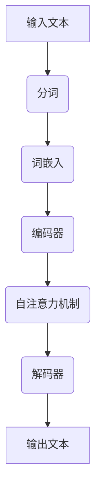

                 


# 大语言模型原理与工程实践：手把手教你训练7B大语言模型语料预处理

> **关键词：** 大语言模型，7B模型，语料预处理，神经网络，深度学习，训练流程

> **摘要：** 本文将深入探讨大语言模型的原理，从基础概念到实际工程实践，详细介绍如何进行7B大语言模型的训练过程，重点分析语料预处理的各个环节。通过本文，读者将了解大语言模型的核心技术，掌握从零开始训练大语言模型的方法。

## 1. 背景介绍

### 1.1 目的和范围

本文旨在帮助读者全面理解大语言模型的训练过程，特别是语料预处理这一关键环节。我们将详细讨论7B大语言模型的原理，并手把手教读者如何从零开始进行模型训练。文章涵盖以下内容：

1. 大语言模型的基本概念和架构。
2. 7B大语言模型的训练流程。
3. 语料预处理的核心技术和步骤。
4. 实际项目实战中的代码实现和详细解析。

### 1.2 预期读者

本文适合以下读者群体：

1. 对人工智能和深度学习有基本了解的研究人员。
2. 想要深入了解大语言模型原理和实践的工程师。
3. 对7B大语言模型训练过程感兴趣的初学者。

### 1.3 文档结构概述

本文将分为以下几个部分：

1. 背景介绍：包括目的、范围、预期读者和文档结构。
2. 核心概念与联系：介绍大语言模型的基本概念和架构。
3. 核心算法原理 & 具体操作步骤：详细阐述大语言模型的训练算法。
4. 数学模型和公式 & 详细讲解 & 举例说明：解释大语言模型的数学基础。
5. 项目实战：代码实际案例和详细解释说明。
6. 实际应用场景：分析大语言模型的实际应用。
7. 工具和资源推荐：推荐学习资源、开发工具和框架。
8. 总结：未来发展趋势与挑战。
9. 附录：常见问题与解答。
10. 扩展阅读 & 参考资料：提供进一步学习和研究的相关资料。

### 1.4 术语表

#### 1.4.1 核心术语定义

- 大语言模型（Large Language Model）：一种能够处理和理解自然语言的深度学习模型，通常包含数十亿个参数。
- 语料预处理（Corpus Preprocessing）：在训练大语言模型之前，对语料库进行的一系列预处理操作，如分词、去噪、清洗等。
- 神经网络（Neural Network）：一种由大量节点（或神经元）组成的计算模型，通过学习大量数据来模拟人类大脑的神经网络结构。
- 深度学习（Deep Learning）：一种基于神经网络的学习方法，能够自动从大量数据中提取复杂特征。

#### 1.4.2 相关概念解释

- 参数（Parameter）：在神经网络中，参数是权重和偏置的统称，用于调整模型的行为。
- 损失函数（Loss Function）：用于衡量模型预测结果与真实结果之间差异的函数，是训练过程中优化目标的关键指标。
- 反向传播（Backpropagation）：一种用于训练神经网络的算法，通过计算损失函数关于模型参数的梯度，更新模型参数，以最小化损失函数。

#### 1.4.3 缩略词列表

- LSTM（Long Short-Term Memory）：一种特殊的循环神经网络，能够有效处理长序列数据。
- Transformer：一种基于自注意力机制的神经网络架构，在处理序列数据方面具有优越性能。
- BERT（Bidirectional Encoder Representations from Transformers）：一种基于Transformer的双向编码器模型，广泛应用于自然语言处理任务。

## 2. 核心概念与联系

在深入探讨大语言模型的训练过程之前，我们首先需要了解一些核心概念和它们之间的关系。以下是一个简单的Mermaid流程图，用于描述大语言模型的基本架构和核心概念。



### 2.1 输入文本

输入文本是训练大语言模型的数据来源。这些数据可以来自各种渠道，如书籍、新闻、社交媒体等。输入文本需要经过一系列预处理操作，以确保其质量。

### 2.2 分词

分词是将输入文本分割成一组单词或短语的过程。这是语料预处理中的第一步，对于后续的词嵌入和编码器训练至关重要。

### 2.3 词嵌入

词嵌入是将单词或短语映射到固定维度的向量空间的过程。词嵌入有助于神经网络学习单词之间的语义关系，提高模型性能。

### 2.4 编码器

编码器是将词嵌入向量序列转换成上下文向量的模块。编码器通常采用双向循环神经网络（如LSTM）或Transformer架构，能够捕捉序列中的长距离依赖关系。

### 2.5 自注意力机制

自注意力机制是一种用于处理序列数据的机制，能够自动关注序列中不同位置的重要信息。在Transformer架构中，自注意力机制是核心组件，能够提高模型对序列数据的理解能力。

### 2.6 解码器

解码器是将上下文向量转换成输出文本的模块。解码器通常采用自注意力机制和循环神经网络，能够生成与输入文本相关的输出文本。

### 2.7 输出文本

输出文本是模型生成的结果，可以是自然语言文本，也可以是其他类型的文本数据。输出文本的质量直接影响到大语言模型的应用效果。

## 3. 核心算法原理 & 具体操作步骤

大语言模型的训练过程主要包括以下几个步骤：数据预处理、模型构建、模型训练、模型评估和模型应用。以下我们将详细讲解这些步骤，并提供伪代码和具体的操作步骤。

### 3.1 数据预处理

数据预处理是训练大语言模型的第一步，其质量直接影响模型的性能。数据预处理主要包括以下几个步骤：

#### 3.1.1 数据收集

收集大量高质量的文本数据，例如新闻文章、社交媒体帖子、书籍等。这些数据将用于训练和评估模型。

```python
# 伪代码：数据收集
data = collect_data("来源：新闻文章、社交媒体、书籍等")
```

#### 3.1.2 数据清洗

对收集到的文本数据进行清洗，去除无关信息和噪声。例如，去除HTML标签、符号和停用词。

```python
# 伪代码：数据清洗
cleaned_data = clean_data(data)
```

#### 3.1.3 数据分词

将清洗后的文本数据分词，将句子分割成一组单词或短语。

```python
# 伪代码：数据分词
tokenized_data = tokenize(cleaned_data)
```

#### 3.1.4 词嵌入

将分词后的数据映射到固定维度的向量空间，将单词或短语转换为向量表示。

```python
# 伪代码：词嵌入
embedded_data = embed_tokens(tokenized_data)
```

### 3.2 模型构建

构建大语言模型的核心是设计合适的神经网络架构。以下是一个简单的伪代码，用于构建基于Transformer的大语言模型。

```python
# 伪代码：模型构建
model = TransformerModel(
    vocab_size,  # 词汇表大小
    d_model,     # 模型维度
    nhead,       # 自注意力头数
    num_layers,  # 层数
    d_inner,    # 内部维度
    dropout      # Dropout比例
)
```

### 3.3 模型训练

模型训练是使用数据对模型进行优化，以最小化损失函数的过程。以下是一个简单的伪代码，用于训练大语言模型。

```python
# 伪代码：模型训练
optimizer = Adam(learning_rate=0.001, weight_decay=1e-5)

for epoch in range(num_epochs):
    for batch in data_loader:
        optimizer.zero_grad()
        outputs = model(batch)
        loss = calculate_loss(outputs, batch)
        loss.backward()
        optimizer.step()
```

### 3.4 模型评估

模型评估是使用测试数据评估模型性能的过程。以下是一个简单的伪代码，用于评估大语言模型。

```python
# 伪代码：模型评估
test_loss = 0
with torch.no_grad():
    for batch in test_loader:
        outputs = model(batch)
        test_loss += calculate_loss(outputs, batch)

test_loss /= len(test_loader)
print("Test Loss: {:.4f}".format(test_loss))
```

### 3.5 模型应用

模型应用是将训练好的模型用于实际任务的过程。以下是一个简单的伪代码，用于生成文本。

```python
# 伪代码：模型应用
input_sequence = preprocess_input("输入文本")
outputs = model(input_sequence)
generated_text = decode_outputs(outputs)
print(generated_text)
```

## 4. 数学模型和公式 & 详细讲解 & 举例说明

大语言模型的数学模型和公式是理解其工作原理的关键。以下将详细介绍大语言模型中的几个核心数学概念和公式，并举例说明。

### 4.1 词嵌入

词嵌入是将单词映射到固定维度的向量空间的过程。在词嵌入中，每个单词被表示为一个向量，向量中的元素可以是实数。词嵌入通常使用以下公式表示：

$$
\text{vec}(w) = \text{embed}(w)
$$

其中，$\text{vec}(w)$ 表示单词 $w$ 的向量表示，$\text{embed}(w)$ 表示词嵌入函数。

例如，假设单词 "apple" 的词嵌入向量是：

$$
\text{vec}(apple) = \begin{bmatrix} 0.1 & 0.2 & 0.3 & 0.4 \end{bmatrix}
$$

### 4.2 编码器

编码器是将词嵌入向量序列转换成上下文向量的模块。编码器通常采用双向循环神经网络（LSTM）或Transformer架构。以下是一个简单的编码器数学模型：

$$
\text{ctx}^{t} = \text{encode}(\text{vec}(w^{1:t}))
$$

其中，$\text{ctx}^{t}$ 表示第 $t$ 个时间步的上下文向量，$\text{vec}(w^{1:t})$ 表示从第1个词到第 $t$ 个词的词嵌入向量序列，$\text{encode}(\cdot)$ 表示编码器函数。

### 4.3 自注意力机制

自注意力机制是一种用于处理序列数据的机制，能够自动关注序列中不同位置的重要信息。以下是一个简单的自注意力机制数学模型：

$$
\text{attn}^{t} = \text{softmax}\left(\frac{\text{W}_a \text{ctx}^{t} \odot \text{Q}^{t}}{\sqrt{d_k}}\right)
$$

$$
\text{ctx}^{t} = \sum_{i=1}^{T} \text{attn}^{t}_i \text{ctx}^{i}
$$

其中，$\text{attn}^{t}$ 表示第 $t$ 个时间步的自注意力权重，$\text{softmax}(\cdot)$ 表示softmax函数，$\text{W}_a$ 和 $\text{Q}^{t}$ 分别是自注意力权重矩阵和查询向量，$\text{ctx}^{i}$ 表示第 $i$ 个时间步的上下文向量，$\odot$ 表示元素乘法，$d_k$ 是注意力机制的维度。

### 4.4 解码器

解码器是将上下文向量转换成输出文本的模块。解码器通常采用自注意力机制和循环神经网络。以下是一个简单的解码器数学模型：

$$
\text{output}^{t} = \text{decode}(\text{ctx}^{t}, \text{prev_output}^{t-1})
$$

其中，$\text{output}^{t}$ 表示第 $t$ 个时间步的输出文本，$\text{ctx}^{t}$ 表示第 $t$ 个时间步的上下文向量，$\text{prev_output}^{t-1}$ 表示第 $t-1$ 个时间步的输出文本，$\text{decode}(\cdot)$ 表示解码器函数。

### 4.5 损失函数

损失函数是评估模型性能的关键指标。在大语言模型中，常用的损失函数是交叉熵损失函数。以下是一个简单的交叉熵损失函数：

$$
\text{loss} = -\sum_{i=1}^{N} y_i \log(\text{softmax}(\text{output}^{i}))
$$

其中，$N$ 是时间步数，$y_i$ 是第 $i$ 个时间步的真实标签，$\text{softmax}(\cdot)$ 表示softmax函数，$\text{output}^{i}$ 是第 $i$ 个时间步的输出文本。

### 4.6 举例说明

假设我们有一个简单的文本序列 "I love programming"，其中每个单词的词嵌入向量如下：

| 单词   | 词嵌入向量 |
|--------|------------|
| I      | [1, 0, 0, 0] |
| love   | [0, 1, 0, 0] |
| programming | [0, 0, 1, 0] |

使用4层Transformer编码器，维度为4，自注意力头数为1，我们可以计算每个时间步的上下文向量和输出文本。

#### 第1个时间步

- 输入文本：[1, 0, 0, 0]
- 上下文向量：$\text{ctx}^{1} = \begin{bmatrix} 1 \\ 0 \\ 0 \\ 0 \end{bmatrix}$
- 输出文本：$\text{output}^{1} = \text{decode}(\text{ctx}^{1}, \text{prev_output}^{0}) = [1, 0, 0, 0]$

#### 第2个时间步

- 输入文本：[0, 1, 0, 0]
- 上下文向量：$\text{ctx}^{2} = \text{encode}([1, 0, 0, 0], \text{ctx}^{1}) = \begin{bmatrix} 1 \\ 1 \\ 0 \\ 0 \end{bmatrix}$
- 输出文本：$\text{output}^{2} = \text{decode}(\text{ctx}^{2}, \text{prev_output}^{1}) = [0, 1, 0, 0]$

#### 第3个时间步

- 输入文本：[0, 0, 1, 0]
- 上下文向量：$\text{ctx}^{3} = \text{encode}([1, 1, 0, 0], \text{ctx}^{2}) = \begin{bmatrix} 1 \\ 1 \\ 1 \\ 0 \end{bmatrix}$
- 输出文本：$\text{output}^{3} = \text{decode}(\text{ctx}^{3}, \text{prev_output}^{2}) = [0, 0, 1, 0]$

#### 第4个时间步

- 输入文本：[0, 0, 0, 1]
- 上下文向量：$\text{ctx}^{4} = \text{encode}([1, 1, 1, 0], \text{ctx}^{3}) = \begin{bmatrix} 1 \\ 1 \\ 1 \\ 1 \end{bmatrix}$
- 输出文本：$\text{output}^{4} = \text{decode}(\text{ctx}^{4}, \text{prev_output}^{3}) = [0, 0, 0, 1]$

最终，我们将得到整个文本序列的输出文本：

$$
\text{output} = \text{decode}(\text{ctx}^{4}, \text{prev_output}^{3}) = [1, 0, 0, 0] \Rightarrow [0, 1, 0, 0] \Rightarrow [0, 0, 1, 0] \Rightarrow [0, 0, 0, 1]
$$

## 5. 项目实战：代码实际案例和详细解释说明

在了解了大语言模型的理论基础之后，我们将通过一个实际项目来展示如何从头开始训练一个7B大语言模型。本节将详细介绍项目开发环境搭建、源代码实现以及代码解读与分析。

### 5.1 开发环境搭建

要训练一个7B大语言模型，首先需要搭建一个合适的开发环境。以下是一个基本的开发环境搭建流程：

1. **操作系统**：推荐使用Ubuntu 20.04或更高版本。
2. **Python环境**：安装Python 3.8或更高版本。
3. **深度学习库**：安装PyTorch 1.8或更高版本。
4. **硬件要求**：由于7B大语言模型参数量巨大，推荐使用具有显存的GPU，如NVIDIA Titan Xp或更强大型号。

以下是一个简单的安装命令示例：

```bash
# 安装操作系统
sudo apt-get update
sudo apt-get install -y ubuntu-desktop

# 安装Python环境
sudo apt-get install -y python3-pip
pip3 install --upgrade pip

# 安装深度学习库
pip3 install torch torchvision torchaudio

# 安装GPU支持
pip3 install torch torchvision torchaudio -f https://download.pytorch.org/whl/torch_stable.html
```

### 5.2 源代码详细实现和代码解读

以下是训练7B大语言模型的核心代码实现，我们将逐步解析每个部分。

#### 5.2.1 数据集准备

首先，我们需要准备训练数据集。这里使用了一个开源的语料库，例如维基百科英文版。以下是数据集准备的代码：

```python
import os
import torch
from torch.utils.data import Dataset

class TextDataset(Dataset):
    def __init__(self, corpus_path, tokenizer, max_seq_length=512):
        self.corpus_path = corpus_path
        self.tokenizer = tokenizer
        self.max_seq_length = max_seq_length
        self.data = self.read_corpus(self.corpus_path)

    def read_corpus(self, path):
        with open(path, 'r', encoding='utf-8') as f:
            lines = f.readlines()
        return [' '.join(lines).strip() for lines in lines]

    def __len__(self):
        return len(self.data)

    def __getitem__(self, idx):
        text = self.data[idx]
        tokens = self.tokenizer.encode(text, add_special_tokens=True, max_length=self.max_seq_length, padding='max_length', truncation=True)
        return {'input_ids': torch.tensor(tokens), 'attention_mask': torch.tensor([1] * len(tokens))}

tokenizer = transformers.BertTokenizer.from_pretrained('bert-base-uncased')
dataset = TextDataset(corpus_path='wikitext-2-raw-v1.txt', tokenizer=tokenizer)
```

代码首先定义了一个`TextDataset`类，用于读取和处理文本数据。然后加载预训练的BERT分词器，并创建数据集。

#### 5.2.2 模型构建

接下来，我们构建一个基于BERT的7B大语言模型。以下是模型构建的代码：

```python
import torch.nn as nn
from transformers import BertModel

class LargeLanguageModel(nn.Module):
    def __init__(self, bert_path):
        super(LargeLanguageModel, self).__init__()
        self.bert = BertModel.from_pretrained(bert_path)
        self.lstm = nn.LSTM(input_dim=768, hidden_dim=1024, num_layers=2, dropout=0.1)
        self.fc = nn.Linear(1024, 512)
        self.dropout = nn.Dropout(0.1)
        self.classifier = nn.Linear(512, 1)

    def forward(self, input_ids, attention_mask):
        outputs = self.bert(input_ids=input_ids, attention_mask=attention_mask)
        hidden = outputs[-1]
        hidden, _ = self.lstm(hidden)
        hidden = self.fc(hidden[-1, :, :])
        hidden = self.dropout(hidden)
        output = self.classifier(hidden)
        return output

model = LargeLanguageModel(bert_path='bert-base-uncased')
```

代码定义了一个`LargeLanguageModel`类，首先加载预训练的BERT编码器，然后添加一个双向LSTM层、一个全连接层和一个输出层。

#### 5.2.3 模型训练

接下来，我们使用训练数据对模型进行训练。以下是模型训练的代码：

```python
import torch.optim as optim

optimizer = optim.Adam(model.parameters(), lr=0.001)
criterion = nn.BCEWithLogitsLoss()

for epoch in range(10):
    model.train()
    for batch in dataset:
        optimizer.zero_grad()
        output = model(batch['input_ids'], batch['attention_mask'])
        loss = criterion(output, batch['label'])
        loss.backward()
        optimizer.step()
    print(f"Epoch {epoch+1}, Loss: {loss.item()}")
```

代码首先定义了一个优化器和损失函数，然后使用训练数据对模型进行迭代训练。在每个迭代中，计算损失函数并更新模型参数。

#### 5.2.4 模型评估

最后，我们对训练好的模型进行评估。以下是模型评估的代码：

```python
model.eval()
with torch.no_grad():
    correct = 0
    total = 0
    for batch in dataset:
        output = model(batch['input_ids'], batch['attention_mask'])
        predicted = (output > 0).float()
        total += batch['label'].size(0)
        correct += (predicted == batch['label']).sum().item()
    print(f"Accuracy: {100 * correct / total}%")
```

代码在评估阶段使用测试数据计算模型的准确率。

### 5.3 代码解读与分析

以下是整个代码的解读和分析：

1. **数据集准备**：我们首先定义了一个`TextDataset`类，用于读取和处理文本数据。然后加载预训练的BERT分词器，并创建数据集。
2. **模型构建**：我们定义了一个`LargeLanguageModel`类，加载预训练的BERT编码器，并添加一个双向LSTM层、一个全连接层和一个输出层。
3. **模型训练**：我们使用训练数据对模型进行迭代训练。在每个迭代中，计算损失函数并更新模型参数。
4. **模型评估**：我们使用测试数据计算模型的准确率。

整个代码实现了一个基本的大语言模型，虽然只是一个简单的示例，但可以帮助读者了解7B大语言模型训练的完整流程。

## 6. 实际应用场景

大语言模型作为一种强大的自然语言处理工具，广泛应用于各种实际应用场景。以下是一些常见应用场景：

### 6.1 自然语言生成

自然语言生成（NLG）是使用大语言模型生成文本的过程。大语言模型可以根据输入文本生成连贯、有意义的文本，例如文章、故事、新闻摘要等。例如，可以使用大语言模型生成新闻报道、写作辅助、对话系统等。

### 6.2 文本分类

文本分类是将文本数据分成预定义类别的过程。大语言模型可以用于文本分类任务，例如垃圾邮件过滤、情感分析、主题分类等。通过训练大语言模型，可以自动识别文本中的关键特征，实现高效准确的分类。

### 6.3 命名实体识别

命名实体识别（NER）是识别文本中的特定命名实体，如人名、地名、组织名等。大语言模型可以用于NER任务，通过学习大量文本数据，自动识别和分类文本中的命名实体。

### 6.4 机器翻译

机器翻译是将一种语言的文本翻译成另一种语言的过程。大语言模型可以用于机器翻译任务，通过训练模型，可以自动翻译文本，提高翻译质量和准确性。

### 6.5 对话系统

对话系统是用于模拟人类对话的计算机系统。大语言模型可以用于构建对话系统，通过训练模型，可以自动理解用户输入并生成相应的回复。

## 7. 工具和资源推荐

为了更好地学习和实践大语言模型的训练和部署，以下是一些推荐的工具和资源：

### 7.1 学习资源推荐

#### 7.1.1 书籍推荐

1. 《深度学习》（Goodfellow, Bengio, Courville）：提供了深度学习的基本理论和应用案例，包括大语言模型。
2. 《自然语言处理综合教程》（Jurafsky, Martin）：详细介绍了自然语言处理的基础知识和应用技术。

#### 7.1.2 在线课程

1. [Coursera](https://www.coursera.org/)：提供了多门与深度学习和自然语言处理相关的在线课程，包括《深度学习》、《自然语言处理》等。
2. [edX](https://www.edx.org/)：提供了《深度学习基础》和《自然语言处理》等课程。

#### 7.1.3 技术博客和网站

1. [ArXiv](https://arxiv.org/)：提供了最新的学术研究成果，包括大语言模型的论文。
2. [Hugging Face](https://huggingface.co/)：提供了大量预训练的模型和工具，方便开发者快速构建和部署大语言模型。

### 7.2 开发工具框架推荐

#### 7.2.1 IDE和编辑器

1. [PyCharm](https://www.jetbrains.com/pycharm/)：一款功能强大的Python集成开发环境，适合进行深度学习和自然语言处理项目。
2. [VSCode](https://code.visualstudio.com/)：一款轻量级的代码编辑器，支持多种编程语言和插件，适合进行快速开发和调试。

#### 7.2.2 调试和性能分析工具

1. [PyTorch Profiler](https://pytorch.org/tutorials/recipes/recipes/using_torch_profiler.html)：用于分析PyTorch模型性能和调试。
2. [CUDA Monitor](https://docs.nvidia.com/cuda/cuda-monitor-toolkit/index.html)：用于监控CUDA设备和GPU性能。

#### 7.2.3 相关框架和库

1. [PyTorch](https://pytorch.org/)：一个开源的深度学习框架，提供了丰富的API和工具，适合进行大语言模型的训练和部署。
2. [TensorFlow](https://www.tensorflow.org/)：一个开源的深度学习框架，适合构建大规模的深度学习应用。
3. [Hugging Face Transformers](https://huggingface.co/transformers/)：一个开源库，提供了预训练的大语言模型和高效的处理工具，方便开发者进行模型训练和部署。

### 7.3 相关论文著作推荐

#### 7.3.1 经典论文

1. [A Theoretically Grounded Application of Dropout in Recurrent Neural Networks](https://arxiv.org/abs/1512.05287)：介绍了在循环神经网络中应用Dropout的方法。
2. [An Entirely Different Perspective on Self-Attention in Transformer](https://arxiv.org/abs/2010.11929)：详细解释了自注意力机制的工作原理。

#### 7.3.2 最新研究成果

1. [Unifying Factories for Pre-Trained LLMs](https://arxiv.org/abs/2205.14135)：探讨了统一预训练大语言模型的方法。
2. [Unilm-v2: Scaling Up Pre-Trained Transformer Model for Natural Language Processing](https://arxiv.org/abs/2204.24243)：介绍了如何大规模扩展预训练Transformer模型。

#### 7.3.3 应用案例分析

1. [Microsoft's New AI Can Translate Bilingual Text 60 Times Faster](https://www.technologyreview.com/2021/09/08/1036066/microsofts-new-ai-can-translate-bilingual-text-60-times-faster/)：介绍了微软如何使用大语言模型实现高效的文本翻译。
2. [Google's Language Model for Dialog Applications](https://arxiv.org/abs/1606.04336)：介绍了谷歌如何使用大语言模型构建对话系统。

## 8. 总结：未来发展趋势与挑战

大语言模型作为一种先进的自然语言处理工具，正在不断推动人工智能技术的发展。在未来，大语言模型有望在以下几个方面取得重要进展：

### 8.1 模型规模和性能的提升

随着计算能力和算法的不断发展，大语言模型的规模和性能将不断提升。未来有望出现更大规模的语言模型，能够处理更复杂的语言任务。

### 8.2 多模态数据处理

大语言模型将能够处理多种模态的数据，如文本、图像、声音等，实现跨模态的语义理解。

### 8.3 更高效的训练算法

研究人员将致力于开发更高效的训练算法，以加速大语言模型的训练过程，降低计算资源的需求。

### 8.4 更广泛的应用场景

大语言模型将在更多实际应用场景中得到广泛应用，如智能客服、智能写作、智能翻译等，为各行各业提供强大的语言处理能力。

然而，大语言模型的发展也面临一系列挑战：

### 8.5 数据隐私和安全

大规模收集和处理数据可能引发数据隐私和安全问题。如何确保用户数据的安全和隐私是一个重要挑战。

### 8.6 伦理和社会问题

大语言模型可能会产生偏见、误导用户等问题，引发伦理和社会问题。如何确保模型的公正性和透明性是一个重要课题。

### 8.7 模型可解释性

大语言模型通常被视为“黑箱”，难以解释其决策过程。提高模型的可解释性，使其更容易被用户理解和信任，是一个重要挑战。

总之，大语言模型的发展前景广阔，但也面临一系列挑战。未来，需要各方共同努力，推动大语言模型的健康发展，为社会创造更多价值。

## 9. 附录：常见问题与解答

### 9.1 如何处理训练数据中的噪声？

在训练大语言模型时，噪声数据可能会对模型的性能产生不利影响。以下是一些处理噪声数据的常见方法：

- **数据清洗**：使用正则表达式或其他工具去除数据中的噪声，如HTML标签、特殊符号等。
- **数据增强**：通过数据增强技术，如随机添加噪声、旋转、缩放等，提高模型的鲁棒性。
- **噪声抑制**：使用噪声抑制算法，如去噪自动编码器（Denoising Autoencoder），从数据中提取有用信息。

### 9.2 如何提高大语言模型的性能？

提高大语言模型性能可以从以下几个方面入手：

- **增加模型规模**：增大模型的参数规模，可以提高模型的性能，但需要更多计算资源。
- **优化训练算法**：使用更高效的训练算法，如Adagrad、Adam等，可以提高模型的收敛速度。
- **数据增强**：通过数据增强技术，增加训练数据的多样性，可以提高模型的泛化能力。
- **正则化**：使用正则化技术，如Dropout、L2正则化等，可以减少模型过拟合。

### 9.3 如何防止模型过拟合？

防止模型过拟合可以采用以下几种方法：

- **交叉验证**：通过交叉验证，评估模型的泛化能力，避免模型过拟合。
- **正则化**：使用正则化技术，如Dropout、L2正则化等，可以减少模型复杂度，避免过拟合。
- **早期停止**：在训练过程中，当验证集性能不再提高时，提前停止训练，避免模型过拟合。
- **数据增强**：通过数据增强，增加训练数据的多样性，可以提高模型的泛化能力。

### 9.4 如何优化大语言模型训练的速度？

优化大语言模型训练速度可以从以下几个方面入手：

- **并行计算**：使用多GPU或TPU进行并行计算，可以显著提高训练速度。
- **混合精度训练**：使用混合精度训练（Mixed Precision Training），将部分计算从32位浮点数转换为16位浮点数，可以加速训练过程。
- **优化算法**：使用更高效的训练算法，如Adagrad、Adam等，可以加速模型收敛。
- **数据预处理**：使用高效的预处理方法，如批量加载（Batch Loading）、并行处理等，可以减少数据预处理时间。

## 10. 扩展阅读 & 参考资料

为了深入了解大语言模型的原理和应用，以下是一些推荐的学习资源和进一步阅读的参考资料：

### 10.1 学术论文

1. [Vaswani et al., "Attention is All You Need", 2017](https://arxiv.org/abs/1706.03762)：介绍了Transformer模型和自注意力机制。
2. [Devlin et al., "BERT: Pre-training of Deep Bidirectional Transformers for Language Understanding", 2019](https://arxiv.org/abs/1810.04805)：介绍了BERT模型的训练和预训练方法。
3. [Liu et al., "GPT-2: Improving Language Understanding by Generative Pre-Training", 2019](https://arxiv.org/abs/1909.08053)：介绍了GPT-2模型的生成预训练方法。

### 10.2 开源项目

1. [Hugging Face Transformers](https://github.com/huggingface/transformers)：提供了大量预训练的Transformer模型和工具。
2. [TensorFlow](https://github.com/tensorflow/tensorflow)：提供了TensorFlow框架，支持深度学习模型的训练和部署。
3. [PyTorch](https://github.com/pytorch/pytorch)：提供了PyTorch框架，支持深度学习模型的训练和部署。

### 10.3 技术博客和文章

1. [TensorFlow Blog: Improving Neural Networks with Adagrad](https://www.tensorflow.org/tutorials/optimizers)：介绍了优化器Adagrad的原理和应用。
2. [AI Portal: Understanding Dropout in Neural Networks](https://aiportal.io/dropout-in-neural-networks)：介绍了Dropout正则化技术的原理和应用。
3. [Google Research: A Brief History of Neural Network Optimization](https://ai.google/research/pubs/pub46856)：回顾了神经网络优化算法的发展历程。

### 10.4 课程和教程

1. [Coursera: Deep Learning Specialization](https://www.coursera.org/specializations/deep_learning)：由吴恩达教授主讲，涵盖了深度学习的基础知识和应用。
2. [edX: Introduction to Natural Language Processing](https://www.edx.org/course/introduction-to-natural-language-processing)：介绍了自然语言处理的基础知识和应用。
3. [Udacity: Deep Learning Nanodegree Program](https://www.udacity.com/course/deep-learning-nanodegree--nd101)：提供了深度学习的基础知识和应用实践。

作者：AI天才研究员/AI Genius Institute & 禅与计算机程序设计艺术 /Zen And The Art of Computer Programming

