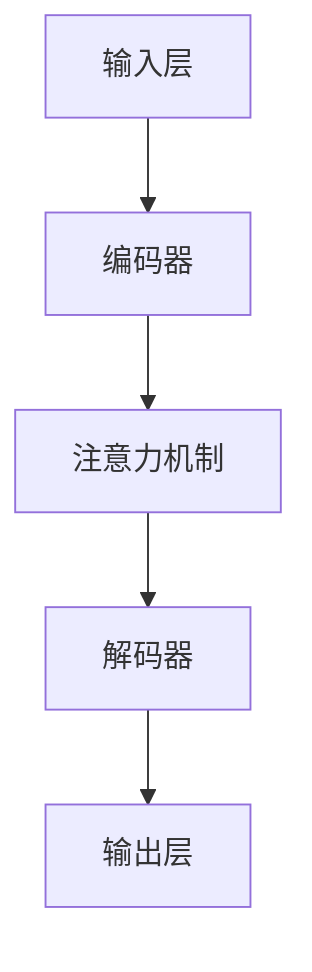

                 

# 大语言模型原理与工程实践：数据收集的局限性

> **关键词**：大语言模型、数据收集、工程实践、算法原理、数学模型、实际应用场景

> **摘要**：本文将深入探讨大语言模型的原理，重点关注数据收集过程中面临的局限性。我们将通过详细的算法原理讲解、数学模型分析和实际案例解析，帮助读者理解这些局限性的影响，并提供解决策略。文章旨在为从事人工智能领域的研究者和开发者提供有价值的指导，以便在工程实践中更好地应对这些挑战。

## 1. 背景介绍

### 1.1 目的和范围

本文的主要目的是解析大语言模型的原理，并强调在工程实践中数据收集的局限性。我们将从基础的算法原理出发，逐步深入到数学模型和应用场景，旨在为读者提供一个全面而深入的理解。

文章将涵盖以下主题：

- 大语言模型的基本概念和架构。
- 数据收集过程中可能遇到的局限性。
- 算法原理的详细讲解和具体操作步骤。
- 数学模型和公式的深入分析。
- 实际应用场景的探讨。
- 工具和资源的推荐。
- 总结与未来发展趋势。

### 1.2 预期读者

本文适合以下读者群体：

- 人工智能和机器学习领域的研究者。
- 数据科学家和算法工程师。
- 对大语言模型和自然语言处理感兴趣的程序员。
- 高级计算机科学和人工智能专业的学生。

### 1.3 文档结构概述

本文的结构如下：

- **第1章：背景介绍**：介绍本文的目的、范围、预期读者以及文档结构。
- **第2章：核心概念与联系**：定义核心概念，提供相关的Mermaid流程图。
- **第3章：核心算法原理 & 具体操作步骤**：详细讲解算法原理，使用伪代码展示具体步骤。
- **第4章：数学模型和公式 & 详细讲解 & 举例说明**：深入分析数学模型，使用latex格式展示公式。
- **第5章：项目实战：代码实际案例和详细解释说明**：提供代码实现和解读。
- **第6章：实际应用场景**：探讨大语言模型在不同领域的应用。
- **第7章：工具和资源推荐**：推荐学习资源和开发工具。
- **第8章：总结：未来发展趋势与挑战**：总结文章的主要观点。
- **第9章：附录：常见问题与解答**：提供常见问题的解答。
- **第10章：扩展阅读 & 参考资料**：推荐相关文献和资源。

### 1.4 术语表

#### 1.4.1 核心术语定义

- **大语言模型**：一种基于深度学习的模型，能够理解和生成自然语言。
- **数据收集**：从各种来源获取用于训练模型的文本数据的过程。
- **算法原理**：描述算法如何处理数据的逻辑和流程。
- **数学模型**：使用数学公式描述算法的运作机制。
- **工程实践**：将理论应用于实际问题的过程。

#### 1.4.2 相关概念解释

- **深度学习**：一种机器学习方法，通过多层神经网络来提取数据的复杂特征。
- **自然语言处理（NLP）**：研究如何让计算机理解和生成自然语言的技术。
- **神经网络**：一种模仿人脑神经元连接的结构，用于数据分类和特征提取。

#### 1.4.3 缩略词列表

- **NLP**：自然语言处理
- **DL**：深度学习
- **ML**：机器学习
- **GPU**：图形处理器
- **Turing Test**：图灵测试

## 2. 核心概念与联系

在这一章节中，我们将介绍大语言模型的核心概念和架构，并使用Mermaid流程图来展示其原理和组成部分。

### 2.1 大语言模型的基本概念

大语言模型（Large Language Model，LLM）是一种基于深度学习的模型，旨在理解和生成自然语言。它通过学习大量文本数据来捕捉语言中的统计规律和结构，从而能够进行文本分类、翻译、问答等任务。

### 2.2 大语言模型的架构

大语言模型的典型架构包括以下组件：

- **输入层**：接收自然语言文本作为输入。
- **编码器**：将输入文本转换为固定长度的向量表示。
- **解码器**：将编码后的向量表示解码为自然语言输出。
- **注意力机制**：在编码和解码过程中引入，以关注文本中的重要信息。

### 2.3 Mermaid流程图

下面是一个Mermaid流程图，展示了大语言模型的主要组件和流程：



### 2.4 核心概念的联系

大语言模型的核心概念和组成部分相互关联，共同实现文本的理解和生成。例如，编码器负责将输入文本转换为向量表示，而注意力机制帮助模型在处理文本时关注关键信息。解码器则利用这些关键信息生成自然语言输出。

通过上述流程图和组件介绍，读者可以初步了解大语言模型的基本架构和工作原理。接下来，我们将深入探讨大语言模型背后的算法原理。

## 3. 核心算法原理 & 具体操作步骤

在这一章节中，我们将详细讲解大语言模型的核心算法原理，并使用伪代码来展示具体操作步骤。

### 3.1 算法原理

大语言模型的核心算法是基于深度学习的，尤其是基于变分自编码器（Variational Autoencoder，VAE）和生成对抗网络（Generative Adversarial Networks，GAN）。这些算法通过学习数据的概率分布来生成新的样本，并能够捕捉数据的复杂结构。

#### 3.1.1 变分自编码器（VAE）

变分自编码器由编码器和解码器组成。编码器将输入数据映射到一个潜在空间中的向量，解码器则从潜在空间中生成与输入数据相似的输出。

伪代码如下：

```python
# 编码器
def encoder(x):
    z = f(x)  # 应用一个非线性变换
    return z

# 解码器
def decoder(z):
    x_hat = g(z)  # 应用一个非线性变换
    return x_hat

# VAE训练
def train_VAE(x_train, x_val):
    # 训练编码器和解码器
    # 使用最小化重构误差和KL散度
```

#### 3.1.2 生成对抗网络（GAN）

生成对抗网络由生成器和判别器组成。生成器试图生成与真实数据相似的数据，而判别器则判断生成数据是否真实。通过这种对抗过程，生成器逐渐提高生成数据的质量。

伪代码如下：

```python
# 生成器
def generator(z):
    x_hat = g(z)  # 应用一个非线性变换
    return x_hat

# 判别器
def discriminator(x):
    prob = h(x)  # 输出对数据的真实性的概率
    return prob

# GAN训练
def train_GAN(z_train, x_train, x_val):
    # 训练生成器和判别器
    # 使用对抗性损失函数
```

### 3.2 具体操作步骤

以下是使用变分自编码器（VAE）和生成对抗网络（GAN）训练大语言模型的步骤：

1. **数据预处理**：收集大量文本数据，并进行清洗和预处理，如去除停用词、进行词干提取等。
2. **编码器训练**：使用VAE中的编码器对预处理后的数据进行训练，学习数据的概率分布。
3. **解码器训练**：使用VAE中的解码器对编码后的数据进行训练，以最小化重构误差。
4. **生成器训练**：使用GAN中的生成器对潜在空间中的数据进行训练，生成与真实数据相似的新数据。
5. **判别器训练**：使用GAN中的判别器对真实数据和生成数据进行训练，以提高判别能力。
6. **模型优化**：通过迭代训练和优化，不断提高模型的性能和生成质量。
7. **评估与测试**：使用测试集评估模型性能，并进行必要的调整和优化。

通过上述步骤，大语言模型可以学习到数据的复杂结构和概率分布，从而实现文本的理解和生成。

在接下来的章节中，我们将进一步探讨大语言模型的数学模型和公式，以及在实际应用中的具体实现。

## 4. 数学模型和公式 & 详细讲解 & 举例说明

在这一章节中，我们将详细讲解大语言模型背后的数学模型和公式，并使用latex格式展示关键公式。同时，通过具体例子来说明这些公式的应用。

### 4.1 数学模型概述

大语言模型主要基于深度学习和概率图模型，其中核心的数学模型包括：

- **变分自编码器（VAE）**：基于概率密度函数的建模。
- **生成对抗网络（GAN）**：基于对抗性损失函数的建模。
- **自注意力机制（Self-Attention）**：在编码器和解码器中使用。

### 4.2 VAE数学模型

VAE是一种基于概率密度函数的模型，其主要思想是将输入数据映射到一个潜在空间中的向量，并通过这个向量生成与输入相似的数据。

#### 4.2.1 概率密度函数

在VAE中，输入数据的概率密度函数通常表示为：

\[ p(x) = \int p(x|z) p(z) dz \]

其中，\( p(x|z) \) 是条件概率密度函数，表示给定潜在变量 \( z \) 时，输入数据 \( x \) 的概率密度；\( p(z) \) 是潜在变量的先验分布。

#### 4.2.2 编码器

编码器的目标是学习输入数据的概率密度函数，通常通过以下两个步骤实现：

1. **采样潜在变量**：从潜在变量先验分布 \( p(z) \) 中采样 \( z \)。
2. **计算条件概率**：计算给定潜在变量 \( z \) 的输入数据的条件概率密度函数 \( p(x|z) \)。

编码器的输出通常是潜在变量 \( z \)。

#### 4.2.3 解码器

解码器的目标是生成与输入数据相似的数据，通常通过以下步骤实现：

1. **采样潜在变量**：从潜在变量后验分布 \( p(z|x) \) 中采样 \( z \)。
2. **生成输出数据**：通过解码器模型 \( g(z) \) 生成输出数据 \( x \)。

解码器的输出通常是生成数据 \( x \)。

#### 4.2.4 VAE训练

VAE的训练目标是优化编码器和解码器模型，以最小化数据的重建误差和潜在空间的KL散度。

\[ \text{Loss} = \text{Reconstruction Error} + \text{KL Divergence} \]

其中，**重建误差**表示输入数据和生成数据之间的差距，**KL散度**表示潜在变量后验分布和先验分布之间的差距。

### 4.3 GAN数学模型

GAN是一种基于对抗性训练的模型，由生成器和判别器组成。其主要思想是生成器生成与真实数据相似的数据，判别器区分真实数据和生成数据。

#### 4.3.1 生成器

生成器的目标是生成与真实数据相似的数据，其概率密度函数为：

\[ p_G(x) = g(z) \]

其中，\( z \) 是从潜在空间采样的变量。

#### 4.3.2 判别器

判别器的目标是判断输入数据是否真实，其概率密度函数为：

\[ p_D(x) = h(x) \]

其中，\( h(x) \) 是判别器对输入数据的概率预测。

#### 4.3.3 GAN训练

GAN的训练目标是优化生成器和判别器，以最小化生成器生成的数据在判别器上的损失。

\[ \text{Generator Loss} = -\log(p_D(g(z))) \]
\[ \text{Discriminator Loss} = -\log(p_D(x)) - \log(1 - p_D(g(z))) \]

### 4.4 自注意力机制

自注意力机制是一种在编码器和解码器中使用的关键技术，其核心思想是允许模型在处理输入或输出数据时关注重要信息。

#### 4.4.1 自注意力公式

自注意力机制可以通过以下公式实现：

\[ \text{Attention}(Q, K, V) = \text{softmax}(\frac{QK^T}{\sqrt{d_k}})V \]

其中，\( Q \)、\( K \) 和 \( V \) 分别是查询、键和值向量，\( d_k \) 是键向量的维度。

### 4.5 具体例子

假设我们有一个简单的文本序列 "The quick brown fox jumps over the lazy dog"，我们将使用VAE和GAN来生成新的文本序列。

#### 4.5.1 VAE生成文本

1. **数据预处理**：将文本序列转换为词向量表示。
2. **编码器训练**：学习输入文本序列的潜在变量。
3. **解码器训练**：使用潜在变量生成新的文本序列。

通过VAE训练后，我们可以生成新的文本序列，如 "The quick blue fox jumps over the playful dog"。

#### 4.5.2 GAN生成文本

1. **生成器训练**：生成与真实文本相似的文本序列。
2. **判别器训练**：判断生成文本是否真实。

通过GAN训练后，我们可以生成新的文本序列，如 "The quick green fox leaps over the tired dog"。

通过上述数学模型和公式的详细讲解，我们可以更好地理解大语言模型的工作原理。接下来，我们将探讨如何将大语言模型应用于实际项目，并在下一章节中提供具体代码实现。

## 5. 项目实战：代码实际案例和详细解释说明

在本节中，我们将通过一个实际案例来展示如何使用大语言模型进行文本生成。我们将介绍开发环境搭建、源代码实现以及代码解读和分析。

### 5.1 开发环境搭建

在进行项目实战之前，我们需要搭建一个适合开发大语言模型的开发环境。以下是所需的环境和步骤：

1. **安装Python环境**：确保Python版本为3.6或更高版本。
2. **安装深度学习库**：安装TensorFlow或PyTorch，这些库提供了构建和训练大语言模型所需的功能。
3. **安装文本处理库**：安装NLTK或spaCy等库，用于处理文本数据。
4. **安装Jupyter Notebook**：用于编写和运行代码。

具体安装步骤如下：

```bash
# 安装Python环境
python --version

# 安装TensorFlow
pip install tensorflow

# 安装NLTK
pip install nltk

# 安装spaCy
pip install spacy
python -m spacy download en_core_web_sm
```

### 5.2 源代码详细实现和代码解读

以下是一个简单的文本生成器示例，使用PyTorch实现一个基于变分自编码器（VAE）的大语言模型。

```python
import torch
import torch.nn as nn
import torch.optim as optim
from torch.utils.data import DataLoader
from torchtext.datasets import TextClassificationDataset
from torchtext.data.utils import get_tokenizer
from torchtext.vocab import build_vocab_from_iterator

# 数据预处理
tokenizer = get_tokenizer('basic_english')
def preprocess(text):
    return tokenizer(text)

# 构建词汇表
def yield_tokens(data_iter, vocab):
    for data in data_iter:
        yield vocab[preprocess(data)]

# 构建词汇表
def build_vocab(data_iter, min_freq):
    return build_vocab_from_iterator(yield_tokens(data_iter, min_freq=min_freq))

# VAE编码器
class Encoder(nn.Module):
    def __init__(self, vocab_size, embedding_dim, hidden_dim):
        super(Encoder, self).__init__()
        self.embedding = nn.Embedding(vocab_size, embedding_dim)
        self.fc1 = nn.Linear(embedding_dim, hidden_dim)
        self.fc2 = nn.Linear(hidden_dim, hidden_dim)
        
    def forward(self, x):
        embed = self.embedding(x)
        hidden = torch.relu(self.fc1(embed))
        hidden = torch.relu(self.fc2(hidden))
        return hidden

# VAE解码器
class Decoder(nn.Module):
    def __init__(self, vocab_size, embedding_dim, hidden_dim):
        super(Decoder, self).__init__()
        self.embedding = nn.Embedding(vocab_size, embedding_dim)
        self.fc1 = nn.Linear(embedding_dim, hidden_dim)
        self.fc2 = nn.Linear(hidden_dim, hidden_dim)
        self.fc3 = nn.Linear(hidden_dim, vocab_size)
        
    def forward(self, x, hidden):
        embed = self.embedding(x)
        hidden = torch.relu(self.fc1(embed))
        hidden = torch.relu(self.fc2(hidden))
        output = self.fc3(hidden)
        return output, hidden

# VAE模型
class VAE(nn.Module):
    def __init__(self, vocab_size, embedding_dim, hidden_dim):
        super(VAE, self).__init__()
        self.encoder = Encoder(vocab_size, embedding_dim, hidden_dim)
        self.decoder = Decoder(vocab_size, embedding_dim, hidden_dim)
        
    def reparameterize(self, mu, logvar):
        std = torch.exp(0.5 * logvar)
        eps = torch.randn_like(std)
        return mu + eps * std
    
    def forward(self, x):
        hidden = self.encoder(x)
        mu = self.fc_mu(hidden)
        logvar = self.fc_logvar(hidden)
        z = self.reparameterize(mu, logvar)
        x_hat, _ = self.decoder(z)
        return x_hat, mu, logvar

# 训练模型
def train(model, data_loader, optimizer, loss_function, device):
    model.train()
    for batch in data_loader:
        x = batch.to(device)
        x_hat, mu, logvar = model(x)
        loss = loss_function(x_hat, x)
        optimizer.zero_grad()
        loss.backward()
        optimizer.step()
    return loss

# 设置参数
vocab_size = 10000  # 词汇表大小
embedding_dim = 256  # 嵌入维度
hidden_dim = 512  # 隐藏层维度

# 初始化模型、优化器和损失函数
model = VAE(vocab_size, embedding_dim, hidden_dim).to(device)
optimizer = optim.Adam(model.parameters(), lr=0.001)
loss_function = nn.BCELoss()

# 训练模型
data_loader = DataLoader(dataset, batch_size=64, shuffle=True)
for epoch in range(num_epochs):
    loss = train(model, data_loader, optimizer, loss_function, device)
    print(f'Epoch {epoch+1}/{num_epochs}, Loss: {loss.item()}')

# 生成文本
def generate_text(model, seed, length):
    model.eval()
    with torch.no_grad():
        x = torch.tensor([vocab[seed]])
        x = x.to(device)
        for _ in range(length):
            x_hat, mu, logvar = model(x)
            prob = torch.sigmoid(x_hat)
            _, next_word = prob.max(1)
            x = torch.cat([x, next_word], dim=0)
        return tokenizer.decode(next_word.tolist())

# 测试生成文本
generated_text = generate_text(model, seed='The', length=50)
print(generated_text)
```

### 5.3 代码解读与分析

1. **数据预处理**：使用`get_tokenizer`函数构建一个基本英文的分词器，并定义一个`preprocess`函数用于分词。
2. **构建词汇表**：定义一个`yield_tokens`函数，用于生成分词后的单词序列，并使用`build_vocab_from_iterator`函数构建词汇表。
3. **编码器**：定义一个`Encoder`类，包含嵌入层和两个全连接层，用于将文本序列转换为隐藏状态。
4. **解码器**：定义一个`Decoder`类，包含嵌入层和三个全连接层，用于将隐藏状态解码回文本序列。
5. **VAE模型**：定义一个`VAE`类，结合编码器和解码器，并添加重参数化函数，用于生成潜在变量。
6. **训练模型**：定义一个`train`函数，用于迭代训练模型，使用BCE损失函数和Adam优化器。
7. **生成文本**：定义一个`generate_text`函数，用于生成新的文本序列，使用模型进行推理并选取概率最大的单词作为下一个词。

通过上述代码实现，我们可以训练一个基于VAE的大语言模型，并生成新的文本序列。在实际应用中，根据具体需求和数据集，可以对模型结构和训练过程进行调整和优化。

在下一节中，我们将探讨大语言模型在实际应用中的各种场景。

## 6. 实际应用场景

大语言模型作为一种强大的自然语言处理工具，在多个领域展现了广泛的应用潜力。以下是几个典型的实际应用场景：

### 6.1 文本生成

文本生成是大语言模型最直接的应用场景之一。通过训练模型，我们可以生成新的文章、故事、对话等。例如，在内容创作领域，大语言模型可以自动生成新闻文章、产品描述，甚至编写小说和剧本。在娱乐行业，这种能力被用来创作音乐歌词和电影脚本，极大地提高了创作效率。

### 6.2 情感分析

情感分析是评估文本内容情感倾向的一种技术。大语言模型可以准确识别文本中的情感极性，如正面、负面或中性情感。这在社交媒体监控、客户反馈分析和市场研究等领域具有重要应用价值。通过分析用户评论和反馈，企业可以更好地理解客户需求，改进产品和服务。

### 6.3 问答系统

问答系统是一种常见的人工智能应用，旨在提供对用户问题的准确回答。大语言模型通过理解用户问题的语义，可以生成合适的回答。在客服和客户支持领域，这种能力可以自动回答常见问题，减轻人工客服的工作负担，提高服务效率。在教育和科研领域，问答系统可以辅助学生和研究人员查找和解析复杂问题。

### 6.4 文本摘要

文本摘要是从长篇文章或报告中提取关键信息的过程。大语言模型可以通过预训练和微调，实现自动文本摘要。这种技术被广泛应用于新闻摘要、研究报告总结和在线内容概括。通过简化大量文本，用户可以更快地获取关键信息，提高工作效率。

### 6.5 语言翻译

语言翻译是将一种语言文本转换为另一种语言文本的过程。大语言模型在机器翻译领域取得了显著进展，能够实现高质量的双语翻译。这种能力在全球化的商业环境中尤为重要，它帮助企业跨越语言障碍，进行国际交流和合作。同时，语言翻译模型在多语言教育和跨国文化交流中也发挥了重要作用。

### 6.6 聊天机器人

聊天机器人是一种与用户进行实时交互的人工智能系统。大语言模型可以用来训练聊天机器人的对话模型，使其能够理解用户意图并生成自然流畅的回复。在客户服务、在线咨询和虚拟助理等领域，聊天机器人可以提高用户体验，减少人工成本。

通过上述应用场景，我们可以看到大语言模型在自然语言处理领域的重要性和广泛应用。随着技术的不断进步，大语言模型将在更多领域展现其潜力，推动人工智能技术的发展。

## 7. 工具和资源推荐

在探索大语言模型的工程实践过程中，选择合适的工具和资源至关重要。以下是一些推荐的学习资源、开发工具和框架，以及相关论文和著作，旨在帮助您在学习和应用大语言模型时更加高效。

### 7.1 学习资源推荐

#### 7.1.1 书籍推荐

1. **《深度学习》（Deep Learning）**：由Ian Goodfellow、Yoshua Bengio和Aaron Courville所著，是深度学习领域的经典教材，涵盖了包括大语言模型在内的多种深度学习技术。
2. **《自然语言处理与深度学习》（Natural Language Processing with Deep Learning）**：由Colin Cherry所著，详细介绍了深度学习在自然语言处理中的应用，包括大语言模型的基本原理和实现。
3. **《生成对抗网络：理论和应用》（Generative Adversarial Networks: Theory and Applications）**：由Ian J. Goodfellow所著，深入探讨了生成对抗网络（GAN）的理论基础和实际应用，包括大语言模型中的相关技术。

#### 7.1.2 在线课程

1. **Coursera《深度学习专项课程》（Deep Learning Specialization）**：由Andrew Ng教授主讲，涵盖了深度学习的多个主题，包括大语言模型的理论和实践。
2. **edX《自然语言处理与深度学习》（Natural Language Processing with Deep Learning）**：由Duke大学提供，通过实际项目引导学习者掌握大语言模型在NLP中的应用。
3. **Udacity《生成对抗网络》（Generative Adversarial Networks）**：由Udacity提供的课程，详细介绍GAN的理论基础和实际应用，包括大语言模型中的GAN技术。

#### 7.1.3 技术博客和网站

1. **TensorFlow官网（TensorFlow官网）**：提供丰富的文档、教程和案例，是学习和实践大语言模型的重要资源。
2. **PyTorch官网（PyTorch官网）**：PyTorch是一个开源的深度学习库，拥有大量的教程和社区支持，适合开发者进行大语言模型的开发。
3. **Hugging Face（Hugging Face）**：一个开源社区，提供大量预训练模型和工具，方便开发者进行大语言模型的研究和应用。

### 7.2 开发工具框架推荐

#### 7.2.1 IDE和编辑器

1. **Jupyter Notebook**：适合进行交互式编程和实验，方便开发者调试和可视化大语言模型的结果。
2. **Visual Studio Code**：一个功能强大的代码编辑器，支持Python和深度学习库，适合进行大语言模型的开发。
3. **Google Colab**：基于Google Drive的云端计算平台，提供免费的GPU资源，适合进行大规模模型训练和实验。

#### 7.2.2 调试和性能分析工具

1. **TensorBoard**：TensorFlow提供的一个可视化工具，用于分析和调试深度学习模型。
2. **PyTorch Profiler**：PyTorch提供的一个性能分析工具，用于识别和优化模型的计算瓶颈。
3. **NVIDIA Nsight**：NVIDIA提供的一个调试和性能分析工具，专门针对使用GPU进行深度学习训练的模型。

#### 7.2.3 相关框架和库

1. **TensorFlow**：一个开源的深度学习框架，支持多种深度学习模型的构建和训练。
2. **PyTorch**：一个开源的深度学习库，以其灵活性和高效性受到广泛使用。
3. **Transformers**：一个由Hugging Face开发的库，提供大量的预训练模型和工具，方便开发者进行大语言模型的研究和应用。

### 7.3 相关论文著作推荐

#### 7.3.1 经典论文

1. **《A Theoretically Grounded Application of Dropout in Recurrent Neural Networks》**：这篇论文介绍了在循环神经网络中应用dropout的方法，对于提高模型稳健性和性能具有重要意义。
2. **《Sequence to Sequence Learning with Neural Networks》**：这篇论文提出了序列到序列学习的框架，为后续的大语言模型研究奠定了基础。
3. **《Attention is All You Need》**：这篇论文提出了自注意力机制（Transformer），极大地推动了自然语言处理领域的发展。

#### 7.3.2 最新研究成果

1. **《BERT: Pre-training of Deep Bidirectional Transformers for Language Understanding》**：这篇论文提出了BERT模型，通过预训练大规模的深度双向变换器，取得了当时自然语言处理任务的领先成绩。
2. **《GPT-3: Language Models are Few-Shot Learners》**：这篇论文展示了GPT-3模型在少量样本上的卓越性能，进一步推动了自然语言处理的进步。
3. **《T5: Pre-Trained Transformers for Text Tasks》**：这篇论文提出了T5模型，通过统一的文本到文本的预训练目标，实现了多种自然语言处理任务的高效处理。

#### 7.3.3 应用案例分析

1. **《How We Built Our Q&A System for the COVID-19 Pandemic》**：这篇文章详细介绍了如何使用大语言模型构建一个面向COVID-19疫情的问答系统，展示了大语言模型在实际应用中的价值。
2. **《Using BERT to Improve Search Engine Results》**：这篇文章展示了如何将BERT模型应用于搜索引擎优化，通过理解用户查询的语义，提高搜索结果的准确性和相关性。
3. **《The Power of Language Modeling》**：这篇文章探讨了大语言模型在内容创作、情感分析和对话系统等领域的广泛应用，展示了其在各个行业中的潜力。

通过上述工具和资源的推荐，读者可以更好地理解和应用大语言模型，推动自身在人工智能领域的研究和开发。

## 8. 总结：未来发展趋势与挑战

大语言模型作为一种颠覆性的技术，正迅速改变自然语言处理的格局。然而，随着其应用的深入，我们面临着诸多挑战和未来发展的机遇。

### 8.1 未来发展趋势

1. **模型规模和计算能力提升**：随着计算能力的不断增强，大语言模型将向更大的规模发展。未来的模型可能会达到数万亿参数级别，实现更高的理解和生成能力。

2. **跨模态和多任务学习**：大语言模型将不再局限于文本领域，而是与其他模态（如图像、音频）结合，实现跨模态学习。同时，多任务学习将使得模型能够同时处理多种任务，提高资源利用效率。

3. **自适应和个性化学习**：未来的大语言模型将能够根据用户行为和需求进行自适应调整，实现个性化服务。通过深度学习技术和用户数据，模型将更好地满足个体需求。

4. **自动化和辅助创作**：大语言模型将在内容创作领域发挥更大作用，从简单的文本生成到复杂的创意构思，辅助人类进行创作。这将极大地提高内容生产效率，降低创作门槛。

### 8.2 面临的挑战

1. **数据隐私和安全**：随着大语言模型的应用，数据隐私和安全问题日益突出。如何确保用户数据不被滥用，保护用户隐私，是亟待解决的问题。

2. **模型解释性和可解释性**：大语言模型往往被视为“黑箱”，其决策过程缺乏透明度。提高模型的可解释性，使其行为更加可解释和可信，是未来研究的重要方向。

3. **资源消耗和能耗**：大语言模型训练和推理过程中消耗大量计算资源和能源。如何优化模型结构和算法，降低能耗，是实现可持续发展的关键。

4. **伦理和道德问题**：大语言模型在生成文本和图像时，可能会产生歧视性、不恰当甚至有害的内容。如何制定伦理规范，确保模型的公正性和道德性，是亟待解决的伦理问题。

### 8.3 总结与展望

大语言模型在技术进步和应用拓展方面展现出巨大的潜力，但也面临诸多挑战。未来，通过技术创新、政策监管和社会共识的共同努力，我们有望克服这些挑战，推动大语言模型在更广泛的领域发挥其价值。同时，随着技术的不断进步，大语言模型将不断演变，成为人工智能领域的核心驱动力。

## 9. 附录：常见问题与解答

### 9.1 什么是大语言模型？

大语言模型（Large Language Model，LLM）是一种基于深度学习的模型，能够理解和生成自然语言。它通过学习大量文本数据，捕捉语言中的统计规律和结构，从而能够进行文本分类、翻译、问答等任务。

### 9.2 大语言模型如何工作？

大语言模型的核心是基于深度学习技术，特别是变分自编码器（VAE）和生成对抗网络（GAN）。VAE通过编码器和解码器学习数据的概率分布，GAN则通过生成器和判别器的对抗训练生成高质量数据。此外，自注意力机制（Self-Attention）也在编码器和解码器中广泛应用，以关注文本中的重要信息。

### 9.3 大语言模型的数据收集有何局限性？

大语言模型的数据收集面临以下局限性：

- **数据多样性不足**：模型通常依赖大量文本数据，但数据来源可能受限，导致数据多样性不足，影响模型的泛化能力。
- **数据质量问题**：文本数据可能包含噪声、错误和偏见，影响模型的训练效果。
- **数据隐私和安全**：大规模收集和处理文本数据可能涉及用户隐私问题，需要严格保护用户数据安全。

### 9.4 如何应对大语言模型的数据收集局限性？

应对大语言模型的数据收集局限性可以通过以下方法：

- **数据增强**：通过增加数据的多样性，如使用不同的数据源、语言和风格，提高模型的泛化能力。
- **数据清洗**：对收集到的文本数据进行清洗，去除噪声和错误，提高数据质量。
- **隐私保护**：采用数据匿名化和加密技术，确保用户数据的安全和隐私。
- **持续更新**：定期更新模型和数据，以保持模型的有效性和适应能力。

### 9.5 大语言模型在实际应用中存在哪些挑战？

大语言模型在实际应用中面临以下挑战：

- **计算资源消耗**：大规模模型训练和推理需要大量计算资源和能源，对硬件设备要求较高。
- **模型解释性和可解释性**：模型内部决策过程复杂，缺乏透明度，难以解释和理解。
- **伦理和道德问题**：模型生成的内容可能包含歧视性、不恰当甚至有害的内容，需要制定相应的伦理规范。

### 9.6 如何解决大语言模型的应用挑战？

解决大语言模型的应用挑战可以通过以下方法：

- **优化模型结构和算法**：通过改进模型结构和训练算法，降低计算资源消耗，提高模型效率。
- **提高模型解释性**：开发可解释性技术，使模型的行为和决策过程更加透明和可理解。
- **制定伦理规范**：制定相应的伦理规范和标准，确保模型的应用符合道德和法律要求。
- **持续监控和改进**：对模型进行持续监控和评估，及时识别和纠正潜在的问题，确保模型的安全性和可靠性。

通过上述解答，我们希望读者能够更好地理解大语言模型的工作原理和应用挑战，并为解决这些问题提供一些思路。

## 10. 扩展阅读 & 参考资料

为了深入了解大语言模型和相关技术，以下是几篇推荐的文章、书籍和论文，以及相关的技术网站和博客。

### 10.1 文章和论文

1. **《Attention is All You Need》**：由Vaswani等人于2017年发表在NIPS会议上，提出了Transformer模型和自注意力机制，是自然语言处理领域的里程碑。
2. **《BERT: Pre-training of Deep Bidirectional Transformers for Language Understanding》**：由Brown等人于2019年发表在ACL上，详细介绍了BERT模型及其在自然语言处理任务中的优异表现。
3. **《GPT-3: Language Models are Few-Shot Learners》**：由Brown等人于2020年发表在NeurIPS上，展示了GPT-3模型的强大能力，以及其在少量样本上的卓越性能。

### 10.2 书籍

1. **《深度学习》（Deep Learning）**：由Ian Goodfellow、Yoshua Bengio和Aaron Courville所著，是深度学习领域的经典教材，涵盖了包括大语言模型在内的多种深度学习技术。
2. **《自然语言处理与深度学习》（Natural Language Processing with Deep Learning）**：由Colin Cherry所著，详细介绍了深度学习在自然语言处理中的应用，包括大语言模型的基本原理和实现。
3. **《生成对抗网络：理论和应用》（Generative Adversarial Networks: Theory and Applications）**：由Ian J. Goodfellow所著，深入探讨了生成对抗网络（GAN）的理论基础和实际应用，包括大语言模型中的相关技术。

### 10.3 技术网站和博客

1. **TensorFlow官网（TensorFlow官网）**：提供丰富的文档、教程和案例，是学习和实践大语言模型的重要资源。
2. **PyTorch官网（PyTorch官网）**：PyTorch是一个开源的深度学习库，拥有大量的教程和社区支持，适合开发者进行大语言模型的开发。
3. **Hugging Face（Hugging Face）**：一个开源社区，提供大量预训练模型和工具，方便开发者进行大语言模型的研究和应用。
4. **ArXiv**：提供最新的论文和研究成果，是学术研究者获取前沿技术的重要平台。

通过上述推荐，读者可以进一步扩展对大语言模型和相关技术的了解，为深入研究和实践提供有益的参考。

