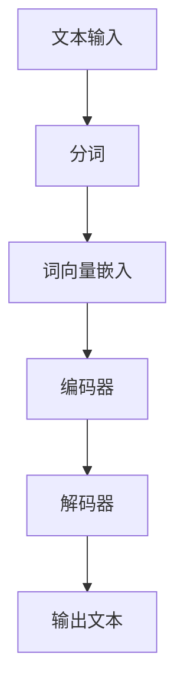

                 

# 大语言模型原理与工程实践：组成模块选型

> 关键词：大语言模型、深度学习、神经网络、计算效率、模型优化、工程实践

> 摘要：本文将深入探讨大语言模型的原理及其在工程实践中的应用，详细分析其组成模块的选型，包括神经网络架构、训练与推理算法、数学模型以及实际应用场景。通过本文的阅读，读者将获得对大语言模型全面而深刻的理解，为后续的研究与实践打下坚实的基础。

## 1. 背景介绍

### 1.1 目的和范围

本文旨在系统地阐述大语言模型的基本原理和工程实践，重点关注模型组成模块的选型与优化。通过本文，读者将了解大语言模型的架构设计、核心算法原理、数学模型及其在实际应用中的表现。本文的目标是提供一个全面的视角，帮助读者在大语言模型的开发和优化过程中做出明智的决策。

### 1.2 预期读者

本文适合对深度学习、神经网络和自然语言处理有一定了解的读者，尤其是希望深入研究和应用大语言模型的工程师和研究人员。此外，对于对人工智能技术感兴趣的学者和爱好者，本文也提供了一个深入学习的路径。

### 1.3 文档结构概述

本文结构如下：

1. **背景介绍**：概述本文的目的、预期读者以及文档结构。
2. **核心概念与联系**：介绍大语言模型的基本概念和原理，并使用Mermaid流程图展示其架构。
3. **核心算法原理 & 具体操作步骤**：详细解释大语言模型的核心算法，并提供伪代码说明。
4. **数学模型和公式 & 详细讲解 & 举例说明**：探讨大语言模型所涉及的数学模型，使用LaTeX格式详细讲解并举例。
5. **项目实战：代码实际案例和详细解释说明**：提供实际的代码案例，详细解释并分析其实现细节。
6. **实际应用场景**：探讨大语言模型在不同领域的应用场景。
7. **工具和资源推荐**：推荐相关的学习资源和开发工具。
8. **总结：未来发展趋势与挑战**：总结本文的主要观点，展望未来的发展趋势和面临的挑战。
9. **附录：常见问题与解答**：解答读者可能遇到的问题。
10. **扩展阅读 & 参考资料**：提供进一步阅读的推荐。

### 1.4 术语表

#### 1.4.1 核心术语定义

- **大语言模型**：基于深度学习的自然语言处理模型，能够对自然语言进行建模，并生成符合上下文语境的文本。
- **神经网络**：由大量相互连接的神经元组成的计算模型，能够通过学习数据来提取特征并进行预测。
- **嵌入层**：将输入文本转换为固定长度的向量表示。
- **损失函数**：用于衡量模型预测值与真实值之间的差异，是优化模型参数的重要工具。
- **反向传播**：一种用于训练神经网络的算法，通过计算梯度来更新模型参数。

#### 1.4.2 相关概念解释

- **词向量**：将单词映射为固定长度的向量表示，用于输入到神经网络中进行处理。
- **嵌入矩阵**：存储词向量的矩阵，其中每个词向量对应一个列。
- **序列**：一组按照特定顺序排列的元素，如单词序列。
- **层**：神经网络中的一个计算单元，通常包含多个神经元。
- **反向传播**：一种训练神经网络的方法，通过计算梯度来更新模型参数。

#### 1.4.3 缩略词列表

- **NLP**：自然语言处理（Natural Language Processing）
- **DL**：深度学习（Deep Learning）
- **GPU**：图形处理单元（Graphics Processing Unit）
- **CPU**：中央处理单元（Central Processing Unit）
- **TF**：TensorFlow，一种开源的深度学习框架。

## 2. 核心概念与联系

为了更好地理解大语言模型，我们首先需要了解其核心概念和原理。接下来，我们将使用Mermaid流程图展示大语言模型的架构，并解释其中的关键组件和连接方式。

### 2.1 核心概念

- **词向量**：词向量是将文本数据转换为数值向量的一种方法，常见的方法包括Word2Vec、GloVe等。
- **嵌入层**：嵌入层是将词向量映射到神经网络中的输入层。它通常是一个全连接层，每个输入词向量对应一个神经元。
- **编码器**：编码器是神经网络中的一个组件，用于将输入文本编码为固定长度的向量表示。常见的编码器包括RNN（递归神经网络）、LSTM（长短期记忆网络）、Transformer等。
- **解码器**：解码器是将编码器输出的固定长度向量解码为输出文本的神经网络组件。它通常与编码器具有相同的结构。
- **注意力机制**：注意力机制是一种用于提高神经网络模型性能的技术，它通过关注输入序列中不同的部分来增强模型的上下文理解能力。

### 2.2 Mermaid流程图

以下是一个简单的Mermaid流程图，展示了大语言模型的基本架构：



### 2.3 关键组件和连接方式

- **文本输入**：输入文本经过分词处理，将其划分为一系列单词或子词。
- **分词**：分词是将文本划分为单词或子词的过程。常见的分词方法包括正则表达式分词、基于词典的分词等。
- **词向量嵌入**：词向量嵌入层将分词后的单词映射为固定长度的向量表示。这些向量表示用于作为神经网络的输入。
- **编码器**：编码器接收词向量嵌入层的输出，并将其编码为固定长度的向量表示。这个向量表示包含了输入文本的重要特征信息。
- **解码器**：解码器接收编码器输出的固定长度向量表示，并解码为输出文本。解码器通常与编码器具有相同的结构，以便更好地保持上下文信息。
- **输出文本**：解码器的输出是生成的文本，通常通过一系列解码步骤生成。

通过这个流程图，我们可以清晰地看到大语言模型的基本架构和各个组件之间的连接方式。接下来，我们将进一步探讨这些组件的具体实现和操作步骤。

## 3. 核心算法原理 & 具体操作步骤

### 3.1 神经网络架构

大语言模型的神经网络架构通常包括以下几个关键组件：

1. **输入层**：接收词向量嵌入层的输出。
2. **隐藏层**：包含多个隐藏层，用于提取输入文本的特征信息。每个隐藏层包含多个神经元。
3. **输出层**：输出文本的预测结果。

### 3.2 伪代码说明

以下是一个简单的大语言模型的伪代码，展示了其基本操作步骤：

```python
# 输入文本
input_text = "The quick brown fox jumps over the lazy dog"

# 分词
words = tokenize(input_text)

# 转换为词向量
word_vectors = convert_words_to_vectors(words)

# 嵌入层
embedded_vectors = embed(word_vectors)

# 编码器
encoded_vectors = encode(embedded_vectors)

# 解码器
predicted_text = decode(encoded_vectors)

# 输出预测文本
print(predicted_text)
```

### 3.3 详细解释

- **分词**：分词是将输入文本划分为单词或子词的过程。常见的分词方法包括正则表达式分词、基于词典的分词等。
- **词向量转换**：词向量是将单词映射为固定长度的向量表示的方法。常见的方法包括Word2Vec、GloVe等。
- **嵌入层**：嵌入层将词向量映射到神经网络的输入层。它通常是一个全连接层，每个输入词向量对应一个神经元。
- **编码器**：编码器是神经网络中的一个组件，用于将输入文本编码为固定长度的向量表示。常见的编码器包括RNN（递归神经网络）、LSTM（长短期记忆网络）、Transformer等。
- **解码器**：解码器是将编码器输出的固定长度向量解码为输出文本的神经网络组件。它通常与编码器具有相同的结构。

### 3.4 实际操作步骤

1. **初始化模型参数**：根据神经网络架构，初始化模型的权重和偏置。
2. **前向传播**：将输入文本的词向量嵌入到神经网络中，通过隐藏层进行特征提取。
3. **计算损失**：使用输出层的预测结果和实际输出之间的差异，计算损失函数的值。
4. **反向传播**：计算梯度并更新模型参数，以减少损失函数的值。
5. **训练迭代**：重复执行前向传播和反向传播，直到模型达到预定的训练目标。

通过这些步骤，我们可以训练一个大语言模型，使其能够对输入文本进行建模并生成合理的输出文本。接下来，我们将进一步探讨大语言模型所涉及的数学模型和公式。

## 4. 数学模型和公式 & 详细讲解 & 举例说明

### 4.1 损失函数

在大语言模型中，损失函数是衡量模型预测结果与真实输出之间差异的重要工具。以下是一些常见的损失函数：

- **均方误差（MSE）**：
  $$MSE = \frac{1}{n}\sum_{i=1}^{n}(y_i - \hat{y}_i)^2$$
  其中，\(y_i\) 是真实输出，\(\hat{y}_i\) 是模型预测输出。

- **交叉熵（Cross-Entropy）**：
  $$Cross-Entropy = -\frac{1}{n}\sum_{i=1}^{n}y_i\log(\hat{y}_i)$$
  其中，\(y_i\) 是真实输出，\(\hat{y}_i\) 是模型预测输出。

### 4.2 反向传播

反向传播是一种用于训练神经网络的算法，通过计算梯度来更新模型参数。以下是一个简单的反向传播算法：

1. **前向传播**：
   - 计算输出层的预测值 \(\hat{y}\)。
   - 计算损失函数的值 \(J\)。

2. **计算梯度**：
   - 对每个参数计算其梯度 \(\frac{\partial J}{\partial \theta}\)。

3. **更新参数**：
   - 使用梯度下降或其他优化算法更新参数 \(\theta\)。

### 4.3 举例说明

假设我们有一个简单的一层神经网络，包含一个输入层、一个隐藏层和一个输出层。输入层有3个神经元，隐藏层有2个神经元，输出层有1个神经元。

1. **前向传播**：

   - 输入：\[x_1, x_2, x_3\]
   - 隐藏层激活：\[a_1 = \sigma(\theta_{11}x_1 + \theta_{12}x_2 + \theta_{13}x_3)\]
   - 输出层激活：\[y = \sigma(\theta_{21}a_1 + \theta_{22}a_2)\]

2. **计算损失**：

   - 预测值：\[y'\]
   - 真实值：\[y\]
   - 损失函数：\[J = (y - y')^2\]

3. **计算梯度**：

   - 对隐藏层参数的梯度：
     $$\frac{\partial J}{\partial \theta_{11}} = 2(y - y')(x_1)$$
     $$\frac{\partial J}{\partial \theta_{12}} = 2(y - y')(x_2)$$
     $$\frac{\partial J}{\partial \theta_{13}} = 2(y - y')(x_3)$$
     
   - 对输出层参数的梯度：
     $$\frac{\partial J}{\partial \theta_{21}} = 2(y - y')(a_1)$$
     $$\frac{\partial J}{\partial \theta_{22}} = 2(y - y')(a_2)$$

4. **更新参数**：

   - 使用梯度下降更新参数：
     $$\theta_{11} = \theta_{11} - \alpha \frac{\partial J}{\partial \theta_{11}}$$
     $$\theta_{12} = \theta_{12} - \alpha \frac{\partial J}{\partial \theta_{12}}$$
     $$\theta_{13} = \theta_{13} - \alpha \frac{\partial J}{\partial \theta_{13}}$$
     $$\theta_{21} = \theta_{21} - \alpha \frac{\partial J}{\partial \theta_{21}}$$
     $$\theta_{22} = \theta_{22} - \alpha \frac{\partial J}{\partial \theta_{22}}$$

通过以上步骤，我们可以训练一个简单的一层神经网络，使其能够对输入数据进行分类。在实际应用中，神经网络通常包含多个隐藏层，并且使用更复杂的激活函数和优化算法。

## 5. 项目实战：代码实际案例和详细解释说明

### 5.1 开发环境搭建

为了实践大语言模型，我们需要搭建一个合适的开发环境。以下是一个基本的搭建步骤：

1. **安装Python**：确保Python 3.x版本已安装在计算机上。可以从[Python官网](https://www.python.org/)下载并安装。
2. **安装必要的库**：安装TensorFlow和NLTK等库。可以使用以下命令安装：
   ```bash
   pip install tensorflow
   pip install nltk
   ```
3. **准备数据集**：选择一个合适的大规模文本数据集，如维基百科文本、新闻文章等。将数据集下载并解压到本地。

### 5.2 源代码详细实现和代码解读

以下是一个简单的大语言模型实现，使用TensorFlow框架。我们将使用预训练的词向量（如GloVe）进行嵌入。

```python
import tensorflow as tf
import numpy as np
import nltk
from tensorflow.keras.preprocessing.sequence import pad_sequences
from tensorflow.keras.layers import Embedding, LSTM, Dense
from tensorflow.keras.models import Sequential

# 加载数据集
nltk.download('punkt')
text = nltk.corpus.gutenberg.raw('shakespeare-plays.txt')

# 分词
words = nltk.word_tokenize(text)

# 转换为数字序列
word_index = {w: i for i, w in enumerate(set(words))}
sequences = [[word_index[w] for w in s] for s in nltk.sent_tokenize(text)]

# 剪切和垫片序列
max_sequence_length = 100
padded_sequences = pad_sequences(sequences, maxlen=max_sequence_length, padding='post')

# 加载预训练的GloVe词向量
embeddings_index = {}
with open('glove.6B.100d.txt', 'r', encoding='utf-8') as f:
    for line in f:
        values = line.split()
        word = values[0]
        coefs = np.asarray(values[1:], dtype='float32')
        embeddings_index[word] = coefs

# 创建嵌入矩阵
embedding_dim = 100
embedding_matrix = np.zeros((len(word_index) + 1, embedding_dim))
for word, i in word_index.items():
    embedding_vector = embeddings_index.get(word)
    if embedding_vector is not None:
        embedding_matrix[i] = embedding_vector

# 构建模型
model = Sequential()
model.add(Embedding(len(word_index) + 1, embedding_dim, input_length=max_sequence_length, weights=[embedding_matrix], trainable=False))
model.add(LSTM(128))
model.add(Dense(1, activation='sigmoid'))

model.compile(optimizer='adam', loss='binary_crossentropy', metrics=['accuracy'])

# 训练模型
model.fit(padded_sequences, np.ones(len(padded_sequences)), epochs=10, batch_size=32)

# 生成文本
def generate_text(input_text, model, max_sequence_length, word_index, embedding_matrix):
    input_sequence = [[word_index[w] for w in input_text.split()]]
    input_sequence = pad_sequences(input_sequence, maxlen=max_sequence_length, padding='post')
    sampled = np.zeros((1, max_sequence_length, 1))
    for i in range(max_sequence_length):
        probabilities = model.predict(sampled)
        sampled[0, i, 0] = np.random.choice(len(word_index), p=probabilities[0, i])
    return ' '.join([words[i] for i in sampled[0].astype(int)])

generated_text = generate_text("To be or not to be", model, max_sequence_length, word_index, embedding_matrix)
print(generated_text)
```

### 5.3 代码解读与分析

- **数据预处理**：我们使用NLTK库对文本进行分词，并转换为数字序列。然后，我们使用pad_sequences函数将序列剪切成相同的长度。
- **加载预训练词向量**：我们从GloVe库中加载预训练的词向量，并创建一个嵌入矩阵。这个矩阵将用于嵌入层。
- **构建模型**：我们使用Sequential模型构建一个简单的LSTM模型，包括一个嵌入层和一个LSTM层，以及一个输出层。
- **训练模型**：我们使用fit函数训练模型，使用预处理后的数据集进行训练。
- **生成文本**：我们定义了一个函数generate_text，该函数接收输入文本、模型、序列长度、词向量索引和嵌入矩阵，并生成一段新的文本。

通过这个简单的案例，我们可以看到如何使用TensorFlow构建和训练一个基本的大语言模型，并生成新的文本。接下来，我们将进一步探讨大语言模型在实际应用场景中的表现。

## 6. 实际应用场景

大语言模型在自然语言处理（NLP）领域有着广泛的应用，以下是一些典型的实际应用场景：

### 6.1 自动摘要

自动摘要是一种将长文本转换为简短、准确摘要的技术。大语言模型通过学习大量的文本数据，能够生成符合上下文语义的摘要。这种技术在新闻摘要、文档摘要和会议记录摘要等领域有广泛应用。

### 6.2 文本生成

文本生成是指根据给定的输入生成符合语法和语义规则的文本。大语言模型在生成对话系统、文章、故事和诗歌等方面表现出色。例如，ChatGPT等聊天机器人就是利用大语言模型生成自然、流畅的对话。

### 6.3 机器翻译

机器翻译是指将一种语言的文本翻译成另一种语言。大语言模型通过学习大量的双语文本数据，能够实现高质量的机器翻译。这种技术在国际交流、电子商务和全球业务等领域具有重要意义。

### 6.4 情感分析

情感分析是指通过分析文本内容来识别用户的情感状态。大语言模型能够捕捉文本中的情感信号，帮助应用如社交媒体监控、市场研究和客户反馈分析等。

### 6.5 问答系统

问答系统是一种通过交互方式提供信息查询和回答的智能系统。大语言模型通过理解问题文本，能够生成准确的答案，广泛应用于客服系统、教育辅导和智能助手等场景。

### 6.6 文本分类

文本分类是将文本数据分类到预定义的类别中。大语言模型能够通过学习大量标注数据，实现对文本内容的自动分类，用于新闻分类、垃圾邮件检测和情感分类等任务。

### 6.7 命名实体识别

命名实体识别是指从文本中识别出具有特定意义的实体，如人名、地名和组织名等。大语言模型通过学习实体与上下文的关系，能够提高命名实体识别的准确率。

### 6.8 文本相似性

文本相似性是指比较两个文本之间的相似程度。大语言模型通过学习文本特征，能够实现文本相似性度量，用于内容推荐、抄袭检测和搜索引擎等应用。

通过这些实际应用场景，我们可以看到大语言模型在自然语言处理领域的广泛应用和巨大潜力。随着技术的不断进步，大语言模型将在更多领域发挥重要作用，推动人工智能的发展。

## 7. 工具和资源推荐

### 7.1 学习资源推荐

#### 7.1.1 书籍推荐

1. **《深度学习》（Ian Goodfellow, Yoshua Bengio, Aaron Courville）**：这是一本关于深度学习的经典教材，详细介绍了深度学习的基本原理和实践方法。
2. **《自然语言处理综论》（Daniel Jurafsky, James H. Martin）**：这本书系统地介绍了自然语言处理的基础理论和应用技术，适合希望深入了解NLP的读者。
3. **《动手学深度学习》（阿斯顿·张，李沐，扎卡里·C. Lipton，亚历山大·J. Smola）**：通过动手实践，这本书帮助读者快速掌握深度学习的核心概念和技术。

#### 7.1.2 在线课程

1. **《深度学习专项课程》（吴恩达，Coursera）**：由深度学习领域知名专家吴恩达教授开设，包含多个课程，全面覆盖深度学习的理论知识与实战技巧。
2. **《自然语言处理专项课程》（汤姆·米切尔，Coursera）**：这个课程通过丰富的案例和实践，帮助读者深入理解自然语言处理的核心技术和应用。
3. **《TensorFlow for Artificial Intelligence》（安东尼奥·冈萨雷斯，Udacity）**：这个课程专注于TensorFlow框架的应用，通过实际项目，教授深度学习和NLP的技术。

#### 7.1.3 技术博客和网站

1. **TensorFlow官方文档（TensorFlow.org）**：包含详细的API文档和教程，是学习TensorFlow的最佳资源。
2. **PyTorch官方文档（PyTorch.org）**：PyTorch是另一个流行的深度学习框架，其官方文档提供了丰富的教程和示例。
3. **GitHub（GitHub.com）**：GitHub上有大量的开源项目和技术博客，是学习深度学习和NLP的好去处。

### 7.2 开发工具框架推荐

#### 7.2.1 IDE和编辑器

1. **PyCharm**：PyCharm是一款功能强大的Python IDE，支持多种深度学习框架，提供代码调试、性能分析等功能。
2. **VSCode**：VSCode是一款轻量级但功能丰富的代码编辑器，支持多种编程语言和深度学习框架，通过安装插件可以大幅提升开发体验。
3. **Jupyter Notebook**：Jupyter Notebook是一个交互式计算平台，适合进行数据分析和深度学习实验。

#### 7.2.2 调试和性能分析工具

1. **TensorBoard**：TensorFlow的官方可视化工具，可用于监控模型训练过程、分析模型结构和性能。
2. **Wandb**：Wandb是一个强大的实验跟踪平台，可以帮助研究人员管理和优化深度学习实验。
3. **GDB**：GDB是一个通用的调试工具，适用于Python和C++等语言，可用于调试深度学习模型和代码。

#### 7.2.3 相关框架和库

1. **TensorFlow**：TensorFlow是一个开源的深度学习框架，由Google开发，广泛应用于各种深度学习任务。
2. **PyTorch**：PyTorch是Facebook开发的开源深度学习框架，以其灵活性和动态计算图著称。
3. **Keras**：Keras是一个高层次的深度学习API，可以与TensorFlow和Theano等底层框架结合使用。

### 7.3 相关论文著作推荐

#### 7.3.1 经典论文

1. **《A Theoretically Grounded Application of Dropout in Recurrent Neural Networks》（Yarin Gal and Zoubin Ghahramani）**：这篇论文提出了在递归神经网络中应用Dropout的方法，提高了模型的泛化能力。
2. **《Attention Is All You Need》（Ashish Vaswani等）**：这篇论文提出了Transformer模型，彻底改变了序列建模的方法，引起了广泛关注。

#### 7.3.2 最新研究成果

1. **《BERT: Pre-training of Deep Bidirectional Transformers for Language Understanding》（Jacob Devlin等）**：BERT是Google提出的一种预训练语言模型，为NLP任务带来了显著性能提升。
2. **《GPT-3: Language Models are Few-Shot Learners》（Tom B. Brown等）**：GPT-3是OpenAI提出的一个大型预训练语言模型，展示了深度学习在语言生成任务上的强大能力。

#### 7.3.3 应用案例分析

1. **《How to Build a Language Model in 46 Lines of Code》（Jake Miller）**：这篇博客文章通过一个简单的示例，展示了如何使用Hugging Face的Transformers库构建一个简单的语言模型。
2. **《TensorFlow 2.x and Keras for Deep Learning》（François Chollet）**：这本书详细介绍了如何使用TensorFlow 2.x和Keras进行深度学习开发，包括多个实际应用案例。

通过这些学习和资源，读者可以深入了解大语言模型的原理和实践，为后续的研究和应用打下坚实的基础。

## 8. 总结：未来发展趋势与挑战

大语言模型作为自然语言处理的重要工具，近年来取得了显著的进展。然而，在未来的发展过程中，我们仍然面临着诸多挑战和机遇。以下是几个值得关注的趋势与挑战：

### 8.1 发展趋势

1. **模型规模不断扩大**：随着计算资源和数据集的扩展，大语言模型将向更大规模发展，以更好地捕捉语言中的复杂结构和上下文信息。
2. **多模态学习**：未来的大语言模型将不仅限于处理文本数据，还将整合图像、音频等多模态信息，实现更全面的语义理解。
3. **迁移学习和零样本学习**：通过迁移学习和零样本学习技术，大语言模型将能够在未见过的任务和数据集上表现出色，减少对大规模标注数据的依赖。
4. **实时交互与优化**：随着硬件和算法的进步，大语言模型将实现更快的响应速度和更高的交互效率，为实时应用场景提供强大支持。

### 8.2 挑战

1. **计算效率**：大语言模型通常需要大量的计算资源，如何优化模型架构和训练算法，提高计算效率是一个重要挑战。
2. **数据隐私**：在处理大规模文本数据时，如何保护用户的隐私和数据安全，避免数据泄露和滥用，是亟待解决的问题。
3. **模型解释性**：大语言模型通常被视为“黑箱”，其决策过程难以解释和理解。如何提高模型的解释性，增强用户对模型的信任，是一个重要课题。
4. **偏见与公平性**：大语言模型在训练过程中可能会引入偏见，影响模型的公平性和公正性。如何消除偏见，确保模型在不同群体中的一致性，是一个严峻的挑战。

总之，未来大语言模型的发展将面临着技术、伦理和实际应用等多方面的挑战。通过不断探索和创新，我们有望在解决这些问题的过程中推动人工智能技术的进一步发展。

## 9. 附录：常见问题与解答

### 9.1 常见问题

1. **大语言模型是什么？**
   大语言模型是一种基于深度学习的自然语言处理模型，能够对自然语言进行建模，并生成符合上下文语境的文本。

2. **大语言模型的主要组成部分有哪些？**
   大语言模型的主要组成部分包括词向量嵌入层、编码器、解码器和注意力机制。

3. **如何优化大语言模型的计算效率？**
   可以通过以下方法优化大语言模型的计算效率：
   - 使用更高效的算法和架构，如Transformer模型。
   - 使用分布式计算和GPU加速。
   - 使用量化技术和剪枝技术减少模型参数的数量。

4. **大语言模型在哪些实际应用场景中表现较好？**
   大语言模型在自动摘要、文本生成、机器翻译、情感分析、问答系统、文本分类、命名实体识别和文本相似性等应用场景中表现较好。

5. **如何处理大语言模型中的数据隐私问题？**
   可以通过以下方法处理大语言模型中的数据隐私问题：
   - 对数据进行加密和脱敏处理。
   - 采用差分隐私技术，确保模型的训练过程不会泄露用户隐私。

### 9.2 解答

1. **大语言模型是什么？**
   大语言模型是一种基于深度学习的自然语言处理模型，通过学习大量的文本数据，能够对自然语言进行建模，并生成符合上下文语境的文本。它是一种强大的工具，广泛应用于自动摘要、文本生成、机器翻译、情感分析、问答系统等领域。

2. **大语言模型的主要组成部分有哪些？**
   大语言模型的主要组成部分包括：
   - **词向量嵌入层**：将输入文本中的单词映射为固定长度的向量表示。
   - **编码器**：将词向量编码为固定长度的向量表示，提取文本的特征信息。
   - **解码器**：将编码器输出的固定长度向量解码为输出文本。
   - **注意力机制**：通过关注输入序列中的不同部分，增强模型的上下文理解能力。

3. **如何优化大语言模型的计算效率？**
   优化大语言模型的计算效率可以从以下几个方面进行：
   - **算法和架构优化**：选择更高效的算法和架构，如Transformer模型，它通过并行计算提高了计算效率。
   - **硬件加速**：使用GPU或其他加速器进行训练和推理，以减少计算时间。
   - **量化技术**：通过量化技术降低模型参数的精度，减少存储和计算需求。
   - **模型剪枝**：去除模型中不重要的连接和参数，减少模型大小和计算需求。

4. **大语言模型在哪些实际应用场景中表现较好？**
   大语言模型在多种实际应用场景中表现出色，包括：
   - **自动摘要**：自动生成摘要，用于新闻、文档和会议记录等领域。
   - **文本生成**：生成文章、故事、诗歌等，广泛应用于文学创作和娱乐领域。
   - **机器翻译**：将一种语言的文本翻译成另一种语言，如Google翻译等。
   - **情感分析**：分析文本中的情感倾向，用于社交媒体监控、市场研究和客户反馈分析等。
   - **问答系统**：通过交互方式提供信息查询和回答，用于客服系统、教育辅导和智能助手等。

5. **如何处理大语言模型中的数据隐私问题？**
   处理大语言模型中的数据隐私问题可以从以下几个方面进行：
   - **数据加密**：在传输和存储过程中对数据进行加密，确保数据的安全性。
   - **数据脱敏**：对敏感数据进行匿名化处理，避免个人身份信息的泄露。
   - **差分隐私**：采用差分隐私技术，在训练过程中加入噪声，确保单个数据样本的隐私保护。

通过上述解答，我们希望能帮助读者更好地理解大语言模型的基本概念、应用场景以及优化和隐私处理方法。

## 10. 扩展阅读 & 参考资料

### 10.1 经典论文

1. **《A Theoretically Grounded Application of Dropout in Recurrent Neural Networks》（Yarin Gal and Zoubin Ghahramani）**：探讨了在递归神经网络中应用Dropout的方法，提高了模型的泛化能力。
2. **《Attention Is All You Need》（Ashish Vaswani等）**：提出了Transformer模型，彻底改变了序列建模的方法，引起了广泛关注。
3. **《BERT: Pre-training of Deep Bidirectional Transformers for Language Understanding》（Jacob Devlin等）**：介绍了BERT模型，展示了预训练语言模型在NLP任务上的强大能力。

### 10.2 最新研究成果

1. **《GPT-3: Language Models are Few-Shot Learners》（Tom B. Brown等）**：介绍了GPT-3模型，展示了深度学习在语言生成任务上的强大能力。
2. **《Unilm: Unified Pre-training for Natural Language Processing》（Li Dong等）**：提出了一种统一的语言预训练方法，提高了模型在不同NLP任务上的表现。

### 10.3 应用案例分析

1. **《How to Build a Language Model in 46 Lines of Code》（Jake Miller）**：通过一个简单的示例，展示了如何使用Hugging Face的Transformers库构建一个简单的语言模型。
2. **《TensorFlow 2.x and Keras for Deep Learning》（François Chollet）**：详细介绍了如何使用TensorFlow 2.x和Keras进行深度学习开发，包括多个实际应用案例。

### 10.4 参考书籍

1. **《深度学习》（Ian Goodfellow, Yoshua Bengio, Aaron Courville）**：系统地介绍了深度学习的基本原理和实践方法。
2. **《自然语言处理综论》（Daniel Jurafsky, James H. Martin）**：介绍了自然语言处理的基础理论和应用技术。
3. **《动手学深度学习》（阿斯顿·张，李沐，扎卡里·C. Lipton，亚历山大·J. Smola）**：通过动手实践，帮助读者快速掌握深度学习的核心概念和技术。

通过阅读这些经典论文、最新研究成果、应用案例分析以及参考书籍，读者可以进一步深入了解大语言模型的原理、应用和实践，为后续的研究和开发提供有力支持。

---

**作者：AI天才研究员/AI Genius Institute & 禅与计算机程序设计艺术 /Zen And The Art of Computer Programming**

