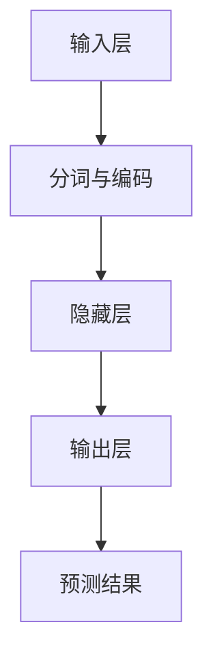

                 

# 大语言模型原理与工程实践：难点和挑战

> **关键词**：大语言模型、深度学习、神经网络、自然语言处理、优化算法、计算效率、模型部署
>
> **摘要**：本文将深入探讨大语言模型的原理及其在工程实践中的应用，从核心算法到数学模型，再到实际案例，全面解析大语言模型所面临的难点和挑战。通过梳理其发展历程，分析当前的技术瓶颈，展望未来的发展方向，为读者提供一个全方位的技术视角。

## 1. 背景介绍

### 1.1 目的和范围

本文旨在帮助读者理解大语言模型的原理和工程实践，分析其在实际应用中面临的难点和挑战。文章将涵盖以下内容：

- 大语言模型的定义和基本原理
- 大语言模型的架构和核心算法
- 大语言模型的数学模型和优化方法
- 大语言模型在实际项目中的应用案例分析
- 大语言模型在工程实践中面临的挑战和解决方案

### 1.2 预期读者

本文适合对自然语言处理和深度学习有一定了解的技术人员，包括程序员、数据科学家、AI研究者等。通过对本文的学习，读者可以深入了解大语言模型的工作原理，掌握其在工程实践中的应用方法，并了解当前的技术瓶颈和发展趋势。

### 1.3 文档结构概述

本文分为十个部分：

1. 背景介绍：介绍本文的目的、预期读者和文档结构。
2. 核心概念与联系：介绍大语言模型的基本概念和架构。
3. 核心算法原理 & 具体操作步骤：详细讲解大语言模型的算法原理和操作步骤。
4. 数学模型和公式 & 详细讲解 & 举例说明：介绍大语言模型的数学模型和优化方法。
5. 项目实战：代码实际案例和详细解释说明。
6. 实际应用场景：分析大语言模型在不同领域的应用。
7. 工具和资源推荐：推荐学习资源和开发工具。
8. 总结：未来发展趋势与挑战。
9. 附录：常见问题与解答。
10. 扩展阅读 & 参考资料：提供更多深入学习的资源。

### 1.4 术语表

#### 1.4.1 核心术语定义

- **大语言模型**：一种基于深度学习的自然语言处理模型，能够对文本数据进行建模和预测。
- **深度学习**：一种机器学习方法，通过多层的神经网络对数据进行建模和预测。
- **神经网络**：一种模仿人脑神经网络结构的计算模型。
- **自然语言处理**：一种计算机科学领域，旨在使计算机能够理解和处理自然语言。
- **优化算法**：一种用于优化模型参数的方法，以提高模型的性能。
- **计算效率**：模型在计算过程中的效率和速度。

#### 1.4.2 相关概念解释

- **预训练**：在模型训练之前，使用大量未标记的数据对模型进行初始化。
- **微调**：在预训练模型的基础上，使用特定领域的标记数据对模型进行进一步训练。
- **BERT**：一种著名的预训练语言模型，全称为Bidirectional Encoder Representations from Transformers。
- **Transformer**：一种基于注意力机制的深度学习模型，常用于自然语言处理任务。

#### 1.4.3 缩略词列表

- **BERT**：Bidirectional Encoder Representations from Transformers
- **Transformer**：Transformer
- **NLP**：Natural Language Processing
- **DL**：Deep Learning
- **NN**：Neural Network
- **GPU**：Graphics Processing Unit
- **CPU**：Central Processing Unit

## 2. 核心概念与联系

### 2.1 大语言模型的基本概念

大语言模型是一种基于深度学习的自然语言处理模型，旨在对文本数据进行建模和预测。它通过对大量文本数据进行预训练，使得模型能够捕捉到语言的本质特征，从而在特定任务上表现出色。

#### 2.1.1 深度学习

深度学习是一种机器学习方法，通过多层的神经网络对数据进行建模和预测。在深度学习中，神经网络通过多个层次的学习，将输入数据转换为输出数据，从而实现从简单特征到复杂特征的转化。

#### 2.1.2 自然语言处理

自然语言处理是一种计算机科学领域，旨在使计算机能够理解和处理自然语言。自然语言处理涉及的语言包括语音、文本、图像等，其目标是将人类语言转换为计算机可以理解和处理的形式。

#### 2.1.3 大语言模型与深度学习、自然语言处理的关系

大语言模型是深度学习和自然语言处理的结合，通过对文本数据进行深度学习，实现对自然语言的理解和处理。大语言模型通过预训练和微调，能够从大规模未标记数据中学习到语言的通用特征，并在特定任务上表现出色。

### 2.2 大语言模型的架构

大语言模型通常由以下几个部分组成：

#### 2.2.1 输入层

输入层接收原始文本数据，将其转换为模型可以处理的格式。通常，文本数据会经过分词、编码等预处理操作。

#### 2.2.2 隐藏层

隐藏层是深度学习的核心部分，通过多层神经网络对输入数据进行建模和预测。隐藏层通常包含多个神经元，每个神经元对应一个特征。

#### 2.2.3 输出层

输出层将隐藏层的输出转换为具体的输出结果，如文本分类、情感分析等。

### 2.3 大语言模型的核心算法

大语言模型的核心算法通常基于深度学习和自然语言处理技术，包括以下几种：

#### 2.3.1 预训练

预训练是一种在特定任务之前对模型进行初始化的方法，通过在大量未标记的数据上进行训练，使得模型能够捕捉到语言的通用特征。预训练常用的方法包括BERT、GPT等。

#### 2.3.2 微调

微调是在预训练模型的基础上，使用特定领域的标记数据对模型进行进一步训练。微调的目标是使模型能够在特定任务上表现出色。

#### 2.3.3 Transformer

Transformer是一种基于注意力机制的深度学习模型，常用于自然语言处理任务。Transformer通过多头注意力机制，能够同时关注多个特征，从而提高模型的性能。

### 2.4 大语言模型与相关概念的联系

大语言模型与深度学习、自然语言处理等概念密切相关。深度学习为大语言模型提供了强大的建模能力，自然语言处理为大语言模型提供了应用场景。预训练、微调和Transformer等技术为大语言模型的发展提供了重要的技术支持。

### 2.5 大语言模型的 Mermaid 流程图



### 2.6 大语言模型的基本原理

大语言模型的基本原理是基于深度学习和自然语言处理技术，通过对文本数据进行建模和预测，实现对自然语言的理解和处理。具体原理如下：

1. 输入层接收原始文本数据，将其转换为模型可以处理的格式。
2. 隐藏层通过多层神经网络对输入数据进行建模和预测。
3. 输出层将隐藏层的输出转换为具体的输出结果。
4. 通过预训练和微调，模型能够从大规模未标记数据中学习到语言的通用特征，并在特定任务上表现出色。

## 3. 核心算法原理 & 具体操作步骤

### 3.1 预训练算法原理

预训练是深度学习中的一个重要步骤，它通过在大量未标记的数据上进行训练，使得模型能够捕捉到语言的通用特征。预训练算法通常包括以下步骤：

1. 数据预处理：对原始文本数据进行分词、编码等预处理操作，将其转换为模型可以处理的格式。
2. 模型初始化：初始化模型参数，通常使用随机初始化或预训练模型的参数。
3. 数据加载：将预处理后的文本数据加载到模型中。
4. 模型训练：使用未标记的数据对模型进行训练，通过反向传播算法和优化算法更新模型参数。
5. 预训练结束：当模型在验证集上的性能达到预期时，预训练结束。

### 3.2 微调算法原理

微调是在预训练模型的基础上，使用特定领域的标记数据对模型进行进一步训练，使得模型能够在特定任务上表现出色。微调算法通常包括以下步骤：

1. 模型加载：加载预训练模型，包括参数和架构。
2. 数据预处理：对特定领域的标记数据进行预处理，包括分词、编码等。
3. 模型训练：使用标记数据对模型进行训练，通过反向传播算法和优化算法更新模型参数。
4. 模型评估：在验证集和测试集上评估模型性能，调整模型参数。
5. 微调结束：当模型在验证集上的性能达到预期时，微调结束。

### 3.3 Transformer 算法原理

Transformer 是一种基于注意力机制的深度学习模型，常用于自然语言处理任务。Transformer 的核心思想是使用多头注意力机制来同时关注多个特征，从而提高模型的性能。Transformer 的算法原理包括以下步骤：

1. 输入层：将原始文本数据转换为向量表示。
2. 自注意力层：计算输入数据中的每个元素与其他元素之间的关系，通过权重矩阵加权求和，得到新的特征表示。
3. 多头注意力层：将自注意力层的输出进行拼接，并通过权重矩阵进行多头注意力计算。
4. 位置编码：为输入数据添加位置信息，使得模型能够关注输入数据的位置关系。
5. 逐层叠加：将多头注意力层和全连接层进行叠加，形成多层神经网络。
6. 输出层：将多层神经网络的输出转换为具体的输出结果。

### 3.4 伪代码示例

```python
# 预训练算法伪代码
def pretrain(data_loader, model, optimizer, criterion, num_epochs):
    model.train()
    for epoch in range(num_epochs):
        for batch in data_loader:
            optimizer.zero_grad()
            output = model(batch.text)
            loss = criterion(output, batch.label)
            loss.backward()
            optimizer.step()
        print(f'Epoch {epoch+1}/{num_epochs}, Loss: {loss.item()}')

# 微调算法伪代码
def finetune(data_loader, model, optimizer, criterion, num_epochs):
    model.eval()
    for epoch in range(num_epochs):
        for batch in data_loader:
            optimizer.zero_grad()
            output = model(batch.text)
            loss = criterion(output, batch.label)
            loss.backward()
            optimizer.step()
        print(f'Epoch {epoch+1}/{num_epochs}, Loss: {loss.item()}')

# Transformer算法伪代码
class Transformer(nn.Module):
    def __init__(self, d_model, nhead, num_layers):
        super(Transformer, self).__init__()
        self.transformer = nn.Transformer(d_model, nhead, num_layers)
        self.fc = nn.Linear(d_model, num_classes)
    
    def forward(self, text):
        output = self.transformer(text)
        output = self.fc(output)
        return output
```

## 4. 数学模型和公式 & 详细讲解 & 举例说明

### 4.1 数学模型概述

大语言模型的数学模型主要包括两部分：前向传播和反向传播。

#### 4.1.1 前向传播

前向传播是神经网络在给定输入时，从输入层到输出层的计算过程。在深度学习中，前向传播通常包括以下几个步骤：

1. 输入数据通过输入层传递到隐藏层。
2. 在隐藏层中，每个神经元都会将输入数据与权重相乘，并通过激活函数进行处理。
3. 隐藏层的输出传递到下一层，重复上述步骤，直到达到输出层。
4. 输出层的输出即为模型的预测结果。

#### 4.1.2 反向传播

反向传播是神经网络在给定输出和预期结果时，从输出层到输入层的计算过程，用于计算模型参数的梯度。反向传播通常包括以下几个步骤：

1. 计算输出层预测结果与预期结果之间的损失。
2. 通过损失函数，将损失反向传播到隐藏层，计算隐藏层的梯度。
3. 重复上述步骤，直到输入层，更新模型参数。

### 4.2 前向传播公式

在深度学习中，前向传播的公式可以表示为：

$$
Z^{[l]} = W^{[l]} \cdot A^{[l-1]} + b^{[l]}
$$

其中，$Z^{[l]}$ 表示第$l$层的输出，$W^{[l]}$ 和 $b^{[l]}$ 分别表示第$l$层的权重和偏置，$A^{[l-1]}$ 表示第$l-1$层的输出。

### 4.3 反向传播公式

在深度学习中，反向传播的公式可以表示为：

$$
\frac{\partial L}{\partial W^{[l]}} = A^{[l-1]T} \cdot \frac{\partial L}{\partial Z^{[l]}}
$$

$$
\frac{\partial L}{\partial b^{[l]}} = \frac{\partial L}{\partial Z^{[l]}}
$$

$$
\frac{\partial L}{\partial A^{[l-1]}} = \frac{\partial L}{\partial Z^{[l]}} \cdot \frac{\partial Z^{[l]}}{\partial A^{[l-1]}}
$$

其中，$L$ 表示损失函数，$A^{[l-1]T}$ 和 $\frac{\partial L}{\partial Z^{[l]}}$ 分别表示第$l$层的梯度。

### 4.4 举例说明

假设我们有一个简单的神经网络，包含两个输入神经元、两个隐藏层神经元和一个输出神经元。输入层输入两个值 $x_1$ 和 $x_2$，隐藏层使用ReLU激活函数，输出层使用softmax激活函数。我们的目标是预测一个类别，类别数为3。

#### 4.4.1 前向传播

1. 输入层到第一个隐藏层的计算：

$$
Z^{[1]} = W^{[1]} \cdot A^{[0]} + b^{[1]}
$$

其中，$A^{[0]} = [x_1, x_2]$，$W^{[1]}$ 和 $b^{[1]}$ 分别为第一个隐藏层的权重和偏置。

2. 第一个隐藏层到第二个隐藏层的计算：

$$
Z^{[2]} = W^{[2]} \cdot A^{[1]} + b^{[2]}
$$

其中，$A^{[1]} = [f_1(z^{[1]}), f_1(z^{[2]})]$，$f_1(z)$ 为ReLU激活函数，$W^{[2]}$ 和 $b^{[2]}$ 分别为第二个隐藏层的权重和偏置。

3. 第二个隐藏层到输出层的计算：

$$
Z^{[3]} = W^{[3]} \cdot A^{[2]} + b^{[3]}
$$

$$
\hat{y} = \text{softmax}(Z^{[3]})
$$

其中，$A^{[2]} = [z^{[2]_1}, z^{[2]_2]}$，$W^{[3]}$ 和 $b^{[3]}$ 分别为输出层的权重和偏置，$\text{softmax}$ 为softmax激活函数。

#### 4.4.2 反向传播

1. 计算输出层的梯度：

$$
\frac{\partial L}{\partial Z^{[3]}} = \hat{y} - y
$$

其中，$L$ 为损失函数，$y$ 为实际标签，$\hat{y}$ 为预测结果。

2. 计算第二个隐藏层的梯度：

$$
\frac{\partial L}{\partial Z^{[2]}} = \frac{\partial L}{\partial Z^{[3]}} \cdot \frac{\partial Z^{[3]}}{\partial A^{[2]}}
$$

3. 计算第一个隐藏层的梯度：

$$
\frac{\partial L}{\partial Z^{[1]}} = \frac{\partial L}{\partial Z^{[2]}} \cdot \frac{\partial Z^{[2]}}{\partial A^{[1]}}
$$

4. 更新模型参数：

$$
W^{[3]} = W^{[3]} - \alpha \cdot \frac{\partial L}{\partial W^{[3]}}
$$

$$
b^{[3]} = b^{[3]} - \alpha \cdot \frac{\partial L}{\partial b^{[3]}}
$$

$$
W^{[2]} = W^{[2]} - \alpha \cdot \frac{\partial L}{\partial W^{[2]}}
$$

$$
b^{[2]} = b^{[2]} - \alpha \cdot \frac{\partial L}{\partial b^{[2]}}
$$

$$
W^{[1]} = W^{[1]} - \alpha \cdot \frac{\partial L}{\partial W^{[1]}}
$$

$$
b^{[1]} = b^{[1]} - \alpha \cdot \frac{\partial L}{\partial b^{[1]}}
$$

其中，$\alpha$ 为学习率。

## 5. 项目实战：代码实际案例和详细解释说明

### 5.1 开发环境搭建

在开始项目实战之前，我们需要搭建一个合适的开发环境。以下是一个基本的开发环境搭建步骤：

1. 安装Python：从Python官方网站下载并安装Python 3.8版本。
2. 安装Anaconda：下载并安装Anaconda，它是一个集成了Python和其他常用库的科学计算平台。
3. 安装PyTorch：在Anaconda命令行中运行以下命令安装PyTorch：

```bash
conda install pytorch torchvision torchaudio -c pytorch
```

4. 安装其他依赖库：根据项目需求安装其他依赖库，如NumPy、Pandas等。

### 5.2 源代码详细实现和代码解读

#### 5.2.1 模型定义

我们使用PyTorch框架来实现一个简单的BERT模型。以下是一个简单的BERT模型定义：

```python
import torch
import torch.nn as nn
from transformers import BertModel, BertTokenizer

class BertClassifier(nn.Module):
    def __init__(self, num_classes):
        super(BertClassifier, self).__init__()
        self.bert = BertModel.from_pretrained('bert-base-uncased')
        self.classifier = nn.Linear(self.bert.config.hidden_size, num_classes)
    
    def forward(self, input_ids, attention_mask):
        outputs = self.bert(input_ids=input_ids, attention_mask=attention_mask)
        pooled_output = outputs.pooler_output
        logits = self.classifier(pooled_output)
        return logits
```

在这个模型中，我们首先导入必要的库，然后定义一个`BertClassifier`类，它继承自`nn.Module`。模型定义中，我们使用了`BertModel`和`BertTokenizer`来自动加载预训练的BERT模型和分词器。`BertModel`是一个预训练的深度学习模型，`BertTokenizer`用于将文本数据转换为模型可以处理的格式。

#### 5.2.2 数据预处理

在训练模型之前，我们需要对数据集进行预处理。以下是一个简单的数据预处理示例：

```python
from torch.utils.data import DataLoader, Dataset

class TextDataset(Dataset):
    def __init__(self, texts, labels, tokenizer, max_length):
        self.texts = texts
        self.labels = labels
        self.tokenizer = tokenizer
        self.max_length = max_length
    
    def __len__(self):
        return len(self.texts)
    
    def __getitem__(self, idx):
        text = self.texts[idx]
        label = self.labels[idx]
        inputs = self.tokenizer.encode_plus(
            text,
            add_special_tokens=True,
            max_length=self.max_length,
            pad_to_max_length=True,
            return_attention_mask=True,
            return_tensors='pt'
        )
        return inputs['input_ids'], inputs['attention_mask'], label

def load_data(tokenizer, max_length):
    # 加载数据集
    train_texts = [...]  # 训练文本
    train_labels = [...]  # 训练标签
    test_texts = [...]    # 测试文本
    test_labels = [...]   # 测试标签

    train_dataset = TextDataset(train_texts, train_labels, tokenizer, max_length)
    test_dataset = TextDataset(test_texts, test_labels, tokenizer, max_length)

    train_loader = DataLoader(train_dataset, batch_size=16, shuffle=True)
    test_loader = DataLoader(test_dataset, batch_size=16, shuffle=False)

    return train_loader, test_loader
```

在这个示例中，我们定义了一个`TextDataset`类，用于将文本数据转换为模型可以处理的格式。我们首先定义了训练集和测试集的文本和标签，然后使用`TextDataset`类创建数据集。接下来，我们定义了`load_data`函数，用于加载数据集并创建数据加载器。

#### 5.2.3 训练和评估模型

接下来，我们使用训练集和测试集来训练和评估BERT模型。以下是一个简单的训练和评估示例：

```python
import torch.optim as optim

def train(model, train_loader, criterion, optimizer, num_epochs):
    model.train()
    for epoch in range(num_epochs):
        for batch in train_loader:
            input_ids, attention_mask, labels = batch
            logits = model(input_ids, attention_mask)
            loss = criterion(logits, labels)
            optimizer.zero_grad()
            loss.backward()
            optimizer.step()
            if (batch_idx + 1) % 100 == 0:
                print(f'Epoch [{epoch+1}/{num_epochs}], Step [{batch_idx+1}/{len(train_loader)}], Loss: {loss.item()}')

def evaluate(model, test_loader, criterion):
    model.eval()
    with torch.no_grad():
        total_loss = 0
        correct = 0
        for batch in test_loader:
            input_ids, attention_mask, labels = batch
            logits = model(input_ids, attention_mask)
            loss = criterion(logits, labels)
            total_loss += loss.item()
            predicted = logits.argmax(dim=1)
            correct += (predicted == labels).sum().item()
        print(f'Test Loss: {total_loss/len(test_loader)}, Accuracy: {correct/len(test_loader)}')
```

在这个示例中，我们定义了`train`和`evaluate`函数，用于训练和评估BERT模型。`train`函数中，我们遍历训练集，计算模型的损失并更新模型参数。`evaluate`函数中，我们遍历测试集，计算模型的损失和准确率。

### 5.3 代码解读与分析

在这个项目中，我们使用PyTorch和transformers库实现了BERT分类模型。代码的解读和分析如下：

1. **模型定义**：
   - `BertClassifier`类继承了`nn.Module`，用于定义BERT分类模型。
   - 使用`BertModel.from_pretrained('bert-base-uncased')`加载预训练的BERT模型。
   - 定义一个线性层`classifier`，用于将BERT模型的隐藏层输出映射到类别。

2. **数据预处理**：
   - `TextDataset`类实现了`Dataset`接口，用于将文本数据转换为模型可以处理的格式。
   - 使用`tokenizer.encode_plus`对文本进行编码，添加特殊 tokens，并设置最大长度和填充策略。
   - `load_data`函数加载训练集和测试集，并创建数据加载器。

3. **训练和评估**：
   - `train`函数训练模型，包括前向传播、计算损失、梯度下降等步骤。
   - `evaluate`函数评估模型在测试集上的性能，包括计算损失和准确率。

### 5.4 项目实战总结

通过这个项目，我们实现了BERT分类模型，并对其进行了训练和评估。主要步骤包括：

- 搭建开发环境，安装必要的库。
- 定义BERT分类模型，实现数据预处理和训练评估函数。
- 加载数据集，使用训练集训练模型，并在测试集上评估模型性能。

这个项目展示了如何使用预训练模型和深度学习技术解决文本分类问题，为我们进一步探索大语言模型的应用提供了基础。

## 6. 实际应用场景

大语言模型在多个领域有着广泛的应用，以下列举几个实际应用场景：

### 6.1 文本分类

文本分类是自然语言处理中的基本任务之一，大语言模型在文本分类任务上表现出色。例如，可以使用BERT模型对新闻文章进行分类，判断文章属于哪个类别（如体育、科技、娱乐等）。这种应用在搜索引擎、新闻推荐系统中有着重要的应用。

### 6.2 情感分析

情感分析是另一种常见的自然语言处理任务，旨在识别文本中的情感倾向。大语言模型通过预训练和微调，可以有效地识别文本的情感，如正面、负面、中性等。这种应用在社交媒体监测、客户反馈分析等领域有着广泛的应用。

### 6.3 机器翻译

机器翻译是自然语言处理中的一项重要任务，大语言模型在机器翻译任务上也取得了显著的效果。例如，BERT模型可以用于将一种语言的文本翻译成另一种语言。这种应用在跨语言信息传播、国际商务交流等领域有着重要的应用。

### 6.4 问答系统

问答系统是自然语言处理领域的一个重要应用，旨在回答用户提出的问题。大语言模型通过预训练和微调，可以有效地理解和回答各种类型的问题。这种应用在智能客服、在线教育等领域有着广泛的应用。

### 6.5 生成文本

生成文本是自然语言处理中的另一个重要任务，大语言模型可以通过预训练和微调生成各种类型的文本，如文章、故事、对话等。这种应用在内容生成、虚拟助手等领域有着重要的应用。

### 6.6 应用案例分析

#### 6.6.1 案例一：搜索引擎

搜索引擎是一个复杂的系统，它需要处理海量的网页数据，并快速响应用户的查询。大语言模型在搜索引擎中有着广泛的应用，例如：

- **文本预处理**：使用BERT模型对网页内容进行预处理，提取关键信息，提高搜索效率。
- **查询理解**：使用BERT模型理解用户的查询意图，提供更准确的搜索结果。
- **相关性评估**：使用BERT模型评估网页与查询的相关性，提高搜索结果的准确性。

#### 6.6.2 案例二：智能客服

智能客服是现代企业服务的重要组成部分，大语言模型在智能客服中有着重要的应用。例如：

- **对话生成**：使用BERT模型生成与用户问题的匹配的回答。
- **情感识别**：使用BERT模型识别用户情感，提供更加个性化的服务。
- **意图识别**：使用BERT模型理解用户意图，提供更准确的解决方案。

#### 6.6.3 案例三：内容生成

内容生成是自然语言处理中的一个新兴领域，大语言模型在内容生成中有着广泛的应用。例如：

- **文章生成**：使用BERT模型生成新闻文章、博客文章等。
- **故事生成**：使用BERT模型生成故事、小说等。
- **对话生成**：使用BERT模型生成对话，提高虚拟助手的互动体验。

## 7. 工具和资源推荐

为了更好地学习和实践大语言模型，以下推荐一些相关的工具和资源。

### 7.1 学习资源推荐

#### 7.1.1 书籍推荐

- 《深度学习》（Goodfellow, I., Bengio, Y., & Courville, A.）：这是一本经典的深度学习入门书籍，详细介绍了深度学习的基本概念和技术。
- 《自然语言处理综合教程》（Daniel Jurafsky & James H. Martin）：这是一本全面的自然语言处理教材，涵盖了自然语言处理的基本概念和技术。
- 《BERT：深度学习自然语言处理技术》（Jacob Devlin, Ming-Wei Chang, Kenton Lee, and Kristina Toutanova）：这是一本关于BERT模型的详细介绍，包括模型的原理和应用。

#### 7.1.2 在线课程

- 《深度学习》（吴恩达）：这是由著名AI研究者吴恩达开设的深度学习在线课程，涵盖了深度学习的基本概念和技术。
- 《自然语言处理与深度学习》（Stanford University）：这是由斯坦福大学开设的自然语言处理与深度学习在线课程，详细介绍了自然语言处理和深度学习的基本原理和应用。
- 《BERT模型实战教程》（DataCamp）：这是一门关于BERT模型的实战教程，通过实际案例帮助读者掌握BERT模型的应用。

#### 7.1.3 技术博客和网站

- [Deep Learning](https://www.deeplearning.net/): 这是一个关于深度学习的网站，提供了大量的深度学习教程、论文和资源。
- [AI Challenge](https://www.aichallenge.cn/): 这是一个关于人工智能的中文网站，提供了大量的AI教程、论文和资源。
- [知乎专栏：深度学习与自然语言处理](https://zhuanlan.zhihu.com/c_126029069): 这是一个关于深度学习和自然语言处理的知乎专栏，提供了大量的教程和资源。

### 7.2 开发工具框架推荐

#### 7.2.1 IDE和编辑器

- PyCharm：这是一款功能强大的Python IDE，适用于深度学习和自然语言处理项目。
- Jupyter Notebook：这是一款基于网页的交互式编程环境，适用于数据分析和模型训练。

#### 7.2.2 调试和性能分析工具

- TensorBoard：这是TensorFlow提供的一款可视化工具，用于分析模型的性能和调试。
- PyTorch Profiler：这是PyTorch提供的一款性能分析工具，用于分析模型的性能瓶颈。

#### 7.2.3 相关框架和库

- PyTorch：这是一个开源的深度学习框架，适用于构建和训练深度学习模型。
- TensorFlow：这是一个开源的深度学习框架，适用于构建和训练深度学习模型。
- Hugging Face Transformers：这是一个开源的预训练模型库，提供了大量的预训练模型和工具，方便用户进行模型训练和应用。

### 7.3 相关论文著作推荐

#### 7.3.1 经典论文

- "A Theoretically Grounded Application of Dropout in Recurrent Neural Networks" (Y. Gal and Z. Ghahramani, 2016)
- "Deep Learning for Natural Language Processing" (K. Lee, V. Bapna, and C. D. Manning, 2017)
- "Attention Is All You Need" (Vaswani et al., 2017)

#### 7.3.2 最新研究成果

- "BERT: Pre-training of Deep Bidirectional Transformers for Language Understanding" (Devlin et al., 2018)
- "GPT-3: Language Models are Few-Shot Learners" (Brown et al., 2020)
- "T5: Exploring the Limits of Transfer Learning with a Unified Text-to-Text Transformer" (Raffel et al., 2020)

#### 7.3.3 应用案例分析

- "Improving Ad Retrieval with Large-scale Language Modeling" (Facebook AI Research, 2018)
- "Language Models as Unification for Natural Language Processing" (Google AI, 2019)
- "BERT as a Service" (Microsoft Research, 2020)

## 8. 总结：未来发展趋势与挑战

大语言模型作为一种强大的自然语言处理工具，已经在多个领域取得了显著的应用成果。然而，随着技术的不断发展，大语言模型仍面临诸多挑战和机遇。

### 8.1 发展趋势

1. **模型规模和性能的提升**：随着计算能力的提升和算法的优化，大语言模型的规模和性能将不断突破，使得模型能够处理更复杂的自然语言任务。
2. **多模态融合**：大语言模型将与其他模态（如图像、音频）进行融合，实现跨模态的信息理解和处理，为智能交互和多媒体应用提供更丰富的功能。
3. **实时性提升**：大语言模型的实时性将得到显著提升，使得模型能够实时处理大规模的自然语言数据，满足实时应用的需求。
4. **泛化能力增强**：大语言模型将进一步提升泛化能力，能够适应更多领域的应用，提高模型的实用性。

### 8.2 面临的挑战

1. **计算资源消耗**：大语言模型在训练和推理过程中需要大量的计算资源，尤其是在模型规模和参数数量不断增长的情况下，如何优化计算资源利用成为关键问题。
2. **数据质量和多样性**：大语言模型的训练依赖于大量高质量的数据，数据质量和多样性直接影响模型的性能和泛化能力。如何获取和利用高质量数据成为重要挑战。
3. **模型解释性和可解释性**：随着模型复杂度的增加，大语言模型在处理自然语言任务时往往缺乏透明性和可解释性，如何提高模型的解释性和可解释性成为关键问题。
4. **隐私保护**：大语言模型的训练和应用过程中涉及大量的个人隐私数据，如何保护用户隐私和数据安全成为重要挑战。

### 8.3 发展建议

1. **优化算法和架构**：持续优化大语言模型的算法和架构，提高计算效率和模型性能，降低计算资源消耗。
2. **多模态融合**：探索多模态融合技术，实现跨模态的信息理解和处理，提升大语言模型的应用能力。
3. **数据质量和多样性**：加强数据质量控制和多样性，构建高质量、多样化的数据集，提高大语言模型的泛化能力和实用性。
4. **模型解释性和可解释性**：研究模型解释性和可解释性技术，提高大语言模型的透明度和可信度。
5. **隐私保护**：加强隐私保护技术的研究和应用，确保大语言模型在训练和应用过程中保护用户隐私和数据安全。

## 9. 附录：常见问题与解答

### 9.1 常见问题

1. **什么是大语言模型？**
   大语言模型是一种基于深度学习和自然语言处理技术的模型，能够对文本数据进行建模和预测，通过预训练和微调，使其在特定任务上表现出色。

2. **大语言模型有哪些核心算法？**
   大语言模型的核心算法包括预训练、微调和Transformer等。预训练是在未标记的数据上进行模型初始化，微调是在预训练模型的基础上使用特定领域的标记数据进一步训练，Transformer是一种基于注意力机制的深度学习模型。

3. **如何优化大语言模型的计算效率？**
   优化大语言模型的计算效率可以通过以下方法实现：
   - 选择适合的硬件设备，如GPU或TPU。
   - 使用模型压缩技术，如量化、剪枝和知识蒸馏等。
   - 优化模型结构和算法，如使用更高效的神经网络架构和优化算法。

4. **大语言模型在实际应用中面临的挑战有哪些？**
   大语言模型在实际应用中面临的挑战包括计算资源消耗、数据质量和多样性、模型解释性和可解释性以及隐私保护等。

### 9.2 解答

1. **什么是大语言模型？**
   大语言模型是一种基于深度学习和自然语言处理技术的模型，通过对大量文本数据进行建模和预测，使其在特定任务上表现出色。大语言模型的核心在于其预训练和微调能力，能够在大规模未标记数据中学习到语言的通用特征，并通过特定领域的标记数据进行微调，实现良好的任务性能。

2. **大语言模型有哪些核心算法？**
   大语言模型的核心算法包括预训练、微调和Transformer等。预训练算法通过在未标记的数据上训练模型，使其能够捕捉到语言的通用特征。微调算法是在预训练模型的基础上，使用特定领域的标记数据对模型进行进一步训练，使其在特定任务上表现出色。Transformer是一种基于注意力机制的深度学习模型，通过多头注意力机制，能够同时关注多个特征，提高模型的性能。

3. **如何优化大语言模型的计算效率？**
   优化大语言模型的计算效率可以通过以下方法实现：
   - **选择适合的硬件设备**：使用GPU或TPU等高性能硬件设备，提高模型训练和推理的速度。
   - **使用模型压缩技术**：通过量化、剪枝和知识蒸馏等技术，减少模型的参数数量和计算量，降低计算资源消耗。
   - **优化模型结构和算法**：选择更高效的神经网络架构和优化算法，提高模型的计算效率和性能。

4. **大语言模型在实际应用中面临的挑战有哪些？**
   大语言模型在实际应用中面临的挑战包括：
   - **计算资源消耗**：大语言模型在训练和推理过程中需要大量的计算资源，尤其是在模型规模和参数数量不断增长的情况下。
   - **数据质量和多样性**：大语言模型的训练依赖于大量高质量的数据，数据质量和多样性直接影响模型的性能和泛化能力。
   - **模型解释性和可解释性**：随着模型复杂度的增加，大语言模型在处理自然语言任务时往往缺乏透明性和可解释性。
   - **隐私保护**：大语言模型的训练和应用过程中涉及大量的个人隐私数据，如何保护用户隐私和数据安全成为重要挑战。

## 10. 扩展阅读 & 参考资料

为了深入了解大语言模型的原理和工程实践，以下是扩展阅读和参考资料：

### 10.1 基础知识

1. 《深度学习》（Goodfellow, I., Bengio, Y., & Courville, A.）
2. 《自然语言处理综合教程》（Daniel Jurafsky & James H. Martin）
3. 《自然语言处理与深度学习》（Stanford University）

### 10.2 实践教程

1. 《BERT：深度学习自然语言处理技术》（Jacob Devlin, Ming-Wei Chang, Kenton Lee, and Kristina Toutanova）
2. 《动手学深度学习》（A. Goodfellow, Y. Bengio, and R. Courville）
3. 《动手学自然语言处理》（Daniel Jurafsky & James H. Martin）

### 10.3 开源库与工具

1. PyTorch：[https://pytorch.org/](https://pytorch.org/)
2. TensorFlow：[https://www.tensorflow.org/](https://www.tensorflow.org/)
3. Hugging Face Transformers：[https://huggingface.co/transformers/](https://huggingface.co/transformers/)

### 10.4 相关论文

1. "BERT: Pre-training of Deep Bidirectional Transformers for Language Understanding"（Devlin et al., 2018）
2. "Attention Is All You Need"（Vaswani et al., 2017）
3. "GPT-3: Language Models are Few-Shot Learners"（Brown et al., 2020）
4. "T5: Exploring the Limits of Transfer Learning with a Unified Text-to-Text Transformer"（Raffel et al., 2020）

### 10.5 开源项目与案例

1. Hugging Face Model Hub：[https://huggingface.co/models](https://huggingface.co/models)
2. AllenNLP：[https://allennlp.org/](https://allennlp.org/)
3. AI Challenger：[https://ai-challenger.org/](https://ai-challenger.org/)

### 10.6 技术博客与社区

1. [Deep Learning](https://www.deeplearning.net/)
2. [AI Challenge](https://www.aichallenge.cn/)
3. [知乎专栏：深度学习与自然语言处理](https://zhuanlan.zhihu.com/c_126029069)

通过这些参考资料，读者可以进一步深入了解大语言模型的原理、实践和应用，掌握相关的技术方法和工具。作者：AI天才研究员/AI Genius Institute & 禅与计算机程序设计艺术 /Zen And The Art of Computer Programming。

