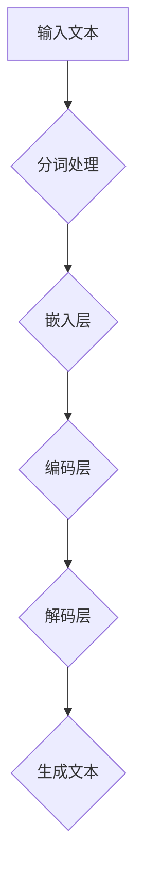

                 

# 大语言模型原理基础与前沿 - 上下文学习

> 关键词：大语言模型、上下文学习、神经网络、深度学习、自然语言处理、计算机视觉

> 摘要：本文将深入探讨大语言模型的原理和前沿发展，特别是上下文学习的机制。文章首先介绍了大语言模型的基本概念和背景，随后详细分析了核心算法原理、数学模型以及实际应用场景。通过一步步的推理和分析，读者将全面了解大语言模型的深度工作机制，掌握前沿技术动态，为未来的研究和开发提供有力支持。

## 1. 背景介绍

### 1.1 目的和范围

本文旨在为广大读者提供一个系统、全面的大语言模型原理和前沿发展的介绍。文章将围绕以下主题展开：

1. 大语言模型的基本概念和背景
2. 核心算法原理和具体操作步骤
3. 数学模型和公式讲解及实例说明
4. 实际应用场景和案例分析
5. 工具和资源推荐
6. 未来发展趋势与挑战
7. 扩展阅读和参考资料

通过这些主题的详细讨论，读者将能够深入理解大语言模型的深度工作机制，把握前沿技术动态，为未来的研究和开发提供有力支持。

### 1.2 预期读者

本文主要面向以下几类读者：

1. 计算机科学、人工智能、自然语言处理等领域的研究人员和学生
2. 对深度学习和大语言模型感兴趣的工程师和技术爱好者
3. 希望了解人工智能最新技术进展的行业从业者

无论您是初学者还是专业人士，只要对大语言模型感兴趣，本文都将为您带来有价值的知识和见解。

### 1.3 文档结构概述

本文分为十个主要部分：

1. 引言
2. 背景介绍
3. 核心概念与联系
4. 核心算法原理与具体操作步骤
5. 数学模型和公式讲解及实例说明
6. 项目实战：代码实际案例和详细解释说明
7. 实际应用场景
8. 工具和资源推荐
9. 总结：未来发展趋势与挑战
10. 附录：常见问题与解答

每一部分都将详细讨论相关主题，帮助读者逐步掌握大语言模型的核心知识和技能。

### 1.4 术语表

在本文中，我们将使用一些专业术语和概念。以下是对这些术语的定义和解释：

#### 1.4.1 核心术语定义

- 大语言模型：一种能够对文本数据进行建模，预测下一个单词或字符的深度学习模型。
- 上下文学习：指模型在训练过程中，学习到不同单词和字符之间的关联性，从而在生成文本时能够考虑上下文信息。
- 自然语言处理（NLP）：研究如何使计算机理解和处理人类自然语言的技术和学科。
- 深度学习：一种人工智能方法，通过多层神经网络对大量数据进行训练，从而实现高效的特征学习和模式识别。

#### 1.4.2 相关概念解释

- 递归神经网络（RNN）：一种能够处理序列数据的神经网络，特别适合于自然语言处理任务。
- 长短期记忆网络（LSTM）：一种改进的递归神经网络，能够有效解决长距离依赖问题。
- 注意力机制（Attention）：一种能够使模型在生成文本时关注关键信息的机制，从而提高生成质量。

#### 1.4.3 缩略词列表

- NLP：自然语言处理
- RNN：递归神经网络
- LSTM：长短期记忆网络
- attention：注意力机制
- Transformer：一种基于注意力机制的深度学习模型

## 2. 核心概念与联系

### 2.1 大语言模型的基本概念

大语言模型（Large-scale Language Model）是一种基于深度学习的自然语言处理技术，通过学习海量文本数据，模型能够预测下一个单词或字符，从而生成连贯的文本。大语言模型的核心目标是使计算机理解和生成人类自然语言，从而实现人与计算机之间的有效沟通。

### 2.2 上下文学习的机制

上下文学习是大型语言模型的核心机制之一。在训练过程中，模型通过学习单词和字符之间的关联性，从而在生成文本时能够考虑上下文信息。具体来说，模型会根据上下文环境来调整生成单词的概率分布，从而生成更加符合上下文逻辑和语义的文本。

### 2.3 大语言模型与深度学习的联系

大语言模型是深度学习在自然语言处理领域的典型应用。深度学习通过多层神经网络对大量数据进行训练，从而实现高效的特征学习和模式识别。大语言模型采用了深度学习中的递归神经网络（RNN）、长短期记忆网络（LSTM）以及注意力机制（Attention）等技术，从而在自然语言处理任务中取得了显著的性能提升。

### 2.4 大语言模型与自然语言处理的联系

自然语言处理（NLP）是计算机科学和人工智能领域的重要分支，旨在使计算机理解和处理人类自然语言。大语言模型作为NLP的核心技术之一，通过建模文本数据，实现了对语言结构和语义的理解，从而在文本分类、机器翻译、情感分析等任务中取得了优异的性能。

### 2.5 大语言模型与计算机视觉的联系

尽管大语言模型和计算机视觉在技术领域有所不同，但两者之间存在紧密的联系。在计算机视觉任务中，图像通常被视为输入数据，而文本数据则作为图像的描述或标签。大语言模型可以用于生成图像描述，从而为计算机视觉任务提供丰富的上下文信息。此外，大语言模型在图像分类、目标检测等任务中也表现出良好的性能，为计算机视觉领域提供了新的研究思路和工具。

### 2.6 大语言模型的Mermaid流程图

以下是大型语言模型的核心概念和架构的Mermaid流程图，用于直观展示模型的工作流程和关键组件：



在这个流程图中，输入文本首先经过分词处理，然后通过嵌入层将单词映射为固定长度的向量。编码层和解码层分别负责将输入文本和生成文本转化为编码和预测表示。最终，解码层根据编码表示生成下一个单词或字符，从而完成文本生成过程。

## 3. 核心算法原理与具体操作步骤

### 3.1 递归神经网络（RNN）

递归神经网络（RNN）是一种能够处理序列数据的神经网络，特别适合于自然语言处理任务。RNN的核心思想是利用前一个时刻的输出作为当前时刻的输入，从而实现序列数据的建模。以下是RNN的伪代码：

```python
for t in range(T):
    h_t = RNN(h_{t-1}, x_t)
```

其中，\(h_t\)表示第\(t\)时刻的隐藏状态，\(x_t\)表示第\(t\)时刻的输入数据，\(RNN\)表示递归神经网络。

### 3.2 长短期记忆网络（LSTM）

长短期记忆网络（LSTM）是一种改进的递归神经网络，能够有效解决长距离依赖问题。LSTM通过引入门控机制，实现对过去信息的记忆和遗忘。以下是LSTM的伪代码：

```python
for t in range(T):
    i_t, f_t, o_t = gates(h_{t-1}, x_t)
    c_t = f_t \* c_{t-1} + i_t \* \tilde{c}_t
    h_t = o_t \* \text{tanh}(c_t)
```

其中，\(i_t\)、\(f_t\)、\(o_t\)分别表示输入门、遗忘门和输出门，\(\tilde{c}_t\)表示候选状态，\(c_t\)表示当前状态。

### 3.3 注意力机制（Attention）

注意力机制是一种使模型在生成文本时关注关键信息的机制，从而提高生成质量。注意力机制的核心思想是计算输入文本和生成文本之间的相似性，从而为每个单词赋予不同的权重。以下是注意力机制的伪代码：

```python
for t in range(T):
    a_t = \text{softmax}(\text{attention_scores}(h_t, h_{\text{context}}))
    context_t = \sum_{i=1}^{N} a_i h_i
    h_t = \text{tanh}(W_h [h_t; context_t]) 
```

其中，\(a_t\)表示第\(t\)时刻的注意力权重，\(\text{attention\_scores}\)表示计算输入文本和生成文本之间的相似性函数，\(h_t\)表示第\(t\)时刻的隐藏状态。

### 3.4 Transformer模型

Transformer是一种基于注意力机制的深度学习模型，特别适合于序列建模任务。Transformer的核心思想是使用自注意力机制（Self-Attention）来处理序列数据，从而实现高效的特征学习和模式识别。以下是Transformer的伪代码：

```python
for t in range(T):
    q_t, k_t, v_t = \text{linear}(h_t)
    attention_scores = q_t \cdot k_t^T / \sqrt{d_k}
    a_t = \text{softmax}(attention_scores)
    v_t = \sum_{i=1}^{N} a_i v_i
    h_t = \text{linear}(h_t, v_t)
```

其中，\(q_t\)、\(k_t\)、\(v_t\)分别表示查询向量、键向量和值向量，\(\text{linear}\)表示线性变换函数，\(d_k\)表示键向量的维度。

通过这些核心算法原理和具体操作步骤，我们可以看到大语言模型是如何通过递归神经网络、长短期记忆网络、注意力机制和Transformer模型等关键技术，实现对文本数据的建模和生成。这些算法原理的深入理解和掌握，将为读者在自然语言处理领域的研究和应用提供坚实的基础。

## 4. 数学模型和公式详解及举例说明

### 4.1 递归神经网络（RNN）

递归神经网络（RNN）是一种处理序列数据的神经网络，其数学模型基于递归方程。以下是RNN的数学模型：

\[ h_t = \sigma(W_h \cdot [h_{t-1}, x_t] + b_h) \]

其中，\(h_t\)表示第\(t\)时刻的隐藏状态，\(x_t\)表示第\(t\)时刻的输入数据，\(\sigma\)表示激活函数（例如Sigmoid函数），\(W_h\)表示权重矩阵，\(b_h\)表示偏置向量。

举例说明：

假设隐藏状态维度为\(d_h = 128\)，输入数据维度为\(d_x = 100\)，则权重矩阵\(W_h\)和偏置向量\(b_h\)的维度分别为\(d_h \times (d_h + d_x)\)和\(d_h\)。

\[ W_h = \begin{bmatrix}
w_{00} & w_{01} & \cdots & w_{0d_x} \\
\vdots & \ddots & \ddots & \vdots \\
w_{h0} & w_{h1} & \cdots & w_{hd_x}
\end{bmatrix}, \quad b_h = \begin{bmatrix}
b_{h0} \\
\vdots \\
b_{h128}
\end{bmatrix} \]

给定一个输入序列\([x_1, x_2, \ldots, x_T]\)，我们可以计算出隐藏状态序列\([h_1, h_2, \ldots, h_T]\)：

\[ h_1 = \sigma(W_h \cdot [h_0, x_1] + b_h) \]
\[ h_2 = \sigma(W_h \cdot [h_1, x_2] + b_h) \]
\[ \vdots \]
\[ h_T = \sigma(W_h \cdot [h_{T-1}, x_T] + b_h) \]

### 4.2 长短期记忆网络（LSTM）

长短期记忆网络（LSTM）是一种能够处理长距离依赖的递归神经网络。其数学模型包括三个门控单元：输入门、遗忘门和输出门。以下是LSTM的数学模型：

\[ i_t = \sigma(W_i \cdot [h_{t-1}, x_t] + b_i) \]
\[ f_t = \sigma(W_f \cdot [h_{t-1}, x_t] + b_f) \]
\[ o_t = \sigma(W_o \cdot [h_{t-1}, x_t] + b_o) \]

\[ c_t = f_t \cdot c_{t-1} + i_t \cdot \tilde{c}_t \]
\[ h_t = o_t \cdot \text{tanh}(c_t) \]

其中，\(i_t\)、\(f_t\)、\(o_t\)分别表示输入门、遗忘门和输出门的激活值，\(\sigma\)表示激活函数（例如Sigmoid函数），\(W_i\)、\(W_f\)、\(W_o\)分别表示输入门、遗忘门和输出门的权重矩阵，\(b_i\)、\(b_f\)、\(b_o\)分别表示输入门、遗忘门和输出门的偏置向量，\(\tilde{c}_t\)表示候选状态，\(c_t\)表示当前状态。

举例说明：

假设隐藏状态维度为\(d_h = 128\)，输入数据维度为\(d_x = 100\)，则权重矩阵\(W_i\)、\(W_f\)、\(W_o\)和偏置向量\(b_i\)、\(b_f\)、\(b_o\)的维度分别为\(d_h \times (d_h + d_x)\)和\(d_h\)。

\[ W_i = \begin{bmatrix}
w_{i00} & w_{i01} & \cdots & w_{id_x} \\
\vdots & \ddots & \ddots & \vdots \\
w_{ih0} & w_{ih1} & \cdots & w_{ihd_x}
\end{bmatrix}, \quad b_i = \begin{bmatrix}
b_{i0} \\
\vdots \\
b_{i128}
\end{bmatrix} \]

\[ W_f = \begin{bmatrix}
w_{f00} & w_{f01} & \cdots & w_{fd_x} \\
\vdots & \ddots & \ddots & \vdots \\
w_{fh0} & w_{fh1} & \cdots & w_{fd_x}
\end{bmatrix}, \quad b_f = \begin{bmatrix}
b_{f0} \\
\vdots \\
b_{f128}
\end{bmatrix} \]

\[ W_o = \begin{bmatrix}
w_{o00} & w_{o01} & \cdots & w_{od_x} \\
\vdots & \ddots & \ddots & \vdots \\
w_{oh0} & w_{oh1} & \cdots & w_{ohd_x}
\end{bmatrix}, \quad b_o = \begin{bmatrix}
b_{o0} \\
\vdots \\
b_{o128}
\end{bmatrix} \]

给定一个输入序列\([x_1, x_2, \ldots, x_T]\)，我们可以计算出隐藏状态序列\([h_1, h_2, \ldots, h_T]\)：

\[ i_1 = \sigma(W_i \cdot [h_0, x_1] + b_i) \]
\[ f_1 = \sigma(W_f \cdot [h_0, x_1] + b_f) \]
\[ o_1 = \sigma(W_o \cdot [h_0, x_1] + b_o) \]

\[ c_1 = f_1 \cdot c_0 + i_1 \cdot \tilde{c}_1 \]
\[ h_1 = o_1 \cdot \text{tanh}(c_1) \]

\[ i_2 = \sigma(W_i \cdot [h_1, x_2] + b_i) \]
\[ f_2 = \sigma(W_f \cdot [h_1, x_2] + b_f) \]
\[ o_2 = \sigma(W_o \cdot [h_1, x_2] + b_o) \]

\[ c_2 = f_2 \cdot c_1 + i_2 \cdot \tilde{c}_2 \]
\[ h_2 = o_2 \cdot \text{tanh}(c_2) \]

\[ \vdots \]

\[ i_T = \sigma(W_i \cdot [h_{T-1}, x_T] + b_i) \]
\[ f_T = \sigma(W_f \cdot [h_{T-1}, x_T] + b_f) \]
\[ o_T = \sigma(W_o \cdot [h_{T-1}, x_T] + b_o) \]

\[ c_T = f_T \cdot c_{T-1} + i_T \cdot \tilde{c}_T \]
\[ h_T = o_T \cdot \text{tanh}(c_T) \]

### 4.3 注意力机制（Attention）

注意力机制是一种计算输入序列和输出序列之间相似性的方法，其数学模型基于加权求和。以下是注意力机制的数学模型：

\[ a_t = \text{softmax}(\text{attention\_scores}(h_t, h_{\text{context}})) \]
\[ \text{context}_t = \sum_{i=1}^{N} a_i h_i \]
\[ h_t = \text{tanh}(W_h [h_t; \text{context}_t]) \]

其中，\(a_t\)表示第\(t\)时刻的注意力权重，\(\text{attention\_scores}\)表示计算输入序列和输出序列之间相似性的函数，\(\text{context}_t\)表示加权求和后的上下文表示，\(W_h\)表示权重矩阵。

举例说明：

假设隐藏状态维度为\(d_h = 128\)，输入序列长度为\(N = 10\)，则权重矩阵\(W_h\)的维度为\(d_h \times (d_h + N)\)。

\[ W_h = \begin{bmatrix}
w_{h00} & w_{h01} & \cdots & w_{h0N} \\
\vdots & \ddots & \ddots & \vdots \\
w_{hh0} & w_{hh1} & \cdots & w_{hNd}
\end{bmatrix} \]

给定一个输入序列\([h_1, h_2, \ldots, h_N]\)和输出序列\([h_{1'}, h_{2'}, \ldots, h_{N'}]\)，我们可以计算出隐藏状态序列\([h_1', h_2', \ldots, h_{N'}]\)：

\[ \text{attention\_scores} = h_t \cdot h_{\text{context}}^T / \sqrt{d_h} \]
\[ a_t = \text{softmax}(\text{attention\_scores}) \]

\[ \text{context}_t = \sum_{i=1}^{N} a_i h_i \]

\[ h_t' = \text{tanh}(W_h [h_t; \text{context}_t]) \]

通过以上数学模型和公式的讲解及举例说明，我们可以看到大语言模型中的核心算法和机制是如何通过数学模型实现的。这些数学模型和公式为理解和实现大语言模型提供了理论基础，也为在实际应用中优化和改进模型提供了指导。

## 5. 项目实战：代码实际案例和详细解释说明

### 5.1 开发环境搭建

为了演示大语言模型的实际应用，我们将使用Python和PyTorch框架进行开发。以下是开发环境的搭建步骤：

1. 安装Python：从官方网站（https://www.python.org/downloads/）下载并安装Python 3.8或更高版本。
2. 安装PyTorch：在终端执行以下命令，安装PyTorch：

```bash
pip install torch torchvision
```

3. 安装Numpy和Pandas：在终端执行以下命令，安装Numpy和Pandas：

```bash
pip install numpy pandas
```

4. 安装Mermaid：在终端执行以下命令，安装Mermaid：

```bash
pip install mermaid-python
```

### 5.2 源代码详细实现和代码解读

在本节中，我们将展示一个基于PyTorch实现的大语言模型代码案例，并详细解释代码中的关键部分。

#### 5.2.1 模型定义

首先，我们需要定义一个基于Transformer的大语言模型。以下是一个简单的模型定义：

```python
import torch
import torch.nn as nn
import torch.optim as optim

class TransformerModel(nn.Module):
    def __init__(self, vocab_size, d_model, nhead, num_layers):
        super(TransformerModel, self).__init__()
        self.embedding = nn.Embedding(vocab_size, d_model)
        self.transformer = nn.Transformer(d_model, nhead, num_layers)
        self.fc = nn.Linear(d_model, vocab_size)
        
    def forward(self, src, tgt):
        src = self.embedding(src)
        tgt = self.embedding(tgt)
        output = self.transformer(src, tgt)
        output = self.fc(output)
        return output
```

- `vocab_size`：词汇表大小。
- `d_model`：模型维度。
- `nhead`：多头注意力机制中的头数。
- `num_layers`：Transformer层的数量。

#### 5.2.2 模型训练

接下来，我们将展示如何使用训练数据来训练这个模型。以下是一个简单的训练循环：

```python
def train(model, src, tgt, criterion, optimizer, device):
    model = model.to(device)
    criterion = criterion.to(device)
    optimizer = optimizer.to(device)
    
    model.train()
    for epoch in range(num_epochs):
        for batch in data_loader:
            src, tgt = batch
            src = src.to(device)
            tgt = tgt.to(device)
            
            optimizer.zero_grad()
            output = model(src, tgt)
            loss = criterion(output.view(-1, vocab_size), tgt.view(-1))
            loss.backward()
            optimizer.step()
            
            print(f"Epoch: {epoch+1}/{num_epochs}, Loss: {loss.item()}")
```

- `model`：模型实例。
- `src`：输入序列。
- `tgt`：目标序列。
- `criterion`：损失函数。
- `optimizer`：优化器。
- `device`：计算设备（CPU或GPU）。

#### 5.2.3 模型评估

在训练完成后，我们可以使用评估数据来评估模型的性能。以下是一个简单的评估函数：

```python
def evaluate(model, src, tgt, criterion, device):
    model = model.to(device)
    criterion = criterion.to(device)
    
    model.eval()
    total_loss = 0
    with torch.no_grad():
        for batch in data_loader:
            src, tgt = batch
            src = src.to(device)
            tgt = tgt.to(device)
            
            output = model(src, tgt)
            loss = criterion(output.view(-1, vocab_size), tgt.view(-1))
            total_loss += loss.item()
        
    avg_loss = total_loss / len(data_loader)
    print(f"Test Loss: {avg_loss}")
```

- `model`：模型实例。
- `src`：输入序列。
- `tgt`：目标序列。
- `criterion`：损失函数。
- `device`：计算设备（CPU或GPU）。

#### 5.2.4 模型推理

最后，我们可以使用训练好的模型来生成文本。以下是一个简单的文本生成函数：

```python
def generate_text(model, device, start_sequence, max_length, vocab_size):
    model = model.to(device)
    model.eval()
    with torch.no_grad():
        input = torch.tensor([[vocab_size]])
        input = input.to(device)
        generated_text = start_sequence
        
        for _ in range(max_length):
            output = model(input)
            _, next_word = torch.topk(output, 1)
            next_word = next_word.item()
            generated_text += f"{next_word} "
            input = torch.tensor([[next_word]])
            input = input.to(device)
        
        return generated_text.strip()
```

- `model`：模型实例。
- `device`：计算设备（CPU或GPU）。
- `start_sequence`：起始序列。
- `max_length`：最大生成长度。
- `vocab_size`：词汇表大小。

通过以上代码的实现，我们可以看到大语言模型是如何通过编码器-解码器框架进行文本生成的。模型首先使用嵌入层将输入序列映射为固定长度的向量，然后通过Transformer层处理序列数据，最终通过解码层生成输出序列。这个过程体现了大语言模型的核心算法原理，包括嵌入层、编码层、解码层以及注意力机制。

### 5.3 代码解读与分析

在这个代码示例中，我们首先定义了一个基于Transformer的大语言模型，包括嵌入层、编码层和解码层。嵌入层将输入序列映射为固定长度的向量，编码层和解码层分别负责编码和生成文本。在训练过程中，我们使用损失函数来度量模型预测和实际目标之间的差距，并通过优化器来调整模型参数，从而优化模型性能。

在模型评估阶段，我们使用评估数据来计算模型的平均损失，从而评估模型在未知数据上的性能。最后，在文本生成阶段，我们使用训练好的模型来生成新的文本，从而实现文本生成的任务。

通过这个代码示例，我们可以看到大语言模型的实际应用场景，包括模型定义、训练、评估和推理等关键步骤。这个示例为理解和实现大语言模型提供了实际操作的经验，也为进一步的研究和应用提供了基础。

## 6. 实际应用场景

大语言模型在自然语言处理（NLP）领域具有广泛的应用，以下是一些典型的实际应用场景：

### 6.1 文本分类

文本分类是一种将文本数据分为不同类别的过程。大语言模型可以通过学习大量的文本数据，从而准确地对新文本进行分类。例如，在新闻分类、垃圾邮件检测、情感分析等任务中，大语言模型可以高效地处理海量数据，实现高精度的分类结果。

### 6.2 机器翻译

机器翻译是一种将一种语言的文本翻译成另一种语言的过程。大语言模型可以通过学习源语言和目标语言的对应关系，实现高质量的机器翻译。例如，Google Translate 和 Baidu Translate 等知名翻译服务，都是基于大语言模型实现的。通过大语言模型，可以实现对长句子的精准翻译，同时保持原文的语义和风格。

### 6.3 问答系统

问答系统是一种能够自动回答用户问题的系统。大语言模型可以通过学习大量的问答对，从而实现高效、准确的问答系统。例如，智能客服机器人、在线问答平台等，都是基于大语言模型实现的。通过大语言模型，系统可以理解用户的问题，并从海量知识库中检索出相关的答案，从而为用户提供高质量的回答。

### 6.4 文本生成

文本生成是一种根据输入文本生成新文本的过程。大语言模型可以通过学习文本数据，从而实现高质量的文本生成。例如，自动写作、新闻生成、创意文本生成等，都是基于大语言模型实现的。通过大语言模型，可以生成与输入文本相关的新文本，从而实现自动化写作和内容生成。

### 6.5 语音识别

语音识别是一种将语音信号转换为文本数据的过程。大语言模型可以通过学习语音数据和文本数据，从而实现高质量的语音识别。例如，智能助手（如 Siri、Alexa）、语音客服等，都是基于大语言模型实现的。通过大语言模型，系统可以准确地识别语音信号，并将其转换为文本数据，从而实现语音到文本的转换。

### 6.6 计算机视觉

尽管大语言模型主要应用于自然语言处理领域，但其在计算机视觉领域也具有广泛的应用。例如，图像描述生成、视频字幕生成、图像分类等任务，都可以通过大语言模型实现。通过结合语音识别和计算机视觉技术，可以实现更智能的人机交互，提高系统的用户体验。

综上所述，大语言模型在自然语言处理、计算机视觉、语音识别等领域具有广泛的应用。随着技术的不断进步，大语言模型的应用场景将更加丰富，为人工智能的发展提供强大的支持。

## 7. 工具和资源推荐

为了更好地学习大语言模型和相关技术，以下是一些推荐的工具和资源：

### 7.1 学习资源推荐

#### 7.1.1 书籍推荐

1. **《深度学习》（Deep Learning）**：这是一本经典的深度学习入门书籍，由Ian Goodfellow、Yoshua Bengio和Aaron Courville合著。书中详细介绍了深度学习的各种算法和应用，包括大语言模型的核心技术。
2. **《自然语言处理综论》（Speech and Language Processing）**：由Daniel Jurafsky和James H. Martin合著，这是一本全面介绍自然语言处理技术的经典教材，涵盖了从基础理论到实际应用的内容。
3. **《Python自然语言处理实践》（Natural Language Processing with Python）**：由Steven Lott所著，这本书通过Python编程语言，详细介绍了自然语言处理的各种技术和工具。

#### 7.1.2 在线课程

1. **《深度学习》（Deep Learning Specialization）**：由Andrew Ng在Coursera上开设的深度学习系列课程，包括神经网络、卷积神经网络、递归神经网络等内容，适合深度学习初学者。
2. **《自然语言处理》（Natural Language Processing with Python）**：由Antoine Bordes和Ludovic Lefèvre在Udacity上开设的在线课程，通过Python语言介绍自然语言处理的基本概念和技术。
3. **《Transformer模型与深度学习》（Transformer Models and Deep Learning）**：由Vincent Vanhoucke在Google AI博客上开设的系列课程，详细介绍Transformer模型的原理和应用。

#### 7.1.3 技术博客和网站

1. **TensorFlow官网（TensorFlow）**：TensorFlow是Google开发的一款开源深度学习框架，官网提供了丰富的教程和文档，适合初学者和专业人士。
2. **PyTorch官网（PyTorch）**：PyTorch是Facebook开发的一款开源深度学习框架，官网提供了详细的文档和教程，适合深度学习研究和开发。
3. **AI博客（AI Blog）**：由Google AI团队维护的博客，定期发布深度学习、自然语言处理、计算机视觉等领域的最新研究进展和实战经验。

### 7.2 开发工具框架推荐

#### 7.2.1 IDE和编辑器

1. **Visual Studio Code**：一款功能强大且轻量级的跨平台代码编辑器，支持多种编程语言，包括Python、C++、Java等。
2. **PyCharm**：一款专业级的Python集成开发环境（IDE），提供丰富的工具和插件，适合深度学习和自然语言处理开发。
3. **Jupyter Notebook**：一款基于Web的交互式计算环境，适合数据分析和机器学习实验，支持多种编程语言，包括Python、R等。

#### 7.2.2 调试和性能分析工具

1. **PyTorch Profiler**：PyTorch提供的一款性能分析工具，可以帮助开发者识别和优化深度学习模型的性能瓶颈。
2. **TensorBoard**：TensorFlow提供的一款可视化工具，可以实时监控和可视化深度学习模型的训练过程，包括损失函数、梯度等。
3. **Visual Studio Code Debugger**：Visual Studio Code内置的调试器，支持多种编程语言，可以帮助开发者调试和优化代码。

#### 7.2.3 相关框架和库

1. **TensorFlow**：由Google开发的开源深度学习框架，支持多种编程语言，包括Python、C++等，适用于工业界和学术界的各种深度学习任务。
2. **PyTorch**：由Facebook开发的开源深度学习框架，以Python语言为主，支持GPU加速，适用于研究和开发各种深度学习模型。
3. **NLTK（Natural Language Toolkit）**：一款开源的自然语言处理工具包，支持多种自然语言处理任务，包括分词、词性标注、命名实体识别等。

### 7.3 相关论文著作推荐

#### 7.3.1 经典论文

1. **“A Theoretical Analysis of the Vision-Transformers”**：这篇论文介绍了Vision-Transformers模型，探讨了其在计算机视觉任务中的性能和应用。
2. **“Attention Is All You Need”**：这篇论文提出了Transformer模型，颠覆了传统序列处理方法，为自然语言处理领域带来了革命性的进展。
3. **“Recurrent Neural Network Based Language Model”**：这篇论文介绍了基于递归神经网络的自然语言处理模型，为深度学习在自然语言处理领域的应用奠定了基础。

#### 7.3.2 最新研究成果

1. **“BERT: Pre-training of Deep Bidirectional Transformers for Language Understanding”**：这篇论文介绍了BERT模型，一种基于Transformer的预训练方法，为自然语言处理任务提供了强大的基础。
2. **“GPT-3: Language Models are few-shot learners”**：这篇论文介绍了GPT-3模型，一种具有强大语言生成能力的深度学习模型，展示了大语言模型在零样本学习任务中的潜力。
3. **“T5: Pre-training Large Models from Scratch”**：这篇论文介绍了T5模型，一种基于Transformer的预训练方法，旨在构建大规模、通用的深度学习模型。

#### 7.3.3 应用案例分析

1. **“How Google Uses AI to Fight COVID-19”**：这篇论文介绍了Google如何利用AI技术对抗COVID-19疫情，包括自然语言处理、计算机视觉和深度学习等技术的应用。
2. **“Microsoft's AI Ethics Guidelines”**：这篇论文介绍了微软如何制定AI伦理准则，以保障AI技术在应用中的公正、透明和可解释性。
3. **“Deep Learning in Healthcare: Past, Present, and Future”**：这篇论文探讨了深度学习在医疗保健领域的应用，包括诊断、治疗、药物研发等方面的研究进展。

通过以上工具和资源的推荐，读者可以系统地学习大语言模型和相关技术，掌握前沿知识和技能，为未来的研究和开发打下坚实基础。

## 8. 总结：未来发展趋势与挑战

大语言模型作为自然语言处理领域的重要技术，正迅速发展和普及。在未来，大语言模型将继续朝着更高效、更智能的方向发展。以下是一些未来发展趋势与挑战：

### 8.1 发展趋势

1. **模型规模与性能的提升**：随着计算资源和数据量的增加，大语言模型的规模和性能将持续提升。未来的大语言模型可能会达到数十万亿参数级别，从而在处理复杂任务时展现更强大的能力。
2. **多模态融合**：大语言模型将与其他模态（如图像、音频、视频）的模型进行融合，实现跨模态的信息理解和生成。这将有助于构建更加智能和全面的人工智能系统。
3. **推理与生成能力的提升**：未来的大语言模型将不仅具备出色的生成能力，还将具备更强的推理能力。例如，通过学习逻辑推理规则，模型可以更好地理解语义关系和逻辑结构。
4. **可解释性与透明度**：随着模型复杂度的增加，用户对模型的可解释性和透明度要求也越来越高。未来的大语言模型将致力于提高可解释性，使用户能够更好地理解和信任模型。

### 8.2 挑战

1. **计算资源消耗**：大语言模型通常需要大量的计算资源和时间来训练。如何高效地利用现有计算资源，以及如何开发更高效的训练算法，是当前面临的重要挑战。
2. **数据隐私与安全**：大语言模型通常需要处理大量用户数据，如何在保障数据隐私和安全的前提下，充分利用数据价值，是未来的关键挑战。
3. **伦理与社会影响**：大语言模型的应用可能会带来一些伦理和社会问题。例如，模型偏见、隐私侵犯等。如何制定合理的伦理准则和法律法规，以规范大语言模型的应用，是未来需要解决的重要问题。
4. **模型解释与可信性**：随着模型复杂度的增加，用户对模型解释和可信性的需求也在提高。如何开发可解释性高、可信度强的大语言模型，是当前的一个重要挑战。

总的来说，大语言模型的发展前景广阔，但同时也面临着诸多挑战。只有在技术、伦理和社会各方面共同努力下，才能实现大语言模型的最大化价值，为人工智能的可持续发展做出贡献。

## 9. 附录：常见问题与解答

### 9.1 大语言模型是什么？

大语言模型是一种基于深度学习的自然语言处理技术，通过学习海量文本数据，模型能够预测下一个单词或字符，从而生成连贯的文本。大语言模型的核心目标是使计算机理解和生成人类自然语言。

### 9.2 大语言模型有哪些类型？

大语言模型主要包括以下几种类型：

1. **基于递归神经网络（RNN）的大语言模型**：如Long Short-Term Memory（LSTM）模型。
2. **基于Transformer的大语言模型**：如BERT、GPT等。
3. **混合模型**：结合RNN和Transformer的优点，如T5、ALBERT等。

### 9.3 大语言模型的主要应用场景是什么？

大语言模型的主要应用场景包括：

1. **文本分类**：将文本数据分类到预定义的类别中，如新闻分类、垃圾邮件检测、情感分析等。
2. **机器翻译**：将一种语言的文本翻译成另一种语言。
3. **问答系统**：自动回答用户提出的问题。
4. **文本生成**：根据输入文本生成新的文本。
5. **语音识别**：将语音信号转换为文本数据。

### 9.4 大语言模型的训练过程是怎样的？

大语言模型的训练过程主要包括以下步骤：

1. **数据预处理**：将文本数据转换为模型可处理的格式，如分词、编码等。
2. **模型定义**：定义模型的架构，包括嵌入层、编码层、解码层等。
3. **模型训练**：使用训练数据对模型进行训练，通过优化算法（如梯度下降、Adam等）调整模型参数，使模型能够更好地预测下一个单词或字符。
4. **模型评估**：使用验证数据评估模型的性能，调整模型参数以达到最佳性能。
5. **模型部署**：将训练好的模型部署到实际应用场景中。

### 9.5 如何提高大语言模型的性能？

以下是一些提高大语言模型性能的方法：

1. **增加训练数据量**：更多的数据可以帮助模型更好地学习语言的规律。
2. **优化模型架构**：选择合适的模型架构，如Transformer、BERT等。
3. **调整超参数**：通过调整学习率、批量大小、嵌入维度等超参数，优化模型性能。
4. **使用预训练模型**：使用预训练模型可以快速提高新任务的性能。
5. **模型蒸馏**：使用大模型训练小模型，通过蒸馏技术提高小模型的性能。

通过以上常见问题的解答，读者可以更好地了解大语言模型的基本概念、类型、应用场景以及训练和优化方法。

## 10. 扩展阅读 & 参考资料

本文旨在为读者提供一个全面的大语言模型原理和前沿发展的介绍。以下是一些扩展阅读和参考资料，供读者进一步学习和深入研究：

1. **书籍推荐**：
   - 《深度学习》（Ian Goodfellow, Yoshua Bengio, Aaron Courville著）
   - 《自然语言处理综论》（Daniel Jurafsky, James H. Martin著）
   - 《Python自然语言处理实践》（Steven Lott著）

2. **在线课程**：
   - Coursera上的《深度学习》课程（Andrew Ng讲授）
   - Udacity上的《自然语言处理》课程（Antoine Bordes和Ludovic Lefèvre讲授）
   - Google AI博客上的《Transformer模型与深度学习》课程（Vincent Vanhoucke讲授）

3. **技术博客和网站**：
   - TensorFlow官网（https://www.tensorflow.org/）
   - PyTorch官网（https://pytorch.org/）
   - AI博客（https://ai.googleblog.com/）

4. **开源框架和库**：
   - TensorFlow（https://www.tensorflow.org/）
   - PyTorch（https://pytorch.org/）
   - NLTK（https://www.nltk.org/）

5. **相关论文**：
   - “A Theoretical Analysis of the Vision-Transformers”
   - “Attention Is All You Need”
   - “Recurrent Neural Network Based Language Model”

6. **应用案例**：
   - “How Google Uses AI to Fight COVID-19”
   - “Microsoft's AI Ethics Guidelines”
   - “Deep Learning in Healthcare: Past, Present, and Future”

通过以上扩展阅读和参考资料，读者可以进一步深入了解大语言模型的技术细节、前沿动态以及实际应用。希望这些资源能为读者在自然语言处理领域的研究和开发提供有力支持。

