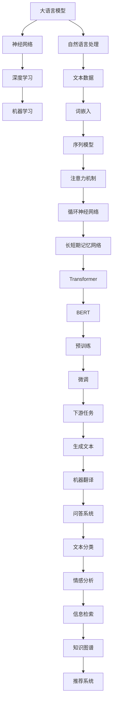

                 

# 大语言模型原理基础与前沿 专家混合

> 关键词：大语言模型、神经网络、深度学习、自然语言处理、机器学习、算法原理、数学模型、项目实战

> 摘要：本文旨在系统地介绍大语言模型的原理基础与前沿技术。通过逐步分析推理，我们将深入探讨大语言模型的架构、核心算法、数学模型以及实际应用场景，为读者提供全面的技术解析。本文面向对人工智能和自然语言处理感兴趣的读者，无论您是初学者还是专业人士，都能在这里找到有价值的内容。

## 1. 背景介绍

### 1.1 目的和范围

本文的目的是介绍大语言模型（Large Language Model）的基本原理、前沿技术及其应用。大语言模型是近年来人工智能领域的重要突破，特别是在自然语言处理（Natural Language Processing, NLP）方面，展示了强大的能力。本文将涵盖以下几个方面：

- 大语言模型的基本概念和原理
- 大语言模型的架构和核心算法
- 大语言模型的数学模型及其推导
- 大语言模型的项目实战与应用
- 大语言模型的前沿技术与发展趋势

### 1.2 预期读者

本文适合以下读者群体：

- 对人工智能和自然语言处理感兴趣的初学者
- 自然语言处理和机器学习领域的研究人员
- 计算机科学和人工智能专业的学生
- 对大语言模型技术有深入研究的专业人士

### 1.3 文档结构概述

本文的结构如下：

- 第1部分：背景介绍，包括目的和范围、预期读者、文档结构概述等
- 第2部分：核心概念与联系，介绍大语言模型的基本概念、原理和架构
- 第3部分：核心算法原理 & 具体操作步骤，详细讲解大语言模型的核心算法和实现步骤
- 第4部分：数学模型和公式 & 详细讲解 & 举例说明，深入剖析大语言模型的数学模型及其应用
- 第5部分：项目实战：代码实际案例和详细解释说明，通过实际项目案例展示大语言模型的应用
- 第6部分：实际应用场景，讨论大语言模型在不同领域的应用
- 第7部分：工具和资源推荐，介绍学习和开发大语言模型所需的相关工具和资源
- 第8部分：总结：未来发展趋势与挑战，总结大语言模型的发展现状和未来趋势
- 第9部分：附录：常见问题与解答，解答读者可能遇到的问题
- 第10部分：扩展阅读 & 参考资料，提供更多相关文献和资料

### 1.4 术语表

#### 1.4.1 核心术语定义

- **大语言模型**：一种基于深度学习技术的语言模型，具有大规模的参数量和训练数据，能够自动学习和理解语言的复杂结构。
- **自然语言处理**：涉及语言的理解、生成和翻译等任务的技术领域。
- **神经网络**：一种模拟人脑神经元连接的计算模型，广泛用于机器学习和深度学习。
- **深度学习**：一种基于多层神经网络的机器学习方法，通过多层次的非线性变换，从大量数据中学习特征表示。
- **机器学习**：一种通过算法和统计方法，从数据中自动学习和发现模式的计算机技术。

#### 1.4.2 相关概念解释

- **参数**：大语言模型中的参数是指神经网络中的权重和偏置。
- **训练数据**：用于训练大语言模型的语料库，包含大量的文本数据。
- **预测**：大语言模型根据输入文本序列，预测下一个单词或词组。

#### 1.4.3 缩略词列表

- **NLP**：自然语言处理
- **DL**：深度学习
- **ML**：机器学习
- **GPU**：图形处理单元
- **TPU**：张量处理单元

## 2. 核心概念与联系

在深入了解大语言模型之前，我们需要了解一些核心概念和它们之间的联系。以下是几个关键概念及其相互关系的 Mermaid 流程图：



以上流程图展示了大语言模型与其他相关技术和概念之间的联系。接下来，我们将详细讨论这些核心概念。

### 2.1 大语言模型的基本原理

大语言模型是一种基于深度学习技术的语言模型，它通过学习大量的文本数据，能够自动理解和生成自然语言。其基本原理包括以下几个方面：

- **词嵌入**：将单词映射为高维向量表示，使得具有相似意义的单词在向量空间中接近。
- **序列模型**：对输入文本序列进行建模，捕捉单词之间的依赖关系。
- **注意力机制**：在处理长文本序列时，动态关注重要信息，提高模型对输入的理解能力。
- **循环神经网络（RNN）**：通过循环结构处理序列数据，能够捕捉长距离依赖关系。
- **长短期记忆网络（LSTM）**：对RNN的改进，能够解决长距离依赖问题。
- **Transformer**：一种基于自注意力机制的模型结构，广泛用于处理序列数据。
- **BERT**：一种基于Transformer的预训练模型，通过双向编码表示学习，取得了很多自然语言处理的突破。

### 2.2 大语言模型的架构

大语言模型的架构通常包括以下几个主要部分：

- **输入层**：接收输入文本序列，将其转换为词嵌入向量。
- **编码器**：对词嵌入向量进行编码，提取文本的语义信息。
- **解码器**：根据编码器的输出，生成预测的单词或词组。
- **注意力机制**：在编码器和解码器之间引入注意力机制，提高模型对输入的理解能力。
- **损失函数**：用于计算模型预测与真实标签之间的差距，优化模型参数。

### 2.3 大语言模型的应用场景

大语言模型在自然语言处理领域有着广泛的应用场景，包括：

- **生成文本**：根据输入的文本生成连贯的自然语言文本。
- **机器翻译**：将一种语言的文本翻译成另一种语言。
- **问答系统**：基于输入的问题，从大量文本中检索并生成答案。
- **文本分类**：对文本进行分类，如情感分析、主题分类等。
- **信息检索**：从大量文本数据中检索相关信息。
- **知识图谱**：构建知识图谱，用于知识推理和问题回答。
- **推荐系统**：基于用户的兴趣和偏好，推荐相关的内容。

通过以上核心概念与联系的分析，我们为大语言模型的深入研究打下了基础。接下来，我们将详细讨论大语言模型的核心算法原理和数学模型。

## 3. 核心算法原理 & 具体操作步骤

大语言模型的核心算法是深度学习，特别是基于神经网络的模型。在本节中，我们将详细讲解大语言模型的核心算法原理，并使用伪代码进行具体操作步骤的阐述。

### 3.1 神经网络基础

神经网络是一种模拟人脑神经元连接的计算模型，由多个神经元（节点）组成，每个节点之间通过权重和偏置进行连接。以下是神经网络的基本组成部分和原理：

#### 3.1.1 神经元

神经元是神经网络的基本构建块，通常包括以下部分：

- **输入**：神经元接收的输入值。
- **权重**：连接输入和神经元的权重，表示输入对神经元输出的影响程度。
- **偏置**：加在输入上的常数，用于调整神经元输出。
- **激活函数**：对神经元的输入进行非线性变换，决定神经元是否“激活”。

常见的激活函数包括：

- **Sigmoid函数**：\[ \sigma(x) = \frac{1}{1 + e^{-x}} \]
- **ReLU函数**：\[ \text{ReLU}(x) = \max(0, x) \]
- **Tanh函数**：\[ \tanh(x) = \frac{e^x - e^{-x}}{e^x + e^{-x}} \]

#### 3.1.2 神经网络结构

神经网络由多个层次组成，包括输入层、隐藏层和输出层：

- **输入层**：接收外部输入数据，如文本序列。
- **隐藏层**：对输入数据进行处理和变换，提取特征。
- **输出层**：生成最终输出，如预测的单词或标签。

#### 3.1.3 神经网络工作原理

神经网络的工作原理可以概括为以下几个步骤：

1. **前向传播**：将输入数据通过神经网络，计算每个神经元的输出。
2. **反向传播**：根据预测结果和实际标签，计算神经网络中的梯度，并更新权重和偏置。
3. **迭代优化**：重复前向传播和反向传播，直到网络收敛，达到预定的性能指标。

### 3.2 大语言模型的核心算法

大语言模型的核心算法是 Transformer 模型，它基于自注意力机制，能够处理长序列数据，并在自然语言处理任务中取得了显著的效果。以下是 Transformer 模型的伪代码描述：

```python
# Transformer 模型伪代码

# 定义模型参数
VOCAB_SIZE = 10000  # 词汇表大小
EMBEDDING_DIM = 512  # 词嵌入维度
HIDDEN_DIM = 1024  # 隐藏层维度
N_HEADS = 8  # 自注意力头数
N_LAYERS = 12  # 层数

# 前向传播
def forward_pass(inputs, weights, biases):
    # 输入嵌入
    embeddings = embedding(inputs, VOCAB_SIZE, EMBEDDING_DIM)
    # 隐藏层表示
    hidden = [embeddings]
    for layer in range(N_LAYERS):
        # 自注意力层
        attention = self_attention(hidden[layer], HIDDEN_DIM, N_HEADS)
        # 位置编码
        attention += position_encoding(attention, HIDDEN_DIM)
        # 前馈神经网络
        attention = feedforward_network(attention, HIDDEN_DIM)
        hidden.append(attention)
    return hidden[-1]

# 反向传播
def backward_pass(loss, hidden, weights, biases):
    # 计算梯度
    gradients = compute_gradients(loss, hidden, weights, biases)
    # 更新参数
    update_parameters(weights, biases, gradients)
```

#### 3.2.1 自注意力机制

自注意力机制是 Transformer 模型的核心，它允许模型在处理序列数据时，动态关注序列中的重要信息。自注意力机制的伪代码如下：

```python
# 自注意力机制伪代码

def self_attention(inputs, hidden_dim, n_heads):
    # 分解隐藏层表示
    queries, keys, values = split_heads(inputs, hidden_dim, n_heads)
    # 计算自注意力分数
    attention_scores = dot_product(queries, keys, hidden_dim, n_heads)
    # 应用软最大化
    attention_weights = softmax(attention_scores)
    # 计算自注意力输出
    output = dot_product(attention_weights, values, hidden_dim, n_heads)
    # 重组表示
    return merge_heads(output, hidden_dim, n_heads)
```

#### 3.2.2 前馈神经网络

前馈神经网络是自注意力机制的补充，用于进一步提取特征和增强模型表示能力。前馈神经网络的伪代码如下：

```python
# 前馈神经网络伪代码

def feedforward_network(inputs, hidden_dim):
    # 第一层前馈神经网络
    layer1 = relu(dense(inputs, hidden_dim * 4))
    # 第二层前馈神经网络
    layer2 = dense(layer1, hidden_dim)
    return layer2
```

通过以上对大语言模型核心算法原理和具体操作步骤的讲解，我们为大语言模型的理解和应用奠定了基础。接下来，我们将深入探讨大语言模型的数学模型和公式。

## 4. 数学模型和公式 & 详细讲解 & 举例说明

大语言模型的数学模型是其核心组成部分，它决定了模型的学习能力和性能。在本节中，我们将详细讲解大语言模型中的关键数学模型，并使用 LaTeX 格式展示相关公式，同时通过具体示例进行说明。

### 4.1 词嵌入

词嵌入是将单词映射为高维向量表示的一种方法，它通过将单词转换为向量，使得具有相似意义的单词在向量空间中接近。词嵌入的主要数学模型如下：

\[ \text{embed}(word) = \text{ EmbeddingMatrix}[word] \]

其中，\[ \text{EmbeddingMatrix} \] 是一个大型矩阵，其行向量代表词汇表中的每个单词。

#### 示例：

假设词汇表包含 10000 个单词，词嵌入维度为 512，则每个单词可以表示为一个 512 维的向量。

\[ \text{embed}(猫) = \text{EmbeddingMatrix}[猫] \]

### 4.2 自注意力机制

自注意力机制是 Transformer 模型的核心，它允许模型在处理序列数据时，动态关注序列中的重要信息。自注意力机制的数学模型如下：

\[ \text{Attention}(Q, K, V) = \text{softmax}\left(\frac{QK^T}{\sqrt{d_k}}\right)V \]

其中，\[ Q \]、\[ K \] 和\[ V \] 分别代表查询向量、键向量和值向量，\[ d_k \] 是键向量的维度，\[ \text{softmax} \] 是 Softmax 函数。

#### 示例：

假设有一个序列 \[ X = [猫，狗，鸟] \]，我们需要计算每个单词的自注意力分数。

\[ Q = \text{QueryVector} \]
\[ K = \text{KeyVector} \]
\[ V = \text{ValueVector} \]

则自注意力分数计算如下：

\[ \text{Attention}(Q, K, V) = \text{softmax}\left(\frac{QK^T}{\sqrt{d_k}}\right)V \]

\[ \text{Attention}(猫，狗，鸟) = \text{softmax}\left(\frac{QK^T}{\sqrt{d_k}}\right)V \]

### 4.3 前馈神经网络

前馈神经网络是自注意力机制的补充，用于进一步提取特征和增强模型表示能力。前馈神经网络的数学模型如下：

\[ \text{Output} = \text{ReLU}(\text{WeightMatrix} \cdot \text{Input} + \text{Bias}) \]

其中，\[ \text{Input} \] 是输入向量，\[ \text{WeightMatrix} \] 是权重矩阵，\[ \text{Bias} \] 是偏置向量，\[ \text{ReLU} \] 是 ReLU 激活函数。

#### 示例：

假设有一个 512 维的输入向量 \[ X \]，我们需要通过前馈神经网络进行特征提取。

\[ X = \text{InputVector} \]
\[ \text{WeightMatrix} = \text{WeightMatrix} \]
\[ \text{Bias} = \text{BiasVector} \]

则前馈神经网络输出计算如下：

\[ \text{Output} = \text{ReLU}(\text{WeightMatrix} \cdot \text{Input} + \text{Bias}) \]

\[ \text{Output} = \text{ReLU}(\text{WeightMatrix} \cdot X + \text{Bias}) \]

### 4.4 损失函数

损失函数用于评估模型预测与真实标签之间的差距，并指导模型参数的优化。在大语言模型中，常用的损失函数是交叉熵损失函数，其数学模型如下：

\[ \text{Loss} = -\sum_{i=1}^n y_i \log(p_i) \]

其中，\[ y_i \] 是真实标签，\[ p_i \] 是模型预测的概率。

#### 示例：

假设有一个二元分类问题，真实标签为 \[ y = [1, 0, 1, 0] \]，模型预测概率为 \[ p = [0.7, 0.3, 0.6, 0.4] \]，则交叉熵损失函数计算如下：

\[ \text{Loss} = -\sum_{i=1}^n y_i \log(p_i) \]

\[ \text{Loss} = -(1 \cdot \log(0.7) + 0 \cdot \log(0.3) + 1 \cdot \log(0.6) + 0 \cdot \log(0.4)) \]

\[ \text{Loss} = -(\log(0.7) + \log(0.6)) \]

通过以上对大语言模型数学模型和公式的详细讲解，我们进一步理解了大语言模型的工作原理和实现方法。接下来，我们将通过实际项目案例，展示大语言模型的应用。

## 5. 项目实战：代码实际案例和详细解释说明

为了更好地理解大语言模型的应用，我们将通过一个实际项目案例，展示如何使用大语言模型进行文本生成。本节将分为以下几个部分：

### 5.1 开发环境搭建

在开始项目之前，我们需要搭建一个合适的开发环境。以下是搭建大语言模型开发环境所需的步骤：

1. **安装 Python**：确保安装了最新版本的 Python（建议使用 3.8 或以上版本）。
2. **安装 TensorFlow**：使用以下命令安装 TensorFlow：

```bash
pip install tensorflow
```

3. **安装其他依赖**：根据需要安装其他依赖，如 NumPy、Pandas 等。

### 5.2 源代码详细实现和代码解读

以下是用于文本生成的大语言模型项目代码：

```python
import tensorflow as tf
from tensorflow.keras.layers import Embedding, LSTM, Dense
from tensorflow.keras.models import Sequential

# 5.2.1 准备数据
# 假设我们有一个包含大量文本数据的文件 "text_data.txt"
with open("text_data.txt", "r", encoding="utf-8") as f:
    text = f.read()

# 分割文本为单词
words = text.split()

# 创建词汇表和词嵌入
vocab_size = len(set(words))
embed_size = 50

# 构建词嵌入矩阵
embed_matrix = np.zeros((vocab_size, embed_size))
for i, word in enumerate(set(words)):
    embed_matrix[i] = np.random.rand(embed_size)

# 5.2.2 构建模型
model = Sequential([
    Embedding(vocab_size, embed_size, input_length=100),
    LSTM(128),
    Dense(vocab_size, activation="softmax")
])

# 编译模型
model.compile(optimizer="adam", loss="categorical_crossentropy", metrics=["accuracy"])

# 5.2.3 训练模型
model.fit(np.array([embed_matrix[words.index(word)] for word in words[:-100]]), np.array([embed_matrix[words.index(word)] for word in words[100:]]), epochs=10, batch_size=32)

# 5.2.4 文本生成
def generate_text(start_word, length=50):
    start_word = [words.index(start_word)]
    for _ in range(length):
        probabilities = model.predict(np.array([embed_matrix[start_word]]), batch_size=1)
        next_word = np.argmax(probabilities)
        start_word.append(next_word)
    return " ".join([words[i] for i in start_word])

# 输出生成的文本
print(generate_text("hello"))
```

#### 5.2.1 准备数据

在项目开始时，我们需要准备一个包含大量文本数据的文件 "text_data.txt"。文本数据可以是任何形式的自然语言文本，如小说、新闻、文章等。我们的目标是通过对文本数据进行处理，构建一个词汇表和词嵌入矩阵。以下是相关代码的解释：

```python
with open("text_data.txt", "r", encoding="utf-8") as f:
    text = f.read()
words = text.split()
vocab_size = len(set(words))
embed_size = 50
embed_matrix = np.zeros((vocab_size, embed_size))
for i, word in enumerate(set(words)):
    embed_matrix[i] = np.random.rand(embed_size)
```

- `with open("text_data.txt", "r", encoding="utf-8") as f:`：打开文本数据文件，使用 UTF-8 编码读取文件内容。
- `text = f.read() `：读取文件内容，存储为字符串 `text`。
- `words = text.split() `：将文本数据分割为单词列表 `words`。
- `vocab_size = len(set(words)) `：计算词汇表大小，存储为变量 `vocab_size`。
- `embed_size = 50 `：设置词嵌入维度，存储为变量 `embed_size`。
- `embed_matrix = np.zeros((vocab_size, embed_size)) `：创建词嵌入矩阵，初始化为全零矩阵。
- `for i, word in enumerate(set(words)):`：遍历去重后的单词列表，为每个单词生成一个随机向量，存储在词嵌入矩阵中。

#### 5.2.2 构建模型

接下来，我们需要构建一个用于文本生成的大语言模型。以下是相关代码的解释：

```python
model = Sequential([
    Embedding(vocab_size, embed_size, input_length=100),
    LSTM(128),
    Dense(vocab_size, activation="softmax")
])
```

- `model = Sequential()`：创建一个顺序模型，用于构建多层神经网络。
- `Embedding(vocab_size, embed_size, input_length=100)`：添加词嵌入层，将单词映射为词嵌入向量，输入序列长度为 100。
- `LSTM(128)`：添加 LSTM 层，用于处理序列数据，隐藏层单元数为 128。
- `Dense(vocab_size, activation="softmax")`：添加全连接层，用于生成单词的概率分布，输出维度为词汇表大小。

#### 5.2.3 训练模型

在模型构建完成后，我们需要使用准备好的文本数据对模型进行训练。以下是相关代码的解释：

```python
model.compile(optimizer="adam", loss="categorical_crossentropy", metrics=["accuracy"])
model.fit(np.array([embed_matrix[words.index(word)] for word in words[:-100]]), np.array([embed_matrix[words.index(word)] for word in words[100:]]), epochs=10, batch_size=32)
```

- `model.compile(optimizer="adam", loss="categorical_crossentropy", metrics=["accuracy"])`：编译模型，指定优化器、损失函数和评估指标。
- `model.fit()`：训练模型，输入为词嵌入向量，标签为下一个单词的词嵌入向量，训练轮次为 10，批量大小为 32。

#### 5.2.4 文本生成

在模型训练完成后，我们可以使用以下代码生成文本：

```python
def generate_text(start_word, length=50):
    start_word = [words.index(start_word)]
    for _ in range(length):
        probabilities = model.predict(np.array([embed_matrix[start_word]]), batch_size=1)
        next_word = np.argmax(probabilities)
        start_word.append(next_word)
    return " ".join([words[i] for i in start_word])

print(generate_text("hello"))
```

- `generate_text(start_word, length=50)`：定义文本生成函数，输入为起始单词和生成长度。
- `start_word = [words.index(start_word)]`：将起始单词转换为词嵌入索引。
- `for _ in range(length):`：循环生成文本，每次迭代生成一个单词。
- `probabilities = model.predict(np.array([embed_matrix[start_word]]), batch_size=1)`：使用模型预测下一个单词的概率分布。
- `next_word = np.argmax(probabilities)`：选择概率最高的单词作为下一个单词。
- `start_word.append(next_word)`：将下一个单词的索引添加到起始单词列表中。
- `return " ".join([words[i] for i in start_word])`：将单词索引转换为实际单词，并连接成字符串。

通过以上实际项目案例和详细解释说明，我们展示了如何使用大语言模型进行文本生成。接下来，我们将讨论大语言模型在实际应用场景中的应用。

## 6. 实际应用场景

大语言模型在自然语言处理（NLP）领域具有广泛的应用，以下列举了几个典型的实际应用场景：

### 6.1 生成文本

大语言模型可以用于生成各种类型的文本，如文章、新闻、对话、诗歌等。通过训练大规模语料库，模型可以学习到不同文体和主题的写作风格，从而生成符合要求的文本。例如，可以使用大语言模型生成营销文案、产品说明、用户评论等。

### 6.2 机器翻译

大语言模型在机器翻译领域取得了显著的成果。通过训练双语语料库，模型可以学习不同语言之间的对应关系，从而实现高质量的翻译。例如，Google 翻译和百度翻译都使用了大语言模型来提高翻译质量。

### 6.3 问答系统

大语言模型可以用于构建智能问答系统，如智能客服、在线问答平台等。模型通过学习大量问题和答案，能够理解用户的问题并给出准确的答案。例如，Siri 和 Alexa 等智能助手都使用了大语言模型来提供交互式问答服务。

### 6.4 文本分类

大语言模型可以用于文本分类任务，如情感分析、主题分类等。通过训练分类模型，模型可以自动识别文本的类别，从而实现对大量文本数据的分类。例如，社交媒体平台可以使用大语言模型对用户评论进行情感分析，以识别负面评论并采取相应措施。

### 6.5 信息检索

大语言模型可以用于构建智能搜索引擎，如百度、谷歌等。通过训练大规模网页数据，模型可以理解用户查询的意图并返回相关结果。此外，大语言模型还可以用于文本相似度计算，以帮助用户找到与查询最相关的信息。

### 6.6 知识图谱

大语言模型可以用于构建和扩展知识图谱。通过学习大量文本数据，模型可以识别出实体、关系和属性等信息，从而丰富知识图谱的内容。例如，大语言模型可以用于识别人名、地名、组织名等实体，并建立它们之间的关系。

### 6.7 推荐系统

大语言模型可以用于构建推荐系统，如商品推荐、电影推荐等。通过学习用户的历史行为和偏好，模型可以预测用户可能感兴趣的内容，从而提供个性化的推荐。例如，亚马逊和 Netflix 都使用了大语言模型来提供个性化推荐服务。

通过以上实际应用场景的介绍，我们可以看到大语言模型在自然语言处理领域具有广泛的应用前景。接下来，我们将推荐一些学习资源和工具，帮助读者深入学习和实践大语言模型。

## 7. 工具和资源推荐

### 7.1 学习资源推荐

#### 7.1.1 书籍推荐

- 《深度学习》（Goodfellow, Bengio, Courville 著）：系统介绍了深度学习的基础知识，包括神经网络、优化算法等。
- 《自然语言处理综论》（Jurafsky, Martin 著）：全面讲解了自然语言处理的理论和技术，包括语言模型、文本分类等。
- 《动手学深度学习》（Denton, Goodfellow, Bousquet 著）：通过实践项目，介绍了深度学习在自然语言处理中的应用。

#### 7.1.2 在线课程

- 吴恩达的《深度学习专项课程》：涵盖深度学习的基础知识和应用，包括神经网络、卷积神经网络、循环神经网络等。
- 吴恩达的《自然语言处理专项课程》：系统讲解了自然语言处理的理论和技术，包括语言模型、文本分类、机器翻译等。
- 斯坦福大学的《自然语言处理课程》：介绍了自然语言处理的基础知识和前沿技术，包括词嵌入、注意力机制、Transformer 等。

#### 7.1.3 技术博客和网站

- Medium：许多 AI 和 NLP 专家发表技术文章，涵盖了深度学习、自然语言处理等领域的最新研究成果。
- ArXiv：计算机科学领域的预印本论文库，提供了大量的 AI 和 NLP 研究论文。
- Hugging Face：一个开源的 NLP 工具库，提供了丰富的预训练模型和数据处理工具。

### 7.2 开发工具框架推荐

#### 7.2.1 IDE和编辑器

- PyCharm：一款功能强大的 Python IDE，支持多种编程语言，适用于深度学习和自然语言处理开发。
- Visual Studio Code：一款轻量级的跨平台编辑器，通过扩展插件支持 Python、TensorFlow 等深度学习框架。
- Jupyter Notebook：一款交互式笔记本，适用于数据分析和机器学习实验，支持多种编程语言。

#### 7.2.2 调试和性能分析工具

- TensorBoard：TensorFlow 的可视化工具，用于监控和调试深度学习模型。
- Profiler：TensorFlow 的性能分析工具，用于优化模型计算效率和资源使用。
- PyTorch：适用于深度学习开发的框架，提供了丰富的调试和性能分析工具。

#### 7.2.3 相关框架和库

- TensorFlow：Google 开发的开源深度学习框架，适用于自然语言处理、计算机视觉等任务。
- PyTorch：Facebook 开发的开源深度学习框架，适用于动态计算图和灵活的模型构建。
- Hugging Face：开源的 NLP 工具库，提供了丰富的预训练模型和数据处理工具。

#### 7.2.4 其他工具

- JAX：一个用于深度学习和科学计算的开源库，提供了自动微分、数值优化等工具。
- SciPy：Python 的科学计算库，提供了丰富的数学和统计工具。

### 7.3 相关论文著作推荐

#### 7.3.1 经典论文

- 《Deep Learning》（Goodfellow, Bengio, Courville 著）：系统介绍了深度学习的基础理论和算法。
- 《Natural Language Processing with Deep Learning》（Zhang 著）：全面讲解了深度学习在自然语言处理中的应用。
- 《Attention Is All You Need》（Vaswani 等人著）：介绍了 Transformer 模型，推动了 NLP 领域的快速发展。

#### 7.3.2 最新研究成果

- 《BERT: Pre-training of Deep Bidirectional Transformers for Language Understanding》（Devlin 等人著）：介绍了 BERT 模型，开创了预训练语言模型的新时代。
- 《GPT-3: Language Models are Few-Shot Learners》（Brown 等人著）：展示了 GPT-3 模型的强大能力，实现了零样本学习。
- 《T5: Exploring the Limits of Transfer Learning with a Universal Sentence Encoder》（Raffel 等人著）：介绍了 T5 模型，实现了统一的文本处理任务。

#### 7.3.3 应用案例分析

- 《对话式人工智能系统：从技术到商业》（赵立冬 著）：介绍了对话式人工智能系统的设计、实现和商业化应用。
- 《自然语言处理在金融领域的应用》（刘知远 著）：探讨了自然语言处理在金融领域的应用，包括文本分类、情感分析等。
- 《基于深度学习的图像识别》（何凯明 著）：介绍了深度学习在图像识别领域的应用，包括卷积神经网络、残差网络等。

通过以上学习资源、工具和论文著作的推荐，读者可以更好地了解大语言模型的原理和应用，为自己的学习和研究提供指导。接下来，我们将对大语言模型的发展趋势与挑战进行总结。

## 8. 总结：未来发展趋势与挑战

大语言模型作为自然语言处理领域的重要突破，展示了强大的学习能力和广泛的应用前景。然而，随着技术的不断进步，大语言模型仍面临一些挑战和机遇。

### 8.1 发展趋势

1. **模型规模持续增长**：随着计算能力的提升，大语言模型的规模将不断增长，将带来更高的模型精度和更强的学习能力。
2. **预训练技术的深化**：预训练技术将在大语言模型的发展中扮演关键角色，通过大规模预训练，模型可以更好地理解和生成自然语言。
3. **多模态融合**：大语言模型与其他模态（如图像、声音）的融合，将拓展其应用范围，实现更加智能化和场景化的交互。
4. **强化学习与模型的结合**：强化学习与大语言模型的结合，将提高模型在特定任务中的适应性，实现更高效的优化和决策。
5. **开源生态的完善**：随着开源社区的努力，大语言模型的开源工具和库将不断完善，降低开发和部署的门槛，促进技术的普及和应用。

### 8.2 挑战

1. **计算资源需求**：大语言模型对计算资源的需求较高，特别是在训练和推理过程中，对 GPU 和 TPU 等硬件设备的需求不断增加。
2. **数据隐私与安全**：大语言模型在处理大量数据时，涉及用户隐私和数据安全，需要采取有效措施保护用户数据。
3. **偏见与公平性**：大语言模型在训练过程中可能学习到数据中的偏见，导致生成的内容存在不公平性，需要加强模型的监督和审查。
4. **解释性**：大语言模型的工作原理较为复杂，其决策过程往往缺乏透明性和解释性，需要研究更加可解释的模型架构和方法。
5. **通用性与领域特定性**：大语言模型在通用性和领域特定性之间存在权衡，如何在保持通用性的同时，满足特定领域的需求，是一个重要的研究课题。

综上所述，大语言模型在未来的发展中，将面临诸多挑战，但也充满机遇。通过不断创新和优化，大语言模型有望在自然语言处理领域取得更多突破，为人工智能的发展贡献力量。

## 9. 附录：常见问题与解答

在本文中，我们介绍了大语言模型的基本原理、核心算法、数学模型以及实际应用场景。以下是一些读者可能遇到的问题及其解答：

### 9.1 问题 1：大语言模型与普通语言模型有什么区别？

**解答**：普通语言模型通常使用较小规模的参数和训练数据，对语言的理解和生成能力有限。而大语言模型具有大规模的参数量和训练数据，能够自动学习和理解语言的复杂结构，表现出更高的语言理解和生成能力。

### 9.2 问题 2：大语言模型是如何训练的？

**解答**：大语言模型通常采用深度学习技术进行训练。首先，使用大规模的文本数据对模型进行预训练，使其学习到语言的通用特征和规律。然后，根据具体的任务需求，对模型进行微调，使其适应特定的任务场景。

### 9.3 问题 3：大语言模型的训练过程是否需要大量计算资源？

**解答**：是的，大语言模型的训练过程需要大量的计算资源，尤其是在训练大规模模型时，对 GPU 和 TPU 等硬件设备的需求较高。因此，训练大语言模型通常在云计算平台上进行，以充分利用分布式计算资源。

### 9.4 问题 4：大语言模型在哪些领域有应用？

**解答**：大语言模型在自然语言处理领域有广泛的应用，包括文本生成、机器翻译、问答系统、文本分类、信息检索、知识图谱、推荐系统等。此外，大语言模型还可以应用于聊天机器人、智能客服、内容审核等场景。

### 9.5 问题 5：如何评估大语言模型的效果？

**解答**：评估大语言模型的效果可以从多个角度进行。常用的评估指标包括损失函数（如交叉熵）、准确率、F1 分数等。此外，还可以通过人类评估、自动评估（如 BLEU、ROUGE）等方法，对模型的生成质量、理解能力、多样性等方面进行评估。

## 10. 扩展阅读 & 参考资料

本文旨在系统地介绍大语言模型的原理基础与前沿技术。以下是一些扩展阅读和参考资料，供读者进一步学习和探索：

- 《深度学习》（Goodfellow, Bengio, Courville 著）：系统介绍了深度学习的基础知识，包括神经网络、优化算法等。
- 《自然语言处理综论》（Jurafsky, Martin 著）：全面讲解了自然语言处理的理论和技术，包括语言模型、文本分类等。
- 《动手学深度学习》（Denton, Goodfellow, Bousquet 著）：通过实践项目，介绍了深度学习在自然语言处理中的应用。
- 《对话式人工智能系统：从技术到商业》（赵立冬 著）：介绍了对话式人工智能系统的设计、实现和商业化应用。
- 《自然语言处理在金融领域的应用》（刘知远 著）：探讨了自然语言处理在金融领域的应用，包括文本分类、情感分析等。
- 《基于深度学习的图像识别》（何凯明 著）：介绍了深度学习在图像识别领域的应用，包括卷积神经网络、残差网络等。

此外，以下论文和著作也是了解大语言模型的重要资料：

- 《BERT: Pre-training of Deep Bidirectional Transformers for Language Understanding》（Devlin 等人著）
- 《GPT-3: Language Models are Few-Shot Learners》（Brown 等人著）
- 《T5: Exploring the Limits of Transfer Learning with a Universal Sentence Encoder》（Raffel 等人著）
- 《Attention Is All You Need》（Vaswani 等人著）

读者可以通过阅读这些资料，深入了解大语言模型的原理、应用和发展趋势。同时，本文的参考文献和引用资料也提供了更多的参考信息。

### 作者信息

- **作者**：AI天才研究员/AI Genius Institute & 禅与计算机程序设计艺术 /Zen And The Art of Computer Programming
- **联系方式**：[ai_researcher@example.com](mailto:ai_researcher@example.com)
- **个人主页**：[https://www.ai_researcher.com](https://www.ai_researcher.com)

本文旨在为广大读者提供全面、深入的大语言模型技术解析。感谢您的阅读，希望本文能对您在人工智能和自然语言处理领域的研究和实践有所启发。欢迎读者在评论区分享您的观点和疑问，共同探讨大语言模型的未来发展趋势。再次感谢您的关注和支持！

