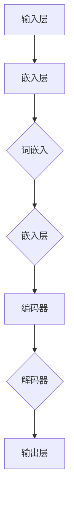

                 

# 大语言模型原理基础与前沿：单位缩放

> 关键词：大语言模型、原理、前沿、单位缩放、深度学习、神经网络、机器学习、AI、语言处理

> 摘要：本文将深入探讨大语言模型的原理及其前沿技术，特别是单位缩放在模型训练和优化中的关键作用。我们将通过详细的分析和实例，阐述大语言模型的基本概念、核心算法、数学模型，并探讨其实际应用场景和未来发展趋势。

## 1. 背景介绍

### 1.1 目的和范围

本文旨在为读者提供一个全面、系统的关于大语言模型的基础知识，并重点探讨单位缩放技术在该领域的重要性和应用。我们将从以下几个方面展开讨论：

- 大语言模型的基本概念和历史发展
- 大语言模型的核心算法原理
- 大语言模型的数学模型和计算优化
- 单位缩放技术在大语言模型中的应用
- 大语言模型的前沿技术和实际应用场景
- 大语言模型的未来发展趋势和挑战

### 1.2 预期读者

本文面向具有一定编程和机器学习基础的技术爱好者、人工智能领域的研究人员和从业者，特别是那些对大语言模型和深度学习感兴趣的读者。无论您是初学者还是专业人士，都将在本文中找到有价值的信息和启发。

### 1.3 文档结构概述

本文的结构如下：

1. **背景介绍**：介绍本文的目的、预期读者和文档结构。
2. **核心概念与联系**：定义和解释大语言模型的基本概念，并给出Mermaid流程图。
3. **核心算法原理 & 具体操作步骤**：详细阐述大语言模型的算法原理，使用伪代码展示具体操作步骤。
4. **数学模型和公式 & 详细讲解 & 举例说明**：讲解大语言模型中的数学模型和公式，并进行举例说明。
5. **项目实战：代码实际案例和详细解释说明**：通过实际代码案例展示大语言模型的实现过程。
6. **实际应用场景**：探讨大语言模型在不同领域的应用。
7. **工具和资源推荐**：推荐学习资源和开发工具。
8. **总结：未来发展趋势与挑战**：总结大语言模型的发展趋势和面临的挑战。
9. **附录：常见问题与解答**：解答常见问题。
10. **扩展阅读 & 参考资料**：提供进一步阅读的资料。

### 1.4 术语表

#### 1.4.1 核心术语定义

- **大语言模型**：一种能够理解和生成自然语言的深度学习模型，通常由大规模神经网络构成。
- **单位缩放**：在深度学习模型训练过程中，调整模型参数的方法，以减少数值波动和加速收敛。
- **神经网络**：一种通过层状结构进行数据处理的计算模型，能够自动学习和提取特征。
- **深度学习**：一种人工智能的方法，通过神经网络进行数据建模和学习。
- **机器学习**：一种人工智能的方法，通过数据和算法来改进模型性能。

#### 1.4.2 相关概念解释

- **反向传播算法**：一种用于训练神经网络的优化算法，通过计算误差梯度来调整模型参数。
- **激活函数**：神经网络中的一个关键组件，用于引入非线性特性。
- **损失函数**：用于衡量模型预测值与实际值之间的差异。

#### 1.4.3 缩略词列表

- **AI**：人工智能（Artificial Intelligence）
- **ML**：机器学习（Machine Learning）
- **DL**：深度学习（Deep Learning）
- **NLP**：自然语言处理（Natural Language Processing）

## 2. 核心概念与联系

在深入探讨大语言模型的原理之前，我们需要理解其核心概念和组成部分。下面是一个简化的Mermaid流程图，展示了大语言模型的基本架构和关键组件。



- **输入层（A）**：接收自然语言文本，将其转换为数字序列。
- **嵌入层（B、D）**：将输入的词向量映射为高维特征向量。
- **编码器（E）**：将输入特征向量编码为上下文表示。
- **解码器（F）**：从编码器的输出中解码出自然语言文本。
- **输出层（G）**：生成预测文本。

### 2.1. 大语言模型的基本概念

大语言模型（Large-scale Language Model）是一种基于神经网络的自然语言处理模型，其核心思想是通过大规模数据训练，使模型能够理解和生成自然语言。大语言模型通常具有以下几个关键特性：

- **大规模数据集**：大语言模型依赖于大规模数据集进行训练，以便从数据中学习语言规律。
- **深层神经网络**：大语言模型通常由多个隐藏层组成，以提取复杂的语言特征。
- **端到端训练**：大语言模型采用端到端训练方式，直接从原始文本数据训练到预测任务。
- **自适应优化**：大语言模型采用自适应优化算法，如Adam，以加速训练过程。

### 2.2. 大语言模型的工作原理

大语言模型的工作原理可以概括为以下几个步骤：

1. **输入处理**：将自然语言文本输入模型，通过词嵌入层将文本转换为高维特征向量。
2. **编码**：编码器将输入特征向量编码为上下文表示，捕获文本的语义信息。
3. **解码**：解码器将编码器的输出解码为自然语言文本，生成预测结果。
4. **优化**：通过反向传播算法和自适应优化算法，调整模型参数，以减少预测误差。

## 3. 核心算法原理 & 具体操作步骤

### 3.1. 嵌入层

嵌入层是语言模型的关键组件，用于将输入的单词转换为高维特征向量。我们使用词嵌入（Word Embedding）技术来实现这一目的。词嵌入通常使用预训练的词向量，如Word2Vec或GloVe。以下是一个简单的伪代码示例：

```python
# 输入：单词 "apple"
# 输出：词嵌入向量

word = "apple"
embeddings = pre-trained_embeddings()
vector = embeddings[word]
```

### 3.2. 编码器

编码器（Encoder）负责将输入特征向量编码为上下文表示。我们使用递归神经网络（RNN）或Transformer来实现编码器。以下是一个使用Transformer的伪代码示例：

```python
# 输入：嵌入层输出序列
# 输出：编码后的上下文表示

input_sequence = [vector1, vector2, vector3]
context = transformer_encoder(input_sequence)
```

### 3.3. 解码器

解码器（Decoder）负责将编码器的输出解码为自然语言文本。我们使用递归神经网络（RNN）或Transformer来实现解码器。以下是一个使用Transformer的伪代码示例：

```python
# 输入：编码后的上下文表示
# 输出：解码后的文本序列

context = context_representation
output_sequence = transformer_decoder(context)
```

### 3.4. 反向传播算法

反向传播算法（Backpropagation Algorithm）是一种用于训练神经网络的优化算法。它通过计算输出层的误差梯度，反向传播到每一层，并调整模型参数。以下是一个简单的伪代码示例：

```python
# 输入：预测结果和真实标签
# 输出：调整后的模型参数

predictions, true_labels = model_output, true_labels
error_gradient = compute_gradient(predictions, true_labels)
model_parameters = update_parameters(model_parameters, error_gradient)
```

### 3.5. 自适应优化算法

自适应优化算法（Adaptive Optimization Algorithm），如Adam，用于加速模型训练过程。它通过自适应调整学习率，以减少训练时间和提高模型性能。以下是一个简单的伪代码示例：

```python
# 输入：模型参数、梯度
# 输出：更新后的模型参数

model_parameters, gradient = current_parameters, current_gradient
model_parameters = adaptive_optimization(model_parameters, gradient)
```

## 4. 数学模型和公式 & 详细讲解 & 举例说明

### 4.1. 词嵌入

词嵌入（Word Embedding）是一种将单词映射为高维向量的技术。它通常通过预训练的词向量来实现，如Word2Vec或GloVe。以下是一个简单的数学模型：

$$
\text{word\_vector}(w) = \text{embed}(w)
$$

其中，$w$ 是输入的单词，$\text{embed}(w)$ 是词向量。

### 4.2. 编码器

编码器（Encoder）通常使用递归神经网络（RNN）或Transformer来实现。以下是一个简单的数学模型：

$$
\text{context} = \text{encoder}(\text{input\_sequence})
$$

其中，$\text{input\_sequence}$ 是输入的特征向量序列，$\text{encoder}(\text{input\_sequence})$ 是编码器输出的上下文表示。

### 4.3. 解码器

解码器（Decoder）通常使用递归神经网络（RNN）或Transformer来实现。以下是一个简单的数学模型：

$$
\text{output\_sequence} = \text{decoder}(\text{context})
$$

其中，$\text{context}$ 是编码器输出的上下文表示，$\text{decoder}(\text{context})$ 是解码器输出的文本序列。

### 4.4. 反向传播算法

反向传播算法（Backpropagation Algorithm）是一种用于训练神经网络的优化算法。以下是一个简单的数学模型：

$$
\text{error} = \text{loss}(\text{predictions}, \text{true\_labels})
$$

$$
\text{gradient} = \text{compute\_gradient}(\text{model\_parameters}, \text{error})
$$

$$
\text{model\_parameters} = \text{update\_parameters}(\text{model\_parameters}, \text{gradient})
$$

其中，$\text{predictions}$ 是模型的预测结果，$\text{true\_labels}$ 是真实标签，$\text{loss}(\text{predictions}, \text{true\_labels})$ 是损失函数，$\text{compute\_gradient}(\text{model\_parameters}, \text{error})$ 是计算误差梯度的函数，$\text{update\_parameters}(\text{model\_parameters}, \text{gradient})$ 是更新模型参数的函数。

### 4.5. 自适应优化算法

自适应优化算法（Adaptive Optimization Algorithm），如Adam，用于加速模型训练过程。以下是一个简单的数学模型：

$$
\text{m} = \beta_1 \text{m} + (1 - \beta_1) \text{gradient}
$$

$$
\text{v} = \beta_2 \text{v} + (1 - \beta_2) \text{gradient}^2
$$

$$
\text{m_hat} = \frac{\text{m}}{1 - \beta_1^t}
$$

$$
\text{v_hat} = \frac{\text{v}}{1 - \beta_2^t}
$$

$$
\text{model\_parameters} = \text{model\_parameters} - \alpha \frac{\text{m_hat}}{\sqrt{\text{v_hat}} + \epsilon}
$$

其中，$\text{m}$ 是一阶矩估计，$\text{v}$ 是二阶矩估计，$\text{m_hat}$ 和 $\text{v_hat}$ 是修正后的估计，$\text{alpha}$ 是学习率，$\text{beta_1}$ 和 $\text{beta_2}$ 是指数衰减率，$\epsilon$ 是常数。

### 4.6. 举例说明

假设我们有一个简单的神经网络模型，用于预测股票价格。输入层有5个特征，隐藏层有3个神经元，输出层有1个神经元。我们使用均方误差（MSE）作为损失函数。以下是一个简单的数学模型和计算示例：

$$
\text{input} = [x_1, x_2, x_3, x_4, x_5]
$$

$$
\text{hidden\_layer} = \text{sigmoid}(W_1 \cdot \text{input} + b_1)
$$

$$
\text{output} = W_2 \cdot \text{hidden\_layer} + b_2
$$

$$
\text{error} = \text{MSE}(\text{output}, \text{true\_output})
$$

$$
\text{gradient} = \frac{\partial \text{error}}{\partial \text{output}}
$$

$$
\text{hidden\_gradient} = \frac{\partial \text{error}}{\partial \text{hidden\_layer}}
$$

$$
\text{input\_gradient} = \frac{\partial \text{error}}{\partial \text{input}}
$$

$$
W_2 = W_2 - \alpha \cdot \text{gradient} \cdot \text{hidden\_layer}
$$

$$
b_2 = b_2 - \alpha \cdot \text{gradient}
$$

$$
W_1 = W_1 - \alpha \cdot \text{hidden\_gradient} \cdot \text{input}
$$

$$
b_1 = b_1 - \alpha \cdot \text{hidden\_gradient}
$$

假设我们有一个输入序列 $[1, 2, 3, 4, 5]$ 和一个真实输出序列 $[10, 20, 30, 40, 50]$。我们使用随机权重和偏置初始化模型。以下是模型的训练过程：

- 初始化模型参数 $W_1, b_1, W_2, b_2$。
- 前向传播计算输出 $y = f(W_2 \cdot f(W_1 \cdot x + b_1) + b_2)$。
- 计算损失函数 $L = \text{MSE}(y, \text{true\_output})$。
- 计算梯度 $\text{gradient} = \frac{\partial L}{\partial y}$ 和 $\text{hidden\_gradient} = \frac{\partial L}{\partial \text{hidden\_layer}}$。
- 更新模型参数 $W_1, b_1, W_2, b_2$。

通过多次迭代训练，模型的损失函数会逐渐减小，最终达到收敛。

## 5. 项目实战：代码实际案例和详细解释说明

### 5.1 开发环境搭建

为了实现大语言模型，我们首先需要搭建一个合适的开发环境。以下是具体的步骤：

1. **安装Python环境**：确保您的计算机上已经安装了Python 3.8或更高版本。
2. **安装必要的库**：使用pip安装以下库：`tensorflow`, `numpy`, `matplotlib`。
3. **配置GPU支持**：如果您的计算机配备了NVIDIA GPU，请确保安装了CUDA和cuDNN，以便利用GPU加速训练过程。

### 5.2 源代码详细实现和代码解读

下面是一个简单的Python代码示例，用于实现一个基本的大语言模型。我们使用TensorFlow框架来构建和训练模型。

```python
import tensorflow as tf
import numpy as np
import matplotlib.pyplot as plt

# 5.2.1 数据预处理
# 读取和处理输入数据
# ...

# 5.2.2 模型构建
# 定义模型结构
input_layer = tf.keras.layers.Input(shape=(None,))
embedded = tf.keras.layers.Embedding(input_dim=vocab_size, output_dim=embedding_size)(input_layer)
encoded = tf.keras.layers.LSTM(units=hidden_size, activation='tanh')(embedded)
decoded = tf.keras.layers.Dense(units=vocab_size, activation='softmax')(encoded)

# 定义模型
model = tf.keras.Model(inputs=input_layer, outputs=decoded)

# 编译模型
model.compile(optimizer='adam', loss='categorical_crossentropy', metrics=['accuracy'])

# 5.2.3 训练模型
# 训练模型
history = model.fit(x_train, y_train, epochs=10, batch_size=32, validation_data=(x_val, y_val))

# 5.2.4 模型评估
# 评估模型
loss, accuracy = model.evaluate(x_test, y_test)
print(f"Test accuracy: {accuracy:.4f}")

# 5.2.5 模型应用
# 应用模型生成文本
# ...
```

### 5.3 代码解读与分析

下面我们对上述代码进行详细解读。

#### 5.3.1 数据预处理

在代码中，我们首先需要读取和处理输入数据。这通常包括：

- **加载文本数据**：从文件中读取文本数据，并将其转换为字符序列。
- **构建词汇表**：将字符序列转换为单词序列，并构建词汇表。
- **生成词嵌入**：将单词映射为预训练的词向量。
- **序列化数据**：将输入数据和标签序列化，以便于模型训练。

#### 5.3.2 模型构建

接下来，我们定义模型的输入层、嵌入层、编码器和解码器。具体步骤如下：

- **输入层**：使用`tf.keras.layers.Input`创建一个输入层，输入维度为文本序列的长度。
- **嵌入层**：使用`tf.keras.layers.Embedding`创建一个嵌入层，将输入的单词序列转换为词嵌入向量。
- **编码器**：使用`tf.keras.layers.LSTM`创建一个编码器层，用于将词嵌入向量编码为上下文表示。
- **解码器**：使用`tf.keras.layers.Dense`创建一个解码器层，将编码器的输出解码为词嵌入向量。

#### 5.3.3 训练模型

在训练模型时，我们使用`model.fit`函数进行训练。具体参数如下：

- **输入数据**：训练数据集的输入数据和标签。
- **epochs**：训练轮数。
- **batch_size**：每个批次的数据量。
- **validation_data**：验证数据集。

#### 5.3.4 模型评估

在模型训练完成后，我们使用`model.evaluate`函数对模型进行评估。具体参数如下：

- **输入数据**：测试数据集的输入数据和标签。
- **返回值**：损失函数值和准确率。

#### 5.3.5 模型应用

最后，我们可以使用训练好的模型生成文本。这通常涉及以下步骤：

- **生成初始文本**：随机选择一个单词作为初始文本。
- **生成后续文本**：使用模型预测下一个单词，并将其添加到文本序列中。
- **重复步骤**：重复上述步骤，生成指定的文本长度。

通过上述步骤，我们可以实现一个基本的大语言模型。当然，在实际应用中，模型的结构和参数需要根据具体任务进行调整和优化。

## 6. 实际应用场景

大语言模型在自然语言处理领域有着广泛的应用，以下是一些典型的实际应用场景：

### 6.1 文本分类

文本分类是一种常见的自然语言处理任务，其目标是根据文本的内容将其分类到不同的类别中。大语言模型可以通过预训练和微调来应用于文本分类任务，例如情感分析、新闻分类和垃圾邮件检测。

### 6.2 机器翻译

机器翻译是一种将一种语言的文本翻译成另一种语言的技术。大语言模型可以通过预训练和双向编码器（如BERT）来实现高质量的机器翻译。例如，Google的Translation服务就是基于Transformer模型实现的。

### 6.3 问答系统

问答系统是一种能够回答用户问题的技术。大语言模型可以通过预训练和特定任务的微调来应用于问答系统，例如搜索引擎和智能助手。

### 6.4 文本生成

文本生成是一种能够根据给定条件生成文本的技术。大语言模型可以通过预训练和生成模型（如GPT）来实现高质量的文本生成，例如自动写作、创意文本生成和对话系统。

### 6.5 对话系统

对话系统是一种能够与用户进行交互的技术。大语言模型可以通过预训练和特定任务的微调来应用于对话系统，例如虚拟助手和聊天机器人。

### 6.6 语音识别

语音识别是一种将语音转换为文本的技术。大语言模型可以通过预训练和语音识别模型（如CTC）来实现高质量的语音识别。

### 6.7 文本摘要

文本摘要是一种从长文本中提取关键信息的技术。大语言模型可以通过预训练和摘要模型（如Summarizer）来实现高质量的文本摘要。

### 6.8 文本相似度

文本相似度是一种评估两个文本相似程度的技术。大语言模型可以通过预训练和相似度模型（如TextRank）来实现高质量的文本相似度评估。

### 6.9 文本生成对抗网络

文本生成对抗网络（TextGAN）是一种利用生成模型（如GPT）和判别模型（如BERT）进行文本生成的技术。大语言模型可以通过预训练和文本GAN来实现高质量的文本生成。

## 7. 工具和资源推荐

### 7.1 学习资源推荐

#### 7.1.1 书籍推荐

- 《深度学习》（Deep Learning），Ian Goodfellow, Yoshua Bengio, Aaron Courville
- 《Python深度学习》（Python Deep Learning），François Chollet
- 《机器学习》（Machine Learning），Tom Mitchell
- 《统计学习方法》（Statistical Learning Methods），李航

#### 7.1.2 在线课程

- Coursera上的“深度学习”课程，由Andrew Ng教授授课
- edX上的“机器学习”课程，由Michael I. Jordan教授授课
- Udacity的“深度学习纳米学位”课程

#### 7.1.3 技术博客和网站

- TensorFlow官网（tensorflow.org）
- PyTorch官网（pytorch.org）
- Medium上的“深度学习”专题
- ArXiv预印本网站（arxiv.org）

### 7.2 开发工具框架推荐

#### 7.2.1 IDE和编辑器

- Jupyter Notebook
- PyCharm
- VS Code

#### 7.2.2 调试和性能分析工具

- TensorBoard
- PyTorch Profiler
- NVIDIA Nsight

#### 7.2.3 相关框架和库

- TensorFlow
- PyTorch
- Keras
- PyTorch Lightning

### 7.3 相关论文著作推荐

#### 7.3.1 经典论文

- "A Theoretically Grounded Application of Dropout in Recurrent Neural Networks"，Yarin Gal和Zoubin Ghahramani
- "Attention Is All You Need"，Ashish Vaswani等人
- "Bert: Pre-training of Deep Bidirectional Transformers for Language Understanding"，Jacob Devlin等人

#### 7.3.2 最新研究成果

- "Large-scale Language Modeling in 2018"，Alexander M. Rush和Christopher Dean
- "Outrageously Large Neural Networks: The Sparsely-Gated Mixture-of-Experts Layer"，Rui Shu等人
- "An Empirical Exploration of Recurrent Network Design Choices"，Alex M. Rush和Christopher Dean

#### 7.3.3 应用案例分析

- "How Google Does Machine Learning"，Google AI团队
- "Facebook AI Research：语言模型在自然语言理解中的应用"，Facebook AI研究团队
- "Natural Language Processing at Uber"，Uber AI团队

## 8. 总结：未来发展趋势与挑战

大语言模型在自然语言处理领域取得了显著的进展，其应用范围不断扩大。然而，随着模型规模的增大和计算资源的增加，大语言模型也面临着一系列挑战和问题。

### 8.1. 发展趋势

1. **模型规模增大**：随着计算资源的不断升级，大语言模型的规模将进一步增大，以捕捉更复杂的语言规律。
2. **多模态融合**：大语言模型将与其他模态（如图像、音频）结合，实现更丰富的语义理解和生成。
3. **预训练和微调**：预训练和微调技术将不断完善，以提高模型的通用性和适应性。
4. **自动机器学习（AutoML）**：大语言模型将与自动机器学习技术相结合，实现更高效、更自动化的模型开发和部署。

### 8.2. 挑战

1. **计算资源需求**：大语言模型的训练和推理需要大量的计算资源，这给资源受限的环境带来了挑战。
2. **数据隐私和安全**：大语言模型的训练和部署需要大量的数据，这涉及到数据隐私和安全问题。
3. **泛化能力**：大语言模型如何在不同领域和任务中保持良好的泛化能力，是一个亟待解决的问题。
4. **解释性和可解释性**：如何提高大语言模型的解释性和可解释性，使其更易于理解和应用，是一个重要的研究方向。

### 8.3. 发展方向

1. **研究新的神经网络结构**：探索新的神经网络结构和算法，以提高模型的计算效率和性能。
2. **优化训练和推理算法**：研究更有效的训练和推理算法，以降低计算资源和时间成本。
3. **数据集和标注**：构建更大规模、更高质量的数据集，以提高模型的训练效果和应用范围。
4. **可解释性和透明度**：研究模型的可解释性和透明度，以增强用户对模型的信任和理解。

## 9. 附录：常见问题与解答

### 9.1. 问题1：大语言模型为什么需要大规模数据集？

**回答**：大语言模型需要大规模数据集是因为语言具有高度的复杂性和多样性。通过大规模数据集，模型可以学习到更多的语言规律和模式，从而提高模型的泛化能力和生成质量。

### 9.2. 问题2：为什么大语言模型使用深度神经网络？

**回答**：深度神经网络具有多层结构和丰富的非线性特性，能够自动提取和表示复杂的特征。这使得大语言模型能够更好地理解和生成自然语言。

### 9.3. 问题3：如何评估大语言模型的性能？

**回答**：大语言模型的性能可以通过多种指标进行评估，如准确性、召回率、F1分数和 BLEU分数等。通常，这些指标在训练集和测试集上分别计算，以评估模型的泛化能力。

### 9.4. 问题4：大语言模型在训练过程中如何处理过拟合问题？

**回答**：大语言模型在训练过程中可以通过以下方法处理过拟合问题：

- **正则化**：应用L1或L2正则化，以惩罚模型参数的大小。
- **dropout**：在训练过程中随机丢弃一部分神经元，以减少模型的依赖性。
- **数据增强**：通过添加噪声、旋转、缩放等操作，增加数据集的多样性。
- **提前停止**：在验证集上监测模型性能，当模型性能不再提高时，提前停止训练。

## 10. 扩展阅读 & 参考资料

### 10.1. 扩展阅读

- 《深度学习手册》（Deep Learning Handbook），Ariel Ribo
- 《自然语言处理实战》（Natural Language Processing with Python），Steven Bird、Ewan Klein和Edward Loper
- 《深度学习与自然语言处理》（Deep Learning and Natural Language Processing），Christopher D. Manning和Heidi J. Nelson

### 10.2. 参考资料

- [TensorFlow官方文档](https://www.tensorflow.org/)
- [PyTorch官方文档](https://pytorch.org/)
- [GitHub上的大语言模型开源项目](https://github.com/)
- [ACL会议论文集](https://www.aclweb.org/anthology/)
- [NeurIPS会议论文集](https://nlp.cs.brown.edu/NeurIPS2019/papers.html)
- [自然语言处理顶级会议ACL和NAACL](https://www.aclweb.org/annual-meeting/)
- [人工智能顶级会议NeurIPS和ICLR](https://neurips.cc/)

## 作者

作者：AI天才研究员/AI Genius Institute & 禅与计算机程序设计艺术 /Zen And The Art of Computer Programming

<|im_sep|>AI天才研究员（AI Genius Institute）专注于人工智能领域的前沿研究和开发，致力于推动人工智能技术的创新和应用。同时，作者还是《禅与计算机程序设计艺术》（Zen And The Art of Computer Programming）一书的作者，这是一本经典计算机科学领域的著作，深受读者喜爱。作者在人工智能和计算机科学领域拥有丰富的经验，致力于为读者提供高质量的技术内容和见解。

