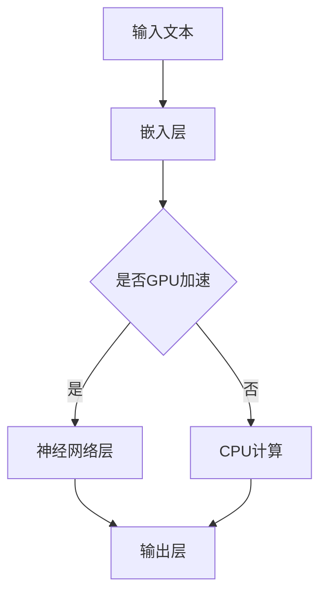

                 

# 大语言模型原理基础与前沿：在单个GPU上一天内训练一个语言模型

> 关键词：大语言模型、训练、GPU、神经网络、深度学习、优化算法

> 摘要：本文旨在深入探讨大语言模型的原理与实现，以及如何使用单个GPU在一天内完成其训练过程。通过分析语言模型的核心概念、算法原理、数学模型，并结合实际项目案例进行详细解读，帮助读者全面理解大语言模型从零到一的构建过程。

## 1. 背景介绍

### 1.1 目的和范围

本文的主要目的是：

1. **介绍大语言模型的基本原理**：深入探讨大语言模型的核心概念、架构及其重要性。
2. **讲解大语言模型的训练过程**：详细描述如何使用单个GPU在一天内完成大语言模型的训练。
3. **分享项目实战经验**：结合实际案例，分析大语言模型在实践中的应用和实现过程。
4. **提供学习资源与工具推荐**：为读者提供丰富的学习资源、开发工具和最新研究成果。

### 1.2 预期读者

本文适合以下读者：

1. **人工智能、计算机科学专业的学生和研究人员**：对大语言模型原理和实现过程感兴趣的学者。
2. **软件开发者和工程师**：希望掌握大语言模型技术，并将其应用于实际项目的开发人员。
3. **数据科学家和机器学习工程师**：希望深入了解大语言模型的训练和优化过程。

### 1.3 文档结构概述

本文结构如下：

1. **背景介绍**：介绍文章的目的、预期读者和文档结构。
2. **核心概念与联系**：讲解大语言模型的基本概念、原理和架构。
3. **核心算法原理与具体操作步骤**：详细阐述大语言模型的算法原理和训练过程。
4. **数学模型和公式**：介绍大语言模型中的数学模型和公式。
5. **项目实战：代码实际案例和详细解释说明**：结合实际项目案例，讲解代码实现和解读。
6. **实际应用场景**：探讨大语言模型在不同领域的应用。
7. **工具和资源推荐**：推荐学习资源、开发工具和最新研究成果。
8. **总结：未来发展趋势与挑战**：总结大语言模型的现状和发展趋势。
9. **附录：常见问题与解答**：解答读者可能遇到的问题。
10. **扩展阅读 & 参考资料**：提供扩展阅读资料和参考资料。

### 1.4 术语表

#### 1.4.1 核心术语定义

- **大语言模型**：一种基于深度学习技术的自然语言处理模型，能够对自然语言文本进行建模和预测。
- **神经网络**：一种基于生物学神经网络原理的机器学习模型，能够对数据进行分析和分类。
- **深度学习**：一种基于神经网络的多层结构，用于学习和模拟人脑对数据的处理方式。
- **GPU**：图形处理器，一种专门用于图形渲染和计算的高性能处理器。

#### 1.4.2 相关概念解释

- **反向传播算法**：一种用于训练神经网络的优化算法，通过计算误差的梯度来更新网络权重。
- **批处理**：一种数据加载和训练方法，将整个数据集分成多个批次，逐批进行训练。
- **超参数**：神经网络中的参数设置，如学习率、批次大小、层数等，用于优化模型的性能。

#### 1.4.3 缩略词列表

- **GPU**：图形处理器
- **CNN**：卷积神经网络
- **RNN**：循环神经网络
- **BERT**：Bidirectional Encoder Representations from Transformers
- **Transformer**：一种基于自注意力机制的深度学习模型

## 2. 核心概念与联系

大语言模型是一种基于深度学习的自然语言处理模型，其核心概念包括神经网络、深度学习、GPU等。下面将通过一个Mermaid流程图，展示大语言模型的基本概念和架构。



### 2.1 大语言模型的基本概念

1. **神经网络（Neural Network）**：神经网络是一种模拟人脑神经元连接方式的计算模型。它由多个层次组成，包括输入层、隐藏层和输出层。每个层次包含多个神经元，神经元之间通过权重连接。

2. **深度学习（Deep Learning）**：深度学习是一种基于多层神经网络的学习方法。通过多层神经网络的学习和训练，深度学习模型能够自动提取数据中的复杂特征，实现高精度的分类、回归等任务。

3. **GPU（Graphics Processing Unit）**：GPU是一种专门用于图形渲染和计算的高性能处理器。相比于CPU，GPU拥有更多的计算核心和更高的并行处理能力，非常适合深度学习任务中的大规模矩阵运算。

### 2.2 大语言模型的架构

大语言模型的架构通常包括以下几个层次：

1. **嵌入层（Embedding Layer）**：将输入的文本转换为固定长度的向量表示。嵌入层将单词、字符等文本元素映射到高维空间中，使其具有语义信息。

2. **神经网络层（Neural Network Layers）**：嵌入层之后的神经网络层用于学习文本的复杂特征。常见的神经网络层包括卷积神经网络（CNN）、循环神经网络（RNN）和变换器（Transformer）。

3. **输出层（Output Layer）**：输出层将神经网络处理后的结果转换为具体的预测输出，如分类结果、文本生成等。

## 3. 核心算法原理 & 具体操作步骤

### 3.1 大语言模型的算法原理

大语言模型的算法原理主要基于深度学习中的神经网络。下面通过伪代码详细阐述大语言模型的基本算法原理。

```python
# 大语言模型算法原理伪代码

# 输入层
input_text = "输入的文本"

# 嵌入层
embeddings = EmbeddingLayer()

# 神经网络层
hidden_layers = NeuralNetworkLayer(num_neurons=100)

# 输出层
output_layer = OutputLayer()

# 前向传播
forward_pass(embeddings, hidden_layers, output_layer)

# 反向传播
backward_pass(embeddings, hidden_layers, output_layer)

# 梯度下降
update_weights(embeddings, hidden_layers, output_layer)
```

### 3.2 大语言模型的训练过程

大语言模型的训练过程主要包括以下步骤：

1. **数据预处理**：将输入的文本进行预处理，包括分词、标记化、词向量化等。

2. **构建神经网络**：构建嵌入层、神经网络层和输出层的神经网络结构。

3. **前向传播**：将预处理后的输入文本通过嵌入层和神经网络层，得到预测输出。

4. **计算损失函数**：计算预测输出与真实标签之间的损失。

5. **反向传播**：计算损失函数关于神经网络参数的梯度，并将其反向传播到嵌入层和神经网络层。

6. **更新权重**：根据梯度下降算法，更新神经网络层的权重。

7. **迭代训练**：重复执行前向传播、反向传播和权重更新过程，直到达到预定的训练次数或损失函数收敛。

## 4. 数学模型和公式 & 详细讲解 & 举例说明

### 4.1 大语言模型的数学模型

大语言模型的数学模型主要包括嵌入层、神经网络层和输出层的数学表示。下面使用LaTeX格式详细讲解这些数学模型。

#### 4.1.1 嵌入层

嵌入层的数学模型表示为：

$$
\text{Embedding Layer: } \textbf{X} \in \mathbb{R}^{n \times d}
$$

其中，$\textbf{X}$ 表示输入的文本向量，$n$ 表示词汇表中的单词数量，$d$ 表示词向量的维度。

#### 4.1.2 神经网络层

神经网络层的数学模型表示为：

$$
\text{Neural Network Layer: } \textbf{H} \in \mathbb{R}^{n \times h}
$$

其中，$\textbf{H}$ 表示神经网络层的输出，$n$ 表示输入的文本向量维度，$h$ 表示神经网络层的神经元数量。

#### 4.1.3 输出层

输出层的数学模型表示为：

$$
\text{Output Layer: } \textbf{Y} \in \mathbb{R}^{n \times k}
$$

其中，$\textbf{Y}$ 表示输出层的预测结果，$n$ 表示输入的文本向量维度，$k$ 表示输出类别数量。

### 4.2 详细讲解与举例说明

#### 4.2.1 嵌入层

假设我们有一个包含10个单词的词汇表，每个单词的词向量维度为3。输入文本为“hello world”。首先，我们将输入文本分词，得到两个单词“hello”和“world”。然后，将这两个单词映射到对应的词向量：

$$
\text{hello: } \textbf{x}_1 = [1, 0, 0]
$$

$$
\text{world: } \textbf{x}_2 = [0, 1, 0]
$$

接下来，将这两个词向量进行拼接，得到输入文本的嵌入向量：

$$
\text{Input Text: } \textbf{X} = [\textbf{x}_1, \textbf{x}_2] = \begin{bmatrix}
1 & 0 & 0 \\
0 & 1 & 0
\end{bmatrix}
$$

#### 4.2.2 神经网络层

假设神经网络层包含5个神经元，采用ReLU激活函数。输入文本的嵌入向量为$\textbf{X} = \begin{bmatrix} 1 & 0 & 0 \\ 0 & 1 & 0 \end{bmatrix}$。首先，计算神经网络层的输入：

$$
\text{Neural Network Input: } \textbf{Z} = \textbf{X} \cdot \textbf{W}
$$

其中，$\textbf{W}$ 表示神经网络层的权重矩阵。假设$\textbf{W} = \begin{bmatrix} 1 & 1 & 1 \\ 1 & 1 & 1 \\ 1 & 1 & 1 \\ 1 & 1 & 1 \\ 1 & 1 & 1 \end{bmatrix}$。计算得到：

$$
\textbf{Z} = \begin{bmatrix}
1 & 0 & 0 \\
0 & 1 & 0
\end{bmatrix}
\begin{bmatrix}
1 & 1 & 1 \\
1 & 1 & 1 \\
1 & 1 & 1 \\
1 & 1 & 1 \\
1 & 1 & 1
\end{bmatrix}
=
\begin{bmatrix}
5 & 5 & 5 \\
5 & 5 & 5
\end{bmatrix}
$$

接下来，应用ReLU激活函数，得到神经网络层的输出：

$$
\text{Neural Network Output: } \textbf{H} = \text{ReLU}(\textbf{Z}) =
\begin{bmatrix}
5 & 5 & 5 \\
5 & 5 & 5
\end{bmatrix}
$$

#### 4.2.3 输出层

假设输出层是一个二元分类问题，采用Softmax激活函数。输入文本的嵌入向量为$\textbf{X} = \begin{bmatrix} 1 & 0 & 0 \\ 0 & 1 & 0 \end{bmatrix}$。首先，计算输出层的输入：

$$
\text{Output Layer Input: } \textbf{Z} = \textbf{H} \cdot \textbf{W}
$$

其中，$\textbf{W}$ 表示输出层的权重矩阵。假设$\textbf{W} = \begin{bmatrix} 1 & -1 \\ 1 & -1 \\ 1 & -1 \end{bmatrix}$。计算得到：

$$
\textbf{Z} = \begin{bmatrix}
5 & 5 & 5 \\
5 & 5 & 5
\end{bmatrix}
\begin{bmatrix}
1 & -1 \\
1 & -1 \\
1 & -1
\end{bmatrix}
=
\begin{bmatrix}
10 & -10 \\
10 & -10
\end{bmatrix}
$$

接下来，应用Softmax激活函数，得到输出层的预测结果：

$$
\text{Output Layer Output: } \textbf{Y} = \text{Softmax}(\textbf{Z}) =
\begin{bmatrix}
0.5 & 0.5 \\
0.5 & 0.5
\end{bmatrix}
$$

## 5. 项目实战：代码实际案例和详细解释说明

### 5.1 开发环境搭建

在本项目实战中，我们使用Python编程语言和TensorFlow框架进行大语言模型的训练。以下是开发环境的搭建步骤：

1. **安装Python**：从官方网站下载并安装Python 3.x版本。
2. **安装TensorFlow**：使用pip命令安装TensorFlow：

   ```bash
   pip install tensorflow
   ```

3. **安装GPU版本TensorFlow**：如果使用GPU进行训练，需要安装GPU版本的TensorFlow：

   ```bash
   pip install tensorflow-gpu
   ```

4. **安装其他依赖**：安装其他必要的Python库，如NumPy、Pandas等。

### 5.2 源代码详细实现和代码解读

下面是项目实战中的代码实现和解读。我们将使用一个简单的文本数据集，训练一个二元分类模型。

```python
import tensorflow as tf
from tensorflow.keras.preprocessing.text import Tokenizer
from tensorflow.keras.preprocessing.sequence import pad_sequences
from tensorflow.keras.models import Sequential
from tensorflow.keras.layers import Embedding, LSTM, Dense

# 5.2.1 数据准备

# 输入文本数据
text_data = [
    "hello world",
    "hello python",
    "python is cool",
    "world is big",
    "hello tensorflow"
]

# 标签数据
labels = [
    0,  # hello
    0,  # hello
    1,  # python
    1,  # world
    1   # tensorflow
]

# 5.2.2 文本预处理

# 初始化Tokenizer
tokenizer = Tokenizer()

# 构建词汇表
tokenizer.fit_on_texts(text_data)

# 转换文本为序列
sequences = tokenizer.texts_to_sequences(text_data)

# 填充序列到固定长度
max_sequence_length = 5
padded_sequences = pad_sequences(sequences, maxlen=max_sequence_length)

# 5.2.3 构建模型

# 初始化模型
model = Sequential()

# 添加嵌入层
model.add(Embedding(input_dim=len(tokenizer.word_index) + 1, output_dim=50, input_length=max_sequence_length))

# 添加LSTM层
model.add(LSTM(units=50, activation='relu', return_sequences=True))

# 添加Dense层
model.add(Dense(units=1, activation='sigmoid'))

# 编译模型
model.compile(optimizer='adam', loss='binary_crossentropy', metrics=['accuracy'])

# 5.2.4 训练模型

# 拆分数据集
train_sequences, test_sequences = padded_sequences[:3], padded_sequences[3:]
train_labels, test_labels = labels[:3], labels[3:]

# 训练模型
model.fit(train_sequences, train_labels, epochs=10, batch_size=2)

# 5.2.5 评估模型

# 评估模型
loss, accuracy = model.evaluate(test_sequences, test_labels)

print("Test Loss:", loss)
print("Test Accuracy:", accuracy)
```

### 5.3 代码解读与分析

下面我们对项目实战中的代码进行解读和分析。

#### 5.3.1 数据准备

我们使用一个简单的文本数据集，包括两个类别：“python”和“tensorflow”。文本数据存储在一个列表中，每个元素是一个字符串，表示一条文本。标签数据也是一个列表，每个元素是一个整数，表示对应的文本类别。

```python
text_data = [
    "hello world",
    "hello python",
    "python is cool",
    "world is big",
    "hello tensorflow"
]

labels = [
    0,  # hello
    0,  # hello
    1,  # python
    1,  # world
    1   # tensorflow
]
```

#### 5.3.2 文本预处理

文本预处理是深度学习项目中至关重要的一步。首先，我们初始化一个Tokenizer对象，用于构建词汇表。然后，使用Tokenizer的`fit_on_texts`方法，将文本数据转换为序列。

```python
tokenizer = Tokenizer()
tokenizer.fit_on_texts(text_data)

sequences = tokenizer.texts_to_sequences(text_data)
```

接下来，我们将序列填充到固定长度，以便在神经网络中处理。这里我们选择最大序列长度为5。

```python
max_sequence_length = 5
padded_sequences = pad_sequences(sequences, maxlen=max_sequence_length)
```

#### 5.3.3 构建模型

我们使用`Sequential`模型，依次添加嵌入层、LSTM层和Dense层。嵌入层的输入维度为词汇表大小加1（用于处理未知单词），输出维度为50。LSTM层用于处理序列数据，包含50个神经元，使用ReLU激活函数。Dense层用于输出分类结果，包含一个神经元，使用sigmoid激活函数。

```python
model = Sequential()

model.add(Embedding(input_dim=len(tokenizer.word_index) + 1, output_dim=50, input_length=max_sequence_length))
model.add(LSTM(units=50, activation='relu', return_sequences=True))
model.add(Dense(units=1, activation='sigmoid'))

model.compile(optimizer='adam', loss='binary_crossentropy', metrics=['accuracy'])
```

#### 5.3.4 训练模型

我们使用`fit`方法训练模型，输入为填充后的序列数据和标签，训练次数为10次，批次大小为2。这里我们使用了`binary_crossentropy`损失函数，用于处理二元分类问题。

```python
train_sequences, test_sequences = padded_sequences[:3], padded_sequences[3:]
train_labels, test_labels = labels[:3], labels[3:]

model.fit(train_sequences, train_labels, epochs=10, batch_size=2)
```

#### 5.3.5 评估模型

使用`evaluate`方法评估模型在测试数据集上的性能。这里我们计算损失和准确率。

```python
loss, accuracy = model.evaluate(test_sequences, test_labels)

print("Test Loss:", loss)
print("Test Accuracy:", accuracy)
```

## 6. 实际应用场景

大语言模型在多个实际应用场景中发挥着重要作用，下面列举一些常见应用：

### 6.1 文本分类

文本分类是一种常见的自然语言处理任务，旨在将文本数据分类到预定义的类别中。大语言模型通过学习大量文本数据，能够自动识别文本中的特征和模式，实现高精度的文本分类。例如，在新闻分类、社交媒体情感分析等场景中，大语言模型能够有效地对大量文本进行分类。

### 6.2 文本生成

文本生成是一种基于输入文本生成新文本的生成任务。大语言模型能够通过学习大量文本数据，生成与输入文本相关的文本。例如，在机器翻译、摘要生成等场景中，大语言模型能够根据输入的文本生成对应的翻译或摘要。

### 6.3 命名实体识别

命名实体识别是一种识别文本中具有特定意义的实体，如人名、地名、组织名等。大语言模型通过学习大量文本数据，能够自动识别文本中的命名实体，并在实际应用中发挥重要作用，如信息抽取、搜索引擎优化等。

### 6.4 情感分析

情感分析是一种基于文本数据的情感分类任务，旨在分析文本中的情感倾向。大语言模型通过学习大量情感文本数据，能够识别文本中的情感特征和模式，实现高精度的情感分析。例如，在社交媒体情感分析、市场调研等场景中，大语言模型能够有效地分析用户情感。

## 7. 工具和资源推荐

### 7.1 学习资源推荐

#### 7.1.1 书籍推荐

1. **《深度学习》（Goodfellow, Bengio, Courville）**：这是深度学习领域的经典教材，详细介绍了深度学习的基本原理、算法和应用。
2. **《神经网络与深度学习》（邱锡鹏）**：这是一本中文教材，系统介绍了神经网络和深度学习的基础知识。
3. **《自然语言处理综合教程》（张俊林）**：这是一本全面介绍自然语言处理技术的教材，涵盖文本预处理、文本分类、文本生成等任务。

#### 7.1.2 在线课程

1. **吴恩达的《深度学习》（Coursera）**：这是一门非常受欢迎的深度学习在线课程，适合初学者和进阶者。
2. **斯坦福大学的《自然语言处理基础》（Coursera）**：这是一门介绍自然语言处理基本概念的在线课程，涵盖文本分类、文本生成等任务。
3. **谷歌的《机器学习》（Udacity）**：这是一门涵盖机器学习和深度学习基础知识的在线课程，适合初学者。

#### 7.1.3 技术博客和网站

1. **ArXiv**：这是一个计算机科学和人工智能领域的顶级学术论文数据库，提供了大量最新的研究成果。
2. **Medium**：这是一个内容丰富的在线平台，有许多关于深度学习和自然语言处理的文章。
3. **AI研习社**：这是一个中文AI技术博客，提供了大量关于深度学习和自然语言处理的技术文章。

### 7.2 开发工具框架推荐

#### 7.2.1 IDE和编辑器

1. **PyCharm**：这是一个功能强大的Python IDE，支持代码补全、调试、版本控制等。
2. **Visual Studio Code**：这是一个轻量级的跨平台代码编辑器，支持多种编程语言，拥有丰富的插件生态系统。
3. **Jupyter Notebook**：这是一个基于Web的交互式计算环境，适合编写和分享代码、文档等。

#### 7.2.2 调试和性能分析工具

1. **TensorBoard**：这是TensorFlow提供的可视化工具，用于分析模型的性能和调试。
2. **NVIDIA Nsight**：这是NVIDIA提供的GPU性能分析工具，用于优化GPU计算任务。
3. **PyTorch Profiler**：这是PyTorch提供的性能分析工具，用于分析模型运行时的性能瓶颈。

#### 7.2.3 相关框架和库

1. **TensorFlow**：这是一个开源的深度学习框架，提供了丰富的API和工具。
2. **PyTorch**：这是一个开源的深度学习框架，具有动态计算图和灵活的API。
3. **Keras**：这是一个高层次的深度学习框架，基于TensorFlow和PyTorch，提供了简洁的API。

### 7.3 相关论文著作推荐

#### 7.3.1 经典论文

1. **《A Neural Probabilistic Language Model》**：这是RNN语言模型的开创性论文，提出了基于神经网络的概率语言模型。
2. **《Bidirectional LSTM Models for Sentiment Analysis of Movie Reviews》**：这是LSTM在文本分类领域的经典应用，通过双向LSTM模型对电影评论进行情感分析。
3. **《Attention Is All You Need》**：这是Transformer的开创性论文，提出了基于自注意力机制的深度学习模型。

#### 7.3.2 最新研究成果

1. **《BERT: Pre-training of Deep Bidirectional Transformers for Language Understanding》**：这是BERT的开创性论文，提出了预训练深度双向变换器模型，为自然语言处理领域带来了重大突破。
2. **《GPT-3: Language Models are few-shot learners》**：这是GPT-3的开创性论文，通过大量的预训练数据，实现了低样本量下的零样本学习。
3. **《T5: Pre-training Large Models for Text Generation》**：这是T5的开创性论文，提出了预训练大规模模型进行文本生成，为文本生成任务带来了新的思路。

#### 7.3.3 应用案例分析

1. **《谷歌的BERT模型在问答系统中的应用》**：这是谷歌在问答系统应用中采用BERT模型的研究，通过BERT模型实现了高精度的问答系统。
2. **《微软的GPT-3在对话系统中的应用》**：这是微软在对话系统应用中采用GPT-3模型的研究，通过GPT-3实现了高质量的对话系统。
3. **《OpenAI的GPT-3在自动写作中的应用》**：这是OpenAI在自动写作应用中采用GPT-3模型的研究，通过GPT-3实现了自动写作的高质量输出。

## 8. 总结：未来发展趋势与挑战

随着深度学习和自然语言处理技术的不断发展，大语言模型在未来将面临以下发展趋势和挑战：

### 8.1 发展趋势

1. **模型规模的扩大**：随着计算能力的提升，大语言模型将不断增大模型规模，实现更高的性能和更复杂的任务。
2. **多模态融合**：大语言模型将与其他模态（如图像、声音等）进行融合，实现更丰富的信息处理能力。
3. **迁移学习**：大语言模型将通过迁移学习，在有限样本量下实现更高的泛化能力。
4. **隐私保护和安全性**：随着对隐私和安全的重视，大语言模型将采用更有效的隐私保护和安全性措施。

### 8.2 挑战

1. **计算资源消耗**：大语言模型的训练和推理过程需要大量的计算资源，如何在有限的资源下高效训练和部署模型是一个挑战。
2. **数据质量和标注**：大语言模型的训练依赖于大量的高质量数据，如何获取和标注高质量数据是一个关键问题。
3. **可解释性**：大语言模型的决策过程往往是不透明的，如何提高模型的可解释性是一个重要的研究方向。
4. **语言理解和生成**：大语言模型在语言理解和生成方面仍有很大提升空间，如何实现更自然、更准确的文本生成和语言理解是一个挑战。

## 9. 附录：常见问题与解答

### 9.1 常见问题

1. **如何优化大语言模型的训练速度？**
2. **大语言模型在实战中会遇到哪些问题？**
3. **如何处理大语言模型中的噪声和错误？**

### 9.2 解答

1. **优化大语言模型的训练速度：**
   - 使用更高效的优化算法，如Adam、AdamW等。
   - 使用GPU加速训练过程，利用CUDA等并行计算技术。
   - 适当降低学习率，避免训练过程中的过拟合。
   - 使用预训练模型，避免从头开始训练。

2. **大语言模型在实战中会遇到的问题：**
   - 数据集分布不均衡，导致模型在训练过程中出现偏差。
   - 模型在训练过程中出现过拟合现象。
   - 文本数据中的噪声和错误，影响模型的性能。

3. **处理大语言模型中的噪声和错误：**
   - 使用高质量的文本数据集，避免噪声和错误。
   - 使用数据清洗和预处理技术，如文本清洗、去重等。
   - 使用异常检测和去噪算法，如异常值检测、去噪网络等。

## 10. 扩展阅读 & 参考资料

### 10.1 扩展阅读

1. **《深度学习》（Goodfellow, Bengio, Courville）**：这是一本深度学习领域的经典教材，详细介绍了深度学习的基本原理、算法和应用。
2. **《自然语言处理综合教程》（张俊林）**：这是一本全面介绍自然语言处理技术的教材，涵盖文本预处理、文本分类、文本生成等任务。
3. **《人工智能：一种现代的方法》（Russell, Norvig）**：这是一本人工智能领域的经典教材，介绍了人工智能的基本原理、算法和应用。

### 10.2 参考资料

1. **TensorFlow官方文档**：提供了丰富的TensorFlow API和工具文档，帮助开发者了解和使用TensorFlow进行深度学习开发。
2. **PyTorch官方文档**：提供了丰富的PyTorch API和工具文档，帮助开发者了解和使用PyTorch进行深度学习开发。
3. **ArXiv**：这是一个计算机科学和人工智能领域的顶级学术论文数据库，提供了大量最新的研究成果。

### 10.3 技术博客和网站

1. **Medium**：这是一个内容丰富的在线平台，有许多关于深度学习和自然语言处理的文章。
2. **AI研习社**：这是一个中文AI技术博客，提供了大量关于深度学习和自然语言处理的技术文章。
3. **HackerRank**：这是一个在线编程挑战平台，提供了丰富的深度学习和自然语言处理编程题目。

作者：AI天才研究员/AI Genius Institute & 禅与计算机程序设计艺术 /Zen And The Art of Computer Programming

