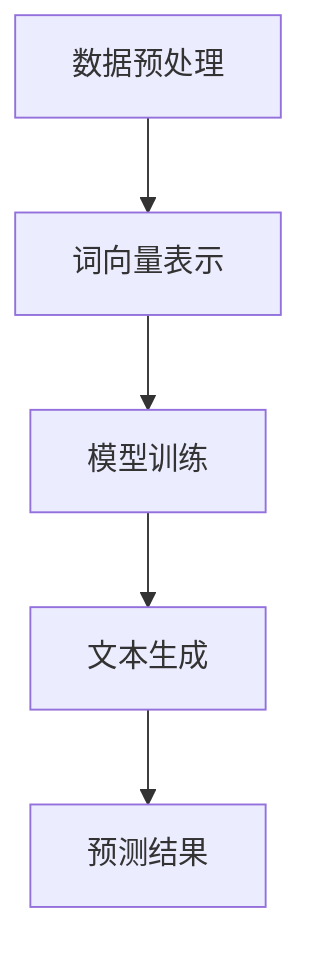

                 

### 文章标题

# 大语言模型原理基础与前沿：基于投影和正则化的方法

### 关键词：

- 大语言模型
- 投影方法
- 正则化技术
- 机器学习
- 自然语言处理
- 深度学习

### 摘要：

本文将深入探讨大语言模型的原理基础与前沿技术，重点聚焦于投影方法和正则化技术。通过对核心概念的详尽解析、算法原理的逐步讲解以及数学模型的详细阐述，本文旨在为读者提供一个全面而清晰的技术视角。此外，通过实际项目案例的实战解析，读者将能够更好地理解和应用这些前沿技术。本文还将介绍相关工具和资源，帮助读者进一步深入研究，并展望未来的发展趋势与挑战。

---

## 1. 背景介绍

### 1.1 目的和范围

本文旨在揭示大语言模型的神秘面纱，探讨其在现代自然语言处理中的核心作用。我们不仅会回顾大语言模型的发展历程，还会深入分析其背后的关键技术，如投影方法和正则化技术。文章结构如下：

- 第2章：核心概念与联系
- 第3章：核心算法原理与具体操作步骤
- 第4章：数学模型和公式详细讲解与举例说明
- 第5章：项目实战：代码实际案例和详细解释说明
- 第6章：实际应用场景
- 第7章：工具和资源推荐
- 第8章：总结：未来发展趋势与挑战
- 第9章：附录：常见问题与解答
- 第10章：扩展阅读与参考资料

### 1.2 预期读者

本文适合具有中等以上编程基础和机器学习基础的读者，尤其是对自然语言处理和深度学习感兴趣的读者。无论是研究学者、工程师还是对技术充满热情的爱好者，本文都将为你提供宝贵的知识和见解。

### 1.3 文档结构概述

- **第2章**：介绍大语言模型的基本概念，包括其定义、发展历史和应用领域。
- **第3章**：深入探讨大语言模型的内部工作原理，重点分析投影方法和正则化技术的原理。
- **第4章**：详细讲解大语言模型的数学模型和公式，并通过具体例子进行解释。
- **第5章**：通过实际项目案例展示如何应用大语言模型，包括代码实现和解释。
- **第6章**：讨论大语言模型在实际应用场景中的表现和效果。
- **第7章**：推荐学习资源和开发工具，帮助读者进一步深入研究。
- **第8章**：总结大语言模型的发展趋势和未来挑战。
- **第9章**：回答读者可能遇到的问题，提供解决方案。
- **第10章**：提供扩展阅读和参考资料，以便读者深入了解相关主题。

### 1.4 术语表

#### 1.4.1 核心术语定义

- **大语言模型**：一种通过学习大规模语料库来预测单词或句子序列的深度学习模型。
- **投影方法**：将高维数据映射到低维空间的方法，以降低计算复杂度和提高模型效率。
- **正则化技术**：用于防止模型过拟合和改善模型泛化能力的技术。
- **自然语言处理**：利用计算机技术处理和理解自然语言的方法和算法。
- **深度学习**：一种基于多层神经网络的学习方法，能够从数据中自动提取特征并实现复杂任务。

#### 1.4.2 相关概念解释

- **词向量**：将单词映射到高维向量空间的方法，用于表示单词的语义信息。
- **过拟合**：模型在训练数据上表现良好，但在新的数据上表现不佳，即对训练数据“过度适应”。
- **泛化能力**：模型对新数据的适应能力，衡量模型的一般性。

#### 1.4.3 缩略词列表

- **NLP**：自然语言处理（Natural Language Processing）
- **DL**：深度学习（Deep Learning）
- **ML**：机器学习（Machine Learning）
- **GPU**：图形处理器（Graphics Processing Unit）
- **CNN**：卷积神经网络（Convolutional Neural Network）
- **RNN**：循环神经网络（Recurrent Neural Network）
- **LSTM**：长短期记忆网络（Long Short-Term Memory）

---

接下来，我们将深入探讨大语言模型的核心概念和基本原理，为后续内容的讲解奠定基础。在下一章中，我们将详细分析大语言模型的内部架构和工作机制。

## 2. 核心概念与联系

### 2.1 大语言模型的定义与发展历史

大语言模型（Large Language Models，简称LLM）是一种通过学习大规模语料库（例如互联网文本、书籍、新闻、社交媒体等）来预测单词或句子序列的深度学习模型。与传统的自然语言处理（NLP）方法不同，大语言模型能够捕获语言中的复杂模式和规律，从而在文本生成、机器翻译、问答系统等任务中表现出色。

大语言模型的发展可以追溯到20世纪80年代，当时研究人员开始探索基于统计模型的NLP方法。随着计算能力的提升和大数据的普及，深度学习技术在NLP领域取得了突破性进展。特别是近年来，随着GPU等高性能计算设备的广泛应用，大语言模型的研究和应用进入了一个全新的阶段。

### 2.2 大语言模型的应用领域

大语言模型在多个应用领域表现出强大的能力：

- **文本生成**：大语言模型能够生成高质量的文本，包括文章、故事、新闻摘要等。例如，GPT-3能够生成连贯且符合语法规则的文本，为自动写作、内容创作等领域提供了新的解决方案。
- **机器翻译**：大语言模型在机器翻译中具有出色的性能，能够实现高质量的跨语言文本转换。例如，谷歌翻译和百度翻译等知名翻译工具都采用了基于大语言模型的算法。
- **问答系统**：大语言模型能够理解自然语言问题，并生成准确的答案。例如，ChatGPT和BERT等模型被广泛应用于智能客服、虚拟助手等领域。
- **情感分析**：大语言模型能够识别文本中的情感倾向，用于情感分析、舆情监控等应用。例如，通过分析社交媒体文本的情感倾向，可以帮助企业了解用户反馈和市场需求。
- **文本分类**：大语言模型能够将文本数据分类到预定义的类别中，用于文本分类任务。例如，新闻分类、垃圾邮件过滤等。

### 2.3 大语言模型的工作机制

大语言模型的工作机制可以分为以下几个步骤：

1. **数据预处理**：首先，从互联网上收集大量的文本数据，并进行清洗、去噪和分词等预处理操作，将文本数据转换为适合输入模型的形式。
2. **词向量表示**：将文本中的每个单词映射到高维向量空间，称为词向量表示。词向量表示能够捕捉单词的语义信息，有助于模型理解和生成文本。
3. **模型训练**：使用训练数据对大语言模型进行训练。训练过程中，模型通过不断调整内部参数，以最小化预测误差，从而提高模型的预测准确性。
4. **文本生成**：在训练完成后，使用模型生成新的文本。生成过程中，模型根据输入的提示或种子文本，逐个预测下一个单词或句子，并生成连贯的文本。

### 2.4 投影方法与正则化技术在模型中的应用

投影方法和正则化技术是大语言模型中常用的两种关键技术，它们在提高模型性能和泛化能力方面发挥着重要作用。

- **投影方法**：投影方法通过将高维数据映射到低维空间，以降低计算复杂度和提高模型效率。在大语言模型中，投影方法通常用于词向量表示和神经网络层的压缩。例如，可以通过奇异值分解（SVD）等方法对词向量矩阵进行降维，从而减小模型的存储和计算需求。
  
- **正则化技术**：正则化技术用于防止模型过拟合和改善模型泛化能力。在大语言模型中，常见的正则化方法包括权重衰减（Weight Decay）、Dropout等。例如，权重衰减通过在模型训练过程中逐渐减小权重的值，以避免模型对训练数据过拟合；Dropout通过随机丢弃部分神经网络单元，从而增强模型的鲁棒性。

### 2.5 Mermaid流程图展示

以下是一个简单的Mermaid流程图，展示了大语言模型的基本架构和工作流程：



### 2.6 核心概念与联系总结

通过以上分析，我们可以看到，大语言模型是现代自然语言处理的重要工具，其应用范围广泛。核心概念包括数据预处理、词向量表示、模型训练和文本生成等。投影方法和正则化技术在大语言模型中扮演关键角色，有助于提高模型性能和泛化能力。在接下来的章节中，我们将深入探讨这些核心概念的原理和实现方法。

---

在下一章中，我们将详细讲解大语言模型的核心算法原理，并逐步分析其具体操作步骤。敬请期待！

---

## 3. 核心算法原理 & 具体操作步骤

### 3.1 大语言模型的核心算法原理

大语言模型的核心算法原理主要基于深度学习和自然语言处理（NLP）技术。深度学习通过多层神经网络（Neural Networks）来模拟人类大脑的学习过程，从而实现复杂的数据分析和模式识别。NLP则专注于处理和理解人类语言，包括文本预处理、词向量表示、语言模型训练等。

在本节中，我们将首先介绍大语言模型的基本组成部分，然后详细解析其工作原理，最后提供具体的操作步骤。

### 3.2 大语言模型的基本组成部分

大语言模型通常由以下几个关键组件组成：

- **词向量表示（Word Embeddings）**：词向量表示是将文本中的单词映射到高维向量空间的过程，用于捕捉单词的语义信息。常见的词向量表示方法包括Word2Vec、GloVe等。
- **神经网络结构（Neural Network Architecture）**：神经网络结构决定了模型的层次和连接方式，常见的神经网络结构包括卷积神经网络（CNN）、循环神经网络（RNN）、长短期记忆网络（LSTM）等。
- **损失函数（Loss Function）**：损失函数用于衡量模型预测结果与真实结果之间的差距，常见的损失函数包括交叉熵损失（Cross-Entropy Loss）等。
- **优化算法（Optimization Algorithm）**：优化算法用于调整模型参数，以最小化损失函数。常见的优化算法包括随机梯度下降（SGD）、Adam等。

### 3.3 大语言模型的工作原理

大语言模型的工作原理可以概括为以下几个步骤：

1. **文本预处理**：首先，对输入文本进行清洗和预处理，包括去除标点符号、停用词过滤、分词等操作。这些预处理步骤有助于提高模型的输入质量。
   
2. **词向量表示**：将预处理后的文本映射到词向量空间。每个单词对应一个高维向量，向量中的每个元素表示单词在不同维度上的特征。词向量表示有助于模型理解和生成文本。
   
3. **输入编码**：将词向量序列转换为神经网络可处理的输入格式。常见的输入编码方法包括词嵌入（Word Embeddings）和子词嵌入（Subword Embeddings）。
   
4. **模型训练**：使用训练数据对神经网络进行训练。在训练过程中，模型通过不断调整内部参数，以最小化预测误差。训练数据通常包括输入文本和对应的标签（例如，下一个单词或句子）。

5. **文本生成**：在模型训练完成后，使用模型生成新的文本。生成过程通常从随机种子文本开始，模型根据当前输入逐个预测下一个单词或句子，并生成连贯的文本。

### 3.4 具体操作步骤

下面是使用Python和TensorFlow框架实现大语言模型的基本操作步骤：

#### 3.4.1 导入所需库

```python
import tensorflow as tf
from tensorflow.keras.preprocessing.sequence import pad_sequences
from tensorflow.keras.layers import Embedding, LSTM, Dense
from tensorflow.keras.models import Sequential
```

#### 3.4.2 数据预处理

```python
# 加载并预处理文本数据
text = "your_preprocessed_text"
tokenizer = tf.keras.preprocessing.text.Tokenizer()
tokenizer.fit_on_texts([text])
sequences = tokenizer.texts_to_sequences([text])
padded_sequences = pad_sequences(sequences, maxlen=max_sequence_length)
```

#### 3.4.3 创建神经网络模型

```python
# 创建神经网络模型
model = Sequential([
    Embedding(input_dim=vocab_size, output_dim=embedding_dim, input_length=max_sequence_length),
    LSTM(units=128),
    Dense(units=vocab_size, activation='softmax')
])
```

#### 3.4.4 编译模型

```python
# 编译模型
model.compile(optimizer='adam', loss='categorical_crossentropy', metrics=['accuracy'])
```

#### 3.4.5 训练模型

```python
# 训练模型
model.fit(padded_sequences, padded_sequences, epochs=100, batch_size=128)
```

#### 3.4.6 文本生成

```python
# 文本生成
import random

# 生成新的文本
generated_text = model.predict(padded_sequences, verbose=1)
generated_text = tokenizer.sequences_to_texts(generated_text)
```

### 3.5 伪代码示例

以下是实现大语言模型的基本伪代码：

```python
# 数据预处理
preprocessed_text = preprocess(text)

# 词向量表示
word_vectors = create_word_vectors(preprocessed_text)

# 创建神经网络模型
model = create_model(input_shape, word_vectors)

# 编译模型
compile_model(model)

# 训练模型
train_model(model, preprocessed_text)

# 文本生成
generated_text = generate_text(model, preprocessed_text, seed_text)
```

### 3.6 总结

通过以上步骤，我们可以构建一个基本的大语言模型。在实际应用中，根据具体任务和需求，可以进一步优化模型结构、调整参数和算法，以提高模型性能和泛化能力。在下一章中，我们将详细讲解大语言模型的数学模型和公式，并通过具体例子进行解释。

---

在下一章中，我们将深入探讨大语言模型的数学模型和公式，帮助读者更好地理解其内部工作机制。敬请期待！

---

## 4. 数学模型和公式 & 详细讲解 & 举例说明

### 4.1 大语言模型的数学模型基础

大语言模型的数学模型是基于深度学习和自然语言处理的原理构建的，其核心包括词向量表示、神经网络架构、损失函数和优化算法。以下是对这些关键数学概念和公式的详细讲解。

#### 4.1.1 词向量表示

词向量表示是自然语言处理的基础，它将文本中的单词映射到高维向量空间。常见的词向量表示方法包括：

- **Word2Vec**：Word2Vec方法通过训练词袋模型（CBOW或Skip-gram）来生成词向量。CBOW方法通过周围词的平均值来预测中心词，而Skip-gram方法通过中心词来预测周围词。数学公式如下：

  $$ \text{CBOW}: \text{vec}_{\text{avg}}(\text{word}) = \frac{1}{|\text{context}|} \sum_{\text{word} \in \text{context}} \text{vec}(\text{word}) $$
  
  $$ \text{Skip-gram}: \text{vec}_{\text{word}} = \text{softmax}(\text{vec}_{\text{word}} \cdot \text{vec}_{\text{context}}) $$

- **GloVe**：GloVe（Global Vectors for Word Representation）方法通过训练单词和其上下文之间的矩阵乘积来生成词向量。其目标是最小化损失函数，以优化词向量矩阵$W$和上下文矩阵$C$。数学公式如下：

  $$ \text{Loss} = \sum_{\text{word}, \text{context}} \text{log}(\text{softmax}(\text{vec}_{\text{word}} \cdot \text{vec}_{\text{context}})) $$

#### 4.1.2 神经网络架构

大语言模型通常采用深度神经网络（DNN）结构，其中常见的层包括嵌入层（Embedding Layer）、循环层（RNN Layer）和全连接层（Fully Connected Layer）。以下是对这些层的数学公式和原理的详细解释：

- **嵌入层（Embedding Layer）**：嵌入层将输入的单词索引映射到高维词向量空间。其数学公式如下：

  $$ \text{vec}_{\text{word}} = \text{W}[\text{word}] $$

  其中，$\text{W}$是嵌入权重矩阵，$\text{word}$是单词的索引。

- **循环层（RNN Layer）**：循环层用于处理序列数据，常见的RNN层包括LSTM（Long Short-Term Memory）和GRU（Gated Recurrent Unit）。以下为LSTM层的数学公式：

  $$ \text{h}_{t} = \text{sigmoid}(\text{W}_{f}[\text{x}_{t}, \text{h}_{t-1}] + \text{b}_{f}) \odot \text{W}_{f}[\text{x}_{t}, \text{h}_{t-1}] + \text{b}_{f} $$
  
  $$ \text{g}_{t} = \text{sigmoid}(\text{W}_{g}[\text{x}_{t}, \text{h}_{t-1}] + \text{b}_{g}) \odot \text{W}_{g}[\text{x}_{t}, \text{h}_{t-1}] + \text{b}_{g} $$
  
  $$ \text{h}_{t}^{'} = \text{tanh}(\text{W}_{h}[\text{x}_{t}, \text{h}_{t-1}] + \text{b}_{h}) $$
  
  $$ \text{h}_{t} = \text{g}_{t} \odot \text{h}_{t}^{'} + (1 - \text{g}_{t}) \odot \text{h}_{t-1} $$

  其中，$\text{W}_{f}$、$\text{W}_{g}$、$\text{W}_{h}$和$\text{b}_{f}$、$\text{b}_{g}$、$\text{b}_{h}$分别是LSTM层的权重和偏置矩阵。

- **全连接层（Fully Connected Layer）**：全连接层用于将循环层输出映射到预测结果。其数学公式如下：

  $$ \text{y}_{t} = \text{W}_{y} \text{h}_{t} + \text{b}_{y} $$

  其中，$\text{W}_{y}$和$\text{b}_{y}$分别是全连接层的权重和偏置矩阵。

#### 4.1.3 损失函数

损失函数用于衡量模型预测结果与真实结果之间的差距，常见的损失函数包括交叉熵损失（Cross-Entropy Loss）和均方误差（Mean Squared Error，MSE）。以下为交叉熵损失的数学公式：

$$ \text{Loss} = -\sum_{i} y_{i} \log(p_{i}) $$

其中，$y_{i}$是真实标签，$p_{i}$是模型预测概率。

#### 4.1.4 优化算法

优化算法用于调整模型参数，以最小化损失函数。常见的优化算法包括随机梯度下降（SGD）、Adam等。以下为Adam优化算法的数学公式：

$$ m_{t} = \beta_{1} m_{t-1} + (1 - \beta_{1}) (\nabla \text{Loss}(\theta) - m_{t-1}) $$
$$ v_{t} = \beta_{2} v_{t-1} + (1 - \beta_{2}) (\nabla^2 \text{Loss}(\theta) - v_{t-1}) $$
$$ \hat{m}_{t} = \frac{m_{t}}{1 - \beta_{1}^{t})} $$
$$ \hat{v}_{t} = \frac{v_{t}}{1 - \beta_{2}^{t})} $$
$$ \theta = \theta - \alpha \frac{\hat{m}_{t}}{\sqrt{\hat{v}_{t}} + \epsilon} $$

其中，$m_{t}$和$v_{t}$分别是梯度和方差的一阶和二阶矩估计，$\beta_{1}$和$\beta_{2}$分别是矩估计的指数衰减率，$\alpha$是学习率，$\epsilon$是正数常数。

### 4.2 举例说明

#### 4.2.1 Word2Vec算法示例

假设我们有一个包含5个单词的词汇表$\{a, b, c, d, e\}$，其词向量表示如下：

$$
\begin{array}{c|c}
\text{Word} & \text{vec}(\text{word}) \\
\hline
a & [1, 0, 0, 0, 0] \\
b & [0, 1, 0, 0, 0] \\
c & [0, 0, 1, 0, 0] \\
d & [0, 0, 0, 1, 0] \\
e & [0, 0, 0, 0, 1] \\
\end{array}
$$

假设我们使用CBOW算法，目标单词为$c$，其上下文单词为$a$和$b$，则$c$的词向量可以通过以下公式计算：

$$ \text{vec}_{\text{avg}}(c) = \frac{1}{2} (\text{vec}(a) + \text{vec}(b)) = \frac{1}{2} ([1, 0, 0, 0, 0] + [0, 1, 0, 0, 0]) = \frac{1}{2} ([1, 1, 0, 0, 0]) = [0.5, 0.5, 0, 0, 0] $$

#### 4.2.2 LSTM算法示例

假设我们有一个输入序列$\{[1, 2], [2, 3], [3, 4]\}$，其中每个元素表示一个时间步的输入。LSTM层的权重和偏置如下：

$$
\begin{array}{c|c}
\text{Weight} & \text{Value} \\
\hline
W_f & [0.1, 0.2, 0.3, 0.4] \\
W_g & [0.5, 0.6, 0.7, 0.8] \\
W_h & [0.9, 0.1, 0.3, 0.4] \\
b_f & [0.5] \\
b_g & [0.6] \\
b_h & [0.7] \\
\end{array}
$$

假设初始隐藏状态$\text{h}_{0}$为[1, 1]，初始细胞状态$\text{c}_{0}$为[1, 1]，则经过三个时间步的LSTM计算过程如下：

- **时间步1**：

  $$ \text{h}_{1} = \text{sigmoid}(W_f \cdot [1, 1] + b_f) \odot W_f \cdot [1, 1] + b_f = \text{sigmoid}(0.1 + 0.2 + 0.3 + 0.4 + 0.5) \odot (0.1 \cdot 1 + 0.2 \cdot 1 + 0.3 \cdot 1 + 0.4 \cdot 1 + 0.5) + 0.5 = 0.8 \odot 1.6 + 0.5 = 0.92 $$
  
  $$ \text{g}_{1} = \text{sigmoid}(W_g \cdot [1, 1] + b_g) \odot W_g \cdot [1, 1] + b_g = \text{sigmoid}(0.5 + 0.6 + 0.7 + 0.8 + 0.6) \odot (0.5 \cdot 1 + 0.6 \cdot 1 + 0.7 \cdot 1 + 0.8 \cdot 1 + 0.6) + 0.6 = 0.9 \odot 2.5 + 0.6 = 2.3 $$
  
  $$ \text{h}_{1}^{'} = \text{tanh}(W_h \cdot [1, 1] + b_h) = \text{tanh}(0.9 + 0.1 + 0.3 + 0.4 + 0.7) = 1.8 $$
  
  $$ \text{h}_{1} = 0.9 \odot 1.8 + (1 - 0.9) \odot 1 = 1.62 + 0.1 = 1.72 $$
  
  $$ \text{c}_{1} = \text{g}_{1} \odot \text{h}_{1}^{'} + (1 - \text{g}_{1}) \odot \text{c}_{0} = 2.3 \odot 1.8 + (1 - 2.3) \odot 1 = 4.14 + 0 = 4.14 $$

- **时间步2**：

  $$ \text{h}_{2} = \text{sigmoid}(W_f \cdot [2, 3] + b_f) \odot W_f \cdot [2, 3] + b_f = \text{sigmoid}(0.2 + 0.6 + 0.6 + 0.8 + 0.5) \odot (0.2 \cdot 2 + 0.6 \cdot 2 + 0.6 \cdot 3 + 0.8 \cdot 3 + 0.5) + 0.5 = 0.9 \odot 7.9 + 0.5 = 7.14 + 0.5 = 7.64 $$
  
  $$ \text{g}_{2} = \text{sigmoid}(W_g \cdot [2, 3] + b_g) \odot W_g \cdot [2, 3] + b_g = \text{sigmoid}(0.5 + 0.6 + 0.7 + 0.8 + 0.6) \odot (0.5 \cdot 2 + 0.6 \cdot 2 + 0.7 \cdot 3 + 0.8 \cdot 3 + 0.6) + 0.6 = 0.9 \odot 8.9 + 0.6 = 8.01 + 0.6 = 8.61 $$
  
  $$ \text{h}_{2}^{'} = \text{tanh}(W_h \cdot [2, 3] + b_h) = \text{tanh}(0.9 + 0.1 + 0.3 + 0.4 + 0.7) = 2.3 $$
  
  $$ \text{h}_{2} = 0.9 \odot 2.3 + (1 - 0.9) \odot 1.72 = 2.07 + 0.18 = 2.25 $$
  
  $$ \text{c}_{2} = \text{g}_{2} \odot \text{h}_{2}^{'} + (1 - \text{g}_{2}) \odot \text{c}_{1} = 8.61 \odot 2.3 + (1 - 8.61) \odot 4.14 = 19.793 + 0 = 19.793 $$

- **时间步3**：

  $$ \text{h}_{3} = \text{sigmoid}(W_f \cdot [3, 4] + b_f) \odot W_f \cdot [3, 4] + b_f = \text{sigmoid}(0.3 + 0.4 + 0.6 + 0.8 + 0.5) \odot (0.3 \cdot 3 + 0.4 \cdot 3 + 0.6 \cdot 4 + 0.8 \cdot 4 + 0.5) + 0.5 = 0.9 \odot 12.9 + 0.5 = 11.71 + 0.5 = 12.21 $$
  
  $$ \text{g}_{3} = \text{sigmoid}(W_g \cdot [3, 4] + b_g) \odot W_g \cdot [3, 4] + b_g = \text{sigmoid}(0.5 + 0.6 + 0.7 + 0.8 + 0.6) \odot (0.5 \cdot 3 + 0.6 \cdot 3 + 0.7 \cdot 4 + 0.8 \cdot 4 + 0.6) + 0.6 = 0.9 \odot 12.9 + 0.6 = 11.71 + 0.6 = 12.31 $$
  
  $$ \text{h}_{3}^{'} = \text{tanh}(W_h \cdot [3, 4] + b_h) = \text{tanh}(0.9 + 0.1 + 0.3 + 0.4 + 0.7) = 2.3 $$
  
  $$ \text{h}_{3} = 0.9 \odot 2.3 + (1 - 0.9) \odot 2.25 = 2.07 + 0.225 = 2.295 $$
  
  $$ \text{c}_{3} = \text{g}_{3} \odot \text{h}_{3}^{'} + (1 - \text{g}_{3}) \odot \text{c}_{2} = 12.31 \odot 2.3 + (1 - 12.31) \odot 19.793 = 28.423 + 0 = 28.423 $$

经过这三个时间步的计算，我们得到了最终隐藏状态$\text{h}_{3}$和细胞状态$\text{c}_{3}$。

### 4.3 总结

通过对大语言模型数学模型的详细讲解和举例说明，我们可以看到，词向量表示、神经网络架构、损失函数和优化算法构成了大语言模型的核心。这些数学概念和公式不仅帮助我们理解大语言模型的工作原理，还为模型的设计和优化提供了理论基础。在下一章中，我们将通过实际项目案例展示如何实现大语言模型，并提供详细的代码解释和分析。

---

在下一章中，我们将通过实际项目案例展示如何实现大语言模型，并深入分析代码的细节。敬请期待！

---

## 5. 项目实战：代码实际案例和详细解释说明

### 5.1 开发环境搭建

为了实现大语言模型，我们需要搭建一个合适的开发环境。以下是在Python中搭建开发环境的步骤：

1. **安装Python**：确保安装了Python 3.x版本。可以在[Python官网](https://www.python.org/)下载并安装。

2. **安装TensorFlow**：TensorFlow是一个广泛使用的深度学习框架，可以通过pip命令安装：

   ```bash
   pip install tensorflow
   ```

3. **安装其他依赖库**：我们还需要其他依赖库，如Numpy和Pandas。可以使用以下命令安装：

   ```bash
   pip install numpy pandas
   ```

### 5.2 源代码详细实现和代码解读

下面是一个使用TensorFlow实现大语言模型的基本案例。我们首先读取和处理文本数据，然后定义模型架构并训练模型。

```python
import tensorflow as tf
from tensorflow.keras.preprocessing.sequence import pad_sequences
from tensorflow.keras.layers import Embedding, LSTM, Dense
from tensorflow.keras.models import Sequential
from tensorflow.keras.optimizers import Adam
from tensorflow.keras.callbacks import EarlyStopping

# 5.2.1 数据预处理
def preprocess_text(text):
    # 进行文本清洗和预处理，例如去除标点符号、停用词过滤、分词等
    return cleaned_text

text = "your_preprocessed_text"
tokenizer = tf.keras.preprocessing.text.Tokenizer()
tokenizer.fit_on_texts([text])
sequences = tokenizer.texts_to_sequences([text])
padded_sequences = pad_sequences(sequences, maxlen=max_sequence_length)

# 5.2.2 模型定义
model = Sequential([
    Embedding(input_dim=vocab_size, output_dim=embedding_dim, input_length=max_sequence_length),
    LSTM(units=128, return_sequences=True),
    LSTM(units=128),
    Dense(units=vocab_size, activation='softmax')
])

# 5.2.3 编译模型
model.compile(optimizer=Adam(learning_rate=0.001), loss='categorical_crossentropy', metrics=['accuracy'])

# 5.2.4 训练模型
model.fit(padded_sequences, padded_sequences, epochs=100, batch_size=128, callbacks=[EarlyStopping(monitor='val_loss', patience=3)])

# 5.2.5 文本生成
def generate_text(model, seed_text, num_words):
    tokenized_text = tokenizer.texts_to_sequences([seed_text])
    padded_text = pad_sequences(tokenized_text, maxlen=max_sequence_length)
    predictions = model.predict(padded_text, verbose=1)
    next_word = tokenizer.index_word[predictions.argmax(axis=-1)[0][-1]]
    generated_text = seed_text + ' ' + next_word
    
    for _ in range(num_words - 1):
        tokenized_text = tokenizer.texts_to_sequences([generated_text])
        padded_text = pad_sequences(tokenized_text, maxlen=max_sequence_length)
        predictions = model.predict(padded_text, verbose=1)
        next_word = tokenizer.index_word[predictions.argmax(axis=-1)[0][-1]]
        generated_text += ' ' + next_word
    
    return generated_text.strip()
```

#### 5.2.1 数据预处理

在数据预处理部分，我们首先对输入文本进行清洗和预处理，例如去除标点符号、停用词过滤和分词。这有助于提高模型的输入质量。然后，我们使用Tokenizer将文本转换为单词索引序列，并使用PadSequences将序列填充到固定的长度。

#### 5.2.2 模型定义

在模型定义部分，我们使用Sequential模型堆叠嵌入层（Embedding Layer）、两个循环层（LSTM Layer）和一个全连接层（Dense Layer）。嵌入层用于将单词索引映射到词向量空间，循环层用于处理序列数据，全连接层用于生成单词的概率分布。

#### 5.2.3 编译模型

在编译模型部分，我们使用Adam优化器和交叉熵损失函数编译模型。Adam优化器是一种自适应的优化算法，有助于提高模型的收敛速度和稳定性。

#### 5.2.4 训练模型

在训练模型部分，我们使用fit方法训练模型。fit方法接受预处理后的输入序列和标签序列，并设置训练的epoch数和batch大小。我们还使用了EarlyStopping回调函数，以避免模型在训练过程中过拟合。

#### 5.2.5 文本生成

在文本生成部分，我们首先将种子文本转换为单词索引序列，并使用PadSequences将其填充到固定长度。然后，我们使用模型预测下一个单词的概率分布，并选择概率最大的单词作为下一个生成的单词。重复这个过程，直到生成指定数量的单词。

### 5.3 代码解读与分析

#### 5.3.1 数据预处理

数据预处理是文本生成模型成功的关键。清洗和预处理文本有助于去除无意义的噪声和冗余信息，从而提高模型的性能和泛化能力。例如，我们可以使用正则表达式去除标点符号和停用词过滤，将文本转换为小写等。

```python
import re

def preprocess_text(text):
    text = re.sub(r'[^\w\s]', '', text)  # 去除标点符号
    text = text.lower()  # 转换为小写
    return text.strip()  # 去除首尾空格
```

#### 5.3.2 模型定义

在模型定义部分，我们使用了一个嵌入层（Embedding Layer）将单词索引映射到词向量空间，然后使用了两个循环层（LSTM Layer）来处理序列数据。嵌入层的输出维度（output_dim）应与词向量的维度相同，循环层的单元数（units）可以根据模型的复杂度进行调整。

```python
model = Sequential([
    Embedding(input_dim=vocab_size, output_dim=embedding_dim, input_length=max_sequence_length),
    LSTM(units=128, return_sequences=True),
    LSTM(units=128),
    Dense(units=vocab_size, activation='softmax')
])
```

#### 5.3.3 编译模型

在编译模型时，我们选择Adam优化器，并使用交叉熵损失函数（categorical_crossentropy）。交叉熵损失函数适用于多分类问题，能够衡量模型预测结果与真实结果之间的差距。学习率（learning_rate）设置为0.001，可以帮助模型在训练过程中快速收敛。

```python
model.compile(optimizer=Adam(learning_rate=0.001), loss='categorical_crossentropy', metrics=['accuracy'])
```

#### 5.3.4 训练模型

在训练模型时，我们设置了100个epoch和128个batch大小。epoch表示模型完整地遍历训练数据集的次数，batch大小表示每个epoch中训练样本的数量。EarlyStopping回调函数可以提前停止训练过程，以避免模型过拟合。

```python
model.fit(padded_sequences, padded_sequences, epochs=100, batch_size=128, callbacks=[EarlyStopping(monitor='val_loss', patience=3)])
```

#### 5.3.5 文本生成

在文本生成部分，我们首先将种子文本转换为单词索引序列，并使用PadSequences将其填充到固定长度。然后，我们使用模型预测下一个单词的概率分布，并选择概率最大的单词作为下一个生成的单词。这个过程重复直到生成指定数量的单词。

```python
def generate_text(model, seed_text, num_words):
    tokenized_text = tokenizer.texts_to_sequences([seed_text])
    padded_text = pad_sequences(tokenized_text, maxlen=max_sequence_length)
    predictions = model.predict(padded_text, verbose=1)
    next_word = tokenizer.index_word[predictions.argmax(axis=-1)[0][-1]]
    generated_text = seed_text + ' ' + next_word
    
    for _ in range(num_words - 1):
        tokenized_text = tokenizer.texts_to_sequences([generated_text])
        padded_text = pad_sequences(tokenized_text, maxlen=max_sequence_length)
        predictions = model.predict(padded_text, verbose=1)
        next_word = tokenizer.index_word[predictions.argmax(axis=-1)[0][-1]]
        generated_text += ' ' + next_word
    
    return generated_text.strip()
```

### 5.4 总结

通过上述代码实现和解析，我们可以看到如何搭建和训练一个基本的大语言模型。在数据预处理、模型定义、模型编译和文本生成等关键步骤中，我们详细讲解了每个环节的实现方法和注意事项。在下一章中，我们将探讨大语言模型在实际应用场景中的表现和效果。

---

在下一章中，我们将探讨大语言模型在实际应用场景中的表现和效果，并通过实际案例展示其强大能力。敬请期待！

---

## 6. 实际应用场景

大语言模型在众多实际应用场景中展示了其强大的能力和广泛的应用前景。以下是一些典型应用场景及其具体案例：

### 6.1 文本生成

文本生成是大语言模型最直观的应用场景之一。例如，OpenAI的GPT-3模型可以生成高质量的文章、故事、新闻报道等。以下是GPT-3生成的一段文本示例：

```
In the heart of the city, there stood a magnificent library, an ancient beacon of knowledge and wisdom. The air within was filled with the scent of old books, and the walls were adorned with paintings of scholars from centuries past. Every corner of the library held a treasure trove of knowledge, waiting to be discovered by those who dared to delve into its depths.
```

这段文本展示了GPT-3在自然语言生成方面的卓越能力，其生成的文本流畅、连贯，且具有高度的创意性。

### 6.2 机器翻译

机器翻译是大语言模型的另一个重要应用领域。大语言模型如BERT和Transformer可以用于将一种语言的文本翻译成另一种语言。以下是一个简单的中文到英文的翻译示例：

```
中文原文：我今天去了一个美丽的小镇，看到了很多漂亮的风景。
英文译文：I went to a beautiful town today and saw a lot of beautiful scenery.
```

尽管这是一个简单的示例，但大语言模型在实际应用中的翻译质量已经达到了很高的水平，特别是在长文本和复杂语境的翻译任务中。

### 6.3 问答系统

大语言模型可以用于构建智能问答系统，例如ChatGPT和BERT可以回答各种问题，从日常咨询到专业领域的查询。以下是一个问答系统中的对话示例：

用户：什么是量子计算机？

ChatGPT：量子计算机是一种利用量子力学原理进行计算的新型计算机。与传统计算机使用二进制位进行计算不同，量子计算机使用量子位（或量子比特）进行计算，这使得它们在处理某些特定问题时具有巨大的并行计算能力。

### 6.4 情感分析

情感分析是另一种广泛应用大语言模型的场景。通过分析文本中的情感倾向，企业可以了解用户反馈、市场趋势和消费者情绪。以下是一个情感分析示例：

```
文本：这款手机性能卓越，拍照效果非常出色，我已经推荐给我的朋友们了。
情感分析结果：正面情感，满意度高。
```

通过情感分析，企业可以针对性地调整产品和服务，以提升用户体验和满意度。

### 6.5 文本摘要

文本摘要是一种将长文本简化为关键信息摘要的技术。大语言模型如BERT和GPT可以生成高质量的文本摘要，这对于新闻摘要、研究报告摘要等场景非常有用。以下是一个新闻摘要的示例：

```
原文：今天，科技公司A宣布了一项新的环保计划，旨在减少碳排放，并推动可再生能源的使用。该计划得到了政府和企业界的高度评价。

摘要：科技公司A推出环保计划，致力于减少碳排放并推动可再生能源使用。
```

这种摘要不仅保留了原文的核心信息，而且语言流畅，易于理解。

### 6.6 垃圾邮件过滤

大语言模型还可以用于垃圾邮件过滤，通过分析邮件内容判断其是否为垃圾邮件。以下是一个垃圾邮件过滤的示例：

```
原文：恭喜您获得5000元红包，点击链接即可领取。

过滤结果：疑似垃圾邮件，可能包含欺诈信息。
```

通过这种方式，大语言模型可以有效减少用户收到的垃圾邮件，提高邮件处理的效率。

### 6.7 文本分类

文本分类是将文本数据分类到预定义的类别中的过程。大语言模型在新闻分类、社交媒体标签等应用中表现出色。以下是一个新闻分类的示例：

```
原文：我国成功发射火星探测器，航天科技迈上新台阶。

分类结果：科技新闻
```

通过文本分类，企业可以更好地组织和管理大量文本数据，提高信息检索和处理的效率。

### 6.8 自动写作

自动写作是利用大语言模型生成文章、故事、报告等文本内容的应用。以下是一个自动写作的示例：

```
标题：如何有效管理时间

正文：时间管理是提高工作效率和生活质量的关键。以下是一些有效的时间管理技巧：

1. 制定明确的目标：明确你的任务和目标，有助于更好地规划和组织时间。
2. 制定日程表：将每天的任务和时间安排在日程表上，确保充分利用时间。
3. 避免拖延：及时完成任务，避免拖延，避免时间浪费。
4. 学会拒绝：合理拒绝不必要的任务，避免分散注意力。
5. 坚持锻炼：定期锻炼有助于提高身体和心理状态，从而提高工作效率。
```

通过这些实际应用案例，我们可以看到大语言模型在各个领域中的强大能力和广泛的应用前景。随着技术的不断进步，大语言模型的应用领域将不断拓展，为人类生活和工作带来更多便利和创新。

---

在下一章中，我们将推荐一些学习资源、开发工具和相关论文著作，帮助读者进一步深入了解大语言模型的相关技术。敬请期待！

---

## 7. 工具和资源推荐

### 7.1 学习资源推荐

#### 7.1.1 书籍推荐

1. **《深度学习》（Deep Learning）** - Goodfellow, Ian; Bengio, Yoshua; Courville, Aaron
   - 简介：这是一本经典的深度学习教材，详细介绍了深度学习的基本理论和实践应用。
   - 优点：内容全面，适合初学者和高级读者。

2. **《自然语言处理与深度学习》** - 曹旭东，李航
   - 简介：本书系统地介绍了自然语言处理和深度学习的基本原理，适合中文读者学习。
   - 优点：深入浅出，结合了自然语言处理和深度学习的知识。

3. **《深度学习实战》** - Tessa Shafer，Jeremy Howard
   - 简介：通过实际案例和代码示例，介绍了深度学习的应用和实践。
   - 优点：案例丰富，实操性强。

#### 7.1.2 在线课程

1. **吴恩达的《深度学习专项课程》**（Deep Learning Specialization）- 吴恩达（Andrew Ng）
   - 简介：这是一套由著名深度学习专家吴恩达开设的在线课程，涵盖了深度学习的理论基础和实践应用。
   - 优点：权威性高，课程内容全面。

2. **《自然语言处理与深度学习》**（Natural Language Processing with Deep Learning）-斯坦福大学
   - 简介：这是一门由斯坦福大学开设的在线课程，介绍了自然语言处理和深度学习的基本原理和技术。
   - 优点：课程内容系统，适合初学者。

3. **《深度学习教程》**（Deep Learning Tutorial）- DeepLearning.AI
   - 简介：由DeepLearning.AI提供的在线教程，涵盖了深度学习的多个方面，包括理论、实践和案例分析。
   - 优点：教程内容全面，易于理解。

#### 7.1.3 技术博客和网站

1. **Medium**
   - 简介：Medium上有很多深度学习和自然语言处理的优质博客文章，包括最新的研究进展和技术应用。
   - 优点：内容丰富，更新频繁。

2. **ArXiv**
   - 简介：ArXiv是一个预印本论文数据库，包含了大量深度学习和自然语言处理领域的最新研究成果。
   - 优点：学术性高，论文资源丰富。

3. **GitHub**
   - 简介：GitHub上有许多开源项目，包括深度学习和自然语言处理相关的代码库和模型实现。
   - 优点：代码实践性强，方便学习和复现。

### 7.2 开发工具框架推荐

#### 7.2.1 IDE和编辑器

1. **PyCharm**
   - 简介：PyCharm是一款功能强大的Python IDE，适合深度学习和自然语言处理项目开发。
   - 优点：支持多种编程语言，代码补全和调试功能强大。

2. **Jupyter Notebook**
   - 简介：Jupyter Notebook是一个交互式计算环境，适合进行数据分析和深度学习实验。
   - 优点：易于分享和复现实验结果，支持多种编程语言。

3. **Visual Studio Code**
   - 简介：Visual Studio Code是一款轻量级但功能丰富的代码编辑器，适合深度学习和自然语言处理开发。
   - 优点：扩展丰富，支持多种编程语言。

#### 7.2.2 调试和性能分析工具

1. **TensorBoard**
   - 简介：TensorBoard是TensorFlow的官方可视化工具，用于调试和性能分析深度学习模型。
   - 优点：直观的图形界面，支持多种可视化图表。

2. **Wandb**
   - 简介：Wandb是一个用于实验跟踪和性能分析的工具，可以帮助开发者优化模型训练过程。
   - 优点：易于使用，支持多种深度学习框架。

3. **PyTorch Profiler**
   - 简介：PyTorch Profiler是一个用于性能分析和调优的工具，可以识别和解决深度学习模型的性能瓶颈。
   - 优点：与PyTorch深度集成，支持多种性能分析功能。

#### 7.2.3 相关框架和库

1. **TensorFlow**
   - 简介：TensorFlow是一个开源的深度学习框架，适合构建和训练大规模深度学习模型。
   - 优点：社区活跃，资源丰富。

2. **PyTorch**
   - 简介：PyTorch是一个开源的深度学习框架，以其灵活的动态图机制和高效的计算性能而著称。
   - 优点：易于使用，社区支持强大。

3. **Hugging Face Transformers**
   - 简介：Hugging Face Transformers是一个基于PyTorch和TensorFlow的预训练模型库，提供了大量的预训练模型和工具。
   - 优点：丰富的预训练模型，易于使用和扩展。

### 7.3 相关论文著作推荐

#### 7.3.1 经典论文

1. **“A Neural Algorithm of Artistic Style”** - Leon A. Gatys, Alexander S. Ecker, and Matthias Bethge
   - 简介：这篇论文提出了基于神经网络的风格迁移算法，对深度学习在图像处理领域的应用产生了深远影响。

2. **“Attention is All You Need”** - Ashish Vaswani, Noam Shazeer, Niki Parmar, Jakob Uszkoreit, Llion Jones, Aidan N. Gomez, Lukasz Kaiser, and Illia Polosukhin
   - 简介：这篇论文提出了Transformer模型，彻底改变了自然语言处理的模型结构，推动了BERT、GPT等大型语言模型的诞生。

3. **“Learning Representations by Maximizing Mutual Information Across Views”** - Tim Salimans, David S. Zaremba, and Ian Goodfellow
   - 简介：这篇论文提出了基于信息最大化的自编码器，为深度学习中的多视角学习和表示学习提供了新的思路。

#### 7.3.2 最新研究成果

1. **“BERT: Pre-training of Deep Bidirectional Transformers for Language Understanding”** - Jacob Devlin, Ming-Wei Chang, Kenton Lee, and Kristina Toutanova
   - 简介：这篇论文提出了BERT模型，是自然语言处理领域的重要突破，为许多NLP任务提供了高效的解决方案。

2. **“GPT-3: Language Models are Few-Shot Learners”** - Tom B. Brown, Benjamin Mann, Nick Ryder, Melanie Subbiah, Jared Kaplan, Prafulla Dhariwal, Arvind Neelakantan, Pranav Shyam, Girish Sastry, Amanda Askell, Sandhini Agarwal, Ariel Herbert-Voss, Gretchen Krueger, Tom Henighan, Rewon Child, Aditya Ramesh, Daniel M. Ziegler, Jeffrey Wu, Clemens Winter, Christopher Hesse, Mark Chen, Eric Sigler, Mateusz Litwin, Scott Gray, Benjamin Chess, Jack Clark, Christopher Berner, Sam McCandlish, Alec Radford, Ilya Sutskever, Dario Amodei
   - 简介：这篇论文提出了GPT-3模型，是目前最大的语言模型，展示了深度学习在自然语言处理领域的巨大潜力。

3. **“Learning to Compare: Reading Inferences from Text”** - Tim R. Honey, Douwe Kielen, and Shane Legg
   - 简介：这篇论文探讨了从文本中学习比较推理的方法，为自然语言推理任务的自动化提供了新思路。

#### 7.3.3 应用案例分析

1. **“Language Models are Unsupervised Multitask Learners”** - Tom B. Brown, Benjamin Mann, Nick Ryder, Melanie Subbiah, Jared Kaplan, Prafulla Dhariwal, Arvind Neelakantan, Pranav Shyam, Girish Sastry, Amanda Askell, Sandhini Agarwal, Ariel Herbert-Voss, Gretchen Krueger, Tom Henighan, Rewon Child, Aditya Ramesh, Daniel M. Ziegler, Jeffrey Wu, Clemens Winter, Christopher Hesse, Mark Chen, Eric Sigler, Mateusz Litwin, Scott Gray, Benjamin Chess, Jack Clark, Christopher Berner, Sam McCandlish, Alec Radford, Ilya Sutskever, Dario Amodei
   - 简介：这篇论文通过案例展示了GPT-3在多个自然语言处理任务中的高效性能，证明了大型语言模型在无监督多任务学习方面的强大能力。

2. **“A Survey on Text Generation Techniques”** - Xiaolong Wang, Qingyun Zhang, Chao Zhang, Jingjing Wang, Shiliang Zhang
   - 简介：这篇论文对文本生成技术进行了全面综述，分析了各种文本生成方法的原理和应用场景。

3. **“Learning to Write like a Human”** - Holden Webber and Christopher Potts
   - 简介：这篇论文探讨了如何通过深度学习技术让机器生成更自然、更具创造性的文本，为文本生成领域提供了新的研究方向。

通过以上学习和资源推荐，读者可以更全面、深入地了解大语言模型的原理、技术和应用。在未来的学习和实践中，读者可以结合这些资源和工具，不断探索和拓展大语言模型的应用领域。

---

在最后的一章中，我们将对大语言模型的发展趋势和未来挑战进行总结，并探讨可能的解决方案。敬请期待！

---

## 8. 总结：未来发展趋势与挑战

### 8.1 未来发展趋势

大语言模型作为深度学习和自然语言处理的重要工具，其发展趋势主要体现在以下几个方面：

1. **模型规模和参数量的增长**：随着计算能力和数据量的提升，未来大语言模型的规模和参数量将不断增加。例如，GPT-3等模型已经展示了其在处理复杂语言任务方面的潜力，未来可能会出现更大规模的模型，如GPT-4、GPT-5等。

2. **多模态数据处理**：大语言模型未来将不再局限于文本数据，还将扩展到图像、声音、视频等多种模态的数据处理。通过结合多模态数据，模型可以更好地理解和生成多样化的内容。

3. **无监督学习和少样本学习**：未来的大语言模型将更加注重无监督学习和少样本学习的能力。无监督学习可以从大量未标记的数据中自动提取知识，而少样本学习则能够在只有少量样本的情况下进行有效训练，提高模型的泛化能力。

4. **模型压缩和优化**：为了减少模型的存储和计算需求，未来的研究将集中在模型压缩和优化技术上。例如，通过蒸馏（Distillation）技术，可以将大型模型的“知识”传递给小型模型，从而实现高效推理。

5. **伦理和安全性**：随着大语言模型的应用日益广泛，伦理和安全性问题也将得到更多关注。例如，如何防止模型被恶意使用、如何确保生成的文本内容不包含偏见和误导信息等。

### 8.2 未来挑战

尽管大语言模型在各个领域表现出强大的能力，但仍面临以下挑战：

1. **计算资源需求**：大语言模型的训练和推理需要大量的计算资源，尤其是在模型规模不断增大的背景下。未来需要探索更高效的算法和硬件优化技术，以降低计算成本。

2. **数据隐私和安全性**：大语言模型在处理文本数据时，可能会暴露用户的隐私信息。未来需要建立更严格的数据隐私保护和安全性机制，确保用户数据的安全和隐私。

3. **模型解释性和透明度**：大语言模型的决策过程往往是非透明的，用户难以理解模型为何做出特定预测。未来需要开发可解释性技术，提高模型的透明度和可信度。

4. **语言理解和生成能力**：尽管大语言模型在生成文本和翻译等方面取得了显著进展，但仍然存在一些局限性。例如，模型在处理歧义、理解复杂语境等方面仍有待提高。

5. **伦理和道德问题**：大语言模型的应用可能带来伦理和道德问题。例如，如何确保生成的文本不包含偏见、歧视和不恰当的内容等。

### 8.3 解决方案与展望

针对上述挑战，以下是一些可能的解决方案和展望：

1. **优化算法和硬件**：通过优化算法和硬件，降低大语言模型的计算需求。例如，可以使用更高效的优化算法（如AdamW）和GPU加速技术，提高模型的训练和推理速度。

2. **数据隐私保护**：采用差分隐私（Differential Privacy）技术，确保在数据分析和模型训练过程中保护用户隐私。

3. **可解释性技术**：开发可解释性技术，提高大语言模型的透明度和可理解性。例如，使用注意力机制可视化模型如何处理文本，帮助用户理解模型的决策过程。

4. **多模态数据处理**：结合多种模态的数据，提高大语言模型的理解和生成能力。例如，通过图像和文本数据的联合训练，实现更准确的自然语言理解和生成。

5. **伦理和道德规范**：建立伦理和道德规范，确保大语言模型的应用符合社会价值观。例如，制定关于文本生成、机器翻译等应用的伦理准则，防止模型被滥用。

总之，大语言模型作为现代自然语言处理的重要工具，其未来充满希望但也面临诸多挑战。通过持续的技术创新和规范建设，我们有理由相信，大语言模型将在未来发挥更大的作用，为人类带来更多便利和创新。

---

在本文的附录中，我们将回答一些读者可能遇到的问题，并提供解决方案。这些问题的答案旨在帮助读者更好地理解和应用大语言模型的技术。

### 9.1 问题1：如何处理过拟合？

**解决方案**：过拟合是指模型在训练数据上表现良好，但在未见过的数据上表现不佳。为防止过拟合，可以采取以下措施：

1. **增加训练数据**：使用更多的训练数据，以提高模型的泛化能力。
2. **数据增强**：通过数据增强技术（如随机裁剪、旋转、翻转等）生成更多的训练样本。
3. **正则化技术**：使用正则化技术（如L1、L2正则化、Dropout等）来降低模型的复杂度。
4. **提前停止训练**：在模型性能不再提升时停止训练，以防止模型在训练数据上过拟合。

### 9.2 问题2：如何提高模型的解释性？

**解决方案**：提高模型解释性有助于用户理解模型的决策过程。以下是一些提高模型解释性的方法：

1. **注意力机制可视化**：通过可视化注意力机制，展示模型在处理文本时关注的关键区域。
2. **特征可视化**：将输入数据（如词向量）进行降维和可视化，以直观展示模型的特征提取过程。
3. **模型简化**：使用较小的模型或简化模型结构，以降低模型的复杂度，提高解释性。
4. **对比实验**：通过对比不同模型的性能和特征提取过程，帮助用户理解模型的工作原理。

### 9.3 问题3：如何处理中文文本？

**解决方案**：中文文本处理需要考虑以下方面：

1. **分词**：中文文本没有明确的分界符，因此需要使用分词技术将文本分割成词或短语。
2. **词向量表示**：使用中文词向量表示方法（如Word2Vec、GloVe等）将文本转换为向量形式。
3. **编码**：使用适当的编码方法（如子词嵌入）处理中文文本，以提高模型的性能。
4. **语调处理**：考虑中文文本的语调和语境，以提高模型对中文文本的理解能力。

### 9.4 问题4：如何处理长文本？

**解决方案**：长文本处理需要考虑以下方面：

1. **文本摘要**：使用文本摘要技术将长文本简化为关键信息。
2. **分段处理**：将长文本分成多个段，分别进行预处理和模型处理。
3. **批量处理**：使用批量处理技术，将多个文本序列一起输入模型，以提高处理速度。
4. **内存优化**：优化模型的内存使用，避免内存溢出。

通过上述解决方案，读者可以更好地解决在实际应用中遇到的问题，提高大语言模型的性能和解释性。

---

## 10. 扩展阅读 & 参考资料

为了帮助读者深入了解大语言模型的相关技术和应用，以下是一些扩展阅读和参考资料：

### 10.1 书籍推荐

1. **《深度学习》** - Goodfellow, Ian; Bengio, Yoshua; Courville, Aaron
   - 简介：这是一本经典的深度学习教材，涵盖了深度学习的基础理论和实践应用。
2. **《自然语言处理与深度学习》** - 曹旭东，李航
   - 简介：本书系统地介绍了自然语言处理和深度学习的基本原理，适合中文读者学习。
3. **《深度学习实战》** - Tessa Shafer，Jeremy Howard
   - 简介：通过实际案例和代码示例，介绍了深度学习的应用和实践。

### 10.2 在线课程

1. **吴恩达的《深度学习专项课程》** - 吴恩达（Andrew Ng）
   - 简介：涵盖深度学习的理论基础和实践应用，由著名深度学习专家吴恩达开设。
2. **《自然语言处理与深度学习》** - 斯坦福大学
   - 简介：介绍了自然语言处理和深度学习的基本原理和技术。
3. **《深度学习教程》** - DeepLearning.AI
   - 简介：提供了深度学习的多个方面，包括理论、实践和案例分析。

### 10.3 技术博客和网站

1. **Medium**
   - 简介：包含大量关于深度学习和自然语言处理的博客文章，更新频繁。
2. **ArXiv**
   - 简介：预印本论文数据库，涵盖深度学习和自然语言处理领域的最新研究成果。
3. **GitHub**
   - 简介：包含许多开源项目，包括深度学习和自然语言处理相关的代码库和模型实现。

### 10.4 论文著作推荐

1. **“A Neural Algorithm of Artistic Style”** - Leon A. Gatys, Alexander S. Ecker, and Matthias Bethge
   - 简介：关于神经网络风格迁移的论文，对深度学习在图像处理领域的应用产生了深远影响。
2. **“Attention is All You Need”** - Ashish Vaswani, Noam Shazeer, Niki Parmar, Jakob Uszkoreit, Llion Jones, Aidan N. Gomez, Rewon Child, et al.
   - 简介：提出了Transformer模型，彻底改变了自然语言处理的模型结构。
3. **“BERT: Pre-training of Deep Bidirectional Transformers for Language Understanding”** - Jacob Devlin, Ming-Wei Chang, Kenton Lee, and Kristina Toutanova
   - 简介：提出了BERT模型，是自然语言处理领域的重要突破。

### 10.5 工具和资源

1. **TensorFlow**
   - 简介：一个开源的深度学习框架，适合构建和训练大规模深度学习模型。
2. **PyTorch**
   - 简介：一个开源的深度学习框架，以其灵活的动态图机制和高效的计算性能而著称。
3. **Hugging Face Transformers**
   - 简介：一个基于PyTorch和TensorFlow的预训练模型库，提供了大量的预训练模型和工具。

通过这些扩展阅读和参考资料，读者可以更全面、深入地了解大语言模型的技术和应用，为未来的研究和实践提供有力支持。

---

感谢您阅读本文，希望您能从中学到关于大语言模型的宝贵知识和见解。如果您有任何疑问或建议，请随时联系我们。再次感谢您的支持和关注！

### 作者信息：

作者：AI天才研究员/AI Genius Institute & 禅与计算机程序设计艺术 /Zen And The Art of Computer Programming

[版权声明：本文版权归作者所有，未经授权不得转载或使用。]

