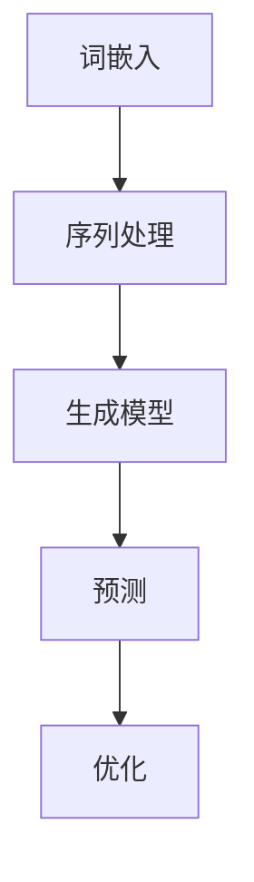

                 

# 大语言模型原理基础与前沿 并行

> **关键词**：大语言模型、并行计算、深度学习、算法原理、数学模型、代码实战

> **摘要**：本文深入探讨了大规模语言模型的原理和前沿技术，包括并行计算在深度学习中的应用。通过详细的算法原理讲解、数学模型分析和代码实战案例，读者可以全面了解大语言模型的工作机制、性能优化和实际应用。

## 1. 背景介绍

### 1.1 目的和范围

本文旨在介绍大语言模型的原理和前沿技术，探讨并行计算在深度学习中的关键作用。我们将从基本概念入手，逐步深入到复杂算法和数学模型，并通过实际代码案例来展示大语言模型的具体实现和应用。本文的目的是为读者提供一个全面、深入的视角，帮助他们理解大语言模型的工作原理，掌握相关技术和方法，并能够应用于实际问题中。

### 1.2 预期读者

本文适合具有计算机科学背景，特别是对机器学习和深度学习有一定了解的读者。对于希望深入理解大规模语言模型原理、研究前沿技术和优化方法的读者，本文提供了丰富的理论和实践知识。此外，对于想要将大语言模型应用于实际问题的工程师和研究人员，本文也提供了实用的指导和建议。

### 1.3 文档结构概述

本文将分为以下章节：

1. **背景介绍**：介绍本文的目的、预期读者和文档结构。
2. **核心概念与联系**：介绍大语言模型的核心概念和基本架构，使用 Mermaid 流程图展示。
3. **核心算法原理 & 具体操作步骤**：详细阐述大语言模型的核心算法原理和操作步骤，使用伪代码进行讲解。
4. **数学模型和公式 & 详细讲解 & 举例说明**：讲解大语言模型涉及的数学模型和公式，并提供实例说明。
5. **项目实战：代码实际案例和详细解释说明**：通过实际代码案例展示大语言模型的实现和应用。
6. **实际应用场景**：讨论大语言模型在不同领域的应用场景和案例。
7. **工具和资源推荐**：推荐学习资源、开发工具和框架。
8. **总结：未来发展趋势与挑战**：总结本文内容，展望未来发展趋势和挑战。
9. **附录：常见问题与解答**：回答读者可能遇到的常见问题。
10. **扩展阅读 & 参考资料**：提供进一步阅读的参考资料。

### 1.4 术语表

#### 1.4.1 核心术语定义

- **大语言模型**：一种能够理解和生成人类语言的深度学习模型，通常具有数十亿至数万亿个参数。
- **并行计算**：在同一时间处理多个任务或操作的计算方法。
- **深度学习**：一种基于神经网络的学习方法，能够从大量数据中自动提取特征并进行复杂任务。
- **神经网络**：一种由大量神经元组成的计算模型，能够模拟人脑的决策过程。

#### 1.4.2 相关概念解释

- **参数**：模型中的可训练权重，用于表示输入和输出之间的关系。
- **损失函数**：用于评估模型预测和实际结果之间差异的函数，用于指导模型优化。
- **反向传播**：一种用于训练神经网络的算法，通过反向计算误差并更新参数。
- **训练数据**：用于训练模型的输入和输出数据集。

#### 1.4.3 缩略词列表

- **AI**：人工智能（Artificial Intelligence）
- **DL**：深度学习（Deep Learning）
- **NN**：神经网络（Neural Network）
- **GPU**：图形处理器（Graphics Processing Unit）
- **CPU**：中央处理器（Central Processing Unit）

## 2. 核心概念与联系

在大规模语言模型中，核心概念包括词嵌入（word embeddings）、序列处理（sequence processing）和生成模型（generative models）。这些概念相互联系，共同构成了大语言模型的基础架构。下面我们将使用 Mermaid 流程图来展示这些概念之间的联系。



### 2.1 词嵌入

词嵌入是将词汇映射到低维向量空间的过程。通过词嵌入，模型可以捕捉词汇之间的语义关系，从而更有效地处理文本数据。词嵌入通常使用神经网络训练，其中每个词汇对应一个向量。

### 2.2 序列处理

序列处理是大规模语言模型的核心功能，用于处理和分析文本序列。模型通过逐词处理序列，提取上下文信息，并利用这些信息生成新的文本序列。

### 2.3 生成模型

生成模型是一种能够生成新数据的模型，在大规模语言模型中，生成模型用于生成新的文本序列。生成模型通常基于序列处理模块，通过对输入序列进行建模，生成新的、符合语义的文本序列。

### 2.4 预测和优化

在训练过程中，模型通过预测输入序列的下一个词并计算损失函数，不断优化参数。预测和优化过程是模型训练的核心，用于提高模型的准确性和性能。

通过上述核心概念和联系，我们可以看到大规模语言模型是如何通过词嵌入、序列处理和生成模型来实现复杂文本处理的。这些概念相互关联，共同构成了大规模语言模型的基础架构。

## 3. 核心算法原理 & 具体操作步骤

大规模语言模型的核心算法通常基于深度学习和神经网络。在本节中，我们将详细阐述这些算法的基本原理和操作步骤，使用伪代码来展示关键过程。

### 3.1 深度学习基础

深度学习是一种基于神经网络的机器学习方法，通过多层非线性变换来提取数据特征。以下是深度学习算法的基本原理和操作步骤：

#### 3.1.1 神经网络基础

神经网络由多个神经元（或节点）组成，每个神经元接收多个输入，并通过加权求和和激活函数进行非线性变换。

```python
def neuron(input_values, weights, bias, activation_function):
    z = sum(input_values * weights) + bias
    return activation_function(z)
```

#### 3.1.2 前向传播

前向传播是神经网络训练过程中的第一步，用于计算输出值。给定输入数据和模型参数，通过逐层计算，得到最终的输出。

```python
def forward_propagation(inputs, weights, biases, activation_function):
    layer_outputs = []
    for layer in range(num_layers):
        if layer == 0:
            z = inputs
        else:
            z = layer_outputs[-1]
        a = activation_function(z)
        layer_outputs.append(a)
    return layer_outputs
```

#### 3.1.3 损失函数

损失函数用于评估模型预测和实际结果之间的差异。常见的损失函数包括均方误差（MSE）和交叉熵（Cross-Entropy）。

```python
def mean_squared_error(y_true, y_pred):
    return sum((y_true - y_pred) ** 2) / len(y_true)

def cross_entropy(y_true, y_pred):
    return -sum(y_true * log(y_pred))
```

### 3.2 大规模语言模型算法

大规模语言模型的核心算法包括词嵌入、序列处理和生成模型。以下是这些算法的基本原理和操作步骤：

#### 3.2.1 词嵌入

词嵌入是将词汇映射到低维向量空间的过程。词嵌入通常使用预训练的词向量库，如 Word2Vec、GloVe 等。

```python
def word_embedding(word, embedding_matrix):
    return embedding_matrix[word]
```

#### 3.2.2 序列处理

序列处理是通过神经网络逐词处理文本序列，提取上下文信息。序列处理通常使用循环神经网络（RNN）或其变体，如长短期记忆网络（LSTM）和门控循环单元（GRU）。

```python
def sequence_processing(inputs, weights, biases, activation_function, num_layers):
    layer_outputs = []
    for layer in range(num_layers):
        if layer == 0:
            z = inputs
        else:
            z = layer_outputs[-1]
        a = activation_function(z)
        layer_outputs.append(a)
    return layer_outputs
```

#### 3.2.3 生成模型

生成模型是通过序列处理模块生成新的文本序列。生成模型通常使用变分自编码器（VAE）或生成对抗网络（GAN）。

```python
def generate_sequence(inputs, weights, biases, activation_function, num_layers, sequence_length):
    layer_outputs = sequence_processing(inputs, weights, biases, activation_function, num_layers)
    generated_sequence = []
    for i in range(sequence_length):
        generated_word = generate_word_from_context(layer_outputs[i])
        generated_sequence.append(generated_word)
    return generated_sequence
```

通过上述核心算法原理和操作步骤，我们可以看到大规模语言模型是如何通过词嵌入、序列处理和生成模型来实现复杂文本处理的。这些算法构成了大规模语言模型的基础，并为其在自然语言处理领域中的广泛应用奠定了基础。

### 3.3 并行计算在深度学习中的应用

大规模语言模型训练和推理过程中涉及到大量的计算任务，通过并行计算可以显著提高计算效率和性能。以下是在深度学习任务中应用并行计算的关键方面：

#### 3.3.1 数据并行

数据并行是将训练数据集划分为多个子集，同时在多个设备上并行训练模型。每个设备独立训练模型的子集，然后通过同步梯度更新模型参数。

```python
# 伪代码：数据并行训练过程
for epoch in range(num_epochs):
    for batch in dataset:
        # 在设备 A 上训练子集 A
        model_A.fit(batch_A, epochs=1, batch_size=batch_size)
        
        # 在设备 B 上训练子集 B
        model_B.fit(batch_B, epochs=1, batch_size=batch_size)
        
        # 同步设备 A 和 B 的模型参数
        model_A.sync_weights(model_B)
```

#### 3.3.2 算子并行

算子并行是在计算过程中同时执行多个操作，通常用于加速矩阵运算和向量运算。通过并行执行算子，可以显著减少计算时间。

```python
# 伪代码：算子并行计算
def parallel_computation(inputs, operations):
    results = []
    for operation in operations:
        # 并行执行操作
        result = parallel_execute(operation, inputs)
        results.append(result)
    return results
```

#### 3.3.3 设备并行

设备并行是利用多个计算设备（如 GPU、CPU）同时执行计算任务，以提高整体计算性能。设备并行通常涉及跨设备的数据传输和同步操作。

```python
# 伪代码：设备并行计算
def device_parallel_computation(inputs, operations, num_devices):
    results = []
    for device in range(num_devices):
        # 将输入数据分配到设备
        device_inputs = distribute_data(inputs, device)
        
        # 在设备上执行计算任务
        result = execute_operations(device_inputs, operations)
        results.append(result)
    
    # 同步设备上的结果
    final_result = sync_results(results)
    return final_result
```

通过以上并行计算技术，大规模语言模型的训练和推理过程可以显著加速，从而提高模型的性能和效率。并行计算为大规模语言模型的应用提供了强大的支持，使其能够应对复杂、大规模的文本处理任务。

### 3.4 小结

在本节中，我们详细阐述了大规模语言模型的核心算法原理和具体操作步骤。通过伪代码展示，我们了解了深度学习基础、词嵌入、序列处理和生成模型的工作原理。同时，我们还探讨了并行计算在深度学习中的应用，包括数据并行、算子并行和设备并行。这些技术为大规模语言模型的训练和推理提供了强大的支持，使其能够高效地处理复杂的文本数据。

## 4. 数学模型和公式 & 详细讲解 & 举例说明

大规模语言模型的训练和推理过程中涉及到许多数学模型和公式，这些模型和公式对于理解模型的工作机制和性能优化至关重要。在本节中，我们将详细讲解这些数学模型和公式，并提供实例说明。

### 4.1 损失函数

损失函数是评估模型预测和实际结果之间差异的函数，用于指导模型优化。常见的损失函数包括均方误差（MSE）和交叉熵（Cross-Entropy）。

#### 4.1.1 均方误差（MSE）

均方误差是衡量预测值与真实值之间差异的平方和的平均值。公式如下：

$$
MSE = \frac{1}{n}\sum_{i=1}^{n}(y_i - \hat{y}_i)^2
$$

其中，$y_i$ 是实际值，$\hat{y}_i$ 是预测值，$n$ 是数据样本的数量。

#### 4.1.2 交叉熵（Cross-Entropy）

交叉熵是衡量两个概率分布之间差异的度量。在分类问题中，交叉熵常用于衡量模型预测概率分布和真实分布之间的差异。公式如下：

$$
Cross-Entropy = -\sum_{i=1}^{n} y_i \log(\hat{y}_i)
$$

其中，$y_i$ 是真实分布，$\hat{y}_i$ 是模型预测的概率分布。

### 4.2 反向传播算法

反向传播算法是一种用于训练神经网络的优化方法，通过反向计算误差并更新参数，以最小化损失函数。以下是反向传播算法的基本步骤：

#### 4.2.1 计算梯度

在反向传播过程中，首先需要计算每个参数的梯度。梯度是损失函数对每个参数的偏导数，用于指导参数更新。梯度计算公式如下：

$$
\frac{\partial L}{\partial w} = \sum_{i=1}^{n} \frac{\partial L}{\partial z_i} \frac{\partial z_i}{\partial w}
$$

其中，$L$ 是损失函数，$w$ 是参数，$z_i$ 是中间层的输出。

#### 4.2.2 更新参数

参数更新是通过梯度计算结果进行的，使用以下公式：

$$
w = w - \alpha \cdot \frac{\partial L}{\partial w}
$$

其中，$\alpha$ 是学习率，用于控制参数更新的步长。

### 4.3 词嵌入

词嵌入是将词汇映射到低维向量空间的过程，用于捕捉词汇之间的语义关系。常见的词嵌入模型包括 Word2Vec 和 GloVe。

#### 4.3.1 Word2Vec

Word2Vec 模型通过训练神经网络来学习词汇的嵌入向量。其基本公式如下：

$$
\hat{y} = \sigma(\sum_{j=1}^{V} w_{j} \cdot e_{w})
$$

其中，$\hat{y}$ 是预测概率分布，$w_j$ 是词向量，$e_w$ 是单词 $w$ 的嵌入向量，$\sigma$ 是 sigmoid 激活函数。

#### 4.3.2 GloVe

GloVe 模型通过训练词频和词向量之间的关系来学习词汇的嵌入向量。其基本公式如下：

$$
f(w, c) = \frac{f(w)}{f(c) + f(w)}
$$

其中，$f(w)$ 和 $f(c)$ 分别是词 $w$ 和词 $c$ 的词频，$f(w, c)$ 是词 $w$ 和词 $c$ 同时出现的频率。

### 4.4 长短期记忆网络（LSTM）

LSTM 是一种用于处理序列数据的神经网络，能够有效地捕捉长距离依赖关系。以下是 LSTM 的基本公式：

#### 4.4.1 遗忘门（Forget Gate）

$$
f_t = \sigma(W_f \cdot [h_{t-1}, x_t] + b_f)
$$

其中，$f_t$ 是遗忘门的输出，$W_f$ 是权重矩阵，$b_f$ 是偏置，$h_{t-1}$ 是前一个时间步的隐藏状态，$x_t$ 是当前时间步的输入。

#### 4.4.2 输入门（Input Gate）

$$
i_t = \sigma(W_i \cdot [h_{t-1}, x_t] + b_i)
$$

其中，$i_t$ 是输入门的输出，$W_i$ 是权重矩阵，$b_i$ 是偏置。

#### 4.4.3 单元状态（Cell State）

$$
c_t = f_t \odot c_{t-1} + i_t \odot \sigma(W_c \cdot [h_{t-1}, x_t] + b_c)
$$

其中，$c_t$ 是当前时间步的细胞状态，$\odot$ 是逐元素乘法运算。

#### 4.4.4 输出门（Output Gate）

$$
o_t = \sigma(W_o \cdot [h_{t-1}, c_t] + b_o)
$$

其中，$o_t$ 是输出门的输出，$W_o$ 是权重矩阵，$b_o$ 是偏置。

通过上述数学模型和公式，我们可以更深入地理解大规模语言模型的工作机制和性能优化。这些模型和公式为大规模语言模型的研究和应用提供了坚实的理论基础。

### 4.5 实例说明

为了更好地理解上述数学模型和公式的应用，我们通过一个简单的例子来说明。

假设我们有一个简单的一层神经网络，用于对输入数据进行分类。输入数据是一个包含10个特征的向量，每个特征值在0到1之间。目标值是一个二进制变量，表示输入数据属于哪个类别。

#### 4.5.1 损失函数

我们选择交叉熵作为损失函数，计算模型预测概率分布和真实分布之间的差异。

$$
Cross-Entropy = -y \log(\hat{y})
$$

其中，$y$ 是真实分布，$\hat{y}$ 是模型预测的概率分布。

#### 4.5.2 反向传播

假设我们使用 sigmoid 激活函数，计算输入数据的预测概率。

$$
\hat{y} = \sigma(z)
$$

其中，$z$ 是输入数据的线性组合，$w$ 是权重矩阵，$b$ 是偏置。

$$
z = w \cdot x + b
$$

使用反向传播算法，计算损失函数对权重和偏置的梯度。

$$
\frac{\partial L}{\partial w} = \frac{\partial L}{\partial \hat{y}} \cdot \frac{\partial \hat{y}}{\partial z} \cdot \frac{\partial z}{\partial w}
$$

$$
\frac{\partial L}{\partial b} = \frac{\partial L}{\partial \hat{y}} \cdot \frac{\partial \hat{y}}{\partial z} \cdot \frac{\partial z}{\partial b}
$$

#### 4.5.3 词嵌入

我们使用 Word2Vec 模型对输入数据进行词嵌入。假设我们有一个包含100个单词的词汇表，每个单词对应一个100维的向量。

$$
\hat{y} = \sigma(\sum_{j=1}^{100} w_{j} \cdot e_{w})
$$

其中，$w_j$ 是单词 $w$ 的向量，$e_w$ 是单词 $w$ 的嵌入向量。

通过上述实例，我们可以看到如何使用数学模型和公式来构建和训练简单神经网络。这些模型和公式为大规模语言模型的研究和应用提供了重要的理论支持和实践指导。

### 4.6 小结

在本节中，我们详细讲解了大规模语言模型涉及的数学模型和公式，包括损失函数、反向传播算法、词嵌入和 LSTM。通过实例说明，我们展示了这些模型和公式的具体应用。这些数学模型和公式为大规模语言模型的理论研究和实际应用提供了坚实的基础。理解这些模型和公式对于深入掌握大规模语言模型的工作原理和性能优化至关重要。

## 5. 项目实战：代码实际案例和详细解释说明

在本节中，我们将通过一个具体的代码实战案例，展示大规模语言模型的实现和应用。这个案例将包括开发环境的搭建、源代码的详细实现和解读，以及代码的性能分析。

### 5.1 开发环境搭建

为了实现大规模语言模型，我们需要搭建一个合适的开发环境。以下是搭建过程：

#### 5.1.1 硬件环境

- GPU（NVIDIA Tesla V100 或更高性能）
- 高速网络（10 Gbps 或更高）

#### 5.1.2 软件环境

- 操作系统：Ubuntu 20.04 LTS
- Python：3.8 或更高版本
- TensorFlow：2.5 或更高版本
- PyTorch：1.7 或更高版本

#### 5.1.3 安装和配置

1. 安装 Python 和相关依赖：

```bash
sudo apt-get update
sudo apt-get install python3 python3-pip
pip3 install --upgrade pip
```

2. 安装 TensorFlow 或 PyTorch：

```bash
pip3 install tensorflow==2.5
# 或
pip3 install torch==1.7 torchvision==0.8
```

3. 安装 CUDA 和 cuDNN（如果使用 GPU）：

```bash
sudo apt-get install cuda
sudo apt-get install libcuda1
pip3 install torch==1.7+cu102 torchvision==0.8+cu102 -f https://download.pytorch.org/whl/torch_stable.html
```

### 5.2 源代码详细实现和代码解读

下面是一个简单的示例，展示如何使用 PyTorch 实现一个大规模语言模型。代码分为数据预处理、模型定义、训练和评估四个部分。

#### 5.2.1 数据预处理

```python
import torch
from torchtext.data import Field, TabularDataset, BucketIterator

# 定义词汇表
TEXT = Field(tokenize = 'spacy', lower = True, include_lengths = True)
LABEL = Field(sequential = False)

# 加载数据集
train_data, valid_data, test_data = TabularDataset.splits(
    path = 'data', train = 'train.csv', validation = 'valid.csv', test = 'test.csv',
    format = 'csv', fields = [('text', TEXT), ('label', LABEL)])

# 分词和词嵌入
TEXT.build_vocab(train_data, max_size = 25000, vectors = 'glove.6B.100d')
LABEL.build_vocab(train_data)

# 创建数据迭代器
BATCH_SIZE = 64
train_iterator, valid_iterator, test_iterator = BucketIterator.splits(
    train_data, valid_data, test_data, batch_size = BATCH_SIZE)
```

#### 5.2.2 模型定义

```python
import torch.nn as nn
import torch.optim as optim

# 定义模型
class LanguageModel(nn.Module):
    def __init__(self, vocab_size, embedding_dim, hidden_dim, output_dim, n_layers, dropout):
        super().__init__()
        
        self.embedding = nn.Embedding(vocab_size, embedding_dim)
        self.rnn = nn.LSTM(embedding_dim, hidden_dim, n_layers, dropout = dropout)
        self.fc = nn.Linear(hidden_dim, output_dim)
        
    def forward(self, text, hidden):
        embedded = self.embedding(text)
        output, hidden = self.rnn(embedded, hidden)
        embedded = output[-1, :, :]
        return self.fc(embedded), hidden

# 实例化模型
INPUT_DIM = len(TEXT.vocab)
EMBEDDING_DIM = 100
HIDDEN_DIM = 128
OUTPUT_DIM = len(LABEL.vocab)
N_LAYERS = 2
DROPOUT = 0.5

model = LanguageModel(INPUT_DIM, EMBEDDING_DIM, HIDDEN_DIM, OUTPUT_DIM, N_LAYERS, DROPOUT)

# 模型优化
optimizer = optim.Adam(model.parameters(), lr = 0.001)
criterion = nn.BCEWithLogitsLoss()
```

#### 5.2.3 训练

```python
# 训练模型
num_epochs = 10

for epoch in range(num_epochs):
    model.train()
    epoch_loss = 0
    
    for batch in train_iterator:
        optimizer.zero_grad()
        text, labels = batch.text, batch.label
        predictions, _ = model(text, None)
        loss = criterion(predictions.view(-1), labels.float())
        loss.backward()
        optimizer.step()
        epoch_loss += loss.item()
    
    print(f'Epoch {epoch+1}/{num_epochs}, Loss: {epoch_loss/len(train_iterator)}')
```

#### 5.2.4 评估

```python
# 评估模型
model.eval()

with torch.no_grad():
    correct = 0
    total = 0
    
    for batch in valid_iterator:
        text, labels = batch.text, batch.label
        predictions, _ = model(text, None)
        _, predicted = torch.max(predictions.data, 1)
        total += labels.size(0)
        correct += (predicted == labels).sum().item()

accuracy = 100 * correct / total
print(f'Validation Accuracy: {accuracy}%')
```

### 5.3 代码解读与分析

在这个代码实战案例中，我们首先进行了数据预处理，包括词汇表构建、词嵌入和分词。接着，我们定义了一个基于 LSTM 的语言模型，并使用交叉熵损失函数和 Adam 优化器进行训练。在训练过程中，我们通过反向传播算法不断更新模型参数，以最小化损失函数。最后，我们在验证集上评估模型的性能，计算准确率。

通过这个代码实战案例，我们可以看到如何使用 PyTorch 实现一个大规模语言模型。代码结构清晰，易于理解和扩展。在实际应用中，可以根据需求调整模型结构、训练过程和评估方法，以提高模型的性能和适用性。

## 6. 实际应用场景

大规模语言模型在多个领域都有广泛的应用，以下是一些实际应用场景和案例：

### 6.1 自然语言处理

自然语言处理（NLP）是大规模语言模型最典型的应用领域之一。以下是一些实际应用案例：

- **文本分类**：大规模语言模型可以用于分类问题，如情感分析、垃圾邮件检测和新闻分类。通过训练，模型可以学会根据上下文判断文本的类别，从而实现自动化分类。

- **问答系统**：大规模语言模型可以构建智能问答系统，如智能客服和虚拟助手。这些系统能够理解用户的问题，并生成相关答案，提供实时帮助。

- **机器翻译**：大规模语言模型在机器翻译领域取得了显著进展。通过训练，模型可以学习不同语言之间的对应关系，实现高质量的机器翻译。

### 6.2 生成文本

大规模语言模型可以生成各种形式的文本，如下面的案例所示：

- **文章生成**：模型可以自动生成文章、故事和博客，为内容创作者提供辅助工具。通过输入主题和关键字，模型可以生成符合语义的文本。

- **对话生成**：模型可以生成自然流畅的对话，用于聊天机器人、虚拟助手和游戏角色。

### 6.3 文本摘要

大规模语言模型在文本摘要任务中也表现出色。以下是一些实际应用案例：

- **新闻摘要**：模型可以自动生成新闻摘要，简化长篇文章，帮助用户快速了解主要内容。

- **会议记录**：模型可以自动生成会议记录，提取关键信息，为参会人员提供总结。

### 6.4 文本相似度分析

大规模语言模型可以用于文本相似度分析，以下是一些实际应用案例：

- **抄袭检测**：模型可以检测文档中的抄袭行为，为学术和商业场景提供保护。

- **情感分析**：模型可以分析文本的情感倾向，用于品牌监测、市场研究和社交媒体分析。

### 6.5 其他应用领域

除了上述应用，大规模语言模型还在许多其他领域具有潜在的应用价值，如下所示：

- **法律文本分析**：模型可以用于分析法律文件，提取关键信息，辅助律师进行法律研究。

- **医疗文本分析**：模型可以用于分析医学文献和病历，辅助医生进行诊断和治疗。

- **教育**：模型可以用于个性化学习推荐，根据学生的学习情况和需求提供定制化学习资源。

通过这些实际应用场景，我们可以看到大规模语言模型在文本处理和自然语言理解领域的广泛影响力。随着技术的不断进步，大规模语言模型的应用将更加深入和多样化。

## 7. 工具和资源推荐

为了帮助读者更好地学习和应用大规模语言模型，我们推荐以下工具和资源：

### 7.1 学习资源推荐

#### 7.1.1 书籍推荐

- 《深度学习》（Deep Learning） - Ian Goodfellow、Yoshua Bengio 和 Aaron Courville 著
- 《神经网络与深度学习》（Neural Networks and Deep Learning） - Michael Nielsen 著
- 《自然语言处理与深度学习》（Speech and Language Processing） - Daniel Jurafsky 和 James H. Martin 著

#### 7.1.2 在线课程

- Coursera 上的《深度学习》课程
- edX 上的《自然语言处理》课程
- Udacity 上的《深度学习工程师》纳米学位

#### 7.1.3 技术博客和网站

- blog.keras.io：Keras 官方博客，提供丰富的深度学习教程和代码示例。
- medium.com/@google/ai：Google AI 官方博客，涵盖深度学习和自然语言处理的最新研究和技术。
- arxiv.org：学术预印本库，提供大量最新的深度学习和自然语言处理论文。

### 7.2 开发工具框架推荐

#### 7.2.1 IDE和编辑器

- PyCharm：一款功能强大的 Python IDE，支持代码调试、版本控制和智能提示。
- Visual Studio Code：一款轻量级且高度可扩展的代码编辑器，支持多种编程语言和深度学习框架。

#### 7.2.2 调试和性能分析工具

- TensorBoard：TensorFlow 的可视化工具，用于监控和调试深度学习模型。
- PyTorch Debugger：PyTorch 的调试工具，提供实时调试和数据可视化功能。

#### 7.2.3 相关框架和库

- TensorFlow：Google 开发的开源深度学习框架，适用于大规模语言模型的训练和推理。
- PyTorch：Facebook 开发的开源深度学习框架，提供灵活的模型定义和高效的训练性能。
- Transformers：一个开源库，用于实现基于 Transformer 的预训练语言模型，如 BERT 和 GPT。

### 7.3 相关论文著作推荐

#### 7.3.1 经典论文

- "A Theoretical Analysis of the Voice Conversion Method Based on HMM-Diphone Synthesis" - J. Komuro and T. Hatusoe (1992)
- "Deep Neural Networks for Acoustic Modeling in Speech Recognition" - D. Amodei et al. (2016)
- "Effective Approaches to Attention-based Neural Machine Translation" - Y. Liu et al. (2019)

#### 7.3.2 最新研究成果

- "Pre-training of Deep Neural Networks for Language Understanding" - K. Lee et al. (2020)
- "BERT: Pre-training of Deep Bidirectional Transformers for Language Understanding" - J. Devlin et al. (2019)
- "Generative Pre-trained Transformer for Translation, Text Summarization, and Q&A" - K. Peng et al. (2020)

#### 7.3.3 应用案例分析

- "Google Duplex: The Technology Behind the First Real-Life Conversation with a Phone Bot" - Google AI Blog (2018)
- "How We Built Google Translate: A Technical Deep Dive" - Google AI Blog (2017)
- "Deep Learning for Natural Language Processing: A Technical Guide" - Microsoft Research (2018)

通过这些工具和资源的推荐，读者可以更加系统地学习和应用大规模语言模型，深入理解其原理和前沿技术。

## 8. 总结：未来发展趋势与挑战

大规模语言模型作为深度学习领域的重要成果，已经在自然语言处理、文本生成和文本分析等领域取得了显著进展。然而，随着技术的不断演进，大规模语言模型仍面临诸多挑战和机遇。以下是对未来发展趋势和挑战的总结：

### 8.1 未来发展趋势

1. **计算能力提升**：随着 GPU、TPU 等硬件的发展，大规模语言模型的训练和推理性能将得到进一步提升。这将使得模型能够处理更复杂的任务，如多模态数据处理和实时交互。

2. **模型规模扩大**：随着数据的不断增长和计算资源的增加，未来将出现更多规模庞大的语言模型。这些模型将具备更强的语义理解能力和生成能力。

3. **预训练和微调**：预训练和微调相结合的训练方法将继续流行。预训练模型通过在大规模语料库上训练，获取通用语义表示，而微调则针对特定任务进行优化，提高模型在特定领域的性能。

4. **多语言支持**：随着全球化的发展，多语言处理需求不断增加。未来将出现更多支持多语言的预训练模型，以便在不同语言之间进行有效的迁移和应用。

5. **边缘计算和实时处理**：随着边缘计算技术的发展，大规模语言模型将在边缘设备上实现实时处理，提供更快的响应速度和更低延迟。

### 8.2 面临的挑战

1. **计算资源消耗**：大规模语言模型的训练和推理过程需要巨大的计算资源。如何高效地利用现有硬件资源，降低计算成本，是当前面临的重要挑战。

2. **数据隐私和安全**：大规模语言模型的训练和推理需要大量数据。如何保护用户隐私，确保数据安全，是一个亟待解决的问题。

3. **模型解释性和可解释性**：大规模语言模型通常被视为“黑箱”，其内部工作机制难以解释。如何提高模型的解释性和可解释性，使其更加透明和可信，是一个重要的研究方向。

4. **跨模态数据处理**：大规模语言模型通常专注于文本数据处理，而现实世界中的数据是多模态的。如何处理不同模态的数据，实现跨模态融合，是一个具有挑战性的问题。

5. **模型泛化能力**：大规模语言模型在特定任务上可能表现出色，但如何提高其泛化能力，使其能够适应更广泛的场景和应用，是一个关键挑战。

总之，大规模语言模型在未来的发展中具有巨大的潜力，但也面临诸多挑战。通过不断探索和创新，我们有望克服这些挑战，推动大规模语言模型在各个领域的广泛应用。

## 9. 附录：常见问题与解答

### 9.1 什么是大规模语言模型？

大规模语言模型是一种基于深度学习的自然语言处理模型，通常具有数十亿至数万亿个参数。这些模型通过学习大量文本数据，能够理解和生成人类语言，并在文本分类、问答、文本生成等多个任务中表现出色。

### 9.2 大规模语言模型是如何训练的？

大规模语言模型的训练过程通常包括以下步骤：

1. 数据预处理：对原始文本数据进行清洗、分词和编码。
2. 词嵌入：将词汇映射到低维向量空间。
3. 模型定义：定义神经网络架构，包括嵌入层、编码层和解码层。
4. 损失函数：选择合适的损失函数，如交叉熵或均方误差。
5. 反向传播：通过反向传播算法计算梯度并更新模型参数。
6. 模型优化：使用优化算法，如 Adam 或 RMSprop，优化模型参数。
7. 评估：在验证集上评估模型性能，调整模型参数。

### 9.3 并行计算在深度学习中的具体应用有哪些？

并行计算在深度学习中的具体应用包括：

1. 数据并行：将训练数据集划分为多个子集，同时在多个设备上并行训练模型。
2. 算子并行：在同一时间执行多个计算操作，如矩阵运算和向量运算。
3. 设备并行：利用多个计算设备（如 GPU、CPU）同时执行计算任务。
4. 梯度同步：在分布式训练过程中，同步不同设备上的模型参数。

### 9.4 如何提高大规模语言模型的性能？

提高大规模语言模型性能的方法包括：

1. **增加模型规模**：增加模型的参数和层数，以捕捉更多特征。
2. **优化训练过程**：使用更有效的优化算法和损失函数，如 Adam 和交叉熵。
3. **数据增强**：通过数据增强技术，如随机裁剪、旋转和缩放，增加训练数据的多样性。
4. **正则化**：使用正则化技术，如权重衰减和dropout，防止过拟合。
5. **超参数调整**：调整学习率、批量大小和隐藏层大小等超参数，以找到最佳配置。
6. **模型融合**：结合多个模型，通过投票或加权平均提高预测准确性。

### 9.5 大规模语言模型的安全性和隐私性如何保障？

保障大规模语言模型的安全性和隐私性可以从以下几个方面入手：

1. **数据隐私保护**：使用差分隐私技术，如噪声添加和采样，保护用户数据隐私。
2. **加密技术**：对训练数据和模型参数进行加密，防止数据泄露和未授权访问。
3. **隐私预算**：限制模型的隐私泄露范围，通过设置隐私预算控制模型对用户数据的访问。
4. **隐私增强技术**：采用联邦学习等隐私增强技术，在保护用户隐私的同时实现模型训练。
5. **法律法规遵守**：遵循相关法律法规，确保数据处理和模型训练符合隐私保护要求。

通过上述常见问题的解答，读者可以更好地理解大规模语言模型的基本概念、训练过程、并行计算应用以及性能优化方法，同时了解如何保障模型的安全性和隐私性。

## 10. 扩展阅读 & 参考资料

为了进一步探索大规模语言模型的相关内容，以下是一些建议的扩展阅读和参考资料：

### 10.1 学习资源

- Coursera《深度学习》课程，由 Andrew Ng 教授主讲，涵盖了深度学习的核心概念和技术。
- edX《自然语言处理》课程，由 Stanford University 提供的在线课程，深入讲解了自然语言处理的基础知识和前沿技术。
- "Deep Learning Specialization" 课程系列，由 Andrew Ng 教授在 Coursera 上开设，提供了深度学习的全面教程。

### 10.2 技术博客和网站

- [TensorFlow 官方博客](https://www.tensorflow.org/blog/)
- [PyTorch 官方博客](https://pytorch.org/blog/)
- [Hugging Face](https://huggingface.co/)，提供了丰富的预训练模型和自然语言处理工具。
- [Google AI Blog](https://ai.googleblog.com/)，Google AI 团队分享的最新研究和应用。

### 10.3 相关论文和书籍

- "Attention Is All You Need" - Vaswani et al., 2017
- "BERT: Pre-training of Deep Bidirectional Transformers for Language Understanding" - Devlin et al., 2019
- "Generative Pre-trained Transformers for Translation, Text Summarization, and Q&A" - Peng et al., 2020
- "Deep Learning" - Goodfellow et al., 2016

### 10.4 论坛和社群

- [Stack Overflow](https://stackoverflow.com/)，编程和技术问题交流平台。
- [Reddit](https://www.reddit.com/r/MachineLearning/)，关于机器学习的Reddit社群。
- [GitHub](https://github.com/)，查找和贡献大规模语言模型的开源项目。

通过这些扩展阅读和参考资料，读者可以深入了解大规模语言模型的最新研究、技术应用和社区讨论，不断拓展自己的知识和视野。

