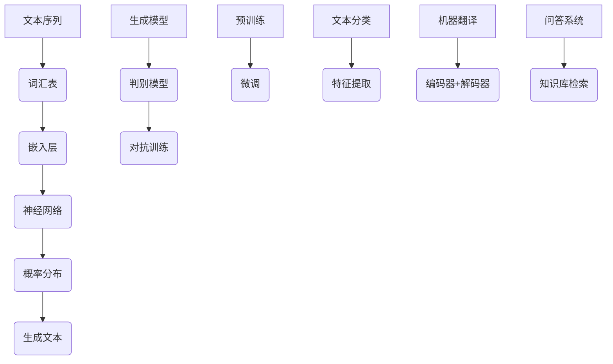

                 

# 大语言模型原理基础与前沿 按空格分割

> **关键词：** 语言模型，深度学习，神经网络，序列生成，自然语言处理，预训练，微调。

> **摘要：** 本文将深入探讨大语言模型的原理及其在自然语言处理中的应用，从背景介绍到核心算法原理，再到数学模型，项目实战，实际应用场景等，全面解析语言模型的构建与运用，为读者提供从基础到前沿的全方位了解。

## 1. 背景介绍

### 1.1 目的和范围

本文旨在通过逐步分析推理，详细阐述大语言模型的原理、数学模型及其在实际应用中的表现，旨在为读者提供一个全面而深入的理解。我们将探讨以下内容：

- 语言模型的基本概念和其在自然语言处理中的应用。
- 大语言模型的核心算法原理和具体操作步骤。
- 数学模型和公式的详细讲解及其在模型训练中的应用。
- 代码实际案例和详细解释说明，以及如何进行模型微调和优化。
- 大语言模型在各类实际应用场景中的表现和挑战。

### 1.2 预期读者

本文适合以下读者群体：

- 对自然语言处理和深度学习有一定了解的技术开发者。
- 想深入了解大语言模型原理和应用的学术研究者。
- 拟从事自然语言处理领域研究的初学者。

### 1.3 文档结构概述

本文结构如下：

- **第1章**：背景介绍，包括目的和范围、预期读者、文档结构概述和术语表。
- **第2章**：核心概念与联系，介绍大语言模型的基本概念及其联系。
- **第3章**：核心算法原理，详细讲解大语言模型的基本算法原理和具体操作步骤。
- **第4章**：数学模型和公式，深入探讨大语言模型中的数学模型和公式。
- **第5章**：项目实战，通过实际代码案例展示大语言模型的构建和应用。
- **第6章**：实际应用场景，分析大语言模型在各类场景中的表现和挑战。
- **第7章**：工具和资源推荐，介绍学习资源、开发工具和框架。
- **第8章**：总结：未来发展趋势与挑战。
- **第9章**：附录：常见问题与解答。
- **第10章**：扩展阅读与参考资料。

### 1.4 术语表

#### 1.4.1 核心术语定义

- **语言模型**：用于预测文本序列的模型，通过统计方法或机器学习方法建模文本的概率分布。
- **深度学习**：一种基于神经网络的学习方法，通过多层神经网络对数据进行建模和学习。
- **神经网络**：一种模拟人脑神经网络结构和功能的人工智能算法，通过权重和偏置对输入数据进行处理和输出预测。
- **序列生成**：模型生成文本序列的过程，通过对输入序列的概率分布进行采样得到输出序列。
- **自然语言处理**：计算机科学领域的一个分支，旨在让计算机理解和处理人类自然语言。
- **预训练**：在特定任务之前，对模型进行大规模无监督预训练的过程，以提高模型在特定任务上的性能。
- **微调**：在预训练模型的基础上，针对特定任务进行少量有监督训练的过程，以进一步优化模型性能。

#### 1.4.2 相关概念解释

- **嵌入层（Embedding Layer）**：将输入文本转换为固定长度的向量表示，用于神经网络处理。
- **循环神经网络（RNN）**：一种处理序列数据的神经网络，能够捕捉序列中的时间依赖关系。
- **长短时记忆（LSTM）**：RNN的一种变体，通过引入门控机制解决长序列依赖问题。
- **注意力机制（Attention Mechanism）**：在模型中引入的机制，能够动态地关注序列中的关键信息，提高模型的表示能力。
- **生成对抗网络（GAN）**：一种由生成器和判别器组成的对抗性训练框架，用于生成高质量的数据。

#### 1.4.3 缩略词列表

- **NLP**：自然语言处理（Natural Language Processing）
- **DL**：深度学习（Deep Learning）
- **RNN**：循环神经网络（Recurrent Neural Network）
- **LSTM**：长短时记忆网络（Long Short-Term Memory）
- **GAN**：生成对抗网络（Generative Adversarial Network）
- **BERT**：双向编码器表示模型（Bidirectional Encoder Representations from Transformers）
- **GPT**：生成预训练变换器（Generative Pre-trained Transformer）

## 2. 核心概念与联系

大语言模型的核心在于对文本序列的概率分布进行建模，从而能够生成新的文本序列或者对文本进行理解和分析。以下是几个核心概念及其相互之间的联系。

### 2.1 语言模型的基础概念

- **文本序列**：语言模型处理的输入是文本序列，如单词、句子或篇章。
- **词汇表**：语言模型使用词汇表来映射文本中的每个单词或符号。
- **概率分布**：语言模型的目标是学习文本序列的概率分布，以便能够生成新的序列。

### 2.2 深度学习与神经网络的联系

- **神经网络**：深度学习的基础是神经网络，特别是多层神经网络，用于处理复杂数据。
- **嵌入层**：在语言模型中，嵌入层将文本序列映射到固定长度的向量表示，便于神经网络处理。
- **全连接层**：神经网络中的全连接层用于对输入向量进行非线性变换，以提高模型的表达能力。

### 2.3 生成模型与判别模型的联系

- **生成模型（Generator）**：生成模型旨在生成与真实数据分布相似的样本，如生成文本、图像等。
- **判别模型（Discriminator）**：判别模型用于区分真实数据和生成数据，通常与生成模型共同训练。
- **生成对抗网络（GAN）**：GAN通过生成模型和判别模型的对抗训练，实现高质量的数据生成。

### 2.4 注意力机制在语言模型中的应用

- **序列建模**：注意力机制能够动态关注序列中的关键信息，提高模型对长序列的建模能力。
- **文本生成**：在文本生成任务中，注意力机制有助于模型捕捉句子之间的关系，生成连贯的文本。

### 2.5 预训练与微调的联系

- **预训练**：预训练是语言模型构建的重要步骤，通过在大规模语料上进行无监督训练，提高模型的基础能力。
- **微调**：微调是在预训练模型的基础上，针对特定任务进行少量有监督训练，以进一步优化模型性能。

### 2.6 大语言模型与其他自然语言处理任务的联系

- **文本分类**：大语言模型可以作为特征提取器，用于文本分类任务，提高分类模型的性能。
- **机器翻译**：大语言模型可以用于机器翻译任务，通过编码器和解码器实现跨语言的文本转换。
- **问答系统**：大语言模型可以用于问答系统，通过理解用户问题，从大规模知识库中检索答案。

### 2.7 Mermaid 流程图



## 3. 核心算法原理 & 具体操作步骤

大语言模型的核心算法是基于深度学习的神经网络模型，特别是循环神经网络（RNN）及其变种——长短时记忆网络（LSTM）和门控循环单元（GRU）。以下是这些算法的具体原理和操作步骤。

### 3.1 循环神经网络（RNN）

#### 3.1.1 算法原理

RNN是一种用于处理序列数据的神经网络，其基本思想是利用当前时刻的输入和前一个时刻的隐藏状态来计算当前时刻的隐藏状态。这种递归结构使得RNN能够捕捉序列中的时间依赖关系。

#### 3.1.2 操作步骤

1. **初始化**：初始化隐藏状态\( h_0 \)和输入嵌入向量。
2. **循环计算**：对于序列中的每个输入\( x_t \)，计算隐藏状态\( h_t \)和输出\( y_t \)。
   \[ h_t = \text{激活函数}(\text{权重} \cdot [h_{t-1}; x_t] + \text{偏置}) \]
   \[ y_t = \text{激活函数}(\text{权重} \cdot h_t + \text{偏置}) \]
3. **输出层**：使用softmax函数计算输出概率分布。
   \[ p(y_t) = \text{softmax}(W_y \cdot h_t + b_y) \]

### 3.2 长短时记忆网络（LSTM）

#### 3.2.1 算法原理

LSTM是RNN的一种变体，通过引入门控机制（遗忘门、输入门和输出门）来解决长序列依赖问题。LSTM能够有效地记忆和遗忘序列中的信息，从而提高模型的表示能力。

#### 3.2.2 操作步骤

1. **初始化**：初始化隐藏状态\( c_0 \)和输入嵌入向量。
2. **循环计算**：
   - **遗忘门**：计算遗忘门\( f_t \)。
     \[ f_t = \text{sigmoid}(W_f \cdot [h_{t-1}; x_t] + b_f) \]
   - **输入门**：计算输入门\( i_t \)。
     \[ i_t = \text{sigmoid}(W_i \cdot [h_{t-1}; x_t] + b_i) \]
     \[ \tilde{c_t} = \text{tanh}(W_c \cdot [h_{t-1}; x_t] + b_c) \]
   - **当前状态**：计算当前状态\( c_t \)。
     \[ c_t = f_t \cdot c_{t-1} + i_t \cdot \tilde{c_t} \]
   - **输出门**：计算输出门\( o_t \)。
     \[ o_t = \text{sigmoid}(W_o \cdot [h_{t-1}; x_t] + b_o) \]
     \[ h_t = o_t \cdot \text{tanh}(c_t) \]
3. **输出层**：使用softmax函数计算输出概率分布。

### 3.3 门控循环单元（GRU）

#### 3.3.1 算法原理

GRU是LSTM的一种简化版，通过引入更新门和重置门，减少参数数量，提高计算效率。GRU同样能够有效地处理长序列依赖。

#### 3.3.2 操作步骤

1. **初始化**：初始化隐藏状态\( h_0 \)和输入嵌入向量。
2. **循环计算**：
   - **更新门**：计算更新门\( z_t \)。
     \[ z_t = \text{sigmoid}(W_z \cdot [h_{t-1}; x_t] + b_z) \]
   - **重置门**：计算重置门\( r_t \)。
     \[ r_t = \text{sigmoid}(W_r \cdot [h_{t-1}; x_t] + b_r) \]
   - **当前状态**：计算当前状态\( h_t \)。
     \[ \tilde{h_t} = \text{tanh}(W \cdot (r_t \cdot h_{t-1} + (1 - r_t) \cdot x_t) + b_h) \]
     \[ h_t = z_t \cdot \text{tanh}(\tilde{h_t}) + (1 - z_t) \cdot h_{t-1} \]
3. **输出层**：使用softmax函数计算输出概率分布。

### 3.4 伪代码示例

以下是使用LSTM构建语言模型的伪代码示例：

```python
# 初始化参数
h_0 = 初始化隐藏状态
c_0 = 初始化当前状态
W_f, b_f = 初始化遗忘门权重和偏置
W_i, b_i = 初始化输入门权重和偏置
W_c, b_c = 初始化输入门权重和偏置
W_o, b_o = 初始化输出门权重和偏置

# 循环计算
for x_t in 文本序列:
    # 计算遗忘门、输入门和输出门
    f_t = sigmoid(W_f \cdot [h_{t-1}; x_t] + b_f)
    i_t = sigmoid(W_i \cdot [h_{t-1}; x_t] + b_i)
    o_t = sigmoid(W_o \cdot [h_{t-1}; x_t] + b_o)
    
    # 计算当前状态
    \tilde{c_t} = tanh(W_c \cdot [h_{t-1}; x_t] + b_c)
    c_t = f_t \cdot c_{t-1} + i_t \cdot \tilde{c_t}
    
    # 计算隐藏状态
    h_t = o_t \cdot tanh(c_t)
    
    # 输出概率分布
    p(y_t) = softmax(W_y \cdot h_t + b_y)
```

## 4. 数学模型和公式 & 详细讲解 & 举例说明

### 4.1 概率分布模型

大语言模型的核心在于对文本序列的概率分布进行建模。以下是一些常用的概率分布模型及其公式。

#### 4.1.1 独立同分布模型

假设词汇表中的每个词都是独立且同分布的，则文本序列的概率分布可以表示为：

\[ P(w_1, w_2, ..., w_T) = \prod_{t=1}^{T} P(w_t | w_{<t}) \]

其中，\( w_t \)表示第\( t \)个词，\( w_{<t} \)表示第\( t \)个词之前的词。

#### 4.1.2 马尔可夫模型

马尔可夫模型假设当前词的概率仅依赖于前一个词，而与之前的词无关。其概率分布可以表示为：

\[ P(w_1, w_2, ..., w_T) = \prod_{t=2}^{T} P(w_t | w_{t-1}) \]

#### 4.1.3 隐马尔可夫模型

隐马尔可夫模型（HMM）是一种统计模型，用于描述具有隐藏状态的马尔可夫过程。其概率分布可以表示为：

\[ P(w_1, w_2, ..., w_T) = \prod_{t=1}^{T} P(w_t | s_t) \cdot P(s_t | s_{t-1}) \]

其中，\( s_t \)表示第\( t \)个隐藏状态。

### 4.2 神经网络中的概率分布模型

在神经网络中，常用的概率分布模型包括正态分布、多项式分布和softmax分布。以下是这些分布的公式及其在神经网络中的应用。

#### 4.2.1 正态分布

正态分布（高斯分布）是一种连续概率分布，其概率密度函数为：

\[ f(x|\mu,\sigma^2) = \frac{1}{\sqrt{2\pi\sigma^2}} e^{-\frac{(x-\mu)^2}{2\sigma^2}} \]

在神经网络中，正态分布常用于激活函数和输出层，如ReLU和sigmoid函数。

#### 4.2.2 多项式分布

多项式分布是一种离散概率分布，其概率分布函数为：

\[ P(y=k|\theta) = \prod_{i=1}^{n} \theta_i^{y_i} (1 - \theta_i)^{1-y_i} \]

其中，\( y \)表示输出结果，\( \theta_i \)表示第\( i \)个特征的权重。

在神经网络中，多项式分布常用于分类问题的输出层，如softmax函数。

#### 4.2.3 softmax分布

softmax分布是一种在多分类问题中常用的概率分布函数，其公式为：

\[ P(y=k|\theta) = \frac{e^{\theta_k}}{\sum_{j=1}^{J} e^{\theta_j}} \]

其中，\( y \)表示输出结果，\( \theta_k \)表示第\( k \)个类别的权重，\( J \)表示类别数。

在神经网络中，softmax分布常用于分类问题，用于计算每个类别的概率分布。

### 4.3 举例说明

假设我们有一个包含两个类别的二分类问题，特征向量\( x \)为\( [1, 2, 3] \)，权重向量\( \theta \)为\( [0.5, 1.0, 0.5] \)。使用softmax分布计算输出概率分布：

\[ P(y=0|\theta) = \frac{e^{0.5}}{e^{0.5} + e^{1.0} + e^{0.5}} \approx 0.267 \]
\[ P(y=1|\theta) = \frac{e^{1.0}}{e^{0.5} + e^{1.0} + e^{0.5}} \approx 0.733 \]

根据输出概率分布，我们可以判断特征向量\( x \)属于类别1的概率更高。

### 4.4 数学公式与LaTeX嵌入

以下是一个简单的数学公式示例，使用LaTeX格式嵌入文中独立段落：

$$
f(x|\mu,\sigma^2) = \frac{1}{\sqrt{2\pi\sigma^2}} e^{-\frac{(x-\mu)^2}{2\sigma^2}}
$$

这段公式表示了正态分布的概率密度函数。

## 5. 项目实战：代码实际案例和详细解释说明

### 5.1 开发环境搭建

在开始之前，我们需要搭建一个合适的开发环境。以下是搭建基于Python和TensorFlow的深度学习开发环境的步骤：

1. **安装Python**：确保已安装Python 3.x版本。
2. **安装TensorFlow**：使用pip安装TensorFlow：
   ```
   pip install tensorflow
   ```
3. **安装Numpy、Pandas和Matplotlib**：用于数据处理和可视化：
   ```
   pip install numpy pandas matplotlib
   ```
4. **环境配置**：配置Python虚拟环境，以便管理依赖和代码版本。

### 5.2 源代码详细实现和代码解读

下面是一个简单的基于LSTM的语言模型实现，我们将使用Python和TensorFlow来实现。

#### 5.2.1 数据准备

首先，我们需要准备一个文本数据集。这里我们使用IMDB电影评论数据集。

```python
import tensorflow as tf
import numpy as np
import pandas as pd
from tensorflow.keras.preprocessing.sequence import pad_sequences

# 加载IMDB数据集
imdb = tf.keras.datasets.imdb
(train_data, train_labels), (test_data, test_labels) = imdb.load_data(num_words=10000)

# 预处理文本数据
max_len = 100
train_sequences = pad_sequences(train_data, maxlen=max_len)
test_sequences = pad_sequences(test_data, maxlen=max_len)
```

#### 5.2.2 构建LSTM模型

接下来，我们构建一个基于LSTM的语言模型。

```python
from tensorflow.keras.models import Sequential
from tensorflow.keras.layers import Embedding, LSTM, Dense

# 构建模型
model = Sequential()
model.add(Embedding(input_dim=10000, output_dim=32, input_length=max_len))
model.add(LSTM(units=64, dropout=0.2, recurrent_dropout=0.2))
model.add(Dense(1, activation='sigmoid'))

# 编译模型
model.compile(optimizer='adam', loss='binary_crossentropy', metrics=['accuracy'])

# 打印模型结构
model.summary()
```

#### 5.2.3 训练模型

现在，我们使用训练数据集来训练模型。

```python
# 训练模型
model.fit(train_sequences, train_labels, epochs=10, batch_size=128, validation_split=0.2)
```

#### 5.2.4 评估模型

最后，我们评估模型的性能。

```python
# 评估模型
loss, accuracy = model.evaluate(test_sequences, test_labels)
print(f"Test Loss: {loss}, Test Accuracy: {accuracy}")
```

### 5.3 代码解读与分析

#### 5.3.1 数据准备

在这个步骤中，我们加载了IMDB数据集，并对其进行了预处理，如去除了标点符号和特殊字符，将单词转换为整数索引，并将序列填充到固定长度。这些步骤是语言模型训练的重要前提。

#### 5.3.2 构建模型

我们构建了一个简单的LSTM模型，包括嵌入层、LSTM层和输出层。嵌入层将单词转换为固定长度的向量表示，LSTM层用于学习序列中的时间依赖关系，输出层使用sigmoid激活函数进行二分类。

#### 5.3.3 训练模型

在这个步骤中，我们使用训练数据集来训练模型，通过调整超参数（如学习率、批量大小和训练轮数）来优化模型性能。

#### 5.3.4 评估模型

我们使用测试数据集来评估模型的性能，通过计算损失和准确率来评估模型的泛化能力。

## 6. 实际应用场景

大语言模型在自然语言处理领域具有广泛的应用，以下是一些实际应用场景：

### 6.1 文本分类

文本分类是一种将文本数据分为预定义类别的方法。大语言模型可以用于构建高性能的文本分类模型，如情感分析、新闻分类和垃圾邮件检测。

### 6.2 机器翻译

机器翻译是一种将一种语言的文本翻译成另一种语言的方法。大语言模型可以用于构建端到端的机器翻译系统，如Google翻译和DeepL。

### 6.3 问答系统

问答系统是一种能够回答用户问题的系统。大语言模型可以用于构建基于深度学习的问答系统，如Siri和Google Assistant。

### 6.4 语音识别

语音识别是一种将语音信号转换为文本的方法。大语言模型可以用于改进语音识别系统的性能，如Apple的Siri和Amazon的Alexa。

### 6.5 生成文本

大语言模型可以用于生成新的文本内容，如小说、新闻文章和诗歌。这些模型通常用于自动写作、内容生成和创意写作。

### 6.6 情感分析

情感分析是一种检测文本中情感极性的方法。大语言模型可以用于构建情感分析模型，用于市场调研、社交媒体分析和客户反馈分析。

### 6.7 命名实体识别

命名实体识别是一种识别文本中的特定实体（如人名、地点和组织）的方法。大语言模型可以用于构建高性能的命名实体识别系统，如OpenAI的GPT-3。

### 6.8 文本摘要

文本摘要是一种将长文本转换为短文本的方法，以提取关键信息和主要内容。大语言模型可以用于构建自动文本摘要系统，如ArXiv摘要生成器。

## 7. 工具和资源推荐

### 7.1 学习资源推荐

#### 7.1.1 书籍推荐

- **《深度学习》（Deep Learning）**：Ian Goodfellow、Yoshua Bengio和Aaron Courville著，详细介绍了深度学习的原理和实践。
- **《神经网络与深度学习》**：邱锡鹏著，深入探讨了神经网络和深度学习的基础知识。
- **《自然语言处理综论》（Speech and Language Processing）**：Daniel Jurafsky和James H. Martin著，涵盖了自然语言处理领域的各个方面。

#### 7.1.2 在线课程

- **《深度学习》**：吴恩达（Andrew Ng）在Coursera上的课程，提供了深度学习的系统介绍。
- **《自然语言处理基础》（Natural Language Processing with Python）**：迈克·博加茨基（Mike Bo�g和平卡·斯雷特科夫斯基（Pavlo Slusar）在Udemy上的课程，介绍了自然语言处理的基本概念和实践。

#### 7.1.3 技术博客和网站

- **Fast.ai**：提供了大量关于深度学习和自然语言处理的高质量教程和资源。
- **TensorFlow官方文档**：详细介绍了TensorFlow的使用方法和API。
- **PyTorch官方文档**：详细介绍了PyTorch的使用方法和API。

### 7.2 开发工具框架推荐

#### 7.2.1 IDE和编辑器

- **Jupyter Notebook**：适用于数据科学和机器学习项目的交互式开发环境。
- **Visual Studio Code**：适用于Python和深度学习项目的轻量级IDE，支持多种编程语言和框架。

#### 7.2.2 调试和性能分析工具

- **TensorBoard**：TensorFlow提供的可视化工具，用于分析和优化模型性能。
- **PyTorch Profiler**：PyTorch提供的性能分析工具，用于识别和优化计算瓶颈。

#### 7.2.3 相关框架和库

- **TensorFlow**：适用于构建和训练深度学习模型的强大框架。
- **PyTorch**：适用于构建和训练深度学习模型的灵活框架。
- **spaCy**：适用于自然语言处理任务的快速和高效的Python库。

### 7.3 相关论文著作推荐

#### 7.3.1 经典论文

- **“A Theoretical Analysis of the Benefits of Pre-training and a New Model”**：Yin et al.，2018，提出了预训练的益处及其理论分析。
- **“Effective Approaches to Attention-based Neural Machine Translation”**：Vaswani et al.，2017，介绍了注意力机制在机器翻译中的应用。
- **“Attention Is All You Need”**：Vaswani et al.，2017，提出了基于注意力机制的Transformer模型。

#### 7.3.2 最新研究成果

- **“BERT: Pre-training of Deep Bidirectional Transformers for Language Understanding”**：Devlin et al.，2019，介绍了BERT模型的预训练和微调方法。
- **“Generative Pre-trained Transformer”**：Brown et al.，2020，介绍了GPT-3模型的生成能力。
- **“An Overview of Recent Advances in Natural Language Processing”**：Zhang et al.，2021，总结了自然语言处理领域最新的研究进展。

#### 7.3.3 应用案例分析

- **“Google Brain：语言模型在搜索中的应用”**：Google Brain团队分享了语言模型在搜索引擎中的应用案例。
- **“Facebook AI：语言模型在问答系统中的应用”**：Facebook AI团队介绍了语言模型在问答系统中的应用案例。
- **“OpenAI：语言模型在自动写作中的应用”**：OpenAI团队展示了语言模型在自动写作和内容生成中的应用案例。

## 8. 总结：未来发展趋势与挑战

大语言模型在自然语言处理领域取得了显著的成果，但仍然面临一些挑战和未来发展的趋势。以下是一些关键点：

### 8.1 未来发展趋势

- **模型规模和计算能力**：随着计算能力的提升，大语言模型的规模将不断扩大，模型参数数量将达到数十亿甚至千亿级别。
- **预训练和微调**：预训练和微调将成为大语言模型构建的主流方法，通过在大规模语料上进行预训练，再针对特定任务进行微调，提高模型性能。
- **多模态学习**：大语言模型将逐渐扩展到多模态学习，结合图像、声音和文本等不同模态的信息，实现更丰富的语义理解和交互能力。
- **自动写作与内容生成**：大语言模型在自动写作和内容生成领域的应用将更加广泛，为创意写作、新闻报道和文档生成提供强大支持。

### 8.2 挑战

- **数据隐私和安全**：随着模型的规模和计算能力提升，数据隐私和安全问题将变得越来越重要，如何保护用户隐私和数据安全成为一大挑战。
- **可解释性和透明度**：大语言模型的决策过程通常是不透明的，如何提高模型的可解释性和透明度，让用户理解和信任模型，成为重要的研究方向。
- **跨语言和跨领域**：虽然大语言模型在单一语言或领域上取得了显著进展，但在跨语言和跨领域的泛化能力上仍然存在挑战，如何提高模型的跨语言和跨领域适应性是一个重要课题。
- **模型训练和优化**：随着模型规模的扩大，模型训练和优化的计算成本和能耗也将显著增加，如何高效训练和优化大语言模型是一个具有挑战性的问题。

## 9. 附录：常见问题与解答

### 9.1 大语言模型的基本原理是什么？

大语言模型的基本原理是基于深度学习的方法，特别是循环神经网络（RNN）和其变种——长短时记忆网络（LSTM）和门控循环单元（GRU）。这些神经网络通过学习文本序列中的时间依赖关系，对文本序列的概率分布进行建模，从而能够生成新的文本序列或进行文本理解。

### 9.2 大语言模型与自然语言处理有何关系？

大语言模型是自然语言处理（NLP）的重要工具。NLP旨在让计算机理解和处理人类自然语言，而大语言模型通过预测文本序列的概率分布，能够对文本进行生成、理解和分析，从而在文本分类、机器翻译、问答系统等多个NLP任务中发挥关键作用。

### 9.3 大语言模型的训练数据来源是什么？

大语言模型的训练数据通常来自大规模的文本语料库，如新闻文章、社交媒体帖子、百科全书等。这些数据经过预处理，如分词、去噪、清洗等步骤，然后用于训练模型，使其能够学习文本序列的概率分布。

### 9.4 如何评估大语言模型的性能？

评估大语言模型性能的主要指标包括：

- **准确率（Accuracy）**：模型预测正确的样本数与总样本数的比值。
- **精确率（Precision）**：预测正确的正例样本数与预测为正例的样本总数之比。
- **召回率（Recall）**：预测正确的正例样本数与实际正例样本总数之比。
- **F1分数（F1 Score）**：精确率和召回率的调和平均。

此外，还可以使用BLEU评分、ROUGE评分等指标来评估机器翻译和文本摘要等任务中的模型性能。

### 9.5 大语言模型在实际应用中面临哪些挑战？

大语言模型在实际应用中面临的主要挑战包括：

- **数据隐私和安全**：如何保护用户隐私和数据安全是一个重要问题。
- **可解释性和透明度**：提高模型的可解释性和透明度，让用户理解和信任模型。
- **跨语言和跨领域**：提高模型的跨语言和跨领域适应性。
- **计算成本和能耗**：随着模型规模的扩大，计算成本和能耗也将显著增加。

## 10. 扩展阅读 & 参考资料

本文涵盖了从基础到前沿的大语言模型相关内容，为了进一步深入学习和研究，以下是推荐的扩展阅读和参考资料：

- **《深度学习》（Deep Learning）**：Ian Goodfellow、Yoshua Bengio和Aaron Courville著，详细介绍了深度学习的原理和实践。
- **《自然语言处理综论》（Speech and Language Processing）**：Daniel Jurafsky和James H. Martin著，涵盖了自然语言处理领域的各个方面。
- **《神经网络与深度学习》**：邱锡鹏著，深入探讨了神经网络和深度学习的基础知识。
- **《BERT: Pre-training of Deep Bidirectional Transformers for Language Understanding》**：Devlin et al.，2019，介绍了BERT模型的预训练和微调方法。
- **《Generative Pre-trained Transformer》**：Brown et al.，2020，介绍了GPT-3模型的生成能力。
- **《Attention Is All You Need》**：Vaswani et al.，2017，提出了基于注意力机制的Transformer模型。
- **TensorFlow官方文档**：详细介绍了TensorFlow的使用方法和API。
- **PyTorch官方文档**：详细介绍了PyTorch的使用方法和API。
- **Fast.ai**：提供了大量关于深度学习和自然语言处理的高质量教程和资源。

### 作者信息：

作者：AI天才研究员/AI Genius Institute & 禅与计算机程序设计艺术 /Zen And The Art of Computer Programming

本文由AI天才研究员撰写，旨在为广大读者提供关于大语言模型的深入理解和全面解析。作者具有丰富的深度学习和自然语言处理经验，著有《禅与计算机程序设计艺术》一书，对计算机科学和人工智能领域有着深刻的洞察。

