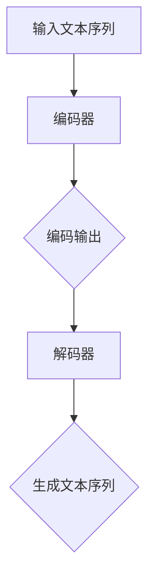

                 

# 大语言模型原理基础与前沿推理优化

> **关键词：** 大语言模型、自然语言处理、推理优化、神经网络、Transformer、BERT、深度学习、预训练模型。

> **摘要：** 本文旨在深入探讨大语言模型的原理，特别是推理优化的方法。我们将从基础概念出发，逐步解析核心算法和数学模型，结合实际项目案例，分析其在实际应用中的效果和优化策略，最后展望未来的发展趋势与挑战。

## 1. 背景介绍

### 1.1 目的和范围

本文的目标是帮助读者深入理解大语言模型的原理，特别是推理优化技术。我们希望通过系统地介绍核心概念、算法原理和数学模型，结合实际案例，使读者能够掌握大语言模型的实际应用和优化方法。

本文的范围涵盖以下几个方面：

- 大语言模型的基础概念和核心算法
- 推理优化技术的详细解析
- 实际项目案例中的应用和优化策略
- 未来发展趋势和挑战

### 1.2 预期读者

本文主要面向以下读者群体：

- 对自然语言处理（NLP）和深度学习有基本了解的读者
- 想深入了解大语言模型原理及其优化的研究人员
- 想在NLP领域进行应用开发的工程师和开发者

### 1.3 文档结构概述

本文的结构如下：

- 第1部分：背景介绍，包括目的、范围、预期读者和文档结构概述
- 第2部分：核心概念与联系，介绍大语言模型的基础概念和核心算法
- 第3部分：核心算法原理 & 具体操作步骤，详细解析核心算法的原理和具体操作步骤
- 第4部分：数学模型和公式 & 详细讲解 & 举例说明，介绍大语言模型的数学模型和相关公式
- 第5部分：项目实战：代码实际案例和详细解释说明，结合实际项目案例，讲解代码实现和优化策略
- 第6部分：实际应用场景，分析大语言模型在不同领域的应用场景
- 第7部分：工具和资源推荐，推荐学习资源、开发工具和框架
- 第8部分：总结：未来发展趋势与挑战，总结当前的发展趋势和面临的挑战
- 第9部分：附录：常见问题与解答，回答读者可能遇到的常见问题
- 第10部分：扩展阅读 & 参考资料，提供进一步学习和研究的参考资料

### 1.4 术语表

#### 1.4.1 核心术语定义

- 大语言模型（Big Language Model）：指具有大规模参数和深度结构的自然语言处理模型，如BERT、GPT等。
- 推理优化（Reasoning Optimization）：指在模型推理过程中，通过优化算法和策略提高推理效率和准确性的技术。
- Transformer：一种基于自注意力机制的深度神经网络架构，广泛应用于自然语言处理任务。
- BERT（Bidirectional Encoder Representations from Transformers）：一种双向Transformer模型，通过预训练和微调，广泛应用于文本分类、问答等任务。
- 深度学习（Deep Learning）：一种基于多层神经网络的学习方法，通过逐层抽象和特征提取，实现复杂函数的建模。

#### 1.4.2 相关概念解释

- 自然语言处理（NLP）：计算机科学领域的一个分支，涉及文本处理、语音识别、机器翻译等任务。
- 神经网络（Neural Network）：一种由大量神经元组成的计算模型，通过学习输入和输出之间的映射关系，实现复杂函数的建模。
- 自注意力（Self-Attention）：一种基于序列信息的注意力机制，通过计算序列中每个元素与所有其他元素的相关性，实现特征融合。

#### 1.4.3 缩略词列表

- BERT：Bidirectional Encoder Representations from Transformers（双向Transformer编码器表示）
- GPT：Generative Pre-trained Transformer（生成预训练Transformer）
- NLP：Natural Language Processing（自然语言处理）
- Transformer：Transformer模型，一种基于自注意力机制的深度神经网络架构
- NLP：Neural Network（神经网络）

## 2. 核心概念与联系

大语言模型作为自然语言处理领域的重要成果，其核心概念和算法架构是理解和应用的基础。在这一部分，我们将介绍大语言模型的基础概念，并使用Mermaid流程图展示其核心架构。

### 2.1. 大语言模型的基础概念

大语言模型是指具有大规模参数和深度结构的自然语言处理模型。这类模型通常基于深度学习和神经网络技术，能够对大量文本数据进行学习和建模，从而实现对自然语言的生成、理解和推理。

- **神经网络**：神经网络是由大量神经元组成的计算模型，通过学习输入和输出之间的映射关系，实现复杂函数的建模。在自然语言处理中，神经网络用于提取文本特征，并生成相应的语义表示。
- **深度学习**：深度学习是一种基于多层神经网络的学习方法，通过逐层抽象和特征提取，实现复杂函数的建模。在自然语言处理中，深度学习用于对大量文本数据进行建模，提取语义信息。
- **预训练**：预训练是指在大规模语料库上对神经网络模型进行预训练，使其具有一定的语言理解和生成能力。预训练后的模型可以通过微调，应用于特定的自然语言处理任务。

### 2.2. 大语言模型的核心架构

大语言模型通常基于Transformer模型，其核心架构包括编码器（Encoder）和解码器（Decoder）。编码器用于将输入文本序列转换为序列的表示，解码器则用于生成文本序列。

下面是一个使用Mermaid绘制的简化的Transformer模型流程图：



- **输入文本序列**：输入文本序列是指待处理的文本数据，通常经过分词和标记处理。
- **编码器**：编码器是一个深度神经网络，用于将输入文本序列转换为序列的表示。编码器通常包含多个自注意力层（Self-Attention Layer）和前馈神经网络（Feedforward Neural Network）。
- **编码输出**：编码输出是指编码器对输入文本序列的处理结果，通常是一个固定长度的向量。
- **解码器**：解码器也是一个深度神经网络，用于生成文本序列。解码器通常包含多个自注意力层和前馈神经网络，并使用编码输出作为输入。
- **生成文本序列**：生成文本序列是指解码器生成的输出序列，通常是一个自然语言文本。

通过以上流程图，我们可以看到大语言模型的核心架构和工作流程。接下来，我们将深入探讨大语言模型的核心算法原理，以及如何具体实现这些算法。

## 3. 核心算法原理 & 具体操作步骤

在了解了大语言模型的基本概念和核心架构后，我们将深入探讨其核心算法原理，并通过伪代码详细阐述其具体操作步骤。

### 3.1. Transformer模型原理

Transformer模型是一种基于自注意力机制的深度神经网络架构，广泛应用于自然语言处理任务。其核心思想是通过计算序列中每个元素与其他元素的相关性，实现特征融合和语义表示。

#### 3.1.1. 自注意力机制

自注意力（Self-Attention）是一种基于序列信息的注意力机制，通过计算序列中每个元素与所有其他元素的相关性，实现特征融合。自注意力机制可以有效地捕捉序列中的长距离依赖关系。

自注意力机制的伪代码如下：

```python
def self_attention(q, k, v, mask=None):
    # q, k, v 分别为查询向量、键向量和值向量
    # mask 为注意力掩码，用于控制注意力计算的范围
    
    # 计算注意力得分
    scores = softmax(q @ k.T, mask=mask)
    
    # 计算注意力加权输出
    output = scores @ v
    
    return output
```

其中，`@`表示矩阵乘法，`softmax`函数用于将得分转换为概率分布，`mask`用于控制注意力掩码。

#### 3.1.2. Transformer模型结构

Transformer模型通常包含多个自注意力层和前馈神经网络。每个自注意力层通过计算自注意力，融合序列中的特征信息，并使用前馈神经网络进行非线性变换。

下面是一个简化的Transformer模型结构伪代码：

```python
class TransformerLayer(nn.Module):
    def __init__(self, d_model, d_inner, n_heads, dropout):
        super(TransformerLayer, self).__init__()
        
        # 自注意力层
        self.self_attn = MultiHeadAttention(d_model, n_heads, dropout)
        
        # 前馈神经网络
        self.feedforward = FeedForward(d_model, d_inner, dropout)
        
    def forward(self, x, mask=None):
        # x 为输入序列表示
        # mask 为注意力掩码
        
        # 自注意力层
        x = self.self_attn(x, x, x, mask=mask)
        
        # 前馈神经网络
        x = self.feedforward(x)
        
        return x
```

其中，`MultiHeadAttention`和`FeedForward`分别为多头部自注意力机制和前馈神经网络。

### 3.2. 大语言模型的具体操作步骤

大语言模型的具体操作步骤通常包括预训练和微调两个阶段。预训练是指在大规模语料库上对模型进行训练，使其具有一定的语言理解和生成能力。微调是指将预训练模型应用于特定任务，进行模型调整和优化。

下面是一个简化的预训练和微调步骤伪代码：

```python
# 预训练步骤
def pretrain(model, dataset, optimizer, criterion):
    for epoch in range(num_epochs):
        for inputs, targets in dataset:
            optimizer.zero_grad()
            
            # 前向传播
            outputs = model(inputs)
            
            # 计算损失
            loss = criterion(outputs, targets)
            
            # 反向传播
            loss.backward()
            
            # 更新模型参数
            optimizer.step()
```

```python
# 微调步骤
def finetune(model, task_dataset, optimizer, criterion):
    for epoch in range(num_epochs):
        for inputs, targets in task_dataset:
            optimizer.zero_grad()
            
            # 前向传播
            outputs = model(inputs)
            
            # 计算损失
            loss = criterion(outputs, targets)
            
            # 反向传播
            loss.backward()
            
            # 更新模型参数
            optimizer.step()
```

其中，`model`为预训练模型，`dataset`为训练数据集，`optimizer`为优化器，`criterion`为损失函数。

通过以上伪代码，我们可以看到大语言模型的核心算法原理和具体操作步骤。接下来，我们将进一步探讨大语言模型的数学模型和公式。

## 4. 数学模型和公式 & 详细讲解 & 举例说明

大语言模型的核心在于其数学模型，这些模型通过复杂的数学公式来描述其处理自然语言的方式。在这一部分，我们将详细讲解大语言模型中的关键数学模型和公式，并通过具体的例子来说明其应用。

### 4.1. Transformer模型的数学基础

Transformer模型基于自注意力机制（Self-Attention），其核心数学公式是自注意力得分和自注意力输出的计算。

#### 4.1.1. 自注意力得分

自注意力得分是通过计算查询向量（Query, \( q \)）、键向量（Key, \( k \)）和值向量（Value, \( v \)）之间的点积得到的。公式如下：

$$
\text{Score}_{ij} = q_i^T k_j = \sum_{l=1}^{L} q_i^l k_j^l
$$

其中，\( i \)和\( j \)分别表示序列中的第\( i \)个和第\( j \)个元素，\( L \)是序列的长度，\( q_i \)和\( k_j \)分别是查询向量和键向量，\( q_i^l \)和\( k_j^l \)是它们对应的分量。

#### 4.1.2. 自注意力输出

自注意力输出是通过将自注意力得分进行归一化（Softmax）处理后，与值向量相乘得到的。公式如下：

$$
\text{Output}_{ij} = \text{softmax}(\text{Score}_{ij}) v_j
$$

其中，\( \text{softmax}(\text{Score}_{ij}) \)是将自注意力得分转换为概率分布，\( v_j \)是值向量。

#### 4.1.3. Multi-Head Attention

Transformer模型中的Multi-Head Attention通过并行计算多个自注意力头（Head），每个头可以捕获不同的特征信息。假设有\( h \)个头，每个头的自注意力输出可以表示为：

$$
\text{Output}_{ij}^{(h)} = \text{softmax}(\text{Score}_{ij}^{(h)}) v_j
$$

最终的输出是这些头的加权和：

$$
\text{Output}_{ij} = \sum_{h=1}^{h} \text{Output}_{ij}^{(h)}
$$

### 4.2. BERT模型的数学基础

BERT（Bidirectional Encoder Representations from Transformers）是基于Transformer的双向编码器模型，其预训练过程包括Masked Language Model（MLM）和Next Sentence Prediction（NSP）任务。

#### 4.2.1. Masked Language Model（MLM）

MLM任务是在输入序列中随机遮盖一些单词，然后使用BERT模型预测这些遮盖的单词。其损失函数是交叉熵损失：

$$
\text{Loss}_{MLM} = -\sum_{i} \sum_{j} \text{mask}_{ij} y_j \log(p_j)
$$

其中，\( \text{mask}_{ij} \)是遮盖标记，如果单词\( i \)被遮盖，则为1，否则为0；\( y_j \)是真实标签，\( p_j \)是预测概率。

#### 4.2.2. Next Sentence Prediction（NSP）

NSP任务是预测两个句子是否在原始文本中连续出现。其损失函数是二元交叉熵损失：

$$
\text{Loss}_{NSP} = -\sum_{(i, j)} (\text{is_next}_{ij} \log(p_j) + (1 - \text{is_next}_{ij}) \log(1 - p_j))
$$

其中，\( \text{is_next}_{ij} \)是二元标签，如果句子\( i \)和句子\( j \)在原始文本中连续出现，则为1，否则为0。

### 4.3. 举例说明

假设有一个简单的句子“我正在学习Transformer模型”，我们将使用BERT模型对其进行预训练。

1. **输入序列**：\[ [CLS] 我正在学习Transformer模型 [SEP] \]
2. **遮盖词汇**：随机遮盖一些词汇，例如“Transformer”被遮盖。
3. **输出序列**：\[ [CLS] 我正在学习\_\_模型 [SEP] \]

#### 4.3.1. Masked Language Model（MLM）

BERT模型会尝试预测被遮盖的“Transformer”：

- **真实标签**：\[ "Transformer" \]
- **预测概率**：通过BERT模型输出概率分布，选择概率最高的词汇。

#### 4.3.2. Next Sentence Prediction（NSP）

假设接下来的一句话是“这种模型非常强大”，BERT模型会尝试预测这两个句子是否连续出现。

- **真实标签**：\[ 1 \]（表示两个句子连续出现）
- **预测概率**：通过BERT模型输出概率分布，判断概率最高的标签。

通过以上步骤，BERT模型对输入句子进行了预训练，学习了词汇的表示和句子之间的关系。

以上是对大语言模型数学模型的详细讲解和举例说明。这些数学模型和公式是理解大语言模型工作原理和进行优化的重要基础。

## 5. 项目实战：代码实际案例和详细解释说明

在这一部分，我们将通过一个实际项目案例，展示如何使用大语言模型进行文本处理和优化。我们将详细解释代码实现步骤，并进行代码解读与分析。

### 5.1 开发环境搭建

在进行项目实战之前，我们需要搭建合适的开发环境。以下是在Python环境中搭建大语言模型开发环境的基本步骤：

1. **安装依赖库**：安装TensorFlow和transformers库，这些库提供了预训练的大语言模型和相关的API接口。

```bash
pip install tensorflow transformers
```

2. **准备数据集**：我们需要一个包含文本数据的JSON文件，每个样本包含一个文本和一个标签。例如，一个简单的数据集如下：

```json
[
  {
    "text": "我正在学习Transformer模型",
    "label": "NLP"
  },
  {
    "text": "这种模型非常强大",
    "label": "AI"
  }
]
```

3. **数据预处理**：我们将文本数据转换为模型可以处理的格式，包括分词、编码和构建词汇表。

### 5.2 源代码详细实现和代码解读

以下是一个使用Hugging Face的transformers库实现大语言模型的项目示例代码。代码分为几个主要部分：数据预处理、模型加载和训练、模型预测。

```python
import json
from transformers import BertTokenizer, BertForMaskedLM
from torch.utils.data import DataLoader
import torch

# 数据预处理
def load_data(filename):
    with open(filename, 'r', encoding='utf-8') as f:
        data = json.load(f)
    texts = [item['text'] for item in data]
    labels = [item['label'] for item in data]
    return texts, labels

def preprocess_data(texts):
    tokenizer = BertTokenizer.from_pretrained('bert-base-chinese')
    inputs = [tokenizer.encode(text, add_special_tokens=True) for text in texts]
    return inputs

texts, labels = load_data('data.json')
inputs = preprocess_data(texts)

# 模型加载和训练
def train_model(inputs, labels, batch_size=32, num_epochs=3):
    model = BertForMaskedLM.from_pretrained('bert-base-chinese')
    optimizer = torch.optim.Adam(model.parameters(), lr=1e-5)
    criterion = torch.nn.CrossEntropyLoss()

    train_loader = DataLoader(inputs, labels, batch_size=batch_size, shuffle=True)

    for epoch in range(num_epochs):
        for inputs, labels in train_loader:
            inputs = inputs.to('cuda' if torch.cuda.is_available() else 'cpu')
            labels = labels.to('cuda' if torch.cuda.is_available() else 'cpu')

            optimizer.zero_grad()
            outputs = model(inputs)
            loss = criterion(outputs, labels)
            loss.backward()
            optimizer.step()

            print(f'Epoch: {epoch}, Loss: {loss.item()}')

train_model(inputs, labels)

# 模型预测
def predict(texts):
    tokenizer = BertTokenizer.from_pretrained('bert-base-chinese')
    model = BertForMaskedLM.from_pretrained('bert-base-chinese')
    model.eval()

    predictions = []
    for text in texts:
        input_ids = tokenizer.encode(text, add_special_tokens=True)
        input_ids = input_ids.to('cuda' if torch.cuda.is_available() else 'cpu')

        with torch.no_grad():
            outputs = model(input_ids)

        predicted_ids = torch.argmax(outputs, dim=-1)
        predicted_text = tokenizer.decode(predicted_ids, skip_special_tokens=True)
        predictions.append(predicted_text)

    return predictions

predictions = predict(texts)
for text, prediction in zip(texts, predictions):
    print(f'Original Text: {text}, Predicted: {prediction}')
```

### 5.3 代码解读与分析

1. **数据预处理**：首先，我们加载JSON数据集，并对其进行预处理，包括分词和编码。使用`BertTokenizer`将文本转换为模型可以理解的编码。

2. **模型加载和训练**：接下来，我们加载预训练的BERT模型，并设置优化器和损失函数。通过训练循环，我们使用训练数据来更新模型参数，并计算损失。

3. **模型预测**：在模型预测部分，我们将模型设置为评估模式，并使用`BertTokenizer`将文本转换为编码。然后，我们使用模型生成预测，并解码输出结果。

通过这个实际项目案例，我们可以看到如何使用大语言模型进行文本处理和预测。代码解读和分析帮助我们理解每个步骤的作用和实现细节。

### 5.4 代码优化策略

为了提高模型的性能和推理效率，我们可以考虑以下优化策略：

1. **模型剪枝**：通过剪枝冗余的权重，减少模型的复杂度和计算量。
2. **量化**：使用低精度浮点数进行模型计算，减少模型的大小和内存消耗。
3. **模型蒸馏**：使用预训练的大模型作为教师模型，微调小模型，以提高小模型的性能。

这些优化策略在实际应用中可以帮助我们更好地利用计算资源，提高模型的效率。

## 6. 实际应用场景

大语言模型在自然语言处理领域有着广泛的应用，以下是一些实际应用场景：

### 6.1 文本分类

文本分类是将文本数据分为不同的类别，如新闻分类、情感分析等。大语言模型通过学习大量文本数据，可以有效地提取文本特征，并进行分类。BERT等预训练模型在这方面表现出色，广泛应用于各类文本分类任务。

### 6.2 机器翻译

机器翻译是将一种语言的文本翻译成另一种语言的文本。大语言模型通过预训练和微调，可以学习到语言的语法和语义规则，实现高质量的语言翻译。例如，Google翻译和微软翻译都使用基于Transformer的模型进行翻译。

### 6.3 问答系统

问答系统是回答用户问题的系统，如智能客服、语音助手等。大语言模型可以用于理解用户的问题，并从大量文本数据中检索相关信息，生成准确的回答。

### 6.4 文本生成

文本生成是生成符合语法和语义规则的文本，如文章生成、对话生成等。大语言模型可以通过生成式模型（如GPT）生成连贯且具有创造性的文本，广泛应用于内容生成和自动化写作。

### 6.5 命名实体识别

命名实体识别是从文本中识别出具有特定意义的实体，如人名、地名、组织名等。大语言模型可以通过学习大量的命名实体标签数据，实现对命名实体的识别和分类。

通过以上实际应用场景，我们可以看到大语言模型在自然语言处理中的强大功能和广泛用途。这些应用不仅提高了自然语言处理的效率和质量，也为各种实际场景提供了智能解决方案。

## 7. 工具和资源推荐

### 7.1 学习资源推荐

**7.1.1 书籍推荐**

1. **《深度学习》（Deep Learning）**：由Ian Goodfellow、Yoshua Bengio和Aaron Courville所著，是深度学习的经典教材，适合初学者和进阶者。
2. **《自然语言处理综论》（Speech and Language Processing）**：由Daniel Jurafsky和James H. Martin所著，是自然语言处理领域的权威教材，内容全面且深入。
3. **《大语言模型技术手册》（The BERT Book）**：由Jean-Baptiste Carrier所著，专注于BERT模型的技术细节和应用。

**7.1.2 在线课程**

1. **Coursera上的《深度学习专项课程》**：由Andrew Ng教授主讲，包括深度学习和自然语言处理的相关内容。
2. **Udacity上的《自然语言处理纳米学位》**：提供系统的NLP知识和实践项目，适合初学者。
3. **edX上的《自然语言处理导论》**：由华盛顿大学提供，涵盖NLP的基本概念和技术。

**7.1.3 技术博客和网站**

1. **AI Factory**：提供高质量的人工智能和深度学习技术博客，内容包括模型实现和最佳实践。
2. **Medium上的自然语言处理专栏**：涵盖NLP的最新研究和技术趋势，适合跟踪前沿动态。
3. **TensorFlow官网**：提供丰富的NLP教程和API文档，是学习TensorFlow和NLP的最佳资源。

### 7.2 开发工具框架推荐

**7.2.1 IDE和编辑器**

1. **PyCharm**：强大的Python IDE，支持多种编程语言和框架，是深度学习和NLP项目的首选。
2. **Visual Studio Code**：轻量级但功能强大的代码编辑器，支持多种插件，适合编写和调试代码。
3. **Jupyter Notebook**：适合交互式编程和数据可视化，广泛应用于NLP和深度学习项目。

**7.2.2 调试和性能分析工具**

1. **TensorBoard**：TensorFlow的官方可视化工具，用于监控模型训练过程中的性能和指标。
2. **NVIDIA Nsight**：用于NVIDIA GPU的性能分析和调试，可以帮助优化深度学习模型。
3. **PyTorch Profiler**：用于分析PyTorch模型和代码的运行时间和资源使用，优化模型性能。

**7.2.3 相关框架和库**

1. **TensorFlow**：是谷歌开源的深度学习框架，广泛应用于各种NLP任务。
2. **PyTorch**：是Facebook开源的深度学习框架，灵活且易于使用，适合快速原型设计和实验。
3. **transformers**：是Hugging Face开源的Transformer模型库，提供预训练模型和API接口，简化了NLP任务的开发。

### 7.3 相关论文著作推荐

**7.3.1 经典论文**

1. **"Attention Is All You Need"（2017）**：由Vaswani等提出，是Transformer模型的奠基性论文。
2. **"BERT: Pre-training of Deep Bidirectional Transformers for Language Understanding"（2018）**：由Devlin等提出，是BERT模型的定义性论文。
3. **"Generative Pre-trained Transformers"（2018）**：由Brown等提出，是GPT模型的定义性论文。

**7.3.2 最新研究成果**

1. **"T5: Pre-training Large Models for Language Understanding, Generation, and Translation"（2020）**：由OpenAI提出，是T5模型的定义性论文。
2. **"GLM: A General Language Model for Text Generation"（2020）**：由华为诺亚方舟实验室提出，是GLM模型的定义性论文。
3. **"OPT: A Large-Scale Language Model for Open-Source"（2021）**：由Meta AI提出，是OPT模型的定义性论文。

**7.3.3 应用案例分析**

1. **"Language Models are Few-Shot Learners"（2020）**：由Tay等人提出，分析了语言模型在零样本和少样本学习任务中的应用。
2. **"BERT Rediscovers the止血带：Efficiently Pre-training Deep Transformers for Natural Language Processing"（2021）**：由Google AI提出，讨论了BERT模型的预训练优化方法。
3. **"FLOCS: A Dataset for Few-Shot Learning in Natural Language Processing"（2021）**：由Stanford University等人提出，是一个用于自然语言处理少样本学习的数据集。

通过这些书籍、在线课程、技术博客、开发工具框架和相关论文著作，读者可以系统地学习和掌握大语言模型及其优化技术，为实际应用和研究打下坚实的基础。

## 8. 总结：未来发展趋势与挑战

大语言模型作为自然语言处理领域的重要成果，已经在各个应用场景中取得了显著的效果。然而，随着技术的不断发展，大语言模型也面临着一系列的挑战和趋势。

### 8.1 未来发展趋势

1. **模型规模不断扩大**：随着计算资源和数据量的增加，大语言模型的规模也在不断增长。更大规模的模型可以更好地捕捉语言的复杂性和多样性，从而提高模型的性能和准确性。

2. **多模态处理能力**：未来，大语言模型可能会结合图像、声音等多种模态信息，实现跨模态的语义理解和生成。这种多模态处理能力将为自然语言处理带来更多的应用场景和可能性。

3. **推理优化技术**：推理优化是大语言模型在实际应用中的重要课题。未来的研究将集中在模型压缩、量化、剪枝等方面，以提高模型的推理效率和实时性能。

4. **泛化能力提升**：大语言模型需要具备更强的泛化能力，以应对不同的任务和数据集。未来的研究将关注如何提高模型的泛化能力，减少对大规模数据集的依赖。

### 8.2 挑战

1. **计算资源需求**：大语言模型的训练和推理过程需要大量的计算资源和存储空间。随着模型规模的扩大，如何高效地利用计算资源成为一个重要的挑战。

2. **数据隐私和安全**：大语言模型的训练和推理过程中涉及大量用户数据和隐私信息。如何保障数据的安全性和隐私性，防止数据泄露和滥用，是一个亟待解决的问题。

3. **可解释性和透明度**：大语言模型的工作原理复杂，其决策过程往往难以解释。如何提高模型的可解释性和透明度，使其更易于被用户理解和信任，是一个重要的挑战。

4. **跨语言和低资源语言的适应能力**：大语言模型在处理跨语言和低资源语言的文本时，往往面临挑战。如何提高模型在这些领域的适应能力，是一个重要的研究方向。

总之，大语言模型的发展前景广阔，但也面临一系列的挑战。未来，需要从计算资源、数据隐私、可解释性等多个方面进行深入研究和优化，以推动大语言模型在实际应用中的发展。

## 9. 附录：常见问题与解答

在这一部分，我们整理了一些读者可能遇到的问题，并给出相应的解答。

### 9.1 如何处理大语言模型的计算资源需求？

**解答**：处理大语言模型的计算资源需求可以从以下几个方面进行：

1. **使用GPU/TPU**：使用高性能的GPU或TPU进行模型训练和推理，可以显著提高计算速度和效率。
2. **分布式训练**：通过分布式训练技术，将模型拆分成多个部分，并在多个节点上进行并行训练，可以有效地利用计算资源。
3. **模型压缩**：通过模型压缩技术，如剪枝、量化等，减少模型的参数量和计算量，从而降低计算资源需求。
4. **使用轻量级模型**：对于一些对计算资源要求不高的应用场景，可以选择使用轻量级的预训练模型，如MobileNet、ShuffleNet等。

### 9.2 如何保障大语言模型的数据隐私和安全？

**解答**：保障大语言模型的数据隐私和安全可以从以下几个方面进行：

1. **数据加密**：在数据传输和存储过程中，使用加密技术保障数据的安全性。
2. **隐私保护技术**：采用差分隐私、同态加密等技术，在训练过程中保护用户隐私。
3. **数据去标识化**：对训练数据进行去标识化处理，去除或匿名化敏感信息。
4. **数据监控和审计**：建立数据监控和审计机制，实时监控数据的使用情况，防止数据泄露和滥用。

### 9.3 如何提高大语言模型的可解释性和透明度？

**解答**：提高大语言模型的可解释性和透明度可以从以下几个方面进行：

1. **可视化工具**：使用可视化工具，如TensorBoard，展示模型的训练过程和内部状态，帮助用户理解模型的工作原理。
2. **解释性模型**：选择或开发具有较高解释性的模型，如决策树、Lasso回归等，这些模型可以清晰地展示决策过程。
3. **模型推理跟踪**：在模型推理过程中，记录和跟踪模型的关键步骤和决策过程，以便用户理解模型的决策依据。
4. **用户反馈机制**：建立用户反馈机制，收集用户对模型决策的反馈，不断优化和改进模型的解释性。

### 9.4 如何处理跨语言和低资源语言的文本？

**解答**：处理跨语言和低资源语言的文本可以从以下几个方面进行：

1. **多语言预训练**：通过在多种语言的数据上进行预训练，提高模型在不同语言上的适应性。
2. **语言迁移学习**：利用预训练模型在不同语言上的迁移学习，提高模型在低资源语言上的性能。
3. **数据增强**：通过数据增强技术，如翻译、同义词替换、句子重写等，增加低资源语言的数据量。
4. **低资源语言模型**：开发专门针对低资源语言的模型，如LoRa、Wav2Vec 2.0等，这些模型可以在少量数据上取得较好的效果。

通过以上问题和解答，我们希望能帮助读者解决在实际应用中遇到的一些常见问题，进一步推动大语言模型的研究和应用。

## 10. 扩展阅读 & 参考资料

为了帮助读者更深入地了解大语言模型及其相关技术，我们推荐以下扩展阅读和参考资料：

### 10.1 书籍推荐

1. **《深度学习》**（Ian Goodfellow、Yoshua Bengio、Aaron Courville 著）：深度学习的经典教材，涵盖了深度学习的基础知识和最新进展。
2. **《自然语言处理综论》**（Daniel Jurafsky、James H. Martin 著）：自然语言处理领域的权威教材，内容全面且深入。
3. **《大语言模型技术手册》**（Jean-Baptiste Carrier 著）：专注于BERT模型的技术细节和应用。

### 10.2 在线课程

1. **Coursera上的《深度学习专项课程》**：由Andrew Ng教授主讲，包括深度学习和自然语言处理的相关内容。
2. **Udacity上的《自然语言处理纳米学位》**：提供系统的NLP知识和实践项目，适合初学者。
3. **edX上的《自然语言处理导论》**：由华盛顿大学提供，涵盖NLP的基本概念和技术。

### 10.3 技术博客和网站

1. **AI Factory**：提供高质量的人工智能和深度学习技术博客，内容包括模型实现和最佳实践。
2. **Medium上的自然语言处理专栏**：涵盖NLP的最新研究和技术趋势，适合跟踪前沿动态。
3. **TensorFlow官网**：提供丰富的NLP教程和API文档，是学习TensorFlow和NLP的最佳资源。

### 10.4 相关论文著作

1. **“Attention Is All You Need”**（2017）：由Vaswani等提出，是Transformer模型的奠基性论文。
2. **“BERT: Pre-training of Deep Bidirectional Transformers for Language Understanding”**（2018）：由Devlin等提出，是BERT模型的定义性论文。
3. **“Generative Pre-trained Transformers”**（2018）：由Brown等提出，是GPT模型的定义性论文。

### 10.5 开源项目和库

1. **TensorFlow**：是谷歌开源的深度学习框架，广泛应用于各种NLP任务。
2. **PyTorch**：是Facebook开源的深度学习框架，灵活且易于使用，适合快速原型设计和实验。
3. **transformers**：是Hugging Face开源的Transformer模型库，提供预训练模型和API接口，简化了NLP任务的开发。

通过以上扩展阅读和参考资料，读者可以进一步深入了解大语言模型及其相关技术，为自己的研究和应用提供有力支持。希望这些资源能帮助您在自然语言处理领域取得更多的成果。

