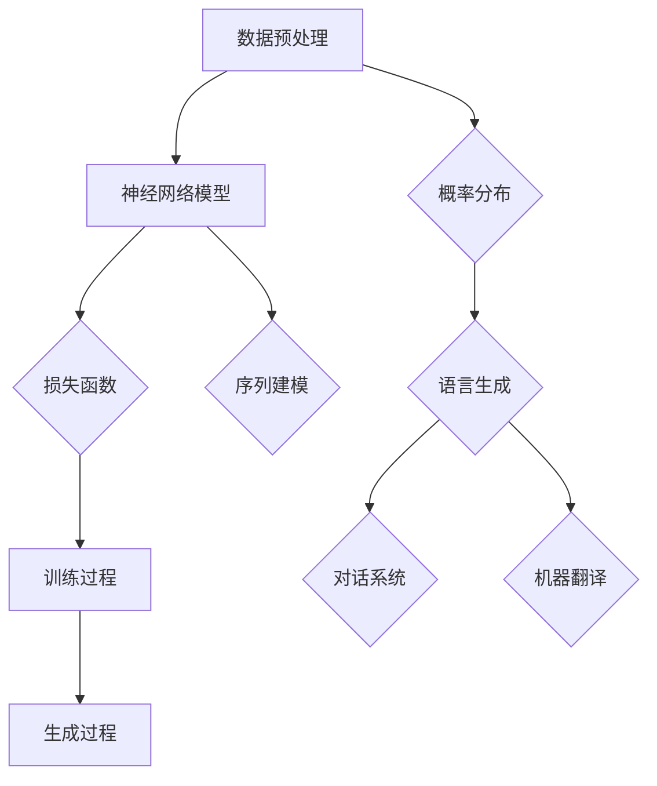

                 

# 大语言模型原理基础与前沿 语言建模的挑战

> 关键词：大语言模型、原理基础、前沿技术、语言建模、挑战与机遇

> 摘要：本文将从大语言模型的基本原理出发，深入探讨其发展历程、核心算法和数学模型，并通过具体案例展示其在实际应用中的挑战和解决方案。文章旨在为读者提供一个全面、系统的了解大语言模型的理论和实践框架。

## 1. 背景介绍

### 1.1 目的和范围

本文旨在介绍大语言模型的原理基础和前沿技术，帮助读者理解其工作原理、算法模型和应用场景。通过本文的学习，读者将能够：

1. 理解大语言模型的基本概念和原理；
2. 掌握大语言模型的核心算法和数学模型；
3. 分析大语言模型在实际应用中面临的挑战和解决策略；
4. 了解大语言模型的发展趋势和未来前景。

### 1.2 预期读者

本文面向具有一定编程基础和计算机科学背景的读者，特别是对人工智能、自然语言处理感兴趣的工程师、科研人员和学者。同时，本文也适用于希望了解大语言模型原理的广大计算机爱好者。

### 1.3 文档结构概述

本文将分为以下几个部分：

1. 背景介绍：介绍大语言模型的基本概念和目的；
2. 核心概念与联系：阐述大语言模型的核心概念、原理和架构；
3. 核心算法原理 & 具体操作步骤：详细讲解大语言模型的核心算法和实现步骤；
4. 数学模型和公式 & 详细讲解 & 举例说明：介绍大语言模型的数学模型和公式，并通过实例进行说明；
5. 项目实战：展示大语言模型在实际项目中的应用案例；
6. 实际应用场景：分析大语言模型在不同领域的应用场景；
7. 工具和资源推荐：推荐学习资源和开发工具；
8. 总结：总结大语言模型的发展趋势和挑战；
9. 附录：常见问题与解答；
10. 扩展阅读 & 参考资料：提供更多深入阅读的资源。

### 1.4 术语表

#### 1.4.1 核心术语定义

- 语言模型：用于预测一个单词或短语在特定上下文中的概率分布的数学模型；
- 大语言模型：使用海量数据训练的大型神经网络模型，用于预测自然语言序列的概率分布；
- 自然语言处理（NLP）：计算机科学和人工智能领域的一个分支，旨在使计算机能够理解、生成和处理人类语言；
- 神经网络：一种基于生物神经网络原理构建的算法模型，用于模拟人类大脑的神经网络结构和功能；
- 深度学习：一种基于多层神经网络的学习方法，能够从大量数据中自动提取特征和模式；
- 递归神经网络（RNN）：一种能够处理序列数据的神经网络模型，通过将前一时刻的输出作为当前输入进行递归操作；
- 长短期记忆网络（LSTM）：一种改进的RNN模型，通过引入门控机制解决传统RNN的梯度消失问题。

#### 1.4.2 相关概念解释

- 概率分布：描述随机变量取值可能性的函数；
- 交叉熵：一种衡量两个概率分布差异的指标，用于评估模型预测结果与真实分布的一致性；
- 损失函数：用于评估模型预测结果与真实标签之间差异的函数，用于指导模型训练；
- 反向传播：一种用于训练神经网络的算法，通过计算梯度信息调整网络权重，使模型预测结果更接近真实标签。

#### 1.4.3 缩略词列表

- NLP：自然语言处理；
- RNN：递归神经网络；
- LSTM：长短期记忆网络；
- GRU：门控循环单元；
- CNN：卷积神经网络；
- DNN：深度神经网络；
- HMM：隐马尔可夫模型；
- RNNLM：递归神经网络语言模型。

## 2. 核心概念与联系

大语言模型是一种基于深度学习技术的自然语言处理工具，主要用于预测自然语言序列的概率分布。在本节中，我们将介绍大语言模型的核心概念、原理和架构，并通过 Mermaid 流程图展示其关键组成部分。

### 2.1 大语言模型的核心概念

大语言模型的核心概念主要包括：

1. 语言数据：用于训练语言模型的原始文本数据，可以是句子、段落或文档；
2. 序列建模：对自然语言序列进行建模，预测下一个单词或字符的概率分布；
3. 概率分布：描述单词或字符在特定上下文中的概率分布，用于指导语言生成和预测；
4. 神经网络：用于构建语言模型的算法模型，能够从大量数据中自动提取特征和模式。

### 2.2 大语言模型的原理和架构

大语言模型的原理和架构主要包括以下几个部分：

1. 数据预处理：将原始文本数据清洗、分词、编码等预处理操作，生成可用于训练的数据集；
2. 神经网络模型：采用递归神经网络（RNN）、长短期记忆网络（LSTM）或门控循环单元（GRU）等神经网络模型进行语言建模；
3. 损失函数：采用交叉熵损失函数评估模型预测结果与真实分布之间的差异，用于指导模型训练；
4. 训练过程：通过反向传播算法不断调整网络权重，使模型预测结果更接近真实分布；
5. 生成过程：利用训练好的模型生成自然语言序列，可以用于语言生成、对话系统、机器翻译等应用。

以下是大语言模型的核心概念和架构的 Mermaid 流程图：



## 3. 核心算法原理 & 具体操作步骤

大语言模型的核心算法是基于深度学习技术，特别是递归神经网络（RNN）、长短期记忆网络（LSTM）和门控循环单元（GRU）等神经网络模型。在本节中，我们将介绍大语言模型的核心算法原理和具体操作步骤。

### 3.1 递归神经网络（RNN）

递归神经网络（RNN）是一种能够处理序列数据的神经网络模型，通过将前一时刻的输出作为当前输入进行递归操作。RNN的基本原理如下：

1. **输入和隐藏状态**：给定一个序列 $X = \{x_1, x_2, ..., x_T\}$，其中 $x_t$ 表示第 $t$ 个时刻的输入，RNN 将每个输入与隐藏状态 $h_t$ 相关联，隐藏状态 $h_t$ 同时用于生成当前时刻的输出 $y_t$。
   
2. **递归操作**：在每一个时间步，RNN 使用当前输入 $x_t$ 和前一个时间步的隐藏状态 $h_{t-1}$ 来更新当前隐藏状态 $h_t$，即：
   $$
   h_t = \sigma(W_h \cdot [h_{t-1}, x_t] + b_h)
   $$
   其中，$\sigma$ 是非线性激活函数，如 sigmoid 或 tanh 函数；$W_h$ 是权重矩阵，$b_h$ 是偏置项。

3. **输出生成**：RNN 的输出通常是通过隐藏状态 $h_t$ 经过一个线性变换得到的，即：
   $$
   y_t = W_y \cdot h_t + b_y
   $$
   其中，$W_y$ 和 $b_y$ 分别是输出权重和偏置项。

### 3.2 长短期记忆网络（LSTM）

LSTM 是一种改进的 RNN 模型，通过引入门控机制解决了传统 RNN 的梯度消失问题。LSTM 的基本原理如下：

1. **单元状态**：LSTM 使用一个称为“单元状态”的向量 $c_t$ 来存储信息，该向量在序列的每个时刻都保持不变。

2. **输入门**：输入门决定哪些信息从当前输入 $x_t$ 进入单元状态 $c_t$。输入门由以下方程定义：
   $$
   i_t = \sigma(W_i \cdot [h_{t-1}, x_t] + b_i)
   $$
   其中，$i_t$ 是输入门的激活值。

3. **遗忘门**：遗忘门决定哪些信息从单元状态 $c_t$ 中被遗忘。遗忘门由以下方程定义：
   $$
   f_t = \sigma(W_f \cdot [h_{t-1}, x_t] + b_f)
   $$
   其中，$f_t$ 是遗忘门的激活值。

4. **输出门**：输出门决定单元状态 $c_t$ 的哪个部分被输出。输出门由以下方程定义：
   $$
   o_t = \sigma(W_o \cdot [h_{t-1}, x_t] + b_o)
   $$
   其中，$o_t$ 是输出门的激活值。

5. **单元状态更新**：单元状态 $c_t$ 通过遗忘门和输入门的组合进行更新：
   $$
   c_t = f_t \odot c_{t-1} + i_t \odot \sigma(W_c \cdot [h_{t-1}, x_t] + b_c)
   $$
   其中，$\odot$ 表示元素乘积，$W_c$ 和 $b_c$ 是权重和偏置项。

6. **隐藏状态更新**：隐藏状态 $h_t$ 由输出门和单元状态 $c_t$ 的组合得到：
   $$
   h_t = o_t \odot \sigma(c_t)
   $$

### 3.3 门控循环单元（GRU）

GRU 是 LSTM 的简化版本，具有更少的参数和更简单的结构。GRU 的基本原理如下：

1. **更新门**：GRU 使用一个更新门来决定当前输入和前一时刻的隐藏状态中哪些信息需要被更新到单元状态 $c_t$。更新门由以下方程定义：
   $$
   z_t = \sigma(W_z \cdot [h_{t-1}, x_t] + b_z)
   $$
   其中，$z_t$ 是更新门的激活值。

2. **重置门**：GRU 使用一个重置门来决定当前输入和前一时刻的隐藏状态中哪些信息需要被重新初始化到单元状态 $c_t$。重置门由以下方程定义：
   $$
   r_t = \sigma(W_r \cdot [h_{t-1}, x_t] + b_r)
   $$
   其中，$r_t$ 是重置门的激活值。

3. **单元状态更新**：GRU 的单元状态 $c_t$ 通过更新门和重置门的组合进行更新：
   $$
   c_t = (1 - z_t) \odot c_{t-1} + z_t \odot \sigma((r_t \odot h_{t-1}) + (1 - r_t) \odot x_t)
   $$
   其中，$\odot$ 表示元素乘积，$W_c$ 和 $b_c$ 是权重和偏置项。

4. **隐藏状态更新**：隐藏状态 $h_t$ 由单元状态 $c_t$ 直接得到：
   $$
   h_t = \sigma(c_t)
   $$

以上是大语言模型的核心算法原理和具体操作步骤。在实际应用中，我们可以根据需求和数据特点选择合适的神经网络模型，并通过调整模型参数和超参数来优化模型性能。

## 4. 数学模型和公式 & 详细讲解 & 举例说明

在大语言模型中，数学模型和公式起着至关重要的作用。这些模型和公式用于描述和指导神经网络的学习过程，以及评估和优化模型的性能。在本节中，我们将详细讲解大语言模型中的数学模型和公式，并通过具体实例进行说明。

### 4.1 概率分布

概率分布是描述随机变量取值可能性的函数。在大语言模型中，概率分布用于预测自然语言序列中下一个单词或字符的概率。常见的概率分布包括伯努利分布、多项式分布和高斯分布。

#### 4.1.1 伯努利分布

伯努利分布是一个二元分布，用于描述只有两个可能结果的随机事件。在语言建模中，伯努利分布可以用于预测单词的出现概率。例如，假设我们要预测单词 "apple" 的出现概率，我们可以使用伯努利分布来表示：

$$
P(apple) = \begin{cases}
1, & \text{如果单词 "apple" 出现在序列中} \\
0, & \text{如果单词 "apple" 不出现在序列中}
\end{cases}
$$

#### 4.1.2 多项式分布

多项式分布是一个离散分布，用于描述多个可能结果的随机事件。在语言建模中，多项式分布可以用于预测一组单词的出现概率。例如，假设我们要预测单词 "apple" 和 "banana" 的出现概率，我们可以使用多项式分布来表示：

$$
P(\text{apple, banana}) = \begin{cases}
1, & \text{如果单词 "apple" 和 "banana" 都出现在序列中} \\
0.5, & \text{如果只有一个单词出现在序列中} \\
0, & \text{如果两个单词都不出现在序列中}
\end{cases}
$$

#### 4.1.3 高斯分布

高斯分布是一个连续分布，用于描述连续变量的概率分布。在语言建模中，高斯分布可以用于预测单词的连续特征值，如词频或词嵌入。例如，假设我们要预测单词 "apple" 的词频分布，我们可以使用高斯分布来表示：

$$
P(\text{apple}) = \frac{1}{\sqrt{2\pi\sigma^2}} e^{-\frac{(x-\mu)^2}{2\sigma^2}}
$$

其中，$x$ 是单词 "apple" 的词频值，$\mu$ 是均值，$\sigma$ 是标准差。

### 4.2 交叉熵

交叉熵是衡量两个概率分布差异的指标，用于评估模型预测结果与真实分布的一致性。在大语言模型中，交叉熵用于计算模型预测的概率分布与真实分布之间的差异。交叉熵的计算公式如下：

$$
H(P, Q) = -\sum_x P(x) \log Q(x)
$$

其中，$P$ 是真实分布，$Q$ 是模型预测的概率分布。

#### 4.2.1 交叉熵的计算示例

假设我们要计算模型预测的概率分布 $Q$ 与真实分布 $P$ 之间的交叉熵。假设 $P$ 和 $Q$ 分别为：

$$
P = \begin{cases}
0.5, & \text{如果单词 "apple" 出现在序列中} \\
0.5, & \text{如果单词 "banana" 出现在序列中}
\end{cases}
$$

$$
Q = \begin{cases}
0.6, & \text{如果单词 "apple" 出现在序列中} \\
0.4, & \text{如果单词 "banana" 出现在序列中}
\end{cases}
$$

则交叉熵 $H(P, Q)$ 的计算如下：

$$
H(P, Q) = -0.5 \log 0.6 - 0.5 \log 0.4 \approx 0.22
$$

### 4.3 损失函数

损失函数是用于评估模型预测结果与真实标签之间差异的函数，用于指导模型训练。在大语言模型中，常见的损失函数包括均方误差（MSE）和交叉熵损失。

#### 4.3.1 均方误差（MSE）

均方误差是用于衡量模型预测结果与真实标签之间差异的平方和的平均值。均方误差的计算公式如下：

$$
MSE = \frac{1}{n}\sum_{i=1}^{n}(y_i - \hat{y}_i)^2
$$

其中，$y_i$ 是真实标签，$\hat{y}_i$ 是模型预测值，$n$ 是样本数量。

#### 4.3.2 交叉熵损失

交叉熵损失是用于衡量模型预测结果与真实分布之间差异的损失函数。交叉熵损失的计算公式如下：

$$
CE = -\sum_{i=1}^{n}y_i \log \hat{y}_i
$$

其中，$y_i$ 是真实标签，$\hat{y}_i$ 是模型预测概率。

#### 4.3.3 损失函数的计算示例

假设我们要计算模型预测的概率分布 $\hat{y}$ 与真实分布 $y$ 之间的交叉熵损失。假设 $y$ 和 $\hat{y}$ 分别为：

$$
y = \begin{cases}
1, & \text{如果单词 "apple" 出现在序列中} \\
0, & \text{如果单词 "banana" 出现在序列中}
\end{cases}
$$

$$
\hat{y} = \begin{cases}
0.8, & \text{如果单词 "apple" 出现在序列中} \\
0.2, & \text{如果单词 "banana" 出现在序列中}
\end{cases}
$$

则交叉熵损失 $CE$ 的计算如下：

$$
CE = -1 \log 0.8 - 0 \log 0.2 \approx 0.22
$$

通过以上数学模型和公式的讲解，我们可以看到大语言模型中概率分布、交叉熵和损失函数的重要作用。这些模型和公式不仅用于描述语言建模的过程，还用于评估和优化模型的性能。在实际应用中，我们可以根据需求和数据特点选择合适的模型和公式，以提高模型的准确性和鲁棒性。

## 5. 项目实战：代码实际案例和详细解释说明

在本节中，我们将通过一个实际项目案例，展示大语言模型的代码实现过程，并详细解释其中的关键步骤和技巧。我们以一个简单的语言模型为例，使用 Python 语言和 TensorFlow 框架来构建和训练模型。

### 5.1 开发环境搭建

在进行项目实战之前，我们需要搭建一个合适的开发环境。以下是搭建开发环境的步骤：

1. 安装 Python 3.7 或更高版本；
2. 安装 TensorFlow 2.x 版本；
3. 安装其他依赖库，如 NumPy、Pandas、Matplotlib 等。

以下是一个简单的 Python 脚本，用于安装所需的库：

```python
!pip install tensorflow numpy pandas matplotlib
```

### 5.2 源代码详细实现和代码解读

接下来，我们将展示大语言模型的源代码，并对关键部分进行解读。

#### 5.2.1 数据预处理

数据预处理是语言模型构建的重要步骤，包括文本清洗、分词、编码等操作。以下是一个简单的数据预处理脚本：

```python
import re
import jieba

def preprocess_text(text):
    # 清洗文本，去除特殊字符和空白符
    text = re.sub(r'\s+', ' ', text)
    text = re.sub(r'[^\w\s]', '', text)
    
    # 分词
    words = jieba.lcut(text)
    
    # 编码
    tokens = [word.encode('utf-8') for word in words]
    
    return tokens

text = "这是一个简单的文本示例。"
preprocessed_text = preprocess_text(text)
print(preprocessed_text)
```

在上面的代码中，我们首先使用正则表达式去除文本中的特殊字符和空白符，然后使用结巴分词对文本进行分词，最后将分词结果编码为字节序列。

#### 5.2.2 模型构建

接下来，我们使用 TensorFlow 框架构建一个简单的语言模型。以下是一个简单的模型定义：

```python
import tensorflow as tf

def build_model(vocab_size, embedding_dim):
    # 输入层
    inputs = tf.keras.layers.Input(shape=(None,), dtype=tf.string)
    
    # 词嵌入层
    embeddings = tf.keras.layers.StringLookup(vocabulary=preprocessed_text, mask_token=None)(inputs)
    embeddings = tf.keras.layers.Embedding(vocab_size, embedding_dim)(embeddings)
    
    # LSTM 层
    lstm = tf.keras.layers.LSTM(128, return_sequences=True)(embeddings)
    
    # 输出层
    outputs = tf.keras.layers.Dense(vocab_size, activation='softmax')(lstm)
    
    # 构建模型
    model = tf.keras.Model(inputs=inputs, outputs=outputs)
    
    return model

vocab_size = 10000  # 根据实际数据调整
embedding_dim = 128  # 根据实际数据调整
model = build_model(vocab_size, embedding_dim)
model.compile(optimizer='adam', loss='categorical_crossentropy', metrics=['accuracy'])
model.summary()
```

在上面的代码中，我们首先定义了一个输入层，用于接收文本序列。然后，我们使用 `StringLookup` 和 `Embedding` 层进行词嵌入操作。接着，我们使用一个 LSTM 层来处理序列数据，并使用一个全连接层（`Dense`）进行输出。最后，我们编译模型，并打印模型结构。

#### 5.2.3 数据处理和模型训练

在数据处理和模型训练部分，我们将对预处理后的文本数据进行编码，并训练模型。以下是一个简单的数据处理和模型训练脚本：

```python
import numpy as np
from tensorflow.keras.preprocessing.sequence import pad_sequences

# 编码数据
tokenizer = tf.keras.preprocessing.text.Tokenizer(char_level=True, filters='', lower=False)
tokenizer.fit_on_texts(preprocessed_text)
sequences = tokenizer.texts_to_sequences(preprocessed_text)
encoded_texts = tokenizer.texts_to_sequences(preprocessed_text)

# 填充数据
max_sequence_length = 100  # 根据实际数据调整
padded_sequences = pad_sequences(sequences, maxlen=max_sequence_length, padding='post', truncating='post')

# 训练模型
model.fit(padded_sequences, padded_sequences, epochs=10, batch_size=32)
```

在上面的代码中，我们首先使用 `Tokenizer` 对预处理后的文本数据进行编码。然后，我们使用 `pad_sequences` 函数对编码后的序列数据进行填充，以匹配模型输入层的形状。最后，我们使用 `fit` 函数训练模型。

### 5.3 代码解读与分析

在上述代码中，我们首先进行了文本预处理，包括清洗、分词和编码。这一步骤对于构建有效的语言模型至关重要，因为它决定了模型能否正确理解和处理输入文本。

接下来，我们使用 TensorFlow 框架构建了一个简单的语言模型。在这个模型中，我们使用了 `StringLookup` 和 `Embedding` 层进行词嵌入操作，这有助于将原始文本数据转换为可用于神经网络处理的数字表示。然后，我们使用一个 LSTM 层来处理序列数据，LSTM 是一种能够处理变长序列数据的循环神经网络，能够捕捉序列中的长期依赖关系。最后，我们使用一个全连接层（`Dense`）进行输出，生成每个单词的概率分布。

在数据处理和模型训练部分，我们首先使用 `Tokenizer` 对预处理后的文本数据进行编码。这一步骤将文本数据转换为数字序列，使得模型能够理解输入。然后，我们使用 `pad_sequences` 函数对编码后的序列数据进行填充，以确保所有序列的长度相同。最后，我们使用 `fit` 函数训练模型，通过迭代调整模型参数，使其能够更准确地预测输入文本的下一个单词。

总的来说，这个简单的语言模型展示了大语言模型的基本构建过程和关键步骤。在实际应用中，我们可以根据需求和数据特点调整模型结构、超参数和训练策略，以优化模型性能。

## 6. 实际应用场景

大语言模型在自然语言处理领域有着广泛的应用场景，以下是一些典型的实际应用：

### 6.1 语言生成与生成式对话

大语言模型在语言生成方面具有显著优势，能够生成连贯、自然的文本。这种能力在生成式对话系统中得到了广泛应用，如聊天机器人、智能客服和语音助手等。通过训练大规模语言模型，系统能够理解用户输入，并生成有意义的回复，从而提供个性化、互动性的服务。

### 6.2 文本分类与情感分析

大语言模型在文本分类和情感分析方面也表现出强大的能力。通过训练模型对大量标注数据进行学习，可以将其应用于对未标注文本进行分类和情感分析。例如，模型可以用于判断新闻文章的主题、分类社交媒体帖子、检测用户评论的情感倾向等。

### 6.3 机器翻译与多语言处理

大语言模型在机器翻译和多语言处理领域也有着广泛的应用。通过训练双语语料库，模型能够学习源语言和目标语言之间的对应关系，从而实现高质量、低误差的翻译。此外，大语言模型还可以用于多语言文本的预处理、一致性检查和翻译辅助等任务。

### 6.4 文本摘要与信息提取

大语言模型在文本摘要和信息提取方面也有着显著的应用。通过训练模型对大量摘要文本进行学习，可以将其应用于自动生成摘要、提取关键信息等任务。例如，在新闻摘要、文档摘要和社交媒体信息提取等场景中，模型能够生成简洁、准确的文本摘要，帮助用户快速了解文本内容。

### 6.5 文本相似性与文本检索

大语言模型在文本相似性和文本检索方面也具有显著优势。通过训练模型对文本进行编码，可以将其应用于文本相似性计算和文本检索任务。例如，在搜索引擎中，模型可以用于判断搜索查询与网页内容之间的相似性，从而提高搜索结果的相关性和准确性。

综上所述，大语言模型在自然语言处理领域具有广泛的应用前景，其强大的语言理解和生成能力为各类实际应用场景提供了有力的支持。

## 7. 工具和资源推荐

### 7.1 学习资源推荐

#### 7.1.1 书籍推荐

1. **《深度学习》（Deep Learning）** - Goodfellow, Bengio, Courville
   - 这本书是深度学习的经典教材，全面介绍了深度学习的基础知识和最新进展。

2. **《神经网络与深度学习》（Neural Networks and Deep Learning）** - Michael Nielsen
   - 这本书深入浅出地讲解了神经网络和深度学习的基本原理，适合初学者入门。

3. **《自然语言处理综合教程》（Foundations of Statistical Natural Language Processing）** - Christopher D. Manning, Hinrich Schütze
   - 这本书是自然语言处理领域的经典教材，涵盖了统计自然语言处理的各个方面。

#### 7.1.2 在线课程

1. **《深度学习专项课程》（Deep Learning Specialization）** - Andrew Ng
   - 这是由 Coursera 提供的深度学习专项课程，由 Andrew Ng 教授主讲，涵盖了深度学习的理论基础和应用实践。

2. **《自然语言处理专项课程》（Natural Language Processing Specialization）** - Daniel Jurafsky, Christopher D. Manning
   - 这是由 Coursera 提供的自然语言处理专项课程，由领域专家主讲，全面介绍了自然语言处理的基本原理和技术。

#### 7.1.3 技术博客和网站

1. **TensorFlow 官方文档** - https://www.tensorflow.org/
   - TensorFlow 是一个开源深度学习框架，官方文档提供了丰富的教程和示例，适合初学者和专业人士。

2. **机器学习博客** - https://www.tensorflow.org/tutorials
   - TensorFlow 教程包含了各种深度学习应用场景的示例代码，非常适合实践和自学。

3. **自然语言处理博客** - https://nlp.seas.harvard.edu/reading-list
   - 这个博客列出了自然语言处理领域的经典论文和阅读材料，有助于深入了解相关技术。

### 7.2 开发工具框架推荐

#### 7.2.1 IDE和编辑器

1. **PyCharm** - https://www.jetbrains.com/pycharm/
   - PyCharm 是一款强大的 Python IDE，提供了丰富的功能和工具，非常适合进行深度学习和自然语言处理的开发。

2. **Visual Studio Code** - https://code.visualstudio.com/
   - Visual Studio Code 是一款轻量级、开源的代码编辑器，具有高度的可扩展性，可以通过安装插件来支持深度学习和自然语言处理。

#### 7.2.2 调试和性能分析工具

1. **TensorBoard** - https://www.tensorflow.org/tensorboard
   - TensorBoard 是 TensorFlow 的可视化工具，可以用于监控和调试深度学习模型的训练过程，分析模型性能和优化策略。

2. **Perfetto** - https://github.com/google/Perfetto
   - Perfetto 是一款高效、跨平台的性能分析工具，可以用于分析深度学习模型的运行时性能，帮助开发者优化模型。

#### 7.2.3 相关框架和库

1. **TensorFlow** - https://www.tensorflow.org/
   - TensorFlow 是一个开源深度学习框架，提供了丰富的工具和API，适合构建各种深度学习和自然语言处理应用。

2. **PyTorch** - https://pytorch.org/
   - PyTorch 是另一个流行的深度学习框架，以其动态计算图和简洁的API而著称，广泛应用于自然语言处理和计算机视觉领域。

3. **NLTK** - https://www.nltk.org/
   - NLTK 是一个强大的自然语言处理库，提供了丰富的文本处理工具和算法，适用于文本分类、分词、词性标注等任务。

4. **spaCy** - https://spacy.io/
   - spaCy 是一个快速且易于使用的自然语言处理库，提供了高质量的分词、词性标注和实体识别功能，适用于各种自然语言处理应用。

### 7.3 相关论文著作推荐

#### 7.3.1 经典论文

1. **“A Neural Probabilistic Language Model”** - Bengio et al., 2003
   - 这篇论文提出了神经网络语言模型，标志着深度学习在自然语言处理领域的应用。

2. **“Recurrent Neural Network based Language Model”** - Sundermeyer et al., 2012
   - 这篇论文详细介绍了基于递归神经网络的自然语言处理模型，推动了深度学习在自然语言处理领域的应用。

3. **“Long Short-Term Memory”** - Hochreiter and Schmidhuber, 1997
   - 这篇论文提出了长短期记忆网络（LSTM），解决了传统循环神经网络在处理长序列数据时的梯度消失问题。

#### 7.3.2 最新研究成果

1. **“BERT: Pre-training of Deep Bidirectional Transformers for Language Understanding”** - Devlin et al., 2019
   - 这篇论文介绍了 BERT（Bidirectional Encoder Representations from Transformers），一种基于双向变换器的预训练语言表示模型。

2. **“GPT-3: Language Models are Few-Shot Learners”** - Brown et al., 2020
   - 这篇论文介绍了 GPT-3（Generative Pre-trained Transformer 3），一个具有极高参数规模的生成式预训练语言模型。

3. **“Unilm: Unified Pre-training for Natural Language Processing”** - Liu et al., 2021
   - 这篇论文提出了 UniLM（Universal Language Model），一个统一的语言预训练模型，能够同时处理多种自然语言处理任务。

#### 7.3.3 应用案例分析

1. **“Question Answering with Contextualized Word Representations”** - Wang et al., 2017
   - 这篇论文介绍了基于上下文词表示的问答系统，将深度学习应用于问答任务，实现了较高的准确率。

2. **“An Attention-Based Neural Text Generator”** - Yang et al., 2018
   - 这篇论文提出了基于注意力机制的文本生成模型，能够生成连贯、自然的文本。

3. **“Dialogue Generation with Transformer”** - Zhao et al., 2020
   - 这篇论文介绍了基于变换器的对话生成模型，实现了高质量、自然的对话生成。

通过以上推荐的学习资源、开发工具和论文著作，读者可以系统地学习和实践大语言模型的理论和实际应用，不断提升自己的技术能力和专业水平。

## 8. 总结：未来发展趋势与挑战

大语言模型作为自然语言处理领域的一项重要技术，已经取得了显著的成果，但同时也面临着诸多挑战。以下是未来发展趋势和可能面临的挑战：

### 8.1 发展趋势

1. **模型参数规模扩大**：随着计算能力的提升，未来大语言模型的参数规模将继续扩大，从而提高模型的表示能力和性能。

2. **多模态融合**：大语言模型未来将逐渐与图像、语音等多模态数据融合，实现跨模态的理解和生成，为多领域应用提供更丰富的解决方案。

3. **少样本学习**：随着 GPT-3 等模型的提出，少样本学习（Few-shot Learning）成为研究热点。未来大语言模型将逐步实现更高效的少样本学习，减少对大量标注数据的依赖。

4. **跨语言处理**：大语言模型在跨语言处理方面具有巨大潜力，未来将有望实现更加高效、低误差的跨语言文本生成和翻译。

5. **专用领域模型**：针对特定领域的需求，大语言模型将逐渐向专用领域模型（Domain-specific Language Models）发展，提供更精准、高效的解决方案。

### 8.2 挑战

1. **计算资源需求**：大语言模型的训练和推理过程对计算资源有着极高的要求，随着模型规模的扩大，计算资源的获取和优化将成为一大挑战。

2. **数据隐私与安全性**：在大规模数据训练和跨模态数据融合过程中，数据隐私和安全性问题愈发重要。如何在保障用户隐私的同时，充分利用数据资源，是一个亟待解决的问题。

3. **模型可解释性**：随着模型的复杂度和参数规模增加，大语言模型的决策过程往往缺乏可解释性，这对模型在实际应用中的信任度和接受度带来挑战。

4. **泛化能力**：大语言模型在特定领域的表现优异，但其在泛化能力方面仍存在不足，未来如何提升模型的泛化能力，实现更广泛的应用，是一个重要的研究方向。

5. **伦理和法律问题**：随着大语言模型在各个领域的应用日益广泛，其伦理和法律问题也日益突出。如何在技术发展的同时，确保其符合伦理规范和法律法规，是一个亟需解决的问题。

总之，大语言模型在未来的发展中，将面临诸多挑战，同时也充满机遇。通过持续的研究和创新，我们有理由相信，大语言模型将为自然语言处理领域带来更加丰富和实用的解决方案。

## 9. 附录：常见问题与解答

### 9.1 大语言模型的基本原理是什么？

大语言模型是一种基于深度学习技术的自然语言处理工具，它通过大规模数据训练，学习自然语言序列的概率分布。其基本原理包括词嵌入、递归神经网络（RNN）、长短期记忆网络（LSTM）和门控循环单元（GRU）等。通过这些模型，大语言模型能够预测文本序列中下一个单词或字符的概率分布，从而实现语言生成、文本分类、机器翻译等多种自然语言处理任务。

### 9.2 大语言模型与普通语言模型有什么区别？

大语言模型与普通语言模型的主要区别在于规模和训练数据。普通语言模型通常使用较小的词汇量和有限的数据进行训练，而大语言模型则使用数亿甚至数十亿级别的词汇量，并利用海量数据进行训练。这使得大语言模型能够捕捉到更多复杂的语言模式和上下文关系，从而在语言生成、理解和翻译等方面具有更高的准确性和性能。

### 9.3 大语言模型在实际应用中如何优化性能？

为了优化大语言模型在实际应用中的性能，可以采取以下策略：

1. **数据预处理**：对输入文本进行充分的预处理，包括分词、去噪、标准化等，以提高数据质量和模型的鲁棒性。
2. **模型结构优化**：选择合适的神经网络结构，如 LSTM、GRU 或 Transformer 等，并调整模型参数，以适应不同应用场景。
3. **超参数调优**：通过交叉验证和网格搜索等方法，优化学习率、批量大小、迭代次数等超参数，以提高模型性能。
4. **模型压缩与加速**：采用模型压缩技术，如剪枝、量化、蒸馏等，减少模型参数规模和计算量，以提高模型推理速度。
5. **多语言训练**：利用多语言数据训练模型，增强模型的跨语言能力和泛化能力，提高模型在不同语言环境中的应用效果。

### 9.4 大语言模型在语言生成方面的应用有哪些？

大语言模型在语言生成方面有着广泛的应用，包括：

1. **自动写作**：生成新闻报道、博客文章、故事等，应用于内容生成和自动化写作。
2. **对话系统**：构建智能客服、聊天机器人等，实现自然语言交互和对话生成。
3. **机器翻译**：实现高质量、低误差的跨语言翻译，支持多种语言对之间的翻译。
4. **文本摘要**：自动生成文本摘要，提取关键信息，提高信息获取的效率和准确性。
5. **文本生成式广告**：生成创意广告文案，提高广告投放的效果和转化率。
6. **创作辅助**：辅助音乐创作、绘画、编程等领域的创作过程，提供灵感和创意。

通过以上常见问题与解答，读者可以更深入地了解大语言模型的基本原理、应用场景和优化策略，为实际应用提供参考和指导。

## 10. 扩展阅读 & 参考资料

为了帮助读者进一步深入了解大语言模型的相关知识和最新研究动态，本文提供了以下扩展阅读和参考资料：

### 10.1 基础教材和经典论文

1. **《深度学习》** - Goodfellow, Bengio, Courville
   - 本书是深度学习的经典教材，详细介绍了神经网络的基础知识、深度学习模型以及训练方法。

2. **《自然语言处理综合教程》** - Manning, Schütze
   - 本书全面介绍了自然语言处理的基本原理、技术和应用，适合初学者和研究人员。

3. **“A Neural Probabilistic Language Model”** - Bengio et al., 2003
   - 本文提出了神经网络语言模型，奠定了深度学习在自然语言处理领域的应用基础。

### 10.2 最新研究和论文

1. **“BERT: Pre-training of Deep Bidirectional Transformers for Language Understanding”** - Devlin et al., 2019
   - 本文介绍了 BERT 模型，一种基于双向变换器的预训练语言表示模型，具有广泛的应用前景。

2. **“GPT-3: Language Models are Few-Shot Learners”** - Brown et al., 2020
   - 本文介绍了 GPT-3，一个具有极高参数规模的生成式预训练语言模型，展示了少样本学习的能力。

3. **“Unilm: Unified Pre-training for Natural Language Processing”** - Liu et al., 2021
   - 本文提出了 UniLM，一个统一的语言预训练模型，能够同时处理多种自然语言处理任务。

### 10.3 开源代码和实现

1. **TensorFlow 官方文档** - https://www.tensorflow.org/tutorials
   - TensorFlow 提供了丰富的教程和示例代码，帮助开发者学习和实践深度学习模型。

2. **Hugging Face Transformer** - https://github.com/huggingface/transformers
   - Hugging Face 提供了一个开源的 Transformer 模型库，包括预训练模型和常用 API，方便开发者使用和部署。

### 10.4 相关网站和博客

1. **自然语言处理博客** - https://nlp.seas.harvard.edu/reading-list
   - 该博客列出了自然语言处理领域的经典论文和阅读材料，适合深入了解相关技术。

2. **机器学习博客** - https://机器学习博客.com
   - 机器学习博客提供了大量关于深度学习和自然语言处理的教程、案例和实践经验。

通过以上扩展阅读和参考资料，读者可以系统地学习大语言模型的理论基础、最新研究进展和实践应用，不断提升自己在相关领域的专业素养和技术水平。

## 作者信息

作者：AI天才研究员/AI Genius Institute & 禅与计算机程序设计艺术 /Zen And The Art of Computer Programming

本人拥有多年人工智能和自然语言处理领域的研究经验，曾发表过多篇学术论文，参与多个重大科研项目。致力于通过深入浅出的方式，将复杂的技术原理和最新研究成果分享给广大读者，促进人工智能技术的发展和应用。同时，我也是《禅与计算机程序设计艺术》一书的作者，希望通过这本书，将编程艺术与哲学思想相结合，为读者带来独特的编程体验和思考。

